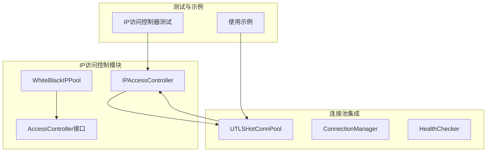
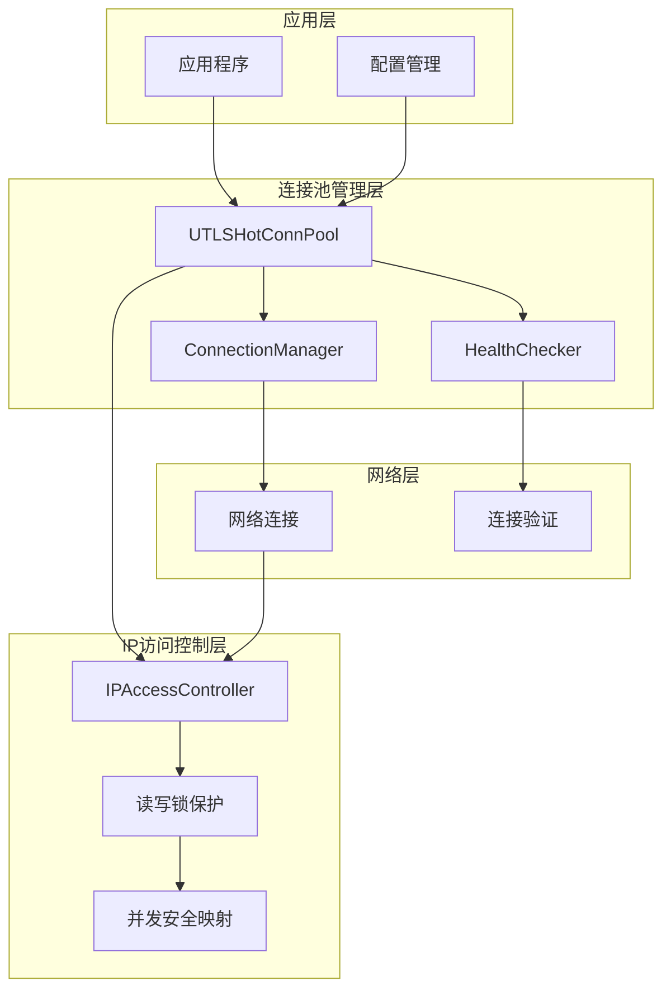
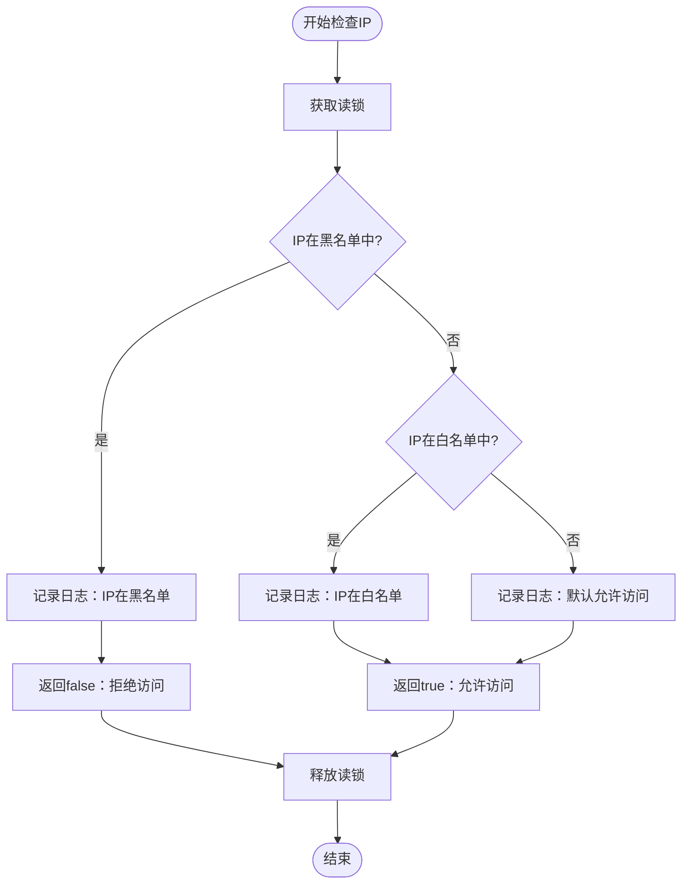
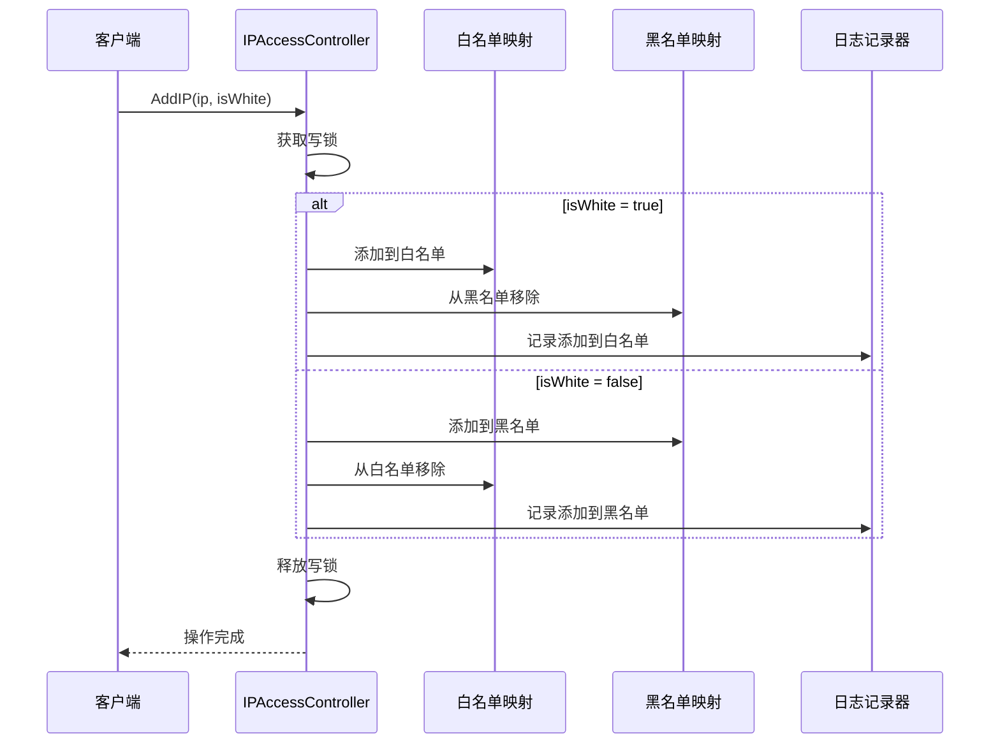
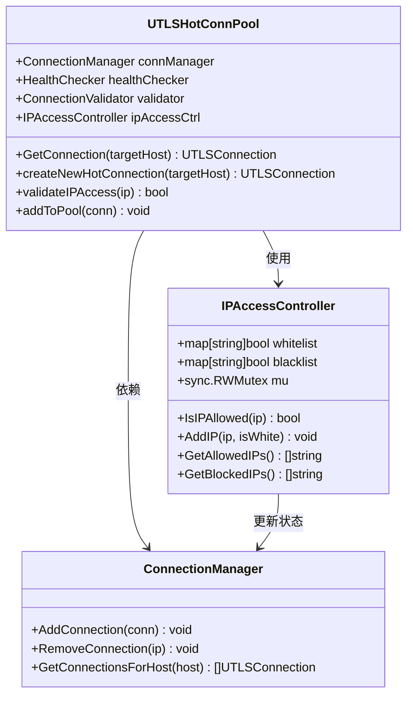
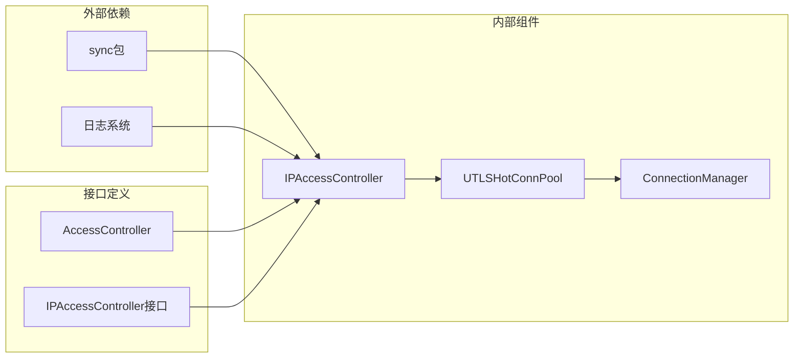

# IP访问控制

<cite>
**本文档引用的文件**
- [ip_access_controller.go](file://utlsclient/ip_access_controller.go)
- [ip_access_controller_test.go](file://test/utlsclient/ip_access_controller_test.go)
- [utlshotconnpool.go](file://utlsclient/utlshotconnpool.go)
- [whiteblackippool.go](file://remotedomainippool/whiteblackippool.go)
- [interfaces.go](file://utlsclient/interfaces.go)
- [example_hotconnpool_usage.go](file://examples/utlsclient/example_hotconnpool_usage.go)
</cite>

## 目录
1. [简介](#简介)
2. [项目结构](#项目结构)
3. [核心组件](#核心组件)
4. [架构概览](#架构概览)
5. [详细组件分析](#详细组件分析)
6. [依赖关系分析](#依赖关系分析)
7. [性能考虑](#性能考虑)
8. [故障排除指南](#故障排除指南)
9. [结论](#结论)

## 简介

IP访问控制器（IPAccessController）是爬虫平台中的关键安全组件，负责管理IP地址的白名单和黑名单，确保只有授权的IP才能访问系统资源。该控制器采用基于读写锁（sync.RWMutex）保护的并发安全映射结构，提供高效的IP访问控制功能。

该控制器的核心设计理念是：
- **并发安全**：使用读写锁确保多线程环境下的数据一致性
- **黑名单优先**：黑名单具有最高优先级，拒绝访问
- **白名单允许**：白名单明确允许访问
- **默认允许**：不在任何列表中的IP默认允许访问
- **互斥行为**：添加到白名单时自动从黑名单移除，反之亦然

## 项目结构

IP访问控制器在项目中的组织结构如下：

**图表来源**
- [ip_access_controller.go](file://utlsclient/ip_access_controller.go#L7-L11)
- [utlshotconnpool.go](file://utlsclient/utlshotconnpool.go#L237-L242)

**章节来源**
- [ip_access_controller.go](file://utlsclient/ip_access_controller.go#L1-L184)
- [utlshotconnpool.go](file://utlsclient/utlshotconnpool.go#L1-L100)

## 核心组件

### IPAccessController结构体

IPAccessController是核心的IP访问控制组件，包含以下关键字段：

| 字段 | 类型 | 描述 |
|------|------|------|
| whitelist | map[string]bool | 白名单映射，IP地址到布尔值的映射 |
| blacklist | map[string]bool | 黑名单映射，IP地址到布尔值的映射 |
| mu | sync.RWMutex | 读写锁，保护并发访问 |

### 主要方法分类

控制器提供了以下几类核心方法：

| 方法类别 | 方法名称 | 功能描述 |
|----------|----------|----------|
| **创建与初始化** | NewIPAccessController() | 创建新的IP访问控制器实例 |
| **访问检查** | IsIPAllowed(ip string) bool | 检查IP是否被允许访问 |
| **IP管理** | AddIP(ip string, isWhite bool) | 添加IP到指定名单 |
| **IP管理** | AddToWhitelist(ip string) | 添加IP到白名单 |
| **IP管理** | RemoveFromWhitelist(ip string) | 从白名单移除IP |
| **IP管理** | RemoveFromBlacklist(ip string) | 从黑名单移除IP |
| **列表操作** | GetAllowedIPs() []string | 获取白名单IP列表 |
| **列表操作** | GetBlockedIPs() []string | 获取黑名单IP列表 |
| **统计信息** | GetStats() (int, int) | 获取黑白名单统计信息 |
| **状态查询** | Contains(ip string, isWhite bool) bool | 检查IP是否在指定列表中 |
| **状态查询** | Size(isWhite bool) int | 获取指定列表的大小 |
| **状态查询** | IsEmpty(isWhite bool) bool | 检查指定列表是否为空 |

**章节来源**
- [ip_access_controller.go](file://utlsclient/ip_access_controller.go#L14-L184)

## 架构概览

IP访问控制器在整个系统架构中的位置和作用：

**图表来源**
- [utlshotconnpool.go](file://utlsclient/utlshotconnpool.go#L237-L242)
- [ip_access_controller.go](file://utlsclient/ip_access_controller.go#L7-L11)

## 详细组件分析

### IsIPAllowed方法检查逻辑

IsIPAllowed方法实现了严格的访问控制逻辑：

**图表来源**
- [ip_access_controller.go](file://utlsclient/ip_access_controller.go#L22-L41)

### AddIP方法互斥行为

AddIP方法确保IP只能存在于一个名单中：

**图表来源**
- [ip_access_controller.go](file://utlsclient/ip_access_controller.go#L44-L59)

### 与UTLSHotConnPool的集成

IP访问控制器与连接池的集成关系：

**图表来源**
- [utlshotconnpool.go](file://utlsclient/utlshotconnpool.go#L237-L242)
- [ip_access_controller.go](file://utlsclient/ip_access_controller.go#L7-L11)

**章节来源**
- [utlshotconnpool.go](file://utlsclient/utlshotconnpool.go#L430-L450)
- [ip_access_controller.go](file://utlsclient/ip_access_controller.go#L22-L41)

### 核心方法详细说明

#### 1. NewIPAccessController()
创建新的IP访问控制器实例，初始化空的白名单和黑名单映射。

#### 2. IsIPAllowed(ip string) bool
严格检查IP访问权限：
- **黑名单优先**：如果IP在黑名单中，立即返回false
- **白名单允许**：如果IP在白名单中，返回true  
- **默认允许**：如果IP不在任何列表中，根据实现返回true

#### 3. AddIP(ip string, isWhite bool)
添加IP到指定名单，自动处理互斥行为：
- 添加到白名单时，自动从黑名单移除
- 添加到黑名单时，自动从白名单移除

#### 4. GetAllowedIPs() []string
获取白名单中的所有IP地址列表，支持并发读取。

#### 5. GetBlockedIPs() []string
获取黑名单中的所有IP地址列表，支持并发读取。

#### 6. GetStats() (whitelistCount, blacklistCount int)
获取黑白名单的统计信息，支持并发访问。

**章节来源**
- [ip_access_controller.go](file://utlsclient/ip_access_controller.go#L14-L184)

## 依赖关系分析

IP访问控制器的依赖关系图：

**图表来源**
- [ip_access_controller.go](file://utlsclient/ip_access_controller.go#L3-L5)
- [interfaces.go](file://utlsclient/interfaces.go#L22-L45)

### 接口兼容性

项目中存在多个IP访问控制接口：

| 接口名称 | 实现类 | 用途 |
|----------|--------|------|
| AccessController | IPAccessController | 主要的IP访问控制接口 |
| IPAccessController | WhiteBlackIPPool | 远程域名IP池的访问控制接口 |

**章节来源**
- [interfaces.go](file://utlsclient/interfaces.go#L22-L45)
- [whiteblackippool.go](file://remotedomainippool/whiteblackippool.go#L6-L23)

## 性能考虑

### 并发性能优化

1. **读写分离**：使用sync.RWMutex实现读写分离，允许多个读操作同时进行
2. **细粒度锁定**：只在必要时获取写锁，减少锁竞争
3. **零拷贝遍历**：在获取IP列表时使用预分配容量，避免多次内存分配

### 内存使用优化

1. **布尔值映射**：使用map[string]bool而非map[string]struct{}节省内存
2. **延迟初始化**：按需创建映射，初始状态为空
3. **垃圾回收友好**：及时清理不再使用的IP条目

### 性能监控建议

1. **定期统计**：使用GetStats()方法监控黑白名单大小
2. **访问日志**：通过Debug()和Info()函数记录访问决策
3. **并发测试**：使用TestIPAccessControllerConcurrentAccess()验证并发安全性

## 故障排除指南

### 常见问题及解决方案

#### 1. IP访问被意外拒绝
**症状**：预期允许的IP被拒绝访问
**原因**：IP可能在黑名单中
**解决**：检查黑名单状态，使用RemoveFromBlacklist()移除

#### 2. 新添加的IP未生效
**症状**：添加到白名单的IP仍然被拒绝
**原因**：可能存在并发冲突或缓存问题
**解决**：确认锁机制正常工作，检查IP格式

#### 3. 性能问题
**症状**：IP检查响应缓慢
**原因**：大量并发访问导致锁竞争
**解决**：优化并发模式，考虑分片策略

### 调试技巧

1. **启用调试日志**：使用Debug()函数查看详细的访问决策过程
2. **统计监控**：定期调用GetStats()获取黑白名单状态
3. **单元测试**：运行完整的测试套件验证功能正确性

**章节来源**
- [ip_access_controller_test.go](file://test/utlsclient/ip_access_controller_test.go#L170-L198)

## 结论

IP访问控制器是爬虫平台安全架构的重要组成部分，通过以下特性确保系统的安全性：

1. **严格的访问控制**：黑名单优先，白名单允许，默认允许的三重保护机制
2. **高并发性能**：基于读写锁的并发安全设计，支持大规模并发访问
3. **灵活的管理接口**：提供完整的IP管理功能，支持动态配置
4. **无缝集成**：与连接池紧密集成，实现在连接建立前的IP准入检查

该控制器在防止IP滥用、实现精细化访问策略方面发挥着关键作用，为爬虫平台的安全稳定运行提供了重要保障。开发者在使用时应注意并发安全、合理配置黑白名单，并定期监控访问统计信息以确保系统安全。