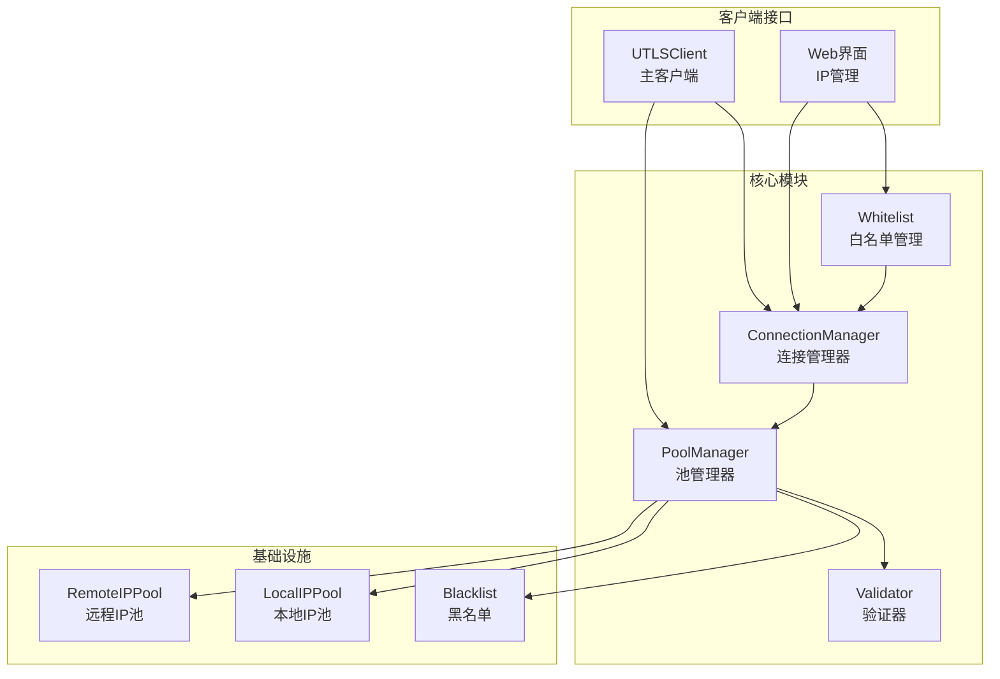
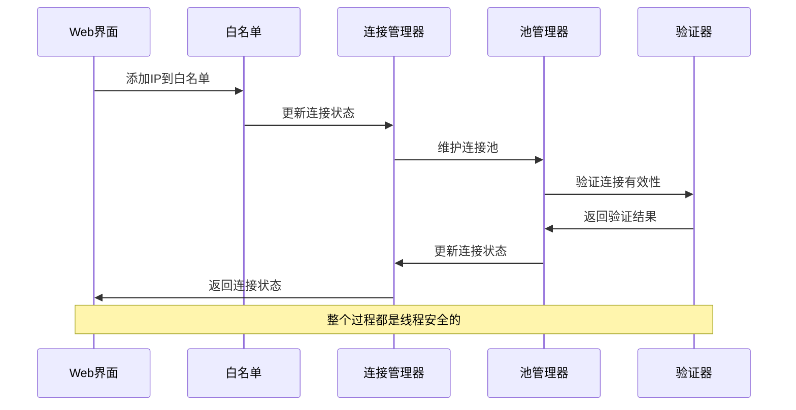
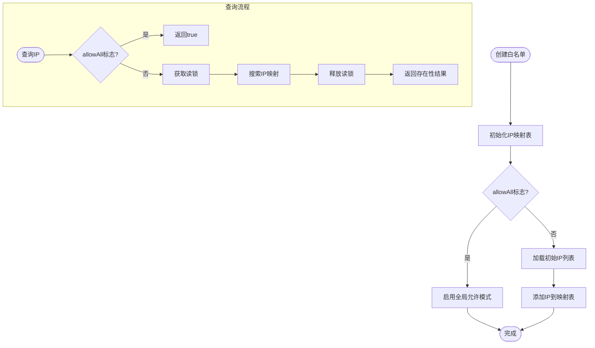
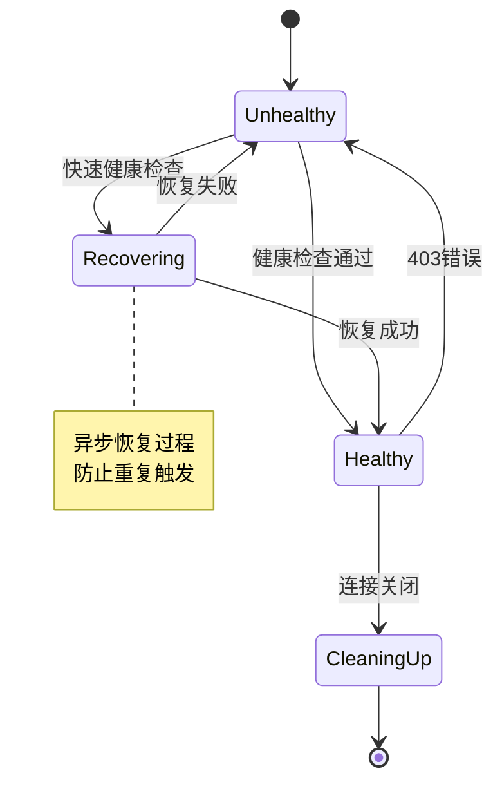
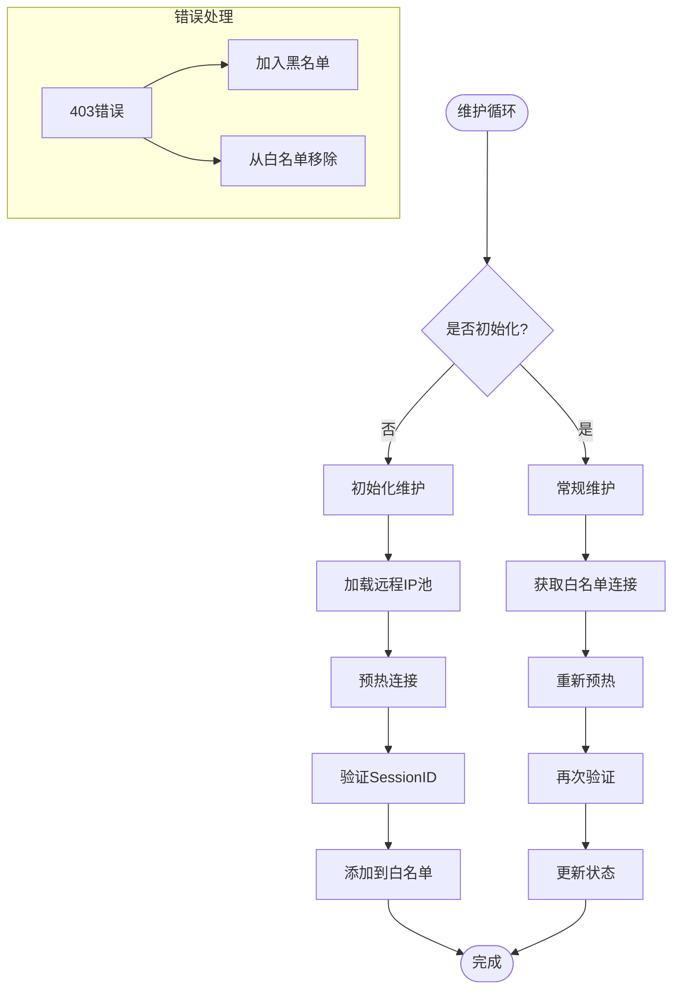
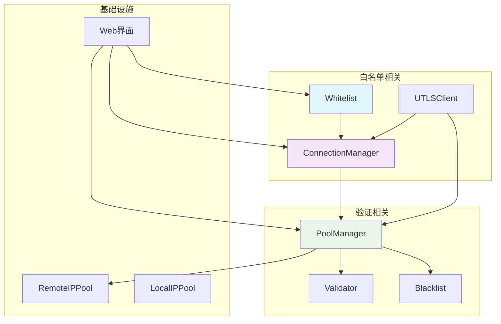
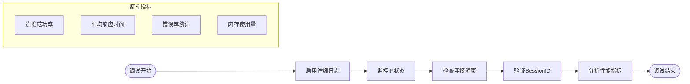

# 白名单管理

<cite>
**本文档引用的文件**
- [whitelist.go](file://utlsclient/whitelist.go)
- [connection_manager.go](file://utlsclient/connection_manager.go)
- [pool_manager.go](file://utlsclient/pool_manager.go)
- [utlsclient.go](file://utlsclient/utlsclient.go)
- [utlshotconnpool.go](file://utlsclient/utlshotconnpool.go)
- [validator.go](file://utlsclient/validator.go)
- [errors.go](file://utlsclient/errors.go)
- [index.html](file://web/index.html)
- [index.js](file://web/index.js)
</cite>

## 目录
1. [简介](#简介)
2. [项目结构](#项目结构)
3. [核心组件](#核心组件)
4. [架构概览](#架构概览)
5. [详细组件分析](#详细组件分析)
6. [依赖关系分析](#依赖关系分析)
7. [性能考虑](#性能考虑)
8. [故障排除指南](#故障排除指南)
9. [结论](#结论)

## 简介

白名单管理是本爬虫平台中的关键安全机制，负责控制哪些IP地址可以被用于建立新的连接。该系统实现了多层次的安全防护，包括IP地址验证、连接状态管理、健康检查和自动恢复等功能。

白名单管理不仅是一个简单的IP地址列表，更是一个完整的连接生命周期管理系统，确保只有经过验证的、健康的IP地址才能参与请求处理。

## 项目结构

该项目采用模块化的架构设计，白名单管理功能主要分布在以下几个核心模块中：



**图表来源**
- [whitelist.go:1-63](file://utlsclient/whitelist.go#L1-L63)
- [connection_manager.go:1-227](file://utlsclient/connection_manager.go#L1-L227)
- [pool_manager.go:21-638](file://utlsclient/pool_manager.go#L21-L638)

**章节来源**
- [whitelist.go:1-63](file://utlsclient/whitelist.go#L1-L63)
- [connection_manager.go:1-227](file://utlsclient/connection_manager.go#L1-L227)
- [pool_manager.go:21-638](file://utlsclient/pool_manager.go#L21-L638)

## 核心组件

### Whitelist 白名单管理器

Whitelist是白名单管理的核心组件，负责维护允许使用的IP地址列表。它提供了线程安全的操作接口，支持动态添加、删除和查询IP地址。

```mermaid
classDiagram
class Whitelist {
-sync.RWMutex mu
-map[string]struct{} ips
-bool allowAll
+NewWhitelist(initialIPs []string, allowAll bool) *Whitelist
+IsAllowed(ip string) bool
+Add(ip string) void
+Remove(ip string) void
+SetIPs(ips []string) void
}
class ConnectionManager {
-sync.RWMutex mu
-map[string]*UTLSConnection connections
-map[string][]string hostMapping
-PoolConfig config
+AddConnection(conn *UTLSConnection) void
+GetConnection(ip string) *UTLSConnection
+GetConnectionsForHost(host string) []*UTLSConnection
+RemoveConnection(ip string) void
}
class PoolManager {
-ConnectionManager connManager
-Blacklist blacklist
-Validator validator
-PoolConfig config
-RemoteIPPool remotePool
+maintainPoolFromWhitelist() void
+checkBlacklistRecovery() void
}
Whitelist --> ConnectionManager : "管理IP访问"
ConnectionManager --> PoolManager : "提供连接"
PoolManager --> Whitelist : "维护白名单"
```

**图表来源**
- [whitelist.go:5-11](file://utlsclient/whitelist.go#L5-L11)
- [connection_manager.go:8-16](file://utlsclient/connection_manager.go#L8-L16)
- [pool_manager.go:21-34](file://utlsclient/pool_manager.go#L21-L34)

### 连接生命周期管理

连接管理器负责跟踪所有活跃的连接状态，确保只有健康的连接才能被使用。它实现了复杂的连接状态转换逻辑，包括健康检查、故障恢复和资源清理。

**章节来源**
- [whitelist.go:13-63](file://utlsclient/whitelist.go#L13-L63)
- [connection_manager.go:18-227](file://utlsclient/connection_manager.go#L18-L227)
- [utlshotconnpool.go:26-158](file://utlsclient/utlshotconnpool.go#L26-L158)

## 架构概览

白名单管理系统采用分层架构设计，每一层都有明确的职责分工：



**图表来源**
- [utlsclient.go:93-144](file://utlsclient/utlsclient.go#L93-L144)
- [pool_manager.go:186-250](file://utlsclient/pool_manager.go#L186-L250)
- [validator.go:51-142](file://utlsclient/validator.go#L51-L142)

## 详细组件分析

### 白名单数据结构

白名单使用高效的内存数据结构来存储IP地址，采用空结构体作为值来节省内存空间：



**图表来源**
- [whitelist.go:16-38](file://utlsclient/whitelist.go#L16-L38)

### 连接状态管理

连接管理器实现了复杂的连接状态跟踪机制，确保每个IP地址只能有一个活跃连接：



**图表来源**
- [utlsclient.go:354-433](file://utlsclient/utlsclient.go#L354-L433)
- [connection_manager.go:77-109](file://utlsclient/connection_manager.go#L77-L109)

### 池维护策略

池管理器采用智能的维护策略，定期检查和更新白名单中的连接：



**图表来源**
- [pool_manager.go:75-110](file://utlsclient/pool_manager.go#L75-L110)
- [pool_manager.go:186-237](file://utlsclient/pool_manager.go#L186-L237)

**章节来源**
- [whitelist.go:1-63](file://utlsclient/whitelist.go#L1-L63)
- [connection_manager.go:1-227](file://utlsclient/connection_manager.go#L1-L227)
- [pool_manager.go:75-237](file://utlsclient/pool_manager.go#L75-L237)

## 依赖关系分析

白名单管理系统与其他组件之间存在紧密的依赖关系：



**图表来源**
- [utlsclient.go:14-55](file://utlsclient/utlsclient.go#L14-L55)
- [pool_manager.go:13-52](file://utlsclient/pool_manager.go#L13-L52)

### 错误处理机制

系统实现了完善的错误处理机制，能够优雅地处理各种异常情况：

| 错误类型 | 触发条件 | 处理方式 | 影响范围 |
|---------|---------|---------|---------|
| ErrIPBlockedBy403 | 403 Forbidden响应 | 加入黑名单并移除连接 | 单个IP |
| ErrNoAvailableConnection | 无可用连接 | 返回错误并提示重试 | 请求方 |
| ErrConnectionUnhealthy | 连接不健康 | 触发快速健康检查 | 连接池 |
| ErrConnectionInUse | 连接正在使用中 | 等待连接释放 | 请求方 |

**章节来源**
- [errors.go:8-23](file://utlsclient/errors.go#L8-L23)
- [utlsclient.go:93-144](file://utlsclient/utlsclient.go#L93-L144)

## 性能考虑

白名单管理系统在设计时充分考虑了性能优化：

### 并发安全设计
- 使用读写锁分离读写操作，提高并发性能
- 连接状态检查采用原子操作，减少锁竞争
- 批量操作支持并发处理，提高吞吐量

### 内存优化
- IP地址存储使用空结构体作为值，节省内存空间
- 连接池采用懒加载策略，按需创建连接
- 及时清理无效连接，防止内存泄漏

### 网络优化
- 连接复用机制，减少TCP握手开销
- 健康检查采用异步方式，避免阻塞主线程
- 批量预热机制，提高连接建立效率

## 故障排除指南

### 常见问题及解决方案

**问题1：白名单IP无法使用**
- 检查IP是否在黑名单中
- 验证连接是否处于健康状态
- 确认网络连通性和防火墙设置

**问题2：连接频繁断开**
- 检查KeepAlive配置
- 验证服务器端连接超时设置
- 确认中间设备（NAT、防火墙）配置

**问题3：性能下降**
- 检查并发连接数配置
- 验证批处理大小设置
- 监控系统资源使用情况

### 调试工具

系统提供了丰富的调试接口：



**图表来源**
- [utlsclient.go:208-237](file://utlsclient/utlsclient.go#L208-L237)
- [pool_manager.go:316-330](file://utlsclient/pool_manager.go#L316-L330)

**章节来源**
- [utlsclient.go:208-433](file://utlsclient/utlsclient.go#L208-L433)
- [pool_manager.go:316-637](file://utlsclient/pool_manager.go#L316-L637)

## 结论

白名单管理系统是本爬虫平台安全架构的重要组成部分，通过多层次的设计实现了高效、可靠的IP地址管理。系统的主要优势包括：

1. **安全性**：严格的IP地址验证和访问控制
2. **可靠性**：完善的健康检查和故障恢复机制
3. **性能**：优化的并发处理和资源管理
4. **可维护性**：清晰的架构设计和丰富的调试工具

该系统为爬虫平台提供了坚实的基础，确保了大规模分布式爬取任务的稳定运行。通过持续的优化和改进，白名单管理系统将继续为平台的安全性和性能提供保障。