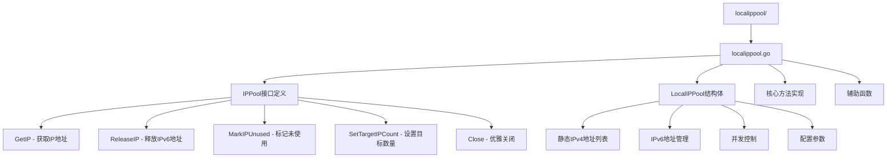
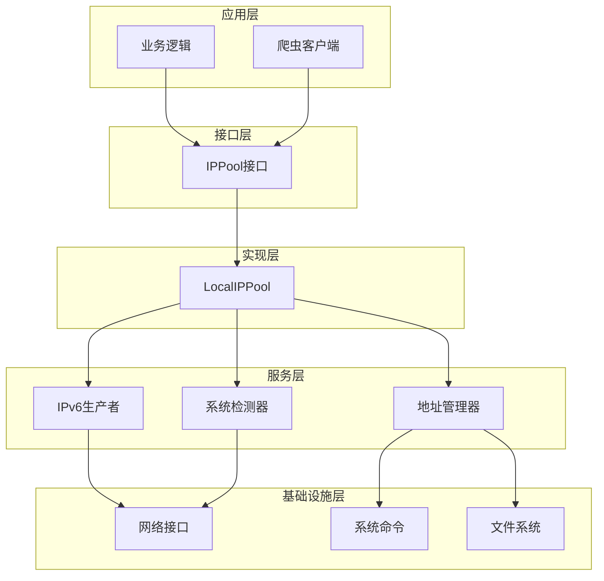
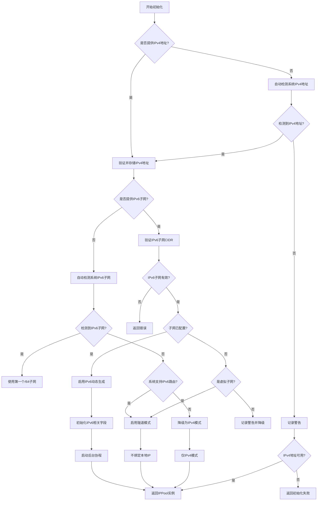
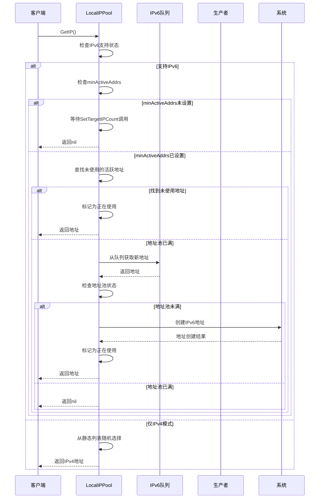
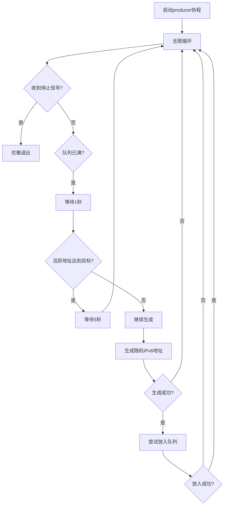
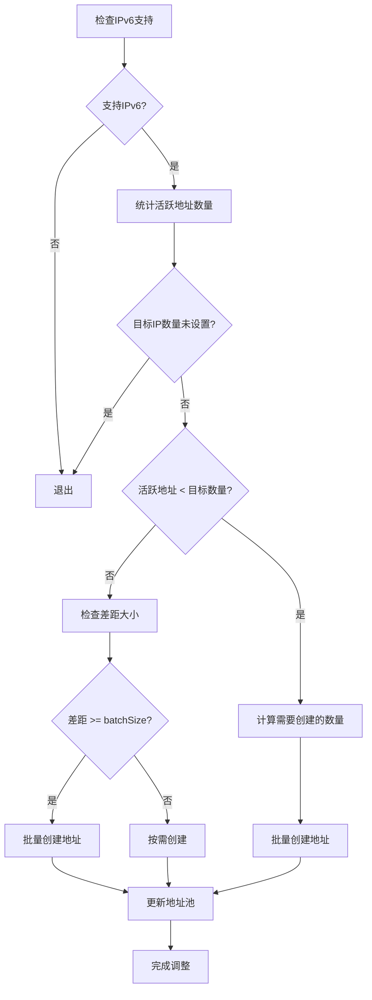
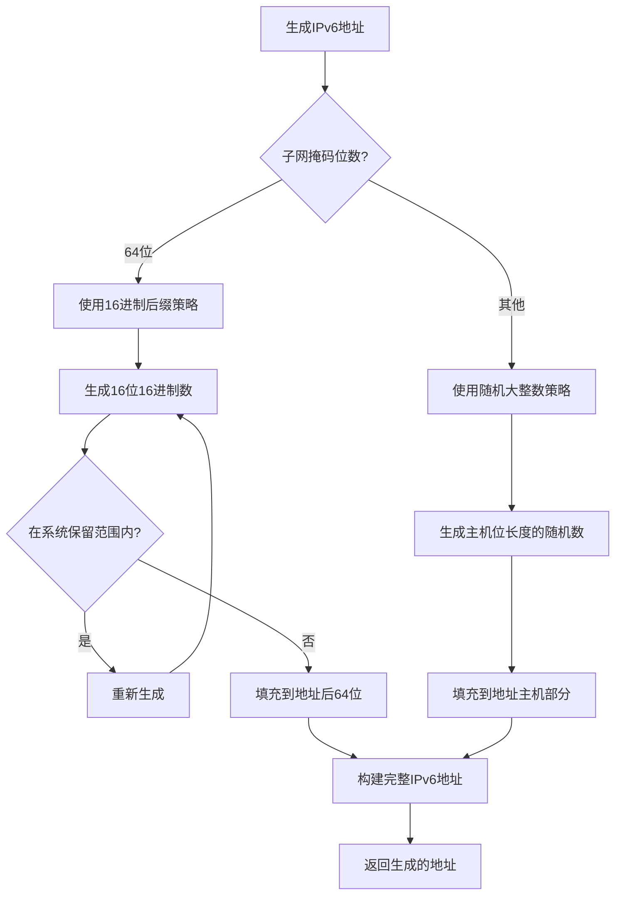
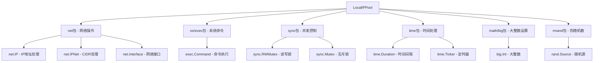

# 本地IP池

<cite>
**本文档中引用的文件**
- [localippool.go](file://localippool/localippool.go)
</cite>

## 目录
1. [概述](#概述)
2. [项目结构](#项目结构)
3. [核心组件](#核心组件)
4. [架构概览](#架构概览)
5. [详细组件分析](#详细组件分析)
6. [依赖关系分析](#依赖关系分析)
7. [性能考虑](#性能考虑)
8. [故障排查指南](#故障排查指南)
9. [结论](#结论)

## 概述

本地IP池（LocalIPPool）是爬虫平台的核心IP地址管理组件，实现了智能的IP地址池管理系统。该模块能够自动适应不同的网络环境，支持静态IPv4地址管理和动态IPv6地址生成，为网络请求提供IP地址轮换和管理功能。

### 主要特性

- **环境自适应检测**：自动检测系统IPv4和IPv6地址，智能降级到IPv4模式
- **IPv6动态地址管理**：基于IPv6子网动态生成海量IPv6地址
- **批量操作优化**：支持批量创建和删除IPv6地址，提高操作效率
- **地址生命周期管理**：完整的地址获取、释放和定期清理机制
- **并发安全保障**：使用多层锁机制确保线程安全
- **系统保留地址处理**：智能识别和跳过系统保留地址

## 项目结构

LocalIPPool模块位于`localippool/`目录下，主要包含以下文件：



**图表来源**
- [localippool.go](file://localippool/localippool.go#L16-L30)
- [localippool.go](file://localippool/localippool.go#L34-L68)

**章节来源**
- [localippool.go](file://localippool/localippool.go#L1-L50)

## 核心组件

### IPPool接口

IPPool接口定义了IP地址池的标准行为契约，确保业务逻辑与具体实现解耦：

```mermaid
classDiagram
class IPPool {
<<interface>>
+GetIP() net.IP
+ReleaseIP(ip net.IP)
+MarkIPUnused(ip net.IP)
+SetTargetIPCount(count int)
+Close() error
}
class LocalIPPool {
-mu sync.RWMutex
-staticIPv4s []net.IP
-rand *mrand.Rand
-hasIPv6Support bool
-ipv6Subnet *net.IPNet
-ipv6Queue chan net.IP
-stopChan chan struct{}
-ipv6Interface string
-createdIPv6Addrs map[string]bool
-usedIPv6Addrs map[string]bool
-activeIPv6Addrs map[string]bool
-batchSize int
-minActiveAddrs int
-maxActiveAddrs int
+NewLocalIPPool(staticIPv4s, ipv6SubnetCIDR) (IPPool, error)
+GetIP() net.IP
+ReleaseIP(ip net.IP)
+MarkIPUnused(ip net.IP)
+SetTargetIPCount(count int)
+Close() error
-producer()
-generateRandomIPInSubnet() net.IP
-adjustIPv6AddressPool()
-cleanupUnusedIPv6Addresses()
}
IPPool <|-- LocalIPPool : 实现
```

**图表来源**
- [localippool.go](file://localippool/localippool.go#L16-L30)
- [localippool.go](file://localippool/localippool.go#L34-L68)

### LocalIPPool结构体

LocalIPPool是IPPool接口的具体实现，包含以下关键字段：

| 字段名 | 类型 | 描述 |
|--------|------|------|
| mu | sync.RWMutex | 主锁，保护结构体字段并发安全 |
| staticIPv4s | []net.IP | 静态IPv4地址列表 |
| rand | *mrand.Rand | 伪随机数生成器 |
| hasIPv6Support | bool | 标记是否支持IPv6动态生成 |
| ipv6Subnet | *net.IPNet | IPv6子网信息 |
| ipv6Queue | chan net.IP | 预生成IPv6地址队列 |
| stopChan | chan struct{} | 停止信号通道 |
| ipv6Interface | string | IPv6接口名称 |
| createdIPv6Addrs | map[string]bool | 已创建的IPv6地址映射 |
| usedIPv6Addrs | map[string]bool | 正在使用的IPv6地址映射 |
| activeIPv6Addrs | map[string]bool | 当前活跃的IPv6地址映射 |
| batchSize | int | 批量创建/删除的地址数量 |
| minActiveAddrs | int | 最小活跃地址数量 |
| maxActiveAddrs | int | 最大活跃地址数量 |

**章节来源**
- [localippool.go](file://localippool/localippool.go#L34-L68)

## 架构概览

LocalIPPool采用分层架构设计，包含以下核心层次：



**图表来源**
- [localippool.go](file://localippool/localippool.go#L16-L30)
- [localippool.go](file://localippool/localippool.go#L173-L176)

## 详细组件分析

### NewLocalIPPool函数 - 环境自适应初始化

NewLocalIPPool函数是LocalIPPool的主要构造函数，具有强大的环境自适应特性：



**图表来源**
- [localippool.go](file://localippool/localippool.go#L86-L187)

#### 环境检测机制

LocalIPPool实现了多层次的环境检测：

1. **IPv4地址检测**：自动扫描系统网络接口，排除私有地址
2. **IPv6子网检测**：验证IPv6子网是否在当前系统网络接口上可用
3. **IPv6路由支持检测**：检查系统是否支持IPv6路由（隧道模式）

**章节来源**
- [localippool.go](file://localippool/localippool.go#L86-L187)

### GetIP方法 - 智能地址获取

GetIP方法实现了复杂的优先级逻辑，确保高效获取可用IP地址：



**图表来源**
- [localippool.go](file://localippool/localippool.go#L196-L383)

#### 优先级逻辑详解

GetIP方法遵循以下优先级顺序：

1. **隧道模式**：返回nil，让系统自动选择路由
2. **复用未使用地址**：优先从活跃地址池中复用未使用的地址
3. **队列获取**：从预生成队列中获取新地址
4. **IPv4回退**：在仅IPv4模式下随机选择静态IPv4地址

**章节来源**
- [localippool.go](file://localippool/localippool.go#L196-L383)

### producer后台协程 - IPv6地址预生成

producer协程负责持续生成IPv6地址并填充到缓冲队列：



**图表来源**
- [localippool.go](file://localippool/localippool.go#L408-L451)

#### 生成策略优化

producer协程采用智能生成策略：

- **队列管理**：当队列已满时降低生成频率
- **地址池控制**：当活跃地址达到目标数量时减少生成
- **错误处理**：生成失败时静默跳过，避免影响整体流程

**章节来源**
- [localippool.go](file://localippool/localippool.go#L408-L451)

### adjustIPv6AddressPool方法 - 动态地址池调整

adjustIPv6AddressPool方法实现了IPv6地址池的动态调整机制：



**图表来源**
- [localippool.go](file://localippool/localippool.go#L1092-L1131)

#### 动态调整策略

adjustIPv6AddressPool采用以下策略：

- **批量创建**：当差距较大时批量创建，提高效率
- **按需创建**：当差距较小时按需创建，避免资源浪费
- **目标对等**：与RemoteDomainIPPool保持地址池大小对等

**章节来源**
- [localippool.go](file://localippool/localippool.go#L1092-L1131)

### IPv6地址生成策略

LocalIPPool实现了智能的IPv6地址生成策略，特别针对/64子网进行了优化：



**图表来源**
- [localippool.go](file://localippool/localippool.go#L453-L508)

#### 冲突避免机制

IPv6地址生成策略包含以下冲突避免机制：

- **系统保留地址跳过**：避免生成系统已配置的地址
- **范围过滤**：跳过特定的保留地址范围（如::1001-::1100）
- **唯一性保证**：通过映射表确保地址唯一性

**章节来源**
- [localippool.go](file://localippool/localippool.go#L453-L508)

## 依赖关系分析

LocalIPPool模块的依赖关系如下：



**图表来源**
- [localippool.go](file://localippool/localippool.go#L3-L14)

### 外部依赖

LocalIPPool依赖以下外部系统和服务：

- **系统网络接口**：通过`ip addr`命令管理IPv6地址
- **网络配置**：检测系统IPv4和IPv6网络配置
- **随机数源**：使用系统熵和伪随机数生成器

**章节来源**
- [localippool.go](file://localippool/localippool.go#L3-L14)

## 性能考虑

### 并发性能优化

LocalIPPool采用了多层次的并发优化策略：

1. **读写分离锁**：使用`sync.RWMutex`实现读写分离
2. **专用锁**：为不同地址映射使用独立的互斥锁
3. **通道通信**：使用带缓冲的通道进行IPv6地址传递
4. **无锁设计**：在可能的情况下使用原子操作

### 内存使用优化

- **地址池大小控制**：通过`batchSize`参数控制内存使用
- **定期清理机制**：每20分钟清理未使用地址
- **队列缓冲**：使用固定大小的队列避免内存无限增长

### 网络性能优化

- **批量操作**：支持批量创建和删除IPv6地址
- **预生成机制**：后台预生成地址减少延迟
- **地址复用**：优先复用未使用地址

## 故障排查指南

### 常见问题及解决方案

#### IPv6地址创建失败

**症状**：IPv6地址池为空，GetIP返回nil

**排查步骤**：
1. 检查系统IPv6支持：`ping6 ipv6.google.com`
2. 验证IPv6子网配置：`ip -6 addr show dev <interface>`
3. 检查权限：确保程序有管理员权限
4. 查看系统日志：`dmesg | grep ipv6`

**解决方案**：
- 使用隧道模式（虚拟子网）
- 检查网络接口配置
- 验证防火墙设置

#### 地址池大小异常

**症状**：地址池大小与预期不符

**排查步骤**：
1. 检查`SetTargetIPCount`调用
2. 验证`minActiveAddrs`和`maxActiveAddrs`设置
3. 检查地址池调整日志

**解决方案**：
- 确保正确调用`SetTargetIPCount`
- 检查地址池调整定时器
- 验证批量操作参数

#### 性能问题

**症状**：GetIP调用响应缓慢

**排查步骤**：
1. 检查IPv6队列状态
2. 验证地址池大小
3. 分析系统负载

**解决方案**：
- 增加队列缓冲大小
- 优化批量操作参数
- 检查系统资源使用

### 日志分析

LocalIPPool提供了详细的日志输出，帮助诊断问题：

- **初始化日志**：显示检测到的IPv4和IPv6地址
- **地址操作日志**：记录地址创建、删除和使用
- **错误日志**：记录系统调用失败等错误

**章节来源**
- [localippool.go](file://localippool/localippool.go#L95-L130)

## 结论

LocalIPPool模块是一个功能强大、设计精良的IP地址池管理系统。它通过以下关键特性为爬虫平台提供了稳定可靠的IP地址管理能力：

### 核心优势

1. **环境自适应**：自动检测和适配不同的网络环境
2. **高性能设计**：通过预生成队列和批量操作优化性能
3. **并发安全保障**：使用多层锁机制确保线程安全
4. **智能地址管理**：完善的地址生命周期管理机制
5. **容错性强**：优雅降级和错误处理机制

### 应用场景

- **爬虫IP轮换**：为爬虫请求提供大量不同的IP地址
- **负载均衡**：在多个IP地址间分散请求负载
- **地理位置模拟**：通过不同IPv6地址模拟不同地理位置
- **反爬虫对抗**：绕过目标网站的IP封禁机制

### 最佳实践建议

1. **合理配置目标数量**：根据实际需求设置合适的地址池大小
2. **监控地址池状态**：定期检查地址池健康状况
3. **优化批量参数**：根据系统性能调整批量操作大小
4. **定期维护**：利用内置的清理机制保持地址池健康
5. **权限管理**：确保程序有足够的系统权限

LocalIPPool模块的设计充分考虑了性能、可靠性和扩展性，是整个爬虫平台的重要基础设施组件。通过合理的配置和使用，可以显著提升爬虫系统的稳定性和效率。