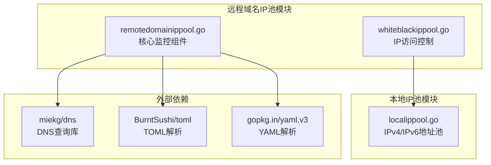
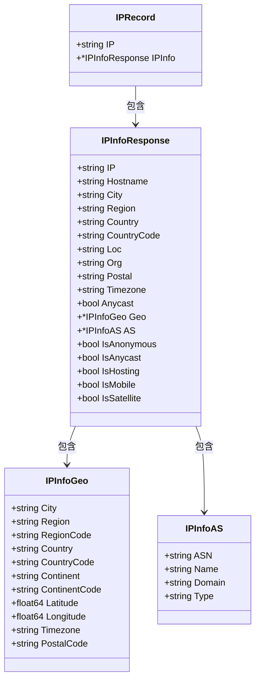
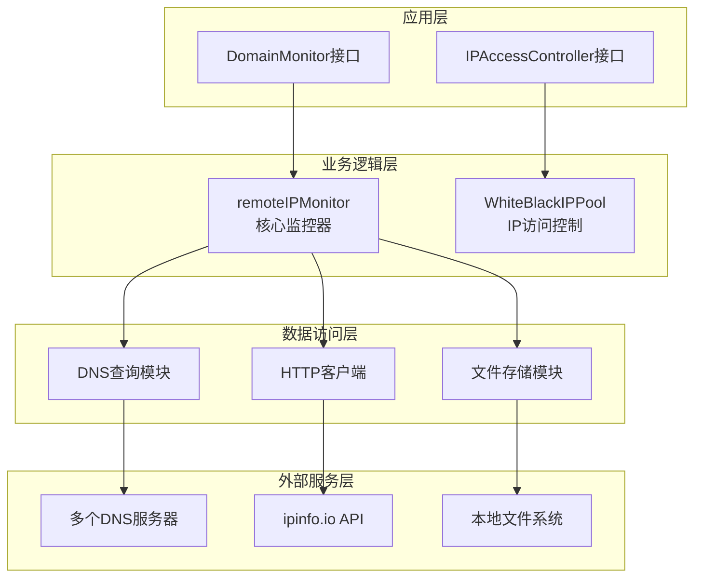
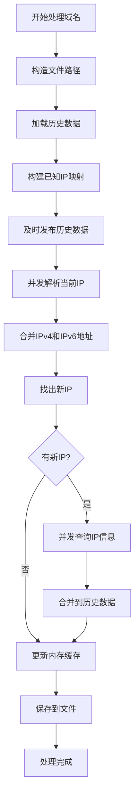
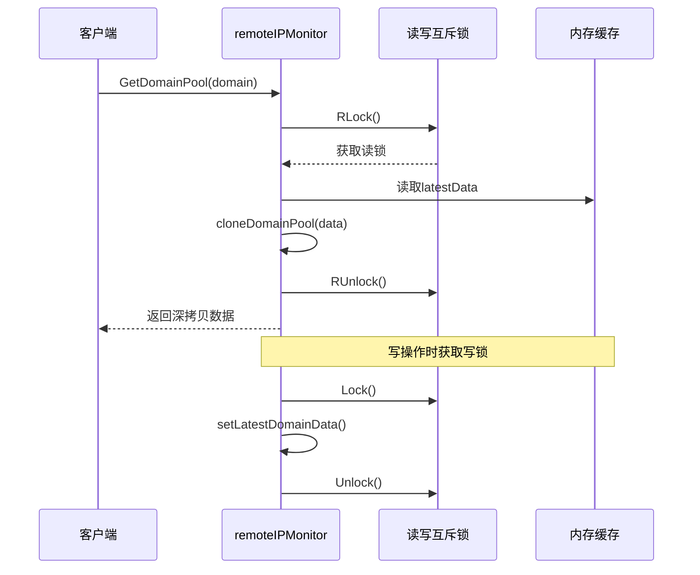
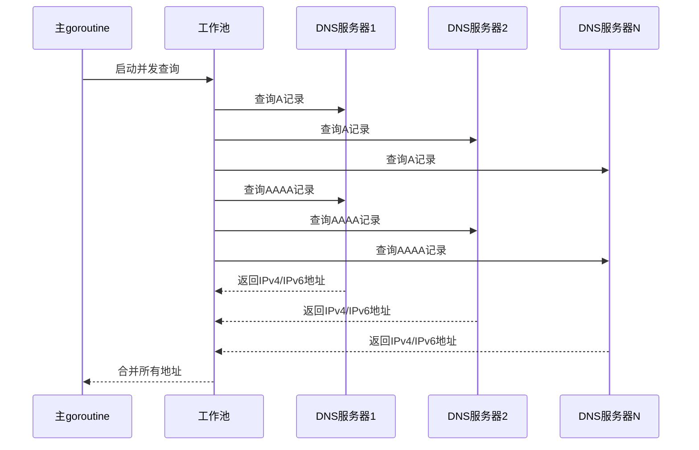
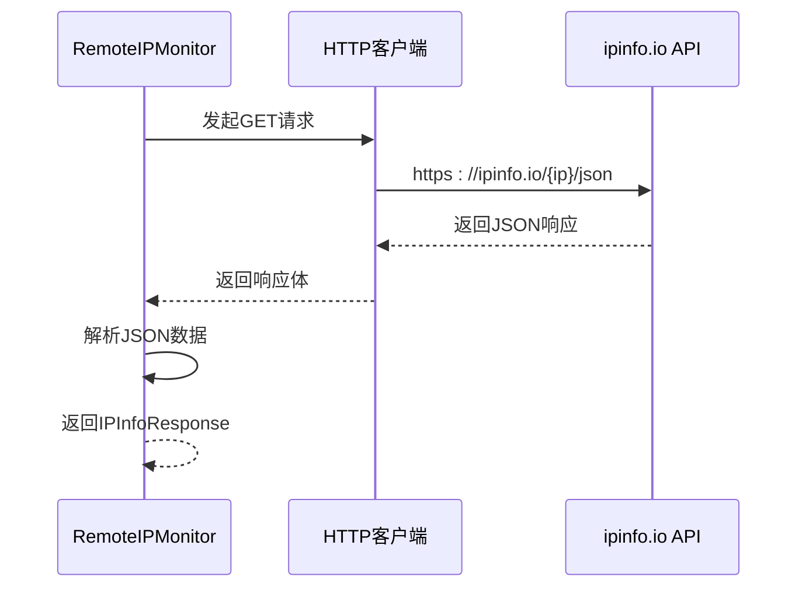
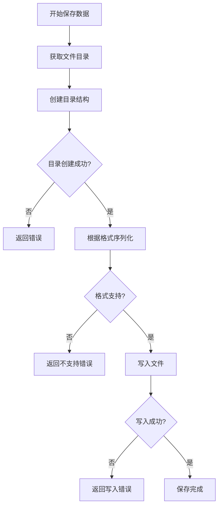
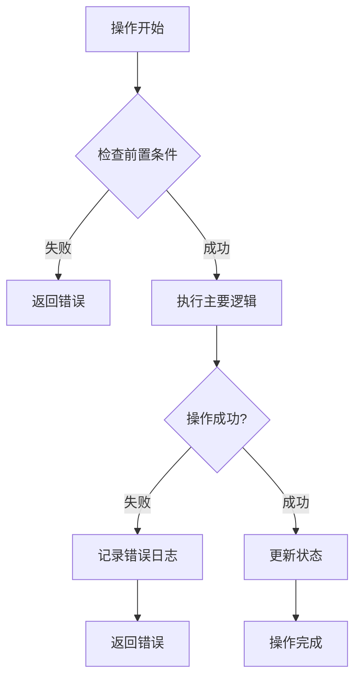

# 远程域名IP池

<cite>
**本文档中引用的文件**
- [remotedomainippool.go](file://remotedomainippool/remotedomainippool.go)
- [whiteblackippool.go](file://remotedomainippool/whiteblackippool.go)
- [localippool.go](file://localippool/localippool.go)
- [README.md](file://README.md)
</cite>

## 目录
1. [简介](#简介)
2. [项目结构](#项目结构)
3. [核心组件](#核心组件)
4. [架构概览](#架构概览)
5. [详细组件分析](#详细组件分析)
6. [配置参数详解](#配置参数详解)
7. [数据流分析](#数据流分析)
8. [并发控制与错误处理](#并发控制与错误处理)
9. [最佳实践](#最佳实践)
10. [故障排除指南](#故障排除指南)
11. [总结](#总结)

## 简介

远程域名IP池（RemoteIPMonitor）是一个高性能的域名IP地址监控系统，专门设计用于从多个DNS服务器并发查询指定域名的IPv4和IPv6地址列表。该系统通过智能的增量更新机制，结合ipinfo.io API提供详细的IP地理位置和ASN信息，为爬虫平台提供可靠的IP池管理功能。

### 主要特性

- **并发DNS查询**：支持从多个DNS服务器同时查询，获取多样化的IP地址列表
- **智能增量更新**：基于历史数据的累加式更新，减少不必要的API调用
- **多存储格式支持**：兼容JSON、YAML、TOML三种存储格式
- **并发安全保障**：使用读写互斥锁和深拷贝技术确保线程安全
- **自动目录创建**：智能的文件存储管理机制
- **IP访问控制**：集成黑白名单IP池功能

## 项目结构



**图表来源**
- [remotedomainippool.go](file://remotedomainippool/remotedomainippool.go#L1-L20)
- [whiteblackippool.go](file://remotedomainippool/whiteblackippool.go#L1-L4)

**章节来源**
- [remotedomainippool.go](file://remotedomainippool/remotedomainippool.go#L1-L472)
- [whiteblackippool.go](file://remotedomainippool/whiteblackippool.go#L1-L127)

## 核心组件

### DomainMonitor接口

DomainMonitor接口定义了域名IP监控组件的核心行为契约：

```mermaid
classDiagram
class DomainMonitor {
<<interface>>
+Start() void
+Stop() void
+GetDomainPool(domain string) map[string][]IPRecord, bool
}
class remoteIPMonitor {
-config MonitorConfig
-ticker *time.Ticker
-stopChan chan struct{}
-httpClient *http.Client
-mu sync.RWMutex
-latestData map[string]map[string][]IPRecord
+Start() void
+Stop() void
+GetDomainPool(domain string) map[string][]IPRecord, bool
-run() void
-updateAllDomains() void
-processSingleDomain(domain string) void
-resolveDomainConcurrently(domain string) []string, []string, error
-fetchIPInfo(ip string) *IPInfoResponse, error
-loadDomainData(filePath string) map[string][]IPRecord
-saveDomainData(filePath string, data map[string][]IPRecord) error
-setLatestDomainData(domain string, data map[string][]IPRecord) void
}
DomainMonitor <|.. remoteIPMonitor : 实现
```

**图表来源**
- [remotedomainippool.go](file://remotedomainippool/remotedomainippool.go#L23-L34)
- [remotedomainippool.go](file://remotedomainippool/remotedomainippool.go#L101-L112)

### 数据结构定义

系统定义了完整的IP信息数据结构：



**图表来源**
- [remotedomainippool.go](file://remotedomainippool/remotedomainippool.go#L38-L87)

**章节来源**
- [remotedomainippool.go](file://remotedomainippool/remotedomainippool.go#L23-L87)

## 架构概览

远程域名IP池采用分层架构设计，从上到下分为接口层、业务逻辑层、数据访问层和外部服务层：



**图表来源**
- [remotedomainippool.go](file://remotedomainippool/remotedomainippool.go#L101-L112)
- [whiteblackippool.go](file://remotedomainippool/whiteblackippool.go#L29-L35)

## 详细组件分析

### MonitorConfig配置结构体

MonitorConfig是RemoteIPMonitor的核心配置结构体，定义了所有必要的配置参数：

| 参数 | 类型 | 描述 | 默认值 |
|------|------|------|--------|
| Domains | []string | 要监视的域名列表 | 必需 |
| DNSServers | []string | DNS服务器列表 | ["8.8.8.8", "1.1.1.1"] |
| IPInfoToken | string | ipinfo.io API Token | 必需 |
| UpdateInterval | time.Duration | 更新间隔 | 必需 |
| StorageDir | string | 存储目录 | "." |
| StorageFormat | string | 存储格式 | "json" |

**章节来源**
- [remotedomainippool.go](file://remotedomainippool/remotedomainippool.go#L91-L98)

### processSingleDomain累加式增量更新流程

processSingleDomain方法实现了完整的累加式增量更新流程：



**图表来源**
- [remotedomainippool.go](file://remotedomainippool/remotedomainippool.go#L218-L284)

**章节来源**
- [remotedomainippool.go](file://remotedomainippool/remotedomainippool.go#L218-L284)

### setLatestDomainData并发安全机制

setLatestDomainData方法使用深拷贝技术确保并发读取安全：



**图表来源**
- [remotedomainippool.go](file://remotedomainippool/remotedomainippool.go#L414-L420)
- [remotedomainippool.go](file://remotedomainippool/remotedomainippool.go#L422-L439)

**章节来源**
- [remotedomainippool.go](file://remotedomainippool/remotedomainippool.go#L167-L185)
- [remotedomainippool.go](file://remotedomainippool/remotedomainippool.go#L414-L439)

### 支持的存储格式

系统支持三种存储格式，每种格式都有相应的序列化和反序列化机制：

| 格式 | 特点 | 使用场景 |
|------|------|----------|
| JSON | 人类可读，广泛支持 | 开发调试，跨平台兼容 |
| YAML | 结构清晰，易读性强 | 配置文件，文档化需求 |
| TOML | 配置友好，语法简洁 | 系统配置，部署文件 |

**章节来源**
- [remotedomainippool.go](file://remotedomainippool/remotedomainippool.go#L442-L471)

## 配置参数详解

### 域名列表（Domains）

域名列表是监控的核心目标，系统会对每个域名独立进行监控：

```go
// 示例配置
config := MonitorConfig{
    Domains: []string{
        "google.com",
        "facebook.com", 
        "twitter.com",
        "github.com",
    },
    // 其他配置...
}
```

### DNS服务器配置

DNS服务器配置决定了查询的多样性和可靠性：

```go
// 多DNS服务器配置
config := MonitorConfig{
    DNSServers: []string{
        "8.8.8.8",        // Google Public DNS
        "1.1.1.1",        // Cloudflare DNS  
        "208.67.222.222", // OpenDNS
        "8.8.4.4",        // Google Secondary
    },
    // 其他配置...
}
```

### ipinfo.io API Token

ipinfo.io API提供详细的IP地理位置和ASN信息：

```go
// API Token配置
config := MonitorConfig{
    IPInfoToken: "your-api-token-here",
    // 其他配置...
}
```

### 更新间隔设置

更新间隔直接影响监控的实时性和API调用频率：

```go
// 更新间隔配置
config := MonitorConfig{
    UpdateInterval: 30 * time.Minute, // 30分钟更新一次
    // 或者更频繁的更新
    UpdateInterval: 5 * time.Minute,  // 5分钟更新一次
    // 其他配置...
}
```

**章节来源**
- [remotedomainippool.go](file://remotedomainippool/remotedomainippool.go#L114-L140)

## 数据流分析

### DNS查询协程流程

resolveDomainConcurrently方法实现了高效的并发DNS查询：



**图表来源**
- [remotedomainippool.go](file://remotedomainippool/remotedomainippool.go#L286-L355)

### HTTP客户端与IP信息查询

fetchIPInfo方法负责从ipinfo.io获取详细的IP信息：



**图表来源**
- [remotedomainippool.go](file://remotedomainippool/remotedomainippool.go#L378-L397)

### 持久化存储流程

saveDomainData方法实现了智能的文件存储机制：



**图表来源**
- [remotedomainippool.go](file://remotedomainippool/remotedomainippool.go#L442-L471)

**章节来源**
- [remotedomainippool.go](file://remotedomainippool/remotedomainippool.go#L286-L355)
- [remotedomainippool.go](file://remotedomainippool/remotedomainippool.go#L378-L397)
- [remotedomainippool.go](file://remotedomainippool/remotedomainippool.go#L442-L471)

## 并发控制与错误处理

### 并发控制策略

系统采用多层次的并发控制机制：

1. **读写互斥锁**：保护latestData的并发访问
2. **WaitGroup**：协调多个域名的并行处理
3. **工作池模式**：限制DNS查询的并发数量
4. **通道通信**：安全地在goroutines间传递数据

### 错误处理策略



**章节来源**
- [remotedomainippool.go](file://remotedomainippool/remotedomainippool.go#L200-L214)
- [remotedomainippool.go](file://remotedomainippool/remotedomainippool.go#L250-L277)

## 最佳实践

### 监控频率设置

根据不同的使用场景，推荐以下更新间隔设置：

| 使用场景 | 推荐间隔 | 说明 |
|----------|----------|------|
| 生产环境 | 30-60分钟 | 平衡实时性和API配额 |
| 开发测试 | 5-15分钟 | 快速迭代开发 |
| 高频监控 | 1-5分钟 | 关键业务监控 |
| 低频监控 | 2-4小时 | 一般信息收集 |

### API配额管理

合理规划ipinfo.io API的使用：

```go
// API配额优化策略
config := MonitorConfig{
    IPInfoToken: "your-token",
    UpdateInterval: 30 * time.Minute, // 避免过于频繁的查询
    // 控制域名数量，避免超出免费配额
    Domains: domains[:min(len(domains), 100)], 
}
```

### 数据存储最佳实践

1. **存储目录规划**：使用有意义的目录结构
2. **文件命名规范**：域名转换为文件名
3. **定期清理**：删除过期的监控数据
4. **备份策略**：重要数据定期备份

### 性能优化建议

1. **并发控制**：合理设置DNS查询并发数
2. **缓存策略**：充分利用历史数据减少API调用
3. **连接池配置**：优化HTTP客户端连接参数
4. **内存管理**：定期清理不再使用的数据

## 故障排除指南

### 常见问题及解决方案

| 问题 | 可能原因 | 解决方案 |
|------|----------|----------|
| DNS查询超时 | 网络连接问题 | 检查网络连通性，更换DNS服务器 |
| API调用失败 | Token无效或配额超限 | 验证Token有效性，检查配额使用情况 |
| 文件写入失败 | 权限不足或磁盘空间不足 | 检查文件权限和磁盘空间 |
| 内存占用过高 | 数据缓存过大 | 调整更新频率，定期清理缓存 |

### 调试技巧

1. **启用详细日志**：观察各阶段的执行情况
2. **监控资源使用**：跟踪CPU和内存消耗
3. **验证配置参数**：确保所有必需参数都正确设置
4. **测试网络连通性**：验证DNS服务器和API服务的可达性

**章节来源**
- [remotedomainippool.go](file://remotedomainippool/remotedomainippool.go#L114-L140)
- [remotedomainippool.go](file://remotedomainippool/remotedomainippool.go#L235-L236)

## 总结

远程域名IP池是一个功能完善、设计精良的域名IP监控系统。它通过以下核心特性为爬虫平台提供了可靠的IP池管理能力：

### 核心优势

1. **高性能并发处理**：利用Go语言的并发特性，实现高效的DNS查询和数据处理
2. **智能增量更新**：基于历史数据的累加式更新机制，最大化API使用效率
3. **多格式存储支持**：灵活的存储格式选择，满足不同场景需求
4. **完善的错误处理**：健壮的错误处理和恢复机制
5. **线程安全设计**：全面的并发控制保障数据一致性

### 应用价值

- **爬虫平台支撑**：为爬虫系统提供稳定的IP池管理
- **网络监控**：实时监控域名的IP地址变化
- **安全防护**：通过IP地理位置信息增强安全策略
- **数据分析**：收集和分析IP地址的地理分布特征

### 发展方向

随着网络环境的不断变化，远程域名IP池可以在以下方面进一步优化：

1. **智能算法优化**：引入机器学习算法预测IP地址变化
2. **分布式架构**：支持大规模集群部署
3. **实时推送**：提供Webhook或WebSocket实时通知
4. **可视化界面**：开发配套的监控和管理界面

通过持续的优化和改进，远程域名IP池将继续为爬虫平台和其他网络应用提供高质量的IP地址监控服务。