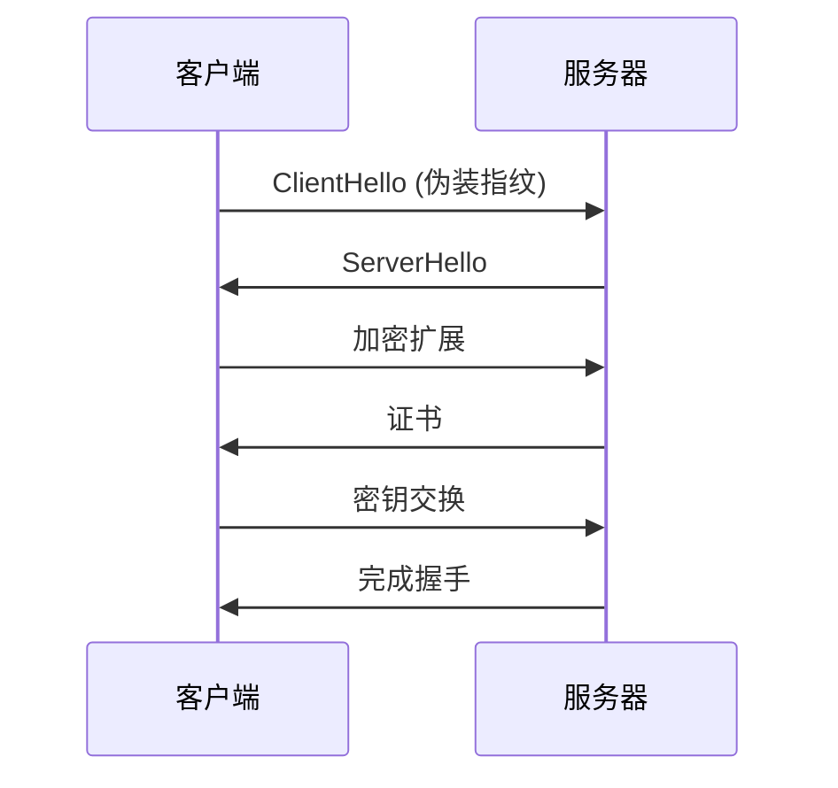
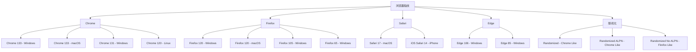
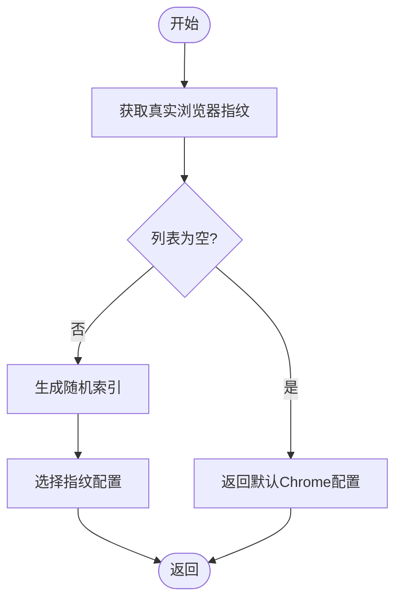
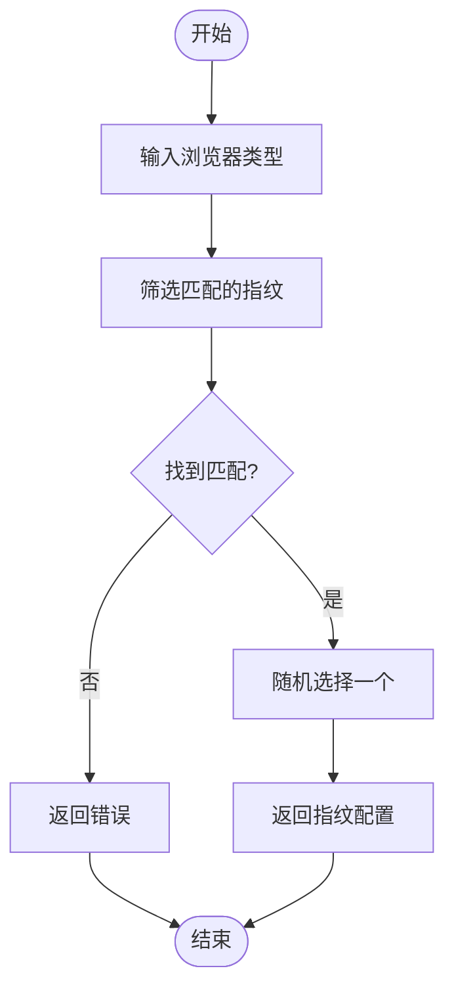
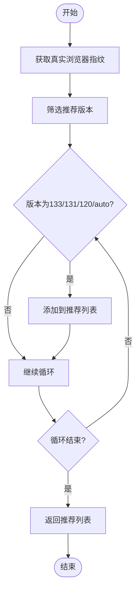
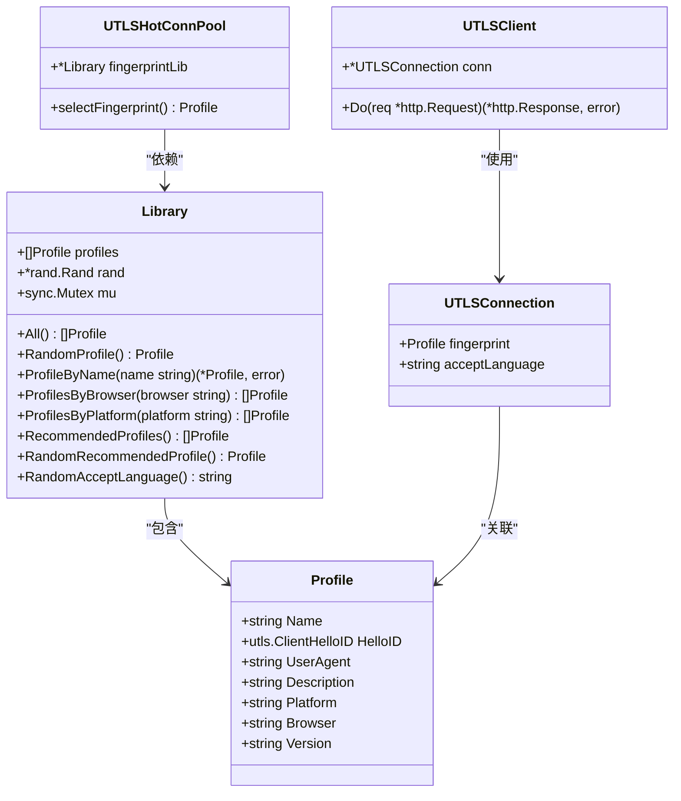
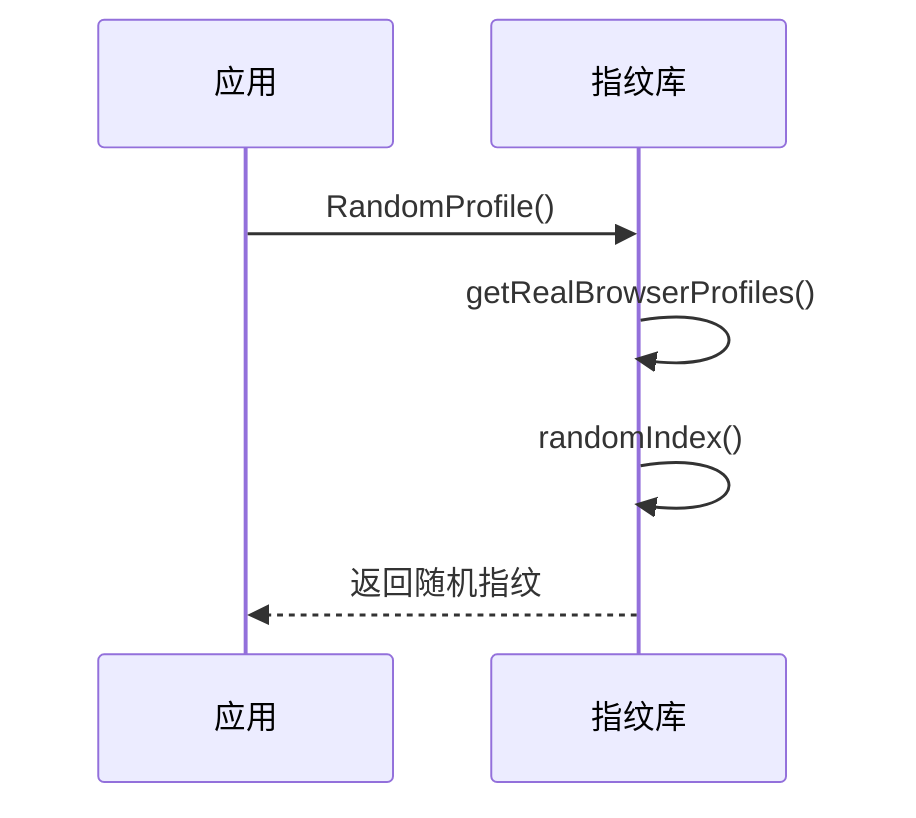
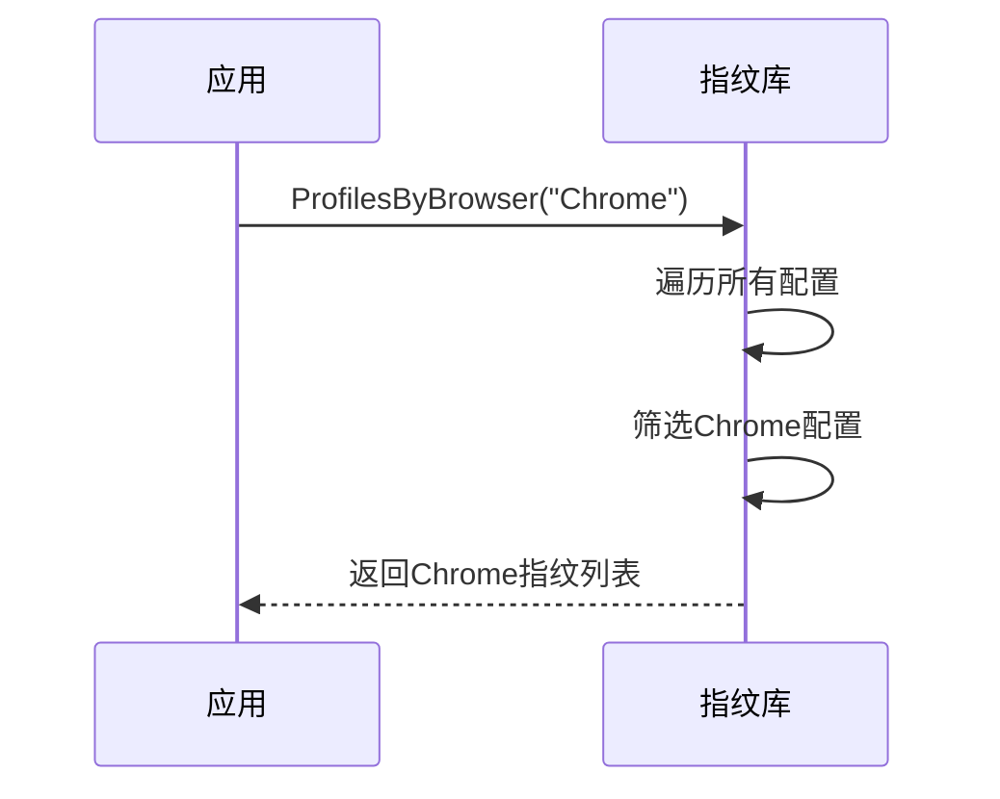
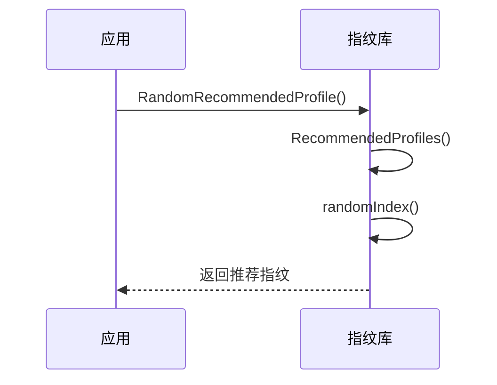

# TLS指纹伪装

<cite>
**本文档引用的文件**   
- [utlsfingerprint.go](file://utlsclient/utlsfingerprint.go)
- [utlsclient.go](file://utlsclient/utlsclient.go)
- [utlshotconnpool.go](file://utlsclient/utlshotconnpool.go)
- [constants.go](file://utlsclient/constants.go)
- [example_utlsclient_usage.go](file://examples/utlsclient/example_utlsclient_usage.go)
- [example_basic_usage.go](file://examples/utlsclient/example_basic_usage.go)
- [example_hotconnpool_usage.go](file://examples/utlsclient/example_hotconnpool_usage.go)
- [main.go](file://cmd/utlsclient/main.go)
</cite>

## 目录
1. [引言](#引言)
2. [TLS指纹伪装技术原理](#tls指纹伪装技术原理)
3. [支持的浏览器指纹类型](#支持的浏览器指纹类型)
4. [指纹选择策略](#指纹选择策略)
5. [指纹库架构与调用关系](#指纹库架构与调用关系)
6. [关键功能使用示例](#关键功能使用示例)
7. [自定义指纹配置与最佳实践](#自定义指纹配置与最佳实践)
8. [结论](#结论)

## 引言

TLS指纹伪装技术是一种高级的反检测技术，通过模拟不同浏览器和操作系统的TLS握手行为，使网络请求看起来像是来自真实的浏览器客户端。本项目基于`utls`库实现了完整的TLS指纹伪装系统，支持多种主流浏览器的指纹配置，包括Chrome、Firefox、Safari和Edge系列。该技术在爬虫、自动化测试和网络安全等领域具有重要应用价值，能够有效绕过基于TLS指纹的检测机制。

**本文档来源**
- [utlsfingerprint.go](file://utlsclient/utlsfingerprint.go#L1-L631)

## TLS指纹伪装技术原理

TLS指纹伪装技术的核心在于模拟真实浏览器的TLS握手过程。当客户端与服务器建立HTTPS连接时，会通过ClientHello消息交换加密参数。不同浏览器和操作系统在ClientHello消息中的扩展字段、加密套件顺序、签名算法等特征各不相同，形成了独特的"指纹"。通过精确复制这些特征，可以伪装成特定的浏览器。

在本项目中，`utls`库提供了底层支持，通过`utls.ClientHelloID`结构体定义了各种浏览器的TLS握手标识。`Profile`结构体封装了完整的指纹配置，包括HelloID、UserAgent、平台信息等。当建立连接时，系统会根据选定的指纹配置生成相应的ClientHello消息，从而实现指纹伪装。



**图示来源**
- [utlsfingerprint.go](file://utlsclient/utlsfingerprint.go#L13-L22)
- [utlsclient.go](file://utlsclient/utlsclient.go#L205-L208)

**本节来源**
- [utlsfingerprint.go](file://utlsclient/utlsfingerprint.go#L13-L22)
- [utlsclient.go](file://utlsclient/utlsclient.go#L205-L208)

## 支持的浏览器指纹类型

本项目支持多种主流浏览器的指纹配置，每种配置都精确模拟了特定版本浏览器的TLS握手特征。支持的浏览器类型包括Chrome、Firefox、Safari和Edge系列，覆盖了Windows、macOS、Linux和iOS等多个平台。

Chrome系列支持从83到133的多个版本，包括标准版本、Post-Quantum版本和带有特殊特征的版本。Firefox系列支持从55到120的多个版本，覆盖了不同年代的浏览器特征。Safari系列支持macOS和iOS平台的多个版本。Edge系列基于Chromium内核，支持85和106版本。

此外，还提供了随机化指纹类型，包括`Randomized`、`RandomizedALPN`和`RandomizedNoALPN`，这些类型在保持基本特征的同时引入随机性，增加指纹的多样性。



**图示来源**
- [utlsfingerprint.go](file://utlsclient/utlsfingerprint.go#L115-L439)

**本节来源**
- [utlsfingerprint.go](file://utlsclient/utlsfingerprint.go#L115-L439)

## 指纹选择策略

系统提供了多种指纹选择策略，以满足不同的使用场景和需求。主要策略包括随机选择、按浏览器/平台筛选和推荐指纹选择。

### 随机选择策略

`RandomProfile`方法从所有真实浏览器指纹中随机选择一个配置，排除了随机化类型，确保选择的指纹具有真实的浏览器特征。这种方法适用于需要最大化指纹多样性的场景。



**图示来源**
- [utlsfingerprint.go](file://utlsclient/utlsfingerprint.go#L470-L484)

### 按浏览器/平台筛选策略

`ProfilesByBrowser`和`ProfilesByPlatform`方法允许根据浏览器类型或平台类型筛选指纹配置。`RandomProfileByBrowser`和`RandomProfileByPlatform`方法则在此基础上进行随机选择，适用于需要针对特定浏览器或平台进行测试的场景。



**图示来源**
- [utlsfingerprint.go](file://utlsclient/utlsfingerprint.go#L498-L509)
- [utlsfingerprint.go](file://utlsclient/utlsfingerprint.go#L542-L549)

### 推荐指纹选择策略

`RecommendedProfiles`方法返回推荐的指纹配置列表，优先选择较新版本的浏览器（如133、131、120版本）和自动版本。`RandomRecommendedProfile`方法从推荐列表中随机选择，适用于需要平衡安全性和兼容性的场景。



**图示来源**
- [utlsfingerprint.go](file://utlsclient/utlsfingerprint.go#L524-L537)

**本节来源**
- [utlsfingerprint.go](file://utlsclient/utlsfingerprint.go#L470-L587)

## 指纹库架构与调用关系

指纹库的架构设计采用了面向对象的方式，`Library`结构体作为核心容器，管理所有指纹配置。`Profile`结构体定义了单个指纹的属性，包括名称、HelloID、UserAgent等。全局变量`fpLibrary`提供了单例模式的访问接口。

调用关系上，`UTLSHotConnPool`连接池在建立连接时会调用指纹库的`selectFingerprint`方法选择合适的指纹配置。`UTLSClient`在发送请求时会使用连接关联的指纹信息。整个系统通过分层设计实现了高内聚低耦合的架构。



**图示来源**
- [utlsfingerprint.go](file://utlsclient/utlsfingerprint.go#L13-L29)
- [utlshotconnpool.go](file://utlsclient/utlshotconnpool.go#L248)
- [utlsclient.go](file://utlsclient/utlsclient.go#L38-L43)

**本节来源**
- [utlsfingerprint.go](file://utlsclient/utlsfingerprint.go#L13-L29)
- [utlshotconnpool.go](file://utlsclient/utlshotconnpool.go#L248)
- [utlsclient.go](file://utlsclient/utlsclient.go#L38-L43)

## 关键功能使用示例

### 基本使用示例

以下示例展示了如何使用`RandomProfile`方法获取随机指纹配置：



**图示来源**
- [example_basic_usage.go](file://examples/utlsclient/example_basic_usage.go#L13-L24)

### 按浏览器筛选示例

以下示例展示了如何使用`ProfilesByBrowser`方法获取特定浏览器的所有指纹配置：



**图示来源**
- [example_hotconnpool_usage.go](file://examples/utlsclient/example_hotconnpool_usage.go#L20-L23)

### 推荐指纹选择示例

以下示例展示了如何使用`RandomRecommendedProfile`方法获取推荐的指纹配置：



**图示来源**
- [example_utlsclient_usage.go](file://examples/utlsclient/example_utlsclient_usage.go#L16-L21)

**本节来源**
- [example_basic_usage.go](file://examples/utlsclient/example_basic_usage.go#L13-L24)
- [example_hotconnpool_usage.go](file://examples/utlsclient/example_hotconnpool_usage.go#L20-L23)
- [example_utlsclient_usage.go](file://examples/utlsclient/example_utlsclient_usage.go#L16-L21)

## 自定义指纹配置与最佳实践

### 添加新的指纹配置

要添加新的指纹配置，需要在`initProfiles`方法中添加新的`Profile`实例。配置应包括准确的`HelloID`、`UserAgent`和相关元数据。建议参考现有配置的格式，确保新配置与其他配置保持一致。

```go
{
    Name:        "New Browser - Platform",
    HelloID:     utls.HelloNewBrowser,
    UserAgent:   "Mozilla/5.0 (Platform) AppleWebKit/537.36 (KHTML, like Gecko) NewBrowser/Version Safari/537.36",
    Description: "New Browser on Platform",
    Platform:    "Platform",
    Browser:     "New Browser",
    Version:     "Version",
}
```

### 优化指纹选择策略

为了优化指纹选择策略，建议根据具体应用场景选择合适的策略。对于需要高匿名性的场景，可以使用随机选择策略；对于需要特定浏览器特征的场景，可以使用按浏览器筛选策略；对于生产环境，推荐使用推荐指纹选择策略以确保兼容性和安全性。

### 最佳实践

1. 定期更新指纹库，添加新版本浏览器的配置
2. 避免频繁使用同一指纹，增加请求的多样性
3. 结合其他反检测技术，如UserAgent轮换、请求间隔随机化等
4. 监控指纹的有效性，及时淘汰被识别的指纹
5. 在生产环境中使用推荐指纹，确保稳定性和兼容性

**本节来源**
- [utlsfingerprint.go](file://utlsclient/utlsfingerprint.go#L112-L440)

## 结论

TLS指纹伪装技术是应对现代反爬虫系统的重要手段。本项目通过精心设计的指纹库和灵活的选择策略，提供了完整的TLS指纹伪装解决方案。支持多种主流浏览器和平台的指纹配置，结合随机化和推荐策略，能够在保证匿名性的同时确保连接的稳定性。通过合理的自定义配置和最佳实践，可以有效应对各种基于TLS指纹的检测机制，为网络爬虫和自动化应用提供可靠的技术支持。