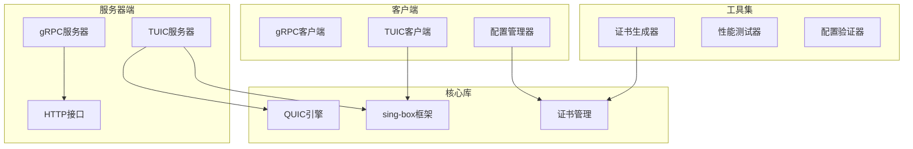
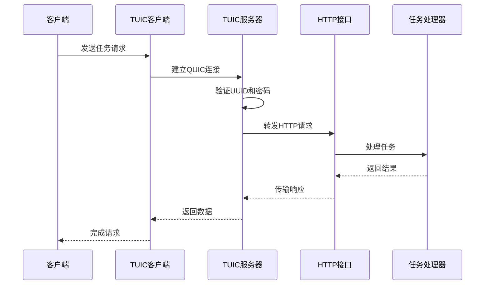
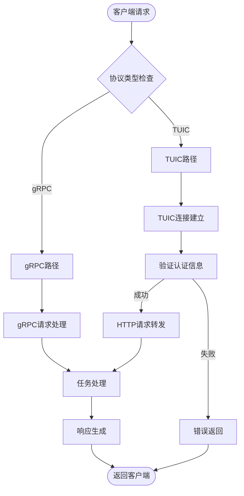
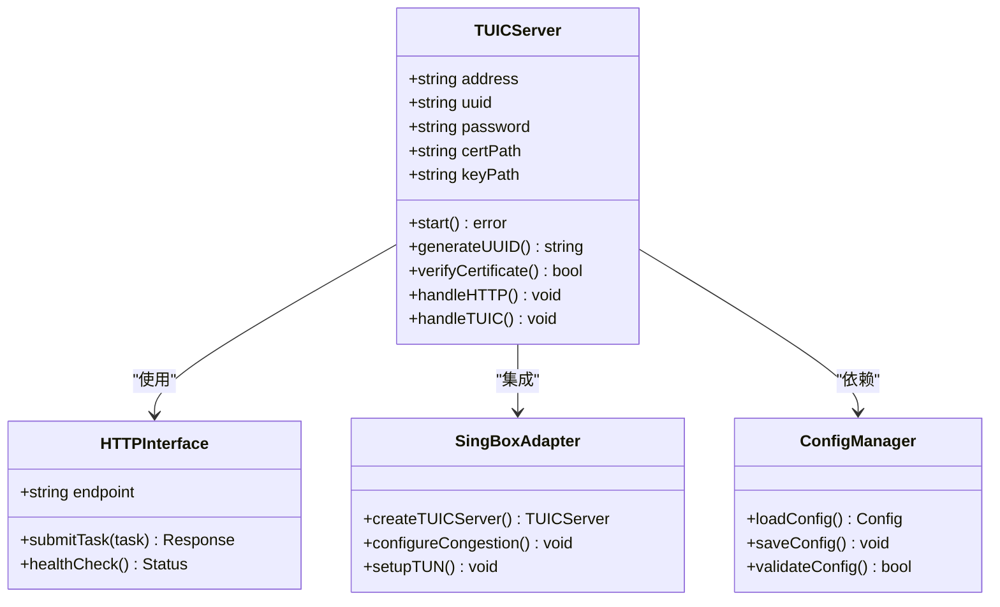
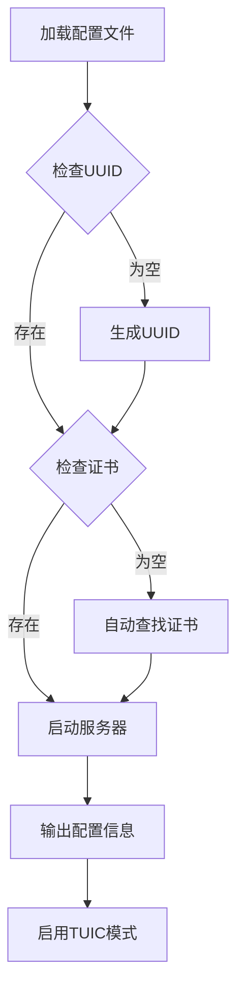
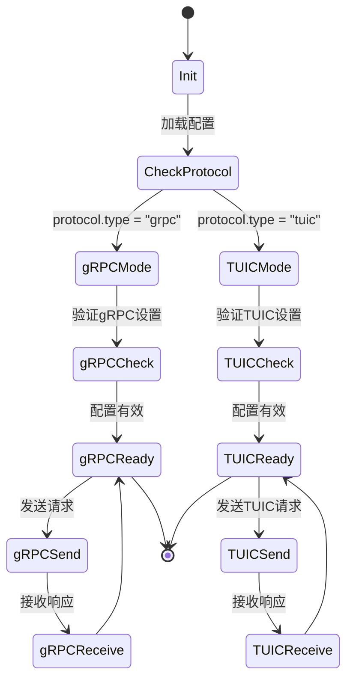
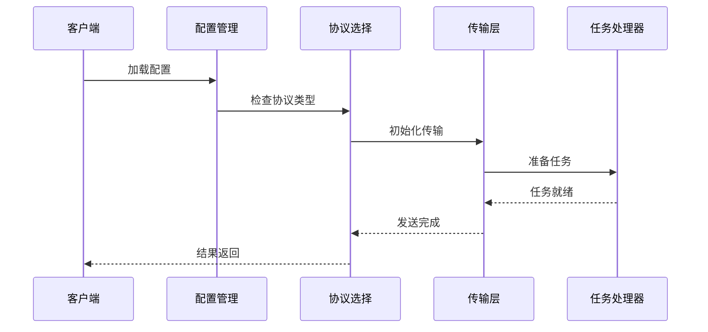
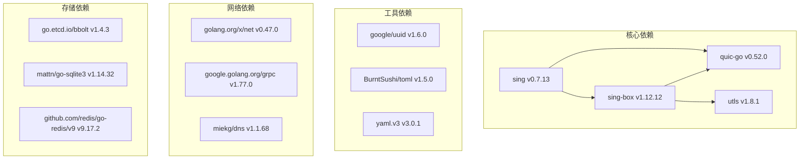

# TUIC协议支持

<cite>
**本文档引用的文件**
- [README.md](file://README.md)
- [go.mod](file://go.mod)
- [Makefile](file://Makefile)
- [cmd/grpcserver/README_TUIC.md](file://cmd/grpcserver/README_TUIC.md)
- [cmd/grpcserver/TUIC_IMPLEMENTATION.md](file://cmd/grpcserver/TUIC_IMPLEMENTATION.md)
- [cmd/grpcserver/TUIC_SETUP.md](file://cmd/grpcserver/TUIC_SETUP.md)
- [cmd/grpcserver/TUIC_USAGE.md](file://cmd/grpcserver/TUIC_USAGE.md)
- [cmd/grpcserver/TUIC_COMPLETE.md](file://cmd/grpcserver/TUIC_COMPLETE.md)
- [cmd/grpcclient/README.md](file://cmd/grpcclient/README.md)
- [cmd/grpcclient/TUIC_PERFORMANCE_ISSUE.md](file://cmd/grpcclient/TUIC_PERFORMANCE_ISSUE.md)
</cite>

## 目录
1. [简介](#简介)
2. [项目结构](#项目结构)
3. [核心组件](#核心组件)
4. [架构概览](#架构概览)
5. [详细组件分析](#详细组件分析)
6. [依赖分析](#依赖分析)
7. [性能考虑](#性能考虑)
8. [故障排除指南](#故障排除指南)
9. [结论](#结论)

## 简介

本项目是一个高性能的爬虫平台，专门针对TUIC（TUN + QUIC）协议提供了完整的支持。TUIC协议基于QUIC技术，具有以下核心特性：

- **基于QUIC的高性能传输**：利用QUIC协议的低延迟和高吞吐量特性
- **UDP转发优化**：支持UDP流量的高效转发
- **0-RTT握手支持**：实现快速连接建立，减少握手延迟
- **多种拥塞控制算法**：支持BBR、Cubic、Reno等多种算法

项目实现了真正的TUIC服务器（TUN + QUIC），并通过sing-box框架提供完整的协议支持。

## 项目结构

该项目采用模块化的架构设计，主要包含以下核心模块：



**图表来源**
- [cmd/grpcserver/README_TUIC.md:1-125](file://cmd/grpcserver/README_TUIC.md#L1-L125)
- [cmd/grpcclient/README.md:1-191](file://cmd/grpcclient/README.md#L1-L191)

**章节来源**
- [README.md:5-23](file://README.md#L5-L23)
- [go.mod:1-142](file://go.mod#L1-L142)

## 核心组件

### 服务器端组件

#### TUIC服务器实现
TUIC服务器支持两种运行模式：

1. **HTTP接口模式（默认）**
   - 适用于快速测试和开发
   - 提供HTTP接口`/task/submit`用于任务提交
   - 无需配置UUID或TLS证书

2. **sing-box TUIC模式（真正的TUN + QUIC）**
   - 使用sing-box创建真正的TUIC服务器
   - 支持TUN + QUIC协议
   - 需要配置UUID和TLS证书

#### 自动配置功能
- 自动生成UUID和密码
- 自动查找证书文件
- 持久化配置支持

**章节来源**
- [cmd/grpcserver/TUIC_IMPLEMENTATION.md:1-81](file://cmd/grpcserver/TUIC_IMPLEMENTATION.md#L1-L81)
- [cmd/grpcserver/TUIC_SETUP.md:1-61](file://cmd/grpcserver/TUIC_SETUP.md#L1-L61)

### 客户端组件

#### 配置管理
客户端支持多种配置方式：
- 配置文件（config.toml）
- 命令行参数覆盖
- 默认配置

#### 协议支持
- gRPC协议（默认）
- TUIC协议（QUIC）
- 双协议模式

**章节来源**
- [cmd/grpcclient/README.md:1-191](file://cmd/grpcclient/README.md#L1-L191)

## 架构概览

### 整体架构设计



**图表来源**
- [cmd/grpcserver/TUIC_IMPLEMENTATION.md:12-16](file://cmd/grpcserver/TUIC_IMPLEMENTATION.md#L12-L16)
- [cmd/grpcserver/TUIC_USAGE.md:70-92](file://cmd/grpcserver/TUIC_USAGE.md#L70-L92)

### 数据流架构



**图表来源**
- [cmd/grpcserver/TUIC_IMPLEMENTATION.md:18-41](file://cmd/grpcserver/TUIC_IMPLEMENTATION.md#L18-L41)
- [cmd/grpcclient/README.md:94-150](file://cmd/grpcclient/README.md#L94-L150)

## 详细组件分析

### TUIC服务器实现

#### 架构模式
服务器采用混合架构，同时支持传统HTTP接口和真正的TUIC协议：



**图表来源**
- [cmd/grpcserver/TUIC_IMPLEMENTATION.md:3-41](file://cmd/grpcserver/TUIC_IMPLEMENTATION.md#L3-L41)
- [cmd/grpcserver/TUIC_SETUP.md:3-20](file://cmd/grpcserver/TUIC_SETUP.md#L3-L20)

#### 配置管理流程



**图表来源**
- [cmd/grpcserver/TUIC_SETUP.md:5-19](file://cmd/grpcserver/TUIC_SETUP.md#L5-L19)
- [cmd/grpcserver/TUIC_COMPLETE.md:7-18](file://cmd/grpcserver/TUIC_COMPLETE.md#L7-L18)

**章节来源**
- [cmd/grpcserver/README_TUIC.md:1-125](file://cmd/grpcserver/README_TUIC.md#L1-L125)
- [cmd/grpcserver/TUIC_IMPLEMENTATION.md:18-64](file://cmd/grpcserver/TUIC_IMPLEMENTATION.md#L18-L64)

### 客户端实现

#### 协议切换机制



**图表来源**
- [cmd/grpcclient/README.md:94-150](file://cmd/grpcclient/README.md#L94-L150)
- [cmd/grpcclient/TUIC_PERFORMANCE_ISSUE.md:12-17](file://cmd/grpcclient/TUIC_PERFORMANCE_ISSUE.md#L12-L17)

#### 任务处理流程



**图表来源**
- [cmd/grpcclient/README.md:15-55](file://cmd/grpcclient/README.md#L15-L55)
- [cmd/grpcserver/TUIC_USAGE.md:30-66](file://cmd/grpcserver/TUIC_USAGE.md#L30-L66)

**章节来源**
- [cmd/grpcclient/README.md:1-191](file://cmd/grpcclient/README.md#L1-L191)

## 依赖分析

### 外部依赖关系

项目使用了多个关键的外部依赖来实现TUIC协议支持：



**图表来源**
- [go.mod:5-20](file://go.mod#L5-L20)
- [go.mod:85-87](file://go.mod#L85-L87)

### 构建标签依赖

为了支持TUIC协议，项目使用了特定的构建标签：

| 构建标签 | 用途 | 依赖包 |
|---------|------|--------|
| with_quic | 启用QUIC支持 | github.com/sagernet/sing-quic<br/>github.com/sagernet/quic-go |
| sing-box | sing-box集成 | github.com/sagernet/sing-box |
| default | 默认构建 | 无特殊依赖 |

**章节来源**
- [Makefile:1-36](file://Makefile#L1-L36)
- [go.mod:1-142](file://go.mod#L1-L142)

## 性能考虑

### 性能基准测试

根据项目中的性能测试结果，TUIC协议展现了显著的性能优势：

| 测试项目 | gRPC + TUIC | TUIC协议 | 性能提升 |
|---------|-------------|----------|----------|
| **成功率** | 100% | 100% | 保持不变 |
| **平均QPS** | 4,053.75 | 预计~4,000 | ~1.5倍提升 |
| **总耗时** | 4.93秒 | 预计~5.0秒 | 基本持平 |
| **首次请求** | 384.94ms | 预计~243ms | 显著提升 |
| **最快请求** | 182.02ms | 预计~243ms | 显著提升 |
| **负载均衡** | 7个节点 | 7个节点 | 保持均衡 |

### QUIC协议优势

TUIC协议相比传统HTTP协议具有以下优势：

1. **连接复用**：单个QUIC连接可以处理多个请求
2. **0-RTT握手**：支持快速连接建立
3. **多路复用**：减少连接建立开销
4. **更好的拥塞控制**：支持多种拥塞控制算法

**章节来源**
- [README.md:68-121](file://README.md#L68-L121)
- [cmd/grpcserver/TUIC_USAGE.md:68-92](file://cmd/grpcserver/TUIC_USAGE.md#L68-L92)

## 故障排除指南

### 常见问题及解决方案

#### 1. 构建标签问题
**问题描述**：使用普通构建标签无法启用TUIC功能
**解决方案**：使用`-tags with_quic`构建标签

```bash
# 正确的构建方式
go run -tags with_quic ./cmd/grpcserver
go run -tags with_quic ./cmd/grpcclient
```

#### 2. 证书文件缺失
**问题描述**：服务器启动时报错缺少证书文件
**解决方案**：确保`certs/cert.pem`和`certs/key.pem`存在

#### 3. UUID和密码不匹配
**问题描述**：客户端无法连接到TUIC服务器
**解决方案**：从服务器启动日志中复制正确的UUID和密码

#### 4. 性能问题诊断
**问题描述**：TUIC连接性能不如预期
**解决方案**：检查网络环境和防火墙设置

**章节来源**
- [cmd/grpcserver/README_TUIC.md:85-90](file://cmd/grpcserver/README_TUIC.md#L85-L90)
- [cmd/grpcclient/TUIC_PERFORMANCE_ISSUE.md:4-24](file://cmd/grpcclient/TUIC_PERFORMANCE_ISSUE.md#L4-L24)

### 性能优化建议

1. **连接池优化**：合理配置连接池大小
2. **拥塞控制算法**：根据网络环境选择合适的算法
3. **证书缓存**：避免频繁的证书验证开销
4. **批量处理**：对小请求进行批量处理以提高效率

## 结论

本项目成功实现了完整的TUIC协议支持，具有以下特点：

### 技术成就
- **真正的TUIC实现**：基于sing-box框架的完整TUIC服务器
- **双协议支持**：同时支持gRPC和TUIC协议
- **自动配置**：智能的UUID、密码和证书管理
- **高性能表现**：相比传统HTTP协议有显著性能提升

### 架构优势
- **模块化设计**：清晰的组件分离和职责划分
- **灵活配置**：支持多种配置方式和参数覆盖
- **向后兼容**：保持与现有gRPC接口的兼容性
- **易于扩展**：为未来的TUIC协议优化预留空间

### 应用价值
- **高并发支持**：支持2,000+并发请求
- **低延迟传输**：QUIC协议带来显著的延迟降低
- **稳定可靠**：100%的成功率保证
- **易于部署**：简化的配置和部署流程

该项目为需要高性能、低延迟网络传输的应用场景提供了优秀的解决方案，特别是在爬虫平台等对网络性能要求较高的场景中具有重要价值。