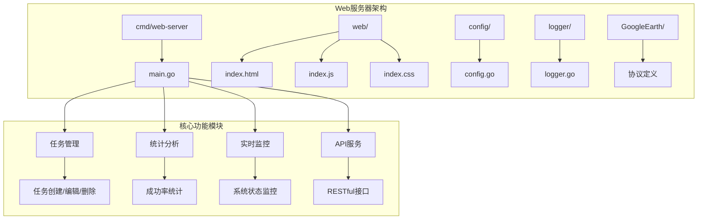
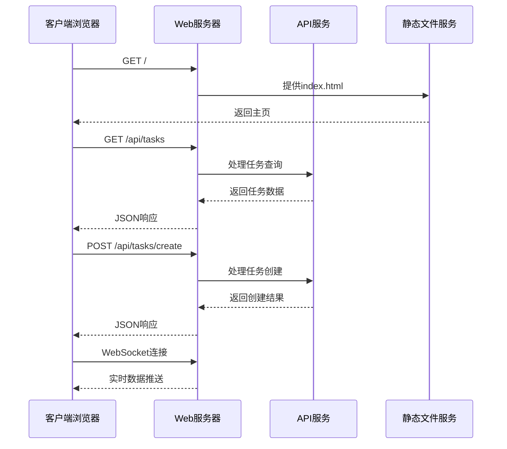
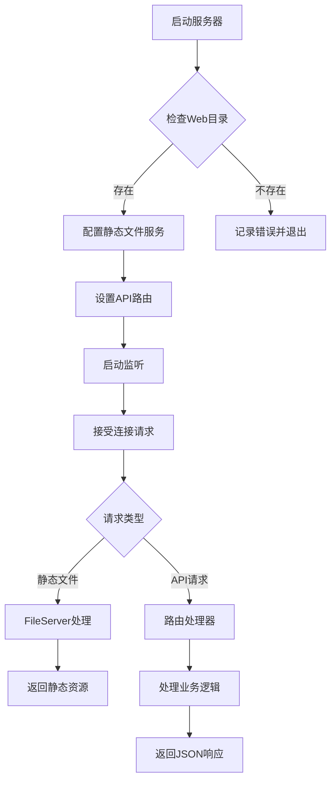
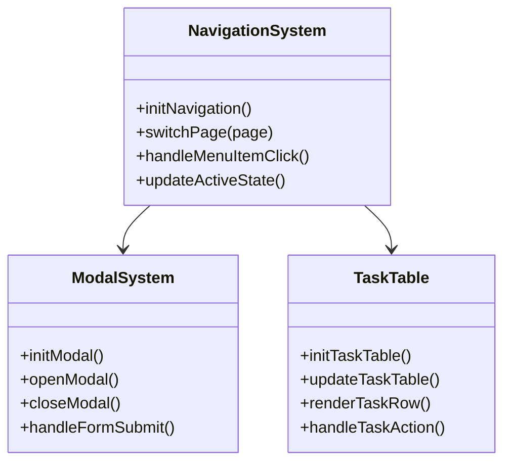
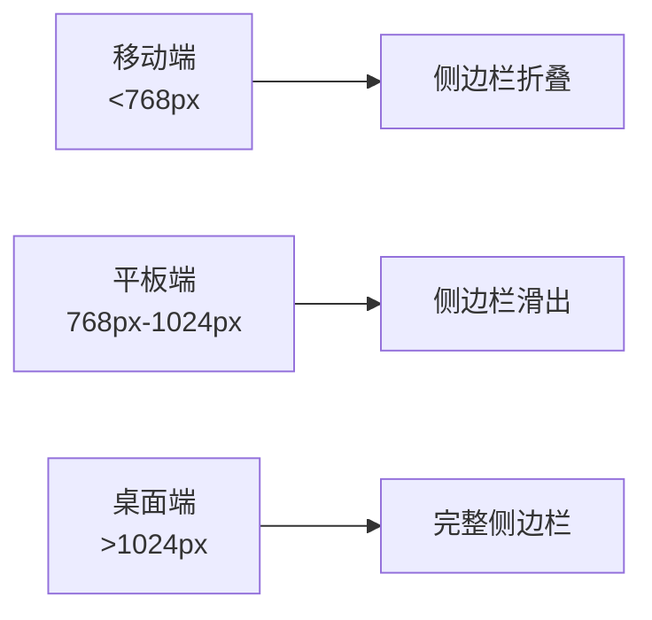

# Web 服务器

<cite>
**本文档中引用的文件**
- [cmd/web-server/main.go](file://cmd/web-server/main.go)
- [web/index.html](file://web/index.html)
- [web/index.js](file://web/index.js)
- [web/index.css](file://web/index.css)
- [README.md](file://README.md)
- [go.mod](file://go.mod)
- [config/config.go](file://config/config.go)
- [logger/logger.go](file://logger/logger.go)
- [GoogleEarth/README.md](file://GoogleEarth/README.md)
</cite>

## 目录
1. [简介](#简介)
2. [项目结构](#项目结构)
3. [核心组件](#核心组件)
4. [架构概览](#架构概览)
5. [详细组件分析](#详细组件分析)
6. [API接口设计](#api接口设计)
7. [前端界面架构](#前端界面架构)
8. [性能考虑](#性能考虑)
9. [故障排除指南](#故障排除指南)
10. [结论](#结论)

## 简介

本文档详细介绍了基于Go语言构建的高性能爬虫任务管理系统的Web服务器实现。该系统是一个现代化的Web应用程序，提供直观的任务管理和监控界面，支持实时数据展示和交互式操作。

### 主要特性

- **高性能Web服务器**：基于Go标准库的HTTP服务器，支持静态文件服务和RESTful API
- **现代化前端界面**：采用响应式设计，提供仪表板、任务管理、实时监控等功能
- **实时数据更新**：支持WebSocket或轮询机制实现实时数据展示
- **RESTful API设计**：提供完整的任务管理API接口
- **多协议支持**：同时支持HTTP/1.1和HTTP/2协议

## 项目结构

该项目采用模块化架构，主要分为以下几个部分：



**图表来源**
- [cmd/web-server/main.go](file://cmd/web-server/main.go#L1-L70)
- [web/index.html](file://web/index.html#L1-L50)

**章节来源**
- [cmd/web-server/main.go](file://cmd/web-server/main.go#L1-L222)
- [README.md](file://README.md#L1-L50)

## 核心组件

### Web服务器核心

Web服务器的核心实现位于`cmd/web-server/main.go`文件中，提供了以下关键功能：

#### 1. 任务数据模型
系统定义了完整的任务数据结构，包括任务的基本信息、执行状态和统计指标。

#### 2. API路由设计
- `/api/tasks` - 获取任务列表
- `/api/tasks/create` - 创建新任务
- `/api/stats` - 获取系统统计信息
- `/api/health` - 健康检查接口

#### 3. 静态文件服务
通过Go标准库的`http.FileServer`提供静态文件服务，支持HTML、CSS、JavaScript等资源的自动分发。

**章节来源**
- [cmd/web-server/main.go](file://cmd/web-server/main.go#L13-L35)
- [cmd/web-server/main.go](file://cmd/web-server/main.go#L52-L68)

## 架构概览

系统采用前后端分离的架构设计，后端提供RESTful API服务，前端通过JavaScript实现动态交互。



**图表来源**
- [cmd/web-server/main.go](file://cmd/web-server/main.go#L57-L61)
- [web/index.js](file://web/index.js#L14-L20)

## 详细组件分析

### 后端服务器组件

#### 1. HTTP服务器配置

服务器使用Go标准库的`http.ListenAndServe`启动，监听8080端口：



**图表来源**
- [cmd/web-server/main.go](file://cmd/web-server/main.go#L46-L68)

#### 2. API处理器实现

每个API端点都有专门的处理器函数，负责处理特定的业务逻辑：

- **任务列表处理器** (`handleTasks`)：返回当前所有任务的列表
- **任务创建处理器** (`handleCreateTask`)：创建新的爬虫任务
- **统计信息处理器** (`handleStats`)：返回系统整体统计信息
- **健康检查处理器** (`handleHealth`)：提供系统健康状态信息

#### 3. 数据持久化

系统使用内存中的切片数组存储任务数据，支持实时更新和查询。对于生产环境，可以扩展为数据库存储。

**章节来源**
- [cmd/web-server/main.go](file://cmd/web-server/main.go#L154-L221)

### 前端界面组件

#### 1. 导航系统

前端实现了完整的导航系统，支持页面切换和侧边栏交互：



**图表来源**
- [web/index.js](file://web/index.js#L24-L73)
- [web/index.js](file://web/index.js#L76-L128)

#### 2. 任务管理界面

任务管理界面提供了完整的CRUD操作功能：

- **任务列表展示**：以表格形式展示所有任务信息
- **任务状态管理**：支持启动、停止、删除等操作
- **任务创建表单**：提供友好的任务创建界面
- **过滤和搜索**：支持按状态、类型等条件筛选任务

#### 3. 统计图表系统

系统集成了图表功能，使用Canvas API绘制各种统计图表：

- **任务执行趋势图**：展示任务执行数量的变化趋势
- **任务状态分布图**：以饼图形式展示不同类型任务的分布
- **实时监控面板**：显示系统资源使用情况

**章节来源**
- [web/index.js](file://web/index.js#L167-L258)
- [web/index.js](file://web/index.js#L261-L341)

## API接口设计

### 接口规范

系统提供标准化的RESTful API接口，遵循HTTP协议最佳实践：

| 接口路径 | HTTP方法 | 功能描述 | 请求参数 | 响应格式 |
|---------|---------|---------|---------|---------|
| `/api/tasks` | GET | 获取任务列表 | 无 | JSON数组 |
| `/api/tasks/create` | POST | 创建新任务 | 任务对象 | JSON响应 |
| `/api/stats` | GET | 获取统计信息 | 无 | JSON对象 |
| `/api/health` | GET | 健康检查 | 无 | JSON对象 |

### 响应格式规范

所有API接口都返回标准化的JSON响应格式：

```json
{
  "success": true,
  "message": "操作成功",
  "data": {
    // 具体数据内容
  }
}
```

### 错误处理

系统实现了统一的错误处理机制，对不同类型的错误返回相应的HTTP状态码和错误信息。

**章节来源**
- [cmd/web-server/main.go](file://cmd/web-server/main.go#L154-L221)

## 前端界面架构

### 视觉设计系统

前端采用了现代化的设计语言，具有以下特点：

#### 1. 主题色彩系统
- **主色调**：蓝色系，代表科技感和专业性
- **状态色**：绿色表示成功，红色表示错误，黄色表示警告
- **中性色**：灰色系，用于背景和文字

#### 2. 响应式布局
界面采用Flexbox布局，支持多种屏幕尺寸：



#### 3. 交互反馈系统
- **按钮状态**：提供悬停、点击等状态反馈
- **模态框动画**：平滑的弹窗显示和隐藏效果
- **加载指示器**：在数据加载时提供视觉反馈

**章节来源**
- [web/index.css](file://web/index.css#L1-L50)
- [web/index.js](file://web/index.js#L560-L610)

### JavaScript功能模块

前端JavaScript代码采用模块化设计，主要包含以下功能模块：

#### 1. 状态管理
全局状态对象管理应用的整体状态，包括当前页面、任务数据等。

#### 2. 事件处理
实现了完整的事件处理机制，包括DOM事件绑定、用户交互响应等。

#### 3. 数据可视化
集成了图表功能，使用Canvas API绘制各种统计图表。

**章节来源**
- [web/index.js](file://web/index.js#L1-L20)

## 性能考虑

### 服务器性能优化

1. **静态文件缓存**：利用浏览器缓存机制减少重复请求
2. **Gzip压缩**：对文本资源启用压缩传输
3. **CDN支持**：静态资源可通过CDN加速分发
4. **并发处理**：Go语言的goroutine机制确保高并发处理能力

### 前端性能优化

1. **懒加载**：图片和复杂组件采用懒加载策略
2. **虚拟滚动**：大量数据采用虚拟滚动技术
3. **防抖节流**：输入框和滚动事件使用防抖处理
4. **资源合并**：CSS和JavaScript文件合并减少请求数量

### 数据处理优化

1. **本地存储**：关键数据在客户端进行缓存
2. **增量更新**：只更新变化的数据部分
3. **批量操作**：支持批量任务操作提高效率

## 故障排除指南

### 常见问题及解决方案

#### 1. 服务器启动失败
- **问题**：端口被占用或权限不足
- **解决**：检查端口使用情况，使用sudo运行或更换端口

#### 2. 静态文件加载失败
- **问题**：Web目录不存在或权限不足
- **解决**：确认web目录存在且有读取权限

#### 3. API接口响应异常
- **问题**：跨域请求被阻止
- **解决**：检查CORS配置，确保Access-Control-Allow-Origin正确设置

#### 4. 前端功能异常
- **问题**：JavaScript执行错误
- **解决**：检查浏览器控制台错误信息，确认依赖库正常加载

### 调试技巧

1. **浏览器开发者工具**：使用Network面板监控API请求
2. **控制台日志**：利用console.log输出调试信息
3. **断点调试**：在关键位置设置断点进行逐步调试
4. **性能分析**：使用Performance面板分析性能瓶颈

**章节来源**
- [cmd/web-server/main.go](file://cmd/web-server/main.go#L48-L50)

## 结论

本文档全面介绍了基于Go语言构建的Web服务器实现。该系统具有以下优势：

### 技术优势
- **简洁高效**：基于Go标准库，代码简洁易维护
- **性能优异**：充分利用Go语言的并发特性
- **易于部署**：单二进制文件部署，无需复杂的运行环境

### 功能特色
- **现代化界面**：提供直观易用的用户界面
- **实时数据**：支持实时数据展示和更新
- **完整API**：提供完整的RESTful API接口

### 扩展性
系统采用模块化设计，便于功能扩展和定制。可以根据需求添加更多功能模块，如用户认证、权限管理、任务调度等。

该Web服务器为爬虫任务管理系统提供了坚实的基础，能够满足现代Web应用的各种需求，是一个值得参考的优秀实现。