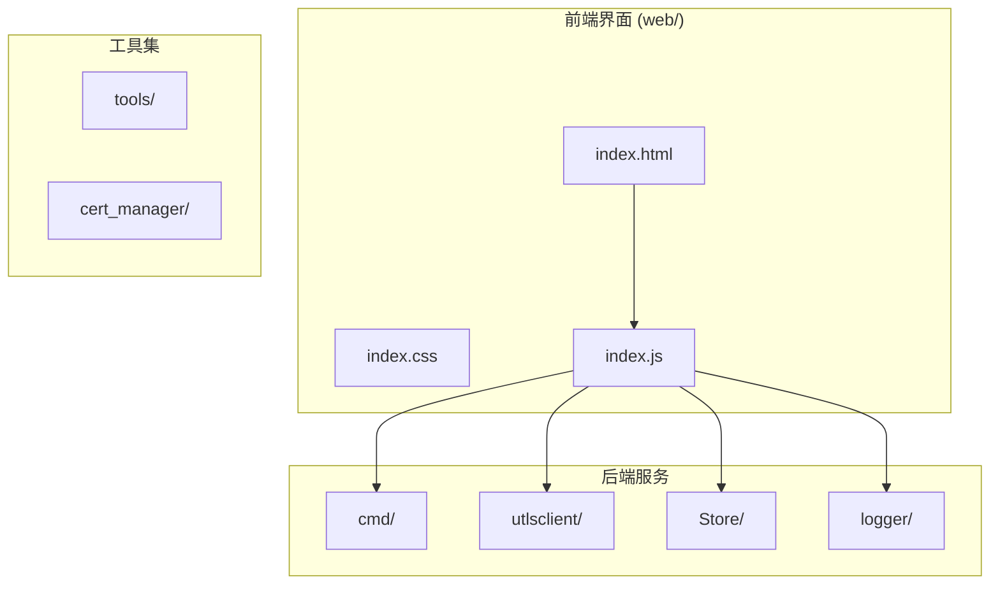
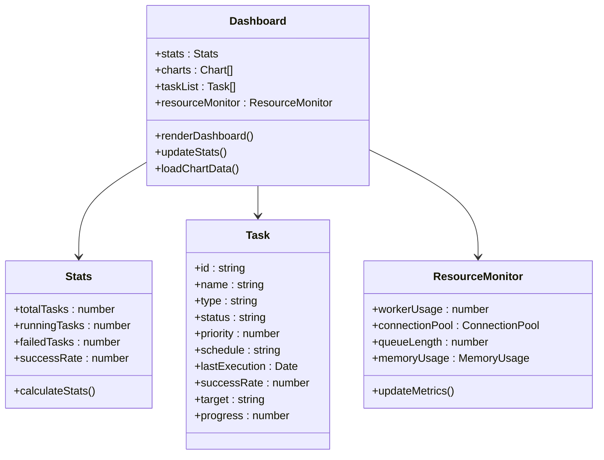
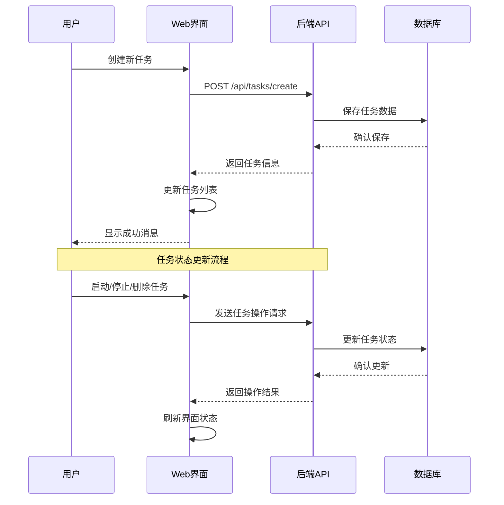
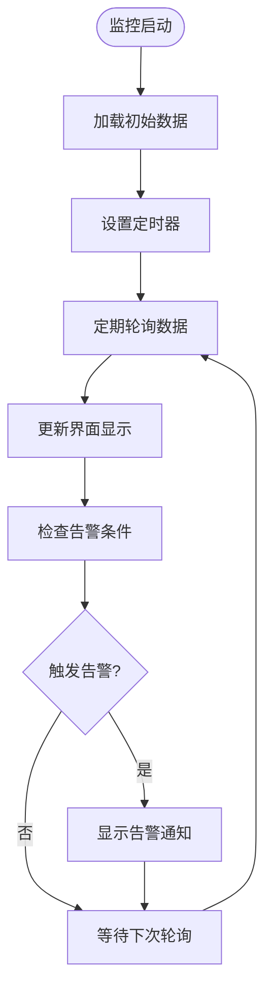
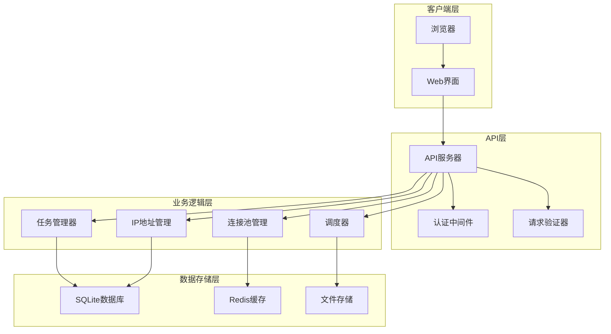
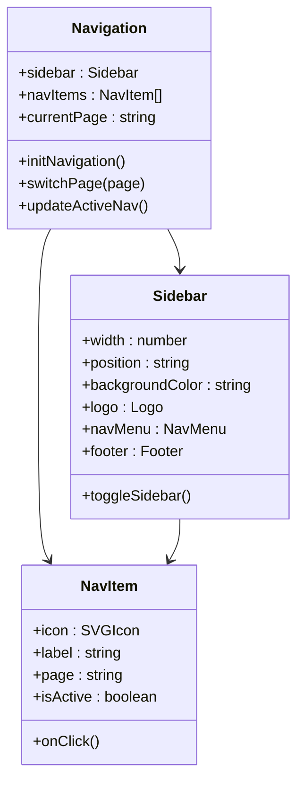
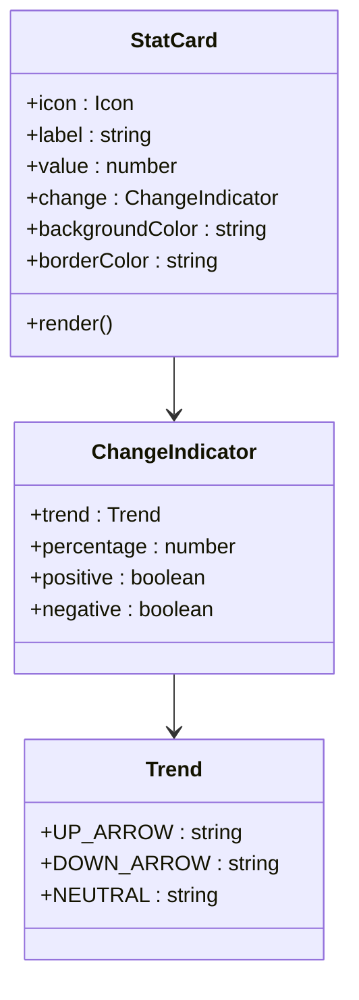
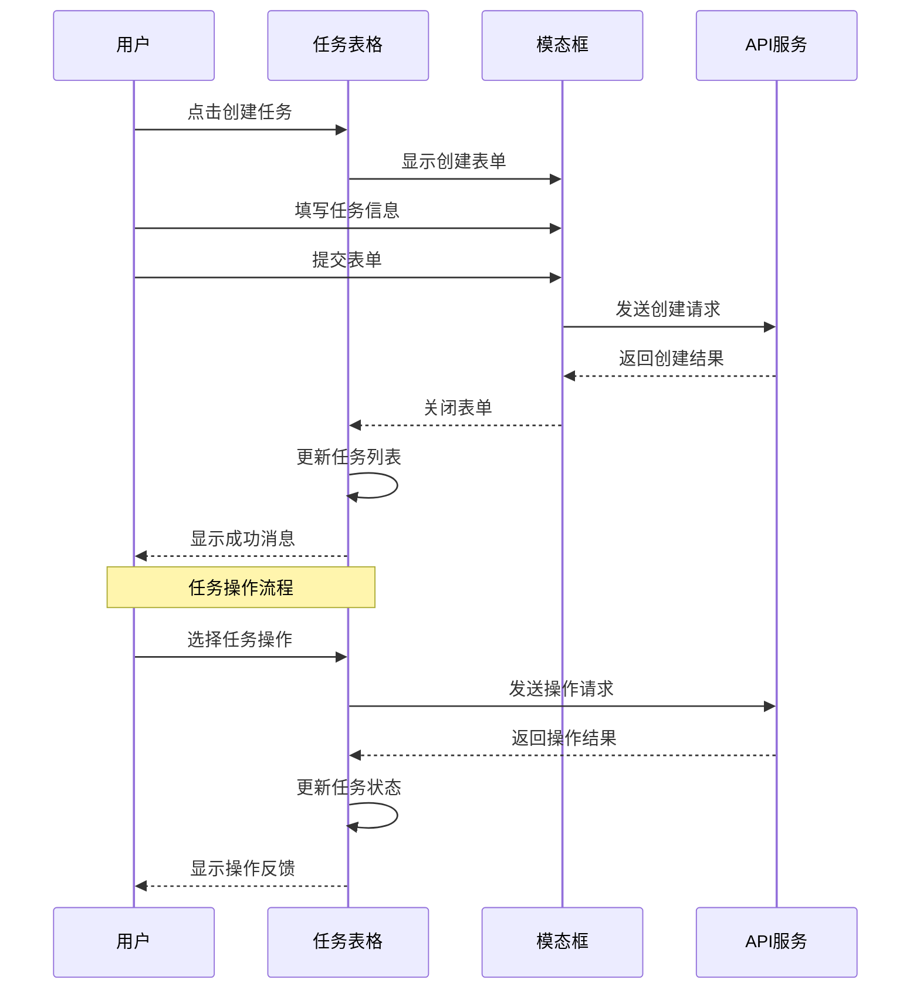
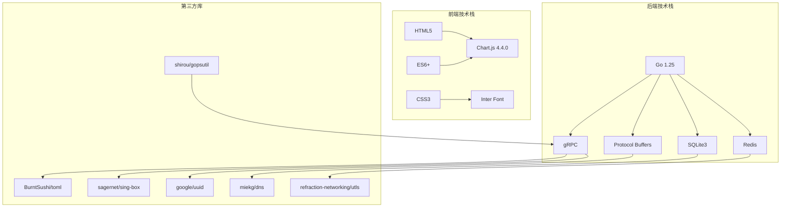

# Web界面现代化

<cite>
**本文档引用的文件**
- [index.html](file://web/index.html)
- [index.js](file://web/index.js)
- [index.css](file://web/index.css)
- [README.md](file://README.md)
- [go.mod](file://go.mod)
- [version.go](file://version.go)
- [utlsclient.go](file://utlsclient/utlsclient.go)
- [sqlitedb.go](file://Store/sqlitedb.go)
- [logger.go](file://logger/logger.go)
- [main.go](file://tools/cert_manager/main.go)
</cite>

## 目录
1. [简介](#简介)
2. [项目结构](#项目结构)
3. [核心组件](#核心组件)
4. [架构概览](#架构概览)
5. [详细组件分析](#详细组件分析)
6. [依赖关系分析](#依赖关系分析)
7. [性能考虑](#性能考虑)
8. [故障排除指南](#故障排除指南)
9. [结论](#结论)

## 简介

这是一个高性能的爬虫平台，专注于现代Web界面的设计与实现。该项目采用现代化的前端技术栈，结合Go语言后端服务，提供了完整的任务管理和监控功能。Web界面采用了响应式设计，支持多种设备访问，具备丰富的交互功能和实时数据展示能力。

项目的主要特点包括：
- 基于Chart.js的可视化图表展示
- 响应式布局设计
- 现代化的UI组件和动画效果
- 实时数据更新和监控功能
- 完整的任务生命周期管理

## 项目结构

项目采用模块化组织方式，主要分为以下几个部分：

**图表来源**
- [index.html:1-1077](file://web/index.html#L1-L1077)
- [index.js:1-1057](file://web/index.js#L1-L1057)
- [index.css:1-1140](file://web/index.css#L1-L1140)

**章节来源**
- [README.md:1-121](file://README.md#L1-L121)

## 核心组件

### 1. 仪表板系统

仪表板是整个Web界面的核心，提供了全面的任务管理和监控功能：

**图表来源**
- [index.js:1-200](file://web/index.js#L1-L200)
- [index.html:134-365](file://web/index.html#L134-L365)

### 2. 任务管理系统

任务管理功能提供了完整的任务生命周期管理：

**图表来源**
- [index.js:149-195](file://web/index.js#L149-L195)
- [index.js:318-337](file://web/index.js#L318-L337)

### 3. 实时监控系统

监控系统提供了实时的系统状态和性能指标：

**图表来源**
- [index.js:310-337](file://web/index.js#L310-L337)
- [index.js:529-540](file://web/index.js#L529-L540)

**章节来源**
- [index.html:1-1077](file://web/index.html#L1-L1077)
- [index.js:1-1057](file://web/index.js#L1-L1057)
- [index.css:1-1140](file://web/index.css#L1-L1140)

## 架构概览

整个系统的架构采用前后端分离的设计模式：

**图表来源**
- [utlsclient.go:1-459](file://utlsclient/utlsclient.go#L1-L459)
- [sqlitedb.go:1-609](file://Store/sqlitedb.go#L1-L609)
- [logger.go:1-133](file://logger/logger.go#L1-L133)

## 详细组件分析

### 1. 导航系统

导航系统采用了现代化的侧边栏设计，支持响应式布局：

**图表来源**
- [index.js:43-92](file://web/index.js#L43-L92)
- [index.html:19-94](file://web/index.html#L19-L94)

### 2. 统计卡片系统

统计卡片提供了直观的数据展示：

**图表来源**
- [index.html:136-225](file://web/index.html#L136-L225)
- [index.css:398-486](file://web/index.css#L398-L486)

### 3. 任务表格系统

任务表格支持复杂的交互功能：

**图表来源**
- [index.js:95-147](file://web/index.js#L95-L147)
- [index.js:427-449](file://web/index.js#L427-L449)

**章节来源**
- [index.js:1-1057](file://web/index.js#L1-L1057)
- [index.html:1-1077](file://web/index.html#L1-L1077)
- [index.css:1-1140](file://web/index.css#L1-L1140)

## 依赖关系分析

项目的技术栈和依赖关系如下：

**图表来源**
- [go.mod:1-142](file://go.mod#L1-L142)

**章节来源**
- [go.mod:1-142](file://go.mod#L1-L142)

## 性能考虑

### 1. 前端性能优化

Web界面采用了多项性能优化策略：

- **懒加载**: 图表和数据在需要时才加载
- **虚拟滚动**: 大数据集采用虚拟滚动技术
- **缓存机制**: 本地缓存常用数据
- **响应式设计**: 适配不同设备性能

### 2. 后端性能优化

后端服务具备以下性能特性：

- **连接池管理**: 高效的数据库连接池
- **异步处理**: 非阻塞的异步任务处理
- **缓存策略**: 多层缓存减少数据库压力
- **负载均衡**: 支持多节点部署

### 3. 网络优化

- **CDN加速**: 静态资源通过CDN分发
- **压缩传输**: Gzip压缩减少传输体积
- **HTTP/2支持**: 提升并发性能
- **TLS优化**: 使用现代加密算法

## 故障排除指南

### 1. 常见问题诊断

**问题**: 任务列表无法加载
- 检查网络连接状态
- 验证API服务可用性
- 查看浏览器开发者工具控制台

**问题**: 图表显示异常
- 确认Chart.js库正确加载
- 检查数据格式是否正确
- 验证Canvas元素可用性

**问题**: 响应式布局失效
- 检查CSS媒体查询
- 验证viewport设置
- 测试不同屏幕尺寸

### 2. 性能问题排查

**CPU使用率过高**:
- 检查JavaScript循环和递归
- 优化DOM操作频率
- 减少不必要的重绘

**内存泄漏**:
- 检查事件监听器绑定
- 确保定时器正确清理
- 验证对象引用管理

### 3. 安全性检查

**XSS防护**:
- 输入数据过滤和转义
- 使用安全的DOM操作方法
- 验证用户输入

**CSRF防护**:
- 实施CSRF令牌验证
- 配置正确的CORS策略
- 使用安全的Cookie设置

**章节来源**
- [logger.go:1-133](file://logger/logger.go#L1-L133)
- [utlsclient.go:1-459](file://utlsclient/utlsclient.go#L1-L459)

## 结论

这个Web界面现代化项目展现了现代Web开发的最佳实践，结合了强大的后端服务和优雅的前端设计。项目的主要优势包括：

1. **现代化的用户体验**: 采用最新的前端技术和设计理念
2. **高性能架构**: 前后端分离，支持高并发访问
3. **完整的功能体系**: 从任务管理到实时监控的全方位覆盖
4. **良好的扩展性**: 模块化设计便于功能扩展和维护
5. **跨平台兼容**: 响应式设计支持多种设备访问

项目的成功实施为类似的企业级应用提供了优秀的参考案例，特别是在爬虫平台和任务管理系统领域。通过持续的优化和改进，这个项目将继续为用户提供更好的服务体验。