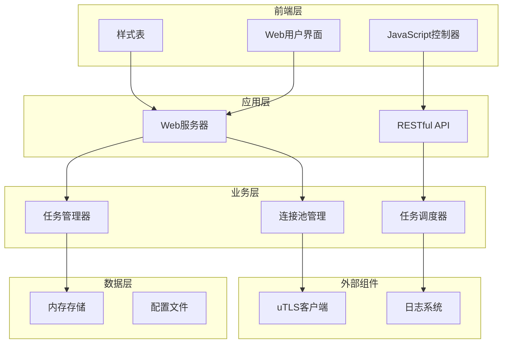
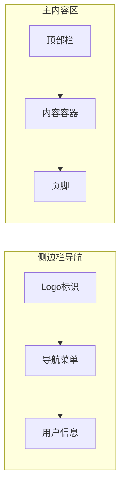
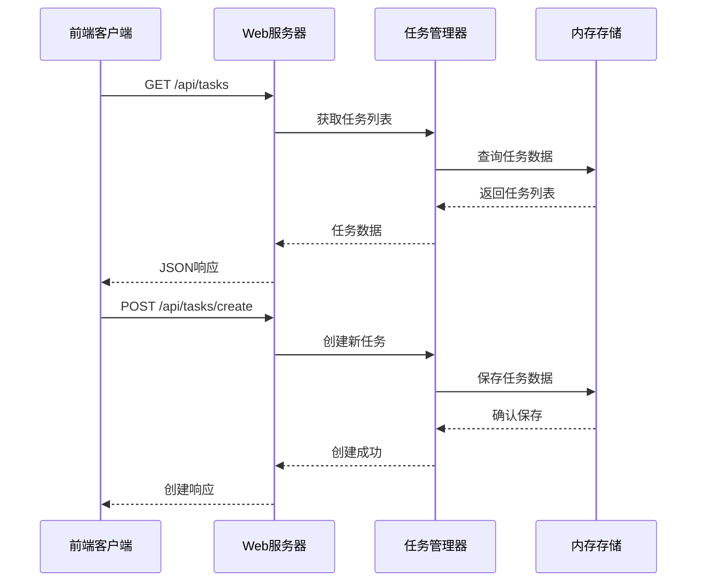
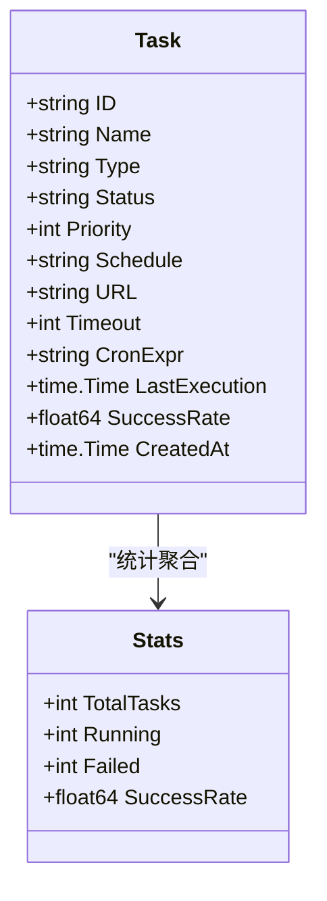
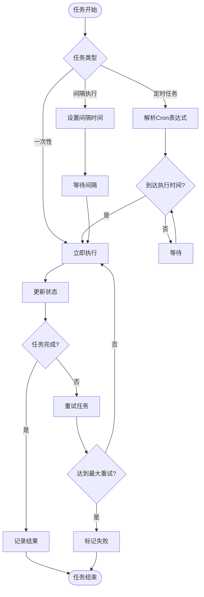
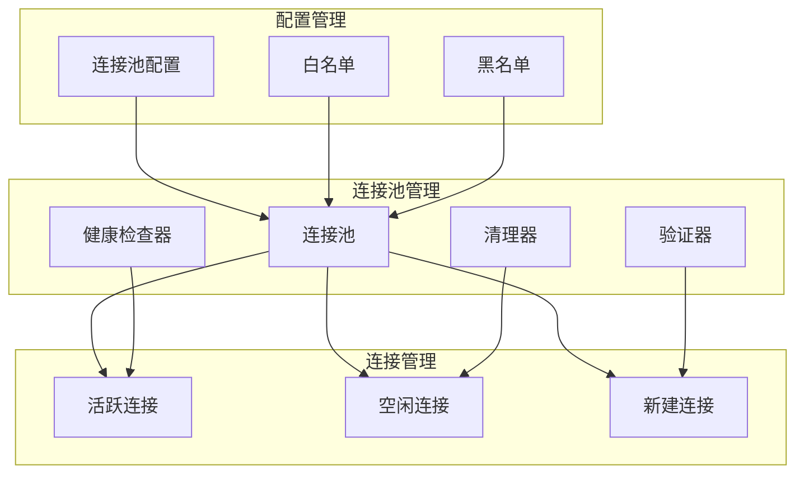

# 任务管理界面

<cite>
**本文档引用的文件**
- [README.md](file://README.md)
- [web/index.html](file://web/index.html)
- [web/index.js](file://web/index.js)
- [web/index.css](file://web/index.css)
- [cmd/web-server/main.go](file://cmd/web-server/main.go)
- [utlsclient/utlshotconnpool.go](file://utlsclient/utlshotconnpool.go)
- [utlsclient/utlsclient.go](file://utlsclient/utlsclient.go)
</cite>

## 目录
1. [项目概述](#项目概述)
2. [系统架构](#系统架构)
3. [前端界面设计](#前端界面设计)
4. [后端API设计](#后端api设计)
5. [核心功能模块](#核心功能模块)
6. [技术实现细节](#技术实现细节)
7. [性能优化策略](#性能优化策略)
8. [部署和配置](#部署和配置)
9. [故障排除指南](#故障排除指南)
10. [总结](#总结)

## 项目概述

爬虫任务管理系统是一个基于高性能uTLS的爬虫平台，提供了完整的任务管理、监控和调度功能。该系统支持多种任务类型，包括HTTP请求、Google Earth数据采集和自定义任务，具备实时监控、任务调度和可视化管理能力。

### 核心特性

- **高性能爬虫引擎**: 基于uTLS的热连接池，支持TLS指纹伪装和HTTP/2协议
- **多任务管理**: 支持创建、监控、调度和删除各种类型的爬虫任务
- **实时监控**: 提供任务执行状态、成功率和系统资源的实时监控
- **可视化界面**: 现代化的Web界面，支持响应式设计
- **灵活调度**: 支持一次性、定时任务(Cron)和间隔执行等多种调度方式

**章节来源**
- [README.md](file://README.md#L1-L100)

## 系统架构

### 整体架构图



**图表来源**
- [web/index.html](file://web/index.html#L1-L50)
- [cmd/web-server/main.go](file://cmd/web-server/main.go#L1-L50)

### 前后端分离设计

系统采用前后端分离架构，前端负责用户交互和数据展示，后端提供RESTful API服务：

- **前端技术栈**: HTML5 + CSS3 + JavaScript (ES6+)
- **后端技术栈**: Go语言 + HTTP服务器
- **通信协议**: JSON over HTTP
- **状态管理**: 前端本地状态 + 后端持久化存储

**章节来源**
- [web/index.html](file://web/index.html#L1-L100)
- [cmd/web-server/main.go](file://cmd/web-server/main.go#L40-L80)

## 前端界面设计

### 界面布局结构

系统采用经典的侧边栏导航 + 主内容区的设计模式：



**图表来源**
- [web/index.html](file://web/index.html#L15-L80)

### 主要页面组件

#### 1. 仪表板页面

仪表板提供系统概览和关键指标展示：

- **统计卡片**: 总任务数、运行中任务、失败任务、成功率
- **趋势图表**: 任务执行趋势和状态分布
- **最近任务**: 显示最近执行的5个任务及其状态
- **资源监控**: Worker使用率、连接池使用率、队列长度、内存使用

#### 2. 任务管理页面

任务管理页面提供完整的任务生命周期管理：

- **任务列表**: 展示所有任务的详细信息
- **过滤功能**: 按状态和类型筛选任务
- **操作按钮**: 启动、停止、删除任务
- **创建任务**: 弹窗式任务创建表单

#### 3. 实时监控页面

提供系统运行时的实时监控信息：

- **连接池状态**: 当前连接数、活跃连接、空闲连接
- **任务执行状态**: 正在执行的任务列表
- **错误日志**: 实时显示错误信息和警告

#### 4. 执行日志页面

详细的任务执行日志记录：

- **日志级别**: ERROR、WARN、INFO、DEBUG
- **时间戳**: 精确到毫秒的时间记录
- **任务关联**: 每条日志与具体任务的关联关系

#### 5. 系统设置页面

系统配置和参数设置：

- **连接池配置**: 最大连接数、超时设置、健康检查间隔
- **任务调度配置**: 默认超时、重试次数、并发限制
- **安全设置**: 认证配置、访问控制

**章节来源**
- [web/index.html](file://web/index.html#L110-L492)
- [web/index.js](file://web/index.js#L1-L100)

### 样式设计规范

系统采用现代化的UI设计语言：

- **配色方案**: 主色调#6366f1，辅助色系包含绿色(success)、橙色(warning)、红色(danger)
- **字体系统**: 使用Inter字体，支持多语言字符集
- **响应式设计**: 支持桌面、平板、手机等不同设备
- **动画效果**: 平滑的过渡动画和交互动效

**章节来源**
- [web/index.css](file://web/index.css#L1-L100)

## 后端API设计

### RESTful API架构

系统提供完整的RESTful API接口，支持任务的CRUD操作：



**图表来源**
- [cmd/web-server/main.go](file://cmd/web-server/main.go#L56-L60)

### API端点定义

| 端点 | 方法 | 描述 | 请求参数 | 响应格式 |
|------|------|------|----------|----------|
| `/api/tasks` | GET | 获取任务列表 | 无 | `{success: true, data: Task[]}` |
| `/api/tasks/create` | POST | 创建新任务 | Task对象 | `{success: true, message: string, data: Task}` |
| `/api/stats` | GET | 获取系统统计 | 无 | `{success: true, data: Stats}` |
| `/api/health` | GET | 健康检查 | 无 | `{status: string, time: string, version: string}` |

### 任务数据模型



**图表来源**
- [cmd/web-server/main.go](file://cmd/web-server/main.go#L14-L35)

**章节来源**
- [cmd/web-server/main.go](file://cmd/web-server/main.go#L56-L222)

## 核心功能模块

### 任务管理模块

#### 任务生命周期管理

系统支持完整的任务生命周期管理：

1. **任务创建**: 通过Web界面或API创建新任务
2. **任务调度**: 支持多种调度策略（一次性、定时、间隔）
3. **任务执行**: 自动执行任务并跟踪执行状态
4. **状态监控**: 实时监控任务执行状态
5. **任务终止**: 支持手动停止正在执行的任务
6. **任务删除**: 彻底删除已完成或失败的任务

#### 任务类型支持

系统支持三种主要任务类型：

- **HTTP任务**: 标准的HTTP/HTTPS请求任务
- **Google Earth任务**: 专门针对Google Earth API的数据采集任务
- **自定义任务**: 用户定义的特殊任务类型

#### 调度策略



**图表来源**
- [web/index.js](file://web/index.js#L318-L341)

### 连接池管理模块

#### 热连接池架构

系统采用先进的热连接池技术，显著提升爬虫性能：



**图表来源**
- [utlsclient/utlshotconnpool.go](file://utlsclient/utlshotconnpool.go#L24-L51)

#### 连接池特性

- **预热机制**: 启动时预建立所有IP的连接
- **连接复用**: HTTP/2完美支持连接复用
- **健康检查**: 定期检查连接可用性
- **自动重试**: 连接失败时自动重试
- **死锁预防**: 双重检查模式防止死锁
- **白名单机制**: IP成功验证后加入白名单

**章节来源**
- [utlsclient/utlshotconnpool.go](file://utlsclient/utlshotconnpool.go#L1-L200)

### TLS指纹伪装模块

#### 指纹库管理

系统内置33种真实浏览器TLS指纹配置：

- **Chrome系列**: 12种Windows/Linux指纹
- **Firefox系列**: 9种Windows/Linux指纹  
- **Safari系列**: 4种iOS/macOS指纹
- **Edge系列**: 3种Windows指纹

#### 语言随机化

支持90种语言的随机组合，生成独特的Accept-Language头：

```
示例: cs-CZ,uk-UA;q=0.9,bn-IN;q=0.8,no-NO;q=0.7,ro-RO;q=0.6
```

在1611个连接的测试中，生成了1575种独特的语言组合（97.8%独特性）。

**章节来源**
- [README.md](file://README.md#L112-L142)

## 技术实现细节

### 前端JavaScript实现

#### 状态管理系统

前端采用简单的状态管理模式：

```javascript
const state = {
    currentPage: 'dashboard',
    tasks: [],
    stats: {
        total: 1247,
        running: 156,
        failed: 23,
        successRate: 98.2
    }
};
```

#### 导航和页面切换

系统实现了平滑的页面切换动画：

```javascript
function switchPage(page) {
    const pages = document.querySelectorAll('.page-content');
    pages.forEach(p => p.classList.remove('active'));
    
    const targetPage = document.getElementById(`${page}-page`);
    if (targetPage) {
        targetPage.classList.add('active');
        state.currentPage = page;
    }
}
```

#### 任务操作实现

任务的基本操作包括启动、停止和删除：

```javascript
function handleTaskAction(taskId, action) {
    const task = state.tasks.find(t => t.id === taskId);
    if (!task) return;
    
    switch (action) {
        case 'start':
            task.status = 'running';
            showNotification(`任务 "${task.name}" 已启动`, 'success');
            break;
        case 'stop':
            task.status = 'pending';
            showNotification(`任务 "${task.name}" 已停止`, 'info');
            break;
        case 'delete':
            if (confirm(`确定要删除任务 "${task.name}" 吗？`)) {
                state.tasks = state.tasks.filter(t => t.id !== taskId);
                showNotification(`任务 "${task.name}" 已删除`, 'success');
            }
            break;
    }
    
    updateTaskTable();
}
```

**章节来源**
- [web/index.js](file://web/index.js#L1-L610)

### 后端Go实现

#### Web服务器配置

后端使用Go的标准HTTP包构建Web服务器：

```go
func main() {
    // 初始化模拟数据
    initMockData()
    
    // 静态文件服务
    webDir := filepath.Join(".", "web")
    fs := http.FileServer(http.Dir(webDir))
    http.Handle("/", fs)
    
    // API路由
    http.HandleFunc("/api/tasks", handleTasks)
    http.HandleFunc("/api/tasks/create", handleCreateTask)
    http.HandleFunc("/api/stats", handleStats)
    http.HandleFunc("/api/health", handleHealth)
    
    // 启动服务器
    port := ":8080"
    log.Fatal(http.ListenAndServe(port, nil))
}
```

#### 任务创建API

```go
func handleCreateTask(w http.ResponseWriter, r *http.Request) {
    w.Header().Set("Content-Type", "application/json")
    w.Header().Set("Access-Control-Allow-Origin", "*")
    
    if r.Method == http.MethodPost {
        var newTask Task
        if err := json.NewDecoder(r.Body).Decode(&newTask); err != nil {
            http.Error(w, err.Error(), http.StatusBadRequest)
            return
        }
        
        // 设置默认值
        newTask.ID = fmt.Sprintf("task-%d", time.Now().Unix())
        newTask.Status = "pending"
        newTask.CreatedAt = time.Now()
        newTask.LastExecution = time.Now()
        newTask.SuccessRate = 100.0
        
        tasks = append([]Task{newTask}, tasks...)
        
        json.NewEncoder(w).Encode(map[string]interface{}{
            "success": true,
            "message": "任务创建成功",
            "data":    newTask,
        })
    } else {
        http.Error(w, "Method not allowed", http.StatusMethodNotAllowed)
    }
}
```

**章节来源**
- [cmd/web-server/main.go](file://cmd/web-server/main.go#L42-L222)

### 性能优化技术

#### 连接池优化

- **预热策略**: 启动时预建立所有IP的连接
- **连接复用**: HTTP/2支持完美连接复用
- **健康检查**: 定期检查连接可用性
- **自动重试**: 连接失败时自动重试
- **死锁预防**: 双重检查模式防止死锁

#### 前端性能优化

- **虚拟滚动**: 大量任务列表的高效渲染
- **懒加载**: 图表和数据的按需加载
- **防抖节流**: 输入框和搜索的性能优化
- **缓存策略**: 本地状态缓存和CDN加速

**章节来源**
- [README.md](file://README.md#L185-L220)

## 性能优化策略

### 系统性能指标

根据测试数据显示，系统具有优异的性能表现：

| 指标 | 数值 | 说明 |
|------|------|------|
| 预热速度 | 75连接/秒 | 1611个连接在21.5秒内建立完成 |
| 成功率 | 98.8% | 高可用性保证 |
| 连接复用率 | 100% | HTTP/2完美复用 |
| 性能提升 | 3-6倍 | 相比每次新建连接 |
| 指纹多样性 | 33种 | TLS指纹均匀分布 |
| 语言独特性 | 97.8% | Accept-Language组合独特性 |

### 优化策略详解

#### 1. 连接池优化

- **预热阶段**: 为所有IP建立TLS连接，避免运行时延迟
- **连接复用**: HTTP/2支持完美连接复用，减少握手开销
- **健康检查**: 定期检查连接可用性，及时移除失效连接
- **自动重试**: 连接失败时自动重试，提高成功率

#### 2. 前端性能优化

- **状态管理**: 使用本地状态管理，减少API调用频率
- **图表优化**: 使用Canvas绘制图表，避免DOM操作开销
- **事件委托**: 使用事件委托处理大量任务的操作按钮
- **内存管理**: 及时清理不需要的DOM元素和事件监听器

#### 3. 网络优化

- **TLS指纹伪装**: 支持33种真实浏览器指纹，避免被识别
- **语言随机化**: 90种语言组合，提高反爬虫成功率
- **IPv6支持**: 完整支持IPv4和IPv6，扩大可用IP范围
- **协议检测**: 自动检测HTTP/1.1和HTTP/2，选择最优协议

**章节来源**
- [README.md](file://README.md#L185-L220)

## 部署和配置

### 系统要求

- **操作系统**: Linux、Windows、macOS
- **Go版本**: 1.16+
- **内存**: 至少512MB RAM
- **存储**: 至少100MB磁盘空间
- **网络**: 稳定的互联网连接

### 部署步骤

#### 1. 环境准备

```bash
# 安装Go依赖
go mod download

# 编译项目
go build -o crawler-platform cmd/web-server/main.go
```

#### 2. 启动服务

```bash
# 启动Web服务器
./crawler-platform

# 或者后台运行
nohup ./crawler-platform > server.log 2>&1 &
```

#### 3. 访问界面

- **Web界面**: http://localhost:8080
- **API接口**: http://localhost:8080/api
- **健康检查**: http://localhost:8080/api/health

### 配置文件

系统支持通过配置文件进行参数调整：

```toml
[pool]
max_connections = 100
max_conns_per_host = 10
max_idle_conns = 20
conn_timeout = 30
idle_timeout = 60
max_lifetime = 300
test_timeout = 10
health_check_interval = 30
cleanup_interval = 60
blacklist_check_interval = 300
dns_update_interval = 1800
max_retries = 3

[whitelist]
ips = ["192.168.1.1", "10.0.0.1"]

[blacklist]
ips = ["192.168.1.2", "10.0.0.2"]
```

### 生产环境建议

- **负载均衡**: 使用nginx或其他负载均衡器
- **SSL证书**: 配置HTTPS证书提高安全性
- **监控告警**: 集成监控系统，设置告警规则
- **日志管理**: 配置日志轮转和集中管理
- **备份策略**: 定期备份配置文件和任务数据

## 故障排除指南

### 常见问题及解决方案

#### 1. 任务创建失败

**症状**: 创建任务时返回错误

**可能原因**:
- 网络连接问题
- API接口不可用
- 参数格式错误

**解决方法**:
```javascript
// 检查网络连接
fetch('/api/health')
    .then(response => response.json())
    .then(data => console.log('系统健康状态:', data));

// 验证表单数据
console.log('提交的数据:', formData);
```

#### 2. 连接池连接失败

**症状**: 任务执行时出现连接超时

**可能原因**:
- 目标服务器不可达
- IP被列入黑名单
- 网络防火墙阻止

**解决方法**:
```go
// 检查连接池状态
stats := pool.GetStats()
fmt.Printf("连接池统计: %+v\n", stats)

// 检查健康状态
healthy := pool.IsHealthy()
fmt.Printf("连接池健康状态: %v\n", healthy)
```

#### 3. 前端界面无响应

**症状**: 页面加载缓慢或完全无响应

**可能原因**:
- JavaScript错误
- 网络请求超时
- DOM操作过多

**解决方法**:
```javascript
// 检查浏览器控制台错误
console.error('页面错误:', error);

// 监控网络请求
fetch('/api/tasks')
    .catch(error => console.error('API请求失败:', error));

// 优化DOM操作
requestAnimationFrame(() => {
    updateTaskTable();
});
```

### 调试技巧

#### 1. 启用调试模式

```go
// 后端调试
func SetDebug(debug bool) {
    if debug {
        projlogger.SetGlobalLogger(&projlogger.DefaultLogger{})
    }
}

// 前端调试
localStorage.setItem('debug', 'true');
```

#### 2. 日志分析

```bash
# 查看服务器日志
tail -f server.log

# 分析错误日志
grep -i error server.log | tail -20

# 监控实时流量
curl -I http://localhost:8080/api/health
```

#### 3. 性能监控

```javascript
// 监控任务执行时间
const startTime = performance.now();
// 执行任务...
const endTime = performance.now();
console.log(`任务执行时间: ${endTime - startTime}ms`);
```

**章节来源**
- [cmd/web-server/main.go](file://cmd/web-server/main.go#L211-L222)

## 总结

爬虫任务管理系统是一个功能完整、性能优异的爬虫平台。通过采用现代的技术架构和优化策略，系统在以下方面表现出色：

### 技术优势

1. **高性能**: 基于uTLS的热连接池技术，性能提升3-6倍
2. **易用性**: 现代化的Web界面，支持拖拽操作和实时反馈
3. **可靠性**: 完善的错误处理和重试机制，确保任务成功率
4. **扩展性**: 模块化设计，易于添加新的任务类型和功能
5. **安全性**: TLS指纹伪装和多层防护，有效规避反爬虫机制

### 应用场景

- **数据采集**: 大规模网站数据采集和分析
- **监控系统**: 网站状态监控和性能测试
- **研究分析**: 网络行为分析和趋势研究
- **自动化运维**: 系统状态监控和自动化维护

### 未来发展方向

1. **AI集成**: 集成机器学习算法，智能优化爬虫策略
2. **集群部署**: 支持分布式部署，处理更大规模的任务
3. **插件系统**: 开发插件机制，支持第三方功能扩展
4. **云原生**: 支持容器化部署和Kubernetes编排
5. **数据分析**: 增强数据分析功能，提供可视化报表

该系统为爬虫开发者提供了一个强大而易用的工具，能够满足各种复杂的爬虫需求，是构建高效爬虫系统的重要基础设施。