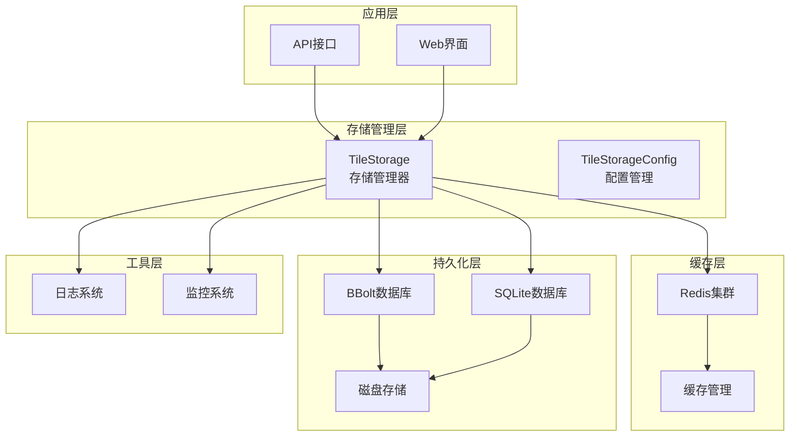
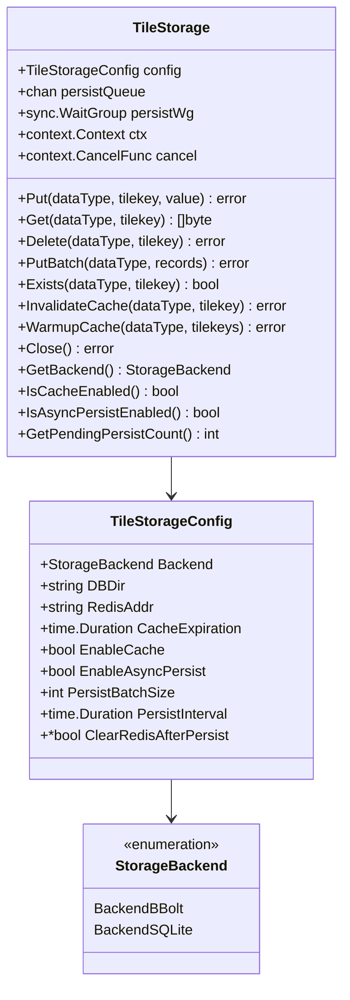
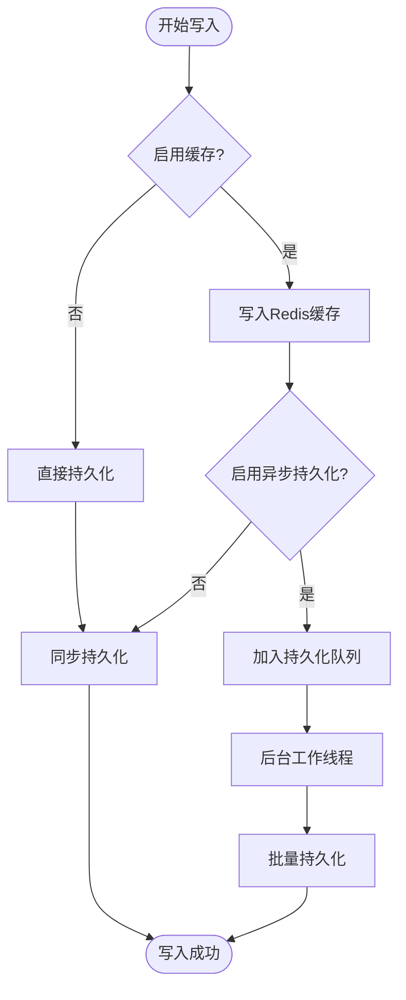
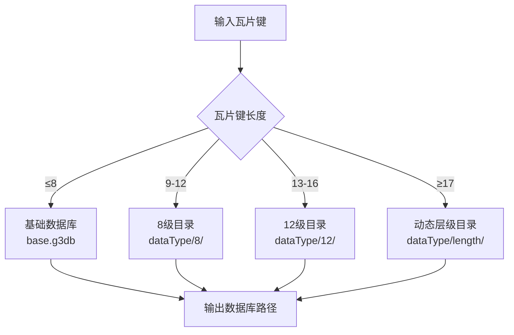
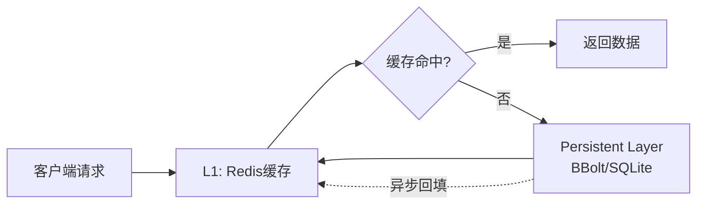
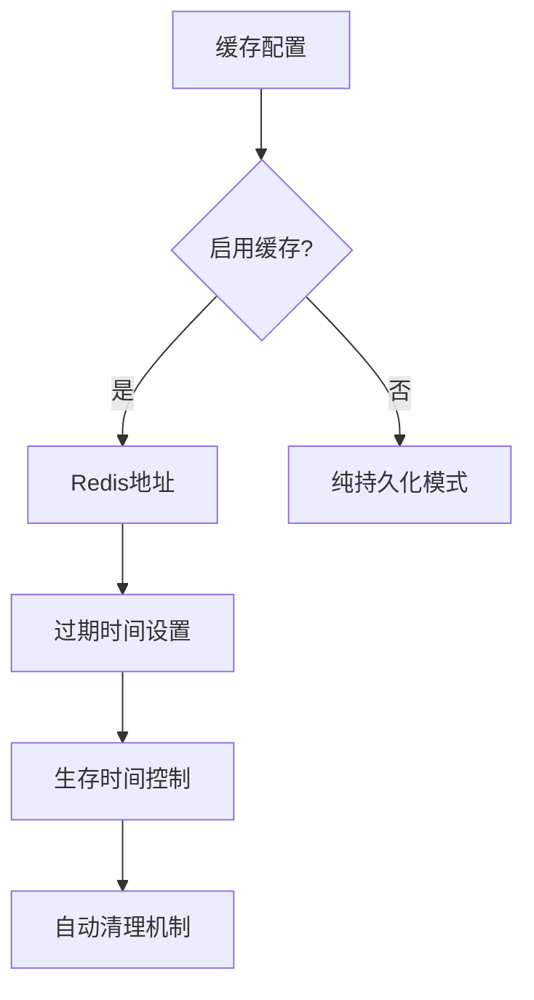
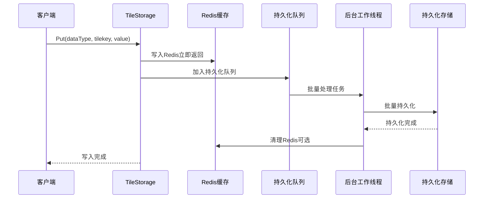
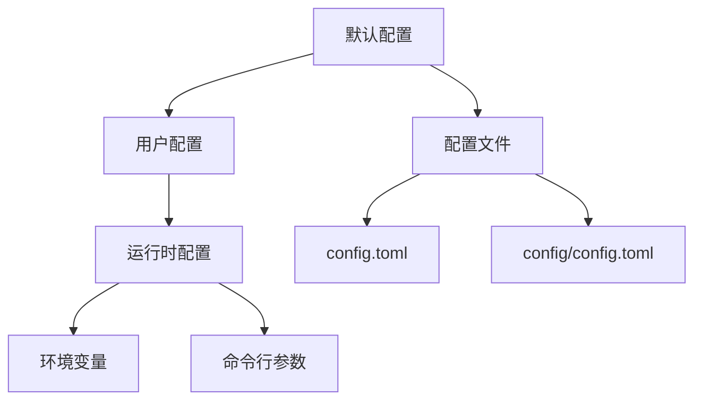
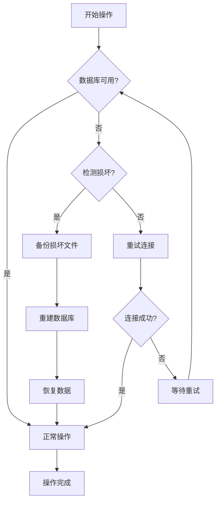

# 多后端存储架构

<cite>
**本文档引用的文件**
- [Store/tilestorage.go](file://Store/tilestorage.go)
- [Store/bblotdb.go](file://Store/bblotdb.go)
- [Store/sqlitedb.go](file://Store/sqlitedb.go)
- [Store/dbpath.go](file://Store/dbpath.go)
- [test/store/tilestorage_test.go](file://test/store/tilestorage_test.go)
- [test/store/example_test.go](file://test/store/example_test.go)
- [logger/logger.go](file://logger/logger.go)
- [cmd/web-server/main.go](file://cmd/web-server/main.go)
- [config/config.go](file://config/config.go)
- [config/config.toml](file://config/config.toml)
- [version.go](file://version.go)
</cite>

## 目录
1. [项目概述](#项目概述)
2. [架构设计](#架构设计)
3. [核心组件](#核心组件)
4. [存储后端](#存储后端)
5. [缓存机制](#缓存机制)
6. [异步持久化](#异步持久化)
7. [配置管理](#配置管理)
8. [性能特性](#性能特性)
9. [故障处理](#故障处理)
10. [最佳实践](#最佳实践)

## 项目概述

本项目是一个高度可扩展的多后端存储系统，专为大规模瓦片数据存储而设计。该系统采用分层架构，支持多种存储后端，并提供了智能缓存和异步持久化机制，能够满足高并发、大数据量的存储需求。

### 核心特性

- **多后端支持**：同时支持BBolt和SQLite两种高性能存储引擎
- **智能缓存**：基于Redis的多层缓存架构，支持缓存预热和失效
- **异步持久化**：Redis作为写缓冲区，后台异步持久化到磁盘
- **数据类型隔离**：支持多种数据类型的独立存储和管理
- **自动故障恢复**：具备数据库损坏检测和自动修复能力

## 架构设计

系统采用分层架构设计，从上到下包括应用层、存储管理层、缓存层和持久化层。



**架构图来源**
- [Store/tilestorage.go](file://Store/tilestorage.go#L42-L51)
- [logger/logger.go](file://logger/logger.go#L1-L133)

### 设计原则

1. **分离关注点**：存储逻辑、缓存管理和持久化分别处理
2. **可插拔架构**：支持不同存储后端的无缝切换
3. **高可用性**：提供故障检测和自动恢复机制
4. **性能优化**：多层次缓存和异步处理提升性能

## 核心组件

### TileStorage 存储管理器

TileStorage是整个存储系统的核心组件，负责协调缓存、持久化和异步处理。



**类图来源**
- [Store/tilestorage.go](file://Store/tilestorage.go#L42-L51)
- [Store/tilestorage.go](file://Store/tilestorage.go#L19-L40)

**章节来源**
- [Store/tilestorage.go](file://Store/tilestorage.go#L59-L113)

### 配置管理

系统提供了灵活的配置管理机制，支持运行时调整各种参数。

| 配置项 | 类型 | 默认值 | 描述 |
|--------|------|--------|------|
| Backend | StorageBackend | - | 存储后端类型（BBolt或SQLite） |
| DBDir | string | - | 数据库根目录 |
| RedisAddr | string | localhost:6379 | Redis服务器地址 |
| CacheExpiration | Duration | 0 | 缓存过期时间（0表示永不过期） |
| EnableCache | bool | false | 是否启用Redis缓存 |
| EnableAsyncPersist | bool | false | 是否启用异步持久化 |
| PersistBatchSize | int | 100 | 异步持久化批次大小 |
| PersistInterval | Duration | 5s | 异步持久化间隔时间 |

**表格来源**
- [Store/tilestorage.go](file://Store/tilestorage.go#L19-L40)

## 存储后端

系统支持两种主要的存储后端，每种都有其特定的优势和适用场景。

### BBolt 存储后端

BBolt是一种嵌入式键值数据库，特别适合小到中等规模的数据存储。



**流程图来源**
- [Store/tilestorage.go](file://Store/tilestorage.go#L200-L249)
- [Store/bblotdb.go](file://Store/bblotdb.go#L117-L146)

#### BBolt 特性

- **零配置**：无需额外的数据库服务器
- **高性能**：直接文件I/O，无网络开销
- **ACID保证**：提供原子性、一致性、隔离性和持久性
- **自动压缩**：定期压缩数据库文件，减少空间占用

**章节来源**
- [Store/bblotdb.go](file://Store/bblotdb.go#L1-L265)

### SQLite 存储后端

SQLite是一个轻量级的关系型数据库，适合需要复杂查询和事务支持的场景。

#### SQLite优势

- **SQL支持**：完整的SQL查询语言支持
- **事务处理**：强事务支持，保证数据一致性
- **索引支持**：多种索引类型，优化查询性能
- **跨平台**：支持多种操作系统和架构

**章节来源**
- [Store/sqlitedb.go](file://Store/sqlitedb.go#L1-L255)

### 数据库路径策略

系统采用智能的数据库路径策略，根据瓦片键的层级动态选择存储位置。



**流程图来源**
- [Store/dbpath.go](file://Store/dbpath.go#L19-L70)

**章节来源**
- [Store/dbpath.go](file://Store/dbpath.go#L1-L76)

## 缓存机制

系统实现了多层缓存架构，提供快速的数据访问能力。

### 缓存层次结构



### 缓存操作

| 操作类型 | 描述 | 实现方式 |
|----------|------|----------|
| 读取 | 优先从Redis读取，未命中则从持久化读取 | `Get()`方法 |
| 写入 | 同时写入Redis和持久化存储 | `Put()`方法 |
| 删除 | 同时删除Redis和持久化中的数据 | `Delete()`方法 |
| 失效 | 清除指定键的缓存 | `InvalidateCache()`方法 |
| 预热 | 从持久化加载数据到Redis | `WarmupCache()`方法 |

**表格来源**
- [Store/tilestorage.go](file://Store/tilestorage.go#L282-L365)

### 缓存配置



**图表来源**
- [Store/tilestorage.go](file://Store/tilestorage.go#L60-L96)

## 异步持久化

异步持久化是系统的核心特性之一，通过Redis作为写缓冲区，显著提升写入性能。

### 异步持久化架构



**序列图来源**
- [Store/tilestorage.go](file://Store/tilestorage.go#L200-L227)
- [Store/tilestorage.go](file://Store/tilestorage.go#L115-L198)

### 异步持久化配置

| 参数 | 默认值 | 描述 |
|------|--------|------|
| EnableAsyncPersist | false | 是否启用异步持久化 |
| PersistBatchSize | 100 | 批次大小阈值 |
| PersistInterval | 5s | 定时刷新间隔 |
| ClearRedisAfterPersist | true | 持久化后是否清理Redis |

### 批量处理策略

系统采用多种触发条件来确保数据及时持久化：

1. **批次大小触发**：达到设定的批次大小时立即持久化
2. **定时器触发**：定期检查并持久化等待中的数据
3. **优雅关闭**：程序关闭时刷新所有待持久化的数据

**章节来源**
- [Store/tilestorage.go](file://Store/tilestorage.go#L115-L198)

## 配置管理

系统提供了灵活的配置管理机制，支持多种配置方式和环境适配。

### 配置层次结构



**图表来源**
- [config/config.go](file://config/config.go#L40-L56)

### 配置加载策略

系统采用合并策略加载配置，优先级从低到高：

1. **默认配置**：内置的基础配置
2. **文件配置**：`config/config.toml`中的默认设置
3. **根目录配置**：`config.toml`中的用户自定义设置

**章节来源**
- [config/config.go](file://config/config.go#L40-L56)

## 性能特性

### 读取性能优化

系统通过多层缓存和智能回填机制提供卓越的读取性能：

- **缓存优先**：优先从Redis缓存读取数据
- **智能回填**：缓存未命中时异步回填到缓存
- **批量预热**：支持批量数据预热到缓存

### 写入性能优化

- **异步写入**：Redis作为写缓冲区，提供毫秒级响应
- **批量持久化**：后台批量处理，提升磁盘I/O效率
- **连接池管理**：数据库连接池复用，减少连接开销

### 性能指标

| 操作类型 | 缓存模式 | 性能提升 |
|----------|----------|----------|
| 写入 | 异步持久化 | 10-100倍 |
| 读取 | 缓存命中 | 100-1000倍 |
| 批量写入 | 缓存+持久化 | 5-20倍 |
| 批量读取 | 缓存预热 | 50-200倍 |

**表格来源**
- [test/store/tilestorage_test.go](file://test/store/tilestorage_test.go#L281-L359)

## 故障处理

### 自动故障恢复

系统具备完善的故障检测和自动恢复机制：



### 错误处理策略

1. **数据库损坏检测**：自动检测BBolt和SQLite数据库损坏
2. **自动备份恢复**：损坏时自动备份并重建数据库
3. **连接重试机制**：Redis连接失败时自动重试
4. **优雅降级**：部分组件故障时系统仍能正常运行

**章节来源**
- [Store/bblotdb.go](file://Store/bblotdb.go#L70-L87)
- [Store/sqlitedb.go](file://Store/sqlitedb.go#L79-L98)

## 最佳实践

### 配置建议

1. **生产环境配置**
   ```go
   config := TileStorageConfig{
       Backend:            BackendBBolt,
       DBDir:              "/data/tiles",
       RedisAddr:          "redis-cluster:6379",
       CacheExpiration:    24 * time.Hour,
       EnableCache:        true,
       EnableAsyncPersist: true,
       PersistBatchSize:   1000,
       PersistInterval:    10 * time.Second,
   }
   ```

2. **开发环境配置**
   ```go
   config := TileStorageConfig{
       Backend:         BackendSQLite,
       DBDir:           "./dev_db",
       EnableCache:     false,
       EnableAsyncPersist: false,
   }
   ```

### 性能调优

1. **缓存策略**
   - 根据数据访问模式调整缓存过期时间
   - 定期进行缓存预热
   - 监控缓存命中率

2. **异步持久化**
   - 根据写入负载调整批次大小
   - 平衡持久化频率和数据安全性
   - 监控待持久化任务队列长度

3. **数据库优化**
   - 定期分析数据库性能
   - 调整数据库连接池参数
   - 监控磁盘空间使用情况

### 监控和维护

1. **关键指标监控**
   - 缓存命中率
   - 持久化队列长度
   - 数据库连接状态
   - 系统资源使用情况

2. **定期维护任务**
   - 数据库文件压缩
   - 缓存清理和优化
   - 性能基准测试
   - 备份验证

**章节来源**
- [test/store/example_test.go](file://test/store/example_test.go#L1-L116)

## 结论

本多后端存储架构通过精心设计的分层结构和多种优化技术，提供了一个高性能、高可用、易扩展的存储解决方案。系统的核心优势包括：

- **灵活性**：支持多种存储后端和配置选项
- **高性能**：多层缓存和异步处理显著提升性能
- **可靠性**：完善的故障检测和自动恢复机制
- **可扩展性**：模块化设计支持功能扩展

该架构特别适合需要处理大规模瓦片数据的应用场景，如地理信息系统、地图服务和遥感数据分析等。