# 存储架构

<cite>
**本文档中引用的文件**
- [Store/bblotdb.go](file://Store/bblotdb.go)
- [Store/sqlitedb.go](file://Store/sqlitedb.go)
- [Store/dbpath.go](file://Store/dbpath.go)
- [test/store/bblotdb_test.go](file://test/store/bblotdb_test.go)
- [test/store/sqlitedb_test.go](file://test/store/sqlitedb_test.go)
- [test/store/tilestorage_test.go](file://test/store/tilestorage_test.go)
- [GoogleEarth/constants.go](file://GoogleEarth/constants.go)
- [GoogleEarth/quadtree_numbering.go](file://GoogleEarth/quadtree_numbering.go)
- [cmd/web-server/main.go](file://cmd/web-server/main.go)
- [config/config.go](file://config/config.go)
- [config/config.toml](file://config/config.toml)
</cite>

## 目录
1. [概述](#概述)
2. [存储架构设计](#存储架构设计)
3. [核心组件分析](#核心组件分析)
4. [数据分层策略](#数据分层策略)
5. [缓存机制](#缓存机制)
6. [性能优化](#性能优化)
7. [故障恢复机制](#故障恢复机制)
8. [扩展性设计](#扩展性设计)
9. [总结](#总结)

## 概述

该系统采用多层次存储架构，专门针对Google Earth四叉树瓦片数据的高效存储和访问需求。存储架构包含持久化存储层、缓存层和应用接口层，支持BBolt和SQLite两种持久化后端，并提供Redis作为缓存中间件。

### 核心特性

- **双后端支持**：同时支持BBolt和SQLite作为持久化存储
- **智能分层**：基于瓦片层级的数据库文件分层管理
- **缓存加速**：Redis缓存提升读取性能
- **异步持久化**：支持后台异步持久化模式
- **故障恢复**：自动检测和修复损坏的数据库文件
- **高并发**：连接池管理和并发安全设计

## 存储架构设计

### 整体架构图

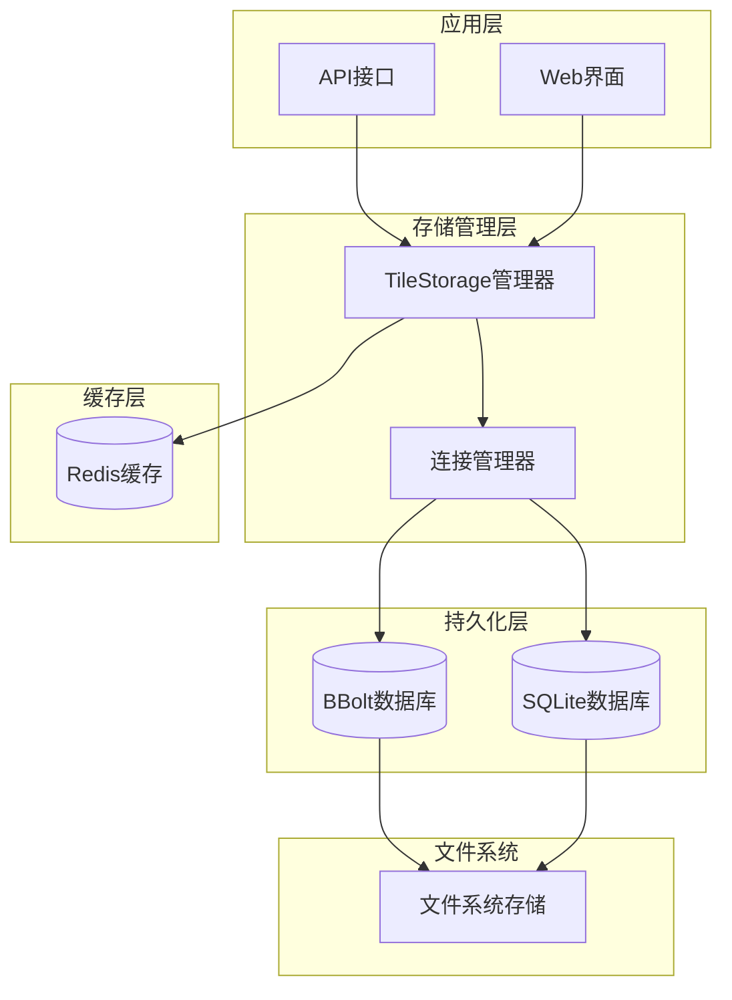

**架构图来源**
- [Store/bblotdb.go](file://Store/bblotdb.go#L15-L30)
- [Store/sqlitedb.go](file://Store/sqlitedb.go#L14-L29)

### 存储层次结构

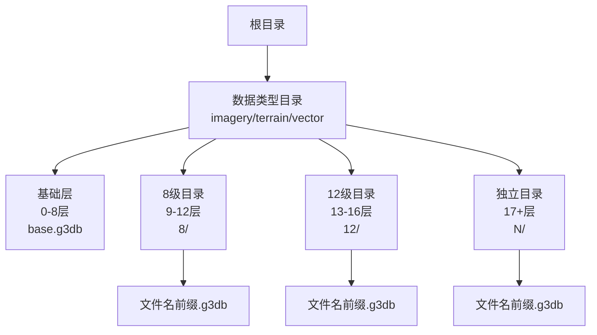

**架构图来源**
- [Store/dbpath.go](file://Store/dbpath.go#L19-L76)

## 核心组件分析

### BBolt数据库管理器

BBoltManager负责管理BBolt数据库连接池，提供连接复用和自动恢复功能。

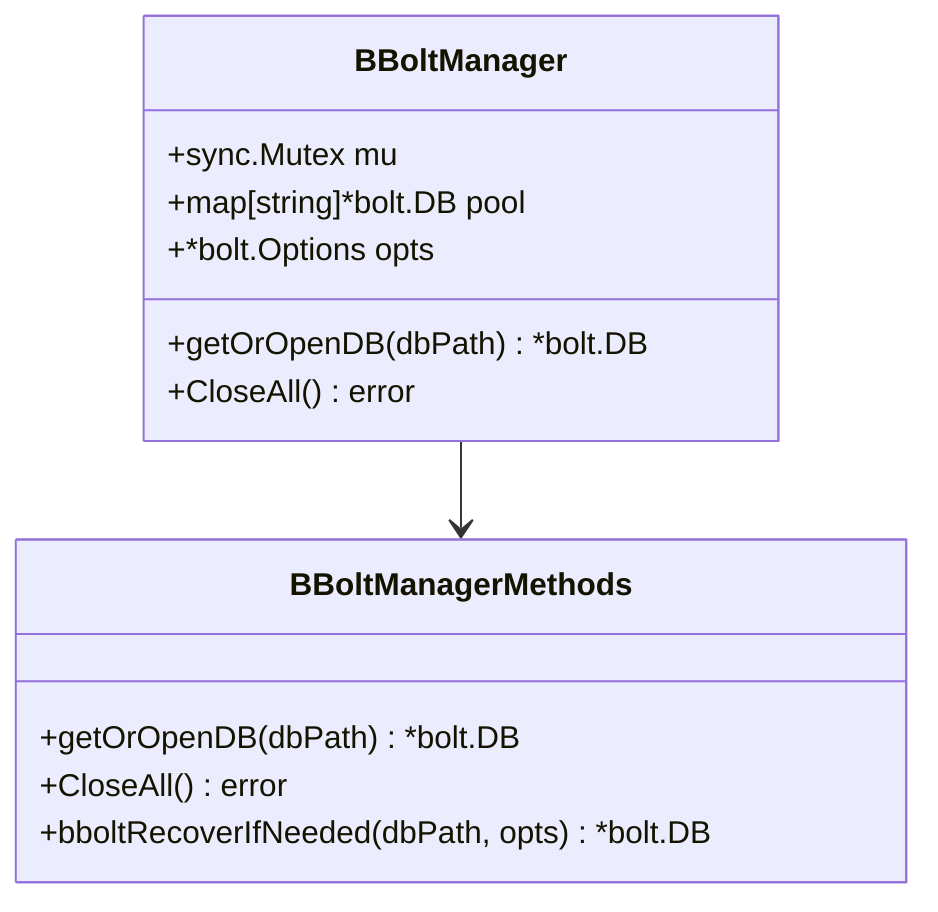

**类图来源**
- [Store/bblotdb.go](file://Store/bblotdb.go#L15-L30)

#### 核心功能

1. **连接池管理**：维护数据库连接池，避免重复打开同一数据库文件
2. **自动恢复**：检测数据库损坏并自动修复
3. **并发安全**：使用互斥锁保护连接池操作

**章节来源**
- [Store/bblotdb.go](file://Store/bblotdb.go#L32-L68)

### SQLite数据库管理器

SQLiteManager提供SQLite数据库的连接管理和WAL模式优化。

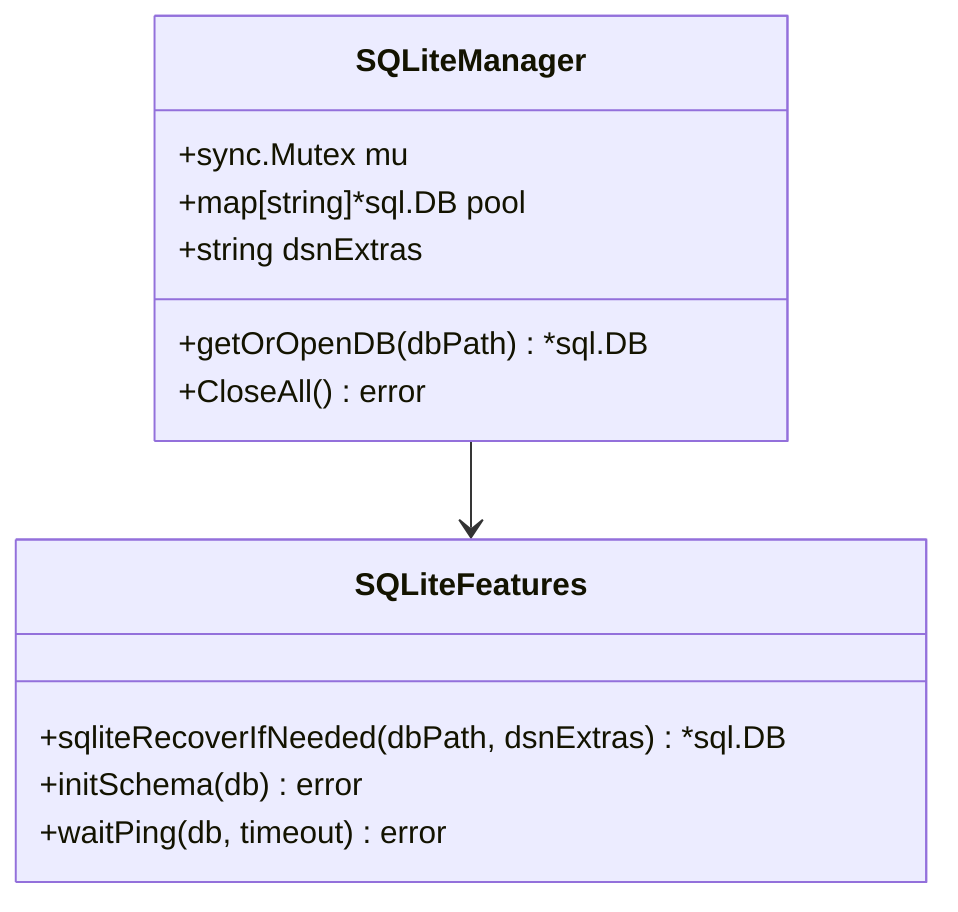

**类图来源**
- [Store/sqlitedb.go](file://Store/sqlitedb.go#L14-L29)

#### 核心特性

1. **WAL模式**：启用Write-Ahead Logging提升并发性能
2. **连接优化**：独占模式下共享连接池
3. **Schema初始化**：自动创建tiles表结构
4. **健康检查**：定期ping检测数据库可用性

**章节来源**
- [Store/sqlitedb.go](file://Store/sqlitedb.go#L31-L61)

### 数据路径生成器

dbpath模块负责根据瓦片键生成合适的数据库文件路径，实现智能分层存储。

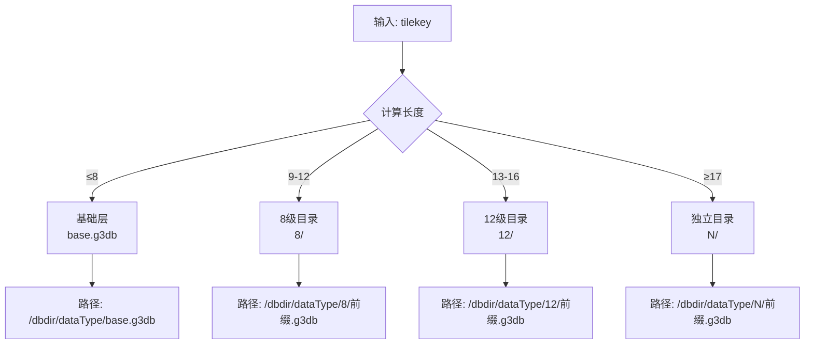

**流程图来源**
- [Store/dbpath.go](file://Store/dbpath.go#L19-L76)

**章节来源**
- [Store/dbpath.go](file://Store/dbpath.go#L19-L76)

## 数据分层策略

### 瓦片层级映射

系统采用Google Earth标准的四叉树瓦片编号系统，支持从0到24层的瓦片存储。

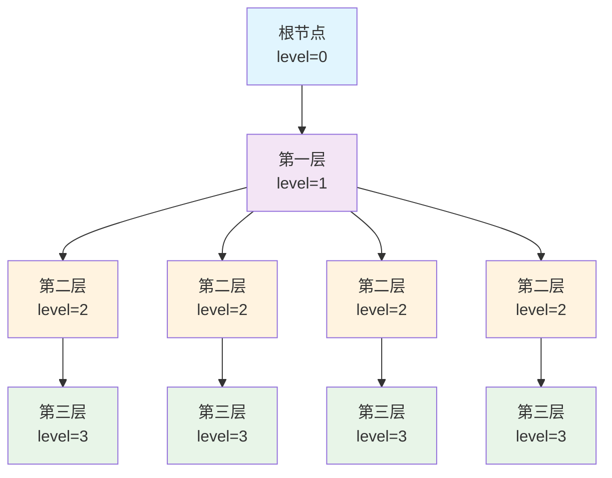

**图表来源**
- [GoogleEarth/quadtree_numbering.go](file://GoogleEarth/quadtree_numbering.go#L1-L48)

### 分层存储策略

| 层级范围 | 存储方式 | 目录结构 | 优势 |
|---------|---------|---------|------|
| 0-8层 | 基础层 | `/dbdir/dataType/base.g3db` | 数据量小，统一管理 |
| 9-12层 | 8级目录 | `/dbdir/dataType/8/` | 4层数据集中管理 |
| 13-16层 | 12级目录 | `/dbdir/dataType/12/` | 4层数据集中管理 |
| 17+层 | 独立目录 | `/dbdir/dataType/N/` | 按层级分散，避免单文件过大 |

**章节来源**
- [Store/dbpath.go](file://Store/dbpath.go#L29-L69)

## 缓存机制

### 缓存架构

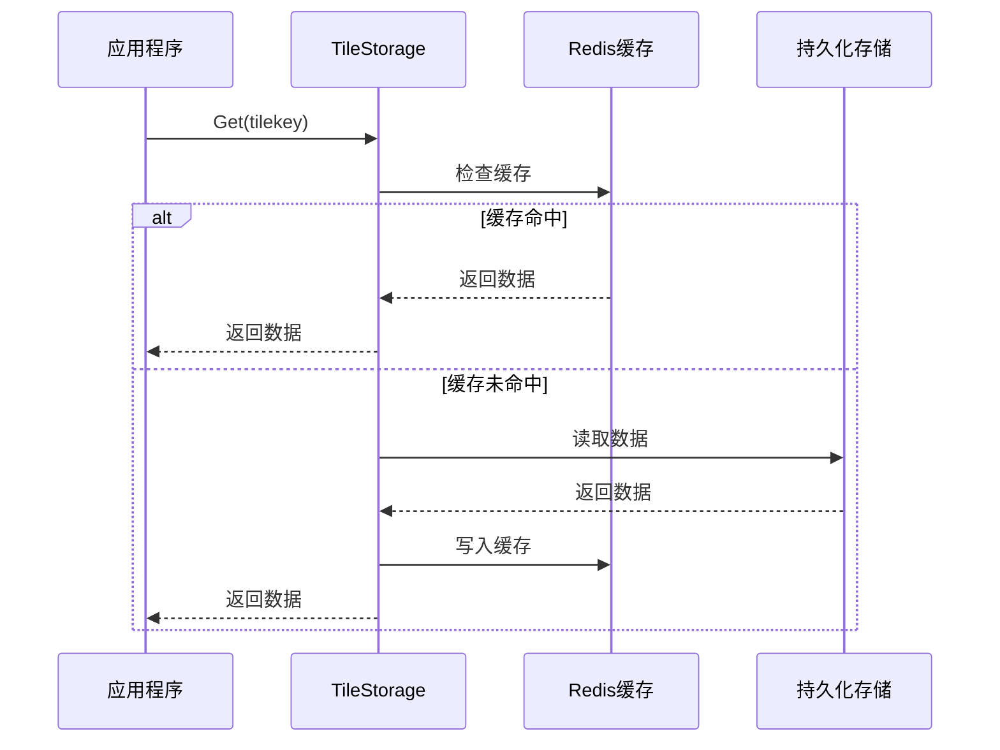

**序列图来源**
- [test/store/tilestorage_test.go](file://test/store/tilestorage_test.go#L12-L79)

### 异步持久化模式

系统支持异步持久化模式，提高写入性能：

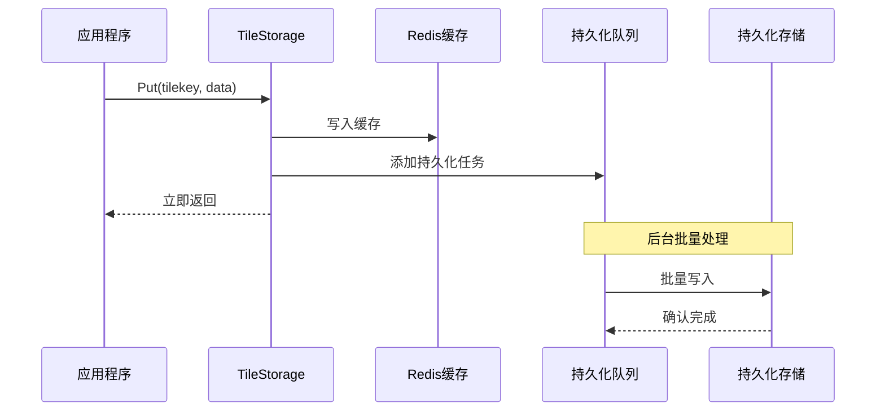

**序列图来源**
- [test/store/tilestorage_test.go](file://test/store/tilestorage_test.go#L362-L441)

**章节来源**
- [test/store/tilestorage_test.go](file://test/store/tilestorage_test.go#L362-L441)

## 性能优化

### 批量操作优化

系统提供批量写入接口，显著提升大批量数据处理性能：

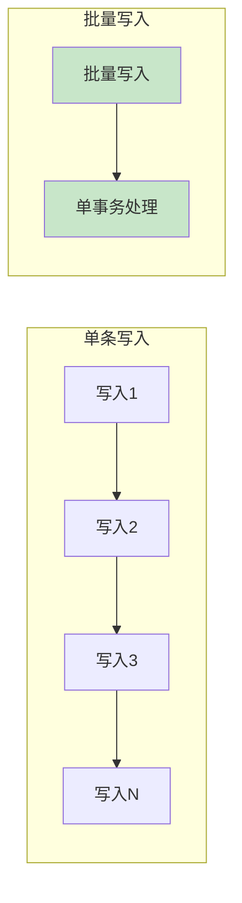

**图表来源**
- [Store/bblotdb.go](file://Store/bblotdb.go#L148-L199)
- [Store/sqlitedb.go](file://Store/sqlitedb.go#L150-L211)

### 连接池优化

| 优化策略 | 实现方式 | 性能提升 |
|---------|---------|---------|
| 连接复用 | BBoltManager/SQLiteManager | 避免重复打开关闭 |
| 独占模式 | SQLite独占连接 | 减少锁竞争 |
| 连接池 | 共享连接池 | 提升并发能力 |
| 健康检查 | 定期ping检测 | 及时发现连接问题 |

**章节来源**
- [Store/bblotdb.go](file://Store/bblotdb.go#L32-L68)
- [Store/sqlitedb.go](file://Store/sqlitedb.go#L31-L61)

## 故障恢复机制

### 自动恢复策略

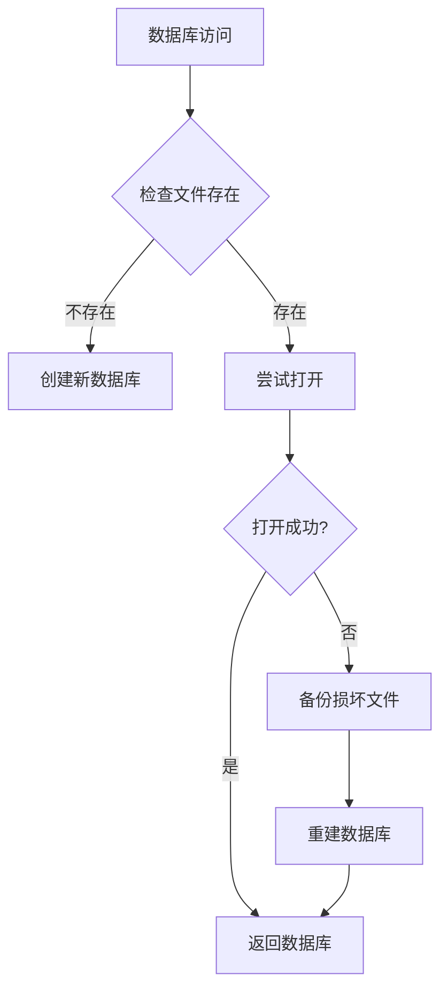

**流程图来源**
- [Store/bblotdb.go](file://Store/bblotdb.go#L70-L87)
- [Store/sqlitedb.go](file://Store/sqlitedb.go#L79-L98)

### 损坏检测与恢复

系统具备自动检测和恢复损坏数据库的能力：

1. **BBolt恢复**：检测损坏文件，自动备份并重建
2. **SQLite恢复**：检测数据库文件损坏，自动修复
3. **备份策略**：损坏文件自动备份，防止数据丢失

**章节来源**
- [Store/bblotdb.go](file://Store/bblotdb.go#L70-L87)
- [Store/sqlitedb.go](file://Store/sqlitedb.go#L79-L98)

## 扩展性设计

### 多后端支持

系统设计支持多种持久化后端：

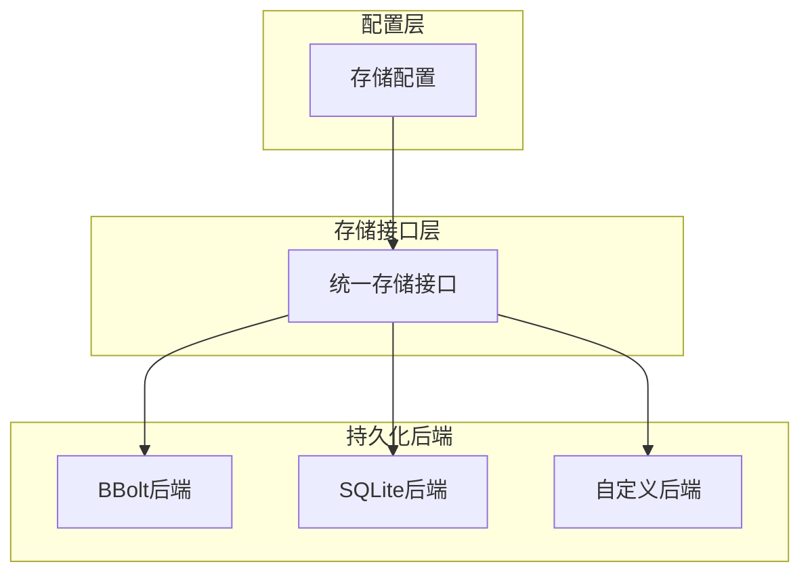

**图表来源**
- [test/store/tilestorage_test.go](file://test/store/tilestorage_test.go#L12-L118)

### 配置灵活性

系统提供灵活的配置选项：

| 配置项 | 默认值 | 说明 |
|-------|-------|------|
| 后端类型 | BBolt | 支持BBolt和SQLite |
| 缓存开关 | true | 是否启用Redis缓存 |
| 缓存过期 | 5分钟 | 缓存数据过期时间 |
| 异步持久化 | false | 是否启用异步持久化 |
| 批次大小 | 100 | 异步持久化的批次大小 |

**章节来源**
- [config/config.toml](file://config/config.toml#L1-L38)

## 总结

该存储架构具有以下核心优势：

1. **高性能**：通过缓存、批量操作和连接池优化实现高性能
2. **可靠性**：自动故障检测和恢复机制确保数据安全
3. **可扩展**：模块化设计支持多种后端和配置
4. **易维护**：清晰的分层架构和完善的测试覆盖
5. **资源友好**：智能分层存储减少I/O压力

该架构特别适合大规模瓦片数据存储场景，能够有效处理Google Earth等地理信息系统中的海量瓦片数据，提供高效的读写性能和可靠的存储保障。