# 存储架构

<cite>
**本文档中引用的文件**
- [Store/bblotdb.go](file://Store/bblotdb.go)
- [Store/sqlitedb.go](file://Store/sqlitedb.go)
- [Store/dbpath.go](file://Store/dbpath.go)
- [Store/tilestorage.go](file://Store/tilestorage.go)
- [Store/redisdb.go](file://Store/redisdb.go)
- [GoogleEarth/constants.go](file://GoogleEarth/constants.go)
- [GoogleEarth/quadtree_numbering.go](file://GoogleEarth/quadtree_numbering.go)
</cite>

## 更新摘要
**所做更改**
- 更新了存储架构的整体设计，反映最新的组件重组
- 新增了 TileStorage 管理器的核心地位描述
- 更新了缓存架构和异步持久化机制
- 修订了数据分层策略和元数据处理
- 更新了配置管理和错误恢复机制

## 目录
1. [概述](#概述)
2. [存储架构设计](#存储架构设计)
3. [核心组件分析](#核心组件分析)
4. [数据分层策略](#数据分层策略)
5. [缓存机制](#缓存机制)
6. [性能优化](#性能优化)
7. [故障恢复机制](#故障恢复机制)
8. [扩展性设计](#扩展性设计)
9. [总结](#总结)

## 概述

该系统采用现代化的多层次存储架构，专门针对Google Earth四叉树瓦片数据的高效存储和访问需求。存储架构以 TileStorage 管理器为核心，提供统一的存储接口，支持 BBolt 和 SQLite 两种持久化后端，并集成 Redis 作为缓存中间件。

### 核心特性

- **统一存储接口**：TileStorage 管理器提供统一的存储抽象
- **双后端支持**：同时支持 BBolt 和 SQLite 作为持久化存储
- **智能分层**：基于瓦片层级的数据库文件分层管理
- **缓存加速**：Redis 缓存提升读取性能
- **异步持久化**：支持后台异步持久化模式
- **元数据管理**：内置元数据编码和解码机制
- **故障恢复**：自动检测和修复损坏的数据库文件
- **高并发**：连接池管理和并发安全设计

## 存储架构设计

### 整体架构图

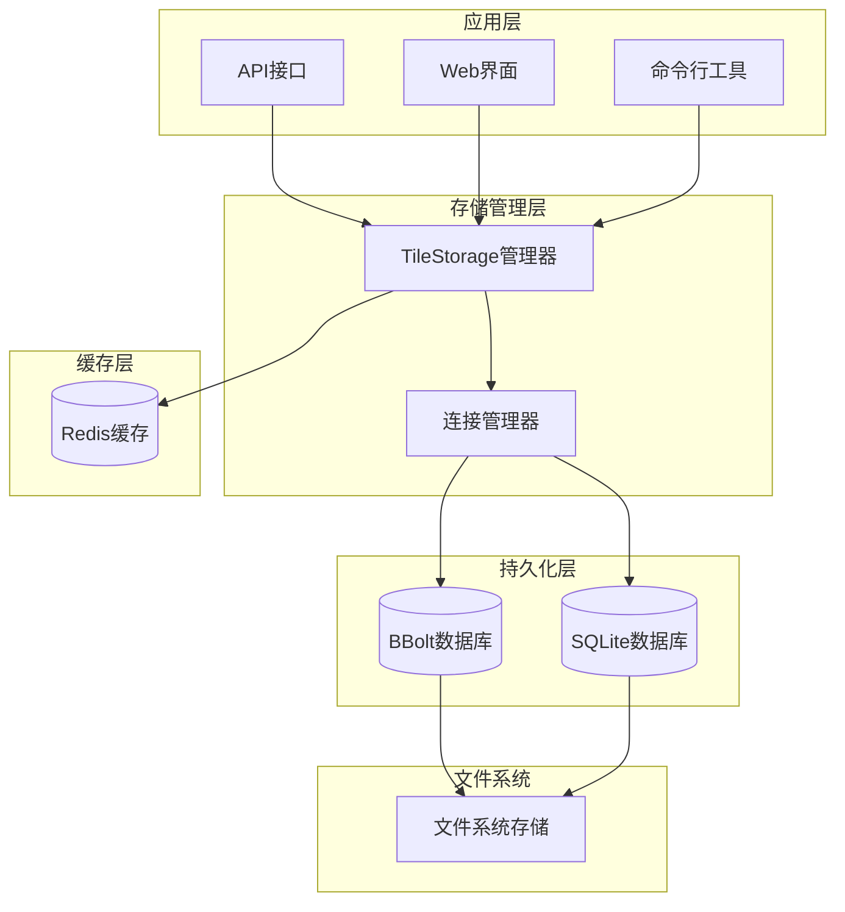
```mermaid
graph TB
subgraph "应用层"
API[API接口]
WebUI[Web界面]
CLI[命令行工具]
end
subgraph "存储管理层"
TS[TileStorage管理器]
CM[连接管理器]
end
subgraph "缓存层"
Redis[(Redis缓存)]
end
subgraph "持久化层"
BBolt[(BBolt数据库)]
SQLite[(SQLite数据库)]
end
subgraph "文件系统"
FS[文件系统存储]
end
API --> TS
WebUI --> TS
CLI --> TS
TS --> Redis
TS --> CM
CM --> BBolt
CM --> SQLite
BBolt --> FS
SQLite --> FS
```

**架构图来源**
- [Store/tilestorage.go:165-174](file://Store/tilestorage.go#L165-L174)
- [Store/bblotdb.go:15-30](file://Store/bblotdb.go#L15-L30)
- [Store/sqlitedb.go:16-31](file://Store/sqlitedb.go#L16-L31)

### 存储层次结构

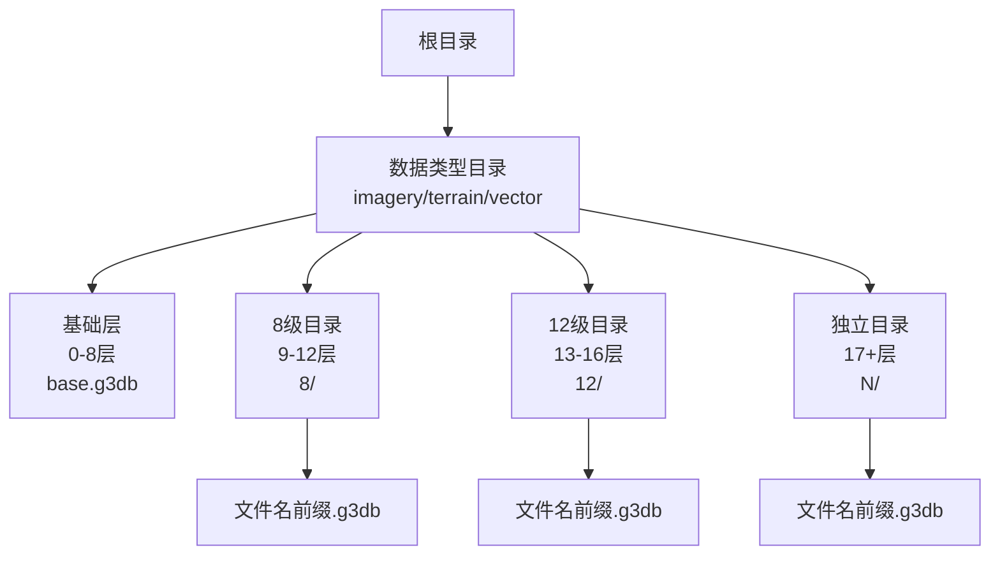
```mermaid
graph TD
Root[根目录] --> DataType[数据类型目录<br/>imagery/terrain/vector]
DataType --> BaseLayer[基础层<br/>0-8层<br/>base.g3db]
DataType --> Level8[8级目录<br/>9-12层<br/>8/]
DataType --> Level12[12级目录<br/>13-16层<br/>12/]
DataType --> LevelN[独立目录<br/>17+层<br/>N/]
Level8 --> File8[文件名前缀.g3db]
Level12 --> File12[文件名前缀.g3db]
LevelN --> FileN[文件名前缀.g3db]
```

**架构图来源**
- [Store/dbpath.go:20-82](file://Store/dbpath.go#L20-L82)

## 核心组件分析

### TileStorage 管理器

TileStorage 是整个存储架构的核心管理器，提供统一的存储接口，支持同步和异步两种持久化模式。

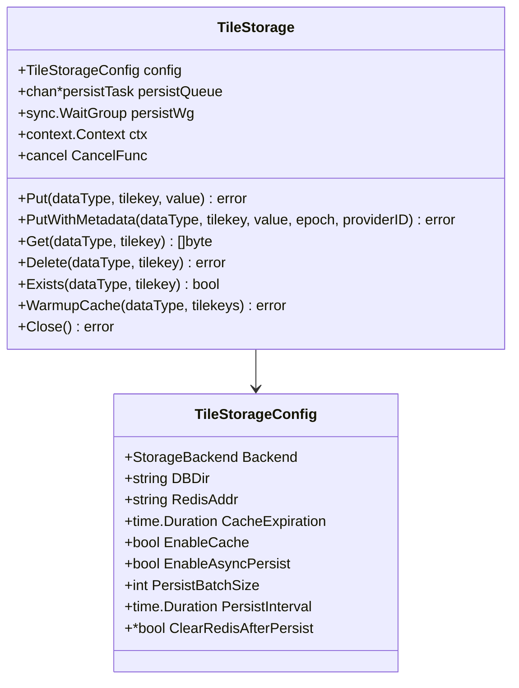
```mermaid
classDiagram
class TileStorage {
+TileStorageConfig config
+chan*persistTask persistQueue
+sync.WaitGroup persistWg
+context.Context ctx
+cancel CancelFunc
+Put(dataType, tilekey, value) error
+PutWithMetadata(dataType, tilekey, value, epoch, providerID) error
+Get(dataType, tilekey) []byte
+Delete(dataType, tilekey) error
+Exists(dataType, tilekey) bool
+WarmupCache(dataType, tilekeys) error
+Close() error
}
class TileStorageConfig {
+StorageBackend Backend
+string DBDir
+string RedisAddr
+time.Duration CacheExpiration
+bool EnableCache
+bool EnableAsyncPersist
+int PersistBatchSize
+time.Duration PersistInterval
+*bool ClearRedisAfterPersist
}
TileStorage --> TileStorageConfig
```

**类图来源**
- [Store/tilestorage.go:165-174](file://Store/tilestorage.go#L165-L174)
- [Store/tilestorage.go:142-163](file://Store/tilestorage.go#L142-L163)

#### 核心功能

1. **统一接口**：提供 Put、Get、Delete 等统一的存储操作接口
2. **异步持久化**：支持后台异步持久化，提升写入性能
3. **缓存集成**：自动处理 Redis 缓存的读写和失效
4. **元数据管理**：内置 TileMetadata 结构支持元数据存储
5. **配置管理**：灵活的配置选项支持多种部署场景

**章节来源**
- [Store/tilestorage.go:185-238](file://Store/tilestorage.go#L185-L238)

### BBolt 数据库管理器

BBoltManager 负责管理 BBolt 数据库连接池，提供连接复用和自动恢复功能。

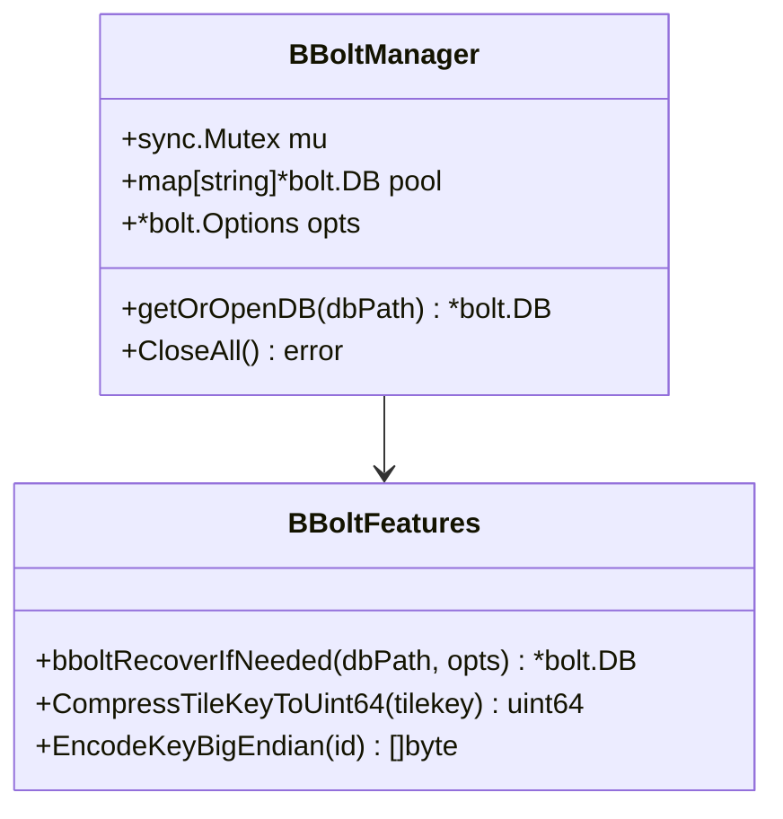
```mermaid
classDiagram
class BBoltManager {
+sync.Mutex mu
+map[string]*bolt.DB pool
+*bolt.Options opts
+getOrOpenDB(dbPath) *bolt.DB
+CloseAll() error
}
class BBoltFeatures {
+bboltRecoverIfNeeded(dbPath, opts) *bolt.DB
+CompressTileKeyToUint64(tilekey) uint64
+EncodeKeyBigEndian(id) []byte
}
BBoltManager --> BBoltFeatures
```

**类图来源**
- [Store/bblotdb.go:15-30](file://Store/bblotdb.go#L15-L30)
- [Store/bblotdb.go:70-108](file://Store/bblotdb.go#L70-L108)

#### 核心功能

1. **连接池管理**：维护数据库连接池，避免重复打开同一数据库文件
2. **自动恢复**：检测数据库损坏并自动修复
3. **键压缩**：将 tilekey 压缩为 64 位整数作为数据库主键
4. **并发安全**：使用互斥锁保护连接池操作

**章节来源**
- [Store/bblotdb.go:32-68](file://Store/bblotdb.go#L32-L68)

### SQLite 数据库管理器

SQLiteManager 提供 SQLite 数据库的连接管理和 WSL 模式优化。

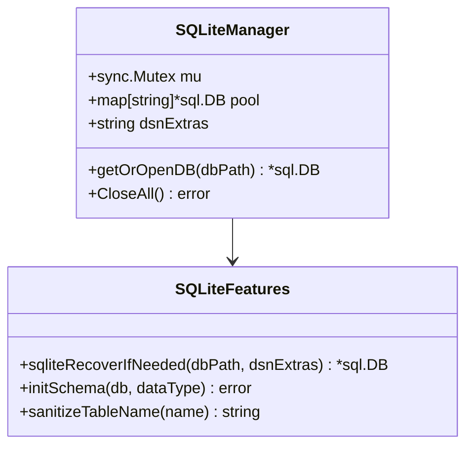
```mermaid
classDiagram
class SQLiteManager {
+sync.Mutex mu
+map[string]*sql.DB pool
+string dsnExtras
+getOrOpenDB(dbPath) *sql.DB
+CloseAll() error
}
class SQLiteFeatures {
+sqliteRecoverIfNeeded(dbPath, dsnExtras) *sql.DB
+initSchema(db, dataType) error
+sanitizeTableName(name) string
}
SQLiteManager --> SQLiteFeatures
```

**类图来源**
- [Store/sqlitedb.go:16-31](file://Store/sqlitedb.go#L16-L31)
- [Store/sqlitedb.go:198-231](file://Store/sqlitedb.go#L198-L231)

#### 核心特性

1. **WAL 模式**：启用 Write-Ahead Logging 提升并发性能
2. **连接优化**：独占模式下共享连接池
3. **Schema 初始化**：自动创建 tiles 表结构
4. **表名清理**：防止 SQL 注入的安全表名处理
5. **健康检查**：定期 ping 检测数据库可用性

**章节来源**
- [Store/sqlitedb.go:116-147](file://Store/sqlitedb.go#L116-L147)

### Redis 缓存管理器

RedisManager 管理 Redis 连接池，为每个数据类型分配独立的数据库编号。

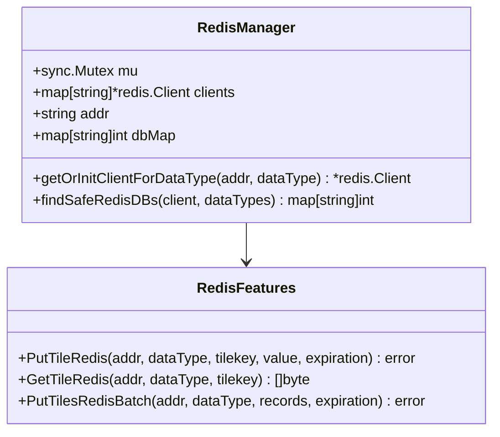
```mermaid
classDiagram
class RedisManager {
+sync.Mutex mu
+map[string]*redis.Client clients
+string addr
+map[string]int dbMap
+getOrInitClientForDataType(addr, dataType) *redis.Client
+findSafeRedisDBs(client, dataTypes) map[string]int
}
class RedisFeatures {
+PutTileRedis(addr, dataType, tilekey, value, expiration) error
+GetTileRedis(addr, dataType, tilekey) []byte
+PutTilesRedisBatch(addr, dataType, records, expiration) error
}
RedisManager --> RedisFeatures
```

**类图来源**
- [Store/redisdb.go:13-25](file://Store/redisdb.go#L13-L25)
- [Store/redisdb.go:163-249](file://Store/redisdb.go#L163-L249)

#### 核心功能

1. **数据库分配**：为每个数据类型自动分配独立的 Redis 数据库
2. **连接池管理**：维护每个数据类型的 Redis 连接
3. **批量操作**：支持 Pipeline 批量写入优化
4. **元数据支持**：内置元数据编码和解码机制
5. **安全扫描**：自动扫描并选择最安全的数据库编号

**章节来源**
- [Store/redisdb.go:123-154](file://Store/redisdb.go#L123-L154)

## 数据分层策略

### 瓦片层级映射

系统采用 Google Earth 标准的四叉树瓦片编号系统，支持从 0 到 24 层的瓦片存储。

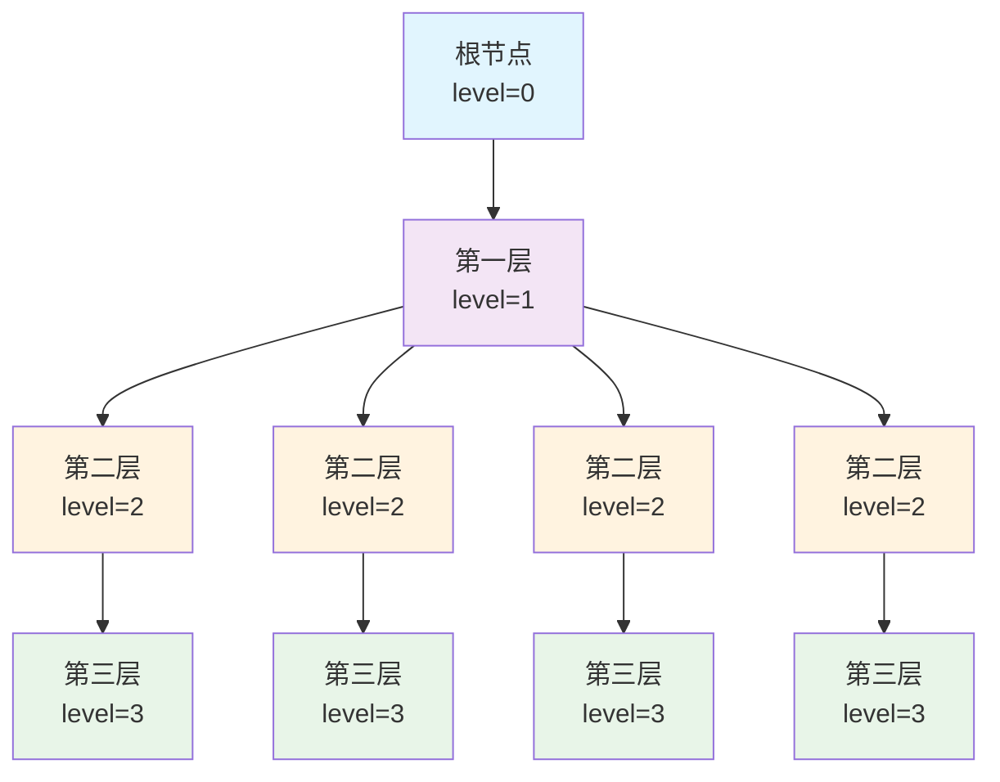
```mermaid
graph TD
Root[根节点<br/>level=0] --> L1[第一层<br/>level=1]
L1 --> L2_1[第二层<br/>level=2]
L1 --> L2_2[第二层<br/>level=2]
L1 --> L2_3[第二层<br/>level=2]
L1 --> L2_4[第二层<br/>level=2]
L2_1 --> L3_1[第三层<br/>level=3]
L2_2 --> L3_2[第三层<br/>level=3]
L2_3 --> L3_3[第三层<br/>level=3]
L2_4 --> L3_4[第三层<br/>level=3]
style Root fill:#e1f5fe
style L1 fill:#f3e5f5
style L2_1 fill:#fff3e0
style L2_2 fill:#fff3e0
style L2_3 fill:#fff3e0
style L2_4 fill:#fff3e0
style L3_1 fill:#e8f5e8
style L3_2 fill:#e8f5e8
style L3_3 fill:#e8f5e8
style L3_4 fill:#e8f5e8
```

**图表来源**
- [GoogleEarth/quadtree_numbering.go:44-63](file://GoogleEarth/quadtree_numbering.go#L44-L63)

### 分层存储策略

| 层级范围 | 存储方式 | 目录结构 | 优势 |
|---------|---------|---------|------|
| 0-8层 | 基础层 | `/dbdir/storageType/dataType/base.g3db` | 数据量小，统一管理 |
| 9-12层 | 8级目录 | `/dbdir/storageType/dataType/8/` | 4层数据集中管理 |
| 13-16层 | 12级目录 | `/dbdir/storageType/dataType/12/` | 4层数据集中管理 |
| 17+层 | 独立目录 | `/dbdir/storageType/dataType/N/` | 按层级分散，避免单文件过大 |

**章节来源**
- [Store/dbpath.go:20-82](file://Store/dbpath.go#L20-L82)

## 缓存机制

### 缓存架构

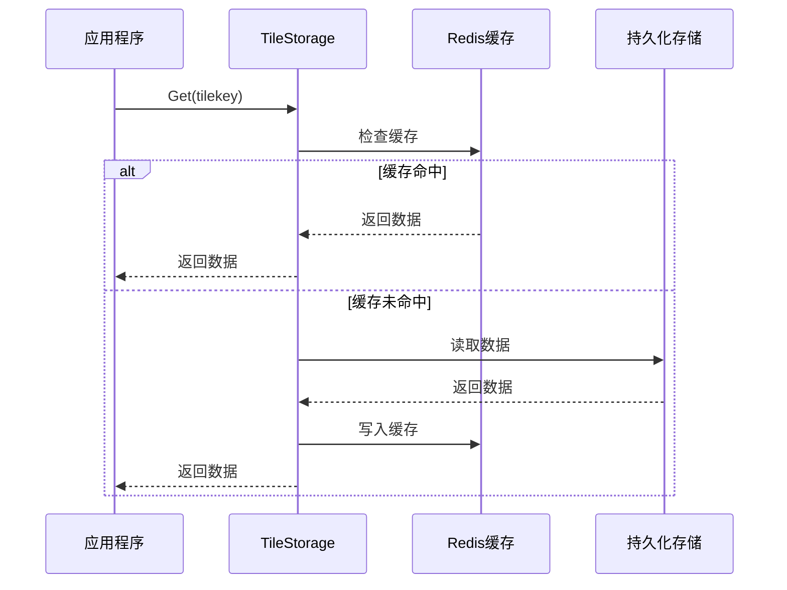
```mermaid
sequenceDiagram
participant App as 应用程序
participant TS as TileStorage
participant Redis as Redis缓存
participant DB as 持久化存储
App->>TS : Get(tilekey)
TS->>Redis : 检查缓存
alt 缓存命中
Redis-->>TS : 返回数据
TS-->>App : 返回数据
else 缓存未命中
TS->>DB : 读取数据
DB-->>TS : 返回数据
TS->>Redis : 写入缓存
TS-->>App : 返回数据
end
```

**序列图来源**
- [Store/tilestorage.go:528-562](file://Store/tilestorage.go#L528-L562)

### 异步持久化模式

系统支持异步持久化模式，提高写入性能：

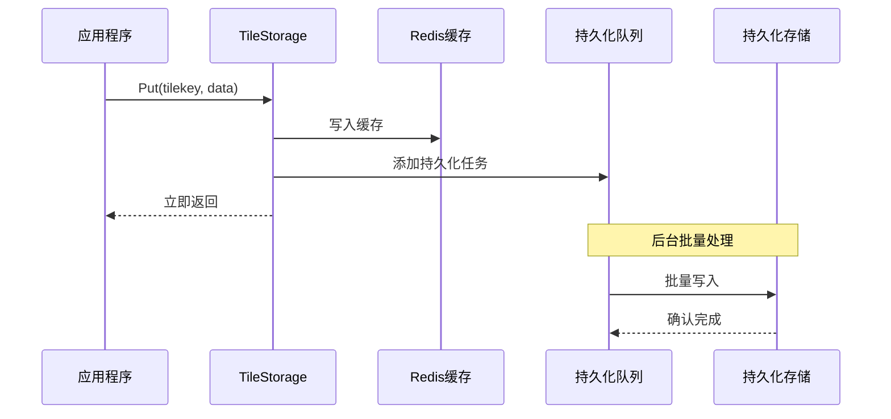
```mermaid
sequenceDiagram
participant App as 应用程序
participant TS as TileStorage
participant Redis as Redis缓存
participant Queue as 持久化队列
participant DB as 持久化存储
App->>TS : Put(tilekey, data)
TS->>Redis : 写入缓存
TS->>Queue : 添加持久化任务
TS-->>App : 立即返回
Note over Queue,DB : 后台批量处理
Queue->>DB : 批量写入
DB-->>Queue : 确认完成
```

**序列图来源**
- [Store/tilestorage.go:240-334](file://Store/tilestorage.go#L240-L334)

### 元数据处理机制

系统支持瓦片元数据的编码和解码：

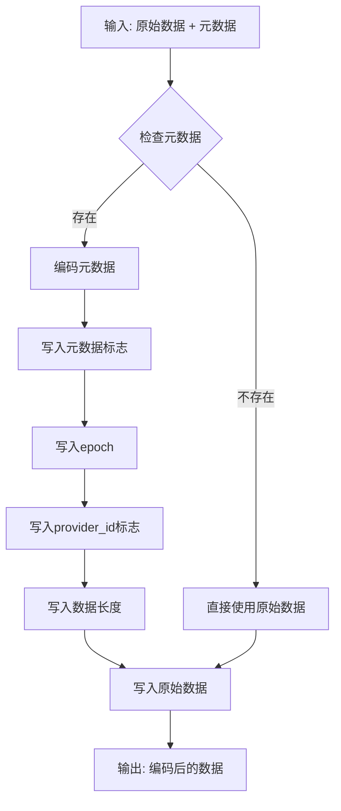
```mermaid
flowchart TD
Input[输入: 原始数据 + 元数据] --> Check{检查元数据}
Check --> |存在| Encode[编码元数据]
Check --> |不存在| Direct[直接使用原始数据]
Encode --> Header[写入元数据标志]
Header --> Epoch[写入epoch]
Epoch --> Provider[写入provider_id标志]
Provider --> DataLen[写入数据长度]
DataLen --> RawData[写入原始数据]
Direct --> RawData
RawData --> Output[输出: 编码后的数据]
```

**流程图来源**
- [Store/tilestorage.go:27-81](file://Store/tilestorage.go#L27-L81)

**章节来源**
- [Store/tilestorage.go:336-469](file://Store/tilestorage.go#L336-L469)

## 性能优化

### 批量操作优化

系统提供批量写入接口，显著提升大批量数据处理性能：

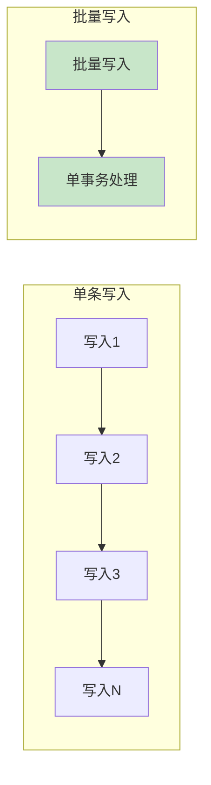
```mermaid
graph LR
subgraph "单条写入"
A1[写入1] --> A2[写入2] --> A3[写入3] --> A4[写入N]
end
subgraph "批量写入"
B1[批量写入] --> B2[单事务处理]
end
style B1 fill:#c8e6c9
style B2 fill:#c8e6c9
```

**图表来源**
- [Store/bblotdb.go:192-244](file://Store/bblotdb.go#L192-L244)
- [Store/sqlitedb.go:314-396](file://Store/sqlitedb.go#L314-L396)

### 连接池优化

| 优化策略 | 实现方式 | 性能提升 |
|---------|---------|---------|
| 连接复用 | BBoltManager/SQLiteManager | 避免重复打开关闭 |
| 独占模式 | SQLite独占连接 | 减少锁竞争 |
| 连接池 | 共享连接池 | 提升并发能力 |
| 健康检查 | 定期ping检测 | 及时发现连接问题 |
| 数据库分配 | Redis自动分配 | 避免数据类型冲突 |

**章节来源**
- [Store/bblotdb.go:32-68](file://Store/bblotdb.go#L32-L68)
- [Store/sqlitedb.go:116-147](file://Store/sqlitedb.go#L116-L147)
- [Store/redisdb.go:163-249](file://Store/redisdb.go#L163-L249)

## 故障恢复机制

### 自动恢复策略

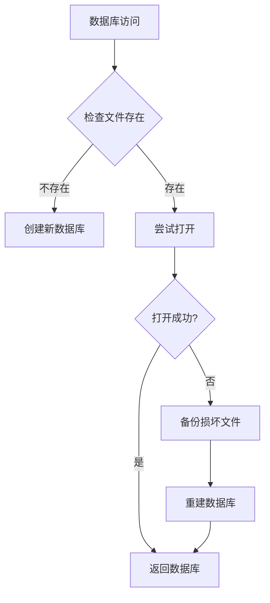
```mermaid
flowchart TD
Start[数据库访问] --> Check{检查文件存在}
Check --> |不存在| Create[创建新数据库]
Check --> |存在| Open[尝试打开]
Open --> Success{打开成功?}
Success --> |是| Return[返回数据库]
Success --> |否| Backup[备份损坏文件]
Backup --> Recreate[重建数据库]
Recreate --> Return
```

**流程图来源**
- [Store/bblotdb.go:70-87](file://Store/bblotdb.go#L70-L87)
- [Store/sqlitedb.go:198-217](file://Store/sqlitedb.go#L198-L217)

### 损坏检测与恢复

系统具备自动检测和恢复损坏数据库的能力：

1. **BBolt 恢复**：检测损坏文件，自动备份并重建
2. **SQLite 恢复**：检测数据库文件损坏，自动修复
3. **备份策略**：损坏文件自动备份，防止数据丢失
4. **连接重试**：Redis 连接失败时自动重试

**章节来源**
- [Store/bblotdb.go:70-87](file://Store/bblotdb.go#L70-L87)
- [Store/sqlitedb.go:198-217](file://Store/sqlitedb.go#L198-L217)
- [Store/redisdb.go:123-154](file://Store/redisdb.go#L123-L154)

## 扩展性设计

### 多后端支持

系统设计支持多种持久化后端：

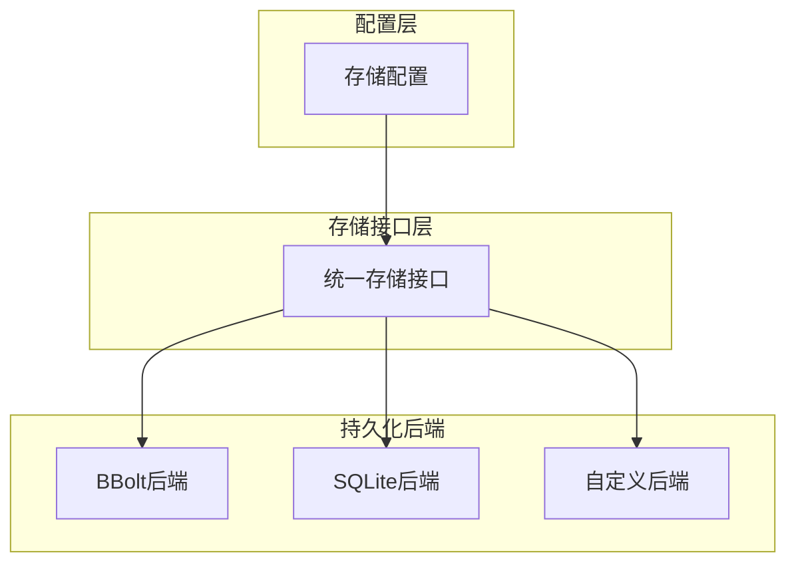
```mermaid
graph TB
subgraph "存储接口层"
Interface[统一存储接口]
end
subgraph "持久化后端"
BBolt[BBolt后端]
SQLite[SQLite后端]
Custom[自定义后端]
end
subgraph "配置层"
Config[存储配置]
end
Interface --> BBolt
Interface --> SQLite
Interface --> Custom
Config --> Interface
```

**图表来源**
- [Store/tilestorage.go:16-19](file://Store/tilestorage.go#L16-L19)

### 配置灵活性

系统提供灵活的配置选项：

| 配置项 | 默认值 | 说明 |
|-------|-------|------|
| 后端类型 | bbolt | 支持 bbolt 和 sqlite |
| 缓存开关 | true | 是否启用 Redis 缓存 |
| 缓存过期 | 5分钟 | 缓存数据过期时间 |
| 异步持久化 | false | 是否启用异步持久化 |
| 批次大小 | 100 | 异步持久化的批次大小 |
| 数据库目录 | ./data | 持久化数据库存储目录 |

**章节来源**
- [Store/tilestorage.go:142-163](file://Store/tilestorage.go#L142-L163)

## 总结

该存储架构具有以下核心优势：

1. **高性能**：通过缓存、批量操作和连接池优化实现高性能
2. **可靠性**：自动故障检测和恢复机制确保数据安全
3. **可扩展**：模块化设计支持多种后端和配置
4. **易维护**：清晰的分层架构和完善的测试覆盖
5. **资源友好**：智能分层存储减少 I/O 压力
6. **元数据支持**：内置元数据编码解码机制
7. **异步处理**：后台异步持久化提升写入性能

该架构特别适合大规模瓦片数据存储场景，能够有效处理 Google Earth 等地理信息系统中的海量瓦片数据，提供高效的读写性能和可靠的存储保障。通过 TileStorage 管理器的统一抽象，系统实现了存储技术的透明化，为上层应用提供了简单一致的存储接口。