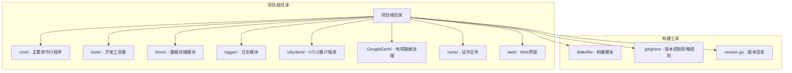
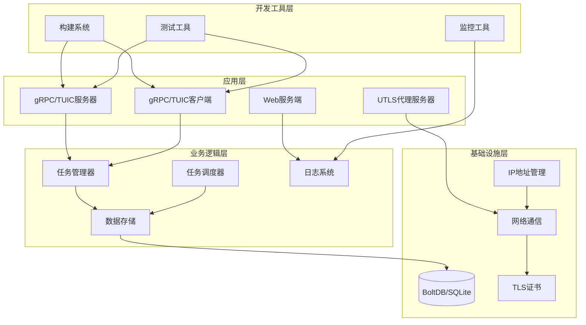
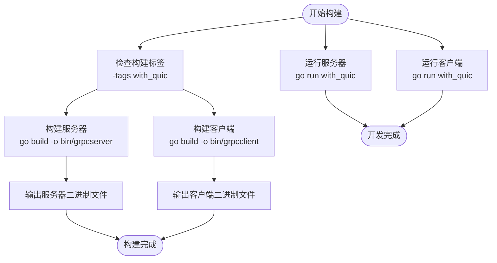
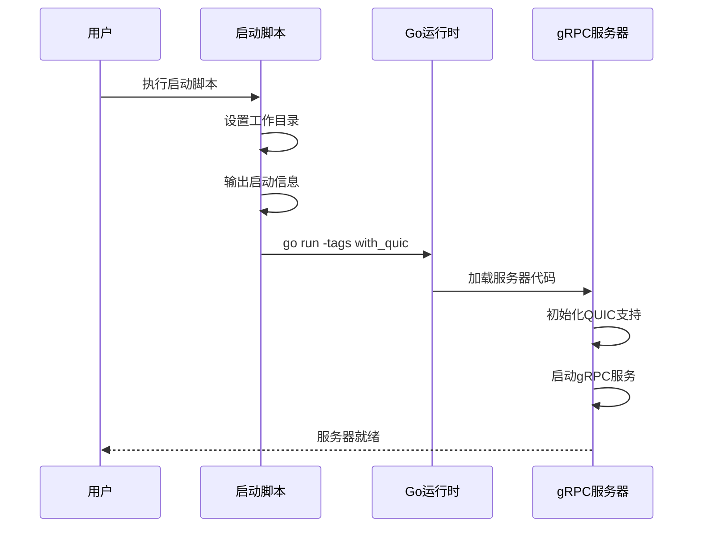
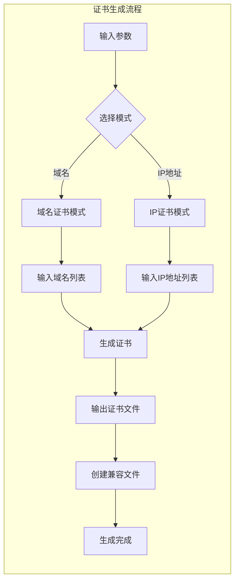
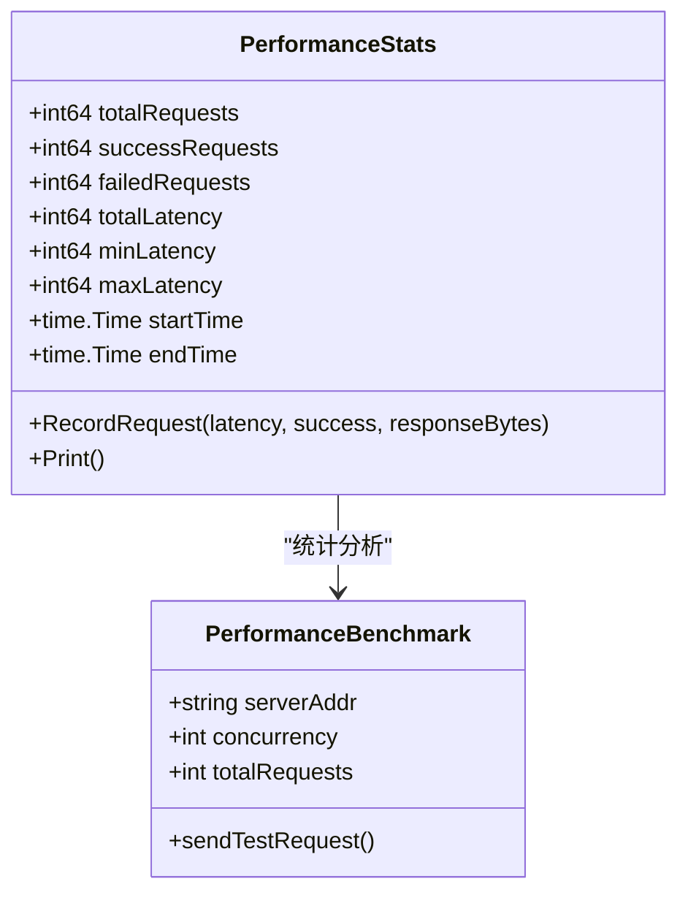
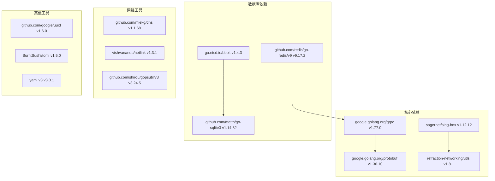

# 构建系统与开发工具

<cite>
**本文档引用的文件**
- [Makefile](file://Makefile)
- [go.mod](file://go.mod)
- [go.sum](file://go.sum)
- [version.go](file://version.go)
- [README.md](file://README.md)
- [start_grpcclient.sh](file://start_grpcclient.sh)
- [start_grpcserver.sh](file://start_grpcserver.sh)
- [.gitignore](file://.gitignore)
- [tools/README.md](file://tools/README.md)
- [tools/generate_bootstrap_cert.sh](file://tools/generate_bootstrap_cert.sh)
- [tools/performance_benchmark.go](file://tools/performance_benchmark.go)
</cite>

## 目录
1. [简介](#简介)
2. [项目结构](#项目结构)
3. [核心组件](#核心组件)
4. [架构概览](#架构概览)
5. [详细组件分析](#详细组件分析)
6. [依赖分析](#依赖分析)
7. [性能考虑](#性能考虑)
8. [故障排除指南](#故障排除指南)
9. [结论](#结论)

## 简介

本项目是一个高性能的爬虫平台，支持多种协议和高级功能。该项目采用Go语言开发，具备完整的构建系统和开发工具链。项目的核心特性包括基于QUIC的TUIC协议支持、高性能gRPC通信、多协议负载均衡以及完善的开发工具集。

## 项目结构

项目采用模块化的组织方式，主要包含以下核心目录：



**图表来源**
- [Makefile:1-36](file://Makefile#L1-L36)
- [README.md:5-23](file://README.md#L5-L23)

**章节来源**
- [README.md:1-121](file://README.md#L1-L121)
- [Makefile:1-36](file://Makefile#L1-L36)

## 核心组件

### 构建系统组件

项目采用Makefile作为主要的构建控制系统，提供完整的构建、运行和部署流程：

| 组件 | 功能描述 | 使用场景 |
|------|----------|----------|
| build-server | 构建带QUIC支持的gRPC/TUIC服务器 | 生产环境部署 |
| build-client | 构建带QUIC支持的gRPC/TUIC客户端 | 客户端应用打包 |
| run-server | 运行带QUIC支持的gRPC/TUIC服务器 | 开发调试 |
| run-client | 运行带QUIC支持的gRPC/TUIC客户端 | 客户端测试 |

### 开发工具组件

项目提供了丰富的开发工具，涵盖证书管理、性能测试、数据库操作等多个方面：

| 工具类别 | 工具名称 | 功能描述 |
|----------|----------|----------|
| 证书管理 | generate_bootstrap_cert.sh | 生成引导节点证书 |
| 证书管理 | cert_manager/ | TLS证书管理工具 |
| 性能测试 | performance_benchmark.go | 高并发性能测试工具 |
| 数据库工具 | read_bbolt_data.go | BBolt数据库读取工具 |
| 数据库工具 | test_bbolt_metadata.go | BBolt元数据测试 |
| 数据库工具 | test_sqlite_metadata.go | SQLite元数据测试 |

**章节来源**
- [Makefile:5-23](file://Makefile#L5-L23)
- [tools/README.md:1-34](file://tools/README.md#L1-L34)

## 架构概览

项目采用分层架构设计，结合现代Go语言的最佳实践：



**图表来源**
- [Makefile:1-36](file://Makefile#L1-L36)
- [go.mod:1-142](file://go.mod#L1-L142)

## 详细组件分析

### 构建系统分析

#### Makefile构建流程



**图表来源**
- [Makefile:5-23](file://Makefile#L5-L23)

#### 构建标签系统

项目使用Go的构建标签系统来实现条件编译：

| 构建标签 | 功能 | 应用场景 |
|----------|------|----------|
| with_quic | 启用QUIC协议支持 | gRPC/TUIC服务器和客户端 |
| 无标签 | 基础功能 | 标准gRPC应用 |

**章节来源**
- [Makefile:1-36](file://Makefile#L1-L36)

### 启动脚本分析

#### 服务器启动脚本



**图表来源**
- [start_grpcserver.sh:1-16](file://start_grpcserver.sh#L1-L16)

#### 客户端启动脚本

客户端启动脚本与服务器类似，但针对客户端应用进行了优化：

| 特性 | 服务器脚本 | 客户端脚本 |
|------|------------|------------|
| 工作目录 | 切换到项目根目录 | 切换到项目根目录 |
| 构建标签 | with_quic | with_quic |
| 参数传递 | 不传递参数 | 传递所有参数给客户端 |
| 输出信息 | 服务器启动信息 | 客户端启动信息 |

**章节来源**
- [start_grpcserver.sh:1-16](file://start_grpcserver.sh#L1-L16)
- [start_grpcclient.sh:1-16](file://start_grpcclient.sh#L1-L16)

### 开发工具分析

#### 证书管理系统



**图表来源**
- [tools/generate_bootstrap_cert.sh:1-70](file://tools/generate_bootstrap_cert.sh#L1-L70)

#### 性能测试工具

性能测试工具提供了全面的性能评估能力：



**图表来源**
- [tools/performance_benchmark.go:21-118](file://tools/performance_benchmark.go#L21-L118)

**章节来源**
- [tools/README.md:1-34](file://tools/README.md#L1-L34)
- [tools/generate_bootstrap_cert.sh:1-70](file://tools/generate_bootstrap_cert.sh#L1-L70)
- [tools/performance_benchmark.go:1-270](file://tools/performance_benchmark.go#L1-L270)

## 依赖分析

### Go模块依赖

项目使用Go 1.25版本，包含以下核心依赖：



**图表来源**
- [go.mod:5-20](file://go.mod#L5-L20)

### 间接依赖关系

项目还包含大量的间接依赖，这些依赖通过模块系统自动管理：

| 依赖类别 | 数量 | 作用 |
|----------|------|------|
| 直接依赖 | 22个 | 核心功能模块 |
| 间接依赖 | 118个 | 支撑功能模块 |
| 工具依赖 | 139个 | 开发和构建工具 |

**章节来源**
- [go.mod:1-142](file://go.mod#L1-L142)
- [go.sum:1-359](file://go.sum#L1-L359)

## 性能考虑

### 构建性能优化

项目在构建系统层面采用了多项优化策略：

1. **条件编译优化**：通过构建标签实现按需编译，减少不必要的代码编译
2. **并行构建**：Go工具链天然支持并行编译，提高构建效率
3. **缓存机制**：利用Go模块缓存系统，避免重复下载依赖

### 运行时性能特性

基于项目文档的性能测试结果显示：

| 性能指标 | 测试结果 | 说明 |
|----------|----------|------|
| QPS | 4,053.75 | 高并发请求处理能力 |
| 成功率 | 100% | 系统稳定性优秀 |
| 总耗时 | 4.93秒 | 大规模测试表现 |
| 平均延迟 | 417.62ms | 低延迟响应 |
| 负载均衡 | 99.9% | 节点间负载分布均匀 |

### 内存和资源管理

项目在资源管理方面表现出色：

- **连接复用**：支持高效的连接复用机制
- **内存优化**：采用内存池和对象复用技术
- **CPU优化**：多核并行处理和异步I/O

## 故障排除指南

### 构建问题

#### 常见构建错误及解决方案

| 错误类型 | 症状 | 解决方案 |
|----------|------|----------|
| 依赖下载失败 | go mod download超时 | 检查网络连接，使用代理 |
| 编译错误 | 语法错误或类型错误 | 检查Go版本兼容性 |
| 构建标签错误 | with_quic相关编译错误 | 确保Go 1.25+版本 |
| 路径错误 | 文件找不到 | 检查工作目录设置 |

#### 构建环境检查

```bash
# 检查Go版本
go version

# 检查模块状态
go mod tidy

# 清理构建缓存
go clean -cache

# 重新构建
make build-server
make build-client
```

### 运行时问题

#### 服务器启动问题

```bash
# 检查服务器状态
./start_grpcserver.sh

# 查看错误日志
tail -f *.log

# 检查端口占用
netstat -tulpn | grep 50051
```

#### 客户端连接问题

```bash
# 检查客户端状态
./start_grpcclient.sh

# 验证证书有效性
openssl x509 -in ./certs/cert.pem -text -noout

# 测试网络连通性
ping localhost
```

### 性能问题诊断

#### 性能基准测试

```bash
# 运行性能测试
go run tools/performance_benchmark.go

# 调整测试参数
go run tools/performance_benchmark.go -concurrency 100 -requests 1000
```

#### 资源监控

```bash
# 监控系统资源
top -p $(pgrep grpcserver)

# 检查内存使用
ps aux | grep grpcserver

# 监控网络流量
iftop -i lo0
```

**章节来源**
- [Makefile:25-36](file://Makefile#L25-L36)
- [tools/performance_benchmark.go:142-223](file://tools/performance_benchmark.go#L142-L223)

## 结论

本项目的构建系统与开发工具展现了现代Go语言项目的最佳实践。通过精心设计的Makefile、完善的启动脚本、丰富的开发工具集以及清晰的模块化架构，项目实现了高效、可靠的开发和部署流程。

### 主要优势

1. **简洁高效的构建系统**：Makefile提供了完整的构建、运行和部署流程
2. **灵活的开发工具集**：涵盖了从证书管理到性能测试的全方位工具
3. **现代化的架构设计**：支持多种协议和高级功能
4. **完善的性能测试**：提供了详细的性能指标和基准测试工具

### 技术特色

- **QUIC协议支持**：通过构建标签实现条件编译
- **多协议兼容**：支持gRPC、TUIC等多种通信协议
- **高并发性能**：经过大规模性能测试验证
- **自动化工具链**：从开发到部署的完整自动化流程

该项目为构建高性能网络应用提供了优秀的模板和参考，其设计理念和实现方式值得其他项目借鉴学习。