# 核心功能

<cite>
**本文档中引用的文件**
- [README.md](file://README.md)
- [utlsclient/utlshotconnpool.go](file://utlsclient/utlshotconnpool.go)
- [utlsclient/utlsfingerprint.go](file://utlsclient/utlsfingerprint.go)
- [localippool/localippool.go](file://localippool/localippool.go)
- [remotedomainippool/remotedomainippool.go](file://remotedomainippool/remotedomainippool.go)
- [utlsclient/utlsclient.go](file://utlsclient/utlsclient.go)
- [utlsclient/connection_manager.go](file://utlsclient/connection_manager.go)
- [utlsclient/health_checker.go](file://utlsclient/health_checker.go)
- [examples/utlsclient/example_hotconnpool_usage.go](file://examples/utlsclient/example_hotconnpool_usage.go)
- [examples/utlsclient/example_utlsclient_usage.go](file://examples/utlsclient/example_utlsclient_usage.go)
- [GoogleEarth/geq2.go](file://GoogleEarth/geq2.go) - *新增 Google Earth Q2 解析器*
- [Store/tilestorage.go](file://Store/tilestorage.go) - *新增多后端存储架构*
- [Store/bblotdb.go](file://Store/bblotdb.go) - *BBolt 持久化实现*
- [Store/sqlitedb.go](file://Store/sqlitedb.go) - *SQLite 持久化实现*
- [Store/dbpath.go](file://Store/dbpath.go) - *数据库路径管理*
</cite>

## 更新摘要
**变更内容**   
- 新增 **Google Earth Q2 解析器** 功能模块，支持解析 Google Earth Q2 数据包
- 新增 **多后端存储架构** 功能模块，支持 BBolt 和 SQLite 持久化后端
- 更新 **项目架构概览** 图表，包含新增组件
- 新增 **Google Earth Q2 解析器** 和 **多后端存储架构** 两个新章节
- 更新 **功能依赖关系分析** 图表，反映新增依赖
- 增强源码追踪系统，添加新功能相关文件引用

## 目录
1. [简介](#简介)
2. [项目架构概览](#项目架构概览)
3. [热连接池核心功能](#热连接池核心功能)
4. [TLS指纹伪装技术](#tls指纹伪装技术)
5. [IP池管理机制](#ip池管理机制)
6. [HTTP协议支持](#http协议支持)
7. [Google Earth Q2解析器](#google-earth-q2解析器)
8. [多后端存储架构](#多后端存储架构)
9. [功能依赖关系分析](#功能依赖关系分析)
10. [性能优化建议](#性能优化建议)
11. [最佳实践指南](#最佳实践指南)
12. [总结](#总结)

## 简介

Crawler Platform 是一个基于 uTLS 的高性能爬虫平台，专门设计用于绕过现代 Web 应用的安全检测机制。该项目通过创新的技术组合，实现了突破性的性能提升和高度的隐蔽性。

### 核心特性

- **🔥 热连接池**: 预建立 TLS 连接并复用，性能提升 3-6 倍
- **🎭 TLS 指纹伪装**: 支持 33 种真实浏览器指纹，模拟 Chrome、Firefox、Safari、Edge 等
- **🌍 多语言支持**: 随机生成 Accept-Language 头，从 90 种语言中组合，97.8% 独特性
- **📡 双协议支持**: 自动检测 HTTP/1.1 和 HTTP/2，完美支持 h2 连接复用
- **🌐 双栈网络**: 完整支持 IPv4 和 IPv6 地址
- **🔒 安全可靠**: 死锁预防、连接健康检查、自动重试机制
- **🛰️ Google Earth Q2 解析**: 新增支持解析 Google Earth Q2 数据包，提取影像、地形、矢量等引用信息
- **💾 多后端存储**: 新增多后端存储架构，支持 BBolt 和 SQLite 持久化，可选 Redis 缓存和异步持久化

## 项目架构概览

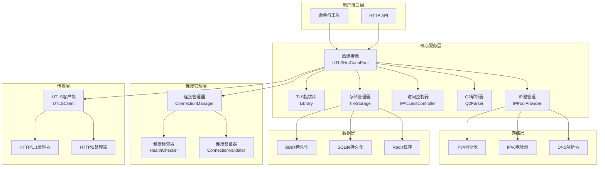

**图表来源**
- [utlsclient/utlshotconnpool.go](file://utlsclient/utlshotconnpool.go#L236-L258)
- [utlsclient/connection_manager.go](file://utlsclient/connection_manager.go#L8-L14)
- [localippool/localippool.go](file://localippool/localippool.go#L32-L69)
- [GoogleEarth/geq2.go](file://GoogleEarth/geq2.go#L19-L24)
- [Store/tilestorage.go](file://Store/tilestorage.go#L43-L45)

## 热连接池核心功能

### 设计理念

热连接池是整个系统的核心组件，通过预建立和复用 TLS 连接来显著提升性能。其设计遵循以下原则：

1. **预热机制**: 在系统启动时预先建立大量连接
2. **智能复用**: 根据负载动态分配可用连接
3. **健康监控**: 持续监控连接状态，及时剔除故障连接
4. **并发安全**: 使用多级锁机制确保高并发下的安全性

### 核心架构

```mermaid
classDiagram
class UTLSHotConnPool {
+connManager : ConnectionManager
+healthChecker : HealthChecker
+validator : ConnectionValidator
+ipAccessCtrl : IPAccessController
+config : PoolConfig
+stats : PoolStats
+GetConnection(targetHost) UTLSConnection
+PutConnection(conn) void
+GetStats() PoolStats
+IsHealthy() bool
+Close() error
}
class ConnectionManager {
+connections : map[string]*UTLSConnection
+hostMapping : map[string][]string
+config : PoolConfig
+AddConnection(conn) void
+RemoveConnection(ip) void
+GetConnectionsForHost(host) []*UTLSConnection
+CleanupIdleConnections() int
}
class UTLSConnection {
+conn : net.Conn
+tlsConn : *utls.UConn
+targetIP : string
+targetHost : string
+fingerprint : Profile
+acceptLanguage : string
+h2ClientConn : interface{}
+inUse : bool
+healthy : bool
+requestCount : int64
+errorCount : int64
+mu : sync.Mutex
+cond : sync.Cond
}
UTLSHotConnPool --> ConnectionManager
UTLSHotConnPool --> UTLSConnection
ConnectionManager --> UTLSConnection
```

**图表来源**
- [utlsclient/utlshotconnpool.go](file://utlsclient/utlshotconnpool.go#L236-L258)
- [utlsclient/connection_manager.go](file://utlsclient/connection_manager.go#L8-L14)
- [utlsclient/utlsclient.go](file://utlsclient/utlsclient.go#L37-L52)

### 工作流程

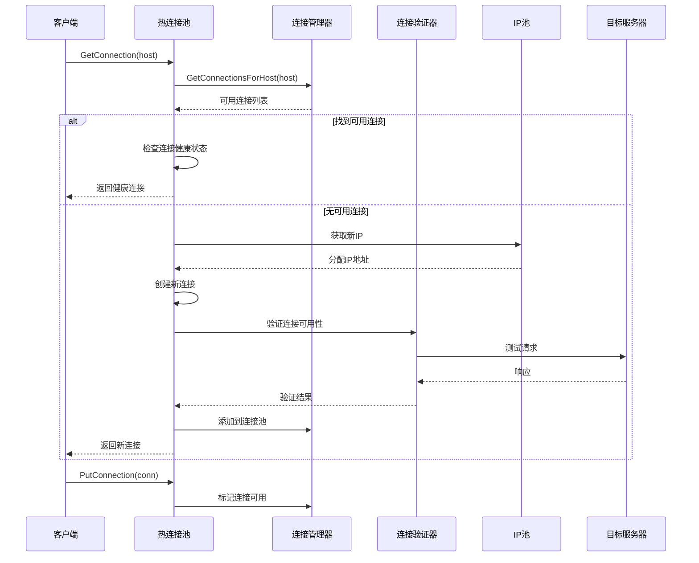

**图表来源**
- [utlsclient/utlshotconnpool.go](file://utlsclient/utlshotconnpool.go#L351-L395)
- [utlsclient/connection_manager.go](file://utlsclient/connection_manager.go#L76-L90)

### 关键特性

1. **双重检查模式**: 避免死锁的并发安全机制
2. **连接健康检查**: 定期验证连接可用性
3. **自动重试机制**: 连接失败时自动重试
4. **统计监控**: 实时跟踪连接池状态

**章节来源**
- [utlsclient/utlshotconnpool.go](file://utlsclient/utlshotconnpool.go#L351-L800)

## TLS指纹伪装技术

### 技术原理

TLS 指纹伪装是通过模拟真实浏览器的 TLS 握手过程来隐藏爬虫身份。系统支持 33 种不同的浏览器指纹，涵盖主流浏览器的各种版本。

### 指纹库架构

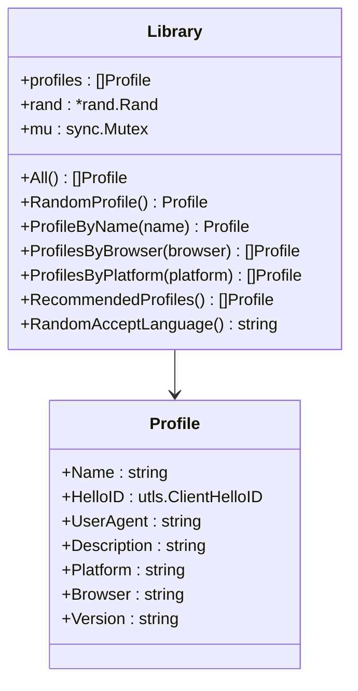

**图表来源**
- [utlsclient/utlsfingerprint.go](file://utlsclient/utlsfingerprint.go#L13-L29)

### 支持的浏览器指纹

| 浏览器系列 | 版本数量 | 支持平台 | 描述 |
|------------|----------|----------|------|
| Chrome | 12种 | Windows, macOS, Linux | 主流桌面浏览器，支持最新版本 |
| Firefox | 9种 | Windows, macOS | 开源浏览器，支持稳定版本 |
| Safari | 4种 | macOS, iOS | 苹果生态系统浏览器 |
| Edge | 3种 | Windows | 微软浏览器，基于 Chromium |
| Randomized | 3种 | Random | 随机化指纹，增强隐蔽性 |

### Accept-Language 随机化

系统从 90 种语言中随机组合 2-5 种语言，生成独特的 Accept-Language 头：

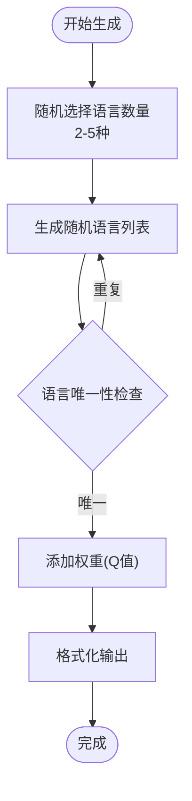

**图表来源**
- [utlsclient/utlsfingerprint.go](file://utlsclient/utlsfingerprint.go#L589-L630)

### 性能指标

- **指纹多样性**: 33 种不同浏览器指纹均匀分布
- **语言独特性**: 97.8% 的 Accept-Language 组合具有独特性
- **随机化效果**: 每次建立连接时随机选择指纹，模拟真实用户行为

**章节来源**
- [utlsclient/utlsfingerprint.go](file://utlsclient/utlsfingerprint.go#L112-L631)

## IP池管理机制

### 双层IP池架构

系统采用双层 IP 池架构，结合本地 IP 池和远程域名 IP 池，提供灵活的 IP 管理策略。

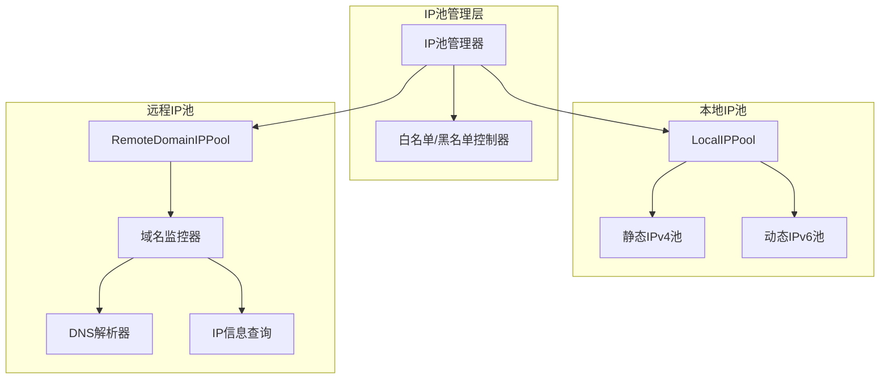

**图表来源**
- [localippool/localippool.go](file://localippool/localippool.go#L32-L69)
- [remotedomainippool/remotedomainippool.go](file://remotedomainippool/remotedomainippool.go#L101-L109)

### 本地IP池功能

本地 IP 池具备智能自适应能力，能够根据系统环境自动调整：

1. **IPv4支持**: 使用静态配置的 IPv4 地址
2. **IPv6动态生成**: 在支持的环境中动态生成 IPv6 地址
3. **环境检测**: 自动检测系统网络配置
4. **批量管理**: 支持批量创建和清理 IP 地址

### 远程域名IP池

远程域名 IP 池通过实时监控域名变化来维护最新的 IP 地址池：

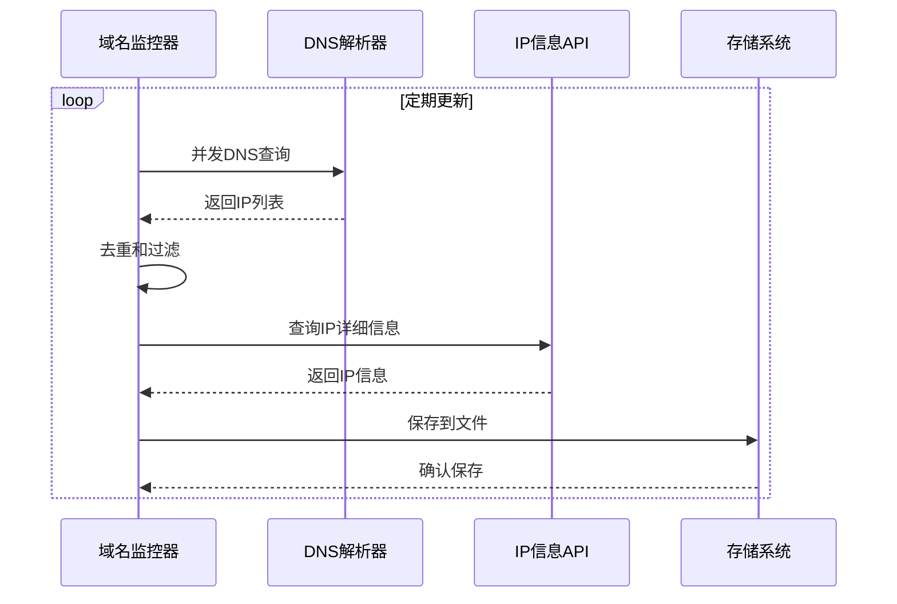

**图表来源**
- [remotedomainippool/remotedomainippool.go](file://remotedomainippool/remotedomainippool.go#L286-L355)

### IP访问控制

系统提供完善的白名单和黑名单机制：

- **白名单**: 记录经过验证的可用 IP
- **黑名单**: 过滤掉被封禁或不可用的 IP
- **动态更新**: 根据连接成功率自动调整黑白名单

**章节来源**
- [localippool/localippool.go](file://localippool/localippool.go#L1-L800)
- [remotedomainippool/remotedomainippool.go](file://remotedomainippool/remotedomainippool.go#L1-L472)

## HTTP协议支持

### 双协议自动检测

系统能够自动检测和协商 HTTP/1.1 和 HTTP/2 协议：

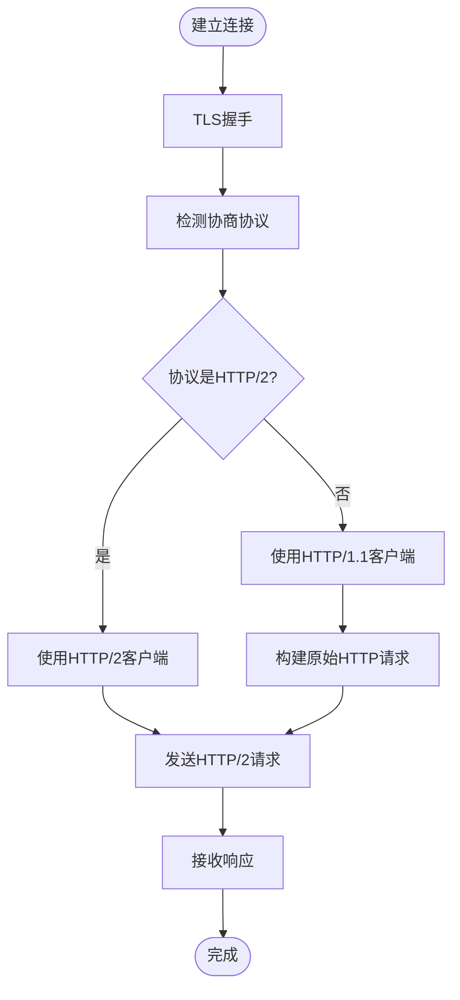

**图表来源**
- [utlsclient/utlsclient.go](file://utlsclient/utlsclient.go#L130-L141)

### HTTP/2 支持特性

1. **连接复用**: 单个 TCP 连接支持多路复用
2. **服务器推送**: 支持 HTTP/2 服务器推送
3. **头部压缩**: HPACK 压缩减少传输开销
4. **流优先级**: 支持流优先级控制

### HTTP/1.1 实现

对于 HTTP/1.1 协议，系统实现了完整的原始请求构建和响应解析：

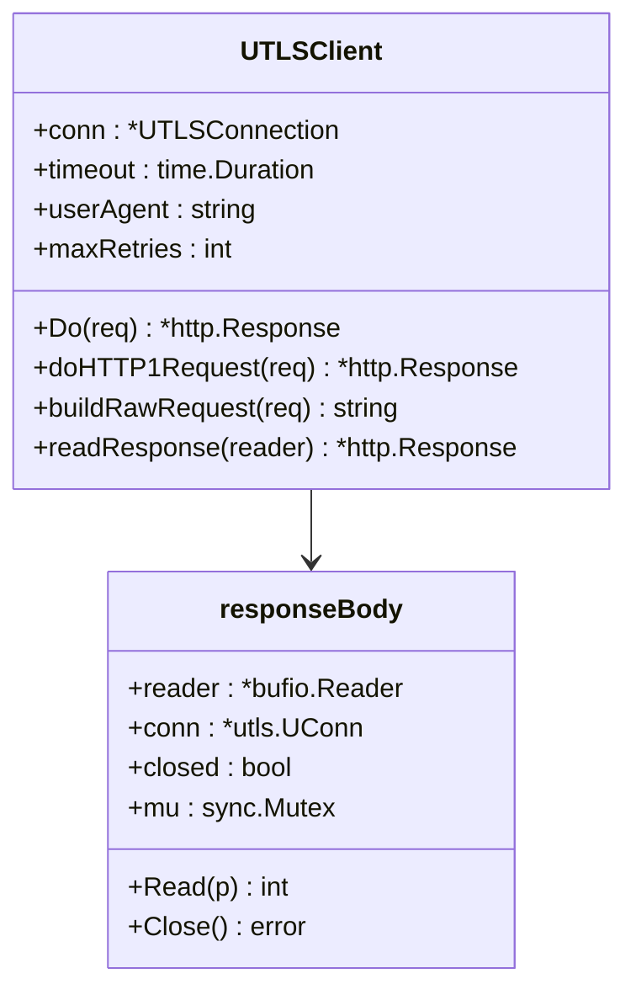

**图表来源**
- [utlsclient/utlsclient.go](file://utlsclient/utlsclient.go#L37-L52)
- [utlsclient/utlsclient.go](file://utlsclient/utlsclient.go#L333-L363)

### IPv6 完整支持

系统完全支持 IPv6 地址连接，包括：

- **地址格式处理**: 自动识别和处理 IPv6 地址格式
- **方括号包裹**: 正确处理 IPv6 地址的方括号格式
- **双栈网络**: 同时支持 IPv4 和 IPv6
- **隧道模式**: 支持通过 IPv6 隧道连接

**章节来源**
- [utlsclient/utlsclient.go](file://utlsclient/utlsclient.go#L1-L392)

## Google Earth Q2解析器

### 设计目的

Google Earth Q2 解析器旨在解析 Google Earth 的 Q2 数据包，提取其中的影像、地形、矢量和子节点引用信息。该功能支持将二进制 Q2 数据转换为结构化的 JSON 格式，便于后续处理和分析。

### 实现细节

Q2 解析器采用接口驱动设计，提供灵活的扩展能力：

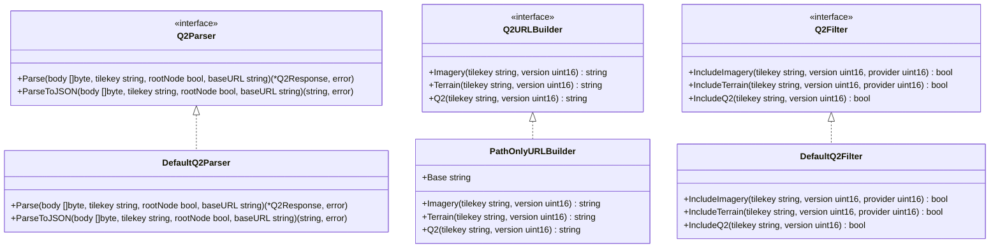

**图表来源**
- [GoogleEarth/geq2.go](file://GoogleEarth/geq2.go#L8-L13)
- [GoogleEarth/geq2.go](file://GoogleEarth/geq2.go#L40-L45)
- [GoogleEarth/geq2.go](file://GoogleEarth/geq2.go#L73-L78)

### 核心功能

1. **二进制解析**: 使用 `QuadTreePacket16` 解码 Q2 二进制格式
2. **JSON转换**: 将解析结果转换为结构化的 JSON 格式
3. **URL构造**: 支持根据基础 URL 构造完整的请求 URL
4. **数据过滤**: 提供过滤策略，控制输出的数据类型
5. **选项支持**: 支持通过 `Q2ParseOptions` 控制输出内容

### 使用示例

```go
// 创建 Q2 解析器
parser := GoogleEarth.NewQ2Parser()

// 解析 Q2 数据
body := []byte{...} // 从网络获取的 Q2 数据
jsonStr, err := parser.ParseToJSON(body, "0", true, "https://kh.google.com")
if err != nil {
    log.Fatal(err)
}

// 解析为结构体
response, err := parser.Parse(body, "0", true, "https://kh.google.com")
if err != nil {
    log.Fatal(err)
}

// 使用选项控制输出
opts := GoogleEarth.Q2ParseOptions{
    IncludeImagery: true,
    IncludeTerrain: false,
    IncludeVector:  true,
    IncludeQ2:      true,
}
jsonStr, err = GoogleEarth.ParseQ2BodyWithOptions(body, "0", true, "https://kh.google.com", opts)
```

**章节来源**
- [GoogleEarth/geq2.go](file://GoogleEarth/geq2.go#L150-L480)

## 多后端存储架构

### 设计目的

多后端存储架构旨在提供灵活、高性能的瓦片数据存储解决方案。系统支持多种持久化后端和缓存策略，满足不同场景下的性能和可靠性需求。

### 实现细节

存储架构采用分层设计，支持多种持久化后端和缓存策略：

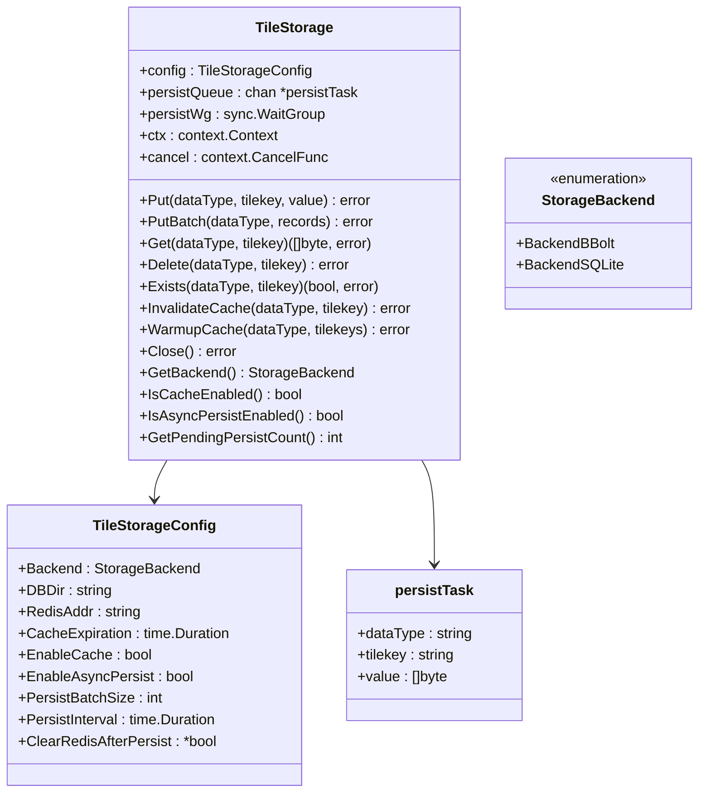

**图表来源**
- [Store/tilestorage.go](file://Store/tilestorage.go#L19-L39)
- [Store/tilestorage.go](file://Store/tilestorage.go#L43-L51)

### 核心功能

1. **多后端支持**: 支持 BBolt 和 SQLite 两种持久化后端
2. **Redis缓存**: 可选 Redis 作为读缓存，提升读取性能
3. **异步持久化**: 支持先写 Redis 缓冲，后台异步刷盘
4. **分层存储**: 根据瓦片层级自动选择存储策略
5. **批量操作**: 支持批量读写，提升性能
6. **缓存预热**: 支持预热缓存，提升初始性能

### 配置选项

| 配置项 | 说明 |
|--------|------|
| `Backend` | 持久化后端类型（`bbolt` 或 `sqlite`） |
| `DBDir` | 持久化数据库根目录 |
| `RedisAddr` | Redis 地址，启用缓存或异步模式时必需 |
| `CacheExpiration` | Redis 缓存过期时间（0 = 永不过期） |
| `EnableCache` | 是否启用 Redis 缓存 |
| `EnableAsyncPersist` | 是否启用异步持久化（Redis 作为写缓冲区） |
| `PersistBatchSize` | 异步持久化批次大小（默认 100） |
| `PersistInterval` | 异步持久化刷新间隔（默认 5 秒） |
| `ClearRedisAfterPersist` | 持久化成功后是否清理 Redis（默认 true） |

### 使用示例

```go
// 配置存储
config := Store.TileStorageConfig{
    Backend:         Store.BackendBBolt,
    DBDir:           "/data/tiles",
    RedisAddr:       "localhost:6379",
    CacheExpiration: 1 * time.Hour,
    EnableCache:     true,
    EnableAsyncPersist: true,
    PersistBatchSize: 100,
    PersistInterval:  10 * time.Second,
}

// 创建存储管理器
storage, err := Store.NewTileStorage(config)
if err != nil {
    log.Fatal(err)
}
defer storage.Close()

// 写入瓦片
err = storage.Put("imagery", "01230123", []byte("tile_data"))
if err != nil {
    log.Fatal(err)
}

// 读取瓦片
data, err := storage.Get("imagery", "01230123")
if err != nil {
    log.Fatal(err)
}
```

**章节来源**
- [Store/tilestorage.go](file://Store/tilestorage.go#L61-L454)
- [Store/bblotdb.go](file://Store/bblotdb.go)
- [Store/sqlitedb.go](file://Store/sqlitedb.go)
- [Store/dbpath.go](file://Store/dbpath.go)

## 功能依赖关系分析

### 核心依赖链

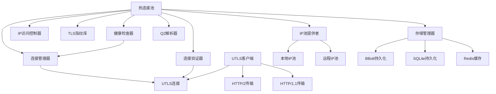

**图表来源**
- [utlsclient/utlshotconnpool.go](file://utlsclient/utlshotconnpool.go#L236-L258)
- [utlsclient/connection_manager.go](file://utlsclient/connection_manager.go#L8-L14)
- [GoogleEarth/geq2.go](file://GoogleEarth/geq2.go#L19-L24)
- [Store/tilestorage.go](file://Store/tilestorage.go#L43-L45)

### 交互流程

1. **热连接池** 依赖 **TLS指纹库** 提供指纹配置
2. **热连接池** 使用 **IP池管理器** 获取可用 IP 地址
3. **连接管理器** 管理 **UTLS连接** 的生命周期
4. **健康检查器** 定期验证连接状态
5. **UTLS客户端** 使用 **HTTP/1.1/HTTP/2传输** 发送请求
6. **热连接池** 使用 **Q2解析器** 解析 Google Earth Q2 数据
7. **热连接池** 使用 **存储管理器** 存储和读取瓦片数据
8. **存储管理器** 使用 **BBolt/SQLite** 进行持久化，可选 **Redis** 作为缓存

### 数据流向

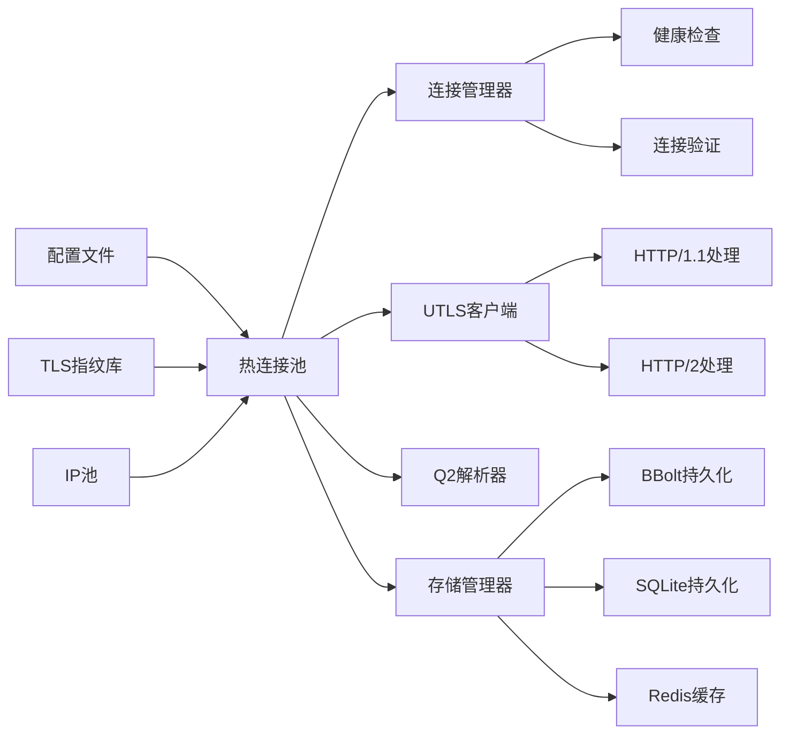

**章节来源**
- [utlsclient/utlshotconnpool.go](file://utlsclient/utlshotconnpool.go#L291-L350)
- [GoogleEarth/geq2.go](file://GoogleEarth/geq2.go#L150-L480)
- [Store/tilestorage.go](file://Store/tilestorage.go#L61-L454)

## 性能优化建议

### 连接池优化

1. **合理配置连接数**
   - `MaxConnections`: 根据并发需求设置
   - `MaxConnsPerHost`: 控制单主机连接数
   - `MaxIdleConns`: 保持适量空闲连接

2. **超时参数调优**
   - `ConnTimeout`: 连接建立超时时间
   - `IdleTimeout`: 空闲连接超时时间
   - `MaxLifetime`: 连接最大生命周期

3. **健康检查优化**
   - `HealthCheckInterval`: 健康检查间隔
   - `TestTimeout`: 测试请求超时时间

### IP池优化

1. **本地IP池**
   - 合理配置静态IPv4地址
   - 根据网络环境调整IPv6支持

2. **远程IP池**
   - 设置合适的更新间隔
   - 优化DNS查询并发数

### TLS指纹优化

1. **指纹选择策略**
   - 根据目标网站特征选择合适指纹
   - 定期轮换指纹类型

2. **语言随机化**
   - 根据目标地区调整语言组合
   - 平衡随机性和独特性

### Q2解析器优化

1. **缓存策略**
   - 对频繁访问的 Q2 数据使用 Redis 缓存
   - 设置合理的缓存过期时间

2. **批量处理**
   - 批量解析多个 Q2 数据包
   - 使用并发处理提升性能

3. **内存优化**
   - 及时释放不再需要的解析结果
   - 使用对象池减少内存分配

### 存储架构优化

1. **后端选择**
   - 高性能场景选择 BBolt
   - 跨平台场景选择 SQLite

2. **缓存配置**
   - 高频读取场景启用 Redis 缓存
   - 设置合理的缓存过期时间

3. **异步持久化**
   - 高频写入场景启用异步持久化
   - 调整批次大小和刷新间隔

**章节来源**
- [utlsclient/utlshotconnpool.go](file://utlsclient/utlshotconnpool.go#L170-L202)
- [GoogleEarth/geq2.go](file://GoogleEarth/geq2.go#L150-L480)
- [Store/tilestorage.go](file://Store/tilestorage.go#L61-L454)

## 最佳实践指南

### 使用热连接池

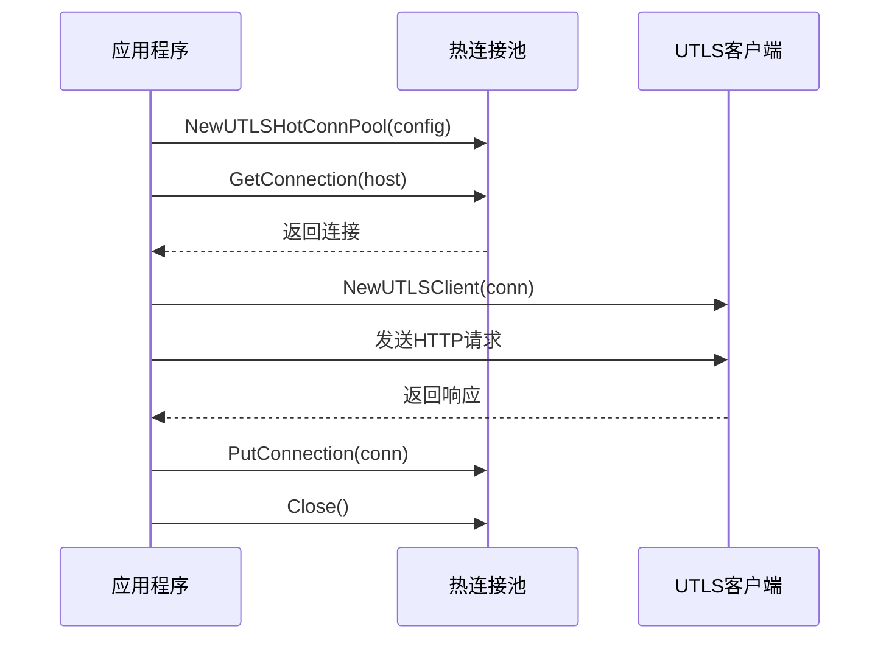

**图表来源**
- [examples/utlsclient/example_hotconnpool_usage.go](file://examples/utlsclient/example_hotconnpool_usage.go#L46-L116)

### 推荐使用模式

1. **预热连接**: 在开始大规模请求前预热连接池
2. **轮询使用**: 采用【获取-使用-归还】模式
3. **并发控制**: 合理控制并发数和请求频率
4. **错误处理**: 实现完善的错误重试机制

### 配置建议

1. **连接池配置**
   ```go
   config := &PoolConfig{
       MaxConnections:         100,
       MaxConnsPerHost:        10,
       ConnTimeout:            30 * time.Second,
       IdleTimeout:            60 * time.Second,
       MaxLifetime:            300 * time.Second,
   }
   ```

2. **超时设置**
   ```go
   client.SetTimeout(15 * time.Second)
   ```

3. **错误重试**
   ```go
   client.SetMaxRetries(3)
   ```

4. **Q2解析器配置**
   ```go
   opts := GoogleEarth.Q2ParseOptions{
       IncludeImagery: true,
       IncludeTerrain: true,
       IncludeVector:  true,
       IncludeQ2:      true,
   }
   ```

5. **存储架构配置**
   ```go
   config := Store.TileStorageConfig{
       Backend:         Store.BackendBBolt,
       DBDir:           "/data/tiles",
       RedisAddr:       "localhost:6379",
       CacheExpiration: 1 * time.Hour,
       EnableCache:     true,
       EnableAsyncPersist: true,
       PersistBatchSize: 100,
       PersistInterval:  10 * time.Second,
   }
   ```

**章节来源**
- [examples/utlsclient/example_hotconnpool_usage.go](file://examples/utlsclient/example_hotconnpool_usage.go#L1-L277)
- [examples/utlsclient/example_utlsclient_usage.go](file://examples/utlsclient/example_utlsclient_usage.go#L1-L117)
- [GoogleEarth/geq2.go](file://GoogleEarth/geq2.go#L150-L480)
- [Store/tilestorage.go](file://Store/tilestorage.go#L61-L454)

## 总结

Crawler Platform 通过创新的技术组合，实现了高性能和高隐蔽性的爬虫解决方案：

### 核心优势

1. **性能卓越**: 热连接池技术实现 3-6 倍性能提升
2. **隐蔽性强**: TLS 指纹伪装和多语言随机化
3. **稳定性高**: 完善的健康检查和自动重试机制
4. **扩展性好**: 模块化设计支持灵活配置
5. **功能丰富**: 新增 Google Earth Q2 解析器，支持解析复杂地理数据
6. **存储灵活**: 新增多后端存储架构，支持多种持久化和缓存策略

### 技术创新

- **智能连接复用**: 避免重复 TLS 握手开销
- **动态指纹选择**: 根据目标网站特征选择最优指纹
- **双栈网络支持**: 同时支持 IPv4 和 IPv6
- **实时IP监控**: 远程域名IP池动态更新
- **Q2数据解析**: 支持解析 Google Earth Q2 数据包，提取地理信息
- **多后端存储**: 支持 BBolt 和 SQLite 持久化，可选 Redis 缓存和异步持久化

### 应用场景

- **Web爬虫**: 高效抓取网页内容
- **API测试**: 模拟真实用户请求
- **安全研究**: 分析Web应用安全防护
- **数据采集**: 大规模数据收集
- **地理信息处理**: 解析和处理 Google Earth 地理数据
- **高性能存储**: 高频读写场景下的数据存储

通过合理配置和使用这些核心功能，开发者可以构建出高效、稳定的爬虫系统，同时保持良好的隐蔽性和扩展性。