```mermaid
sequenceDiagram
participant Client as 客户端
participant Auth as 认证管理器
participant DBRoot as dbRoot解析器
participant Q2Parser as Q2解析器
participant Storage as 存储管理器
participant Target as Google Earth服务器
Client->>Auth : GetAuth()
Auth->>Target : POST /geauth
Target-->>Auth : 返回Session
Auth-->>Client : 返回Session
Client->>DBRoot : ParseDbRootComplete()
DBRoot->>Target : GET /dbRoot.v5
Target-->>DBRoot : 返回加密数据
DBRoot->>DBRoot : 解密并解析
DBRoot-->>Client : 返回版本号、密钥、XML
Client->>Q2Parser : ParseQ2Body()
Q2Parser->>Target : GET /flatfile?q2-0-q.1029
Target-->>Q2Parser : 返回加密Q2数据
Q2Parser->>Q2Parser : 解密并解析
Q2Parser-->>Client : 返回JSON/结构体
Client->>Storage : Put()
Storage->>SQLite : 写入SQLite数据库
Storage->>Redis : 写入Redis缓存(可选)
Storage-->>Client : 确认存储
```

# 核心功能

<cite>
**本文档中引用的文件**
- [README.md](file://README.md)
- [utlsclient/utlshotconnpool.go](file://utlsclient/utlshotconnpool.go)
- [utlsclient/utlsfingerprint.go](file://utlsclient/utlsfingerprint.go)
- [localippool/localippool.go](file://localippool/localippool.go)
- [remotedomainippool/remotedomainippool.go](file://remotedomainippool/remotedomainippool.go)
- [utlsclient/utlsclient.go](file://utlsclient/utlsclient.go)
- [utlsclient/connection_manager.go](file://utlsclient/connection_manager.go)
- [utlsclient/health_checker.go](file://utlsclient/health_checker.go)
- [examples/utlsclient/example_hotconnpool_usage.go](file://examples/utlsclient/example_hotconnpool_usage.go)
- [examples/utlsclient/example_utlsclient_usage.go](file://examples/utlsclient/example_utlsclient_usage.go)
- [GoogleEarth/geq2.go](file://GoogleEarth/geq2.go) - *新增 Google Earth Q2 数据解析功能*
- [GoogleEarth/gedbroot.go](file://GoogleEarth/gedbroot.go) - *新增 dbRoot 解析功能*
- [Store/sqlitedb.go](file://Store/sqlitedb.go) - *新增 SQLite 存储支持*
- [Store/tilestorage.go](file://Store/tilestorage.go) - *新增瓦片存储管理功能*
</cite>

## 更新摘要
**变更内容**
- 新增 Google Earth Q2 数据解析与存储架构章节
- 扩展项目架构概览图以包含新功能模块
- 新增 Q2 数据解析流程图
- 更新功能依赖关系分析以包含新组件
- 添加性能优化建议和最佳实践指南

## 目录
1. [简介](#简介)
2. [项目架构概览](#项目架构概览)
3. [热连接池核心功能](#热连接池核心功能)
4. [TLS指纹伪装技术](#tls指纹伪装技术)
5. [IP池管理机制](#ip池管理机制)
6. [HTTP协议支持](#http协议支持)
7. [Google Earth Q2数据解析与存储](#google-earth-q2数据解析与存储)
8. [功能依赖关系分析](#功能依赖关系分析)
9. [性能优化建议](#性能优化建议)
10. [最佳实践指南](#最佳实践指南)
11. [总结](#总结)

## 简介

Crawler Platform 是一个基于 uTLS 的高性能爬虫平台，专门设计用于绕过现代 Web 应用的安全检测机制。该项目通过创新的技术组合，实现了突破性的性能提升和高度的隐蔽性。

### 核心特性

- **🔥 热连接池**: 预建立 TLS 连接并复用，性能提升 3-6 倍
- **🎭 TLS 指纹伪装**: 支持 33 种真实浏览器指纹，模拟 Chrome、Firefox、Safari、Edge 等
- **🌍 多语言支持**: 随机生成 Accept-Language 头，从 90 种语言中组合，97.8% 独特性
- **📡 双协议支持**: 自动检测 HTTP/1.1 和 HTTP/2，完美支持 h2 连接复用
- **🌐 双栈网络**: 完整支持 IPv4 和 IPv6 地址
- **🔒 安全可靠**: 死锁预防、连接健康检查、自动重试机制
- **🛰️ Google Earth Q2 支持**: 新增 Q2 数据解析、dbRoot 解析和 SQLite 存储功能

## 项目架构概览

```mermaid
graph TB
subgraph "用户接口层"
CLI[命令行工具]
API[HTTP API]
end
subgraph "核心服务层"
HC[热连接池<br/>UTLSHotConnPool]
FP[TLS指纹库<br/>Library]
IP[IP池管理<br/>IPPoolProvider]
AC[访问控制器<br/>IPAccessController]
end
subgraph "连接管理层"
CM[连接管理器<br/>ConnectionManager]
HC_CHECK[健康检查器<br/>HealthChecker]
CV[连接验证器<br/>ConnectionValidator]
end
subgraph "传输层"
TC[UTLS客户端<br/>UTLSClient]
HTTP1[HTTP/1.1处理器]
HTTP2[HTTP/2处理器]
end
subgraph "网络层"
IPv4[IPv4地址池]
IPv6[IPv6地址池]
DNS[DNS解析器]
end
subgraph "Google Earth 专用模块"
GE_AUTH[认证管理器<br/>Auth]
GE_DBROOT[dbRoot解析器<br/>DbRootParser]
GE_Q2[Q2数据解析器<br/>Q2Parser]
end
subgraph "存储层"
STORAGE[瓦片存储管理器<br/>TileStorage]
SQLITE[SQLite存储<br/>SQLiteManager]
REDIS[Redis缓存]
end
CLI --> HC
API --> HC
HC --> CM
HC --> FP
HC --> IP
HC --> AC
CM --> HC_CHECK
CM --> CV
HC --> TC
TC --> HTTP1
TC --> HTTP2
IP --> IPv4
IP --> IPv6
IP --> DNS
TC --> GE_AUTH
GE_AUTH --> GE_DBROOT
GE_DBROOT --> GE_Q2
GE_Q2 --> STORAGE
STORAGE --> SQLITE
STORAGE --> REDIS
```



**图表来源**
- [utlsclient/utlshotconnpool.go](file://utlsclient/utlshotconnpool.go#L236-L258)
- [utlsclient/connection_manager.go](file://utlsclient/connection_manager.go#L8-L14)
- [localippool/localippool.go](file://localippool/localippool.go#L32-L69)
- [GoogleEarth/geq2.go](file://GoogleEarth/geq2.go#L1-L481)
- [Store/tilestorage.go](file://Store/tilestorage.go#L42-L51)

## 热连接池核心功能

### 设计理念

热连接池是整个系统的核心组件，通过预建立和复用 TLS 连接来显著提升性能。其设计遵循以下原则：

1. **预热机制**: 在系统启动时预先建立大量连接
2. **智能复用**: 根据负载动态分配可用连接
3. **健康监控**: 持续监控连接状态，及时剔除故障连接
4. **并发安全**: 使用多级锁机制确保高并发下的安全性

### 核心架构

```mermaid
classDiagram
class UTLSHotConnPool {
+connManager : ConnectionManager
+healthChecker : HealthChecker
+validator : ConnectionValidator
+ipAccessCtrl : IPAccessController
+config : PoolConfig
+stats : PoolStats
+GetConnection(targetHost) UTLSConnection
+PutConnection(conn) void
+GetStats() PoolStats
+IsHealthy() bool
+Close() error
}
class ConnectionManager {
+connections : map[string]*UTLSConnection
+hostMapping : map[string][]string
+config : PoolConfig
+AddConnection(conn) void
+RemoveConnection(ip) void
+GetConnectionsForHost(host) []*UTLSConnection
+CleanupIdleConnections() int
}
class UTLSConnection {
+conn : net.Conn
+tlsConn : *utls.UConn
+targetIP : string
+targetHost : string
+fingerprint : Profile
+acceptLanguage : string
+h2ClientConn : interface{}
+inUse : bool
+healthy : bool
+requestCount : int64
+errorCount : int64
+mu : sync.Mutex
+cond : sync.Cond
}
UTLSHotConnPool --> ConnectionManager
UTLSHotConnPool --> UTLSConnection
ConnectionManager --> UTLSConnection
```

**图表来源**
- [utlsclient/utlshotconnpool.go](file://utlsclient/utlshotconnpool.go#L236-L258)
- [utlsclient/connection_manager.go](file://utlsclient/connection_manager.go#L8-L14)
- [utlsclient/utlsclient.go](file://utlsclient/utlsclient.go#L37-L52)

### 工作流程



**图表来源**
- [utlsclient/utlshotconnpool.go](file://utlsclient/utlshotconnpool.go#L351-L395)
- [utlsclient/connection_manager.go](file://utlsclient/connection_manager.go#L76-L90)

### 关键特性

1. **双重检查模式**: 避免死锁的并发安全机制
2. **连接健康检查**: 定期验证连接可用性
3. **自动重试机制**: 连接失败时自动重试
4. **统计监控**: 实时跟踪连接池状态

**章节来源**
- [utlsclient/utlshotconnpool.go](file://utlsclient/utlshotconnpool.go#L351-L800)

## TLS指纹伪装技术

### 技术原理

TLS 指纹伪装是通过模拟真实浏览器的 TLS 握手过程来隐藏爬虫身份。系统支持 33 种不同的浏览器指纹，涵盖主流浏览器的各种版本。

### 指纹库架构


**图表来源**
- [utlsclient/utlsfingerprint.go](file://utlsclient/utlsfingerprint.go#L13-L29)

### 支持的浏览器指纹

| 浏览器系列 | 版本数量 | 支持平台 | 描述 |
|------------|----------|----------|------|
| Chrome | 12种 | Windows, macOS, Linux | 主流桌面浏览器，支持最新版本 |
| Firefox | 9种 | Windows, macOS | 开源浏览器，支持稳定版本 |
| Safari | 4种 | macOS, iOS | 苹果生态系统浏览器 |
| Edge | 3种 | Windows | 微软浏览器，基于 Chromium |
| Randomized | 3种 | Random | 随机化指纹，增强隐蔽性 |

### Accept-Language 随机化

系统从 90 种语言中随机组合 2-5 种语言，生成独特的 Accept-Language 头：


**图表来源**
- [utlsclient/utlsfingerprint.go](file://utlsclient/utlsfingerprint.go#L589-L630)

### 性能指标

- **指纹多样性**: 33 种不同浏览器指纹均匀分布
- **语言独特性**: 97.8% 的 Accept-Language 组合具有独特性
- **随机化效果**: 每次建立连接时随机选择指纹，模拟真实用户行为

**章节来源**
- [utlsclient/utlsfingerprint.go](file://utlsclient/utlsfingerprint.go#L112-L631)

## IP池管理机制

### 双层IP池架构

系统采用双层 IP 池架构，结合本地 IP 池和远程域名 IP 池，提供灵活的 IP 管理策略。



**图表来源**
- [localippool/localippool.go](file://localippool/localippool.go#L32-L69)
- [remotedomainippool/remotedomainippool.go](file://remotedomainippool/remotedomainippool.go#L101-L109)

### 本地IP池功能

本地 IP 池具备智能自适应能力，能够根据系统环境自动调整：

1. **IPv4支持**: 使用静态配置的 IPv4 地址
2. **IPv6动态生成**: 在支持的环境中动态生成 IPv6 地址
3. **环境检测**: 自动检测系统网络配置
4. **批量管理**: 支持批量创建和清理 IP 地址

### 远程域名IP池

远程域名 IP 池通过实时监控域名变化来维护最新的 IP 地址池：



**图表来源**
- [remotedomainippool/remotedomainippool.go](file://remotedomainippool/remotedomainippool.go#L286-L355)

### IP访问控制

系统提供完善的白名单和黑名单机制：

- **白名单**: 记录经过验证的可用 IP
- **黑名单**: 过滤掉被封禁或不可用的 IP
- **动态更新**: 根据连接成功率自动调整黑白名单

**章节来源**
- [localippool/localippool.go](file://localippool/localippool.go#L1-L800)
- [remotedomainippool/remotedomainippool.go](file://remotedomainippool/remotedomainippool.go#L1-L472)

## HTTP协议支持

### 双协议自动检测

系统能够自动检测和协商 HTTP/1.1 和 HTTP/2 协议：

```mermaid
flowchart TD
Start([建立连接]) --> Handshake[TLS握手]
Handshake --> Detect[检测协商协议]
Detect --> HTTP2{协议是HTTP/2?}
HTTP2 --> |是| HTTP2Client[使用HTTP/2客户端]
HTTP2 --> |否| HTTP1Client[使用HTTP/1.1客户端]
HTTP2Client --> SendRequest[发送HTTP/2请求]
HTTP1Client --> BuildRequest[构建原始HTTP请求]
BuildRequest --> SendRequest
SendRequest --> ReceiveResponse[接收响应]
ReceiveResponse --> End([完成])
```



**图表来源**
- [utlsclient/utlsclient.go](file://utlsclient/utlsclient.go#L130-L141)

### HTTP/2 支持特性

1. **连接复用**: 单个 TCP 连接支持多路复用
2. **服务器推送**: 支持 HTTP/2 服务器推送
3. **头部压缩**: HPACK 压缩减少传输开销
4. **流优先级**: 支持流优先级控制

### HTTP/1.1 实现

对于 HTTP/1.1 协议，系统实现了完整的原始请求构建和响应解析：


**图表来源**
- [utlsclient/utlsclient.go](file://utlsclient/utlsclient.go#L37-L52)
- [utlsclient/utlsclient.go](file://utlsclient/utlsclient.go#L333-L363)

### IPv6 完整支持

系统完全支持 IPv6 地址连接，包括：

- **地址格式处理**: 自动识别和处理 IPv6 地址格式
- **方括号包裹**: 正确处理 IPv6 地址的方括号格式
- **双栈网络**: 同时支持 IPv4 和 IPv6
- **隧道模式**: 支持通过 IPv6 隧道连接

**章节来源**
- [utlsclient/utlsclient.go](file://utlsclient/utlsclient.go#L1-L392)

## Google Earth Q2数据解析与存储

### 设计目的

新增 Google Earth Q2 数据解析与存储功能，旨在提供完整的 Google Earth 数据采集和存储解决方案。该功能支持从 Google Earth 服务器获取、解析和存储 Q2 数据包，包括影像、地形和矢量数据。

### 实现细节

#### Q2数据解析器

Q2Parser 接口提供两种解析方式：返回结构体或 JSON 字符串。支持自定义 URL 构造策略和数据过滤策略。

```go
// Q2Parser 定义Q2解析接口，支持输出结构体或JSON
type Q2Parser interface {
    // Parse 解析为结构体（简化输出结构）
    Parse(body []byte, tilekey string, rootNode bool, baseURL string) (*Q2Response, error)
    // ParseToJSON 解析为JSON字符串（与 ParseQ2Body 输出一致）
    ParseToJSON(body []byte, tilekey string, rootNode bool, baseURL string) (string, error)
}
```

#### dbRoot解析器

DbRootParser 接口用于解析 Google Earth 的 dbRoot.v5 文件，提取版本号、加密密钥和 XML 数据。

```go
// DbRootParser DbRoot 解析器接口
type DbRootParser interface {
    // Parse 解析 dbRoot.v5 原始数据
    Parse(body []byte) (*DbRootData, error)
    // GetVersion 获取版本号
    GetVersion() uint16
    // GetCryptKey 获取解密密钥
    GetCryptKey() []byte
    // GetXMLData 获取 XML 数据
    GetXMLData() []byte
}
```

#### 瓦片存储管理器

TileStorage 提供统一的瓦片数据存储接口，支持 bbolt 和 SQLite 两种持久化后端，并可选 Redis 缓存。

```go
// TileStorageConfig 瓦片存储配置
type TileStorageConfig struct {
    Backend StorageBackend // 持久化后端选择（bbolt 或 sqlite）
    DBDir string           // 持久化数据库目录
    RedisAddr string       // Redis 地址（为空则禁用缓存）
    CacheExpiration time.Duration // Redis 缓存过期时间
    EnableCache bool       // 是否启用 Redis 缓存
    EnableAsyncPersist bool // 是否启用异步持久化
    PersistBatchSize int   // 异步持久化批次大小
    PersistInterval time.Duration // 异步持久化间隔
    ClearRedisAfterPersist *bool // 持久化成功后是否清理 Redis
}
```

### 工作流程



**图表来源**
- [GoogleEarth/geq2.go](file://GoogleEarth/geq2.go#L155-L208)
- [GoogleEarth/gedbroot.go](file://GoogleEarth/gedbroot.go#L142-L180)
- [Store/tilestorage.go](file://Store/tilestorage.go#L201-L227)

### 关键特性

1. **完整的Q2数据解析**: 支持解析 Q2 数据包中的影像、地形、矢量和子节点引用
2. **灵活的URL构造**: 支持自定义 URL 构造策略，可生成完整的请求 URL
3. **数据过滤机制**: 支持根据选项过滤输出的数据类型
4. **多后端存储支持**: 支持 bbolt 和 SQLite 两种持久化后端
5. **异步持久化**: 支持异步持久化模式，提高写入性能
6. **Redis缓存集成**: 可选 Redis 缓存，提升读取性能

**章节来源**
- [GoogleEarth/geq2.go](file://GoogleEarth/geq2.go#L1-L481)
- [Store/sqlitedb.go](file://Store/sqlitedb.go#L14-L255)
- [Store/tilestorage.go](file://Store/tilestorage.go#L1-L454)

## 功能依赖关系分析

### 核心依赖链

```mermaid
graph TD
UTLSHotConnPool[热连接池] --> ConnectionManager[连接管理器]
UTLSHotConnPool --> HealthChecker[健康检查器]
UTLSHotConnPool --> ConnectionValidator[连接验证器]
UTLSHotConnPool --> IPAccessController[IP访问控制器]
ConnectionManager --> UTLSConnection[UTLS连接]
HealthChecker --> ConnectionManager
ConnectionValidator --> UTLSConnection
UTLSHotConnPool --> Library[TLS指纹库]
UTLSHotConnPool --> IPPoolProvider[IP池提供者]
UTLSClient[UTLS客户端] --> UTLSConnection
UTLSClient --> HTTP2Transport[HTTP/2传输]
UTLSClient --> HTTP1Transport[HTTP/1.1传输]
IPPoolProvider --> LocalIPPool[本地IP池]
IPPoolProvider --> RemoteIPPool[远程IP池]
UTLSClient --> Auth[认证管理器]
Auth --> DbRootParser[dbRoot解析器]
DbRootParser --> Q2Parser[Q2解析器]
Q2Parser --> TileStorage[瓦片存储管理器]
TileStorage --> SQLiteManager[SQLite管理器]
TileStorage --> RedisClient[Redis客户端]
```



**图表来源**
- [utlsclient/utlshotconnpool.go](file://utlsclient/utlshotconnpool.go#L236-L258)
- [utlsclient/connection_manager.go](file://utlsclient/connection_manager.go#L8-L14)
- [GoogleEarth/geq2.go](file://GoogleEarth/geq2.go#L1-L481)
- [Store/tilestorage.go](file://Store/tilestorage.go#L42-L51)

### 交互流程

1. **热连接池** 依赖 **TLS指纹库** 提供指纹配置
2. **热连接池** 使用 **IP池管理器** 获取可用 IP 地址
3. **连接管理器** 管理 **UTLS连接** 的生命周期
4. **健康检查器** 定期验证连接状态
5. **UTLS客户端** 使用 **HTTP/1.1/HTTP/2传输** 发送请求
6. **UTLS客户端** 调用 **认证管理器** 获取 Google Earth 认证
7. **认证管理器** 使用 **dbRoot解析器** 解析加密密钥
8. **dbRoot解析器** 提供密钥给 **Q2解析器** 解密数据
9. **Q2解析器** 将解析结果传递给 **瓦片存储管理器** 存储

### 数据流向

```mermaid
flowchart LR
Config[配置文件] --> Pool[热连接池]
FingerprintLib[TLS指纹库] --> Pool
IPPool[IP池] --> Pool
Pool --> ConnMgr[连接管理器]
ConnMgr --> HealthCheck[健康检查]
ConnMgr --> Validator[连接验证]
Pool --> Client[UTLS客户端]
Client --> HTTP1[HTTP/1.1处理]
Client --> HTTP2[HTTP/2处理]
Client --> Auth[认证管理]
Auth --> DBRoot[dbRoot解析]
DBRoot --> Q2Parser[Q2解析]
Q2Parser --> Storage[存储管理]
Storage --> SQLite[SQLite存储]
Storage --> Redis[Redis缓存]
```



**章节来源**
- [utlsclient/utlshotconnpool.go](file://utlsclient/utlshotconnpool.go#L291-L350)
- [GoogleEarth/geq2.go](file://GoogleEarth/geq2.go#L155-L208)
- [Store/tilestorage.go](file://Store/tilestorage.go#L201-L227)

## 性能优化建议

### 连接池优化

1. **合理配置连接数**
   - `MaxConnections`: 根据并发需求设置
   - `MaxConnsPerHost`: 控制单主机连接数
   - `MaxIdleConns`: 保持适量空闲连接

2. **超时参数调优**
   - `ConnTimeout`: 连接建立超时时间
   - `IdleTimeout`: 空闲连接超时时间
   - `MaxLifetime`: 连接最大生命周期

3. **健康检查优化**
   - `HealthCheckInterval`: 健康检查间隔
   - `TestTimeout`: 测试请求超时时间

### IP池优化

1. **本地IP池**
   - 合理配置静态IPv4地址
   - 根据网络环境调整IPv6支持

2. **远程IP池**
   - 设置合适的更新间隔
   - 优化DNS查询并发数

### TLS指纹优化

1. **指纹选择策略**
   - 根据目标网站特征选择合适指纹
   - 定期轮换指纹类型

2. **语言随机化**
   - 根据目标地区调整语言组合
   - 平衡随机性和独特性

### Google Earth Q2解析优化

1. **批量处理**
   - 使用 `PutTilesSQLiteBatch` 批量写入数据，性能比逐条写入提升数倍
   - 配置合适的 `PersistBatchSize` 和 `PersistInterval`

2. **缓存策略**
   - 启用 Redis 缓存，减少对持久化存储的访问
   - 设置合理的 `CacheExpiration` 时间

3. **异步持久化**
   - 启用异步持久化模式，提高写入性能
   - 监控 `GetPendingPersistCount` 防止队列积压

**章节来源**
- [utlsclient/utlshotconnpool.go](file://utlsclient/utlshotconnpool.go#L170-L202)
- [Store/sqlitedb.go](file://Store/sqlitedb.go#L151-L211)
- [Store/tilestorage.go](file://Store/tilestorage.go#L115-L197)

## 最佳实践指南

### 使用热连接池



**图表来源**
- [examples/utlsclient/example_hotconnpool_usage.go](file://examples/utlsclient/example_hotconnpool_usage.go#L46-L116)

### Google Earth Q2数据处理

```go
// 创建连接池
config := &utlsclient.PoolConfig{
    MaxConnections: 100,
    MaxConnsPerHost: 10,
    ConnTimeout: 30 * time.Second,
}
pool := utlsclient.NewUTLSHotConnPool(config)

// 创建认证管理器
auth := GoogleEarth.NewAuth(pool)

// 获取认证
session, err := auth.GetAuth()
if err != nil {
    log.Fatal(err)
}

// 创建客户端
conn, err := pool.GetConnection(GoogleEarth.HOST_NAME)
if err != nil {
    log.Fatal(err)
}
defer pool.PutConnection(conn)
client := utlsclient.NewUTLSClient(conn)

// 设置Cookie
client.SetHeader("Cookie", fmt.Sprintf("SessionId=%s;State=1", session))

// 请求dbRoot
resp, err := client.Get("https://" + GoogleEarth.HOST_NAME + GoogleEarth.DBROOT_PATH)
if err != nil {
    log.Fatal(err)
}
defer resp.Body.Close()

// 解析dbRoot
body, _ := io.ReadAll(resp.Body)
dbRootData, err := GoogleEarth.ParseDbRootComplete(body)
if err != nil {
    log.Fatal(err)
}

// 更新全局密钥
GoogleEarth.CryptKey = dbRootData.CryptKey

// 请求Q2数据
q2URL := fmt.Sprintf("https://%s/flatfile?q2-0-q.1029", GoogleEarth.HOST_NAME)
resp, err = client.Get(q2URL)
if err != nil {
    log.Fatal(err)
}
defer resp.Body.Close()

// 解密Q2数据
encryptedBody, _ := io.ReadAll(resp.Body)
decryptedBody, err := GoogleEarth.UnpackGEZlib(encryptedBody)
if err != nil {
    log.Fatal(err)
}

// 解析Q2数据
jsonStr, err := GoogleEarth.ParseQ2Body(decryptedBody, "0", true, "https://kh.google.com")
if err != nil {
    log.Fatal(err)
}

// 存储数据
config := Store.TileStorageConfig{
    Backend: Store.BackendSQLite,
    DBDir: "./data",
    EnableCache: true,
    RedisAddr: "localhost:6379",
    EnableAsyncPersist: true,
}
storage, _ := Store.NewTileStorage(config)
storage.Put("q2", "0", []byte(jsonStr))
```

**章节来源**
- [GoogleEarth/geq2.go](file://GoogleEarth/geq2.go#L155-L208)
- [Store/tilestorage.go](file://Store/tilestorage.go#L201-L227)

### 推荐使用模式

1. **预热连接**: 在开始大规模请求前预热连接池
2. **轮询使用**: 采用【获取-使用-归还】模式
3. **并发控制**: 合理控制并发数和请求频率
4. **错误处理**: 实现完善的错误重试机制
5. **资源清理**: 使用 defer 确保连接和资源正确释放

### 配置建议

1. **连接池配置**
   ```go
   config := &PoolConfig{
       MaxConnections:         100,
       MaxConnsPerHost:        10,
       ConnTimeout:            30 * time.Second,
       IdleTimeout:            60 * time.Second,
       MaxLifetime:            300 * time.Second,
   }
   ```

2. **超时设置**
   ```go
   client.SetTimeout(15 * time.Second)
   ```

3. **错误重试**
   ```go
   client.SetMaxRetries(3)
   ```

4. **存储配置**
   ```go
   config := Store.TileStorageConfig{
       Backend: Store.BackendSQLite,
       DBDir: "./data",
       EnableCache: true,
       RedisAddr: "localhost:6379",
       CacheExpiration: 24 * time.Hour,
       EnableAsyncPersist: true,
       PersistBatchSize: 100,
       PersistInterval: 5 * time.Second,
   }
   ```

**章节来源**
- [examples/utlsclient/example_hotconnpool_usage.go](file://examples/utlsclient/example_hotconnpool_usage.go#L1-L277)
- [examples/utlsclient/example_utlsclient_usage.go](file://examples/utlsclient/example_utlsclient_usage.go#L1-L117)
- [Store/tilestorage.go](file://Store/tilestorage.go#L61-L113)

## 总结

Crawler Platform 通过创新的技术组合，实现了高性能和高隐蔽性的爬虫解决方案：

### 核心优势

1. **性能卓越**: 热连接池技术实现 3-6 倍性能提升
2. **隐蔽性强**: TLS 指纹伪装和多语言随机化
3. **稳定性高**: 完善的健康检查和自动重试机制
4. **扩展性好**: 模块化设计支持灵活配置
5. **功能完整**: 新增 Google Earth Q2 数据解析与存储功能

### 技术创新

- **智能连接复用**: 避免重复 TLS 握手开销
- **动态指纹选择**: 根据目标网站特征选择最优指纹
- **双栈网络支持**: 同时支持 IPv4 和 IPv6
- **实时IP监控**: 远程域名IP池动态更新
- **完整Q2解析**: 支持 Q2 数据包的完整解析和存储
- **多后端存储**: 支持 bbolt 和 SQLite 两种持久化方案

### 应用场景

- **Web爬虫**: 高效抓取网页内容
- **API测试**: 模拟真实用户请求
- **安全研究**: 分析Web应用安全防护
- **数据采集**: 大规模数据收集
- **地理信息采集**: Google Earth 数据采集与分析

通过合理配置和使用这些核心功能，开发者可以构建出高效、稳定的爬虫系统，同时保持良好的隐蔽性。