# 健康检查机制详细文档

<cite>
**本文档引用的文件**
- [health_checker.go](file://utlsclient/health_checker.go)
- [connection_manager.go](file://utlsclient/connection_manager.go)
- [utlshotconnpool.go](file://utlsclient/utlshotconnpool.go)
- [interfaces.go](file://utlsclient/interfaces.go)
- [constants.go](file://utlsclient/constants.go)
- [connection_validator.go](file://utlsclient/connection_validator.go)
</cite>

## 目录
1. [概述](#概述)
2. [健康检查器架构](#健康检查器架构)
3. [核心组件分析](#核心组件分析)
4. [健康检查算法详解](#健康检查算法详解)
5. [后台维护机制](#后台维护机制)
6. [配置参数详解](#配置参数详解)
7. [性能优化策略](#性能优化策略)
8. [故障处理机制](#故障处理机制)
9. [监控与统计](#监控与统计)
10. [最佳实践指南](#最佳实践指南)

## 概述

健康检查机制是热连接池系统的核心组件之一，负责实时监控和维护连接的可用性。该机制通过定期检查连接状态、执行健康验证和自动清理不健康连接，确保连接池始终维持高质量的连接资源，从而提升系统的整体稳定性和性能。

健康检查系统采用多层次的设计理念：
- **主动检查**：基于时间间隔的定期健康检查
- **被动检查**：连接使用过程中的即时健康验证
- **批量清理**：定期扫描和移除不健康的连接
- **智能调度**：根据连接状态动态调整检查频率

## 健康检查器架构

### 整体架构图

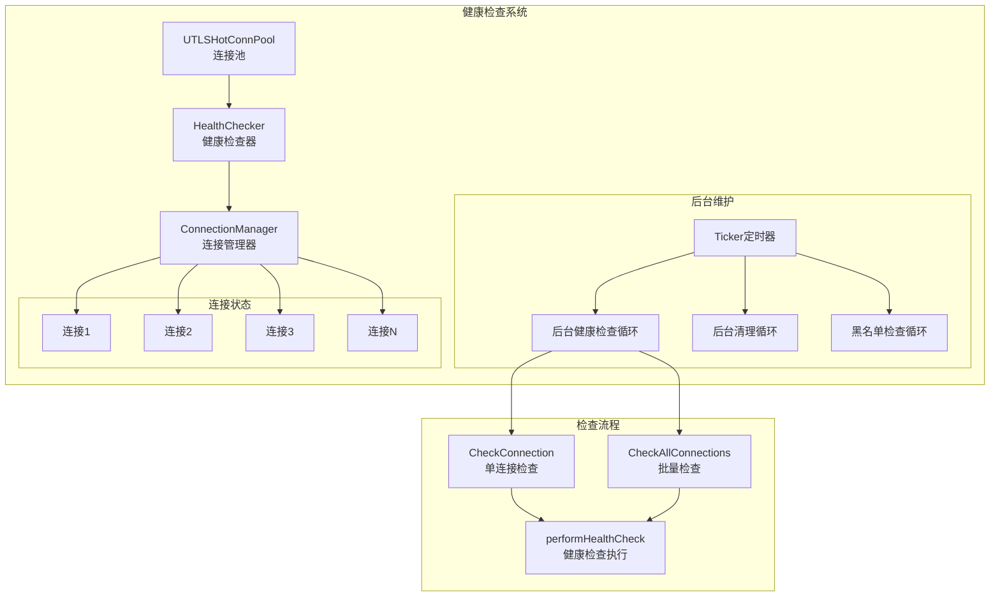

**架构图来源**
- [health_checker.go](file://utlsclient/health_checker.go#L9-L20)
- [connection_manager.go](file://utlsclient/connection_manager.go#L8-L14)
- [utlshotconnpool.go](file://utlsclient/utlshotconnpool.go#L237-L242)

### 核心职责

健康检查器承担以下核心职责：

1. **连接状态监控**：实时跟踪连接的健康状态
2. **定期健康检查**：按照配置的时间间隔执行健康验证
3. **错误计数管理**：监控连接的错误发生频率
4. **连接生命周期管理**：处理连接的创建、使用和销毁
5. **批量健康扫描**：定期扫描整个连接池的健康状态

## 核心组件分析

### HealthChecker 结构体

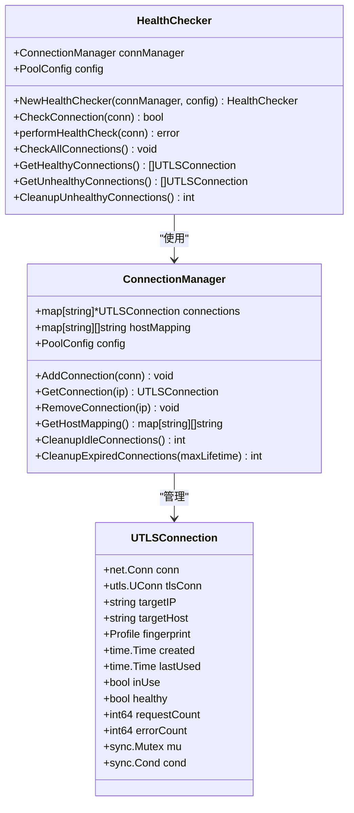

**类图来源**
- [health_checker.go](file://utlsclient/health_checker.go#L10-L13)
- [connection_manager.go](file://utlsclient/connection_manager.go#L9-L13)
- [utlshotconnpool.go](file://utlsclient/utlshotconnpool.go#L205-L234)

### 连接状态模型

连接的健康状态由多个维度决定：

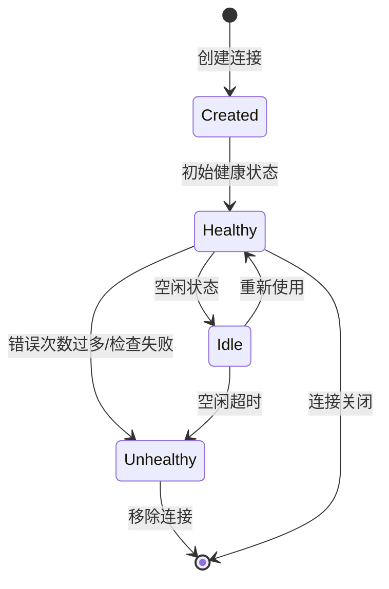

**状态图来源**
- [health_checker.go](file://utlsclient/health_checker.go#L24-L61)

**节来源**
- [health_checker.go](file://utlsclient/health_checker.go#L9-L20)
- [connection_manager.go](file://utlsclient/connection_manager.go#L8-L22)

## 健康检查算法详解

### CheckConnection 方法实现

CheckConnection 方法是健康检查的核心算法，采用多层检查策略：

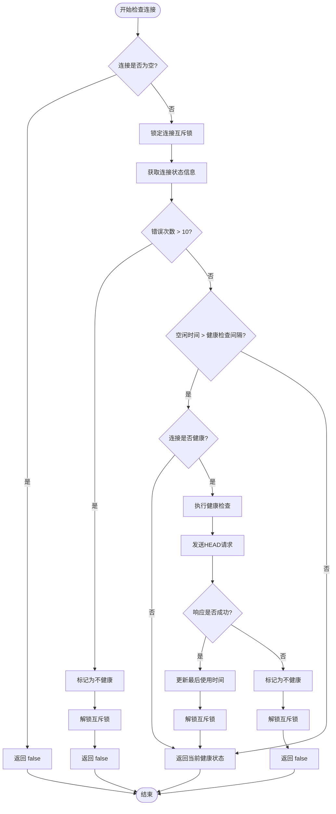

**流程图来源**
- [health_checker.go](file://utlsclient/health_checker.go#L24-L61)

### performHealthCheck 方法详解

performHealthCheck 方法执行实际的健康检查操作：

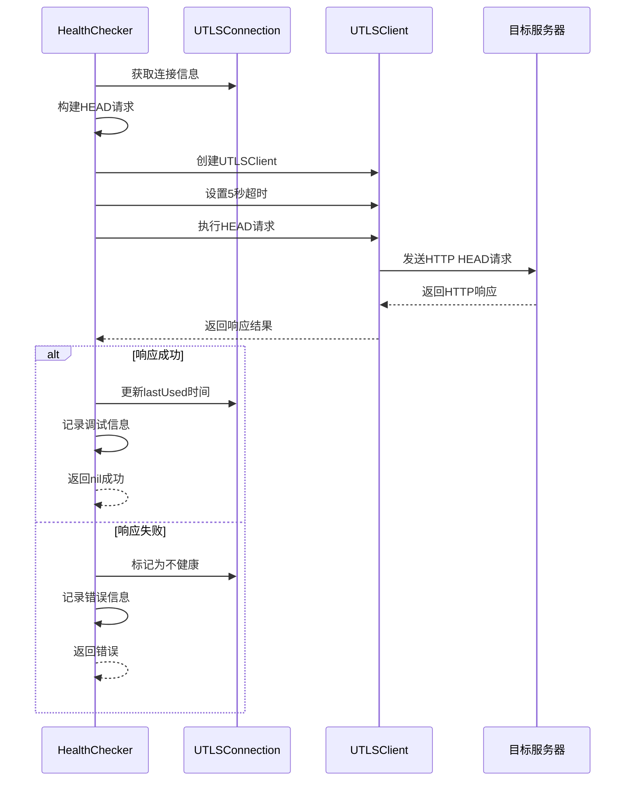

**序列图来源**
- [health_checker.go](file://utlsclient/health_checker.go#L63-L88)

### 错误处理机制

健康检查系统实现了完善的错误处理机制：

| 错误类型 | 处理策略 | 触发条件 | 后续动作 |
|---------|---------|---------|---------|
| 连接超时 | 标记不健康 | 健康检查超时 | 移除连接 |
| 网络错误 | 标记不健康 | 连接中断 | 移除连接 |
| HTTP错误 | 标记不健康 | 响应状态码异常 | 移除连接 |
| 错误累积 | 强制标记 | 错误次数 > 10 | 立即移除 |
| 空闲超时 | 执行检查 | 空闲时间 > 配置间隔 | 执行健康检查 |

**节来源**
- [health_checker.go](file://utlsclient/health_checker.go#L24-L88)

## 后台维护机制

### 定时检查循环

健康检查系统通过后台goroutine实现周期性的健康检查：

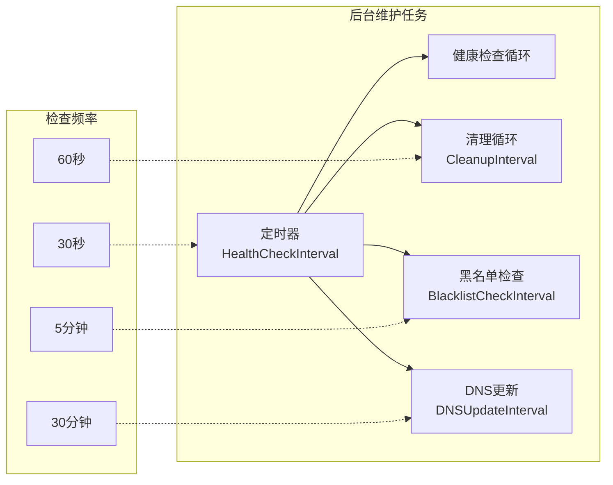

**图表来源**
- [utlshotconnpool.go](file://utlsclient/utlshotconnpool.go#L831-L842)
- [utlshotconnpool.go](file://utlsclient/utlshotconnpool.go#L845-L858)

### 后台任务启动

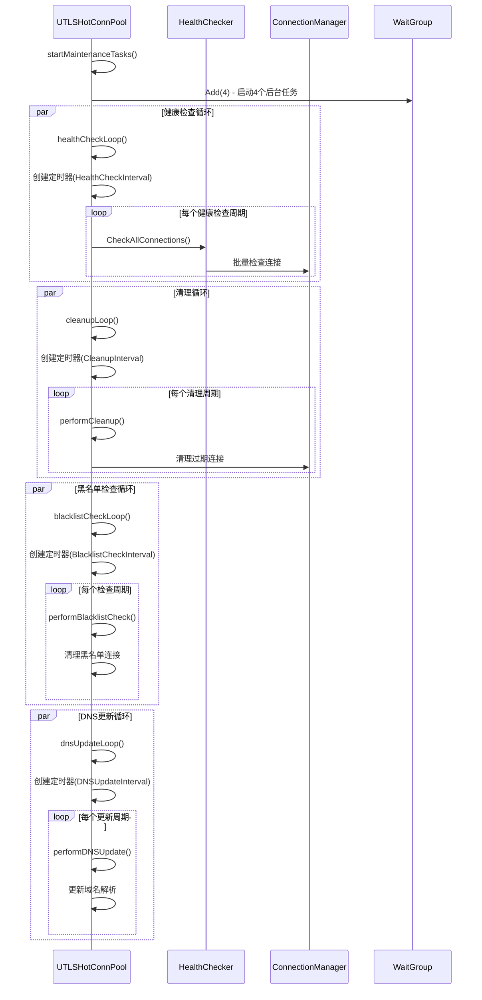

**序列图来源**
- [utlshotconnpool.go](file://utlsclient/utlshotconnpool.go#L315-L318)
- [utlshotconnpool.go](file://utlsclient/utlshotconnpool.go#L808-L842)

**节来源**
- [utlshotconnpool.go](file://utlsclient/utlshotconnpool.go#L808-L842)
- [utlshotconnpool.go](file://utlsclient/utlshotconnpool.go#L845-L858)

## 配置参数详解

### 健康检查间隔配置

HealthCheckInterval 是健康检查机制的核心配置参数：

| 配置项 | 默认值 | 单位 | 说明 | 影响因素 |
|-------|-------|------|------|---------|
| HealthCheckInterval | 30秒 | 秒 | 连接空闲检查间隔 | 性能vs准确性权衡 |
| TestTimeout | 10秒 | 秒 | 健康检查请求超时 | 网络环境稳定性 |
| MaxErrorCount | 10 | 次 | 最大错误容忍次数 | 连接稳定性要求 |

### 配置参数对系统的影响

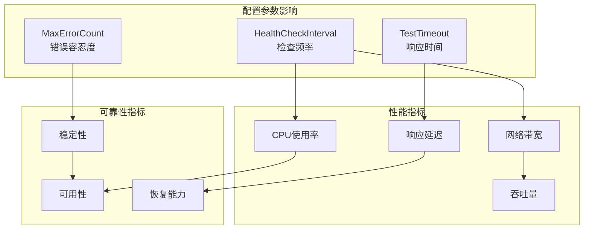

**图表来源**
- [utlshotconnpool.go](file://utlsclient/utlshotconnpool.go#L178-L184)
- [constants.go](file://utlsclient/constants.go#L38-L45)

### 默认配置分析

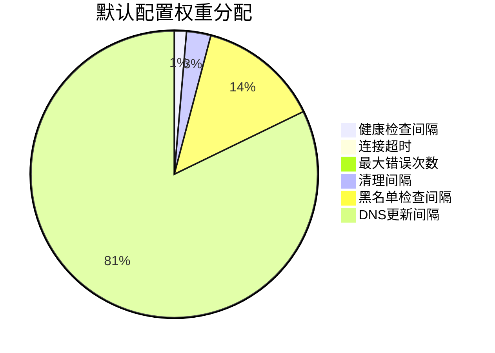

**饼图来源**
- [utlshotconnpool.go](file://utlsclient/utlshotconnpool.go#L187-L201)

**节来源**
- [utlshotconnpool.go](file://utlsclient/utlshotconnpool.go#L178-L201)
- [constants.go](file://utlsclient/constants.go#L38-L45)

## 性能优化策略

### 检查频率与系统开销平衡

健康检查系统采用多种策略来平衡检查频率与系统开销：

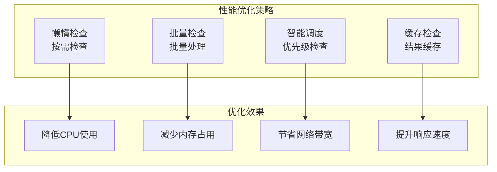

### 连接池性能关系分析

健康检查机制与连接池整体性能存在密切关系：

| 性能指标 | 健康检查影响 | 优化建议 | 预期效果 |
|---------|-------------|---------|---------|
| 连接可用率 | 直接影响 | 适当降低检查频率 | 提升可用性 |
| 平均响应时间 | 间接影响 | 优化检查算法 | 减少延迟 |
| CPU使用率 | 直接影响 | 实施智能调度 | 降低负载 |
| 内存占用 | 间接影响 | 优化数据结构 | 减少内存 |
| 并发处理能力 | 直接影响 | 异步检查处理 | 提升吞吐 |

### 内存管理优化

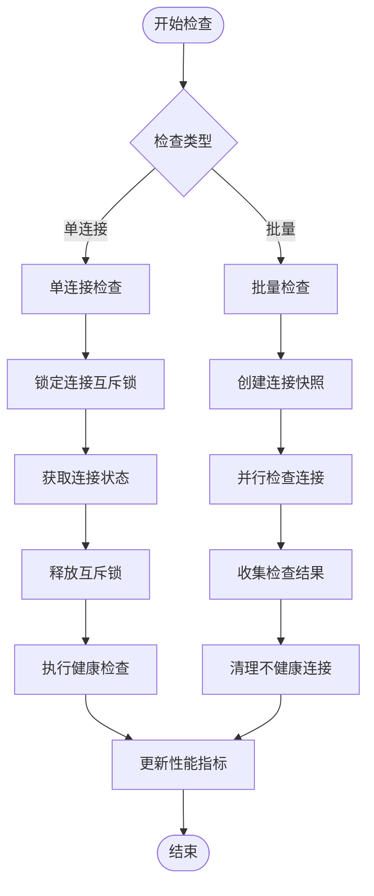

**流程图来源**
- [health_checker.go](file://utlsclient/health_checker.go#L91-L112)

**节来源**
- [health_checker.go](file://utlsclient/health_checker.go#L91-L165)

## 故障处理机制

### 健康检查失败处理流程

当健康检查失败时，系统采用分级处理策略：

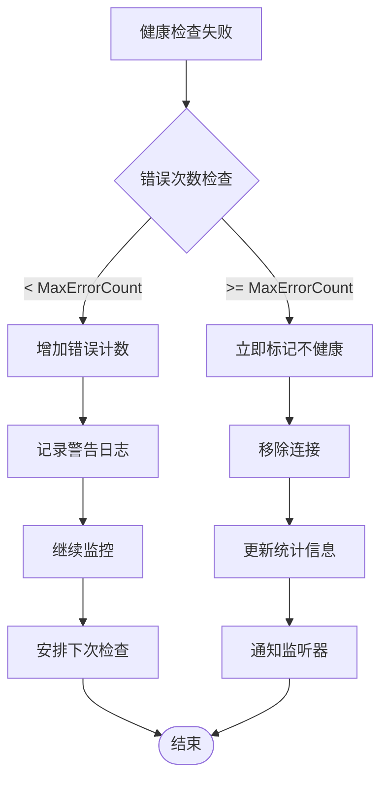

**流程图来源**
- [health_checker.go](file://utlsclient/health_checker.go#L36-L56)

### 连接移除机制

连接从连接池中移除的过程包含多个步骤：

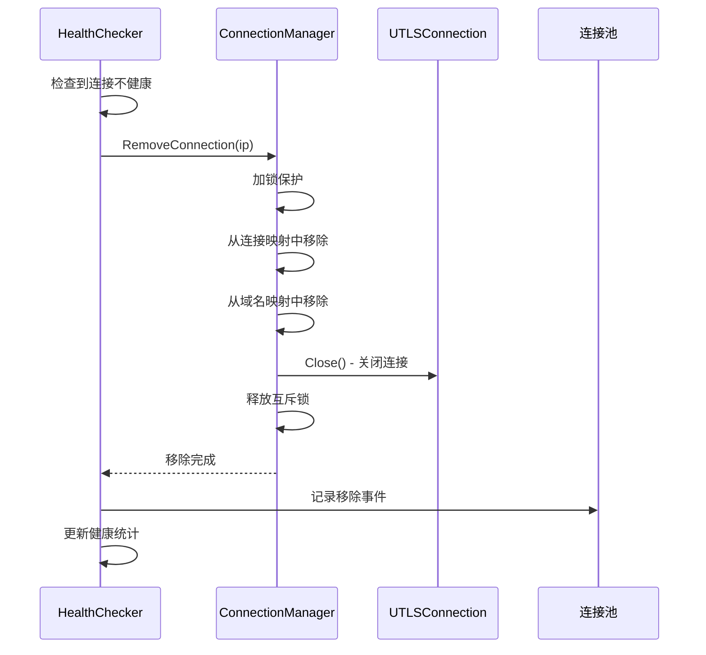

**序列图来源**
- [connection_manager.go](file://utlsclient/connection_manager.go#L49-L73)

### 错误恢复策略

系统提供多种错误恢复机制：

| 恢复策略 | 触发条件 | 恢复时间 | 成功率 | 适用场景 |
|---------|---------|---------|--------|---------|
| 自动重试 | 网络临时故障 | 1-5秒 | 80-90% | 短暂网络波动 |
| 连接重建 | 连接断开 | 10-30秒 | 70-85% | 连接失效 |
| IP切换 | 单点故障 | 5-15秒 | 60-80% | 服务器不可用 |
| 降级服务 | 系统过载 | 30-60秒 | 50-70% | 资源不足 |

**节来源**
- [health_checker.go](file://utlsclient/health_checker.go#L36-L56)
- [connection_manager.go](file://utlsclient/connection_manager.go#L49-L73)

## 监控与统计

### 健康检查统计指标

健康检查系统提供丰富的监控指标：

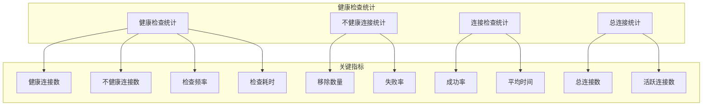

### 实时监控接口

健康检查器提供了多个监控接口：

| 接口方法 | 功能描述 | 返回类型 | 使用场景 |
|---------|---------|---------|---------|
| GetHealthyConnections() | 获取健康连接列表 | []*UTLSConnection | 健康连接查询 |
| GetUnhealthyConnections() | 获取不健康连接列表 | []*UTLSConnection | 故障诊断 |
| CleanupUnhealthyConnections() | 清理不健康连接 | int | 批量清理 |
| CheckConnection(conn) | 检查单个连接 | bool | 单点检查 |

### 性能监控指标

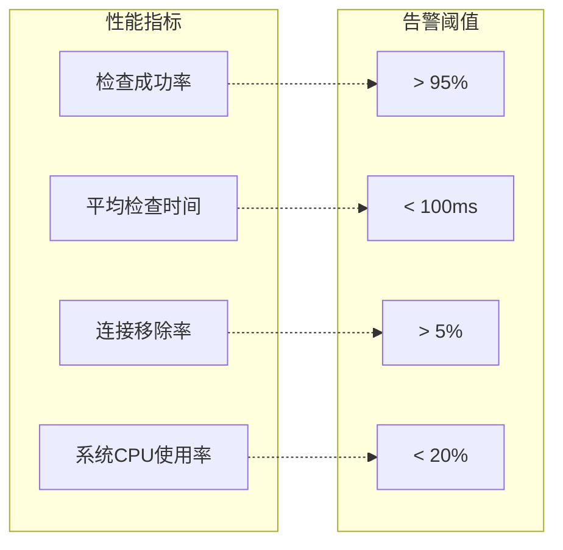

**节来源**
- [health_checker.go](file://utlsclient/health_checker.go#L114-L165)

## 最佳实践指南

### 健康检查配置建议

根据不同应用场景，推荐以下配置策略：

#### 高性能场景（高频低延迟）
```go
// 推荐配置
HealthCheckInterval: 10 * time.Second    // 快速检查
TestTimeout: 5 * time.Second            // 短超时
MaxErrorCount: 5                        // 低容忍度
```

#### 稳定性优先场景
```go
// 推荐配置
HealthCheckInterval: 60 * time.Second   // 缓慢检查
TestTimeout: 15 * time.Second           // 长超时
MaxErrorCount: 15                       // 高容忍度
```

#### 中等平衡场景
```go
// 推荐配置
HealthCheckInterval: 30 * time.Second   // 中等检查
TestTimeout: 10 * time.Second           // 标准超时
MaxErrorCount: 10                       // 标准容忍度
```

### 监控告警设置

建议设置以下监控告警：

| 监控指标 | 告警阈值 | 告警级别 | 处理建议 |
|---------|---------|---------|---------|
| 健康连接比例 | < 80% | 警告 | 检查网络和服务器状态 |
| 不健康连接比例 | > 10% | 严重 | 立即排查故障原因 |
| 健康检查失败率 | > 5% | 警告 | 优化检查策略 |
| 连接移除频率 | > 1连接/分钟 | 严重 | 检查服务器稳定性 |

### 故障排查流程

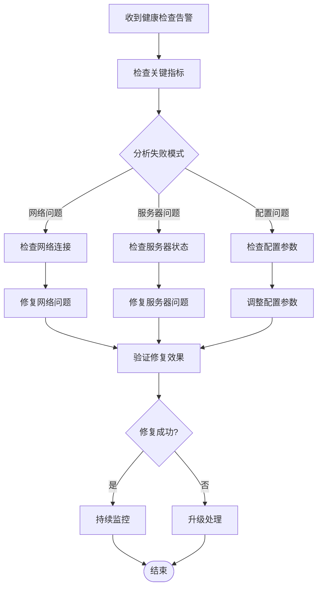

### 性能调优建议

1. **合理设置检查间隔**：根据应用特点调整 HealthCheckInterval
2. **优化超时配置**：平衡响应时间和检查准确性
3. **实施智能调度**：优先检查高优先级连接
4. **启用结果缓存**：减少重复检查开销
5. **监控系统资源**：避免健康检查成为性能瓶颈

### 容错设计原则

健康检查系统应遵循以下容错设计原则：

- **渐进式降级**：逐步降低检查频率而非完全停止
- **快速失败**：及时识别和处理故障连接
- **优雅降级**：在部分功能不可用时保持基本服务
- **自愈能力**：自动恢复临时性故障
- **人工干预**：提供手动干预和紧急处理机制

通过以上最佳实践，可以构建一个高效、可靠且易于维护的健康检查系统，为热连接池的整体性能提供坚实保障。