# 健康检查策略

<cite>
**本文档引用的文件**
- [health_checker.go](file://utlsclient/health_checker.go)
- [connection_manager.go](file://utlsclient/connection_manager.go)
- [constants.go](file://utlsclient/constants.go)
- [interfaces.go](file://utlsclient/interfaces.go)
- [utlshotconnpool.go](file://utlsclient/utlshotconnpool.go)
- [connection_validator.go](file://utlsclient/connection_validator.go)
- [config.go](file://config/config.go)
- [config.toml](file://config/config.toml)
- [test_helpers.go](file://utlsclient/test_helpers.go)
- [example_hotconnpool_usage.go](file://examples/utlsclient/example_hotconnpool_usage.go)
</cite>

## 目录
1. [简介](#简介)
2. [健康检查架构概览](#健康检查架构概览)
3. [CheckConnection方法深度分析](#checkconnection方法深度分析)
4. [HealthCheckInterval配置机制](#healthcheckinterval配置机制)
5. [错误计数阈值设计](#错误计数阈值设计)
6. [连接健康状态评估](#连接健康状态评估)
7. [健康检查策略优化](#健康检查策略优化)
8. [实际应用示例](#实际应用示例)
9. [性能影响分析](#性能影响分析)
10. [故障排除指南](#故障排除指南)
11. [总结](#总结)

## 简介

健康检查策略是UTLS热连接池系统中的核心组件，负责监控和维护连接的健康状态。该策略通过综合评估连接的最后使用时间、错误计数和空闲时间等关键指标，确保连接池始终维持高质量的连接资源。本文档将深入分析健康检查策略的实现逻辑，探讨其设计原理和优化机制。

## 健康检查架构概览

健康检查系统采用分层架构设计，主要包含以下核心组件：

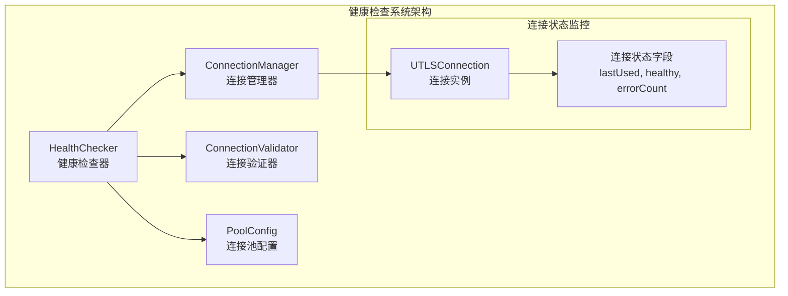

**图表来源**
- [health_checker.go](file://utlsclient/health_checker.go#L9-L13)
- [connection_manager.go](file://utlsclient/connection_manager.go#L8-L13)
- [utlshotconnpool.go](file://utlsclient/utlshotconnpool.go#L170-L183)

**章节来源**
- [health_checker.go](file://utlsclient/health_checker.go#L1-L165)
- [connection_manager.go](file://utlsclient/connection_manager.go#L1-L218)

## CheckConnection方法深度分析

`CheckConnection`方法是健康检查策略的核心入口，它实现了复杂的连接健康状态评估逻辑。

### 方法执行流程

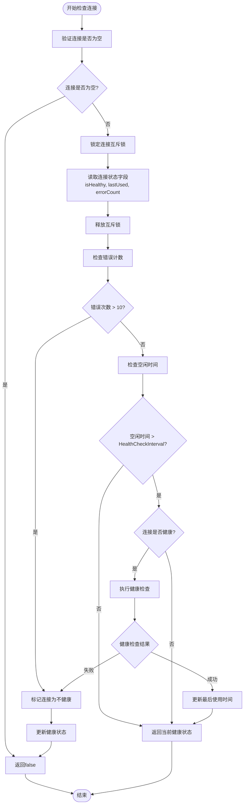

**图表来源**
- [health_checker.go](file://utlsclient/health_checker.go#L24-L60)

### 关键实现细节

1. **并发安全保护**：使用互斥锁确保连接状态读取的一致性
2. **多维度评估**：同时考虑错误计数、空闲时间和当前健康状态
3. **快速失败机制**：在检测到严重问题时立即标记连接为不健康
4. **状态更新原子性**：确保健康状态变更的线程安全

**章节来源**
- [health_checker.go](file://utlsclient/health_checker.go#L24-L60)

## HealthCheckInterval配置机制

`HealthCheckInterval`配置项是健康检查策略的时间控制核心，决定了连接健康检查的触发频率。

### 配置参数详解

| 配置项 | 类型 | 默认值 | 作用 |
|--------|------|--------|------|
| HealthCheckInterval | time.Duration | 30秒 | 健康检查触发间隔 |
| ConnTimeout | time.Duration | 30秒 | 连接建立超时 |
| IdleTimeout | time.Duration | 60秒 | 连接空闲超时 |
| TestTimeout | time.Duration | 10秒 | 健康检查超时 |

### 时间计算逻辑

健康检查的触发条件基于以下公式：
```
time.Since(lastUsed) > HealthCheckInterval
```

这意味着当连接的空闲时间超过配置的健康检查间隔时，才会触发健康检查。

### 配置影响分析

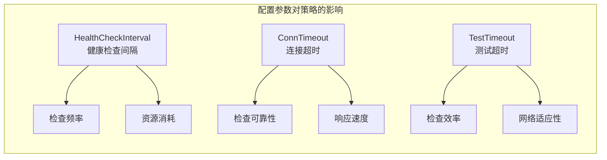

**图表来源**
- [utlshotconnpool.go](file://utlsclient/utlshotconnpool.go#L179)
- [config.toml](file://config/config.toml#L18-L25)

**章节来源**
- [utlshotconnpool.go](file://utlsclient/utlshotconnpool.go#L179-L183)
- [config.toml](file://config/config.toml#L18-L25)

## 错误计数阈值设计

错误计数阈值设计是健康检查策略的重要组成部分，通过设定合理的阈值来平衡连接的可靠性和系统的响应速度。

### 阈值设定原理

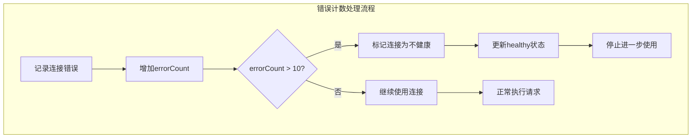

**图表来源**
- [health_checker.go](file://utlsclient/health_checker.go#L36-L44)

### 阈值设计考量因素

1. **系统稳定性**：防止因少量错误导致连接被过早移除
2. **恢复能力**：给予连接足够的时间来恢复正常的网络环境
3. **资源利用**：避免过多的健康检查开销
4. **用户体验**：确保用户请求的稳定性和响应速度

### 阈值优化策略

| 场景 | 推荐阈值 | 原因 |
|------|----------|------|
| 高质量网络环境 | 10-15 | 网络稳定，可容忍更多错误 |
| 中等网络环境 | 5-8 | 平衡稳定性和响应速度 |
| 不稳定网络环境 | 2-5 | 快速识别和移除问题连接 |

**章节来源**
- [health_checker.go](file://utlsclient/health_checker.go#L36-L44)
- [constants.go](file://utlsclient/constants.go#L48-L56)

## 连接健康状态评估

连接健康状态的评估是一个多维度的综合判断过程，涉及多个关键指标的协同工作。

### 健康状态字段

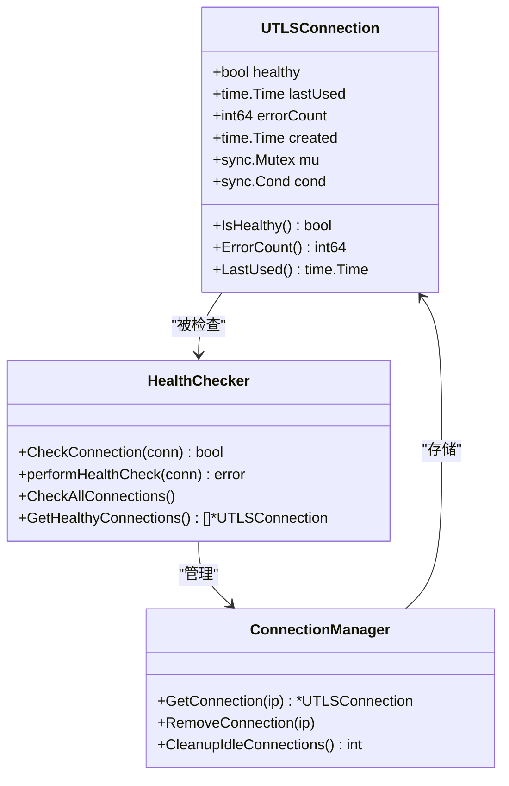

**图表来源**
- [health_checker.go](file://utlsclient/health_checker.go#L24-L60)
- [connection_manager.go](file://utlsclient/connection_manager.go#L42-L47)

### 状态评估算法

健康状态的最终判定遵循以下优先级规则：

1. **错误计数优先**：如果错误次数超过阈值，直接标记为不健康
2. **空闲时间检查**：只有在连接健康的情况下才进行健康检查
3. **实时验证**：使用HEAD请求验证连接的可用性
4. **状态同步**：确保所有线程看到一致的健康状态

### 健康检查请求流程

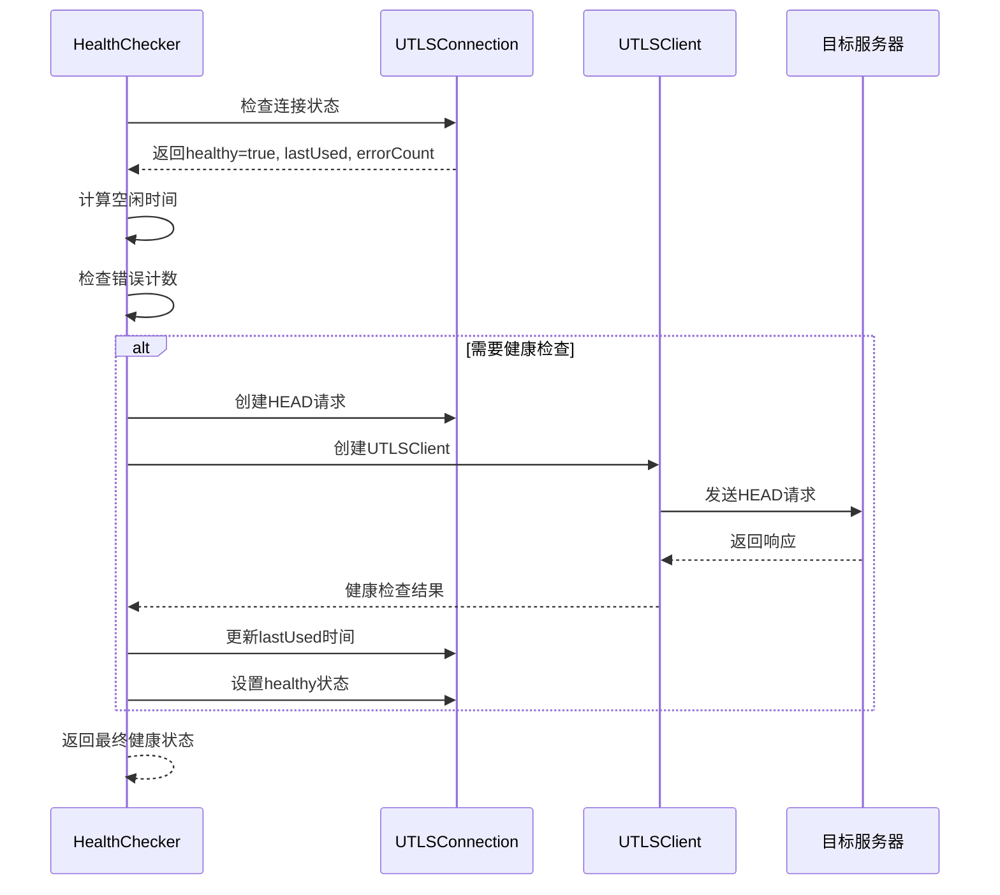

**图表来源**
- [health_checker.go](file://utlsclient/health_checker.go#L64-L88)
- [connection_validator.go](file://utlsclient/connection_validator.go#L42-L96)

**章节来源**
- [health_checker.go](file://utlsclient/health_checker.go#L24-L60)
- [connection_validator.go](file://utlsclient/connection_validator.go#L42-L96)

## 健康检查策略优化

健康检查策略通过多种优化机制来平衡连接验证的准确性和系统性能开销。

### 性能优化策略

1. **智能检查触发**：仅在连接空闲时间超过阈值时才执行健康检查
2. **快速失败机制**：在检测到明显问题时立即停止检查
3. **并发控制**：使用互斥锁确保状态一致性而不阻塞正常请求
4. **缓存友好设计**：减少不必要的状态读取操作

### 资源消耗控制

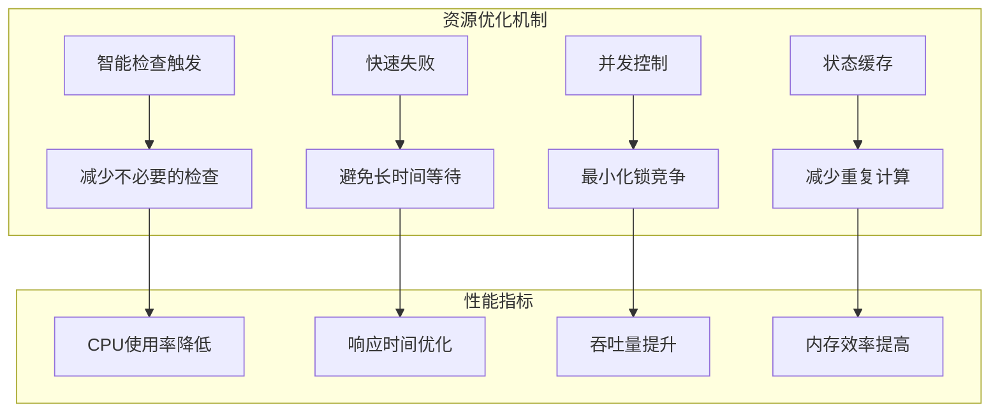

### 动态调整机制

健康检查策略支持运行时动态调整配置参数，包括：

- **HealthCheckInterval**：根据网络状况动态调整检查频率
- **ConnTimeout**：适应不同的网络延迟环境
- **TestTimeout**：平衡检查质量和响应速度

**章节来源**
- [health_checker.go](file://utlsclient/health_checker.go#L46-L58)
- [connection_validator.go](file://utlsclient/connection_validator.go#L241-L262)

## 实际应用示例

以下是健康检查策略在实际场景中的应用示例，展示了策略决策过程的具体实现。

### 基础健康检查示例

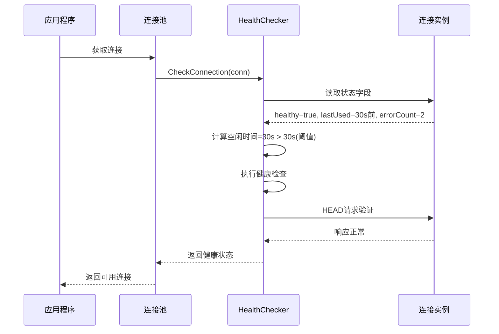

**图表来源**
- [example_hotconnpool_usage.go](file://examples/utlsclient/example_hotconnpool_usage.go#L46-L116)

### 批量健康检查示例

健康检查器提供了批量检查功能，用于定期维护连接池的健康状态：

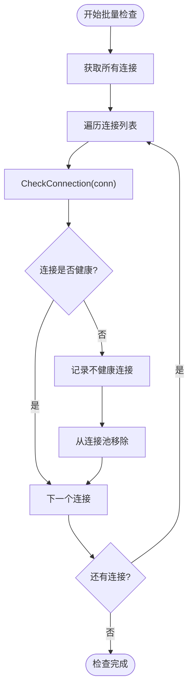

**图表来源**
- [health_checker.go](file://utlsclient/health_checker.go#L91-L112)

### 连接清理策略

当发现不健康连接时，系统会自动执行清理操作：

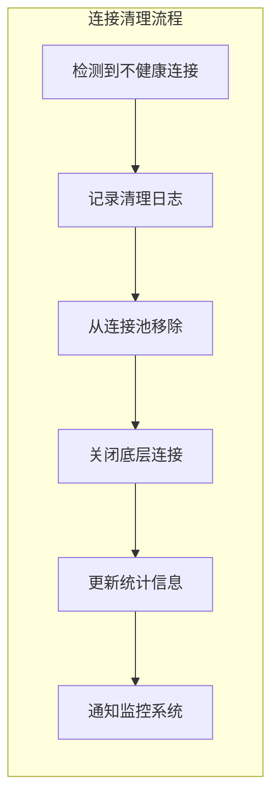

**章节来源**
- [health_checker.go](file://utlsclient/health_checker.go#L91-L165)
- [example_hotconnpool_usage.go](file://examples/utlsclient/example_hotconnpool_usage.go#L46-L116)

## 性能影响分析

健康检查策略的设计充分考虑了性能影响，通过多种机制来最小化对系统整体性能的干扰。

### 性能开销评估

| 检查类型 | CPU开销 | 内存开销 | 网络开销 | 影响程度 |
|----------|---------|----------|----------|----------|
| 状态读取 | 极低 | 极低 | 无 | 微不足道 |
| 错误计数检查 | 低 | 低 | 无 | 可忽略 |
| 健康检查请求 | 中等 | 中等 | 有 | 可控制 |
| 批量检查 | 高 | 中等 | 有 | 可调节 |

### 性能优化建议

1. **合理设置检查间隔**：避免过于频繁的健康检查
2. **选择合适的超时时间**：平衡检查质量和响应速度
3. **监控检查频率**：根据系统负载动态调整
4. **使用异步检查**：避免阻塞主线程

### 性能监控指标

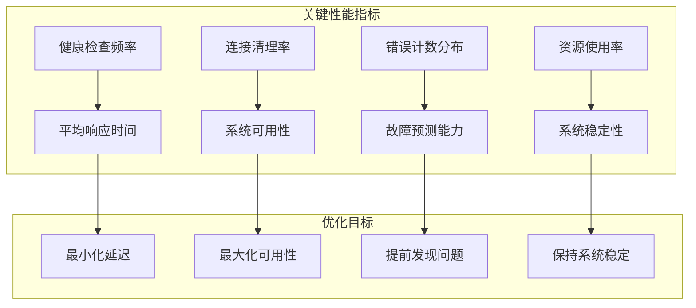

**章节来源**
- [health_checker.go](file://utlsclient/health_checker.go#L46-L58)
- [connection_validator.go](file://utlsclient/connection_validator.go#L241-L262)

## 故障排除指南

健康检查策略可能遇到的各种问题及其解决方案。

### 常见问题诊断

| 问题症状 | 可能原因 | 诊断方法 | 解决方案 |
|----------|----------|----------|----------|
| 连接频繁被移除 | HealthCheckInterval设置过短 | 检查配置参数 | 增加检查间隔 |
| 健康检查失败率高 | 网络不稳定或目标服务器问题 | 分析错误日志 | 调整超时设置 |
| 性能下降 | 健康检查过于频繁 | 监控检查频率 | 优化检查策略 |
| 内存占用过高 | 连接清理不及时 | 检查清理机制 | 调整清理策略 |

### 调试技巧

1. **启用详细日志**：设置调试级别以获取详细的检查过程信息
2. **监控连接状态**：实时跟踪连接的健康状态变化
3. **分析错误模式**：识别常见的错误类型和模式
4. **压力测试**：在高负载下测试健康检查策略的效果

### 配置优化建议

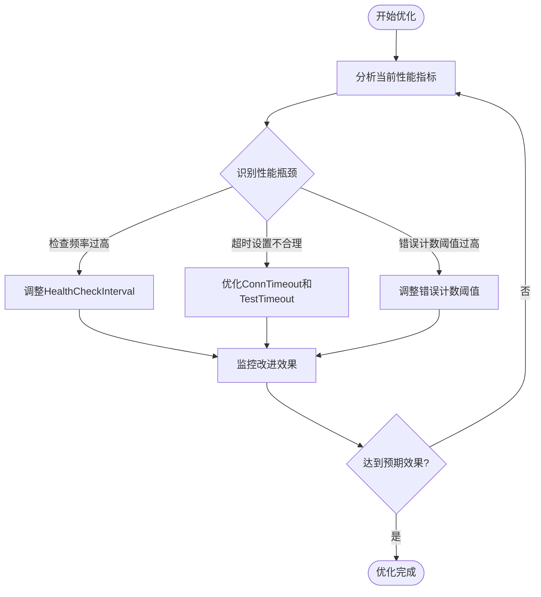

**章节来源**
- [health_checker.go](file://utlsclient/health_checker.go#L39-L40)
- [connection_validator.go](file://utlsclient/connection_validator.go#L78-L80)

## 总结

健康检查策略是UTLS热连接池系统中不可或缺的核心组件，通过精心设计的多维度评估机制，实现了连接健康状态的精确监控和有效维护。

### 关键设计原则

1. **全面性**：综合考虑连接的使用时间、错误历史和当前状态
2. **高效性**：通过智能触发和快速失败机制最小化性能开销
3. **可靠性**：采用多重验证和冗余检查确保判断准确性
4. **可调性**：支持运行时配置调整以适应不同环境需求

### 技术创新点

- **智能检查触发**：基于空闲时间的动态检查策略
- **错误计数阈值**：合理的阈值设计平衡了稳定性和响应速度
- **并发安全**：完善的锁机制确保多线程环境下的数据一致性
- **批量处理**：高效的批量健康检查机制

### 应用价值

健康检查策略不仅保证了连接池的高质量运行，还为系统的稳定性和可靠性提供了重要保障。通过持续的优化和调整，该策略能够适应不断变化的网络环境和业务需求，为用户提供优质的连接服务体验。