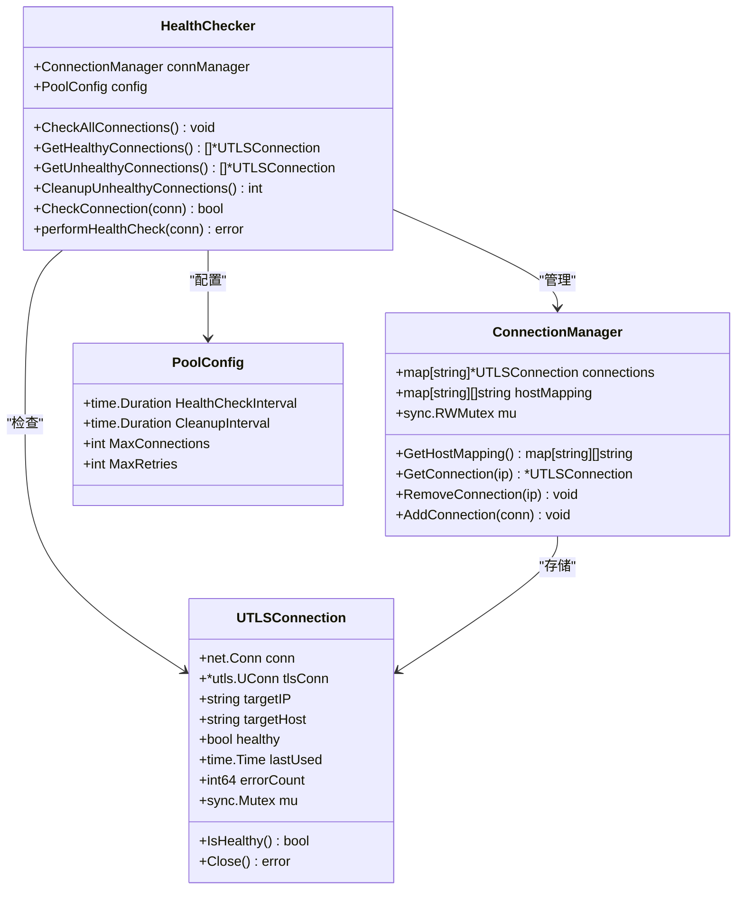
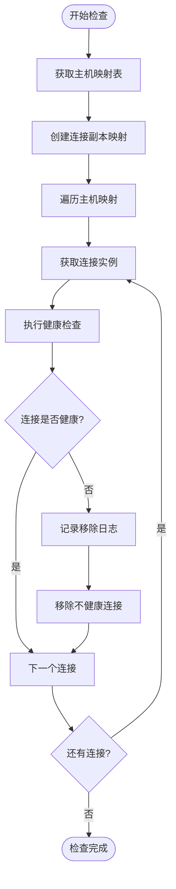
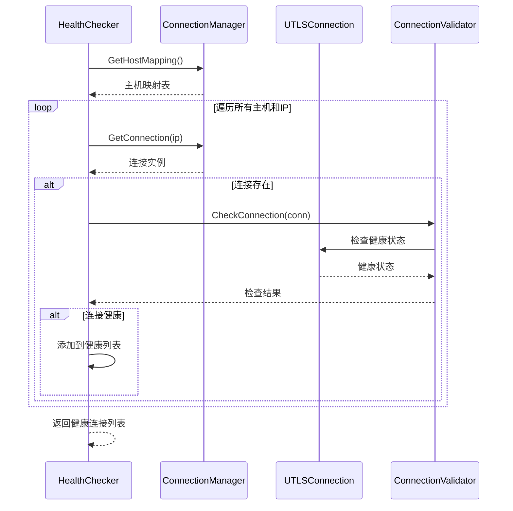
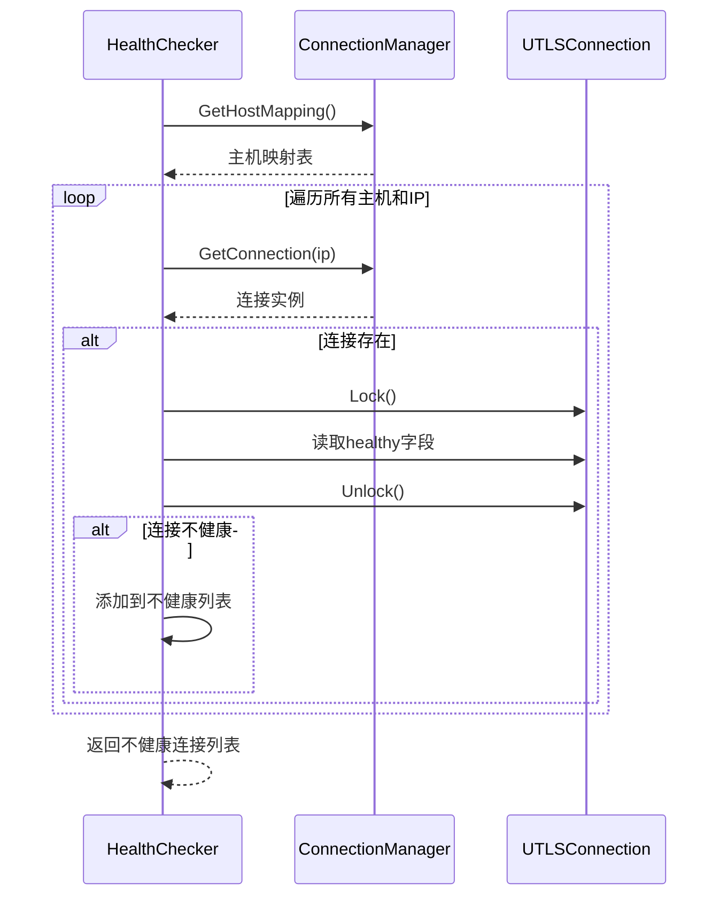
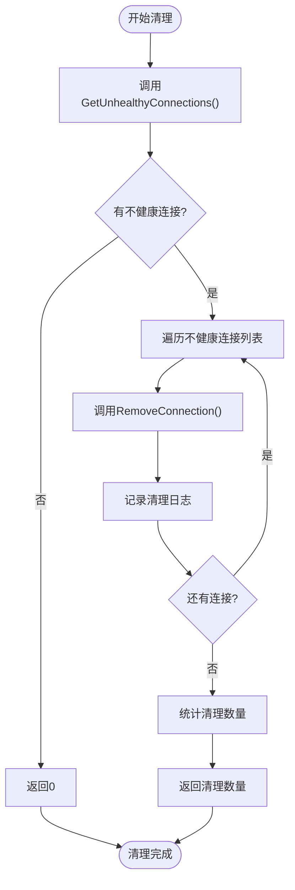
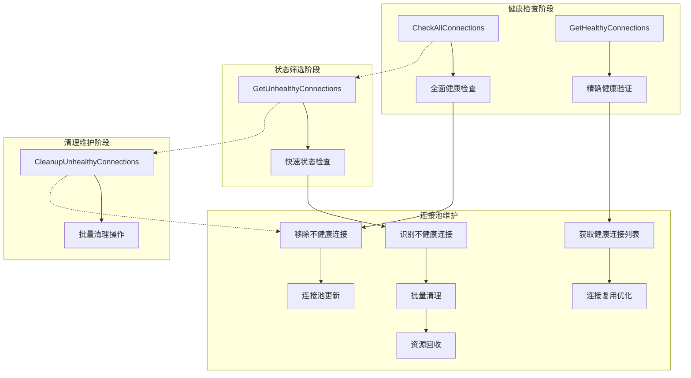
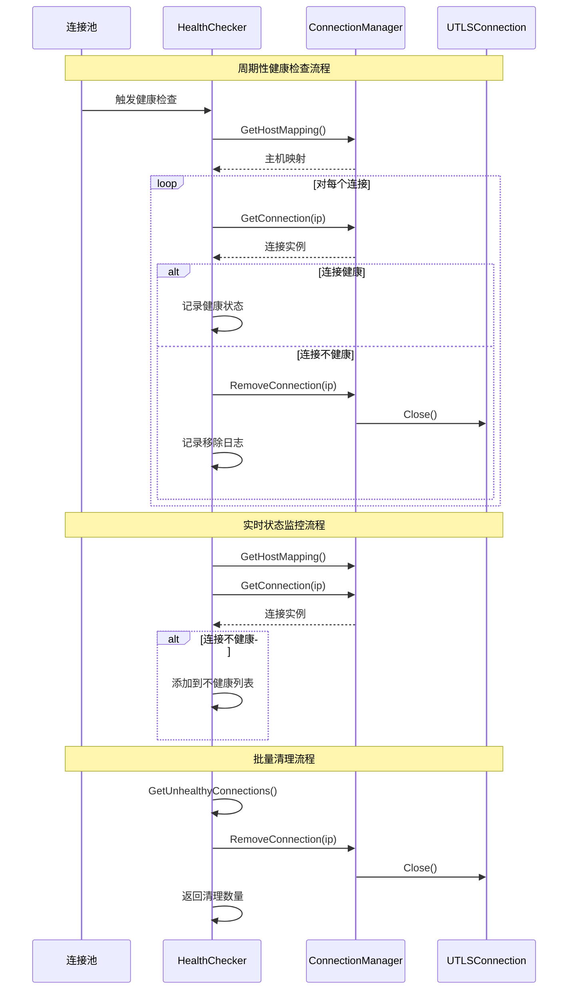
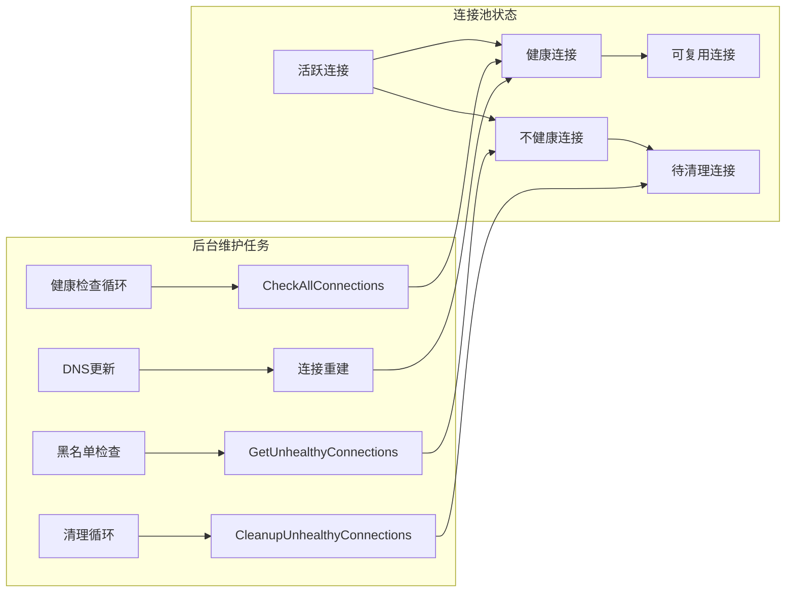
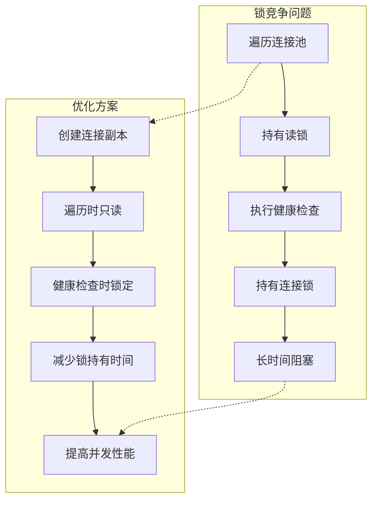
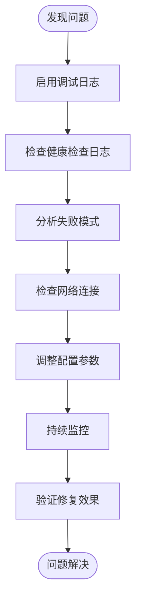

# 批量健康检查操作

<cite>
**本文档中引用的文件**
- [health_checker.go](file://utlsclient/health_checker.go)
- [connection_manager.go](file://utlsclient/connection_manager.go)
- [connection_validator.go](file://utlsclient/connection_validator.go)
- [utlshotconnpool.go](file://utlsclient/utlshotconnpool.go)
- [interfaces.go](file://utlsclient/interfaces.go)
- [utlsclient.go](file://utlsclient/utlsclient.go)
</cite>

## 目录
1. [简介](#简介)
2. [核心架构概览](#核心架构概览)
3. [CheckAllConnections方法详解](#checkallconnections方法详解)
4. [GetHealthyConnections与GetUnhealthyConnections方法对比](#getherhealthyconnections与getherunhealthyconnections方法对比)
5. [CleanupUnhealthyConnections方法分析](#cleanupunhealthyconnections方法分析)
6. [批量操作协同工作流程](#批量操作协同工作流程)
7. [连接池维护中的应用](#连接池维护中的应用)
8. [性能优化考虑](#性能优化考虑)
9. [故障排除指南](#故障排除指南)
10. [总结](#总结)

## 简介

批量健康检查操作是热连接池（UTLSHotConnPool）中连接维护的核心功能之一。这些操作通过HealthChecker组件实现，负责定期检查连接池中所有连接的健康状态，并根据检查结果执行相应的维护操作。本文档详细分析了四个关键方法的实现原理、设计差异和性能特征。

## 核心架构概览

健康检查系统采用分层架构设计，主要包含以下核心组件：

**图表来源**
- [health_checker.go](file://utlsclient/health_checker.go#L9-L13)
- [connection_manager.go](file://utlsclient/connection_manager.go#L8-L14)
- [utlshotconnpool.go](file://utlsclient/utlshotconnpool.go#L204-L233)

**章节来源**
- [health_checker.go](file://utlsclient/health_checker.go#L1-L165)
- [connection_manager.go](file://utlsclient/connection_manager.go#L1-L218)

## CheckAllConnections方法详解

CheckAllConnections方法实现了全面的连接健康检查机制，是连接池维护的基础操作。

### 方法实现流程

**图表来源**
- [health_checker.go](file://utlsclient/health_checker.go#L91-L111)

### 关键实现特点

1. **连接副本获取**：使用`make(map[string]*UTLSConnection)`创建连接的独立副本，避免在遍历过程中持有锁
2. **全面检查策略**：对每个连接执行完整的健康检查流程
3. **即时清理**：发现不健康连接立即从连接池中移除

### 性能特征

- **时间复杂度**：O(n)，其中n为连接池中的连接数量
- **空间复杂度**：O(n)，需要额外存储连接副本
- **线程安全性**：通过创建副本避免遍历过程中的锁竞争

**章节来源**
- [health_checker.go](file://utlsclient/health_checker.go#L91-L111)

## GetHealthyConnections与GetUnhealthyConnections方法对比

这两个方法虽然都用于获取连接列表，但采用了完全不同的实现策略，体现了不同的设计考量。

### GetHealthyConnections实现分析

**图表来源**
- [health_checker.go](file://utlsclient/health_checker.go#L114-L129)
- [connection_validator.go](file://utlsclient/connection_validator.go#L22-L39)

### GetUnhealthyConnections实现分析

**图表来源**
- [health_checker.go](file://utlsclient/health_checker.go#L132-L151)

### 实现差异对比表

| 特征 | GetHealthyConnections | GetUnhealthyConnections |
|------|----------------------|------------------------|
| **检查方式** | 调用CheckConnection进行完整验证 | 直接检查healthy标记 |
| **锁持有时间** | 在CheckConnection中短暂持有 | 仅在读取healthy字段时持有 |
| **准确性** | 高，执行实际健康检查 | 中等，依赖当前标记状态 |
| **性能开销** | 较高，涉及网络请求 | 较低，仅内存操作 |
| **适用场景** | 需要精确健康状态时 | 快速筛选不健康连接 |

### 设计考量

- **GetHealthyConnections**：适用于需要确保连接质量的场景，如连接复用前的验证
- **GetUnhealthyConnections**：适用于快速清理不健康连接的场景，追求性能效率

**章节来源**
- [health_checker.go](file://utlsclient/health_checker.go#L114-L163)

## CleanupUnhealthyConnections方法分析

CleanupUnhealthyConnections方法实现了批量清理不健康连接的功能，是连接池维护的重要组成部分。

### 方法执行流程

**图表来源**
- [health_checker.go](file://utlsclient/health_checker.go#L154-L163)

### 关键特性分析

1. **组合式设计**：复用GetUnhealthyConnections方法获取连接列表
2. **批量操作**：一次性清理多个不健康连接
3. **统计反馈**：返回实际清理的连接数量
4. **日志记录**：每条连接的清理都有详细日志

### 性能优化点

- **延迟检查**：通过GetUnhealthyConnections的延迟检查机制减少不必要的网络请求
- **批量处理**：避免单个连接的频繁清理操作
- **资源释放**：及时关闭连接并释放相关资源

**章节来源**
- [health_checker.go](file://utlsclient/health_checker.go#L154-L163)

## 批量操作协同工作流程

四个健康检查方法形成了完整的连接维护流水线，每个方法都有特定的职责和优化策略。

### 协同工作流程图

**图表来源**
- [health_checker.go](file://utlsclient/health_checker.go#L91-L163)

### 工作流程详解

1. **定期检查**：通过CheckAllConnections进行周期性全面检查
2. **状态监控**：使用GetUnhealthyConnections进行实时状态监控
3. **批量清理**：通过CleanupUnhealthyConnections执行维护操作
4. **连接复用**：GetHealthyConnections为连接复用提供健康连接列表

### 数据流分析

**图表来源**
- [health_checker.go](file://utlsclient/health_checker.go#L91-L163)
- [connection_manager.go](file://utlsclient/connection_manager.go#L49-L73)

**章节来源**
- [health_checker.go](file://utlsclient/health_checker.go#L91-L163)

## 连接池维护中的应用

批量健康检查操作在连接池的日常维护中发挥着关键作用，支持连接池的周期性健康检查任务。

### 维护任务集成

**图表来源**
- [utlshotconnpool.go](file://utlsclient/utlshotconnpool.go#L850-L890)

### 配置参数影响

| 配置参数 | 默认值 | 影响范围 | 优化建议 |
|----------|--------|----------|----------|
| **HealthCheckInterval** | 30秒 | 全面检查频率 | 根据网络稳定性调整 |
| **CleanupInterval** | 60秒 | 清理频率 | 平衡性能与资源占用 |
| **MaxErrorCount** | 10次 | 错误阈值 | 根据业务需求设置 |
| **IdleTimeout** | 60秒 | 空闲超时 | 考虑网络延迟因素 |

### 自动化维护流程

1. **定时触发**：通过时间轮询机制自动触发健康检查
2. **智能决策**：根据连接状态自动决定维护策略
3. **资源优化**：动态调整连接池大小和维护频率
4. **监控告警**：记录维护活动并提供性能指标

**章节来源**
- [utlshotconnpool.go](file://utlsclient/utlshotconnpool.go#L850-L890)
- [utlshotconnpool.go](file://utlsclient/utlshotconnpool.go#L170-L184)

## 性能优化考虑

批量健康检查操作的设计充分考虑了性能优化，特别是在避免锁竞争和减少网络开销方面。

### 锁竞争避免策略

**图表来源**
- [health_checker.go](file://utlsclient/health_checker.go#L91-L111)

### 性能优化技术

1. **连接副本缓存**
   - 在遍历前创建连接的独立副本
   - 避免在遍历过程中持有连接池锁
   - 减少锁竞争和死锁风险

2. **延迟检查机制**
   - GetUnhealthyConnections仅检查标记状态
   - 避免不必要的网络请求
   - 提高实时监控性能

3. **批量操作优化**
   - CleanupUnhealthyConnections合并清理操作
   - 减少系统调用次数
   - 提高整体处理效率

4. **超时控制**
   - 健康检查使用较短超时（5秒）
   - 防止长时间阻塞
   - 提高响应速度

### 性能监控指标

| 指标名称 | 监控目的 | 正常范围 | 异常处理 |
|----------|----------|----------|----------|
| **检查耗时** | 健康检查性能 | < 1秒 | 调整检查频率 |
| **清理数量** | 维护效果 | 0-连接总数 | 分析连接质量 |
| **错误率** | 连接稳定性 | < 5% | 检查网络状况 |
| **并发性能** | 锁竞争程度 | 高并发响应 | 优化锁策略 |

**章节来源**
- [health_checker.go](file://utlsclient/health_checker.go#L91-L163)
- [connection_validator.go](file://utlsclient/connection_validator.go#L63-L89)

## 故障排除指南

### 常见问题诊断

1. **健康检查失败**
   - **症状**：大量连接被标记为不健康
   - **原因**：网络不稳定或目标服务器问题
   - **解决方案**：检查网络连接和服务器状态

2. **清理频率过高**
   - **症状**：连接池频繁清理连接
   - **原因**：健康检查过于严格或连接质量差
   - **解决方案**：调整健康检查参数

3. **性能下降**
   - **症状**：健康检查耗时过长
   - **原因**：连接数量过多或网络延迟高
   - **解决方案**：优化检查频率和超时设置

### 调试技巧

### 监控建议

- **日志级别**：使用DEBUG级别记录详细检查过程
- **性能指标**：监控检查耗时和清理数量
- **异常告警**：设置健康检查失败的告警机制
- **定期审计**：定期审查连接池状态和维护效果

**章节来源**
- [health_checker.go](file://utlsclient/health_checker.go#L24-L60)
- [connection_validator.go](file://utlsclient/connection_validator.go#L63-L89)

## 总结

批量健康检查操作是热连接池稳定运行的关键保障机制。通过CheckAllConnections、GetHealthyConnections、GetUnhealthyConnections和CleanupUnhealthyConnections四个核心方法的协同工作，实现了：

1. **全面的连接健康监控**：通过CheckAllConnections提供定期的全面检查
2. **高效的实时状态监控**：通过GetUnhealthyConnections提供快速的状态筛选
3. **及时的连接维护**：通过CleanupUnhealthyConnections实现批量清理
4. **灵活的健康检查策略**：根据不同场景选择合适的检查方法

这些方法的设计充分考虑了性能优化、线程安全和可维护性，为连接池的长期稳定运行提供了坚实的技术保障。在实际应用中，需要根据具体的业务需求和网络环境，合理配置相关参数，以达到最佳的维护效果。