# 连接验证机制

<cite>
**本文档引用的文件**
- [connection_validator.go](file://utlsclient/connection_validator.go)
- [health_checker.go](file://utlsclient/health_checker.go)
- [connection_manager.go](file://utlsclient/connection_manager.go)
- [utlsclient.go](file://utlsclient/utlsclient.go)
- [constants.go](file://utlsclient/constants.go)
- [utlshotconnpool.go](file://utlsclient/utlshotconnpool.go)
- [interfaces.go](file://utlsclient/interfaces.go)
</cite>

## 目录
1. [概述](#概述)
2. [核心组件架构](#核心组件架构)
3. [performHealthCheck方法详解](#performhealthcheck方法详解)
4. [UTLSClient健康检查机制](#utlsclient健康检查机制)
5. [连接验证流程](#连接验证流程)
6. [错误处理机制](#错误处理机制)
7. [协议支持分析](#协议支持分析)
8. [性能优化考虑](#性能优化考虑)
9. [最佳实践建议](#最佳实践建议)

## 概述

连接验证机制是热连接池系统的核心功能之一，负责确保连接的实际可用性和可靠性。该机制通过多种验证策略和健康检查方法，确保连接池中的连接能够正常工作，同时维护系统的整体稳定性和性能。

### 主要功能特性

- **多层级验证**：支持基础健康检查、路径验证、完整URL验证和严格GET验证
- **协议兼容**：全面支持HTTP/1.1和HTTP/2协议
- **智能超时管理**：根据不同验证场景设置合理的超时时间
- **错误恢复机制**：自动处理连接故障并进行状态更新
- **并发安全保障**：使用互斥锁确保线程安全

## 核心组件架构

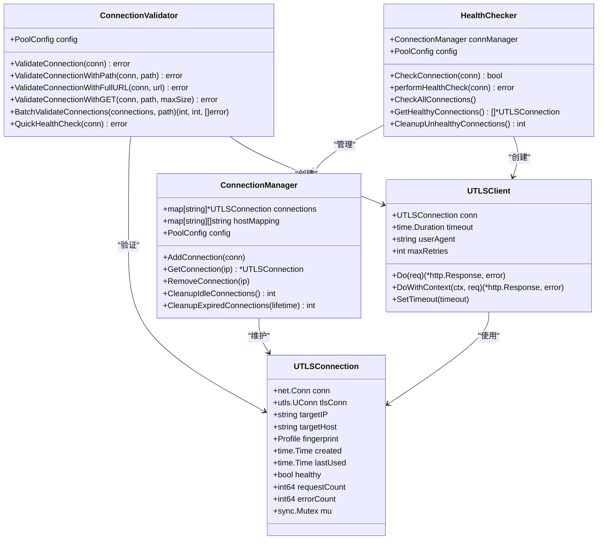

**图表来源**
- [connection_validator.go](file://utlsclient/connection_validator.go#L10-L15)
- [health_checker.go](file://utlsclient/health_checker.go#L9-L14)
- [connection_manager.go](file://utlsclient/connection_manager.go#L8-L15)
- [utlsclient.go](file://utlsclient/utlsclient.go#L37-L43)
- [utlshotconnpool.go](file://utlsclient/utlshotconnpool.go#L204-L233)

## performHealthCheck方法详解

### 方法签名与职责

`performHealthCheck`方法是健康检查机制的核心实现，负责执行实际的连接健康验证。

### 请求构造细节

#### HTTP/1.1协议下的HEAD请求

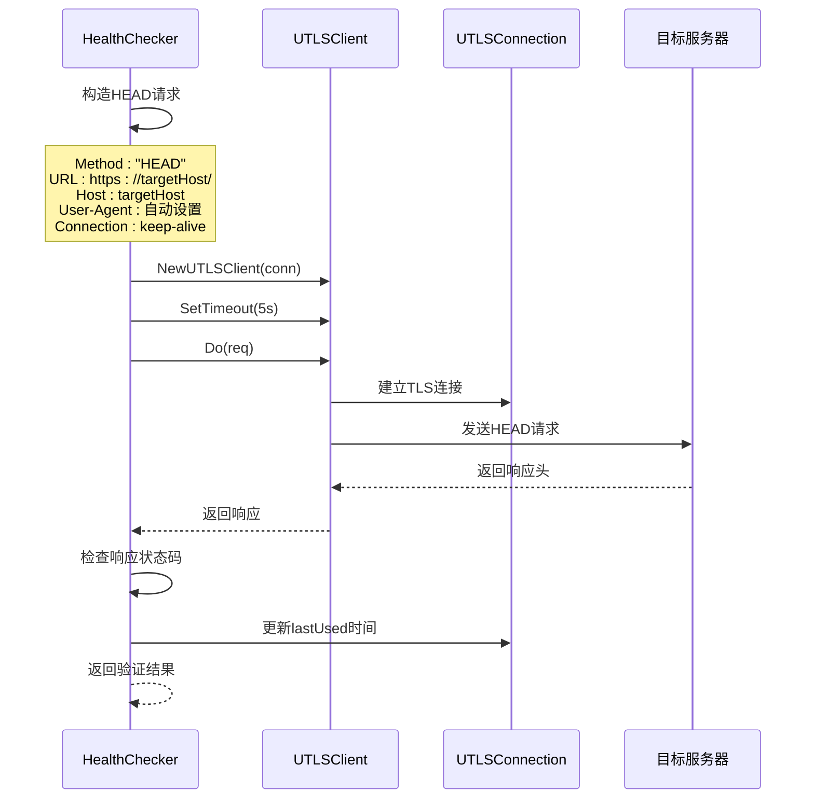

**图表来源**
- [health_checker.go](file://utlsclient/health_checker.go#L66-L88)

#### 请求参数配置

| 参数 | 值 | 说明 |
|------|-----|------|
| HTTP方法 | HEAD | 只获取响应头，减少网络开销 |
| URL路径 | / | 根路径验证，确保基本连通性 |
| Host头 | conn.targetHost | 明确指定目标主机 |
| User-Agent | 自动生成 | 模拟真实浏览器行为 |
| Connection头 | keep-alive | 维持连接复用 |
| 超时时间 | 5秒 | 快速反馈，避免长时间阻塞 |

### 5秒超时设置的合理性

#### 性能考量

1. **快速响应**：5秒超时足够覆盖大多数健康检查场景
2. **及时发现问题**：快速识别不可用连接，避免影响业务
3. **资源释放**：及时释放被阻塞的资源

#### 技术依据

- **网络延迟**：大多数健康检查应在5秒内完成
- **并发控制**：避免大量连接同时等待健康检查
- **用户体验**：确保系统响应速度

**节来源**
- [health_checker.go](file://utlsclient/health_checker.go#L74-L75)

## UTLSClient健康检查机制

### 客户端创建与配置

UTLSClient在健康检查过程中扮演关键角色，它提供了专门的TLS连接能力和协议支持。

#### 客户端初始化流程

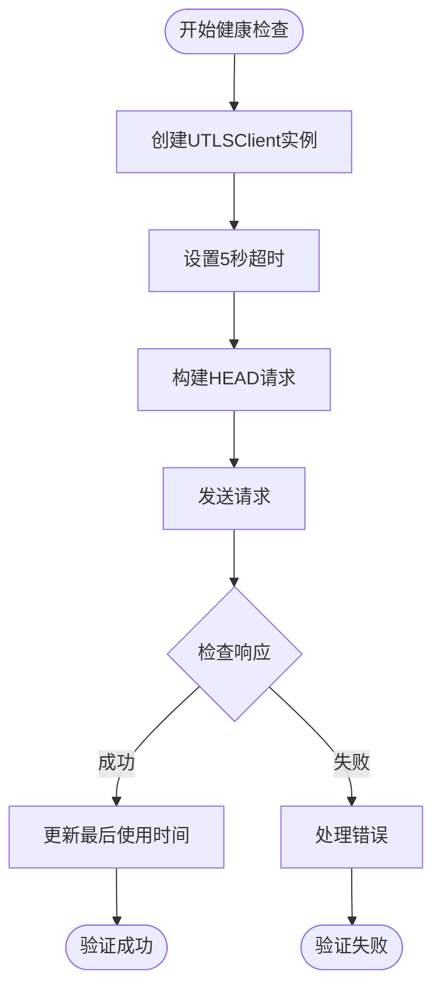

**图表来源**
- [health_checker.go](file://utlsclient/health_checker.go#L73-L88)

### 协议检测与适配

UTLSClient能够自动检测和适配不同的协议版本：

#### HTTP/2协议处理

对于HTTP/2连接，健康检查采用简化验证策略：

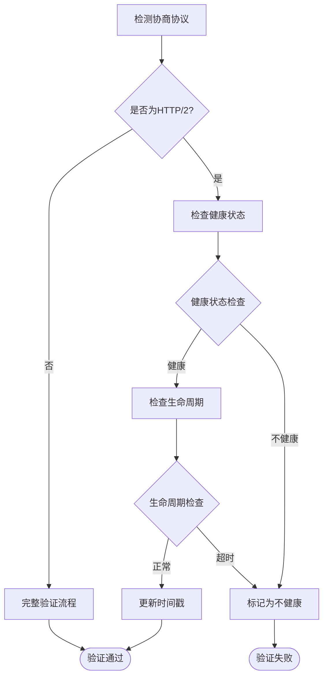

**图表来源**
- [utlsclient.go](file://utlsclient/utlsclient.go#L130-L141)

#### HTTP/1.1协议处理

HTTP/1.1连接采用完整的HEAD请求验证流程，确保连接的完全可用性。

**节来源**
- [utlsclient.go](file://utlsclient/utlsclient.go#L130-L141)

## 连接验证流程

### 多层次验证策略

系统实现了多层次的连接验证机制，根据具体需求选择合适的验证级别。

#### 验证方法对比

| 验证方法 | 适用场景 | 验证强度 | 性能影响 | 资源消耗 |
|----------|----------|----------|----------|----------|
| QuickHealthCheck | 快速状态检查 | 基础状态 | 极低 | 极低 |
| ValidateConnectionWithPath | 路径验证 | 中等 | 低 | 低 |
| ValidateConnectionWithFullURL | URL验证 | 中等 | 中等 | 中等 |
| ValidateConnectionWithGET | 严格验证 | 高 | 高 | 高 |

### 验证成功后的处理

当连接验证成功后，系统会执行以下操作：

1. **更新最后使用时间**：记录连接的最新活跃时间
2. **更新统计信息**：增加请求计数
3. **标记健康状态**：确认连接处于健康状态
4. **日志记录**：记录验证成功的详细信息

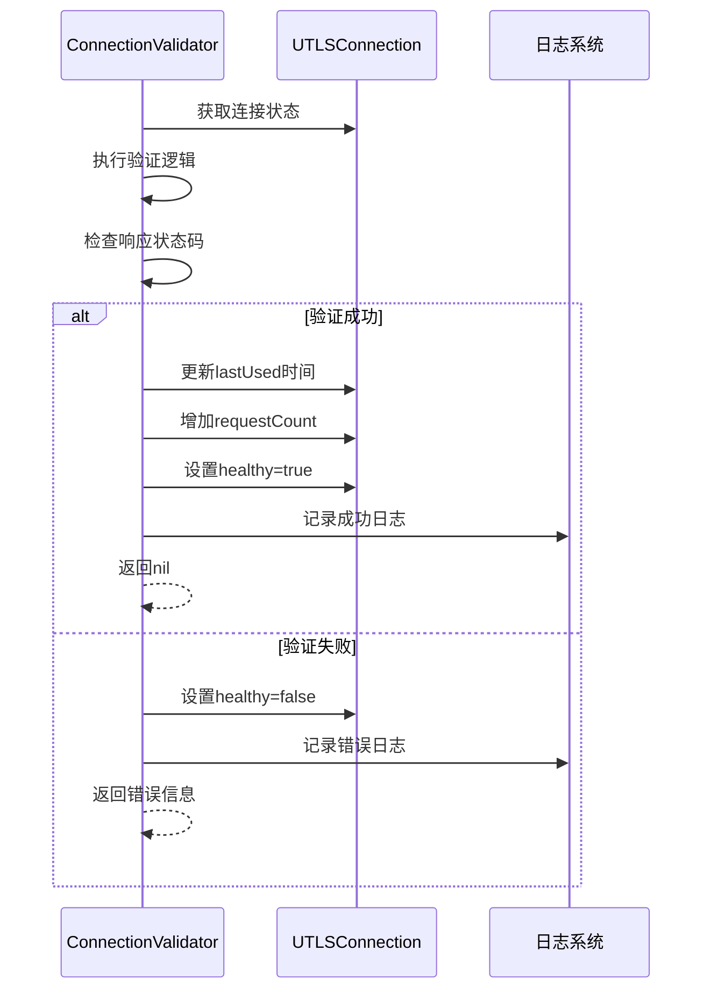

**图表来源**
- [connection_validator.go](file://utlsclient/connection_validator.go#L90-L96)

**节来源**
- [connection_validator.go](file://utlsclient/connection_validator.go#L23-L96)

## 错误处理机制

### 错误分类与处理策略

系统对不同类型的错误采用差异化的处理策略：

#### 连接错误检测

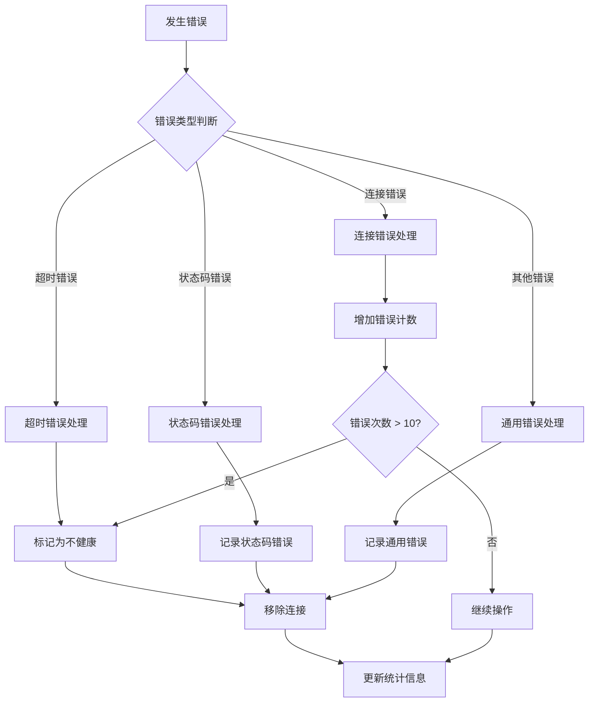

**图表来源**
- [health_checker.go](file://utlsclient/health_checker.go#L36-L44)

#### 错误恢复机制

1. **错误计数监控**：当错误次数超过10次时，自动标记连接为不健康
2. **连接清理**：定期清理不健康的连接
3. **状态重置**：重置连接的健康状态和统计信息

### 日志记录策略

系统采用分级日志记录机制：

- **Debug级别**：记录详细的调试信息
- **Info级别**：记录重要的操作信息
- **Error级别**：记录错误和异常情况

**节来源**
- [health_checker.go](file://utlsclient/health_checker.go#L36-L56)
- [connection_validator.go](file://utlsclient/connection_validator.go#L78-L88)

## 协议支持分析

### HTTP/1.1协议支持

#### 特点与优势

- **广泛兼容性**：几乎所有Web服务器都支持HTTP/1.1
- **简单可靠**：协议设计简单，错误处理容易
- **HEAD请求支持**：完美支持健康检查所需的HEAD请求

#### 实现细节

HTTP/1.1连接的验证通过构建原始HTTP请求实现：

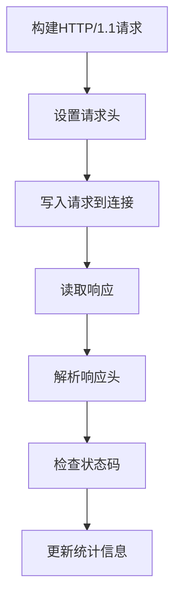

**图表来源**
- [utlsclient.go](file://utlsclient/utlsclient.go#L191-L214)

### HTTP/2协议支持

#### 特点与优势

- **多路复用**：单连接支持多个并发请求
- **头部压缩**：减少网络传输开销
- **服务器推送**：主动推送资源

#### HTTP/2验证策略

HTTP/2连接采用简化的验证策略：

1. **连接状态检查**：验证连接的基本健康状态
2. **生命周期检查**：检查连接是否超过最大生命周期
3. **协议协商验证**：确认HTTP/2协议协商成功

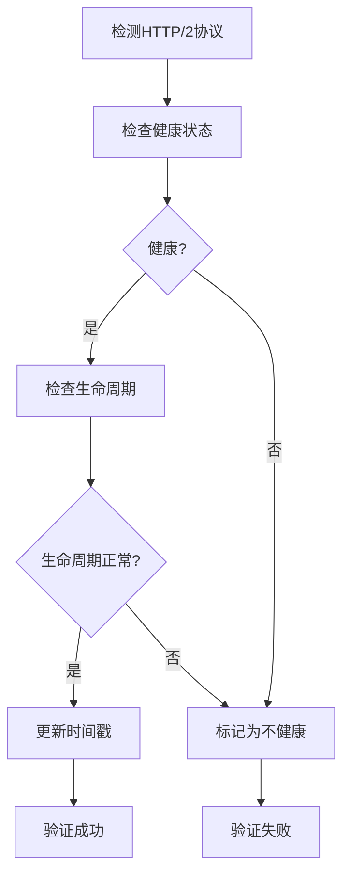

**图表来源**
- [utlsclient.go](file://utlsclient/utlsclient.go#L130-L141)

### 协议切换机制

系统能够自动检测和适应不同的协议版本：

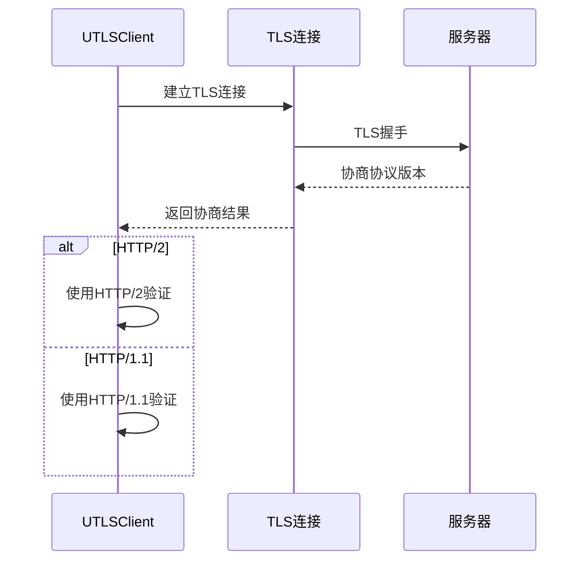

**图表来源**
- [utlsclient.go](file://utlsclient/utlsclient.go#L130-L141)

**节来源**
- [utlsclient.go](file://utlsclient/utlsclient.go#L130-L141)

## 性能优化考虑

### 超时策略优化

#### 分层超时设置

系统采用分层的超时策略：

| 场景 | 超时时间 | 原因 |
|------|----------|------|
| 健康检查 | 5秒 | 快速反馈，及时发现问题 |
| 连接验证 | 10秒 | 平衡性能和可靠性 |
| 请求处理 | 30秒 | 允许复杂请求完成 |

### 并发控制优化

#### 锁机制设计

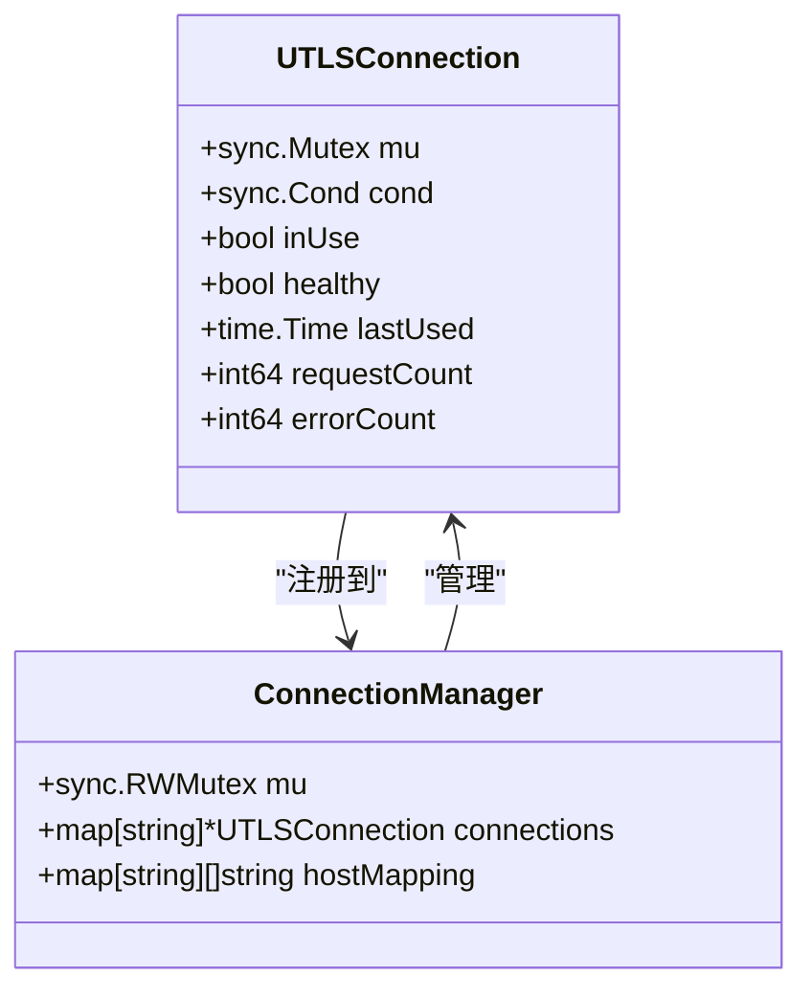

**图表来源**
- [utlsclient.go](file://utlsclient/utlsclient.go#L37-L43)
- [connection_manager.go](file://utlsclient/connection_manager.go#L8-L15)

#### 连接复用优化

1. **条件变量**：使用`sync.Cond`实现高效的连接等待机制
2. **状态同步**：确保连接状态的一致性
3. **资源管理**：避免资源泄漏和竞争条件

### 内存使用优化

#### 对象池化

系统采用对象池化技术减少内存分配：

- **连接复用**：避免频繁创建和销毁连接对象
- **缓冲区复用**：重用网络缓冲区
- **字符串缓存**：缓存常用的字符串常量

**节来源**
- [connection_manager.go](file://utlsclient/connection_manager.go#L8-L15)
- [utlsclient.go](file://utlsclient/utlsclient.go#L37-L43)

## 最佳实践建议

### 配置优化建议

#### 健康检查配置

```go
// 推荐的健康检查配置
config := &PoolConfig{
    HealthCheckInterval: 30 * time.Second,    // 30秒检查一次
    ConnTimeout:         30 * time.Second,     // 连接超时30秒
    TestTimeout:         10 * time.Second,     // 测试超时10秒
    IdleTimeout:         60 * time.Second,     // 空闲超时60秒
}
```

#### 错误处理配置

- **最大错误次数**：建议设置为10次
- **清理间隔**：建议设置为60秒
- **黑名单检查间隔**：建议设置为300秒

### 监控指标建议

#### 关键性能指标

1. **连接健康率**：健康连接数/总连接数
2. **验证成功率**：验证成功的连接数/验证的连接数
3. **平均响应时间**：连接验证的平均耗时
4. **错误分布**：不同类型错误的发生频率

#### 监控告警设置

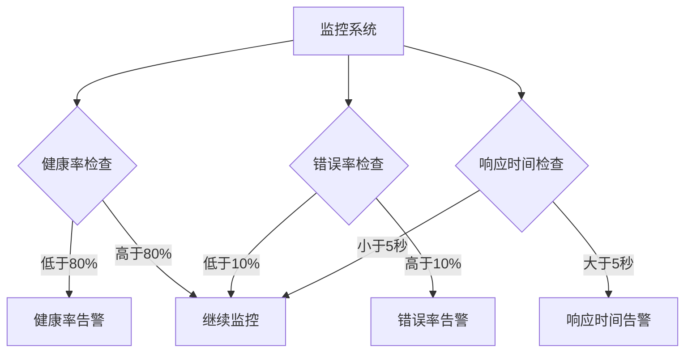

### 故障排查指南

#### 常见问题诊断

1. **连接验证失败**
   - 检查网络连通性
   - 验证目标服务器状态
   - 检查防火墙设置

2. **健康检查超时**
   - 增加健康检查超时时间
   - 检查网络延迟
   - 优化服务器响应

3. **协议协商失败**
   - 检查TLS配置
   - 验证证书有效性
   - 确认协议版本支持

#### 性能调优建议

- **合理设置超时时间**：根据网络环境调整超时参数
- **优化连接池大小**：根据负载情况调整最大连接数
- **定期清理过期连接**：避免资源浪费
- **监控连接统计**：及时发现异常连接

**节来源**
- [constants.go](file://utlsclient/constants.go#L38-L86)
- [utlshotconnpool.go](file://utlsclient/utlshotconnpool.go#L170-L183)