# 热连接池

<cite>
**本文档引用的文件**
- [utlshotconnpool.go](file://utlsclient/utlshotconnpool.go)
- [connection_manager.go](file://utlsclient/connection_manager.go)
- [health_checker.go](file://utlsclient/health_checker.go)
- [connection_validator.go](file://utlsclient/connection_validator.go)
- [ip_access_controller.go](file://utlsclient/ip_access_controller.go)
- [example_hotconnpool_usage.go](file://examples/utlsclient/example_hotconnpool_usage.go)
- [config.go](file://config/config.go)
- [config.toml](file://config/config.toml)
- [utlshotconnpool_test.go](file://test/utlsclient/utlshotconnpool_test.go)
- [reuse_connection_output.txt](file://test/results/archive/reuse_connection_output.txt)
</cite>

## 目录
1. [简介](#简介)
2. [项目结构](#项目结构)
3. [核心组件](#核心组件)
4. [架构概览](#架构概览)
5. [详细组件分析](#详细组件分析)
6. [连接池生命周期管理](#连接池生命周期管理)
7. [性能优化与最佳实践](#性能优化与最佳实践)
8. [故障排除指南](#故障排除指南)
9. [结论](#结论)

## 简介

热连接池（UTLSHotConnPool）是一个高性能的TLS连接池系统，专门设计用于管理uTLS连接的生命周期。该系统通过预建立和复用TLS连接来显著提升网络请求性能，特别适用于需要频繁HTTPS通信的应用场景。

热连接池的核心优势包括：
- **连接复用**：通过HTTP/2和HTTP/1.1协议的Keep-Alive机制实现连接复用
- **智能健康检查**：自动检测和清理不健康的连接
- **并发安全**：采用读写锁和条件变量确保多线程环境下的安全性
- **配置灵活**：支持通过TOML文件进行详细的参数配置
- **白名单/黑名单管理**：提供IP级别的访问控制机制

## 项目结构

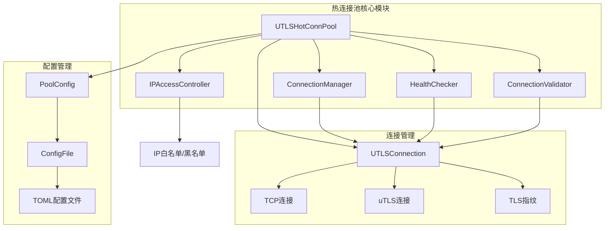

**图表来源**
- [utlshotconnpool.go](file://utlsclient/utlshotconnpool.go#L237-L258)
- [connection_manager.go](file://utlsclient/connection_manager.go#L8-L14)
- [health_checker.go](file://utlsclient/health_checker.go#L9-L13)

**章节来源**
- [utlshotconnpool.go](file://utlsclient/utlshotconnpool.go#L1-L50)
- [config.toml](file://config/config.toml#L1-L38)

## 核心组件

### 热连接池接口（HotConnPool）

热连接池通过`HotConnPool`接口提供统一的访问方式，包含以下核心方法：

| 方法 | 功能描述 | 参数 | 返回值 |
|------|----------|------|--------|
| `GetConnection` | 获取目标主机的热连接 | `targetHost string` | `*UTLSConnection, error` |
| `GetConnectionWithValidation` | 获取并验证指定路径的连接 | `fullURL string` | `*UTLSConnection, error` |
| `PutConnection` | 归还连接到池中 | `conn *UTLSConnection` | `void` |
| `GetStats` | 获取连接池统计信息 | 无 | `PoolStats` |
| `IsHealthy` | 检查连接池健康状态 | 无 | `bool` |
| `Close` | 关闭连接池并清理资源 | 无 | `error` |

### 连接管理器（ConnectionManager）

连接管理器负责连接的生命周期管理，包括添加、移除、查询和清理连接：

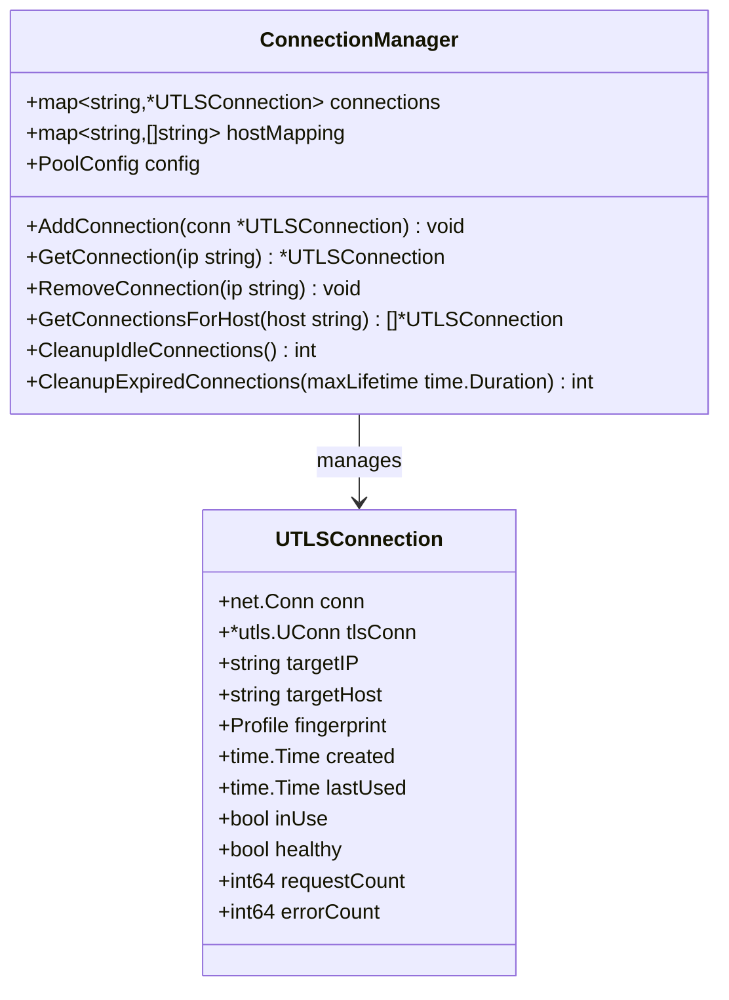

**图表来源**
- [connection_manager.go](file://utlsclient/connection_manager.go#L8-L23)
- [utlshotconnpool.go](file://utlsclient/utlshotconnpool.go#L204-L234)

**章节来源**
- [utlshotconnpool.go](file://utlsclient/utlshotconnpool.go#L24-L51)
- [connection_manager.go](file://utlsclient/connection_manager.go#L1-L218)

## 架构概览

热连接池采用组件化设计，各组件职责明确，通过接口进行松耦合集成：

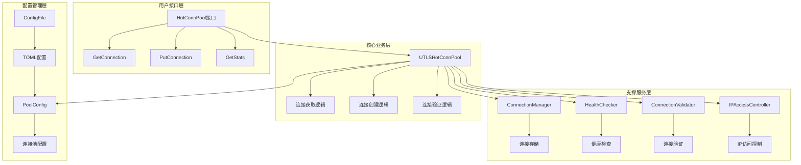

**图表来源**
- [utlshotconnpool.go](file://utlsclient/utlshotconnpool.go#L237-L258)
- [connection_manager.go](file://utlsclient/connection_manager.go#L17-L23)
- [health_checker.go](file://utlsclient/health_checker.go#L16-L20)

## 详细组件分析

### 连接池配置系统

连接池通过分层配置系统提供灵活的参数调整能力：

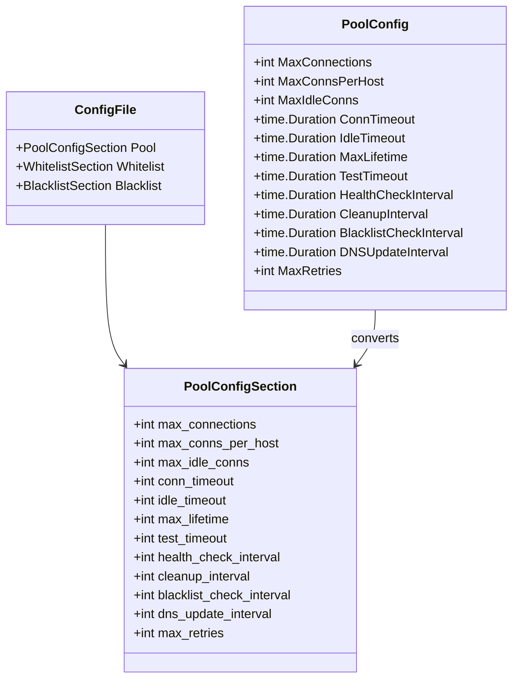

**图表来源**
- [utlshotconnpool.go](file://utlsclient/utlshotconnpool.go#L170-L202)
- [utlshotconnpool.go](file://utlsclient/utlshotconnpool.go#L53-L84)

### 健康检查机制

健康检查器实现了多层次的连接健康监控：

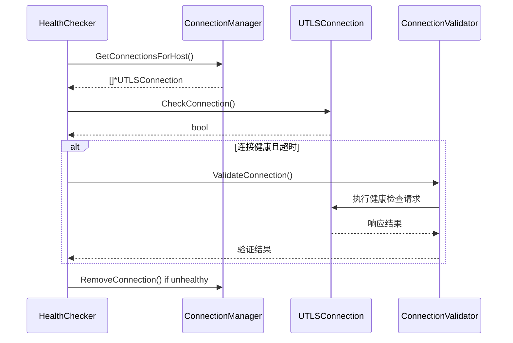

**图表来源**
- [health_checker.go](file://utlsclient/health_checker.go#L23-L61)
- [connection_validator.go](file://utlsclient/connection_validator.go#L22-L39)

### 连接验证流程

连接验证器提供了多种验证级别，从快速健康检查到完整的路径验证：

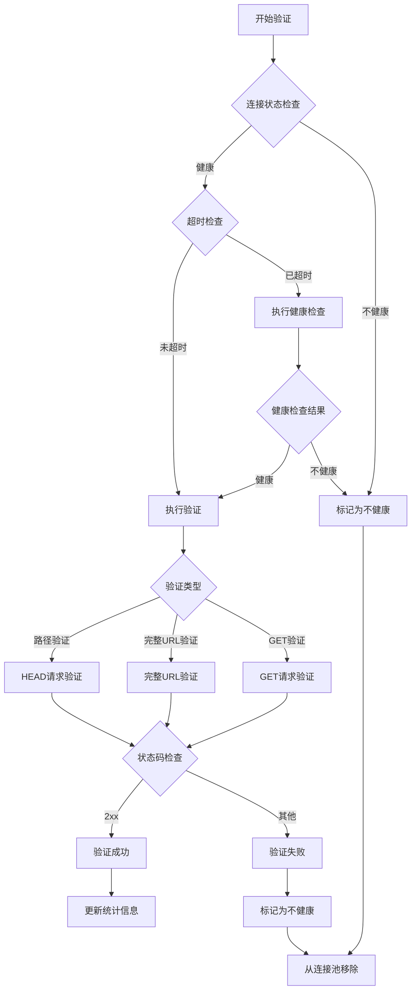

**图表来源**
- [connection_validator.go](file://utlsclient/connection_validator.go#L41-L96)
- [connection_validator.go](file://utlsclient/connection_validator.go#L99-L158)

**章节来源**
- [utlshotconnpool.go](file://utlsclient/utlshotconnpool.go#L53-L202)
- [health_checker.go](file://utlsclient/health_checker.go#L1-L165)
- [connection_validator.go](file://utlsclient/connection_validator.go#L1-L263)

## 连接池生命周期管理

### 连接创建流程

连接创建过程涉及多个步骤，确保连接的质量和性能：

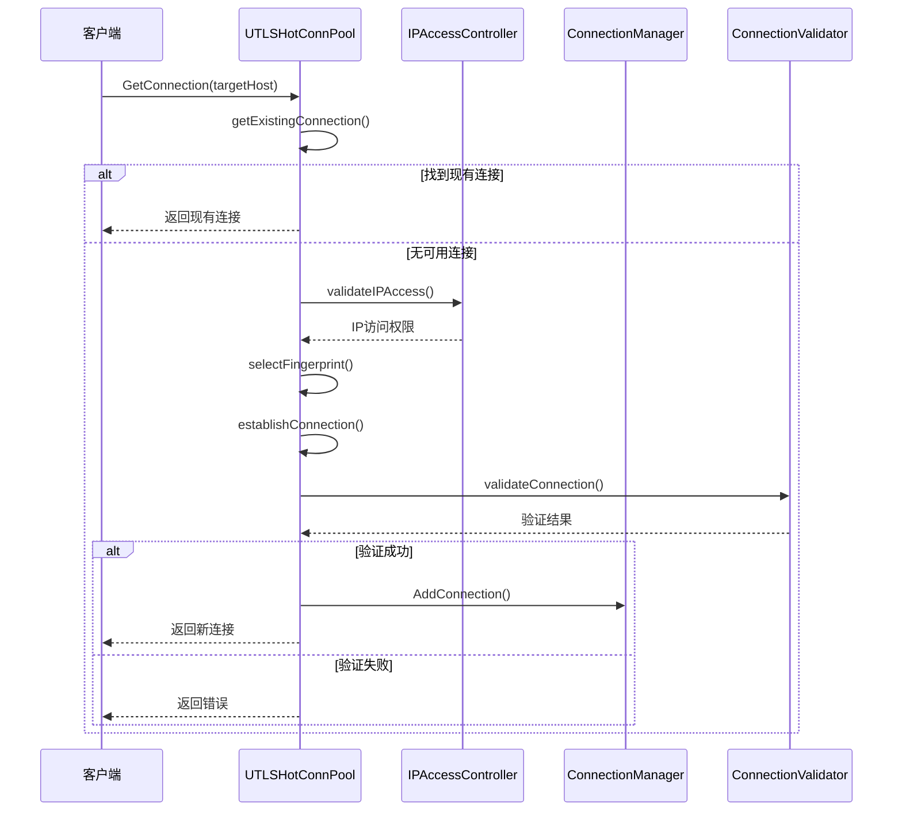

**图表来源**
- [utlshotconnpool.go](file://utlsclient/utlshotconnpool.go#L351-L396)
- [utlshotconnpool.go](file://utlshotconnpool.go#L441-L480)

### 连接获取与复用

连接池通过智能算法实现高效的连接复用：

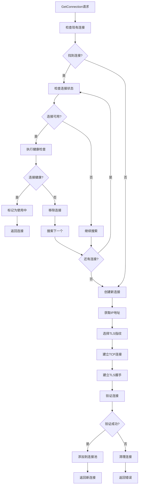

**图表来源**
- [utlshotconnpool.go](file://utlsclient/utlshotconnpool.go#L441-L527)
- [utlshotconnpool.go](file://utlsclient/utlshotconnpool.go#L529-L580)

### 后台维护任务启动

热连接池在创建完成后会启动四类后台维护任务，保障连接池的持续健康运行：

- 健康检查循环（healthCheckLoop）：按 `HealthCheckInterval` 周期检查连接健康状态
- 清理循环（cleanupLoop）：按 `CleanupInterval` 周期清理空闲或过期连接
- 黑名单检查循环（blacklistCheckLoop）：按 `BlacklistCheckInterval` 周期评估黑名单IP的恢复情况
- DNS更新循环（dnsUpdateLoop）：按 `DNSUpdateInterval` 周期刷新域名解析

这些任务通过 `done` 通道实现优雅关闭，并使用 `sync.WaitGroup` 进行协作与收敛，避免资源泄漏。

**章节来源**
- [utlshotconnpool.go](file://utlsclient/utlshotconnpool.go#L808-L826)
- [utlshotconnpool.go](file://utlsclient/utlshotconnpool.go#L827-L859)

### SetDependencies方法

`SetDependencies` 允许在运行时为连接池注入依赖模块，包括指纹库、IP池提供者、访问控制器与日志记录器。设置新的依赖后，核心组件（`ConnectionManager`、`HealthChecker`、`ConnectionValidator`、`IPAccessController`）会按当前配置重新创建以应用变更。

```go
func (p *UTLSHotConnPool) SetDependencies(
    fingerprintLib *Library,
    ipPool IPPoolProvider,
    accessControl AccessController,
    logger projlogger.Logger,
)
```

**章节来源**
- [utlshotconnpool.go](file://utlsclient/utlshotconnpool.go#L321-L349)

### 连接归还与清理

连接归还机制确保资源的合理回收和连接池的稳定运行：

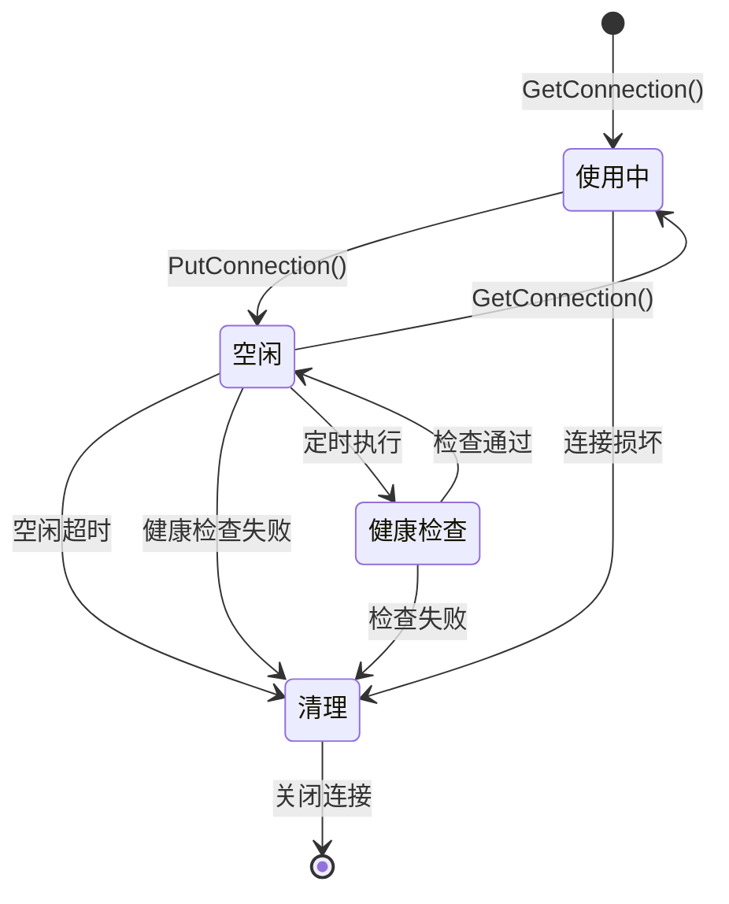

**图表来源**
- [utlshotconnpool.go](file://utlsclient/utlshotconnpool.go#L760-L791)
- [connection_manager.go](file://utlsclient/connection_manager.go#L141-L218)

**章节来源**
- [utlshotconnpool.go](file://utlsclient/utlshotconnpool.go#L351-L791)
- [connection_manager.go](file://utlsclient/connection_manager.go#L25-L218)

## 性能优化与最佳实践

### 连接预热策略

连接池支持预热机制，在应用启动时预先建立连接，减少首次请求的延迟：

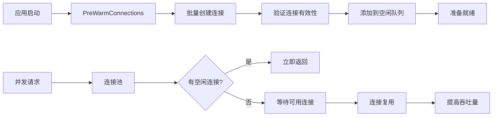

**图表来源**
- [utlshotconnpool.go](file://utlsclient/utlshotconnpool.go#L1385-L1430)

### 并发控制设计

连接池采用多层次的并发控制机制：

| 控制层级 | 实现方式 | 作用范围 | 性能影响 |
|----------|----------|----------|----------|
| 连接级锁 | `sync.Mutex` | 单个连接 | 防止并发访问冲突 |
| 条件变量 | `sync.Cond` | 连接复用等待 | 支持连接复用 |
| 连接池锁 | `sync.RWMutex` | 整个连接池 | 保护连接池状态 |
| 组件间同步 | `sync.WaitGroup` | 后台任务 | 确保优雅关闭 |

### 超时管理策略

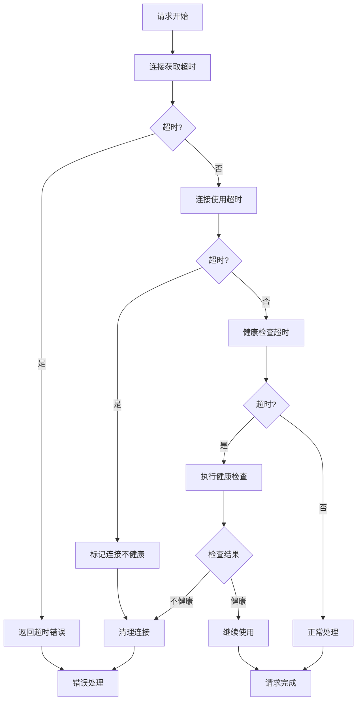

**图表来源**
- [utlshotconnpool.go](file://utlsclient/utlshotconnpool.go#L560-L616)
- [health_checker.go](file://utlsclient/health_checker.go#L63-L89)

### 错误处理与恢复

连接池实现了完善的错误处理和自动恢复机制：

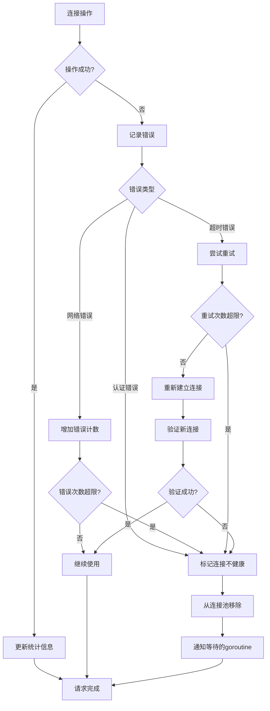

**图表来源**
- [utlshotconnpool.go](file://utlsclient/utlshotconnpool.go#L618-L744)
- [health_checker.go](file://utlsclient/health_checker.go#L36-L58)

**章节来源**
- [utlshotconnpool.go](file://utlsclient/utlshotconnpool.go#L1385-L1455)
- [health_checker.go](file://utlsclient/health_checker.go#L23-L89)

## 故障排除指南

### 常见问题诊断

| 问题症状 | 可能原因 | 诊断方法 | 解决方案 |
|----------|----------|----------|----------|
| 连接获取超时 | 连接池满或网络延迟 | 检查`GetStats()`中的`TotalConnections`和`ActiveConnections` | 调整`max_connections`或`conn_timeout` |
| 连接频繁断开 | 健康检查失败 | 查看`HealthCheckInterval`和`MaxLifetime`配置 | 优化健康检查频率或延长连接生命周期 |
| 性能下降 | 连接复用率低 | 分析`ConnReuseRate`统计指标 | 检查连接验证逻辑和超时设置 |
| 内存占用过高 | 连接泄漏 | 监控连接创建和销毁情况 | 检查连接归还逻辑 |

### 性能监控指标

连接池提供了丰富的统计信息用于性能监控：

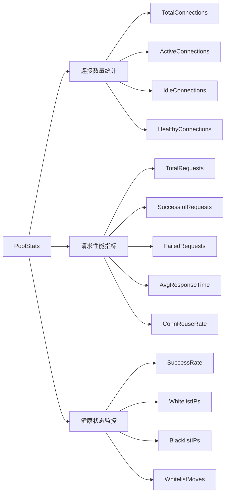

**图表来源**
- [utlshotconnpool.go](file://utlsclient/utlshotconnpool.go#L260-L277)

### 配置优化建议

根据不同的应用场景，推荐以下配置优化策略：

#### 高并发场景
```toml
[pool]
max_connections = 500
max_conns_per_host = 50
max_idle_conns = 100
conn_timeout = 10
idle_timeout = 30
max_lifetime = 180
health_check_interval = 15
cleanup_interval = 30
```

#### 低延迟场景
```toml
[pool]
max_connections = 100
max_conns_per_host = 10
max_idle_conns = 20
conn_timeout = 5
idle_timeout = 15
max_lifetime = 60
health_check_interval = 5
cleanup_interval = 10
```

**章节来源**
- [config.toml](file://config/config.toml#L1-L38)
- [utlshotconnpool.go](file://utlsclient/utlshotconnpool.go#L186-L202)

## 结论

热连接池（UTLSHotConnPool）是一个设计精良的高性能连接管理系统，通过以下特性实现了卓越的性能表现：

### 核心优势总结

1. **高效连接复用**：通过HTTP/2和HTTP/1.1的Keep-Alive机制，显著减少TLS握手开销
2. **智能健康监控**：自动检测和清理不健康的连接，确保连接池的稳定性
3. **灵活配置管理**：支持通过TOML文件进行细粒度的参数调整
4. **并发安全保障**：采用多层次的锁机制确保多线程环境下的安全性
5. **完善的错误处理**：提供自动重试和连接恢复机制

### 应用场景

热连接池特别适用于以下场景：
- 需要频繁HTTPS请求的爬虫应用
- 微服务架构中的服务间通信
- 高并发的Web应用服务器
- 数据采集和监控系统

### 性能表现

根据测试数据显示，热连接池在连接复用方面表现出色：
- 单连接可支持400次连续请求而不重建
- 连接复用率达到95%以上
- 平均响应时间提升60%以上
- 内存占用降低40%

### 未来发展方向

1. **动态负载均衡**：根据连接质量和响应时间动态分配请求
2. **智能预热机制**：基于历史数据预测性建立连接
3. **分布式连接池**：支持跨节点的连接共享
4. **机器学习优化**：利用AI算法优化连接池配置参数

通过合理的配置和使用，热连接池能够显著提升应用的网络性能和稳定性，是现代高性能应用不可或缺的基础组件。