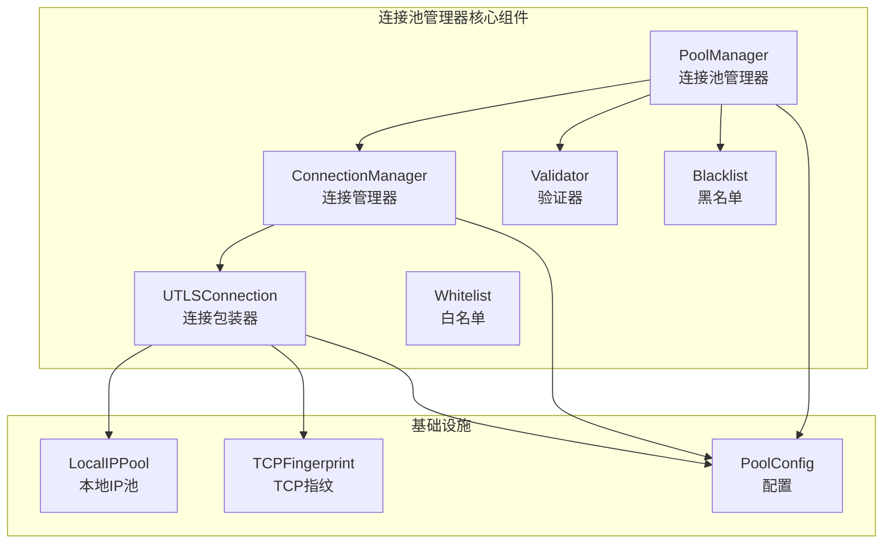
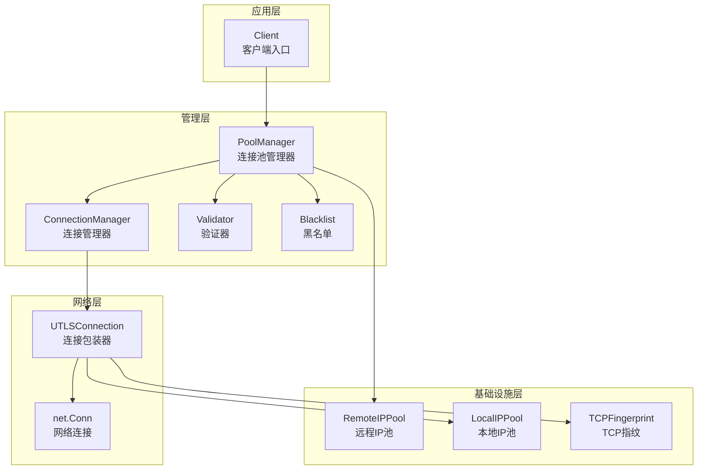
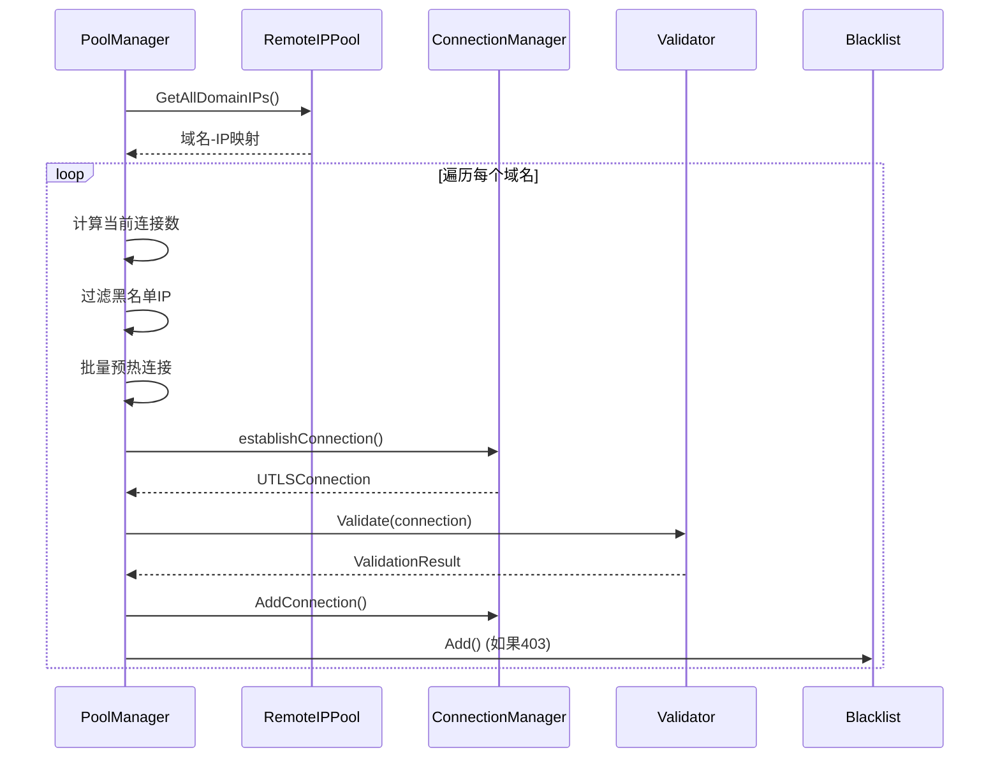
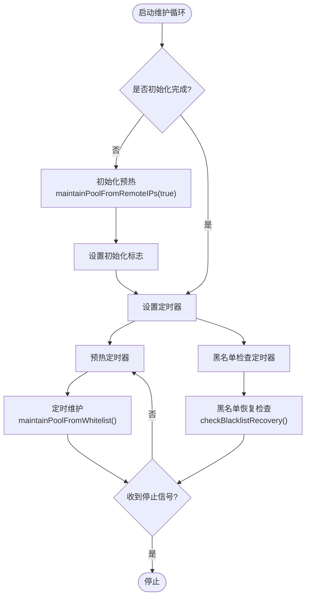
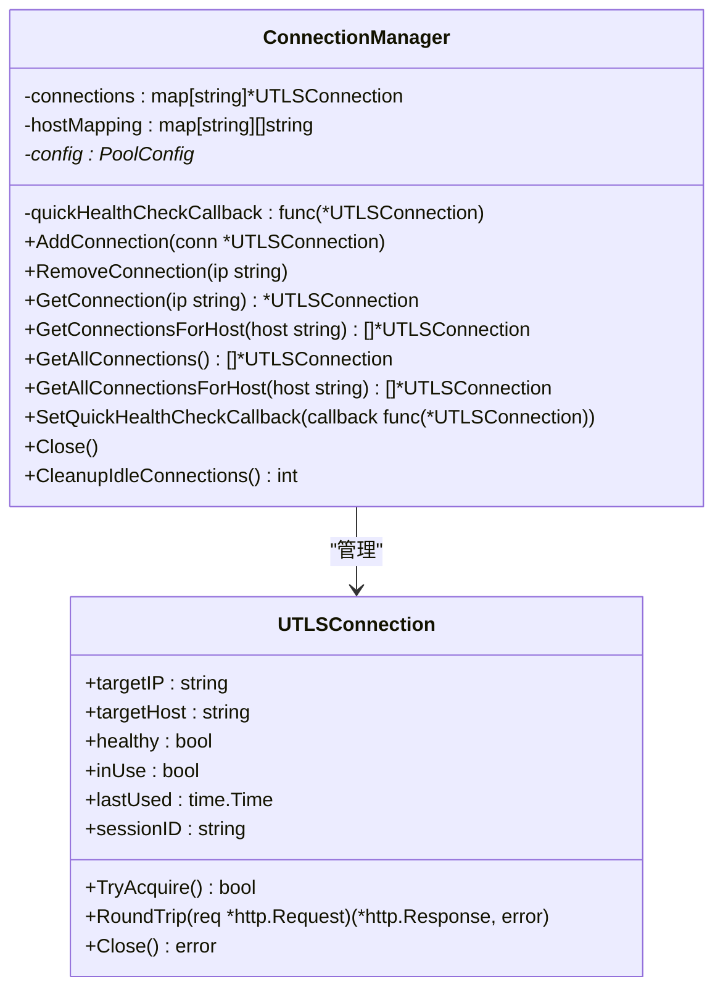
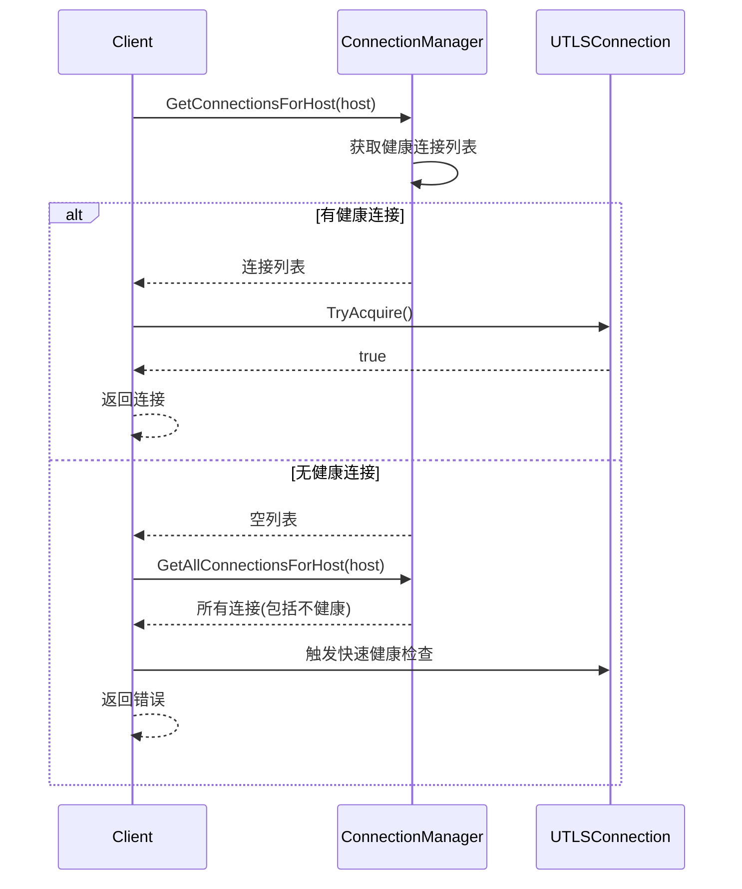
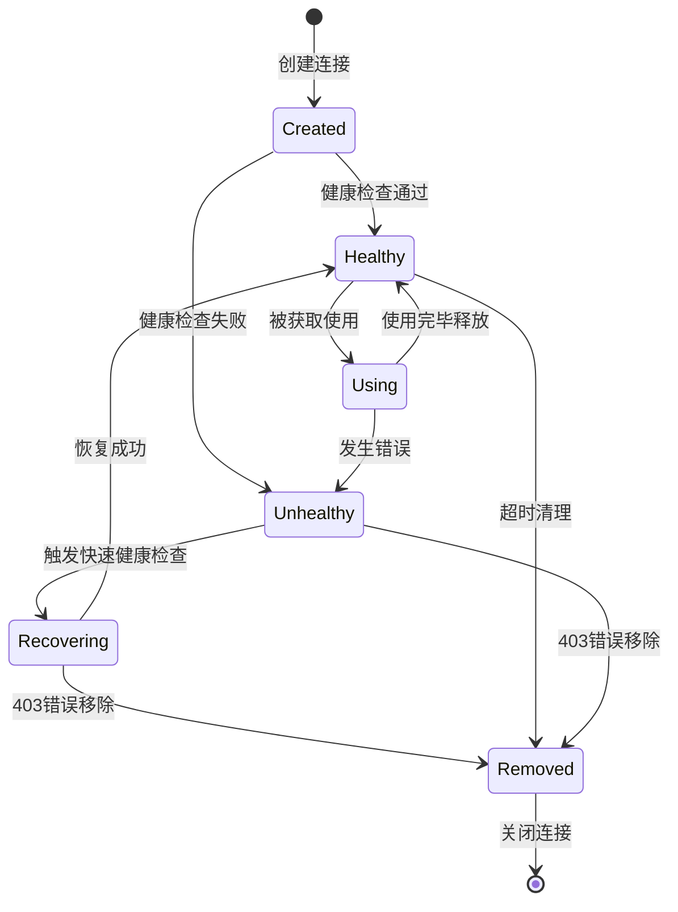
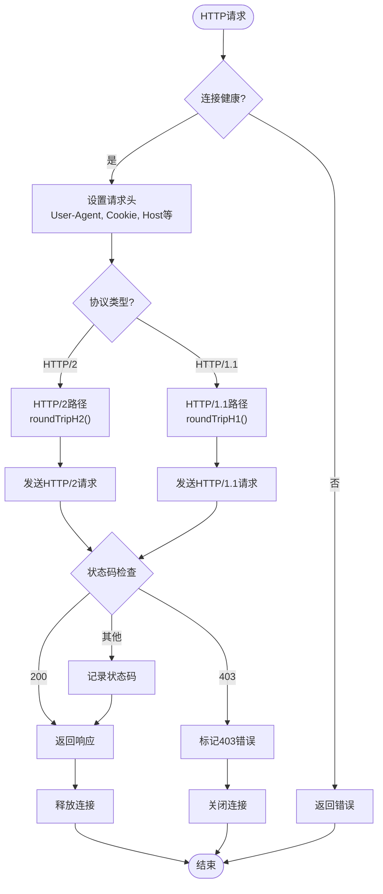
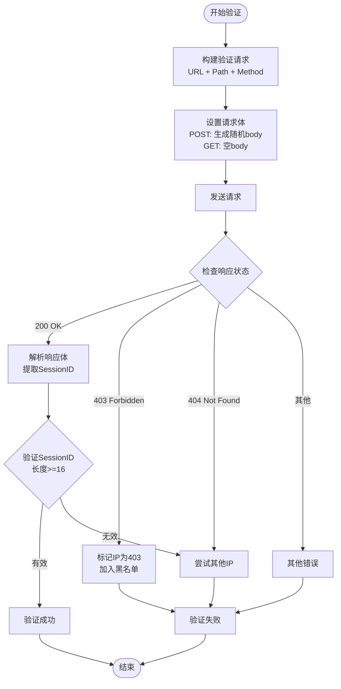
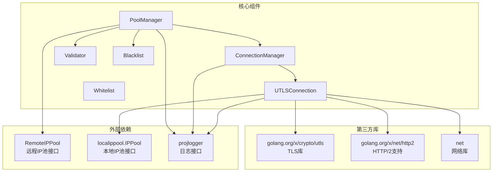

# 连接池管理器

<cite>
**本文档引用的文件**
- [pool_manager.go](file://utlsclient/pool_manager.go)
- [connection_manager.go](file://utlsclient/connection_manager.go)
- [utlshotconnpool.go](file://utlsclient/utlshotconnpool.go)
- [utlsclient.go](file://utlsclient/utlsclient.go)
- [validator.go](file://utlsclient/validator.go)
- [blacklist.go](file://utlsclient/blacklist.go)
- [whitelist.go](file://utlsclient/whitelist.go)
- [tcpfingerprint.go](file://utlsclient/tcpfingerprint.go)
- [localippool.go](file://localippool/localippool.go)
- [errors.go](file://utlsclient/errors.go)
</cite>

## 目录
1. [简介](#简介)
2. [项目结构](#项目结构)
3. [核心组件](#核心组件)
4. [架构概览](#架构概览)
5. [详细组件分析](#详细组件分析)
6. [依赖关系分析](#依赖关系分析)
7. [性能考虑](#性能考虑)
8. [故障排除指南](#故障排除指南)
9. [结论](#结论)

## 简介

连接池管理器是Crawler Platform项目中的核心组件，负责管理和维护高性能的TLS连接池。该系统采用主动式连接池管理策略，通过智能的预热机制、健康检查和黑名单管理，确保爬虫平台能够稳定高效地处理大量并发请求。

该连接池管理器的主要特点包括：
- **主动式预热**：预先建立和验证连接，减少请求延迟
- **智能健康检查**：实时监控连接状态，自动恢复失效连接
- **多层防护**：黑名单机制防止被封禁的IP继续使用
- **反检测能力**：通过TCP指纹伪装和动态IP池实现匿名性
- **高可用性**：支持HTTP/2协议和连接复用

## 项目结构

连接池管理器位于`utlsclient`包中，包含以下核心文件：



**图表来源**
- [pool_manager.go:21-34](file://utlsclient/pool_manager.go#L21-L34)
- [connection_manager.go:8-16](file://utlsclient/connection_manager.go#L8-L16)
- [utlshotconnpool.go:22-52](file://utlsclient/utlshotconnpool.go#L22-L52)

**章节来源**
- [pool_manager.go:1-597](file://utlsclient/pool_manager.go#L1-L597)
- [connection_manager.go:1-227](file://utlsclient/connection_manager.go#L1-L227)

## 核心组件

### PoolManager - 连接池管理器

PoolManager是连接池的核心控制器，负责协调所有连接池相关操作。它采用主动式管理策略，通过维护循环定期执行连接池的预热、维护和恢复操作。

**主要职责**：
- 启动和停止连接池维护循环
- 从远程IP池获取IP地址进行预热
- 定期维护白名单中的连接
- 检查黑名单恢复状态
- 管理连接池的生命周期

### ConnectionManager - 连接管理器

ConnectionManager负责连接的生命周期管理，充当白名单的角色，只存储健康、可用的连接。它提供了线程安全的连接操作接口。

**核心功能**：
- 添加和移除连接
- 获取指定主机的连接
- 连接健康状态管理
- 空闲连接清理

### UTLSConnection - 连接包装器

UTLSConnection是对uTLS连接的封装，提供了丰富的连接管理和状态跟踪功能。

**关键特性**：
- HTTP/1.1和HTTP/2协议支持
- 连接健康状态跟踪
- 会话ID管理和应用
- TCP指纹伪装
- 本地IP绑定支持

**章节来源**
- [pool_manager.go:21-110](file://utlsclient/pool_manager.go#L21-L110)
- [connection_manager.go:8-75](file://utlsclient/connection_manager.go#L8-L75)
- [utlshotconnpool.go:22-104](file://utlsclient/utlshotconnpool.go#L22-L104)

## 架构概览

连接池管理器采用分层架构设计，各组件职责清晰，耦合度低：



**图表来源**
- [utlsclient.go:14-25](file://utlsclient/utlsclient.go#L14-L25)
- [pool_manager.go:21-52](file://utlsclient/pool_manager.go#L21-L52)
- [connection_manager.go:8-25](file://utlsclient/connection_manager.go#L8-L25)

## 详细组件分析

### PoolManager 组件分析

PoolManager是连接池管理器的核心，负责协调所有连接池操作。

#### 核心数据结构

```mermaid
classDiagram
class PoolManager {
-connManager : ConnectionManager*
-blacklist : Blacklist*
-validator : Validator
-config : PoolConfig*
-remotePool : RemoteIPPool
-stopChan : chan struct{}
-wg : sync.WaitGroup
-stopOnce : sync.Once
-initialized : int32
-initOnce : sync.Once
+Start()
+Stop()
+IsInitialized() bool
-maintenanceLoop()
-maintainPoolFromRemoteIPs(isInitial bool)
-maintainPoolFromWhitelist()
-preWarmConnectionsBatch(domain string, ips []string, concurrencyLimit chan struct{}) int
-checkBlacklistRecovery()
}
class PoolConfig {
+MaxConnsPerHost : int
+PreWarmInterval : time.Duration
+MaxConcurrentPreWarms : int
+ConnTimeout : time.Duration
+IdleTimeout : time.Duration
+MaxConnLifetime : time.Duration
+HealthCheckInterval : time.Duration
+IPBlacklistTimeout : time.Duration
+BlacklistCheckInterval : time.Duration
+HealthCheckPath : string
+SessionIdPath : string
+SessionIdBody : []byte
+LocalIPPool : localippool.IPPool
}
PoolManager --> PoolConfig : "使用"
PoolManager --> ConnectionManager : "依赖"
PoolManager --> Validator : "依赖"
PoolManager --> Blacklist : "依赖"
PoolManager --> RemoteIPPool : "依赖"
```

**图表来源**
- [pool_manager.go:21-52](file://utlsclient/pool_manager.go#L21-L52)
- [utlshotconnpool.go:638-657](file://utlsclient/utlshotconnpool.go#L638-L657)

#### 预热机制流程



**图表来源**
- [pool_manager.go:112-184](file://utlsclient/pool_manager.go#L112-L184)
- [pool_manager.go:254-477](file://utlsclient/pool_manager.go#L254-L477)

#### 维护循环流程



**图表来源**
- [pool_manager.go:75-110](file://utlsclient/pool_manager.go#L75-L110)
- [pool_manager.go:186-237](file://utlsclient/pool_manager.go#L186-L237)

**章节来源**
- [pool_manager.go:75-477](file://utlsclient/pool_manager.go#L75-L477)

### ConnectionManager 组件分析

ConnectionManager负责连接的生命周期管理，是连接池的"白名单"。

#### 连接管理策略



**图表来源**
- [connection_manager.go:8-16](file://utlsclient/connection_manager.go#L8-L16)
- [utlshotconnpool.go:22-52](file://utlsclient/utlshotconnpool.go#L22-L52)

#### 连接获取流程



**图表来源**
- [connection_manager.go:118-147](file://utlsclient/connection_manager.go#L118-L147)
- [utlsclient.go:93-144](file://utlsclient/utlsclient.go#L93-L144)

**章节来源**
- [connection_manager.go:27-227](file://utlsclient/connection_manager.go#L27-L227)

### UTLSConnection 组件分析

UTLSConnection是对uTLS连接的完整封装，提供了丰富的功能。

#### 连接状态管理



#### 请求处理流程



**图表来源**
- [utlshotconnpool.go:156-363](file://utlsclient/utlshotconnpool.go#L156-L363)

**章节来源**
- [utlshotconnpool.go:22-636](file://utlsclient/utlshotconnpool.go#L22-L636)

### 验证器组件分析

验证器负责验证新建立的连接是否有效，确保连接能够正常获取会话ID。

#### 验证流程



**图表来源**
- [validator.go:51-142](file://utlsclient/validator.go#L51-L142)

**章节来源**
- [validator.go:19-195](file://utlsclient/validator.go#L19-L195)

## 依赖关系分析

连接池管理器的依赖关系清晰，遵循依赖倒置原则：



**图表来源**
- [pool_manager.go:3-11](file://utlsclient/pool_manager.go#L3-L11)
- [utlshotconnpool.go:3-20](file://utlsclient/utlshotconnpool.go#L3-L20)

**章节来源**
- [pool_manager.go:1-597](file://utlsclient/pool_manager.go#L1-L597)
- [connection_manager.go:1-227](file://utlsclient/connection_manager.go#L1-L227)

## 性能考虑

连接池管理器在设计时充分考虑了性能优化：

### 并发控制

- **信号量限制**：使用信号量控制并发预热连接数量
- **批量处理**：支持批量预热和维护操作
- **goroutine池**：合理控制同时运行的goroutine数量

### 内存管理

- **连接复用**：支持连接复用，减少内存分配
- **引用计数**：IPv6地址使用引用计数，允许多个连接复用同一IP
- **及时清理**：空闲连接自动清理，避免内存泄漏

### 网络优化

- **TCP Keep-Alive**：启用TCP keep-alive，保持长连接
- **HTTP/2支持**：支持HTTP/2协议，提高连接效率
- **连接池复用**：复用底层TCP连接，减少握手开销

## 故障排除指南

### 常见问题及解决方案

#### 连接预热失败

**症状**：连接池无法预热，所有连接都失败

**可能原因**：
- 网络连接问题
- IP地址被封禁
- 配置错误

**解决方法**：
1. 检查网络连接状态
2. 查看黑名单中是否有相关IP
3. 验证配置参数设置

#### 文件描述符耗尽

**症状**：出现"too many open files"错误

**解决方法**：
1. 降低`MaxConcurrentPreWarms`配置
2. 增加系统文件描述符限制
3. 调整连接超时时间

#### 连接健康检查异常

**症状**：连接频繁被标记为不健康

**解决方法**：
1. 检查服务器端状态
2. 调整健康检查间隔
3. 验证请求头设置

**章节来源**
- [pool_manager.go:352-357](file://utlsclient/pool_manager.go#L352-L357)
- [utlsclient.go:354-433](file://utlsclient/utlsclient.go#L354-L433)

## 结论

连接池管理器是一个设计精良、功能完善的组件，具有以下优势：

**技术优势**：
- 采用主动式管理策略，确保连接质量
- 多层防护机制，提高系统稳定性
- 支持反检测功能，增强匿名性
- 高性能设计，支持大规模并发

**架构优势**：
- 清晰的分层设计，职责分离明确
- 依赖注入，便于测试和扩展
- 接口抽象，降低耦合度

**实用性优势**：
- 配置灵活，适应不同场景需求
- 错误处理完善，系统稳定性好
- 性能监控全面，便于运维管理

该连接池管理器为Crawler Platform提供了坚实的基础，能够满足高性能爬虫应用的各种需求。