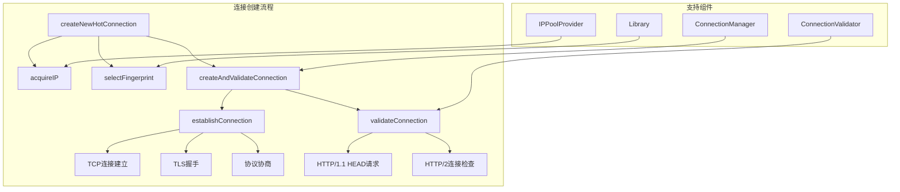
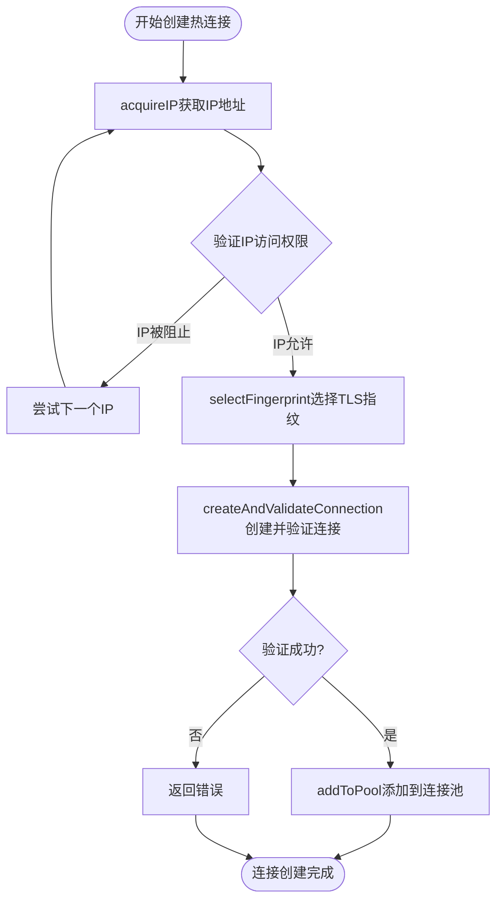
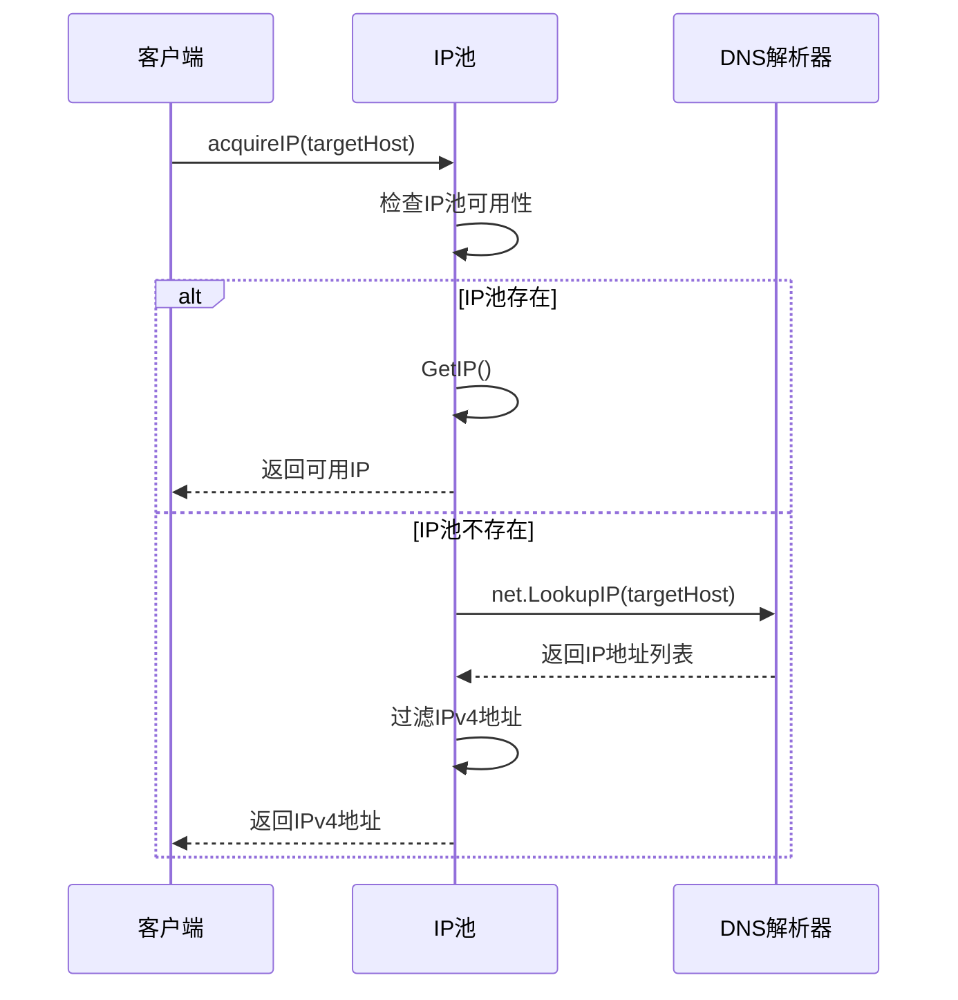
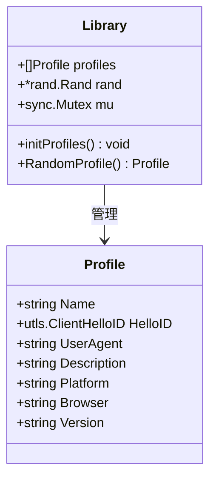
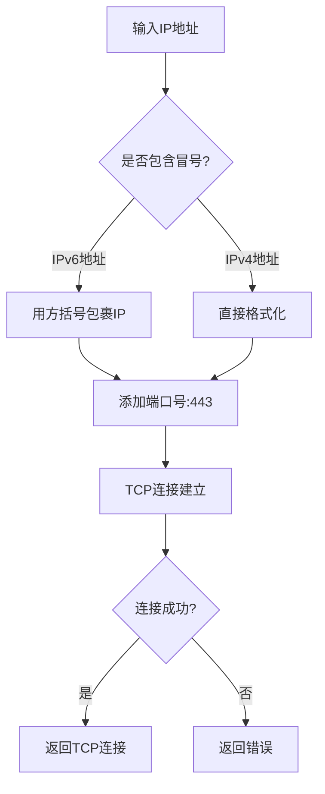
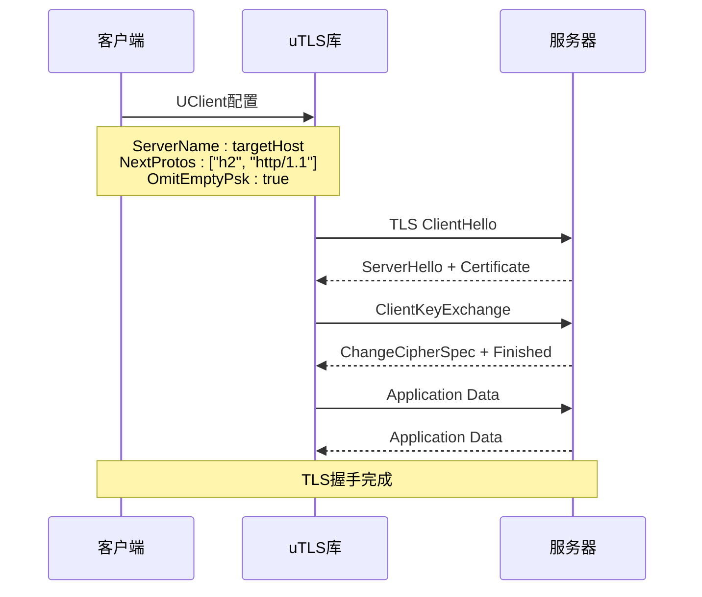
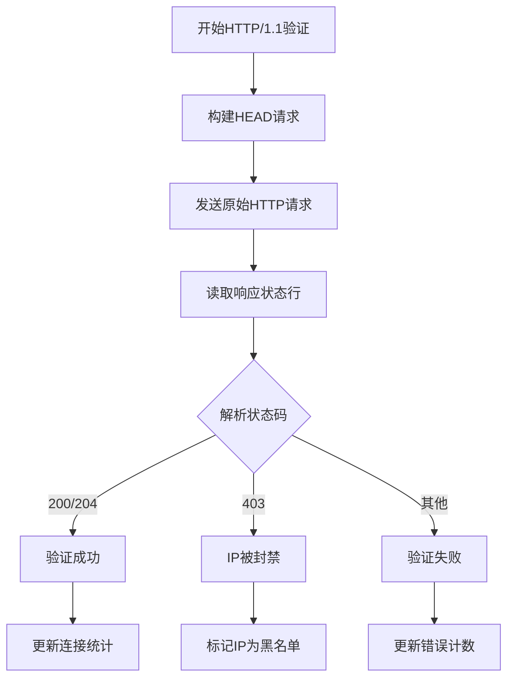
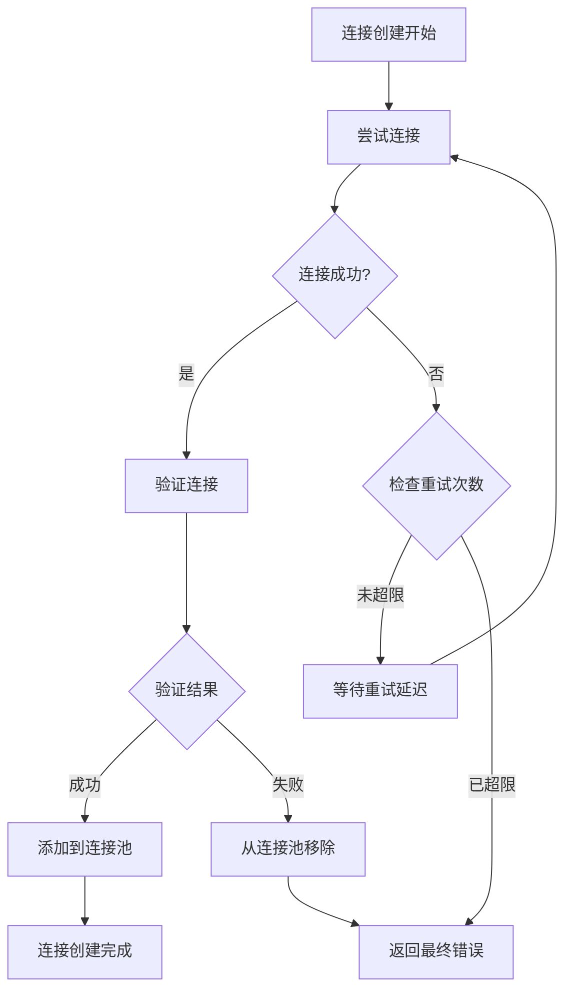
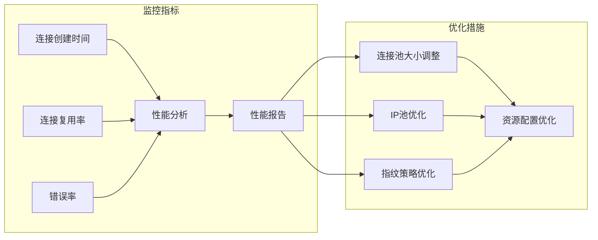

# 连接创建过程详细文档

<cite>
**本文档中引用的文件**
- [utlsclient/utlshotconnpool.go](file://utlsclient/utlshotconnpool.go)
- [utlsclient/connection_manager.go](file://utlsclient/connection_manager.go)
- [utlsclient/connection_helpers.go](file://utlsclient/connection_helpers.go)
- [utlsclient/connection_validator.go](file://utlsclient/connection_validator.go)
- [utlsclient/utlsfingerprint.go](file://utlsclient/utlsfingerprint.go)
- [localippool/localippool.go](file://localippool/localippool.go)
- [remotedomainippool/remotedomainippool.go](file://remotedomainippool/remotedomainippool.go)
- [utlsclient/constants.go](file://utlsclient/constants.go)
</cite>

## 目录
1. [概述](#概述)
2. [核心组件架构](#核心组件架构)
3. [createNewHotConnection函数详解](#createnewhotconnection函数详解)
4. [IP获取机制](#ip获取机制)
5. [TLS指纹选择](#tls指纹选择)
6. [TCP连接建立](#tcp连接建立)
7. [TLS握手过程](#tls握手过程)
8. [连接验证机制](#连接验证机制)
9. [错误处理与重试策略](#错误处理与重试策略)
10. [连接池性能影响分析](#连接池性能影响分析)
11. [总结](#总结)

## 概述

连接创建过程是热连接池的核心功能，负责从IP池获取目标IP地址，选择合适的TLS指纹配置，建立TCP和TLS连接，并通过验证确保连接的有效性。整个过程涉及多个组件的协作，包括IP池管理、TLS指纹库、连接管理和验证器等。

## 核心组件架构

**图表来源**
- [utlsclient/utlshotconnpool.go](file://utlsclient/utlshotconnpool.go#L534-L552)
- [utlsclient/connection_helpers.go](file://utlsclient/connection_helpers.go#L16-L42)
- [utlsclient/connection_helpers.go](file://utlsclient/connection_helpers.go#L56-L61)

## createNewHotConnection函数详解

`createNewHotConnection`函数是连接创建的核心入口点，采用分步骤的流水线设计：

**图表来源**
- [utlsclient/utlshotconnpool.go](file://utlsclient/utlshotconnpool.go#L534-L552)

**章节来源**
- [utlsclient/utlshotconnpool.go](file://utlsclient/utlshotconnpool.go#L534-L552)

### 函数执行流程

1. **IP获取阶段**：从IP池中获取可用的目标IP地址
2. **IP验证阶段**：检查IP是否在黑名单中，防止使用被封禁的IP
3. **TLS指纹选择**：从指纹库中随机选择合适的TLS指纹配置
4. **连接创建与验证**：建立TCP/TLS连接并进行有效性验证

## IP获取机制

IP获取通过`acquireIP`方法实现，支持两种获取方式：

### IP池获取模式

当配置了IP池提供者时，优先从IP池中获取IP地址：

**图表来源**
- [utlsclient/connection_helpers.go](file://utlsclient/connection_helpers.go#L16-L42)

### IPv4/IPv6双栈支持

系统支持IPv4和IPv6双栈网络，地址格式转换逻辑如下：

| IP类型 | 地址格式 | 转换规则 |
|--------|----------|----------|
| IPv4 | 192.168.1.1 | 直接格式化为"192.168.1.1:443" |
| IPv6 | 2001:db8::1 | 格式化为"[2001:db8::1]:443" |

**章节来源**
- [utlsclient/connection_helpers.go](file://utlsclient/connection_helpers.go#L16-L42)

## TLS指纹选择

TLS指纹选择通过`selectFingerprint`方法实现，提供灵活的指纹配置：

### 指纹库管理

**图表来源**
- [utlsclient/utlsfingerprint.go](file://utlsclient/utlsfingerprint.go#L13-L22)
- [utlsclient/utlsfingerprint.go](file://utlsclient/utlsfingerprint.go#L25-L29)

### 支持的浏览器指纹

系统支持多种浏览器指纹配置，包括不同版本的Chrome浏览器：

| 浏览器 | 版本 | 平台 | TLS标识 |
|--------|------|------|---------|
| Chrome | 133 | Windows/macOS | HelloChrome_133 |
| Chrome | 131 | Windows/macOS | HelloChrome_131 |
| Chrome | 120 | Windows/Linux | HelloChrome_120 |
| Chrome | 115 PQ | Windows | HelloChrome_115_PQ |

**章节来源**
- [utlsclient/utlsfingerprint.go](file://utlsclient/utlsfingerprint.go#L112-L200)

## TCP连接建立

TCP连接建立通过`establishConnection`方法实现，处理IPv4/IPv6双栈网络：

### 地址格式转换

**图表来源**
- [utlsclient/utlshotconnpool.go](file://utlsclient/utlshotconnpool.go#L561-L575)

### 连接超时处理

TCP连接建立设置了超时机制，防止长时间等待：

- **超时时间**：由配置决定，默认30秒
- **错误处理**：连接失败时返回具体错误信息
- **资源清理**：失败时自动关闭底层TCP连接

**章节来源**
- [utlsclient/utlshotconnpool.go](file://utlsclient/utlshotconnpool.go#L561-L575)

## TLS握手过程

TLS握手通过uTLS库实现，支持多种TLS配置：

### 握手配置

**图表来源**
- [utlsclient/utlshotconnpool.go](file://utlsclient/utlshotconnpool.go#L578-L584)

### 协议协商

系统支持HTTP/1.1和HTTP/2协议协商：

| 协议 | NextProtos配置 | 特点 |
|------|----------------|------|
| HTTP/1.1 | http/1.1 | 标准HTTP协议 |
| HTTP/2 | h2 | 二进制帧传输，多路复用 |

**章节来源**
- [utlsclient/utlshotconnpool.go](file://utlsclient/utlshotconnpool.go#L578-L584)

## 连接验证机制

连接验证通过`validateConnection`方法实现，支持HTTP/1.1和HTTP/2两种验证方式：

### HTTP/1.1验证

**图表来源**
- [utlsclient/utlshotconnpool.go](file://utlsclient/utlshotconnpool.go#L623-L743)

### HTTP/2验证

HTTP/2连接验证采用更简单的检查方式：

1. **连接状态检查**：验证连接是否健康
2. **生命周期检查**：检查连接是否超过最大生命周期
3. **无请求发送**：不发送实际请求，减少开销

**章节来源**
- [utlsclient/utlshotconnpool.go](file://utlsclient/utlshotconnpool.go#L623-L743)

## 错误处理与重试策略

### 错误分类

系统定义了多种错误类型：

| 错误类型 | 错误常量 | 描述 |
|----------|----------|------|
| 连接超时 | ErrConnectionTimeout | TCP连接超时 |
| IP被封禁 | ErrIPBlocked | 目标IP被服务器封禁 |
| 最大重试 | ErrMaxRetriesExceeded | 超过最大重试次数 |
| 连接关闭 | ErrConnectionClosed | 连接意外关闭 |

**章节来源**
- [utlsclient/constants.go](file://utlsclient/constants.go#L60-L84)

### 重试机制

### 错误恢复策略

1. **IP黑名单机制**：自动将失败的IP加入黑名单
2. **指纹切换**：尝试不同的TLS指纹配置
3. **连接池清理**：定期清理无效连接

**章节来源**
- [utlsclient/connection_helpers.go](file://utlsclient/connection_helpers.go#L66-L180)

## 连接池性能影响分析

### 性能指标

连接池提供丰富的性能统计信息：

| 指标类别 | 具体指标 | 描述 |
|----------|----------|------|
| 连接统计 | TotalConnections | 总连接数 |
| 连接统计 | ActiveConnections | 活跃连接数 |
| 连接统计 | HealthyConnections | 健康连接数 |
| 性能指标 | SuccessRate | 成功率 |
| 性能指标 | ConnReuseRate | 连接复用率 |
| 资源管理 | WhitelistIPs | 白名单IP数 |
| 资源管理 | BlacklistIPs | 黑名单IP数 |

### 性能优化策略

1. **连接复用**：优先复用现有连接，减少创建开销
2. **健康检查**：定期检查连接健康状态
3. **自动清理**：清理空闲和过期连接
4. **负载均衡**：在多个IP之间分配请求

### 性能监控

**图表来源**
- [utlsclient/utlshotconnpool.go](file://utlsclient/utlshotconnpool.go#L261-L277)

**章节来源**
- [utlsclient/utlshotconnpool.go](file://utlsclient/utlshotconnpool.go#L261-L277)

## 总结

连接创建过程是一个复杂而精密的系统，涉及多个组件的协同工作。通过分层的设计架构，系统实现了：

1. **模块化设计**：各组件职责清晰，便于维护和扩展
2. **高可用性**：完善的错误处理和重试机制
3. **高性能**：连接复用和智能调度策略
4. **安全性**：TLS指纹伪装和IP访问控制
5. **可观测性**：丰富的监控和统计信息

这种设计使得热连接池能够在复杂的网络环境中稳定高效地运行，为上层应用提供可靠的连接服务。通过持续的性能监控和优化，系统能够适应不断变化的网络环境和业务需求。