# 连接回收流程详细文档

<cite>
**本文档引用的文件**
- [utlshotconnpool.go](file://utlsclient/utlshotconnpool.go)
- [connection_manager.go](file://utlsclient/connection_manager.go)
- [health_checker.go](file://utlsclient/health_checker.go)
- [connection_validator.go](file://utlsclient/connection_validator.go)
- [test_helpers.go](file://utlsclient/test_helpers.go)
- [utlshotconnpool_test.go](file://test/utlsclient/utlshotconnpool_test.go)
- [connection_manager_test.go](file://test/utlsclient/connection_manager_test.go)
</cite>

## 目录
1. [概述](#概述)
2. [PutConnection函数核心逻辑](#putconnection函数核心逻辑)
3. [连接状态更新机制](#连接状态更新机制)
4. [连接健康状态检查](#连接健康状态检查)
5. [sync.Cond.Broadcast的关键作用](#synccondbroadcast的关键作用)
6. [并发控制策略](#并发控制策略)
7. [异常处理与恢复](#异常处理与恢复)
8. [性能影响分析](#性能影响分析)
9. [最佳实践建议](#最佳实践建议)

## 概述

连接回收是热连接池架构中的关键环节，负责将使用完毕的连接安全地归还到连接池中。PutConnection函数作为连接回收的核心入口，实现了完整的连接状态管理、健康检查和并发控制机制。

连接回收流程涉及以下核心组件：
- **UTLSHotConnPool**: 连接池主控制器
- **ConnectionManager**: 连接生命周期管理
- **HealthChecker**: 连接健康状态监控
- **UTLSConnection**: 连接实体对象

## PutConnection函数核心逻辑

PutConnection函数是连接回收的主要入口点，其执行流程如下：

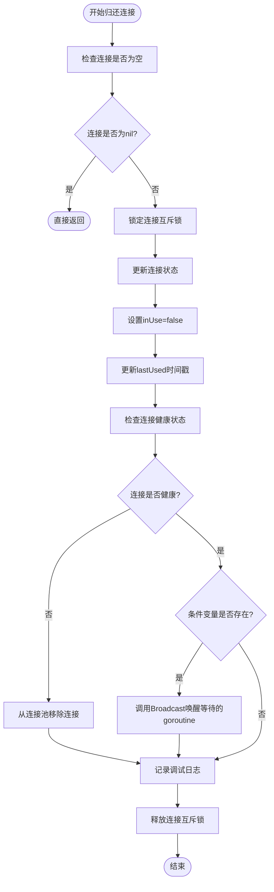

**图表来源**
- [utlshotconnpool.go](file://utlsclient/utlshotconnpool.go#L760-L784)

### 函数执行步骤详解

1. **空值检查**: 首先验证传入的连接对象是否为nil，避免空指针异常
2. **连接锁定**: 使用连接级别的互斥锁确保状态更新的原子性
3. **状态更新**: 将连接的inUse标志设置为false，并更新最后使用时间
4. **健康检查**: 检查连接的健康状态，决定是否继续保留
5. **并发唤醒**: 通过条件变量广播通知等待的goroutine
6. **日志记录**: 记录连接归还的调试信息

**章节来源**
- [utlshotconnpool.go](file://utlsclient/utlshotconnpool.go#L760-L784)

## 连接状态更新机制

### inUse状态管理

连接的inUse状态是连接池管理的核心指标，表示连接当前是否正在被使用：

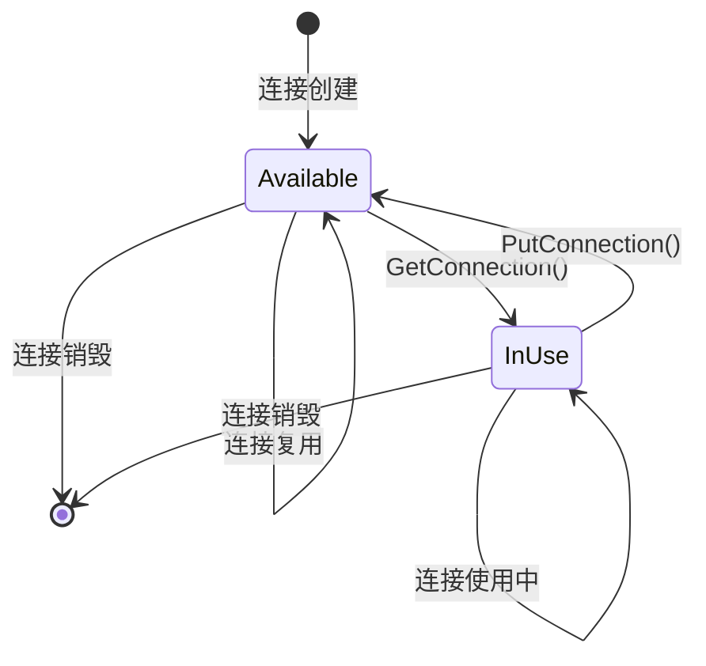

**图表来源**
- [utlshotconnpool.go](file://utlsclient/utlshotconnpool.go#L224)

### lastUsed时间戳更新

lastUsed字段记录连接最后一次被使用的精确时间，用于以下场景：

| 时间检查类型 | 配置参数 | 用途 |
|-------------|----------|------|
| 空闲超时检查 | IdleTimeout | 检测连接是否长时间未使用 |
| 健康检查触发 | HealthCheckInterval | 判断是否需要执行健康检查 |
| 生命周期管理 | MaxLifetime | 控制连接的最大存活时间 |

### 状态更新的线程安全性

状态更新采用连接级别的互斥锁保护，确保多goroutine环境下的数据一致性：

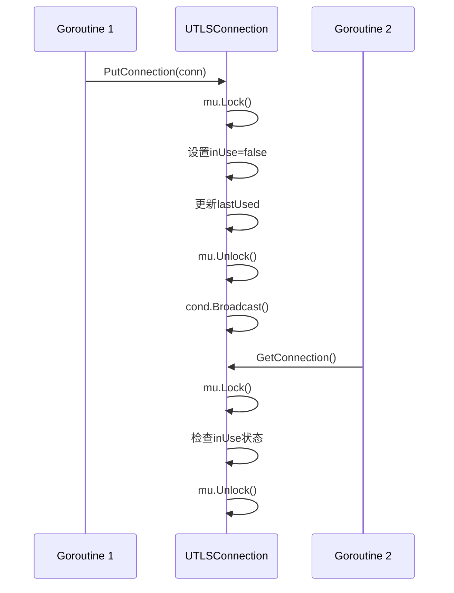

**图表来源**
- [utlshotconnpool.go](file://utlsclient/utlshotconnpool.go#L766-L782)

**章节来源**
- [utlshotconnpool.go](file://utlsclient/utlshotconnpool.go#L766-L782)

## 连接健康状态检查

### 健康检查机制

连接健康状态检查是连接回收过程中的重要环节，确保只有健康的连接才能被重新利用：

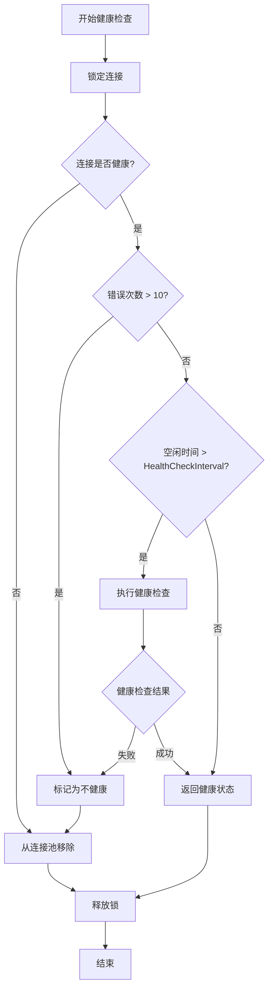

**图表来源**
- [health_checker.go](file://utlsclient/health_checker.go#L24-L60)

### 健康检查触发条件

健康检查在以下条件下会被触发：

| 触发条件 | 检查内容 | 处理方式 |
|----------|----------|----------|
| 错误次数过多 | errorCount > 10 | 立即标记为不健康 |
| 空闲时间超限 | time.Since(lastUsed) > HealthCheckInterval | 执行健康检查 |
| 连接池定期检查 | 定时器触发 | 批量检查所有连接 |

### 连接移除机制

当检测到不健康的连接时，系统会执行以下移除流程：

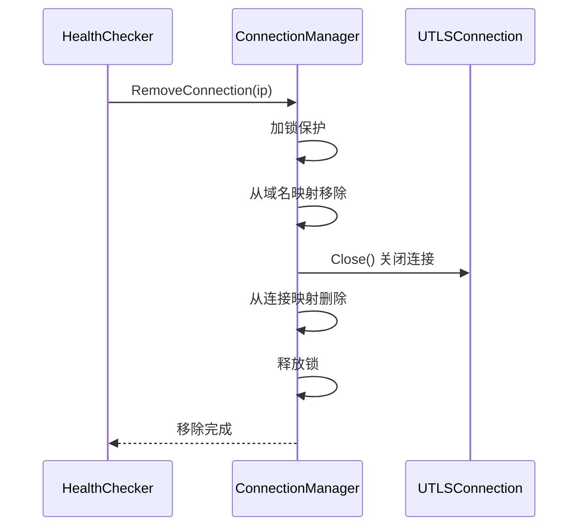

**图表来源**
- [connection_manager.go](file://utlsclient/connection_manager.go#L49-L73)

**章节来源**
- [health_checker.go](file://utlsclient/health_checker.go#L24-L60)
- [connection_manager.go](file://utlsclient/connection_manager.go#L49-L73)

## sync.Cond.Broadcast的关键作用

### 条件变量的作用机制

sync.Cond条件变量在连接回收中扮演着关键的同步角色，确保等待的goroutine能够及时获得连接：

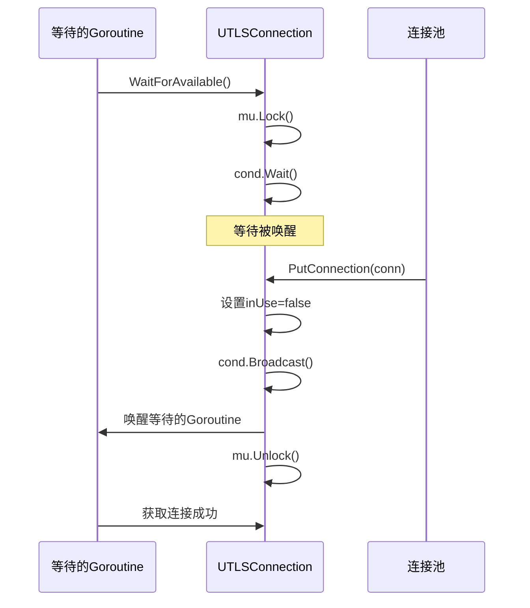

**图表来源**
- [utlshotconnpool.go](file://utlsclient/utlshotconnpool.go#L1325-L1345)

### Broadcast vs Signal的区别

在连接回收场景中，使用Broadcast而非Signal的原因：

| 特性 | Broadcast | Signal |
|------|-----------|--------|
| 唤醒数量 | 所有等待的goroutine | 单个等待的goroutine |
| 使用场景 | 连接池复用 | 单一消费者场景 |
| 性能开销 | 较高（需遍历等待队列） | 较低（直接唤醒一个） |
| 并发安全性 | 完全安全 | 需要额外同步 |

### 条件变量的初始化

条件变量在连接创建时初始化，确保连接回收时的可用性：

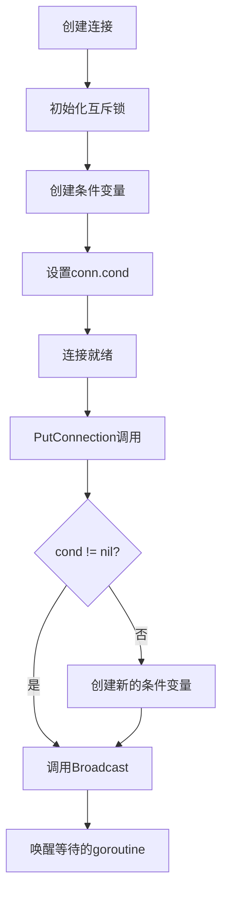

**图表来源**
- [utlshotconnpool.go](file://utlsclient/utlshotconnpool.go#L586-L627)

**章节来源**
- [utlshotconnpool.go](file://utlsclient/utlshotconnpool.go#L1325-L1345)

## 并发控制策略

### 多层次的并发保护

连接回收系统采用多层次的并发控制策略，确保高并发场景下的线程安全：

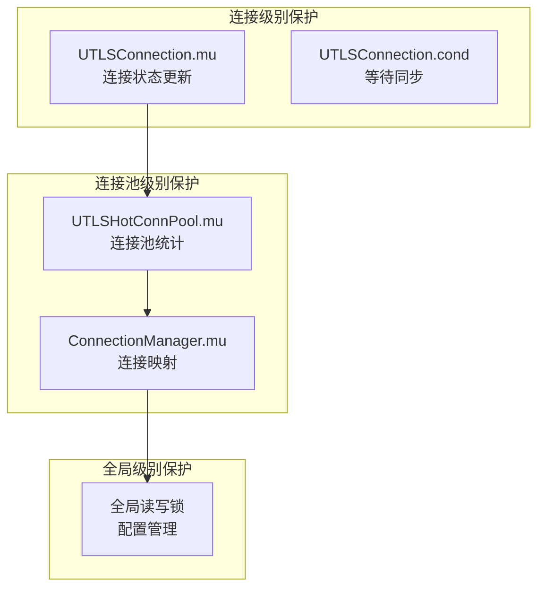

**图表来源**
- [utlshotconnpool.go](file://utlsclient/utlshotconnpool.go#L232-L233)
- [connection_manager.go](file://utlsclient/connection_manager.go#L10)

### 读写锁的应用

ConnectionManager使用读写锁优化并发性能：

| 操作类型 | 锁类型 | 适用场景 |
|----------|--------|----------|
| 连接查询 | RLock | 多个goroutine同时读取连接 |
| 连接添加/移除 | Lock | 修改连接映射结构 |
| 域名映射查询 | RLock | 查询域名对应的IP列表 |

### 死锁预防机制

系统采用以下策略预防死锁：

1. **锁顺序固定**: 始终按照连接池 → 连接管理器 → 连接的顺序获取锁
2. **超时机制**: WaitForAvailable方法使用超时避免无限等待
3. **无锁设计**: 在可能的情况下，使用原子操作替代锁

**章节来源**
- [connection_manager.go](file://utlsclient/connection_manager.go#L10)
- [utlshotconnpool.go](file://utlsclient/utlshotconnpool.go#L232-L233)

## 异常处理与恢复

### 连接回收失败的处理

当连接回收过程中出现异常时，系统采用分级处理策略：

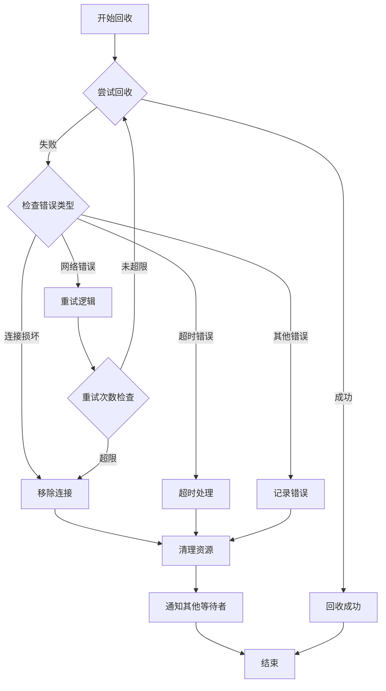

**图表来源**
- [utlshotconnpool.go](file://utlsclient/utlshotconnpool.go#L760-L784)

### 连接验证失败的恢复

当连接验证失败时，系统会执行以下恢复流程：

| 失败类型 | 检测方式 | 恢复策略 |
|----------|----------|----------|
| TLS握手失败 | 握手超时/拒绝 | 移除连接，创建新连接 |
| HTTP响应异常 | 状态码检查 | 标记不健康，延迟验证 |
| 网络中断 | 连接断开 | 立即移除，重新建立 |
| 协议不支持 | 协商失败 | 更换TLS指纹，重试 |

### 异常日志记录

系统提供详细的异常日志记录，便于问题诊断：

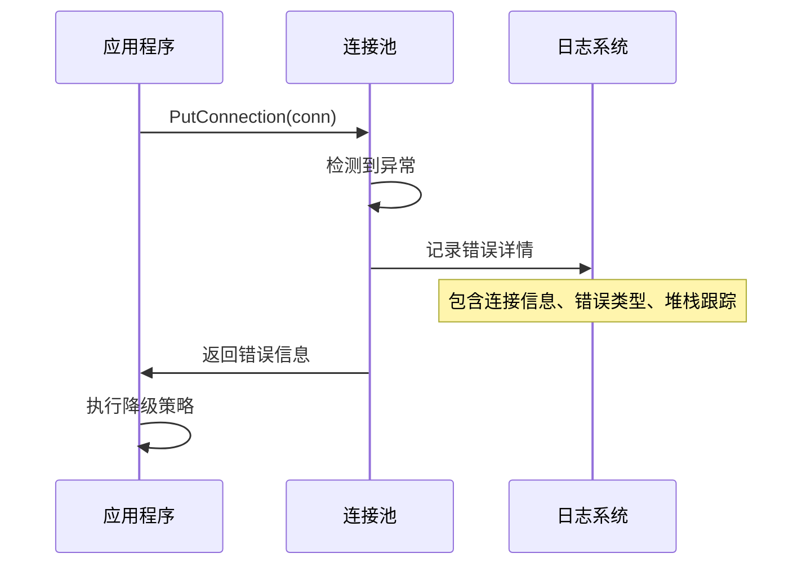

**章节来源**
- [utlshotconnpool.go](file://utlsclient/utlshotconnpool.go#L760-L784)

## 性能影响分析

### 回收延迟对连接池效率的影响

连接回收的延迟直接影响连接池的整体性能：

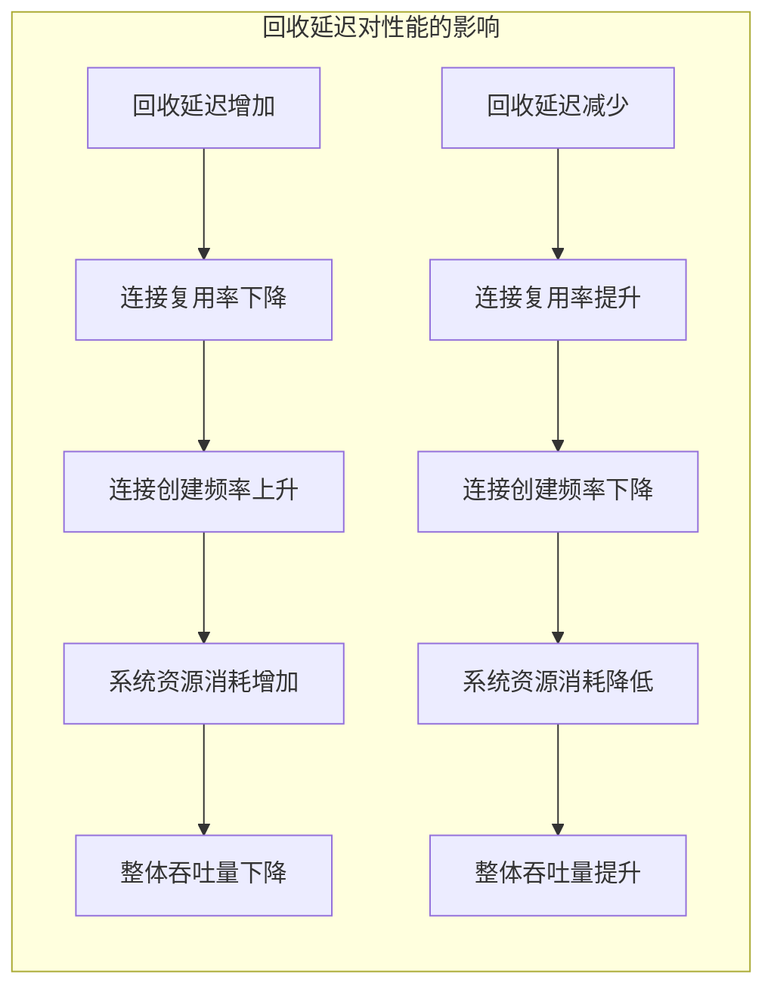

### 性能优化策略

| 优化维度 | 具体措施 | 预期效果 |
|----------|----------|----------|
| 锁竞争优化 | 使用读写锁分离读写操作 | 提升并发读取性能 |
| 条件变量优化 | 批量唤醒而非逐个唤醒 | 减少上下文切换开销 |
| 健康检查优化 | 异步执行健康检查 | 避免阻塞主线程 |
| 内存管理优化 | 对象池复用连接对象 | 减少GC压力 |

### 性能监控指标

系统提供以下关键性能指标：

| 指标名称 | 计算方式 | 监控意义 |
|----------|----------|----------|
| 连接回收率 | 成功回收/总回收请求 | 衡量回收效率 |
| 平均回收延迟 | 总回收时间/回收次数 | 反映系统响应速度 |
| 连接复用率 | 复用连接数/总连接数 | 评估连接池效果 |
| 健康连接比例 | 健康连接数/总连接数 | 监控连接质量 |

**章节来源**
- [utlshotconnpool.go](file://utlsclient/utlshotconnpool.go#L760-L784)

## 最佳实践建议

### 连接回收的最佳实践

1. **及时归还连接**: 使用defer语句确保连接在函数退出时被正确归还
2. **避免长时间持有连接**: 减少连接在业务逻辑中的占用时间
3. **合理设置超时**: 为连接等待设置合适的超时时间
4. **监控连接健康状态**: 定期检查连接池的健康状况

### 高并发场景下的注意事项

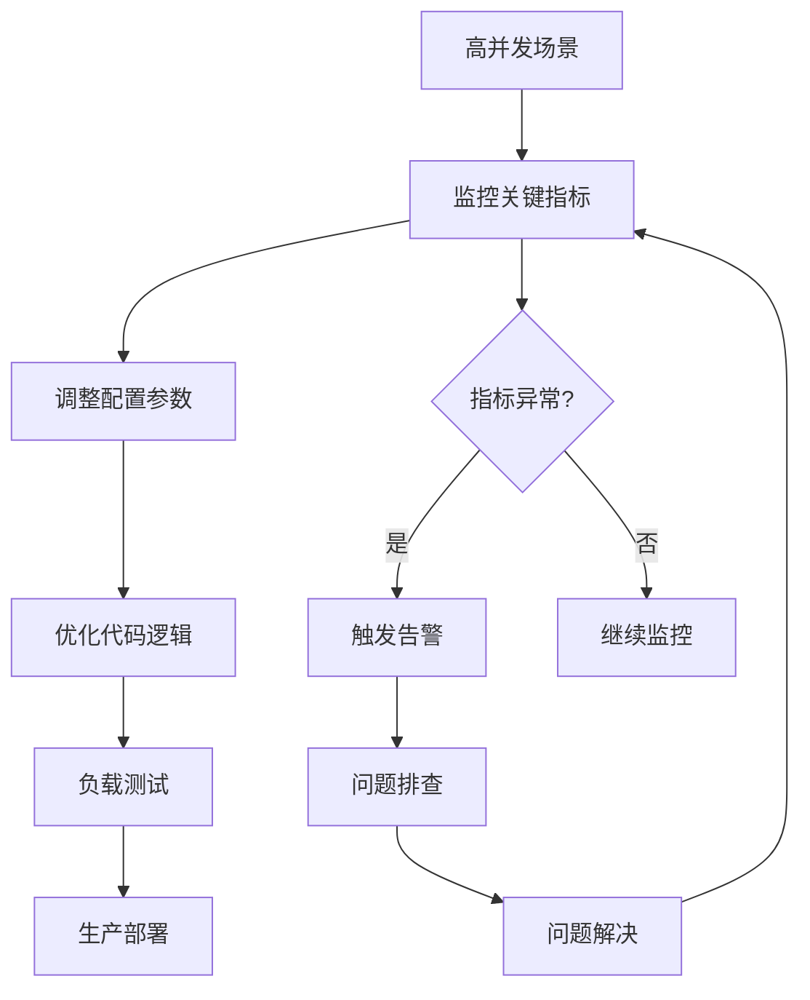

### 故障排查指南

当连接回收出现问题时，可按以下步骤排查：

1. **检查连接池配置**: 确认MaxConnections、IdleTimeout等参数设置合理
2. **分析日志信息**: 查找连接回收过程中的错误日志
3. **监控资源使用**: 检查CPU、内存、网络等资源使用情况
4. **验证健康检查**: 确认健康检查机制正常工作
5. **测试并发场景**: 验证高并发环境下的稳定性

### 性能调优建议

针对不同场景的性能调优建议：

| 场景类型 | 调优重点 | 具体措施 |
|----------|----------|----------|
| 高并发读取 | 减少锁竞争 | 使用读写锁，优化锁粒度 |
| 长连接服务 | 提高连接复用 | 增加IdleTimeout，优化健康检查 |
| 短连接应用 | 降低回收延迟 | 减少健康检查频率，优化条件变量 |
| 资源受限环境 | 减少内存占用 | 优化连接对象结构，使用对象池 |

通过遵循这些最佳实践和优化建议，可以显著提升连接回收流程的效率和稳定性，确保连接池在各种场景下都能发挥最佳性能。