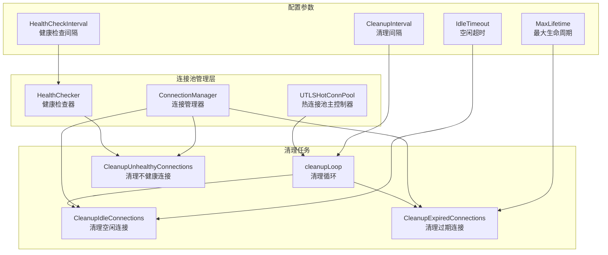
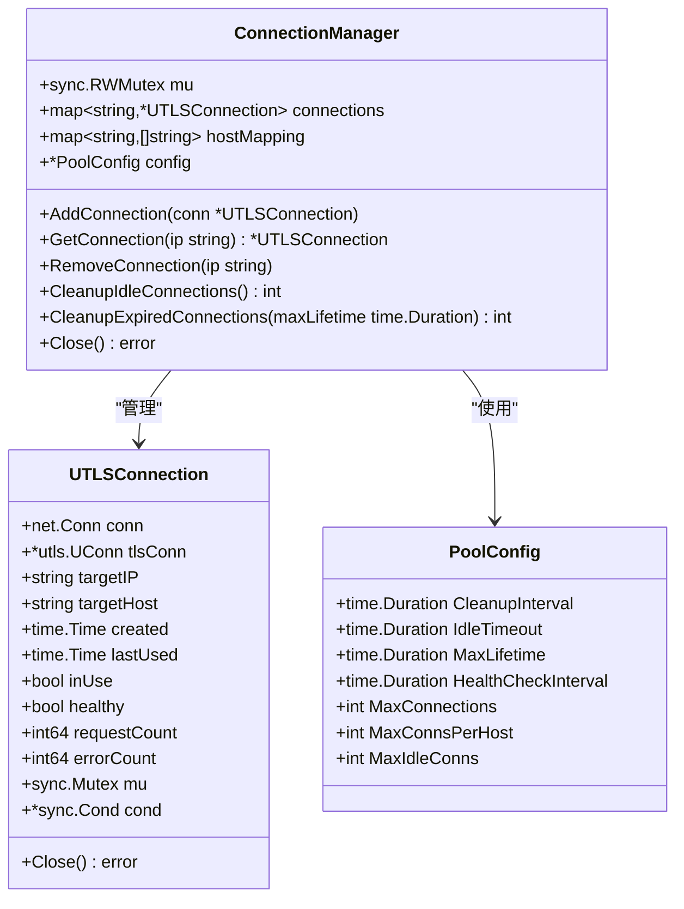
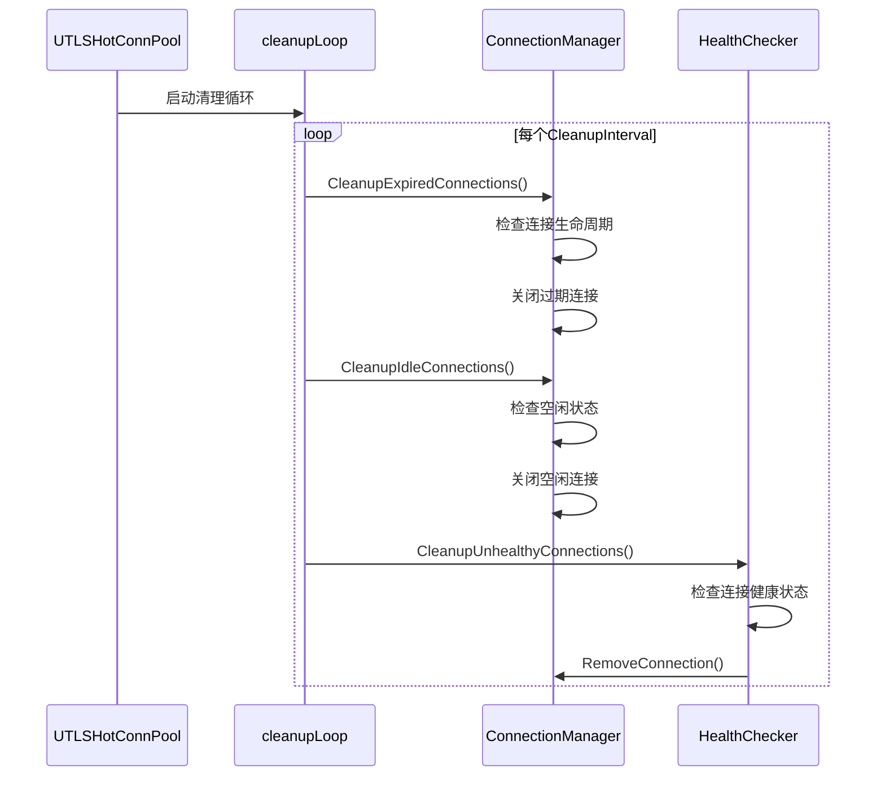
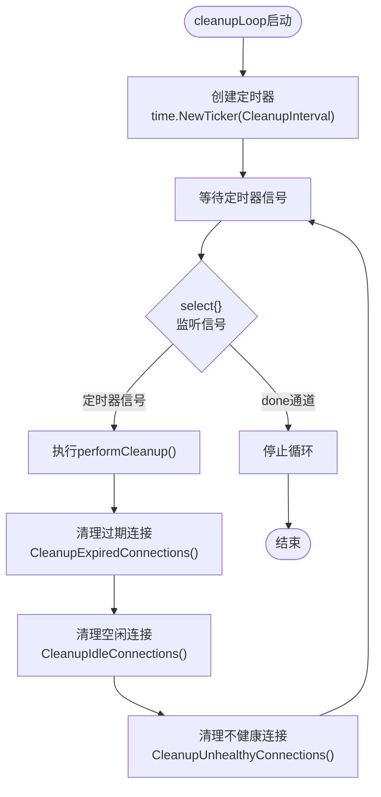
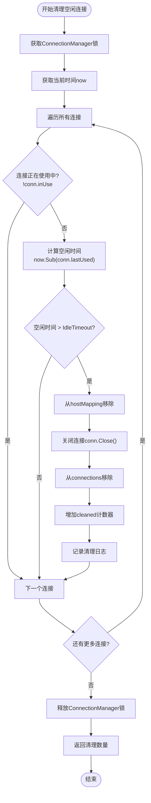
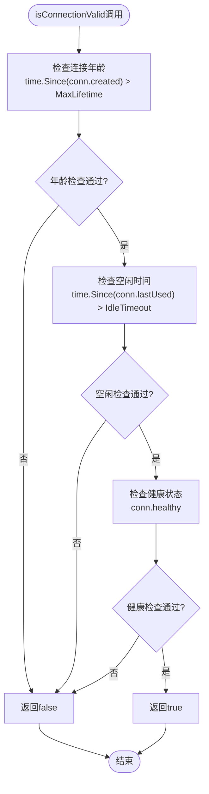
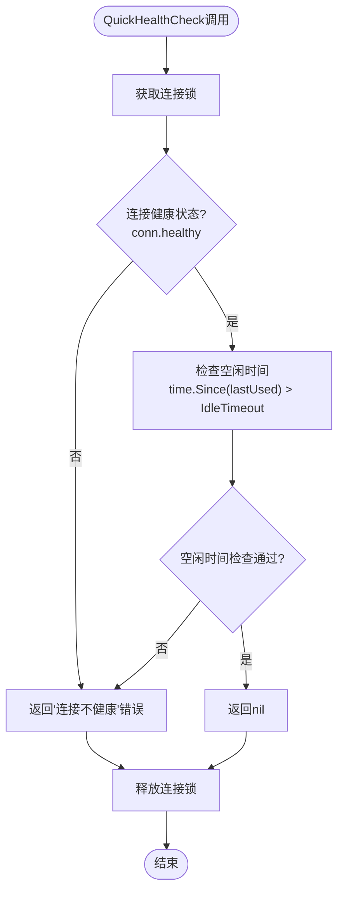
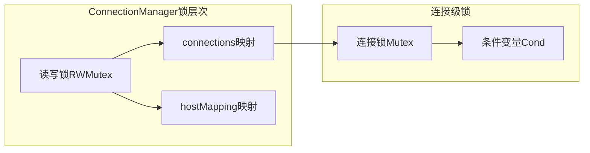
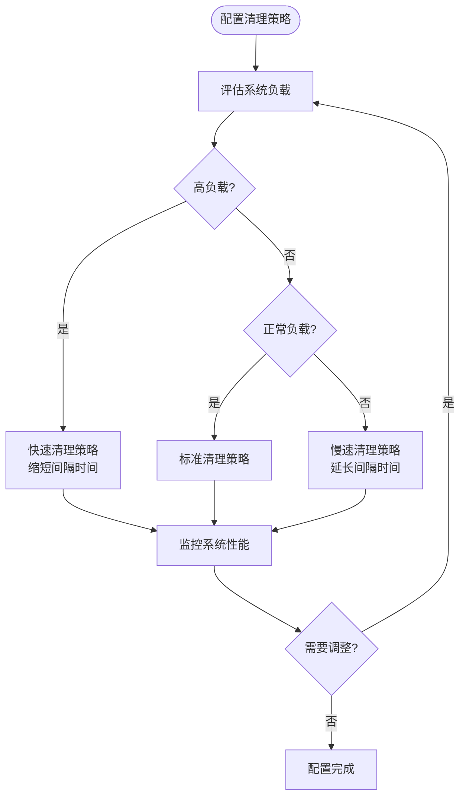

# 连接清理机制详细文档

<cite>
**本文档引用的文件**
- [connection_manager.go](file://utlsclient/connection_manager.go)
- [utlshotconnpool.go](file://utlsclient/utlshotconnpool.go)
- [connection_validator.go](file://utlsclient/connection_validator.go)
- [health_checker.go](file://utlsclient/health_checker.go)
- [constants.go](file://utlsclient/constants.go)
- [interfaces.go](file://utlsclient/interfaces.go)
- [connection_manager_test.go](file://test/utlsclient/connection_manager_test.go)
- [test_helpers.go](file://utlsclient/test_helpers.go)
</cite>

## 目录
1. [概述](#概述)
2. [系统架构](#系统架构)
3. [核心组件分析](#核心组件分析)
4. [清理机制工作原理](#清理机制工作原理)
5. [连接验证逻辑](#连接验证逻辑)
6. [性能影响分析](#性能影响分析)
7. [最佳实践建议](#最佳实践建议)
8. [故障排除指南](#故障排除指南)
9. [总结](#总结)

## 概述

连接清理机制是热连接池（UTLSHotConnPool）的核心功能之一，负责维护连接池的健康状态和资源效率。该机制通过定期清理过期和空闲的连接，防止资源泄漏，确保连接池始终处于最优状态。

主要功能包括：
- 基于时间的连接清理（空闲超时、最大生命周期）
- 健康状态检查和清理
- 并发安全的清理操作
- 自动资源回收

## 系统架构

**图表来源**
- [utlshotconnpool.go](file://utlsclient/utlshotconnpool.go#L850-L860)
- [connection_manager.go](file://utlsclient/connection_manager.go#L141-L217)
- [health_checker.go](file://utlsclient/health_checker.go#L114-L164)

## 核心组件分析

### ConnectionManager 连接管理器

ConnectionManager是连接清理机制的核心组件，负责连接的生命周期管理和清理操作。

**图表来源**
- [connection_manager.go](file://utlsclient/connection_manager.go#L8-L22)
- [utlshotconnpool.go](file://utlsclient/utlshotconnpool.go#L204-L233)
- [utlshotconnpool.go](file://utlsclient/utlshotconnpool.go#L170-L183)

**节来源**
- [connection_manager.go](file://utlsclient/connection_manager.go#L8-L22)
- [utlshotconnpool.go](file://utlsclient/utlshotconnpool.go#L204-L233)

### UTLSHotConnPool 热连接池

热连接池作为连接清理机制的协调者，启动和管理各种清理任务。

**图表来源**
- [utlshotconnpool.go](file://utlsclient/utlshotconnpool.go#L850-L860)
- [connection_manager.go](file://utlsclient/connection_manager.go#L141-L217)
- [health_checker.go](file://utlsclient/health_checker.go#L114-L164)

**节来源**
- [utlshotconnpool.go](file://utlsclient/utlshotconnpool.go#L850-L860)
- [utlshotconnpool.go](file://utlsclient/utlshotconnpool.go#L885-L889)

## 清理机制工作原理

### cleanupLoop 定时清理循环

cleanupLoop是连接清理机制的核心定时任务，基于CleanupInterval配置周期性触发清理操作。

**图表来源**
- [utlshotconnpool.go](file://utlsclient/utlshotconnpool.go#L850-L860)

**节来源**
- [utlshotconnpool.go](file://utlsclient/utlshotconnpool.go#L850-L860)

### CleanupIdleConnections 空闲连接清理

CleanupIdleConnections方法负责清理超过IdleTimeout时间未使用的连接。

**图表来源**
- [connection_manager.go](file://utlsclient/connection_manager.go#L141-L178)

**节来源**
- [connection_manager.go](file://utlsclient/connection_manager.go#L141-L178)

### CleanupExpiredConnections 过期连接清理

CleanupExpiredConnections方法负责清理超过MaxLifetime时间的连接。

**图表来源**
- [connection_manager.go](file://utlsclient/connection_manager.go#L180-L217)

**节来源**
- [connection_manager.go](file://utlsclient/connection_manager.go#L180-L217)

## 连接验证逻辑

### isConnectionValid 函数分析

虽然在提供的代码中没有直接看到isConnectionValid函数，但根据代码结构可以推断其存在并实现以下逻辑：

**图表来源**
- [utlshotconnpool.go](file://utlsclient/utlshotconnpool.go#L779-L850)

### QuickHealthCheck 健康检查

QuickHealthCheck提供了快速的连接健康状态检查机制。

**图表来源**
- [connection_validator.go](file://utlsclient/connection_validator.go#L241-L262)

**节来源**
- [connection_validator.go](file://utlsclient/connection_validator.go#L241-L262)

## 性能影响分析

### 内存占用优化

连接清理机制通过以下方式优化内存占用：

1. **及时资源回收**：过期和空闲连接被及时关闭和移除
2. **并发安全设计**：使用读写锁减少锁竞争
3. **批量操作**：一次性处理多个连接的清理

### 性能开销评估

| 清理类型 | 频率 | CPU开销 | 内存开销 | I/O开销 |
|---------|------|---------|----------|---------|
| 空闲连接清理 | CleanupInterval | 中等 | 低 | 低 |
| 过期连接清理 | CleanupInterval | 中等 | 低 | 低 |
| 健康检查清理 | HealthCheckInterval | 高 | 中等 | 中等 |

### 并发安全性

清理机制采用多层锁保护确保并发安全：

**图表来源**
- [connection_manager.go](file://utlsclient/connection_manager.go#L8-L11)

**节来源**
- [connection_manager.go](file://utlsclient/connection_manager.go#L8-L11)

## 最佳实践建议

### 配置参数优化

基于不同应用场景推荐的配置参数：

| 应用场景 | CleanupInterval | IdleTimeout | MaxLifetime | HealthCheckInterval |
|---------|----------------|-------------|-------------|-------------------|
| 高频请求服务 | 30s | 30s | 180s | 15s |
| 中等频率服务 | 60s | 60s | 300s | 30s |
| 低频请求服务 | 120s | 120s | 600s | 60s |

### 清理策略配置

### 监控指标建议

关键监控指标包括：

- **清理频率**：每分钟清理的连接数量
- **连接存活时间**：平均连接生命周期
- **清理效果**：清理前后连接池大小变化
- **错误率**：清理过程中出现的错误比例

## 故障排除指南

### 常见问题诊断

| 问题症状 | 可能原因 | 排查方法 | 解决方案 |
|---------|---------|---------|---------|
| 连接池过大 | 清理间隔过长 | 检查CleanupInterval配置 | 缩短清理间隔 |
| 频繁连接重建 | IdleTimeout设置过短 | 监控连接使用模式 | 调整空闲超时时间 |
| 资源泄漏 | 清理任务异常 | 检查清理循环状态 | 重启清理任务 |
| 性能下降 | 健康检查过于频繁 | 分析健康检查频率 | 优化健康检查间隔 |

### 调试技巧

1. **启用调试日志**：设置Debug级别日志输出
2. **监控清理统计**：跟踪清理操作的执行情况
3. **压力测试**：模拟高并发场景验证清理效果
4. **内存分析**：使用pprof工具分析内存使用情况

**节来源**
- [connection_manager_test.go](file://test/utlsclient/connection_manager_test.go#L138-L178)

## 总结

连接清理机制是热连接池稳定运行的重要保障。通过合理配置清理参数、监控清理效果和及时处理异常情况，可以确保连接池始终保持最优状态，为上层应用提供可靠的连接服务。

关键要点：
- 定时清理机制基于CleanupInterval周期性触发
- 支持空闲连接和过期连接的双重清理策略
- 采用多层锁保护确保并发安全
- 提供灵活的配置选项适应不同应用场景
- 通过健康检查机制维护连接质量

正确理解和实施连接清理机制对于构建高性能、稳定的网络应用至关重要。