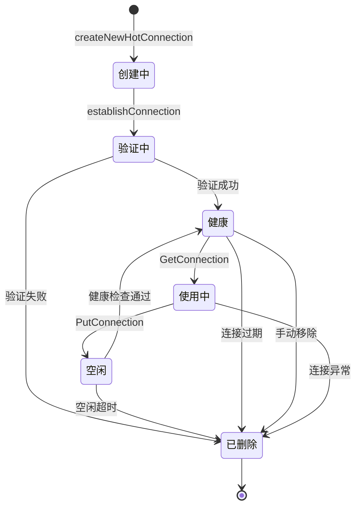
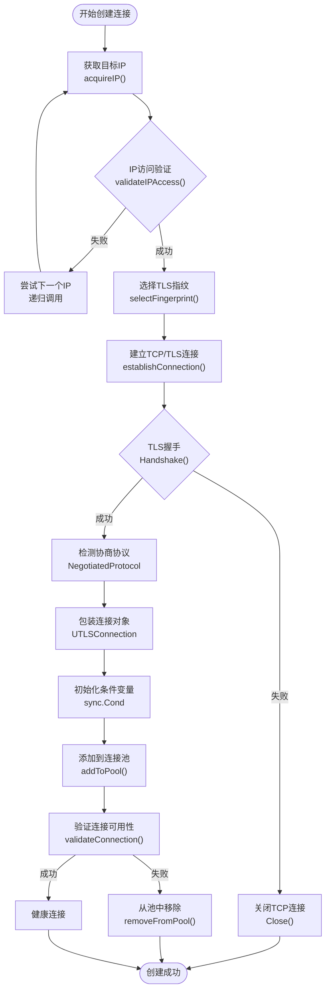
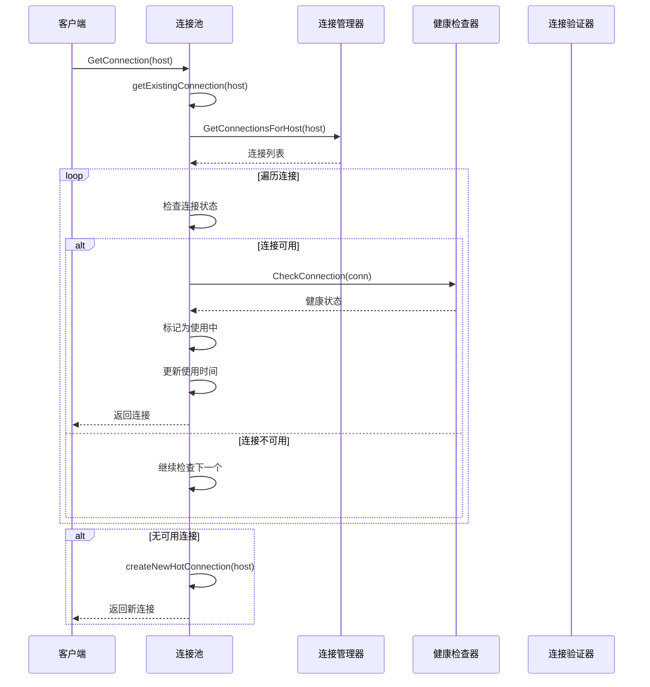
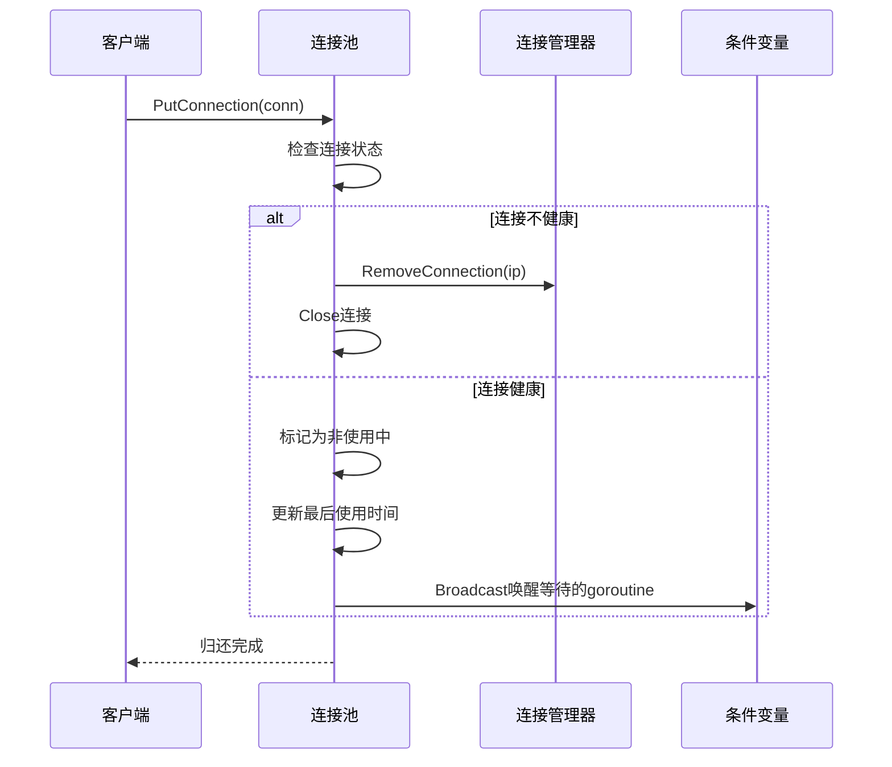
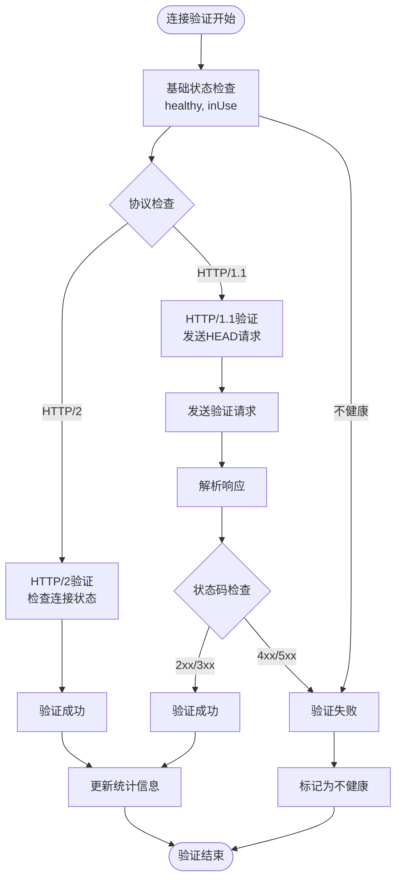
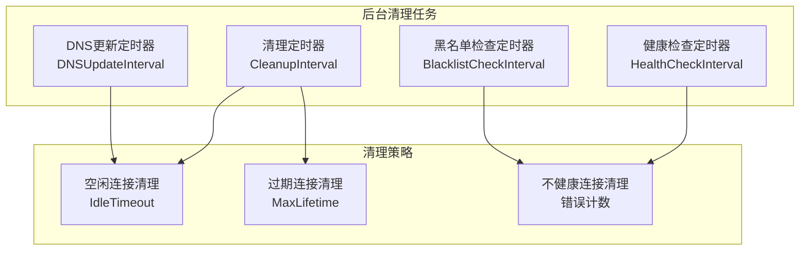
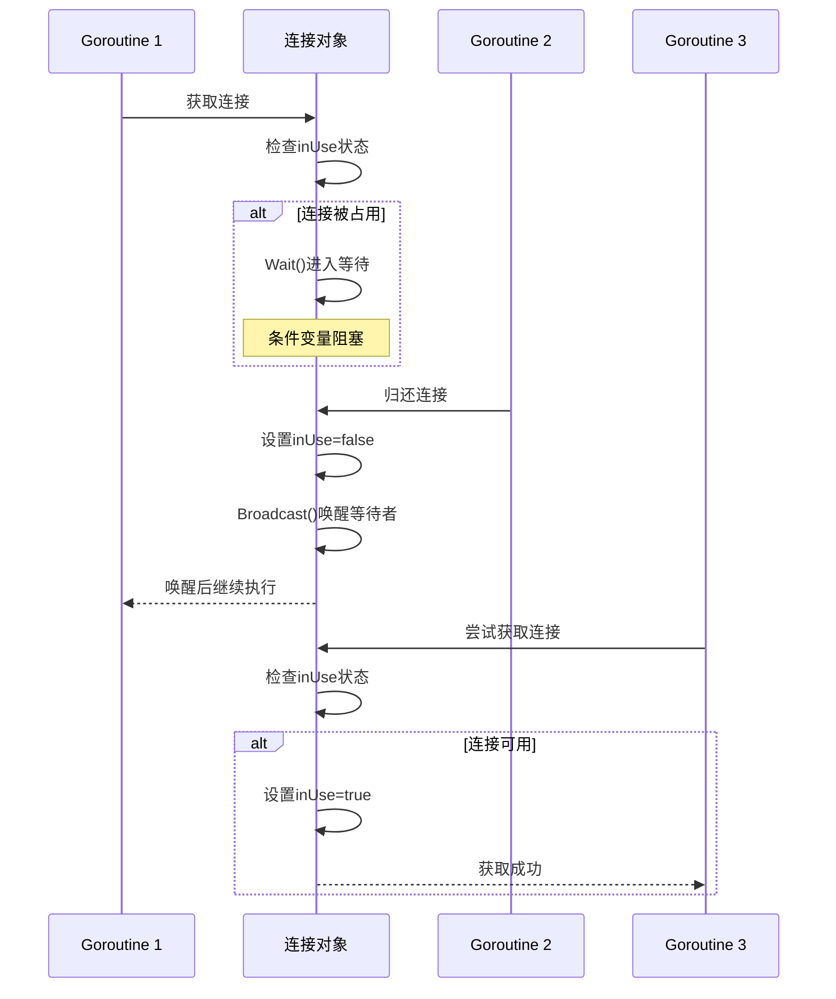
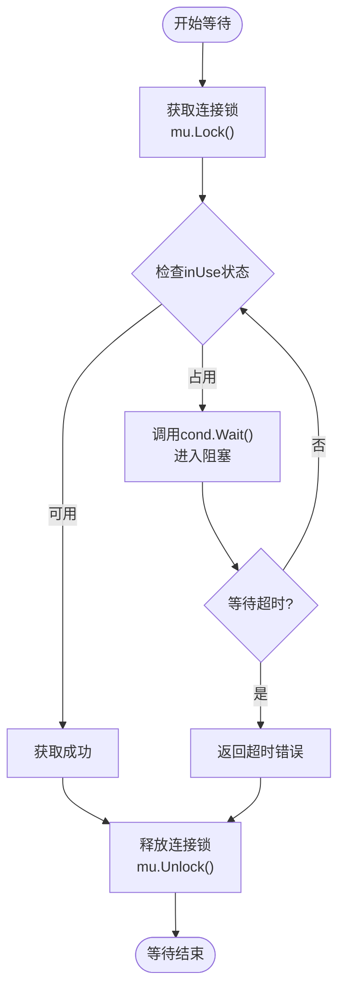
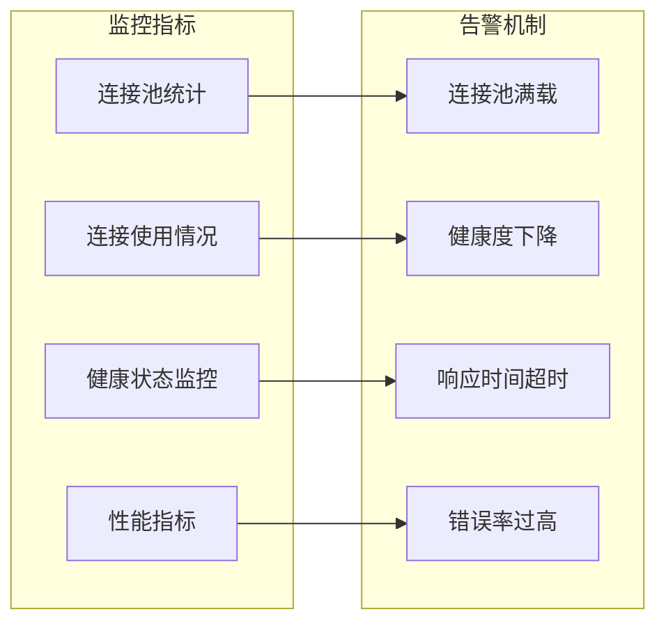

# 连接生命周期管理

<cite>
**本文档引用的文件**
- [utlshotconnpool.go](file://utlsclient/utlshotconnpool.go)
- [connection_manager.go](file://utlsclient/connection_manager.go)
- [connection_validator.go](file://utlsclient/connection_validator.go)
- [health_checker.go](file://utlsclient/health_checker.go)
- [connection_helpers.go](file://utlsclient/connection_helpers.go)
- [config/config.toml](file://config/config.toml)
- [examples/utlsclient/example_hotconnpool_usage.go](file://examples/utlsclient/example_hotconnpool_usage.go)
</cite>

## 目录
1. [概述](#概述)
2. [连接生命周期架构](#连接生命周期架构)
3. [连接创建过程](#连接创建过程)
4. [连接获取与归还机制](#连接获取与归还机制)
5. [连接验证与健康检查](#连接验证与健康检查)
6. [连接清理机制](#连接清理机制)
7. [并发控制与等待机制](#并发控制与等待机制)
8. [配置参数详解](#配置参数详解)
9. [性能影响分析](#性能影响分析)
10. [故障排除指南](#故障排除指南)

## 概述

连接生命周期管理是热连接池的核心功能，负责从连接创建到销毁的完整流程控制。该系统通过精心设计的状态转换和并发控制机制，确保连接的高效利用和系统的稳定性。

### 核心特性

- **完整的生命周期管理**：涵盖连接的创建、验证、使用、归还和清理全过程
- **智能健康检查**：实时监控连接状态，自动移除不健康的连接
- **并发安全保障**：使用互斥锁和条件变量确保多goroutine环境下的安全性
- **灵活的配置选项**：支持多种超时和清理策略
- **自动垃圾回收**：定期清理过期和空闲连接

## 连接生命周期架构



**图表来源**
- [utlshotconnpool.go](file://utlsclient/utlshotconnpool.go#L530-L616)
- [connection_manager.go](file://utlsclient/connection_manager.go#L26-L73)

### 连接状态定义

| 状态 | 描述 | 触发条件 |
|------|------|----------|
| 创建中 | 正在建立TCP和TLS连接 | `establishConnection` 调用 |
| 验证中 | 正在验证连接可用性 | `validateConnection` 执行 |
| 健康 | 连接正常可用 | 验证成功且未超时 |
| 使用中 | 连接正在被业务使用 | `GetConnection` 获取连接 |
| 空闲 | 连接已归还但未超时 | `PutConnection` 归还连接 |
| 已删除 | 连接已被清理或移除 | 超时、验证失败或手动清理 |

**章节来源**
- [utlshotconnpool.go](file://utlsclient/utlshotconnpool.go#L204-L234)
- [connection_manager.go](file://utlsclient/connection_manager.go#L10-L14)

## 连接创建过程

连接创建是生命周期的第一个阶段，涉及多个关键步骤的协调执行。

### 创建流程图



**图表来源**
- [utlshotconnpool.go](file://utlsclient/utlshotconnpool.go#L530-L616)
- [connection_helpers.go](file://utlsclient/connection_helpers.go#L12-L62)

### 关键步骤详解

#### 1. IP获取阶段

IP获取是连接创建的第一步，支持多种IP获取策略：

- **IP池优先**：如果配置了IP池提供者，优先从IP池获取
- **DNS解析**：IP池不可用时，通过标准DNS解析获取
- **IPv4过滤**：优先选择IPv4地址，确保兼容性

#### 2. TLS握手阶段

TLS握手是连接安全性的关键环节：

- **TCP连接建立**：使用超时控制防止长时间阻塞
- **TLS配置应用**：设置服务器名称、协议支持等
- **握手执行**：验证证书和密钥交换
- **协议协商**：确定使用的HTTP协议版本

#### 3. 连接包装

成功建立TLS连接后，系统会创建`UTLSConnection`对象：

```mermaid
classDiagram
class UTLSConnection {
+net.Conn conn
+*utls.UConn tlsConn
+string targetIP
+string targetHost
+Profile fingerprint
+string acceptLanguage
+interface{} h2ClientConn
+time.Time created
+time.Time lastUsed
+time.Time lastChecked
+bool inUse
+bool healthy
+int64 requestCount
+int64 errorCount
+sync.Mutex mu
+*sync.Cond cond
+WaitForAvailable(timeout) error
+Close() error
+RoundTripRaw(ctx, rawReq) io.Reader
}
class PoolConfig {
+int MaxConnections
+int MaxConnsPerHost
+int MaxIdleConns
+time.Duration ConnTimeout
+time.Duration IdleTimeout
+time.Duration MaxLifetime
+time.Duration HealthCheckInterval
+time.Duration CleanupInterval
}
UTLSConnection --> PoolConfig : "使用配置"
```

**图表来源**
- [utlshotconnpool.go](file://utlsclient/utlshotconnpool.go#L204-L234)
- [utlshotconnpool.go](file://utlsclient/utlshotconnpool.go#L170-L184)

**章节来源**
- [utlshotconnpool.go](file://utlsclient/utlshotconnpool.go#L530-L616)
- [connection_helpers.go](file://utlsclient/connection_helpers.go#L12-L62)

## 连接获取与归还机制

连接获取和归还是连接池的核心操作，通过复杂的并发控制确保资源的合理分配。

### 获取连接流程



**图表来源**
- [utlshotconnpool.go](file://utlsclient/utlshotconnpool.go#L441-L480)
- [utlshotconnpool.go](file://utlsclient/utlshotconnpool.go#L351-L360)

### 归还连接流程



**图表来源**
- [utlshotconnpool.go](file://utlsclient/utlshotconnpool.go#L760-L785)

### 并发安全保障

连接池使用双重锁机制确保并发安全：

1. **连接级锁**：保护单个连接的状态变更
2. **池级锁**：保护连接池的整体状态

**章节来源**
- [utlshotconnpool.go](file://utlsclient/utlshotconnpool.go#L441-L480)
- [utlshotconnpool.go](file://utlsclient/utlshotconnpool.go#L760-L785)

## 连接验证与健康检查

连接验证和健康检查是确保连接质量的关键机制。

### 验证层次结构



**图表来源**
- [utlshotconnpool.go](file://utlsclient/utlshotconnpool.go#L618-L743)
- [connection_validator.go](file://utlsclient/connection_validator.go#L41-L96)

### 健康检查策略

| 检查类型 | 检查频率 | 检查内容 | 失败处理 |
|----------|----------|----------|----------|
| 连接状态 | 实时 | 健康标志、使用状态 | 立即移除 |
| 协议协商 | 握手后 | HTTP/2 vs HTTP/1.1 | 记录协议版本 |
| 空闲超时 | 定期 | 最后使用时间 | 标记清理 |
| 错误计数 | 实时 | 错误次数统计 | 超过阈值移除 |
| 响应验证 | 按需 | 状态码、响应时间 | 更新健康状态 |

**章节来源**
- [health_checker.go](file://utlsclient/health_checker.go#L23-L61)
- [connection_validator.go](file://utlsclient/connection_validator.go#L41-L96)

## 连接清理机制

连接清理是维护连接池健康的重要机制，包括定时清理和即时清理两种方式。

### 清理任务架构



**图表来源**
- [utlshotconnpool.go](file://utlsclient/utlshotconnpool.go#L801-L850)
- [connection_manager.go](file://utlsclient/connection_manager.go#L141-L217)

### 清理触发条件

| 清理类型 | 触发条件 | 清理动作 | 时间复杂度 |
|----------|----------|----------|------------|
| 空闲清理 | 连接空闲时间 > IdleTimeout | 关闭连接，移除映射 | O(n) |
| 过期清理 | 连接创建时间 > MaxLifetime | 关闭连接，移除映射 | O(n) |
| 健康清理 | 连接错误次数 > 10 | 关闭连接，移除映射 | O(n) |
| 手动清理 | 连接池关闭 | 关闭所有连接 | O(n) |

**章节来源**
- [connection_manager.go](file://utlsclient/connection_manager.go#L141-L217)
- [utlshotconnpool.go](file://utlsclient/utlshotconnpool.go#L801-L850)

## 并发控制与等待机制

连接池使用条件变量实现高效的并发控制，确保连接的公平分配。

### 条件变量机制



**图表来源**
- [utlshotconnpool.go](file://utlsclient/utlshotconnpool.go#L1285-L1324)

### 等待超时机制



**图表来源**
- [utlshotconnpool.go](file://utlsclient/utlshotconnpool.go#L1285-L1324)

**章节来源**
- [utlshotconnpool.go](file://utlsclient/utlshotconnpool.go#L1285-L1324)

## 配置参数详解

连接池的性能和稳定性很大程度上取决于配置参数的合理设置。

### 核心配置参数

| 参数名称 | 类型 | 默认值 | 作用 | 调优建议 |
|----------|------|--------|------|----------|
| MaxConnections | int | 100 | 最大连接总数 | 根据并发需求调整 |
| MaxConnsPerHost | int | 10 | 每主机最大连接数 | 平衡负载和资源 |
| MaxIdleConns | int | 20 | 最大空闲连接数 | 预热连接池容量 |
| ConnTimeout | Duration | 30s | 连接超时时间 | 根据网络延迟设置 |
| IdleTimeout | Duration | 60s | 空闲超时时间 | 平衡资源和性能 |
| MaxLifetime | Duration | 300s | 连接最大生命周期 | 避免长时间使用 |
| HealthCheckInterval | Duration | 30s | 健康检查间隔 | 平衡检查频率 |
| CleanupInterval | Duration | 60s | 清理间隔 | 根据连接活跃度 |
| TestTimeout | Duration | 10s | 测试请求超时 | 确保验证及时性 |

### 配置示例

```toml
[pool]
max_connections = 100
max_conns_per_host = 10
max_idle_conns = 20
conn_timeout = 30
idle_timeout = 60
max_lifetime = 300
test_timeout = 10
health_check_interval = 30
cleanup_interval = 60
blacklist_check_interval = 300
dns_update_interval = 1800
max_retries = 3
```

**章节来源**
- [config/config.toml](file://config/config.toml#L1-L35)
- [utlshotconnpool.go](file://utlsclient/utlshotconnpool.go#L170-L184)

## 性能影响分析

连接生命周期管理对系统性能有重要影响，需要从多个维度进行评估。

### 性能指标

| 指标类别 | 关键指标 | 目标值 | 影响因素 |
|----------|----------|--------|----------|
| 连接效率 | 连接复用率 | >80% | 配置参数、使用模式 |
| 响应时间 | 获取连接延迟 | <100ms | 连接池状态、并发度 |
| 资源利用率 | 内存使用率 | <80% | 连接数量、生命周期 |
| 可用性 | 连接池健康度 | >99% | 健康检查频率、清理策略 |

### 性能优化策略

1. **预热机制**：启动时预创建一定数量的连接
2. **智能预取**：根据历史数据预测连接需求
3. **动态调整**：根据负载情况动态调整连接池大小
4. **分层缓存**：区分热连接和冷连接的管理策略

### 性能监控



**章节来源**
- [utlshotconnpool.go](file://utlsclient/utlshotconnpool.go#L1099-L1159)

## 故障排除指南

### 常见问题及解决方案

| 问题类型 | 症状 | 可能原因 | 解决方案 |
|----------|------|----------|----------|
| 连接获取超时 | GetConnection返回超时错误 | 连接池已满或网络问题 | 增加MaxConnections或检查网络 |
| 连接频繁断开 | 连接经常被清理 | IdleTimeout设置过小 | 增加IdleTimeout值 |
| 健康度下降 | IsHealthy返回false | 目标服务器不稳定 | 调整健康检查参数 |
| 内存泄漏 | 内存使用持续增长 | 连接未正确关闭 | 检查连接池关闭逻辑 |

### 调试技巧

1. **启用调试日志**：设置详细的日志级别观察连接状态变化
2. **监控统计信息**：定期检查连接池统计信息
3. **压力测试**：模拟高并发场景验证系统稳定性
4. **链路追踪**：跟踪连接从创建到销毁的完整流程

### 最佳实践

1. **合理配置参数**：根据实际使用场景调整配置
2. **定期健康检查**：确保连接池始终处于健康状态
3. **优雅关闭**：程序退出时正确关闭连接池
4. **监控告警**：建立完善的监控和告警机制

**章节来源**
- [examples/utlsclient/example_hotconnpool_usage.go](file://examples/utlsclient/example_hotconnpool_usage.go#L118-L134)

## 总结

连接生命周期管理是热连接池的核心功能，通过精心设计的状态转换、并发控制和清理机制，确保了连接的高效利用和系统的稳定运行。合理的配置和监控是保证系统性能的关键，而完善的故障排除机制则为系统的可靠运行提供了保障。

理解连接生命周期的各个环节，有助于开发者更好地使用和优化连接池，提升应用程序的整体性能和可靠性。