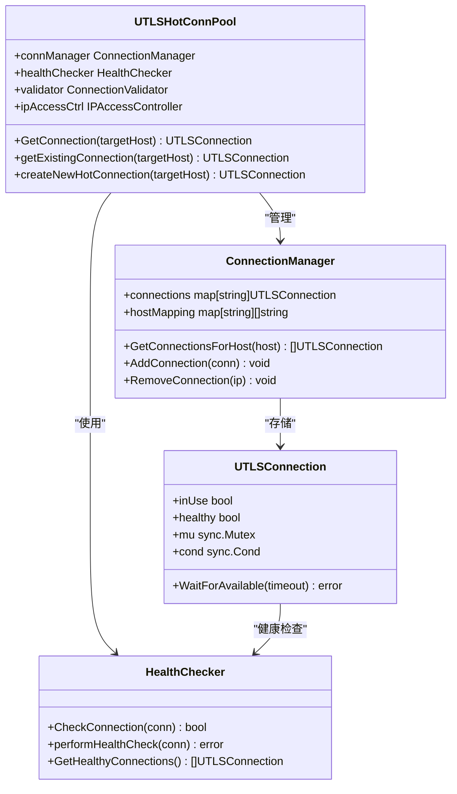
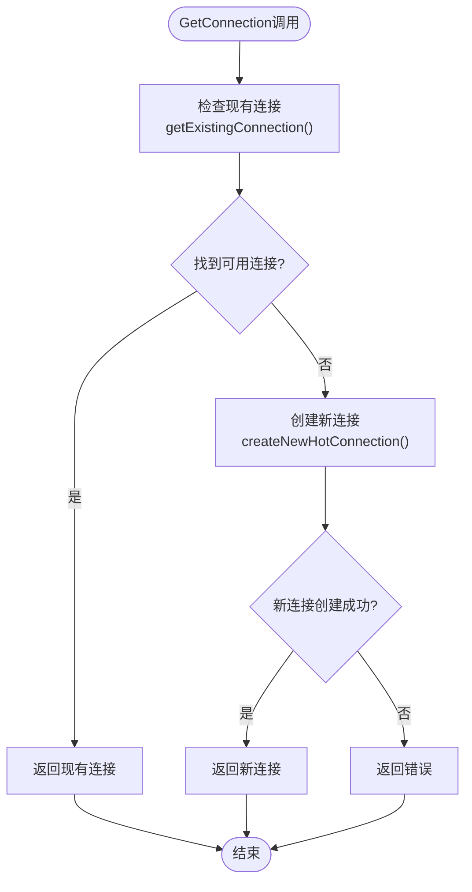
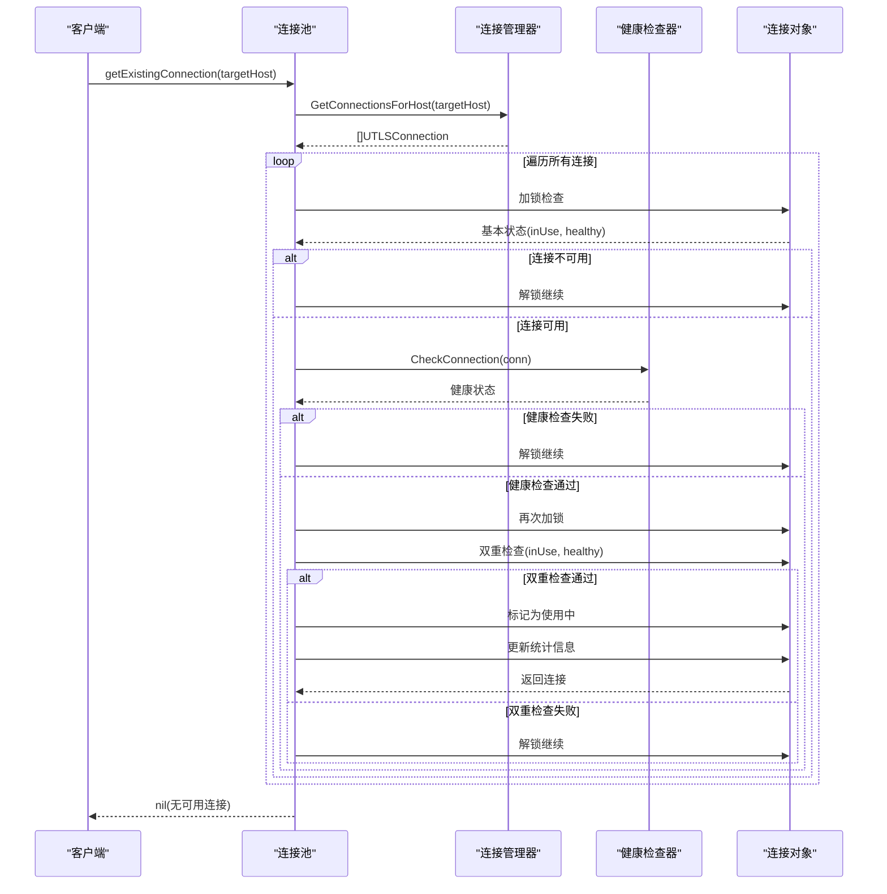
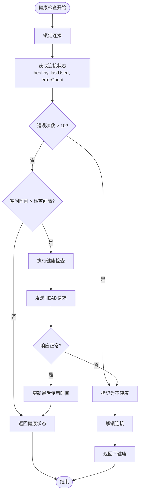
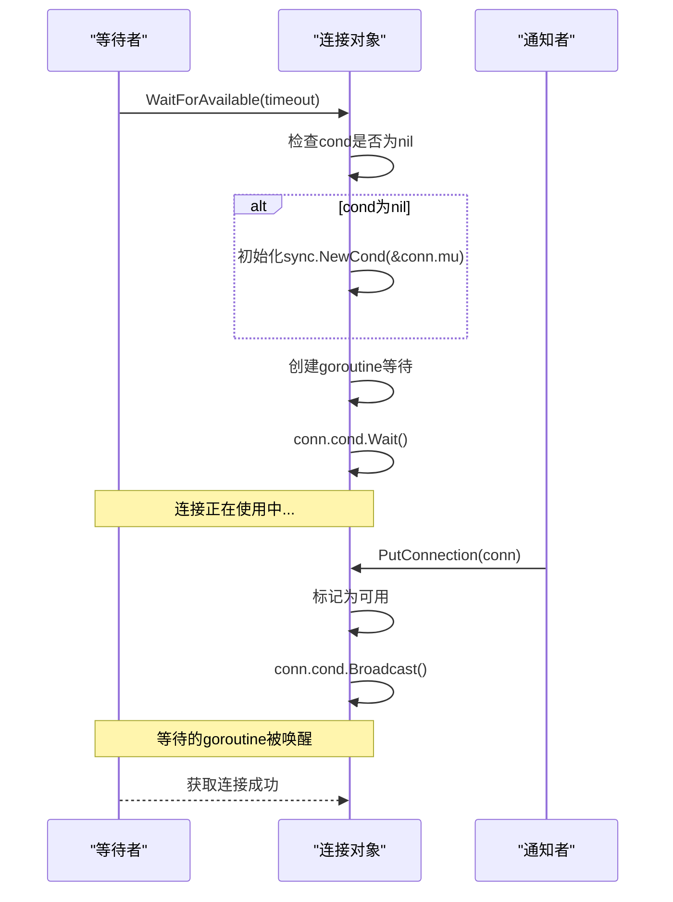
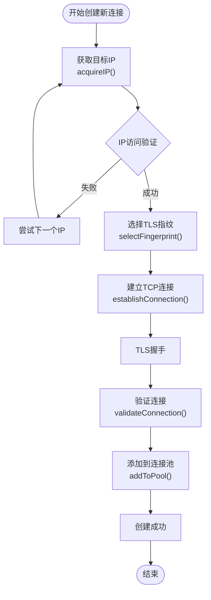
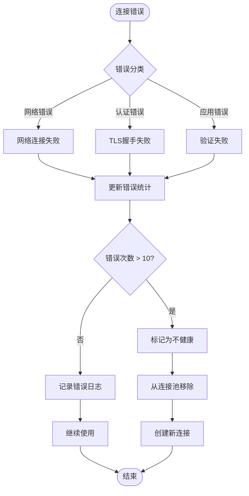

# 连接获取机制详细文档

<cite>
**本文档引用的文件**
- [utlsclient/utlshotconnpool.go](file://utlsclient/utlshotconnpool.go)
- [utlsclient/connection_manager.go](file://utlsclient/connection_manager.go)
- [utlsclient/health_checker.go](file://utlsclient/health_checker.go)
- [utlsclient/connection_validator.go](file://utlsclient/connection_validator.go)
- [utlsclient/ip_access_controller.go](file://utlsclient/ip_access_controller.go)
- [utlsclient/test_helpers.go](file://utlsclient/test_helpers.go)
</cite>

## 目录
1. [概述](#概述)
2. [核心架构](#核心架构)
3. [GetConnection函数详解](#getconnection函数详解)
4. [连接选择策略](#连接选择策略)
5. [健康检查机制](#健康检查机制)
6. [条件变量与并发控制](#条件变量与并发控制)
7. [连接创建流程](#连接创建流程)
8. [超时处理与错误传播](#超时处理与错误传播)
9. [最佳实践](#最佳实践)
10. [故障排除指南](#故障排除指南)

## 概述

连接获取机制是热连接池的核心功能，负责从连接池中高效地检索可用连接或创建新的连接。该机制通过多层次的检查和优化策略，确保在高并发场景下提供稳定、高效的连接服务。

### 主要特性

- **智能连接复用**：优先从连接池中获取现有连接
- **双重检查锁定**：确保连接获取的线程安全性
- **健康检查集成**：实时验证连接可用性
- **条件变量同步**：支持连接等待队列机制
- **超时处理**：优雅处理连接获取超时情况

## 核心架构

连接获取机制由以下核心组件构成：

**图表来源**
- [utlsclient/utlshotconnpool.go](file://utlsclient/utlshotconnpool.go#L236-L257)
- [utlsclient/connection_manager.go](file://utlsclient/connection_manager.go#L8-L13)
- [utlsclient/health_checker.go](file://utlsclient/health_checker.go#L9-L12)

**章节来源**
- [utlsclient/utlshotconnpool.go](file://utlsclient/utlshotconnpool.go#L236-L257)
- [utlsclient/connection_manager.go](file://utlsclient/connection_manager.go#L8-L13)

## GetConnection函数详解

GetConnection函数是连接获取机制的入口点，采用两阶段策略：先尝试获取现有连接，若无可用则创建新连接。

### 函数签名与流程

**图表来源**
- [utlsclient/utlshotconnpool.go](file://utlsclient/utlshotconnpool.go#L351-L359)

### 实现细节

GetConnection函数的核心逻辑包含以下关键步骤：

1. **现有连接检查**：调用`getExistingConnection()`尝试从连接池中获取可用连接
2. **连接有效性验证**：确保获取的连接处于健康状态且未被其他goroutine占用
3. **新连接创建**：当无可用连接时，调用`createNewHotConnection()`创建新连接
4. **错误处理**：妥善处理各种异常情况，包括连接创建失败等

**章节来源**
- [utlsclient/utlshotconnpool.go](file://utlsclient/utlshotconnpool.go#L351-L359)

## 连接选择策略

连接选择策略是连接获取机制的核心算法，通过多层过滤确保获取最合适的连接。

### getExistingConnection方法分析

**图表来源**
- [utlsclient/utlshotconnpool.go](file://utlsclient/utlshotconnpool.go#L441-L480)

### 双重检查锁定机制

双重检查锁定是确保连接获取线程安全的关键机制：

1. **第一次检查**：在持有锁的情况下检查连接的基本状态（inUse, healthy）
2. **解锁操作**：释放锁以便进行耗时的健康检查
3. **健康检查**：调用`healthChecker.CheckConnection()`验证连接可用性
4. **第二次检查**：再次加锁并进行双重检查，防止在解锁期间被其他goroutine获取

这种设计避免了长时间持有锁，提高了并发性能，同时确保了数据一致性。

**章节来源**
- [utlsclient/utlshotconnpool.go](file://utlsclient/utlshotconnpool.go#L441-L480)

## 健康检查机制

健康检查机制确保获取的连接始终处于可用状态，通过多层次的检查策略保证连接质量。

### 健康检查流程

**图表来源**
- [utlsclient/health_checker.go](file://utlsclient/health_checker.go#L23-L60)

### 健康检查策略

健康检查器采用分层检查策略：

1. **错误计数检查**：如果连接错误次数超过10次，立即标记为不健康
2. **空闲时间检查**：只有当连接空闲时间超过健康检查间隔时才进行检查
3. **网络健康检查**：发送简单的HEAD请求验证连接可用性
4. **状态更新**：根据检查结果更新连接的健康状态

**章节来源**
- [utlsclient/health_checker.go](file://utlsclient/health_checker.go#L23-L60)

## 条件变量与并发控制

条件变量是连接等待队列机制的核心，支持高并发场景下的连接复用。

### 条件变量机制

**图表来源**
- [utlsclient/utlshotconnpool.go](file://utlsclient/utlshotconnpool.go#L1297-L1324)

### 并发控制策略

1. **连接级锁**：每个连接都有独立的互斥锁，减少锁竞争
2. **条件变量**：支持连接等待队列，提高资源利用率
3. **原子操作**：使用原子操作更新请求计数等统计信息
4. **读写锁**：连接管理器使用读写锁优化并发性能

**章节来源**
- [utlsclient/utlshotconnpool.go](file://utlsclient/utlshotconnpool.go#L1297-L1324)

## 连接创建流程

当没有可用连接时，系统会自动创建新的热连接，这一过程涉及多个组件的协调工作。

### 新连接创建流程

**图表来源**
- [utlsclient/utlshotconnpool.go](file://utlsclient/utlshotconnpool.go#L529-L531)

### 连接验证机制

新创建的连接必须通过严格验证才能投入使用：

1. **基础连接验证**：检查TCP连接和TLS握手是否成功
2. **协议协商验证**：确认协商的协议（HTTP/1.1或HTTP/2）
3. **路径验证**：发送HEAD请求验证指定路径的可用性
4. **状态码检查**：确保响应状态码在200-399范围内

**章节来源**
- [utlsclient/utlshotconnpool.go](file://utlsclient/utlshotconnpool.go#L529-L531)

## 超时处理与错误传播

连接获取机制实现了完善的超时处理和错误传播机制，确保系统的健壮性。

### 超时处理策略

| 场景 | 超时类型 | 默认值 | 可配置 |
|------|----------|--------|--------|
| 连接建立 | ConnTimeout | 30秒 | 是 |
| 健康检查 | TestTimeout | 10秒 | 是 |
| 连接等待 | WaitForAvailable | 可配置 | 是 |
| DNS更新 | DNSUpdateInterval | 30分钟 | 是 |

### 错误传播机制

**图表来源**
- [utlsclient/health_checker.go](file://utlsclient/health_checker.go#L23-L60)

**章节来源**
- [utlsclient/health_checker.go](file://utlsclient/health_checker.go#L23-L60)

## 最佳实践

### 连接池配置优化

1. **合理设置最大连接数**：根据并发需求和服务器承载能力确定
2. **优化健康检查间隔**：平衡检查频率和性能开销
3. **配置适当的超时时间**：避免长时间阻塞等待
4. **启用连接预热**：在高负载前预先建立连接

### 监控与维护

1. **定期监控连接池状态**：关注连接数量、健康状态和错误率
2. **实施健康检查**：定期验证连接池的整体健康状况
3. **清理无效连接**：及时移除不健康的连接
4. **动态调整配置**：根据运行时指标动态优化参数

### 错误处理建议

1. **实现重试机制**：对于临时性错误进行指数退避重试
2. **记录详细日志**：便于问题诊断和性能分析
3. **设置告警阈值**：当错误率超过阈值时及时告警
4. **提供降级方案**：在极端情况下提供备用连接策略

## 故障排除指南

### 常见问题及解决方案

| 问题类型 | 症状 | 可能原因 | 解决方案 |
|----------|------|----------|----------|
| 连接获取超时 | GetConnection返回超时错误 | 连接池满载、网络延迟高 | 增加连接池大小、优化网络配置 |
| 连接频繁断开 | 连接经常被移除 | 目标服务器不稳定、健康检查过于严格 | 调整健康检查参数、增加重试次数 |
| 性能下降 | 连接获取响应时间长 | 锁竞争严重、健康检查耗时 | 优化并发控制、异步健康检查 |
| 内存泄漏 | 连接池持续增长 | 连接未正确归还 | 检查PutConnection调用、监控连接生命周期 |

### 调试技巧

1. **启用详细日志**：设置DEBUG级别日志记录连接获取过程
2. **监控连接统计**：定期检查连接池统计信息
3. **压力测试**：模拟高并发场景验证系统稳定性
4. **性能分析**：使用pprof工具分析性能瓶颈

### 性能优化建议

1. **连接复用优化**：提高连接复用率，减少连接创建开销
2. **并发控制优化**：合理设置并发度，避免过度竞争
3. **内存管理优化**：及时清理无用连接，减少内存占用
4. **网络优化**：使用连接池预热、Keep-Alive等技术

通过深入理解连接获取机制的设计原理和实现细节，开发者可以更好地利用热连接池的功能，构建高性能、高可靠的网络应用程序。