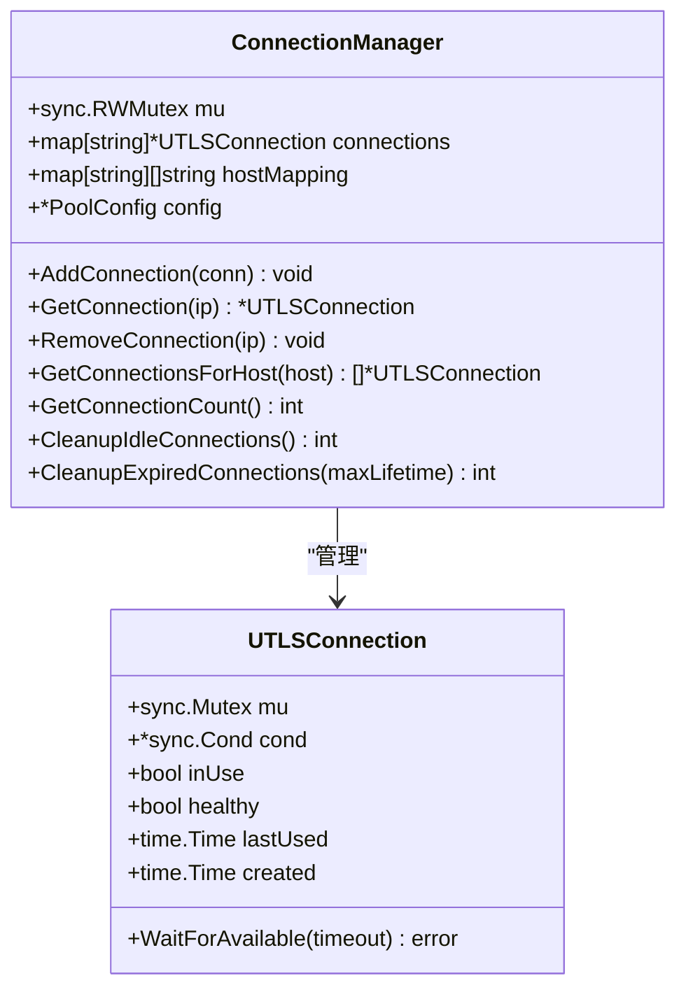
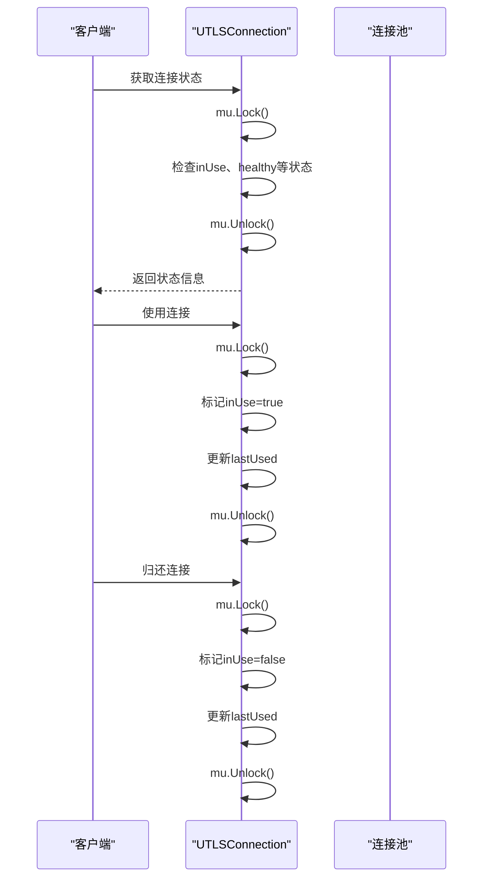
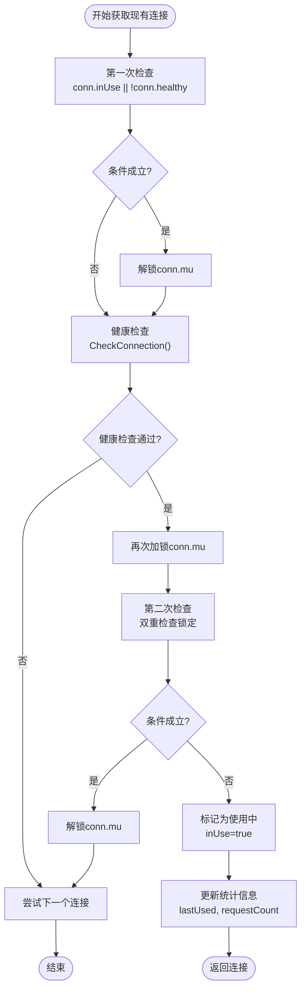
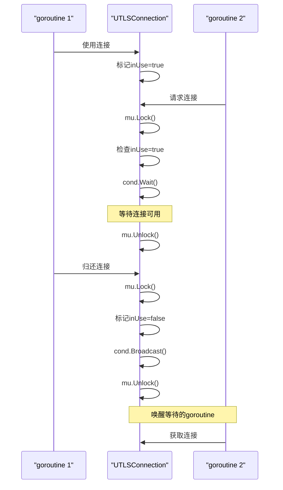
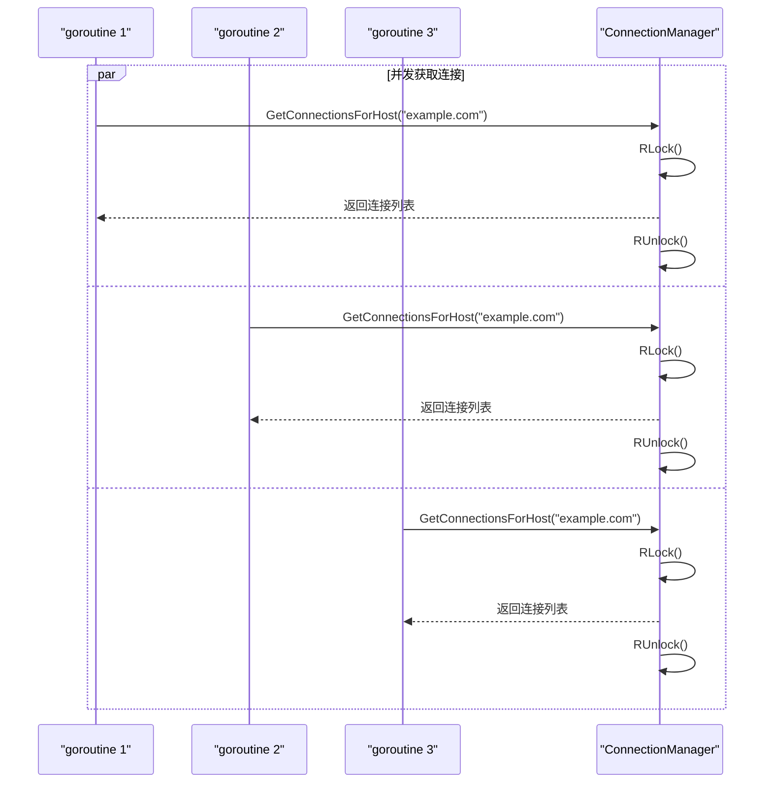
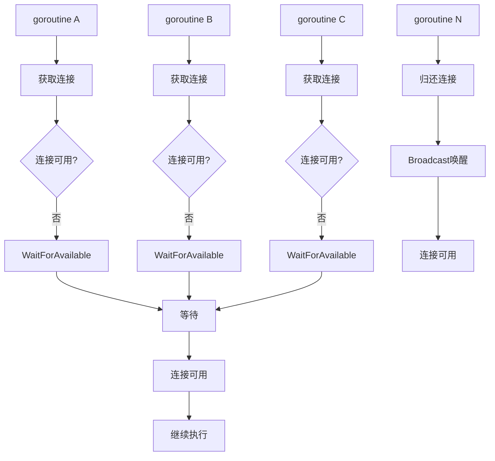

# 连接并发控制

<cite>
**本文档引用的文件**
- [connection_manager.go](file://utlsclient/connection_manager.go)
- [utlshotconnpool.go](file://utlsclient/utlshotconnpool.go)
- [connection_manager_test.go](file://test/utlsclient/connection_manager_test.go)
- [localippool.go](file://localippool/localippool.go)
</cite>

## 目录
1. [概述](#概述)
2. [ConnectionManager并发架构](#connectionmanager并发架构)
3. [UTLSConnection并发控制](#utlsconnection并发控制)
4. [双重检查锁定模式](#双重检查锁定模式)
5. [连接条件变量机制](#连接条件变量机制)
6. [高并发场景下的性能特征](#高并发场景下的性能特征)
7. [典型并发使用场景](#典型并发使用场景)
8. [性能优化建议](#性能优化建议)
9. [总结](#总结)

## 概述

连接并发控制是热连接池系统的核心机制，确保在高并发环境下连接的安全管理和高效复用。该系统采用分层并发控制策略，通过读写锁、互斥锁和条件变量的组合，实现了连接级别的精确控制和高效的并发访问。

## ConnectionManager并发架构

### 读写锁设计原理

ConnectionManager采用sync.RWMutex作为主要的并发控制机制，这种设计遵循读多写少的访问模式：

**图表来源**
- [connection_manager.go](file://utlsclient/connection_manager.go#L9-L13)
- [utlshotconnpool.go](file://utlsclient/utlshotconnpool.go#L205-L234)

### 读操作的读锁保护

所有读操作（GetConnection、GetConnectionsForHost、GetConnectionCount等）都使用读锁，允许多个goroutine同时访问：

- **GetConnection**: 通过IP快速查找连接，使用读锁保护map访问
- **GetConnectionsForHost**: 获取域名对应的所有连接，使用读锁遍历映射
- **GetConnectionCount**: 统计连接总数，使用读锁访问连接数量

### 写操作的写锁保护

所有写操作（AddConnection、RemoveConnection、CleanupIdleConnections等）都使用写锁，确保数据一致性：

- **AddConnection**: 添加新连接时，需要同时更新两个映射表
- **RemoveConnection**: 移除连接时，需要同步清理两个映射关系
- **Cleanup操作**: 清理空闲或过期连接时，需要原子性地检查和移除

**章节来源**
- [connection_manager.go](file://utlsclient/connection_manager.go#L26-L218)

## UTLSConnection并发控制

### 连接级别互斥锁

每个UTLSConnection实例都配备独立的sync.Mutex，用于保护连接级别的状态变量：

**图表来源**
- [utlshotconnpool.go](file://utlsclient/utlshotconnpool.go#L1297-L1324)

### 状态变量保护机制

连接级别的互斥锁保护以下关键状态变量：

- **inUse**: 标识连接是否正在被使用，防止并发使用同一连接
- **healthy**: 维护连接的健康状态，确保只使用健康的连接
- **lastUsed**: 记录最后使用时间，用于空闲连接清理
- **created**: 记录连接创建时间，用于生命周期管理
- **requestCount**: 统计请求次数，用于负载均衡
- **errorCount**: 统计错误次数，用于健康检查

### HTTP/2连接专用锁

对于支持HTTP/2的连接，额外使用h2Mu互斥锁保护HTTP/2特定的状态：

- **h2ClientConn**: HTTP/2客户端连接对象
- **并发安全**: 确保HTTP/2连接的并发操作安全

**章节来源**
- [utlshotconnpool.go](file://utlsclient/utlshotconnpool.go#L205-L234)

## 双重检查锁定模式

### getExistingConnection中的双重检查

在连接复用场景中，系统采用双重检查锁定模式来避免竞态条件：

**图表来源**
- [utlshotconnpool.go](file://utlsclient/utlshotconnpool.go#L442-L478)

### 双重检查的必要性

双重检查锁定模式解决了以下问题：

1. **竞态条件避免**: 在第一次检查和第二次检查之间，其他goroutine可能修改连接状态
2. **性能优化**: 第一次检查使用读锁，避免不必要的写锁开销
3. **安全性保证**: 确保只有真正可用的连接才会被标记为使用中

### 实现细节分析

在getExistingConnection方法中，双重检查的具体实现：

1. **第一次检查**: 检查基本条件（inUse、healthy），不持有锁
2. **健康检查**: 在释放锁的情况下进行健康检查，避免死锁
3. **第二次检查**: 再次确认连接状态，确保在两次检查之间没有被其他goroutine修改

**章节来源**
- [utlshotconnpool.go](file://utlsclient/utlshotconnpool.go#L442-L478)

## 连接过条件变量机制

### 条件变量的作用

UTLSConnection中的sync.Cond条件变量用于连接复用等待机制：

**图表来源**
- [utlshotconnpool.go](file://utlsclient/utlshotconnpool.go#L1297-L1324)

### WaitForAvailable方法实现

WaitForAvailable方法展示了条件变量的典型使用模式：

1. **条件检查**: 检查连接是否可用（inUse=false）
2. **等待机制**: 使用cond.Wait()阻塞等待连接可用
3. **广播唤醒**: 当连接归还时，使用cond.Broadcast()唤醒所有等待的goroutine

### 条件变量初始化

条件变量在连接创建时初始化，确保并发安全：

- **初始化时机**: 在establishConnection方法中创建连接时
- **线程安全**: 使用conn.mu作为条件变量的基础锁
- **错误处理**: 如果cond为nil，会创建新的条件变量

**章节来源**
- [utlshotconnpool.go](file://utlsclient/utlshotconnpool.go#L1297-L1324)

## 高并发场景下的性能特征

### 并发性能分析

系统在高并发场景下的性能特征如下：

| 并发操作类型 | 锁竞争程度 | 性能影响 | 优化策略 |
|-------------|-----------|---------|---------|
| 连接读取操作 | 低 | 几乎无开销 | 读写分离，读锁并发 |
| 连接写入操作 | 中等 | 中等开销 | 写锁保护，批量操作 |
| 连接状态检查 | 低 | 轻微开销 | 连接级锁，细粒度控制 |
| 连接复用等待 | 中等 | 等待开销 | 条件变量，批量唤醒 |

### 性能瓶颈识别

1. **ConnectionManager写锁竞争**: 在大量连接添加/移除时可能出现竞争
2. **UTLSConnection锁竞争**: 在高并发使用/归还连接时可能出现竞争
3. **健康检查并发**: 大量连接的健康检查可能成为瓶颈

### 并发测试验证

系统提供了全面的并发测试覆盖：

- **并发添加连接**: 验证AddConnection的并发安全性
- **并发获取连接**: 验证GetConnection系列方法的并发性能
- **并发清理操作**: 验证Cleanup系列方法的并发正确性

**章节来源**
- [connection_manager_test.go](file://test/utlsclient/connection_manager_test.go#L181-L229)

## 典型并发使用场景

### 场景一：高并发连接获取

### 场景二：连接复用等待机制

### 场景三：并发连接清理

系统支持并发的连接清理操作，不会阻塞正常的连接获取：

- **后台清理任务**: 健康检查、空闲清理、过期清理并行执行
- **清理过程隔离**: 清理操作不影响正常连接的获取和使用
- **资源回收**: 自动回收不再使用的连接资源

**章节来源**
- [utlshotconnpool.go](file://utlsclient/utlshotconnpool.go#L809-L889)

## 性能优化建议

### 锁粒度优化

1. **读写分离**: 使用RWMutex区分读写操作，提高读并发性能
2. **细粒度锁**: 连接级别的互斥锁减少锁竞争
3. **条件变量**: 使用Wait/Signal机制减少忙等待

### 并发控制策略

1. **批量操作**: 在可能的情况下使用批量操作减少锁开销
2. **异步清理**: 后台任务异步执行清理操作
3. **连接预热**: 预先建立连接池，减少运行时创建开销

### 监控和调优

1. **性能监控**: 监控锁竞争指标和等待时间
2. **动态调整**: 根据负载动态调整连接池参数
3. **容量规划**: 合理设置最大连接数和超时参数

## 总结

连接并发控制系统通过分层的锁机制实现了高效的安全并发访问：

1. **ConnectionManager**: 使用读写锁实现连接级别的粗粒度控制
2. **UTLSConnection**: 使用互斥锁实现连接状态的细粒度保护
3. **双重检查**: 避免竞态条件，确保并发安全性
4. **条件变量**: 提供高效的连接复用等待机制

这种设计在保证线程安全的同时，最大化了并发性能，适用于高并发的网络应用场景。系统的模块化设计使得各个组件职责清晰，便于维护和扩展。