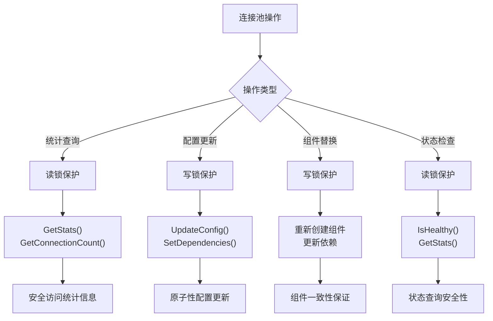
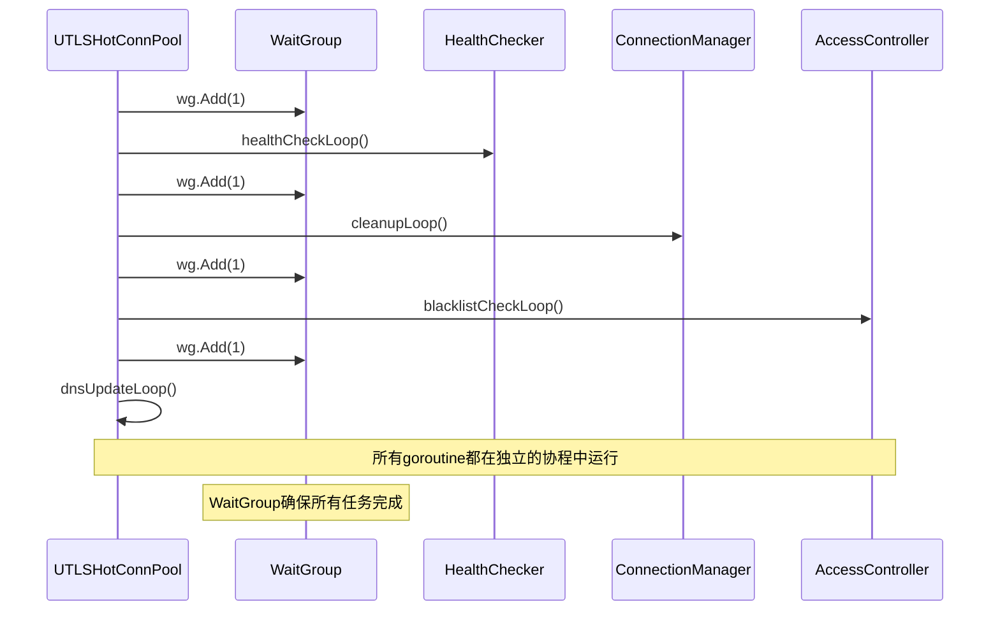
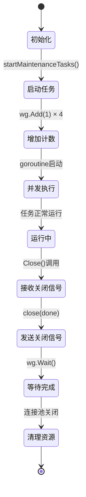
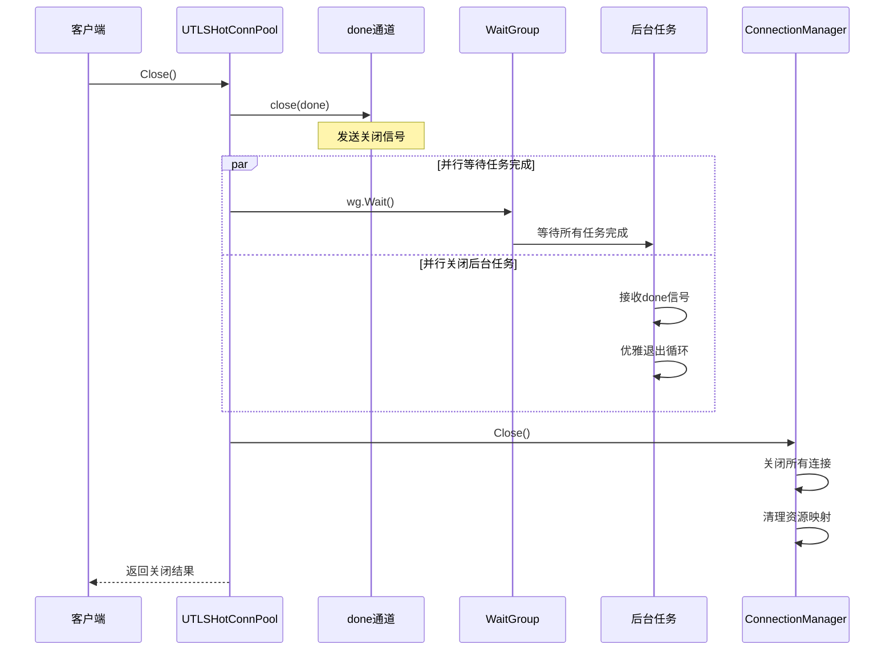
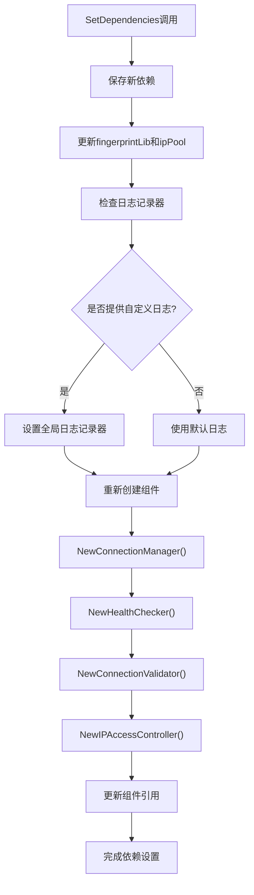
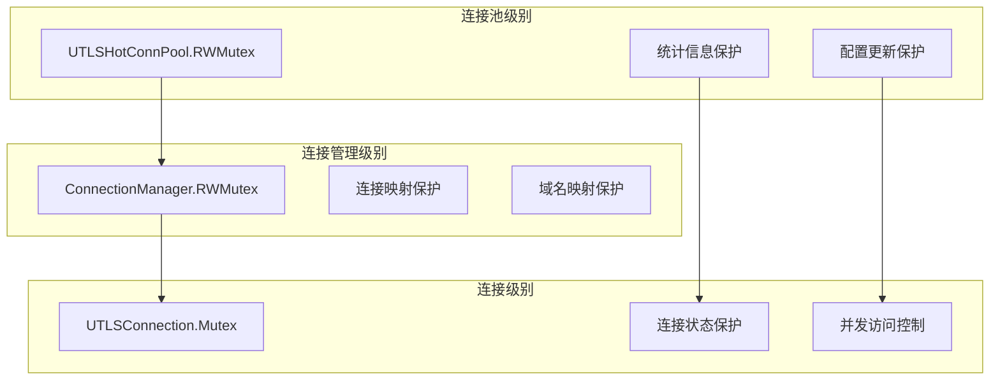

# 连接池级别并发控制

<cite>
**本文档引用的文件**
- [utlshotconnpool.go](file://utlsclient/utlshotconnpool.go)
- [connection_manager.go](file://utlsclient/connection_manager.go)
- [health_checker.go](file://utlsclient/health_checker.go)
- [ip_access_controller.go](file://utlsclient/ip_access_controller.go)
- [utlshotconnpool_test.go](file://test/utlsclient/utlshotconnpool_test.go)
- [utlshotconnpool_public_test.go](file://test/utlsclient/utlshotconnpool_public_test.go)
</cite>

## 目录
1. [概述](#概述)
2. [UTLSHotConnPool结构体设计](#utlshotconnpool结构体设计)
3. [顶层读写锁机制](#顶层读写锁机制)
4. [后台维护任务并发控制](#后台维护任务并发控制)
5. [连接池关闭流程](#连接池关闭流程)
6. [组件重新创建的并发安全](#组件重新创建的并发安全)
7. [并发性能特征分析](#并发性能特征分析)
8. [总结](#总结)

## 概述

UTLSHotConnPool是爬虫平台中的核心连接池组件，采用多层次的并发控制策略来确保连接池的线程安全性和高性能。该连接池实现了复杂的后台维护机制，包括健康检查、清理任务、黑名单检查和DNS更新等功能，这些功能通过精心设计的并发控制机制协同工作。

## UTLSHotConnPool结构体设计

UTLSHotConnPool作为连接池的核心控制器，采用了组件化的设计模式，将不同的功能职责分离到专门的组件中：

```mermaid
classDiagram
class UTLSHotConnPool {
-connManager *ConnectionManager
-healthChecker *HealthChecker
-validator *ConnectionValidator
-ipAccessCtrl *IPAccessController
-config PoolConfig
-stats PoolStats
-mu sync.RWMutex
-done chan struct{}
-wg sync.WaitGroup
+GetConnection(targetHost) *UTLSConnection
+PutConnection(conn) void
+GetStats() PoolStats
+Close() error
+SetDependencies() void
+startMaintenanceTasks() void
}
class ConnectionManager {
-mu sync.RWMutex
-connections map[string]*UTLSConnection
-hostMapping map[string][]string
+AddConnection(conn) void
+RemoveConnection(ip) void
+GetConnectionsForHost(host) []*UTLSConnection
+CleanupIdleConnections() int
+CleanupExpiredConnections() int
}
class HealthChecker {
-connManager *ConnectionManager
-config *PoolConfig
+CheckConnection(conn) bool
+CheckAllConnections() void
+CleanupUnhealthyConnections() int
}
class IPAccessController {
-whitelist map[string]bool
-blacklist map[string]bool
-mu sync.RWMutex
+IsIPAllowed(ip) bool
+AddIP(ip, isWhite) void
+GetAllowedIPs() []string
+GetBlockedIPs() []string
}
UTLSHotConnPool --> ConnectionManager : "管理"
UTLSHotConnPool --> HealthChecker : "使用"
UTLSHotConnPool --> IPAccessController : "控制"
HealthChecker --> ConnectionManager : "检查"
```

**图表来源**
- [utlshotconnpool.go](file://utlsclient/utlshotconnpool.go#L236-L258)
- [connection_manager.go](file://utlsclient/connection_manager.go#L8-L14)
- [health_checker.go](file://utlsclient/health_checker.go#L9-L13)
- [ip_access_controller.go](file://utlsclient/ip_access_controller.go#L7-L12)

**节来源**
- [utlshotconnpool.go](file://utlsclient/utlshotconnpool.go#L236-L258)

## 顶层读写锁机制

UTLSHotConnPool结构体中的`sync.RWMutex`是连接池级别的顶层读写锁，主要用于保护连接池的整体状态和统计信息的更新操作。

### 使用场景分析

1. **统计信息更新保护**
   - 在`GetStats()`方法中，当需要遍历所有连接并计算统计信息时，使用读锁保护整个操作过程
   - 在`UpdateConfig()`方法中，当更新连接池配置时，使用写锁确保配置更新的原子性

2. **后台任务协调**
   - 在启动和关闭后台维护任务时，使用读锁确保任务状态的一致性
   - 在访问连接池的全局状态时，使用适当的锁级别避免数据竞争

3. **组件状态同步**
   - 在`SetDependencies()`方法中，当重新创建组件时，使用写锁确保组件替换的原子性

### 锁粒度设计



**图表来源**
- [utlshotconnpool.go](file://utlsclient/utlshotconnpool.go#L1424-L1430)
- [utlshotconnpool.go](file://utlsclient/utlshotconnpool.go#L1099-L1159)

**节来源**
- [utlshotconnpool.go](file://utlsclient/utlshotconnpool.go#L1424-L1430)
- [utlshotconnpool.go](file://utlsclient/utlshotconnpool.go#L1099-L1159)

## 后台维护任务并发控制

连接池启动了四个主要的后台维护任务，每个任务都有独立的并发控制机制：

### startMaintenanceTasks方法分析



**图表来源**
- [utlshotconnpool.go](file://utlsclient/utlshotconnpool.go#L795-L810)

### 各任务的并发控制机制

1. **健康检查任务 (healthCheckLoop)**
   - 使用`time.Ticker`定期触发健康检查
   - 通过`done`通道实现优雅退出
   - 使用`defer p.wg.Done()`确保任务完成通知

2. **清理任务 (cleanupLoop)**
   - 定期清理空闲和过期连接
   - 使用`ConnectionManager`的写锁保护清理操作
   - 通过`done`通道支持提前终止

3. **黑名单检查任务 (blacklistCheckLoop)**
   - 定期检查黑名单状态
   - 使用`IPAccessController`的读锁保护IP访问控制
   - 支持动态IP状态迁移

4. **DNS更新任务 (dnsUpdateLoop)**
   - 定期更新域名解析结果
   - 使用并发机制处理多个域名的IP更新
   - 通过`done`通道实现优雅关闭

### WaitGroup生命周期管理



**图表来源**
- [utlshotconnpool.go](file://utlsclient/utlshotconnpool.go#L795-L810)
- [utlshotconnpool.go](file://utlsclient/utlshotconnpool.go#L1176-L1185)

**节来源**
- [utlshotconnpool.go](file://utlsclient/utlshotconnpool.go#L795-L810)
- [utlshotconnpool.go](file://utlsclient/utlshotconnpool.go#L1176-L1185)

## 连接池关闭流程

连接池的关闭流程体现了精心设计的并发控制策略，确保所有后台任务能够优雅地退出：

### 关闭序列图



**图表来源**
- [utlshotconnpool.go](file://utlsclient/utlshotconnpool.go#L1176-L1185)

### 关闭流程的关键特性

1. **信号传播机制**
   - `close(p.done)`确保所有后台任务都能收到关闭信号
   - 使用select语句在各个任务中监听`done`通道

2. **任务等待机制**
   - `p.wg.Wait()`确保所有后台任务都已完成
   - 使用`defer p.wg.Done()`确保每个任务都能正确通知完成

3. **资源清理顺序**
   - 先关闭后台任务，再关闭连接池
   - 确保在清理连接之前所有维护任务都已停止

**节来源**
- [utlshotconnpool.go](file://utlsclient/utlshotconnpool.go#L1176-L1185)

## 组件重新创建的并发安全

在`SetDependencies()`方法中，连接池需要重新创建核心组件以适应新的依赖配置。这个过程必须保证并发安全：

### 重新创建流程



**图表来源**
- [utlshotconnpool.go](file://utlsclient/utlshotconnpool.go#L321-L348)

### 并发安全保障

1. **写锁保护**
   - 在`SetDependencies()`方法中使用写锁保护整个操作
   - 确保在组件重新创建过程中没有其他goroutine访问旧组件

2. **原子性更新**
   - 所有组件的重新创建完成后才更新引用
   - 避免部分更新导致的不一致状态

3. **依赖隔离**
   - 新的依赖配置只影响后续的操作
   - 旧的配置仍然可以安全地被正在执行的任务使用

**节来源**
- [utlshotconnpool.go](file://utlsclient/utlshotconnpool.go#L321-L348)

## 并发性能特征分析

### 锁的粒度分析

连接池采用了多层次的锁策略，每种锁都有特定的用途和性能特征：

| 锁类型 | 用途 | 锁范围 | 性能影响 |
|--------|------|--------|----------|
| RWMutex (UTLSHotConnPool) | 连接池状态保护 | 整个连接池 | 中等 - 读多写少 |
| RWMutex (ConnectionManager) | 连接映射保护 | 连接管理器 | 高 - 频繁的读写 |
| Mutex (UTLSConnection) | 单连接状态保护 | 单个连接 | 低 - 独立的连接 |
| RWMutex (IPAccessController) | 访问控制保护 | IP黑白名单 | 中等 - 读写混合 |

### 潜在瓶颈分析

1. **ConnectionManager的写锁**
   - 在高并发场景下，连接的添加和移除可能成为瓶颈
   - 解决方案：考虑使用更细粒度的锁或无锁数据结构

2. **UTLSHotConnPool的读写锁**
   - 统计信息的频繁读取可能影响性能
   - 解决方案：使用原子操作或缓存机制

3. **后台任务的竞争**
   - 多个后台任务可能竞争相同的资源
   - 解决方案：合理分配任务优先级和执行频率

### 与连接级别锁的协同



**图表来源**
- [connection_manager.go](file://utlsclient/connection_manager.go#L8-L14)
- [utlshotconnpool.go](file://utlsclient/utlshotconnpool.go#L236-L258)

**节来源**
- [connection_manager.go](file://utlsclient/connection_manager.go#L8-L14)
- [utlshotconnpool.go](file://utlsclient/utlshotconnpool.go#L236-L258)

## 总结

UTLSHotConnPool的并发控制设计体现了以下关键原则：

1. **分层锁设计**：不同层次的锁保护不同范围的操作，避免锁竞争
2. **优雅关闭**：通过done通道和WaitGroup实现后台任务的优雅退出
3. **组件化架构**：将不同功能分离到独立组件，简化并发控制复杂度
4. **性能优化**：使用读写锁减少写操作对读操作的影响

这种设计确保了连接池在高并发环境下的稳定性和性能，同时保持了代码的可维护性和可扩展性。通过合理的锁策略和后台任务管理，连接池能够在各种负载条件下提供可靠的服务。