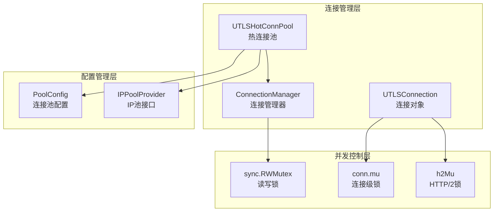
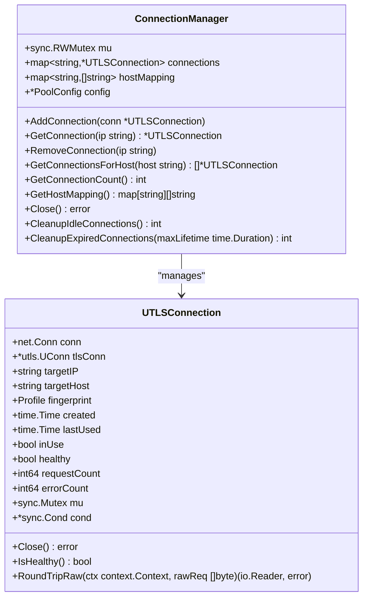
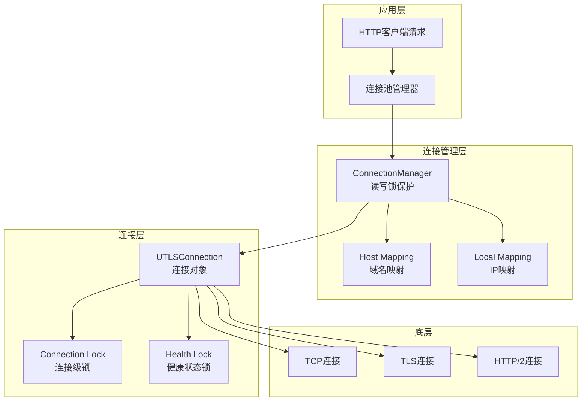
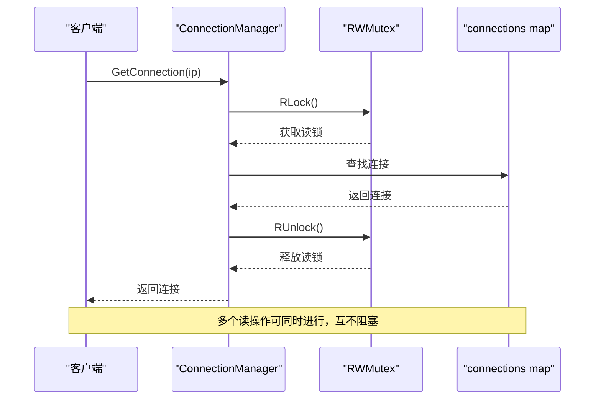
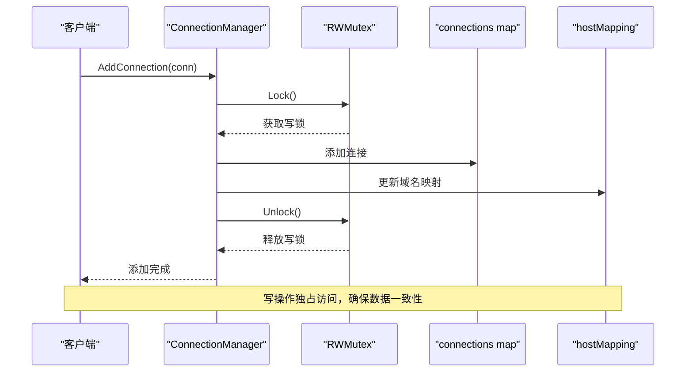
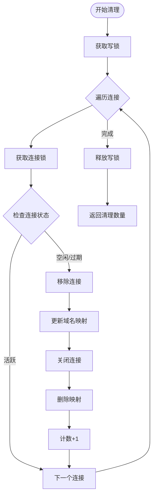
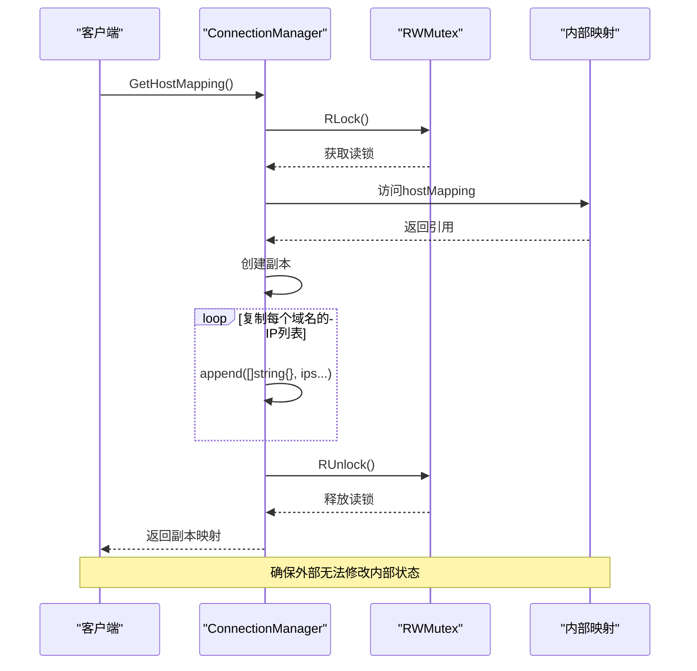
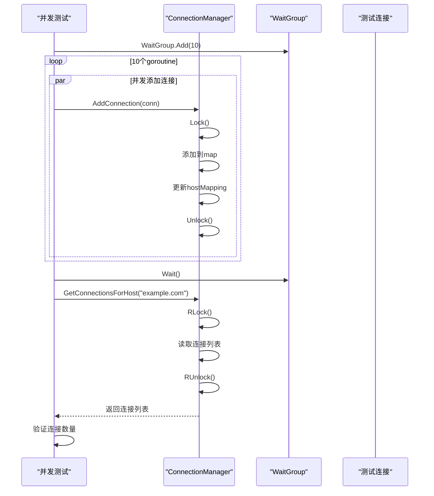
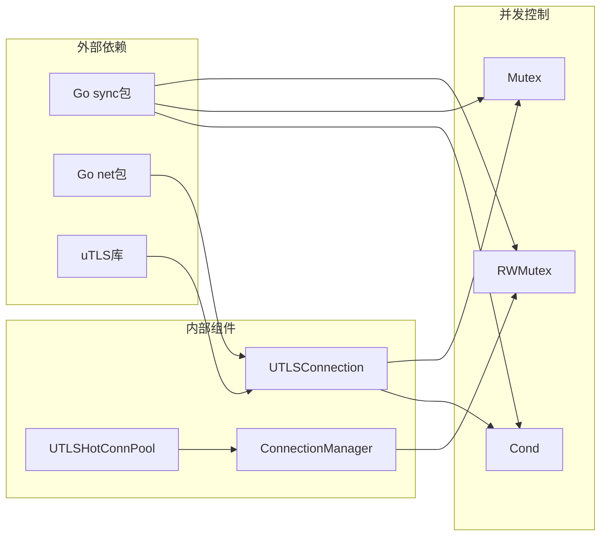

# 连接管理器并发控制

<cite>
**本文档引用的文件**
- [connection_manager.go](file://utlsclient/connection_manager.go)
- [connection_manager_test.go](file://test/utlsclient/connection_manager_test.go)
- [utlshotconnpool.go](file://utlsclient/utlshotconnpool.go)
- [interfaces.go](file://utlsclient/interfaces.go)
- [constants.go](file://utlsclient/constants.go)
- [test_helpers.go](file://utlsclient/test_helpers.go)
- [utlsclient.go](file://utlsclient/utlsclient.go)
</cite>

## 目录
1. [引言](#引言)
2. [项目结构概述](#项目结构概述)
3. [核心组件分析](#核心组件分析)
4. [架构概览](#架构概览)
5. [详细组件分析](#详细组件分析)
6. [依赖关系分析](#依赖关系分析)
7. [性能考虑](#性能考虑)
8. [故障排除指南](#故障排除指南)
9. [结论](#结论)

## 引言

连接管理器并发控制是爬虫平台中关键的性能优化机制，它通过精心设计的读写锁策略和多层并发控制机制，确保在高并发场景下的连接管理高效、安全且可扩展。本文档深入分析ConnectionManager中读写锁的应用原理、并发控制策略以及在实际高并发场景中的性能表现。

## 项目结构概述

该项目采用模块化架构，主要包含以下核心模块：

**图表来源**
- [connection_manager.go](file://utlsclient/connection_manager.go#L8-L14)
- [utlshotconnpool.go](file://utlsclient/utlshotconnpool.go#L204-L233)

**章节来源**
- [connection_manager.go](file://utlsclient/connection_manager.go#L1-L218)
- [utlshotconnpool.go](file://utlsclient/utlshotconnpool.go#L1-L200)

## 核心组件分析

### ConnectionManager 结构体设计

ConnectionManager是连接管理的核心组件，采用读写锁机制来平衡读写操作的性能需求：

**图表来源**
- [connection_manager.go](file://utlsclient/connection_manager.go#L8-L14)
- [utlshotconnpool.go](file://utlsclient/utlshotconnpool.go#L204-L233)

**章节来源**
- [connection_manager.go](file://utlsclient/connection_manager.go#L8-L23)

## 架构概览

连接管理器采用分层并发控制架构，通过不同级别的锁机制确保数据一致性和并发性能：

**图表来源**
- [connection_manager.go](file://utlsclient/connection_manager.go#L25-L74)
- [utlshotconnpool.go](file://utlsclient/utlshotconnpool.go#L1248-L1271)

## 详细组件分析

### 读写锁设计原理

ConnectionManager中的读写锁设计体现了对高并发场景的深度优化：

#### 读操作优化（GetConnection、GetConnectionsForHost）

**图表来源**
- [connection_manager.go](file://utlsclient/connection_manager.go#L42-L47)
- [connection_manager.go](file://utlsclient/connection_manager.go#L77-L91)

#### 写操作优化（AddConnection、RemoveConnection）

**图表来源**
- [connection_manager.go](file://utlsclient/connection_manager.go#L26-L39)
- [connection_manager.go](file://utlsclient/connection_manager.go#L49-L74)

**章节来源**
- [connection_manager.go](file://utlsclient/connection_manager.go#L26-L74)

### 并发清理机制

在CleanupIdleConnections和CleanupExpiredConnections方法中，ConnectionManager展示了复杂的并发控制策略：

**图表来源**
- [connection_manager.go](file://utlsclient/connection_manager.go#L141-L178)
- [connection_manager.go](file://utlsclient/connection_manager.go#L180-L217)

**章节来源**
- [connection_manager.go](file://utlsclient/connection_manager.go#L141-L217)

### GetHostMapping的安全设计

GetHostMapping方法返回域名映射的副本，这是为了避免外部修改内部状态的重要设计考量：

**图表来源**
- [connection_manager.go](file://utlsclient/connection_manager.go#L101-L113)

**章节来源**
- [connection_manager.go](file://utlsclient/connection_manager.go#L101-L113)

### 并发测试验证

项目提供了完整的并发测试来验证连接管理器的并发安全性：

**图表来源**
- [connection_manager_test.go](file://test/utlsclient/connection_manager_test.go#L181-L208)

**章节来源**
- [connection_manager_test.go](file://test/utlsclient/connection_manager_test.go#L181-L208)

## 依赖关系分析

连接管理器的并发控制机制涉及多个层次的依赖关系：

**图表来源**
- [connection_manager.go](file://utlsclient/connection_manager.go#L3-L5)
- [utlshotconnpool.go](file://utlsclient/utlshotconnpool.go#L204-L233)

**章节来源**
- [connection_manager.go](file://utlsclient/connection_manager.go#L1-L5)
- [utlshotconnpool.go](file://utlsclient/utlshotconnpool.go#L1-L15)

## 性能考虑

### 读写锁的性能特征

ConnectionManager的读写锁设计在高并发场景下表现出优异的性能特征：

| 操作类型 | 锁机制 | 并发性能 | 数据一致性 |
|---------|--------|----------|-----------|
| GetConnection | RWMutex.RLock | 高并发读取 | 弱一致性 |
| GetConnectionsForHost | RWMutex.RLock | 高并发读取 | 弱一致性 |
| AddConnection | RWMutex.Lock | 独占写入 | 强一致性 |
| RemoveConnection | RWMutex.Lock | 独占写入 | 强一致性 |
| CleanupIdleConnections | RWMutex.Lock + 连接锁 | 串行清理 | 强一致性 |

### 性能瓶颈分析

1. **读操作瓶颈**：主要受限于map查找性能，O(1)时间复杂度
2. **写操作瓶颈**：受限于写锁独占，可能造成写操作排队
3. **清理操作瓶颈**：需要遍历所有连接，O(n)时间复杂度
4. **内存分配**：频繁的连接创建和销毁可能导致GC压力

### 优化建议

1. **连接池大小调优**：根据实际负载调整MaxConnections和MaxConnsPerHost
2. **清理频率优化**：合理设置CleanupInterval避免过于频繁的清理
3. **连接复用策略**：增强连接复用机制减少连接创建开销
4. **批量操作**：对于大量连接操作考虑批量处理

## 故障排除指南

### 常见并发问题

1. **死锁检测**
   - 检查锁的获取顺序是否一致
   - 避免在持有锁的情况下调用外部函数

2. **竞态条件**
   - 确保所有共享状态访问都经过适当的锁保护
   - 验证GetHostMapping等返回副本的方法正确性

3. **性能问题**
   - 监控锁的竞争程度
   - 分析连接清理的频率和效率

**章节来源**
- [connection_manager_test.go](file://test/utlsclient/connection_manager_test.go#L138-L229)

## 结论

ConnectionManager的并发控制设计体现了现代Go语言并发编程的最佳实践。通过合理的读写锁策略、分层的并发控制机制以及安全的设计考量，该实现能够在高并发场景下提供良好的性能和可靠性。

关键技术亮点包括：

1. **读写分离**：读操作使用RWMutex.RLock，写操作使用RWMutex.Lock，最大化读并发性能
2. **安全副本**：GetHostMapping返回副本避免外部修改内部状态
3. **分层锁机制**：ConnectionManager锁与UTLSConnection锁协同工作
4. **完善的测试覆盖**：并发测试确保了设计的有效性

这种设计为爬虫平台的高并发连接管理奠定了坚实的基础，能够有效应对大规模分布式爬取场景的挑战。