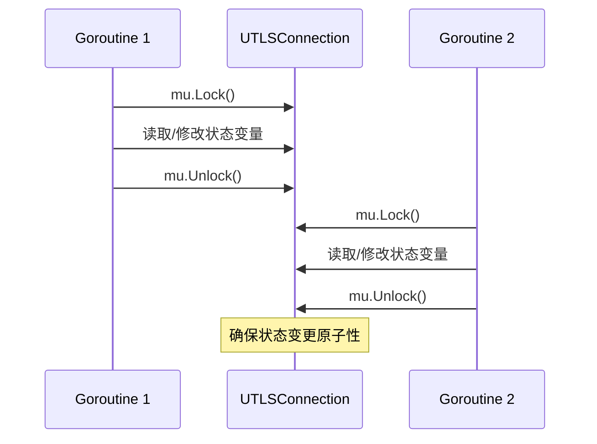
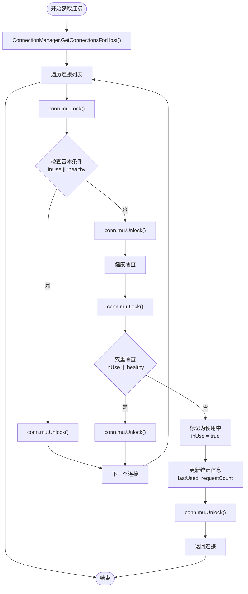
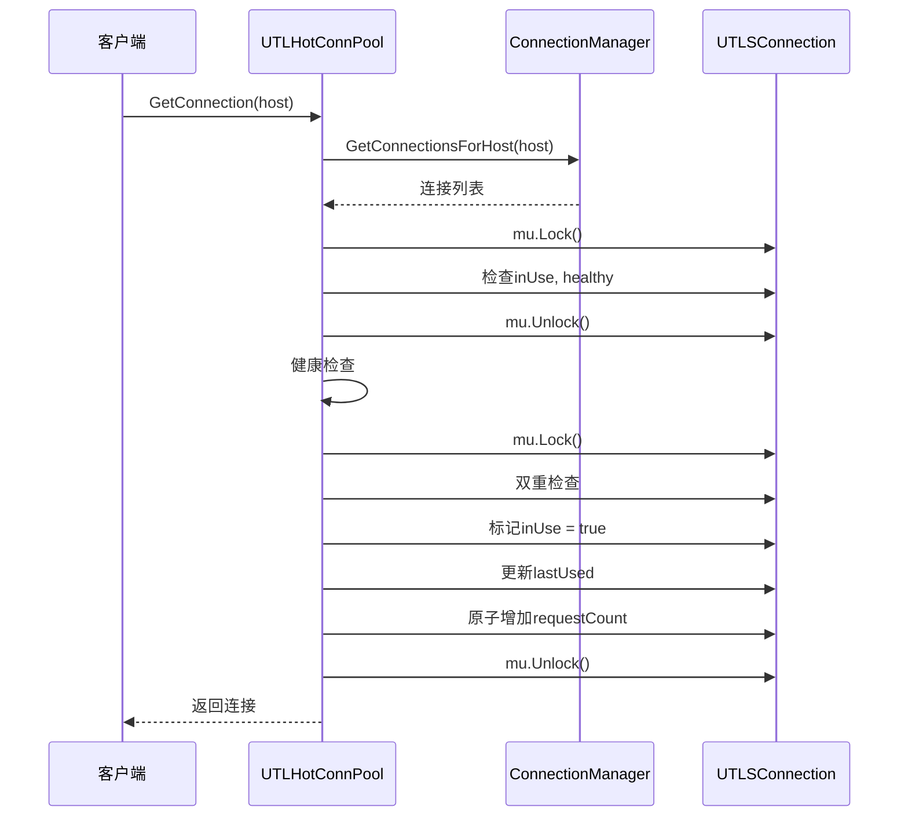
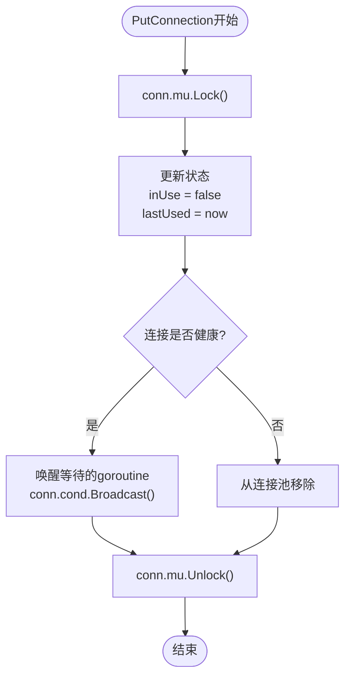
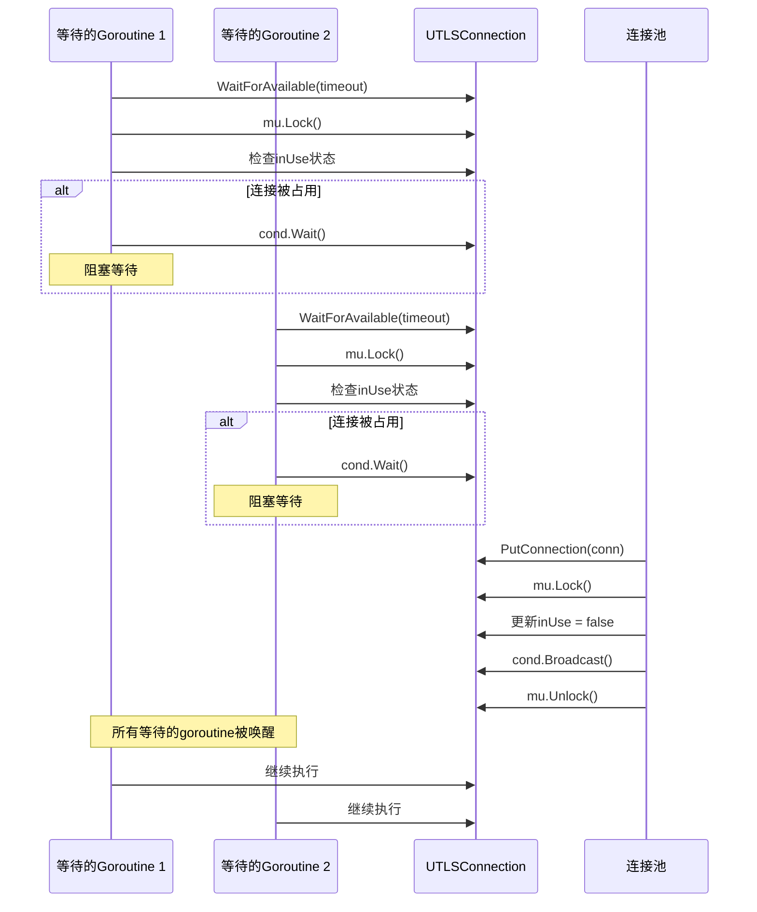
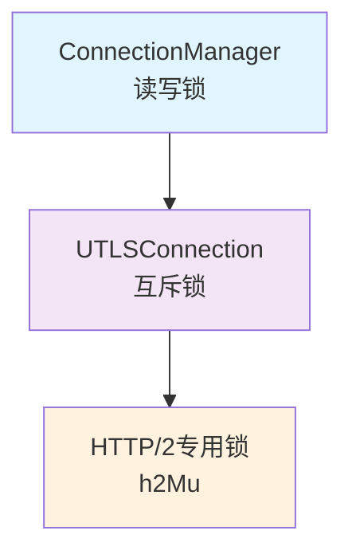
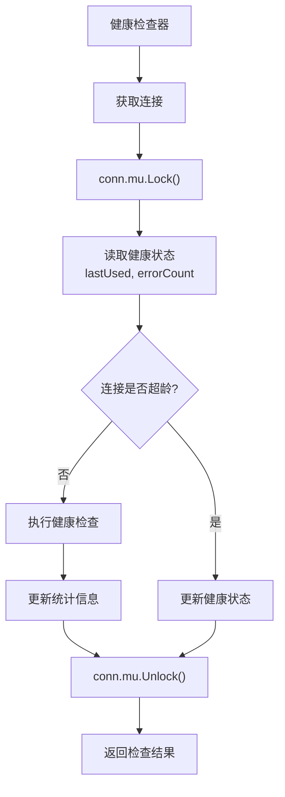

# 连接级别并发控制

<cite>
**本文档引用的文件**
- [utlshotconnpool.go](file://utlsclient/utlshotconnpool.go)
- [connection_manager.go](file://utlsclient/connection_manager.go)
- [health_checker.go](file://utlsclient/health_checker.go)
- [connection_validator.go](file://utlsclient/connection_validator.go)
- [interfaces.go](file://utlsclient/interfaces.go)
</cite>

## 目录
1. [简介](#简介)
2. [UTLSConnection结构体设计](#utlsconnection结构体设计)
3. [连接级互斥锁机制](#连接级互斥锁机制)
4. [双重检查锁定模式](#双重检查锁定模式)
5. [连接状态管理](#连接状态管理)
6. [HTTP/2连接保护](#http2连接保护)
7. [条件变量机制](#条件变量机制)
8. [并发控制最佳实践](#并发控制最佳实践)
9. [性能考虑](#性能考虑)
10. [总结](#总结)

## 简介

UTLS连接池采用精细的连接级别并发控制机制，确保在高并发环境下连接状态的一致性和安全性。通过多层次的锁机制和条件变量，系统能够在多个goroutine同时访问同一连接时保持数据完整性，避免竞态条件和数据竞争。

## UTLSConnection结构体设计

UTLSConnection结构体是连接级别并发控制的核心载体，包含了完整的状态管理和同步机制：

```mermaid
classDiagram
class UTLSConnection {
+net.Conn conn
+*utls.UConn tlsConn
+string targetIP
+string targetHost
+Profile fingerprint
+string acceptLanguage
+interface{} h2ClientConn
+sync.Mutex h2Mu
+time.Time created
+time.Time lastUsed
+time.Time lastChecked
+bool inUse
+bool healthy
+int64 requestCount
+int64 errorCount
+sync.Mutex mu
+*sync.Cond cond
+Close() error
+RoundTripRaw(ctx, rawReq) (io.Reader, error)
+WaitForAvailable(timeout) error
+IsHealthy() bool
+RequestCount() int64
+ErrorCount() int64
}
class ConnectionManager {
+sync.RWMutex mu
+map[string]*UTLSConnection connections
+map[string][]string hostMapping
+*PoolConfig config
+AddConnection(conn) void
+GetConnection(ip) *UTLSConnection
+RemoveConnection(ip) void
+GetConnectionsForHost(host) []*UTLSConnection
}
class HealthChecker {
+*ConnectionManager connManager
+*PoolConfig config
+CheckConnection(conn) bool
+performHealthCheck(conn) error
+CheckAllConnections() void
}
UTLSConnection --> ConnectionManager : "managed by"
HealthChecker --> ConnectionManager : "checks"
```

**图表来源**
- [utlshotconnpool.go](file://utlsclient/utlshotconnpool.go#L204-L233)
- [connection_manager.go](file://utlsclient/connection_manager.go#L9-L14)

**章节来源**
- [utlshotconnpool.go](file://utlsclient/utlshotconnpool.go#L204-L233)

## 连接级互斥锁机制

### 主要锁结构

UTLSConnection包含两个主要的互斥锁：

1. **mu锁（主锁）**：保护连接的所有状态变量
2. **h2Mu锁（HTTP/2专用锁）**：专门保护HTTP/2客户端连接对象

### 状态变量保护

连接级锁保护以下关键状态变量：

| 状态变量 | 类型 | 保护目的 |
|---------|------|----------|
| `inUse` | bool | 连接使用状态，防止并发使用 |
| `healthy` | bool | 连接健康状态，确保一致性检查 |
| `lastUsed` | time.Time | 最后使用时间，避免竞态更新 |
| `requestCount` | int64 | 请求计数，保证原子性累加 |
| `errorCount` | int64 | 错误计数，确保统计准确性 |
| `lastChecked` | time.Time | 最后检查时间，控制健康检查频率 |

### 锁的使用模式



**图表来源**
- [utlshotconnpool.go](file://utlsclient/utlshotconnpool.go#L1227-L1231)
- [utlshotconnpool.go](file://utlsclient/utlshotconnpool.go#L1274-L1294)

**章节来源**
- [utlshotconnpool.go](file://utlsclient/utlshotconnpool.go#L1227-L1294)

## 双重检查锁定模式

### 在getExistingConnection中的应用

双重检查锁定模式在获取现有连接时发挥重要作用，确保在高并发环境下的正确性：



**图表来源**
- [utlshotconnpool.go](file://utlsclient/utlshotconnpool.go#L442-L478)

### 双重检查的关键作用

1. **第一次检查**：快速排除明显不合适的连接
2. **解锁后健康检查**：避免长时间持有锁导致性能瓶颈
3. **第二次检查**：确保在解锁期间没有被其他goroutine获取

这种模式有效平衡了性能和安全性，避免了长时间持有锁带来的性能损失。

**章节来源**
- [utlshotconnpool.go](file://utlsclient/utlshotconnpool.go#L442-L478)

## 连接状态管理

### GetConnection流程中的状态控制



**图表来源**
- [utlshotconnpool.go](file://utlsclient/utlshotconnpool.go#L351-L360)
- [utlshotconnpool.go](file://utlsclient/utlshotconnpool.go#L442-L478)

### PutConnection中的状态恢复

PutConnection方法负责将连接归还到池中，并确保状态的一致性：



**图表来源**
- [utlshotconnpool.go](file://utlsclient/utlshotconnpool.go#L760-L785)

**章节来源**
- [utlshotconnpool.go](file://utlsclient/utlshotconnpool.go#L760-L785)

## HTTP/2连接保护

### h2Mu锁的作用机制

HTTP/2连接具有特殊的并发要求，需要额外的锁保护：

```mermaid
classDiagram
class UTLSConnection {
+interface{} h2ClientConn
+sync.Mutex h2Mu
+Close() error
+RoundTripRaw(ctx, rawReq) (io.Reader, error)
}
note for UTLSConnection "h2Mu专门保护HTTP/2客户端连接对象<br/>避免并发访问导致的数据竞争"
```

**图表来源**
- [utlshotconnpool.go](file://utlsclient/utlshotconnpool.go#L204-L233)

### HTTP/2连接的并发安全

HTTP/2客户端连接在多请求并发场景下需要特殊保护：

1. **连接关闭保护**：确保关闭操作的原子性
2. **协议协商保护**：避免协议切换过程中的竞态
3. **流管理保护**：防止并发流创建和销毁

**章节来源**
- [utlshotconnpool.go](file://utlsclient/utlshotconnpool.go#L1248-L1271)

## 条件变量机制

### WaitForAvailable方法

条件变量用于连接复用场景，允许多个goroutine等待连接可用：



**图表来源**
- [utlshotconnpool.go](file://utlsclient/utlshotconnpool.go#L1297-L1324)

### Broadcast唤醒机制

Broadcast方法用于通知所有等待的goroutine连接已可用：

1. **批量唤醒**：一次性唤醒所有等待的goroutine
2. **公平性**：确保等待时间较长的goroutine也能获得机会
3. **性能优化**：相比逐个唤醒，减少锁的竞争开销

**章节来源**
- [utlshotconnpool.go](file://utlsclient/utlshotconnpool.go#L1297-L1324)

## 并发控制最佳实践

### 锁的层次化设计

系统采用分层的锁设计，避免死锁和性能问题：



### 锁的持有时间原则

1. **最小化持有时间**：只在必要时持有锁
2. **避免嵌套锁**：防止死锁发生
3. **及时解锁**：尽早释放锁资源
4. **读写分离**：使用读写锁提高并发性能

### 健康检查的并发安全

健康检查器通过连接级锁确保检查结果的一致性：



**图表来源**
- [health_checker.go](file://utlsclient/health_checker.go#L23-L61)

**章节来源**
- [health_checker.go](file://utlsclient/health_checker.go#L23-L61)

## 性能考虑

### 锁竞争的缓解策略

1. **读写锁的使用**：ConnectionManager使用读写锁，允许多个读操作并发
2. **细粒度锁**：连接级锁避免了全局锁的竞争
3. **条件变量**：减少不必要的轮询和CPU消耗
4. **双重检查**：减少锁的持有时间

### 内存屏障和原子操作

对于计数器等频繁更新的字段，使用原子操作：

- `requestCount`：使用`atomic.AddInt64`进行原子累加
- `errorCount`：同样使用原子操作更新

### 缓存友好的设计

连接的状态信息紧密相关，放在同一个结构体内，有利于CPU缓存命中。

## 总结

UTLS连接池的连接级别并发控制机制体现了现代并发编程的最佳实践：

1. **多层次锁设计**：从连接池到连接再到特定功能的锁层次
2. **双重检查锁定**：在性能和安全性之间取得平衡
3. **条件变量机制**：支持高效的连接复用
4. **细粒度状态保护**：确保每个状态变量的原子性
5. **HTTP/2特殊处理**：针对HTTP/2的并发特性提供专门保护

这套并发控制机制确保了在高并发环境下连接池的稳定性和性能，为上层应用提供了可靠的连接服务。通过合理的锁设计和并发控制策略，系统能够在保证数据一致性的同时，最大化并发性能。