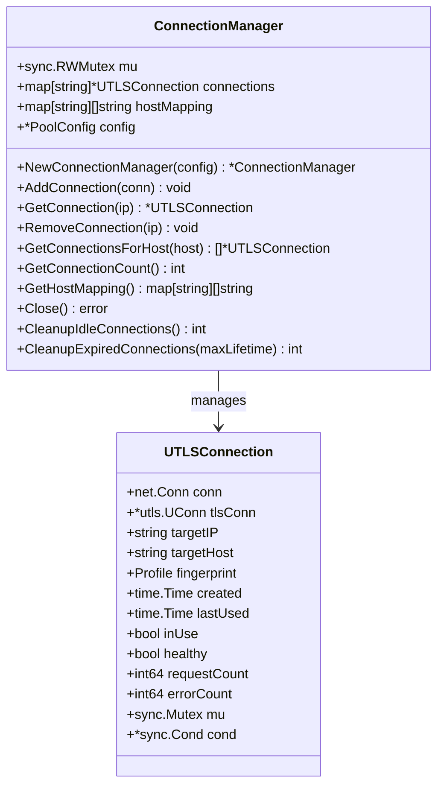
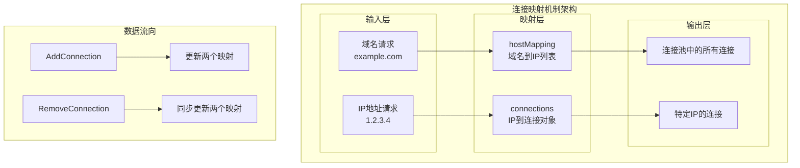
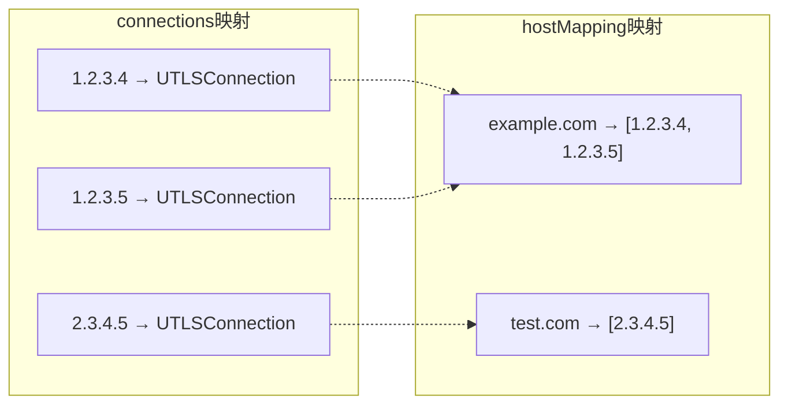
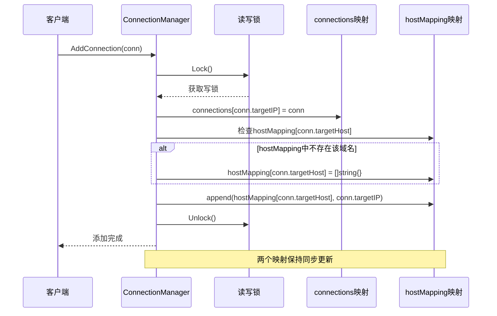
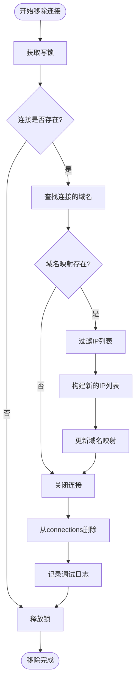
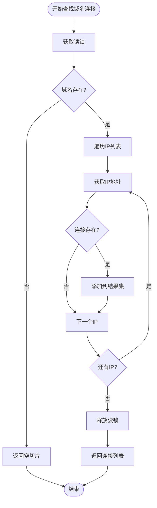
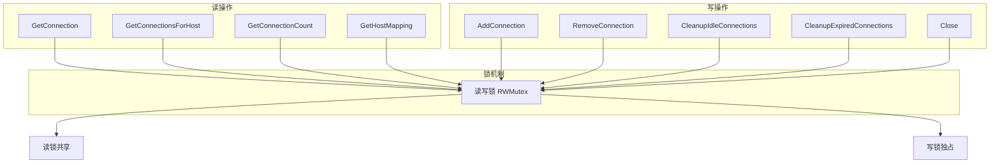
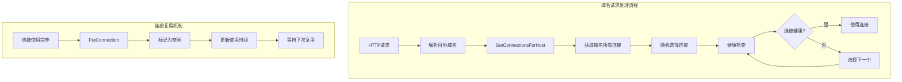

# 连接映射机制

<cite>
**本文档中引用的文件**
- [connection_manager.go](file://utlsclient/connection_manager.go)
- [interfaces.go](file://utlsclient/interfaces.go)
- [constants.go](file://utlsclient/constants.go)
- [utlshotconnpool.go](file://utlsclient/utlshotconnpool.go)
- [connection_manager_test.go](file://test/utlsclient/connection_manager_test.go)
- [test_helpers.go](file://utlsclient/test_helpers.go)
</cite>

## 目录
1. [简介](#简介)
2. [核心数据结构设计](#核心数据结构设计)
3. [映射机制架构](#映射机制架构)
4. [AddConnection方法详解](#addconnection方法详解)
5. [RemoveConnection方法详解](#removeconnection方法详解)
6. [域名到连接查找流程](#域名到连接查找流程)
7. [并发安全机制](#并发安全机制)
8. [负载均衡与连接复用](#负载均衡与连接复用)
9. [性能优化特性](#性能优化特性)
10. [故障排除指南](#故障排除指南)
11. [总结](#总结)

## 简介

连接映射机制是UTLS热连接池系统的核心组件，负责高效管理和组织大量的网络连接。该机制通过双重映射结构实现了IP地址到连接对象的直接映射和域名到IP列表的间接映射，为高性能的网络通信提供了坚实的基础。

该机制的主要优势包括：
- **高效的连接查找**：支持O(1)时间复杂度的连接获取
- **灵活的域名解析**：支持多IP负载均衡和故障转移
- **线程安全保护**：通过读写锁确保并发访问的安全性
- **自动资源管理**：智能的连接生命周期管理

## 核心数据结构设计

### ConnectionManager结构体

ConnectionManager是连接映射机制的核心控制器，包含以下关键字段：



**图表来源**
- [connection_manager.go](file://utlsclient/connection_manager.go#L8-L14)
- [utlshotconnpool.go](file://utlsclient/utlshotconnpool.go#L204-L233)

### 两个核心映射结构

#### 1. IP到连接的直接映射

```go
connections map[string]*UTLSConnection
```

这个映射提供了最快速的连接查找能力：
- **键值**：目标IP地址（如"1.2.3.4"）
- **值**：对应的UTLSConnection对象指针
- **特点**：O(1)时间复杂度的精确查找
- **用途**：直接通过IP地址获取特定连接

#### 2. 域名到IP列表的间接映射

```go
hostMapping map[string][]string
```

这个映射支持域名级别的连接管理：
- **键值**：目标域名（如"example.com"）
- **值**：该域名对应的所有IP地址列表
- **特点**：支持多IP负载均衡和故障转移
- **用途**：通过域名获取所有可用连接

**章节来源**
- [connection_manager.go](file://utlsclient/connection_manager.go#L8-L14)

## 映射机制架构

### 双重映射架构图



**图表来源**
- [connection_manager.go](file://utlsclient/connection_manager.go#L25-L67)

### 映射关系示例

假设系统中有以下连接：

| IP地址 | 域名 | 连接状态 |
|--------|------|----------|
| 1.2.3.4 | example.com | 活跃 |
| 1.2.3.5 | example.com | 活跃 |
| 2.3.4.5 | test.com | 空闲 |

对应的映射结构：



**图表来源**
- [connection_manager.go](file://utlsclient/connection_manager.go#L11-L12)

## AddConnection方法详解

AddConnection方法是连接映射机制的核心操作，负责将新连接同时添加到两个映射中，确保数据一致性。

### 方法执行流程



**图表来源**
- [connection_manager.go](file://utlsclient/connection_manager.go#L25-L39)

### 关键实现细节

#### 1. 互斥锁保护
```go
cm.mu.Lock()
defer cm.mu.Unlock()
```
- 确保AddConnection操作的原子性
- 防止并发修改导致的数据不一致

#### 2. connections映射更新
```go
cm.connections[conn.targetIP] = conn
```
- 直接以IP地址为键存储连接对象
- 提供最快的连接查找路径

#### 3. hostMapping映射更新
```go
if _, exists := cm.hostMapping[conn.targetHost]; !exists {
    cm.hostMapping[conn.targetHost] = []string{}
}
cm.hostMapping[conn.targetHost] = append(cm.hostMapping[conn.targetHost], conn.targetIP)
```
- 确保域名键存在（如果不存在则初始化）
- 将新IP添加到域名对应的IP列表末尾

**章节来源**
- [connection_manager.go](file://utlsclient/connection_manager.go#L25-L39)

## RemoveConnection方法详解

RemoveConnection方法负责从两个映射中同步移除连接，确保数据一致性的同时正确释放资源。

### 方法执行流程



**图表来源**
- [connection_manager.go](file://utlsclient/connection_manager.go#L49-L73)

### 详细实现步骤

#### 1. 连接存在性检查
```go
if conn, exists := cm.connections[ip]; exists {
```
- 首先检查connections映射中是否存在该IP的连接
- 避免不必要的后续操作

#### 2. 域名映射同步更新
```go
if hostList, exists := cm.hostMapping[conn.targetHost]; exists {
    newList := []string{}
    for _, hostIP := range hostList {
        if hostIP != ip {
            newList = append(newList, hostIP)
        }
    }
    cm.hostMapping[conn.targetHost] = newList
}
```
- 遍历域名对应的IP列表
- 移除与要删除连接匹配的IP
- 构建新的IP列表并更新映射

#### 3. 连接资源清理
```go
conn.Close()
delete(cm.connections, ip)
```
- 调用连接的Close方法释放资源
- 从connections映射中删除连接条目

**章节来源**
- [connection_manager.go](file://utlsclient/connection_manager.go#L49-L73)

## 域名到连接查找流程

GetConnectionsForHost方法展示了域名级别连接查找的完整流程，体现了双重映射机制的优势。

### 查找算法流程



**图表来源**
- [connection_manager.go](file://utlsclient/connection_manager.go#L76-L91)

### 实现细节分析

#### 1. 读锁保护
```go
cm.mu.RLock()
defer cm.mu.RUnlock()
```
- 使用读锁允许多个并发读取
- 避免写操作阻塞读取性能

#### 2. 双重查找机制
```go
if ipList, exists := cm.hostMapping[host]; exists {
    for _, ip := range ipList {
        if conn, exists := cm.connections[ip]; exists {
            connections = append(connections, conn)
        }
    }
}
```
- 首先通过hostMapping获取IP列表
- 然后逐个检查每个IP对应的连接是否存在
- 确保只返回有效的连接对象

#### 3. 性能优化
- **早期退出**：发现不存在的连接时立即跳过
- **批量操作**：一次性获取所有相关连接
- **内存效率**：只返回实际存在的连接

**章节来源**
- [connection_manager.go](file://utlsclient/connection_manager.go#L76-L91)

## 并发安全机制

连接映射机制通过读写锁（sync.RWMutex）确保在高并发环境下的数据一致性。

### 读写锁策略



**图表来源**
- [connection_manager.go](file://utlsclient/connection_manager.go#L10-L10)

### 锁使用模式

#### 1. 读操作的锁保护
```go
func (cm *ConnectionManager) GetConnection(ip string) *UTLSConnection {
    cm.mu.RLock()
    defer cm.mu.RUnlock()
    
    return cm.connections[ip]
}
```
- **优点**：允许多个读操作并发执行
- **适用场景**：频繁的连接查询操作
- **性能**：读操作不会相互阻塞

#### 2. 写操作的锁保护
```go
func (cm *ConnectionManager) AddConnection(conn *UTLSConnection) {
    cm.mu.Lock()
    defer cm.mu.Unlock()
    
    // 写操作逻辑
}
```
- **优点**：确保写操作的原子性
- **适用场景**：连接的添加、删除和修改
- **性能**：写操作会阻塞所有读写操作

### 并发访问测试

测试框架验证了映射机制在高并发环境下的正确性：

```go
func TestConnectionManagerConcurrentAccess(t *testing.T) {
    var wg sync.WaitGroup
    numGoroutines := 10
    numConnections := 10
    
    for i := 0; i < numGoroutines; i++ {
        wg.Add(1)
        go func(id int) {
            defer wg.Done()
            for j := 0; j < numConnections; j++ {
                ip := fmt.Sprintf("1.2.3.%d", id*numConnections+j)
                conn := utlsclient.NewTestConnection(ip, "example.com")
                cm.AddConnection(conn)
            }
        }(i)
    }
    
    wg.Wait()
    // 验证所有连接都已添加
}
```

**章节来源**
- [connection_manager.go](file://utlsclient/connection_manager.go#L10-L10)
- [connection_manager_test.go](file://test/utlsclient/connection_manager_test.go#L181-L209)

## 负载均衡与连接复用

双重映射机制为多IP负载均衡和连接复用提供了强大的支持。

### 负载均衡策略



**图表来源**
- [utlshotconnpool.go](file://utlsclient/utlshotconnpool.go#L410-L456)

### 连接复用优势

#### 1. 减少连接建立开销
- **TCP三次握手**：避免重复建立连接
- **TLS握手**：减少加密协商时间
- **DNS解析**：利用缓存的IP地址

#### 2. 提高系统吞吐量
- **并发处理**：多个请求可以复用同一连接
- **资源优化**：减少系统资源消耗
- **响应时间**：降低连接建立延迟

#### 3. 故障转移能力
```go
// 在连接池中随机选择可用连接
connections := p.connManager.GetConnectionsForHost(targetHost)
for _, conn := range connections {
    if conn.inUse || !conn.healthy {
        continue
    }
    // 使用健康连接
}
```

**章节来源**
- [utlshotconnpool.go](file://utlsclient/utlshotconnpool.go#L410-L456)

## 性能优化特性

连接映射机制采用了多种性能优化技术，确保在大规模应用中的高效运行。

### 1. 内存优化

#### 映射容量预分配
```go
func NewConnectionManager(config *PoolConfig) *ConnectionManager {
    return &ConnectionManager{
        connections: make(map[string]*UTLSConnection),
        hostMapping: make(map[string][]string),
        config:      config,
    }
}
```
- 避免动态扩容带来的性能损失
- 预分配初始容量，提高内存使用效率

#### 切片容量优化
```go
if _, exists := cm.hostMapping[conn.targetHost]; !exists {
    cm.hostMapping[conn.targetHost] = []string{}
}
```
- 使用空切片而非nil，避免nil检查
- 提高内存访问效率

### 2. 计算优化

#### 哈希函数优化
- IP地址作为映射键：天然适合哈希分布
- 域名作为映射键：经过标准化处理的字符串
- 哈希冲突最小化，确保O(1)平均查找时间

#### 缓存友好设计
- 连接对象按IP地址连续存储
- 域名映射采用紧凑的切片结构
- 减少CPU缓存未命中率

### 3. 并发优化

#### 读写分离
- 读操作使用读锁，允许多个并发读取
- 写操作使用写锁，确保数据一致性
- 读多写少场景下的最佳性能

#### 锁粒度控制
```go
// 连接级别的锁保护
conn.mu.Lock()
isIdle := !conn.inUse && now.Sub(conn.lastUsed) > cm.config.IdleTimeout
conn.mu.Unlock()
```
- 连接池层面的全局锁
- 连接层面的局部锁
- 细粒度的并发控制

**章节来源**
- [connection_manager.go](file://utlsclient/connection_manager.go#L17-L22)
- [connection_manager.go](file://utlsclient/connection_manager.go#L142-L177)

## 故障排除指南

### 常见问题诊断

#### 1. 连接泄漏问题

**症状**：连接数量持续增长，内存使用过高
**诊断方法**：
```go
// 检查连接总数
count := cm.GetConnectionCount()
fmt.Printf("当前连接数: %d\n", count)

// 检查域名映射
mapping := cm.GetHostMapping()
for host, ips := range mapping {
    fmt.Printf("%s: %d个IP\n", host, len(ips))
}
```

**解决方案**：
- 检查RemoveConnection调用是否正确
- 验证连接池的清理机制
- 监控连接的生命周期

#### 2. 并发访问异常

**症状**：出现数据竞争或死锁
**诊断方法**：
```go
// 使用race detector检测数据竞争
go run -race main.go

// 检查锁的使用是否正确
// 确保每次Lock都有对应的Unlock
```

**解决方案**：
- 确保所有锁操作都在defer中完成
- 避免在持有锁的情况下调用外部函数
- 使用context控制锁的超时

#### 3. 性能问题

**症状**：连接查找速度慢，响应时间长
**诊断方法**：
```go
// 监控映射大小
fmt.Printf("connections映射大小: %d\n", len(cm.connections))
fmt.Printf("hostMapping映射大小: %d\n", len(cm.hostMapping))

// 检查连接池配置
fmt.Printf("最大连接数: %d\n", cm.config.MaxConnections)
fmt.Printf("每主机最大连接数: %d\n", cm.config.MaxConnsPerHost)
```

**解决方案**：
- 调整连接池配置参数
- 优化DNS解析频率
- 增加健康检查频率

### 调试工具

#### 1. 连接状态监控
```go
func (cm *ConnectionManager) DebugInfo() map[string]interface{} {
    return map[string]interface{}{
        "connection_count": len(cm.connections),
        "host_mapping_size": len(cm.hostMapping),
        "config": cm.config,
    }
}
```

#### 2. 性能指标收集
```go
type ConnectionStats struct {
    TargetHost   string
    TargetIP     string
    Created      time.Time
    LastUsed     time.Time
    RequestCount int64
    ErrorCount   int64
    IsHealthy    bool
}
```

**章节来源**
- [connection_manager.go](file://utlsclient/connection_manager.go#L93-L113)
- [utlshotconnpool.go](file://utlsclient/utlshotconnpool.go#L1234-L1245)

## 总结

连接映射机制作为UTLS热连接池的核心组件，通过精心设计的双重映射结构实现了高效、可靠的连接管理。其主要特点包括：

### 技术优势

1. **双重映射设计**：IP到连接的直接映射和域名到IP列表的间接映射协同工作，提供灵活的连接查找能力
2. **线程安全保障**：基于读写锁的并发控制机制，确保在高并发环境下的数据一致性
3. **性能优化**：O(1)时间复杂度的查找操作，配合内存优化和缓存友好的设计
4. **资源管理**：自动化的连接生命周期管理，包括空闲连接清理和过期连接回收

### 应用价值

- **高并发支持**：能够处理大量并发连接请求
- **负载均衡**：支持多IP负载均衡和故障转移
- **连接复用**：显著减少连接建立开销，提高系统性能
- **故障恢复**：完善的错误处理和恢复机制

### 扩展性考虑

该机制为未来的功能扩展提供了良好的基础：
- 易于添加新的映射维度
- 支持更复杂的负载均衡算法
- 可集成更多的监控和诊断功能
- 适应不同规模的应用需求

通过深入理解和正确使用连接映射机制，开发者可以构建出高性能、高可靠性的网络应用程序，满足现代分布式系统的需求。