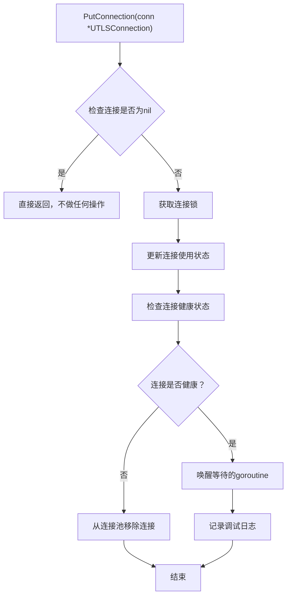
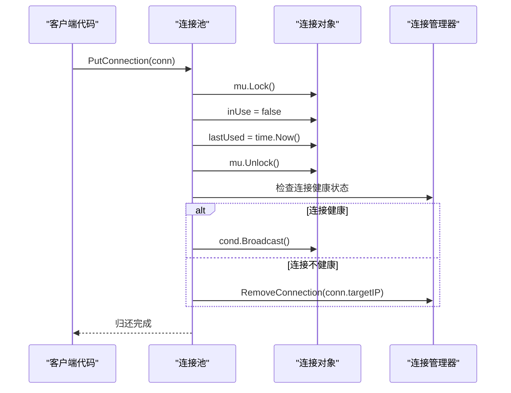
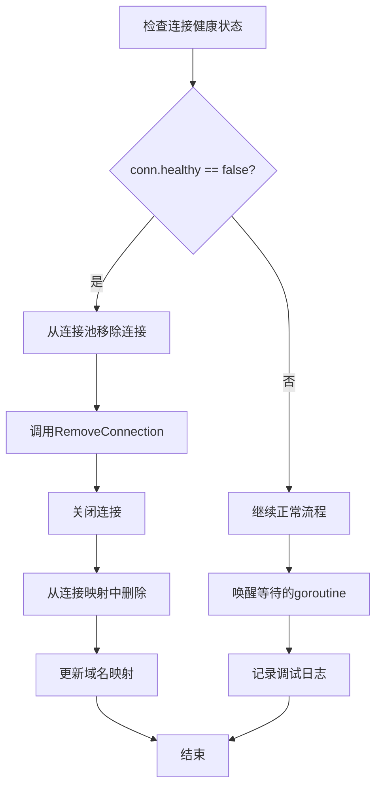
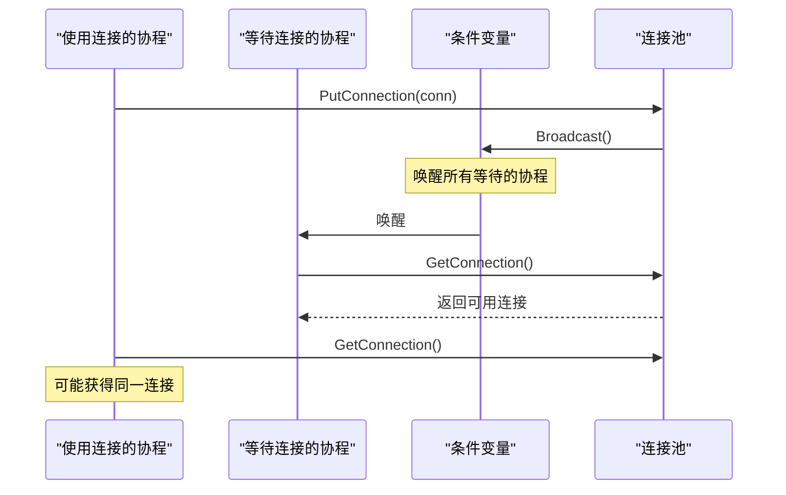
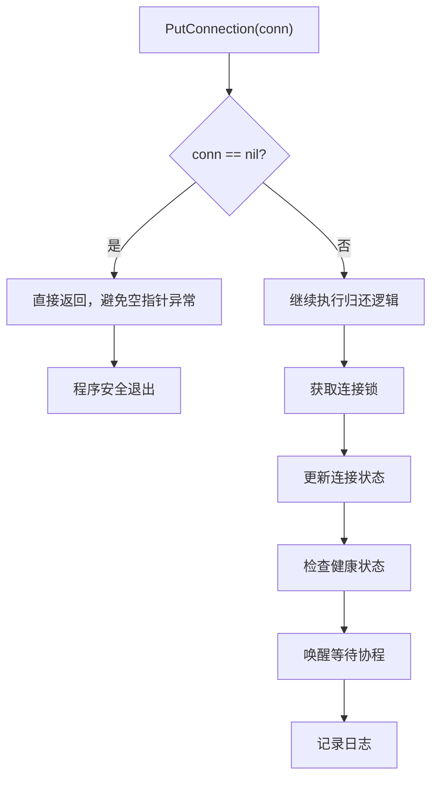
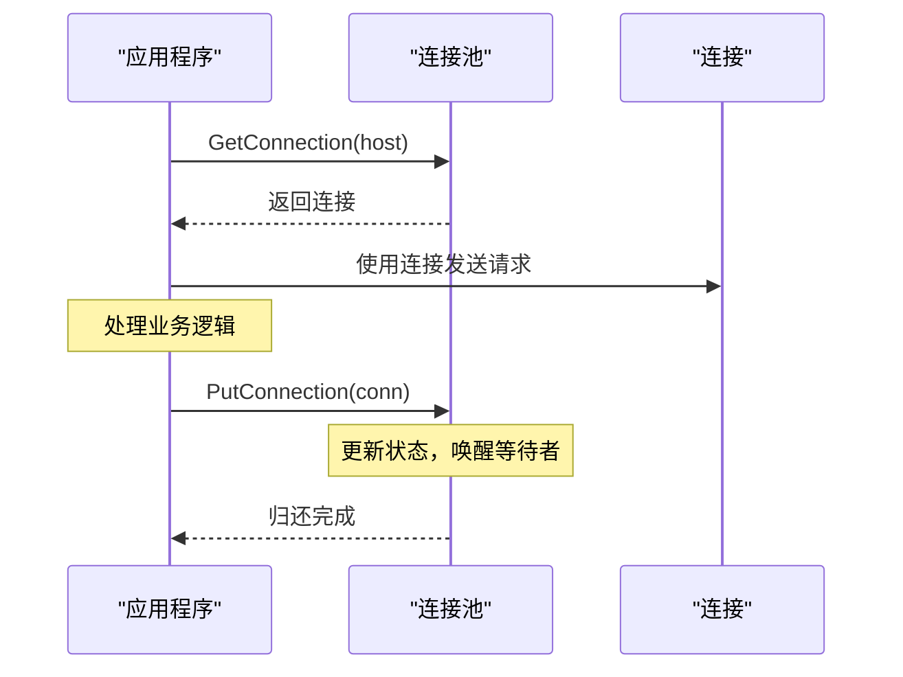
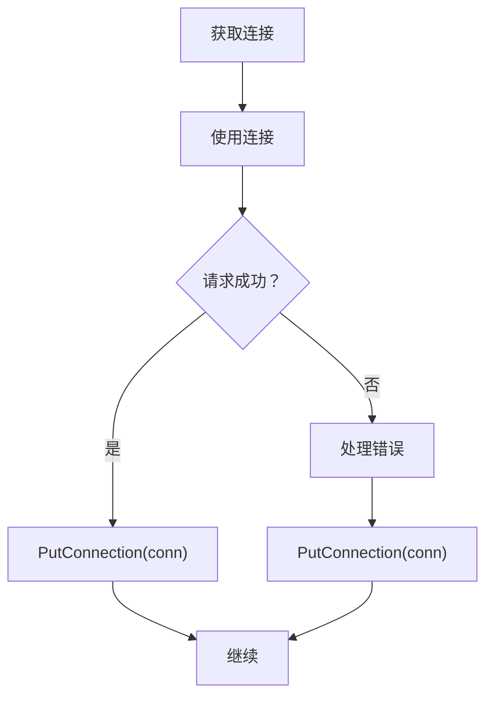

# 连接归还

<cite>
**本文档引用的文件**
- [utlshotconnpool.go](file://utlsclient/utlshotconnpool.go)
- [connection_manager.go](file://utlsclient/connection_manager.go)
- [health_checker.go](file://utlsclient/health_checker.go)
- [connection_validator.go](file://utlsclient/connection_validator.go)
- [example_hotconnpool_usage.go](file://examples/utlsclient/example_hotconnpool_usage.go)
- [connection_manager_test.go](file://test/utlsclient/connection_manager_test.go)
</cite>

## 目录
1. [概述](#概述)
2. [PutConnection方法详解](#putconnection方法详解)
3. [连接状态管理](#连接状态管理)
4. [健康检查机制](#健康检查机制)
5. [条件变量广播机制](#条件变量广播机制)
6. [防御性编程](#防御性编程)
7. [典型使用模式](#典型使用模式)
8. [性能优化考虑](#性能优化考虑)
9. [故障排除指南](#故障排除指南)

## 概述

连接归还是热连接池架构中的关键环节，负责将使用完毕的连接安全地返回到连接池中，以便后续复用。PutConnection方法作为这一过程的核心实现，确保连接状态的正确更新、健康状态的检查以及等待中的协程能够及时被唤醒。

## PutConnection方法详解

PutConnection方法是连接归还功能的主要入口点，其核心职责包括：

### 方法签名与参数处理

**图表来源**
- [utlshotconnpool.go](file://utlsclient/utlshotconnpool.go#L760-L784)

### 核心实现逻辑

PutConnection方法的实现遵循以下步骤：

1. **空连接检查**：首先检查传入的连接是否为nil，这是防御性编程的重要体现
2. **互斥锁保护**：使用连接级别的互斥锁确保线程安全
3. **状态更新**：将连接的inUse标志设置为false，并更新最后使用时间
4. **健康状态检查**：评估连接的健康状况
5. **条件变量广播**：通知等待连接的其他协程
6. **日志记录**：记录连接归还的调试信息

**章节来源**
- [utlshotconnpool.go](file://utlsclient/utlshotconnpool.go#L760-L784)

## 连接状态管理

### inUse标志的更新

连接的inUse标志是连接池复用机制的基础，PutConnection方法负责将其正确设置为false：

**图表来源**
- [utlshotconnpool.go](file://utlsclient/utlshotconnpool.go#L766-L771)
- [connection_manager.go](file://utlsclient/connection_manager.go#L49-L73)

### 最后使用时间的刷新

每次连接归还时，都会更新lastUsed字段，这对于连接池的生命周期管理和清理策略至关重要：

- **空闲超时检查**：基于最后使用时间判断连接是否应该被清理
- **健康检查触发**：决定何时执行健康检查
- **统计分析**：用于监控连接的使用模式

**章节来源**
- [utlshotconnpool.go](file://utlsclient/utlshotconnpool.go#L770-L771)

## 健康检查机制

### 连接健康状态的评估

PutConnection方法不仅更新连接状态，还会检查连接的健康状况：

**图表来源**
- [utlshotconnpool.go](file://utlsclient/utlshotconnpool.go#L773-L777)

### 不健康连接的处理流程

当检测到连接不健康时，系统会采取以下措施：

1. **立即移除**：将不健康的连接从连接池中移除
2. **资源清理**：关闭底层网络连接
3. **映射更新**：更新域名到IP的映射关系
4. **黑名单处理**：可能将IP添加到黑名单

这种主动清理机制确保连接池始终保持高质量的连接集合。

**章节来源**
- [utlshotconnpool.go](file://utlsclient/utlshotconnpool.go#L775-L776)

## 条件变量广播机制

### Broadcast调用的作用

条件变量的Broadcast方法是连接池并发控制的关键组件：

**图表来源**
- [utlshotconnpool.go](file://utlsclient/utlshotconnpool.go#L780-L782)

### 唤醒等待协程的重要性

条件变量的广播机制确保：

- **公平性**：多个等待的协程都能得到唤醒机会
- **响应性**：新可用的连接能快速被其他请求使用
- **负载均衡**：避免某个连接被过度使用

**章节来源**
- [utlshotconnpool.go](file://utlsclient/utlshotconnpool.go#L781)

## 防御性编程

### 空连接的安全处理

PutConnection方法的第一步就是检查连接是否为nil，这是防御性编程的重要实践：

**图表来源**
- [utlshotconnpool.go](file://utlsclient/utlshotconnpool.go#L762-L764)

### 锁保护的必要性

连接对象使用连接级别的互斥锁进行保护：

- **原子性**：确保状态更新的原子性
- **一致性**：防止数据竞争和不一致状态
- **可见性**：保证状态变更对其他协程的可见性

**章节来源**
- [utlshotconnpool.go](file://utlsclient/utlshotconnpool.go#L766-L767)

## 典型使用模式

### 基本连接使用后归还模式

以下是典型的连接使用和归还模式：

**图表来源**
- [example_hotconnpool_usage.go](file://examples/utlsclient/example_hotconnpool_usage.go#L112-L116)

### 错误处理模式

在实际应用中，连接归还通常与错误处理结合：

**章节来源**
- [example_hotconnpool_usage.go](file://examples/utlsclient/example_hotconnpool_usage.go#L112-L116)

## 性能优化考虑

### 连接复用的价值

连接归还机制的核心价值在于提高连接复用率：

- **减少连接开销**：避免重复的TCP和TLS握手
- **提升响应速度**：复用现有连接减少延迟
- **降低服务器压力**：减少新连接建立的负担

### 并发性能优化

条件变量的使用确保了良好的并发性能：

- **无锁等待**：等待协程无需持有锁
- **批量唤醒**：Broadcast支持批量唤醒多个等待者
- **公平调度**：确保等待者能公平获得连接

**章节来源**
- [utlshotconnpool.go](file://utlsclient/utlshotconnpool.go#L781)

## 故障排除指南

### 常见问题诊断

连接归还过程中可能出现的问题及解决方案：

| 问题类型 | 症状 | 可能原因 | 解决方案 |
|---------|------|----------|----------|
| 连接泄漏 | 连接池连接数持续增长 | 未正确调用PutConnection | 确保每个GetConnection都有对应的PutConnection |
| 死锁 | 协程长时间阻塞 | 锁顺序不当或忘记释放锁 | 检查锁的获取和释放顺序 |
| 健康检查失败 | 连接频繁被移除 | 目标服务器不稳定 | 调整健康检查阈值和频率 |
| 广播失效 | 等待协程无法被唤醒 | 条件变量使用错误 | 确保正确使用Broadcast |

### 调试技巧

1. **启用调试日志**：观察连接归还的日志输出
2. **监控连接统计**：定期检查连接池的健康状态
3. **跟踪连接生命周期**：记录连接的获取和归还时间
4. **验证锁使用**：确保正确的锁保护机制

**章节来源**
- [connection_manager_test.go](file://test/utlsclient/connection_manager_test.go#L1-L56)

## 结论

连接归还功能是热连接池架构中的关键组件，通过PutConnection方法实现了安全、高效的连接管理。该功能不仅确保了连接状态的正确更新，还通过健康检查和条件变量广播机制维护了连接池的整体质量和并发性能。合理的使用和维护连接归还机制对于构建高性能的网络应用至关重要。