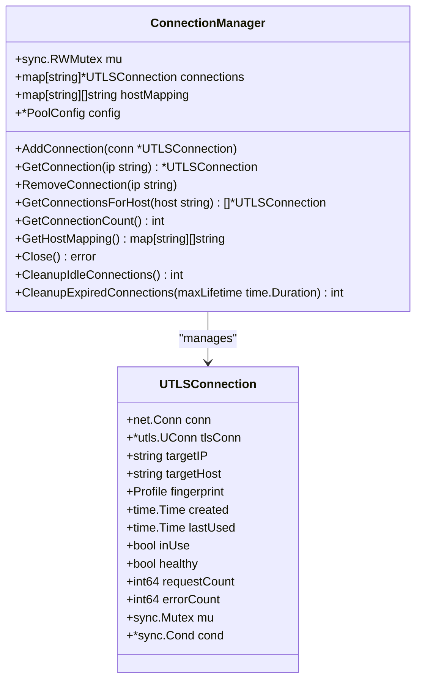
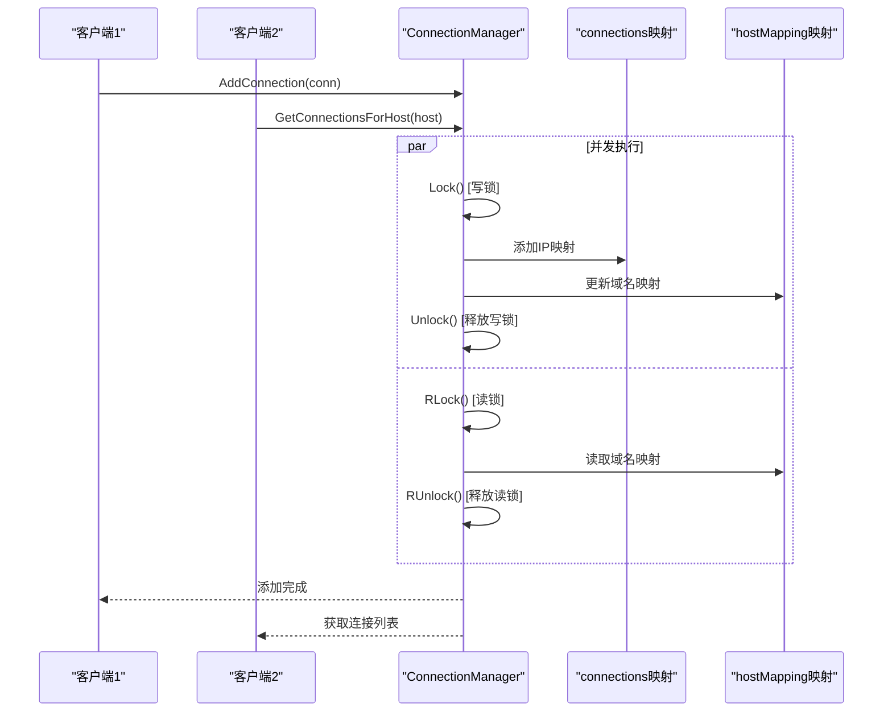
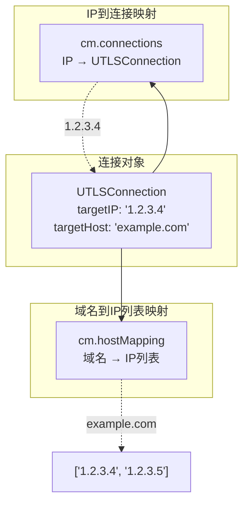
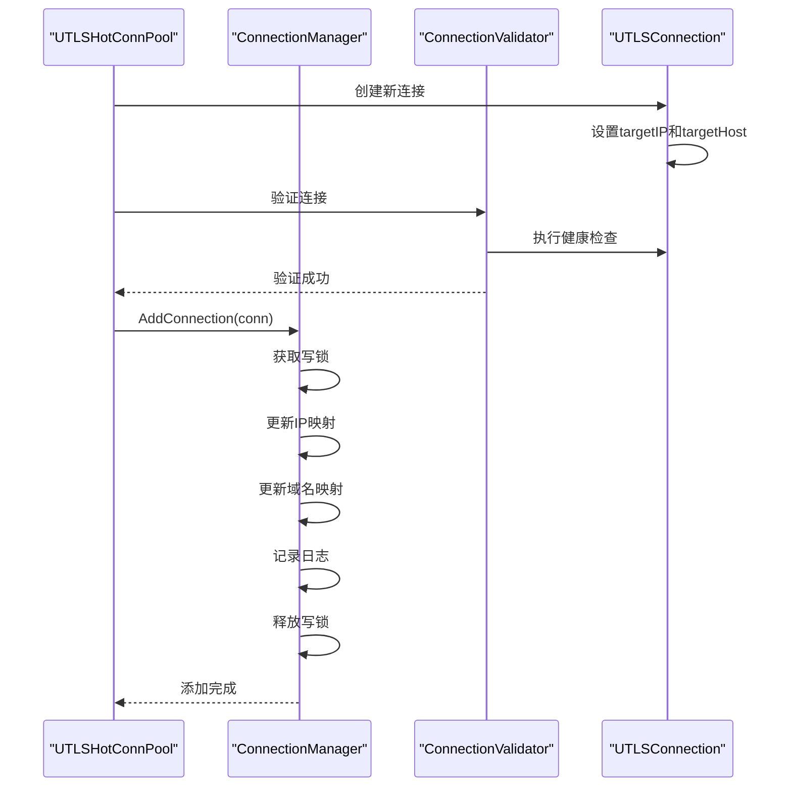
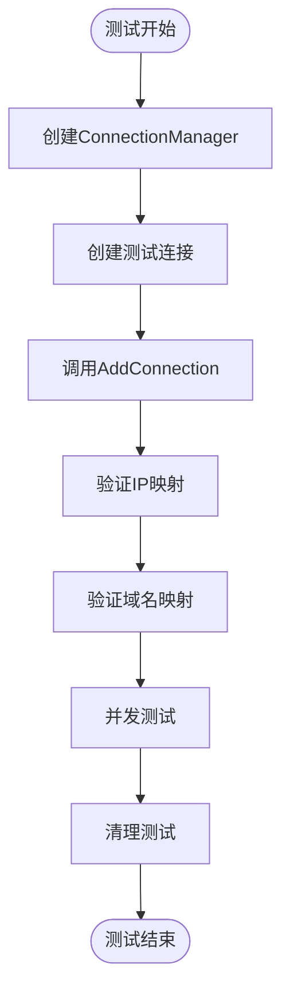

# 连接添加功能详细文档

<cite>
**本文档中引用的文件**
- [connection_manager.go](file://utlsclient/connection_manager.go)
- [utlshotconnpool.go](file://utlsclient/utlshotconnpool.go)
- [interfaces.go](file://utlsclient/interfaces.go)
- [utlsclient.go](file://utlsclient/utlsclient.go)
- [test_helpers.go](file://utlsclient/test_helpers.go)
- [connection_manager_test.go](file://test/utlsclient/connection_manager_test.go)
</cite>

## 目录
1. [简介](#简介)
2. [核心数据结构](#核心数据结构)
3. [AddConnection方法详解](#addconnection方法详解)
4. [并发安全机制](#并发安全机制)
5. [连接映射关系](#连接映射关系)
6. [完整添加流程](#完整添加流程)
7. [日志输出机制](#日志输出机制)
8. [测试验证](#测试验证)
9. [最佳实践](#最佳实践)

## 简介

连接添加功能是UTLS热连接池的核心组件之一，负责将新建立的UTLSConnection添加到连接管理器的映射中。该功能通过维护双重映射关系（IP到连接的映射和域名到IP列表的映射）来实现高效的连接管理和快速的连接查找。

## 核心数据结构

### ConnectionManager结构

ConnectionManager是连接管理的核心结构，包含以下关键字段：



**图表来源**
- [connection_manager.go](file://utlsclient/connection_manager.go#L8-L13)
- [utlshotconnpool.go](file://utlsclient/utlshotconnpool.go#L204-L233)

**节来源**
- [connection_manager.go](file://utlsclient/connection_manager.go#L8-L13)
- [utlshotconnpool.go](file://utlsclient/utlshotconnpool.go#L204-L233)

### UTLSConnection结构

UTLSConnection封装了底层的网络连接，包含以下关键属性：

- **基础连接信息**：TCP连接、TLS连接、目标IP和域名
- **指纹信息**：TLS指纹配置和随机生成的Accept-Language头
- **生命周期管理**：创建时间、最后使用时间、健康状态
- **使用统计**：请求次数、错误次数
- **并发控制**：连接级锁和等待条件

**节来源**
- [utlshotconnpool.go](file://utlsclient/utlshotconnpool.go#L204-L233)

## AddConnection方法详解

AddConnection方法是连接添加功能的核心实现，负责将新连接添加到管理器的映射中。

### 方法签名和基本逻辑

```mermaid
flowchart TD
Start([开始AddConnection]) --> Lock["获取写锁<br/>cm.mu.Lock()"]
Lock --> AddIP["添加到IP映射<br/>cm.connections[conn.targetIP] = conn"]
AddIP --> CheckHost{"检查域名映射是否存在?"}
CheckHost --> |不存在| InitHost["初始化域名映射<br/>cm.hostMapping[conn.targetHost] = []string{}"]
CheckHost --> |存在| AppendIP["追加IP到域名映射<br/>append(cm.hostMapping[conn.targetHost], conn.targetIP)"]
InitHost --> AppendIP
AppendIP --> Log["记录日志<br/>Debug(\"连接已添加到管理器: %s -> %s\", conn.targetHost, conn.targetIP)"]
Log --> Unlock["释放写锁<br/>defer cm.mu.Unlock()"]
Unlock --> End([结束])
```

**图表来源**
- [connection_manager.go](file://utlsclient/connection_manager.go#L25-L38)

### 关键实现细节

1. **读写锁保护**：使用`cm.mu.Lock()`确保线程安全
2. **IP映射更新**：直接将连接添加到`cm.connections`映射中
3. **域名映射维护**：确保域名到IP列表的映射正确更新
4. **日志记录**：提供详细的调试信息

**节来源**
- [connection_manager.go](file://utlsclient/connection_manager.go#L25-L38)

## 并发安全机制

### 读写锁的使用

ConnectionManager采用读写锁（sync.RWMutex）来平衡并发性能和数据一致性：



**图表来源**
- [connection_manager.go](file://utlsclient/connection_manager.go#L25-L38)
- [connection_manager.go](file://utlsclient/connection_manager.go#L76-L90)

### 锁的作用范围

1. **写操作锁**：AddConnection、RemoveConnection、Cleanup相关方法使用写锁
2. **读操作锁**：GetConnection、GetConnectionsForHost等查询方法使用读锁
3. **连接级锁**：UTLSConnection内部使用独立的互斥锁保护连接状态

**节来源**
- [connection_manager.go](file://utlsclient/connection_manager.go#L25-L38)
- [connection_manager.go](file://utlsclient/connection_manager.go#L41-L46)
- [connection_manager.go](file://utlsclient/connection_manager.go#L76-L90)

## 连接映射关系

### 双重映射机制

ConnectionManager维护两种映射关系来支持不同的查询需求：



**图表来源**
- [connection_manager.go](file://utlsclient/connection_manager.go#L8-L13)

### 域名到IP列表的维护

当添加具有相同域名但不同IP的连接时，hostMapping会自动维护IP列表：

| 域名 | IP列表 |
|------|--------|
| example.com | ['1.2.3.4', '1.2.3.5', '1.2.3.6'] |
| test.com | ['2.3.4.5'] |

**节来源**
- [connection_manager.go](file://utlsclient/connection_manager.go#L32-L36)

## 完整添加流程

### 从创建到添加的完整流程



**图表来源**
- [utlshotconnpool.go](file://utlsclient/utlshotconnpool.go#L433-L436)
- [connection_manager.go](file://utlsclient/connection_manager.go#L25-L38)

### 典型使用场景

1. **新域名连接**：首次添加到新域名的连接
2. **同一域名多IP**：添加到同一域名的不同IP地址
3. **连接池扩容**：动态增加连接数量

**节来源**
- [utlshotconnpool.go](file://utlsclient/utlshotconnpool.go#L433-L436)

## 日志输出机制

### Debug日志格式

AddConnection方法会输出以下格式的日志：

```
连接已添加到管理器: {targetHost} -> {targetIP}
```

例如：
```
连接已添加到管理器: example.com -> 1.2.3.4
```

### 日志级别和用途

- **Debug级别**：提供详细的调试信息，帮助追踪连接添加过程
- **结构化信息**：包含目标域名和IP地址，便于问题诊断
- **实时反馈**：及时反映连接管理器的状态变化

**节来源**
- [connection_manager.go](file://utlsclient/connection_manager.go#L38)

## 测试验证

### 单元测试覆盖

测试用例验证了AddConnection方法的正确性和并发安全性：



**图表来源**
- [connection_manager_test.go](file://test/utlsclient/connection_manager_test.go#L20-L41)

### 并发安全性测试

测试验证了在高并发环境下AddConnection方法的正确性：

- **并发添加**：多个goroutine同时添加连接
- **数据一致性**：确保映射关系的正确性
- **锁竞争处理**：验证锁机制的有效性

**节来源**
- [connection_manager_test.go](file://test/utlsclient/connection_manager_test.go#L185-L229)

## 最佳实践

### 性能优化建议

1. **合理设置连接池大小**：根据业务需求调整MaxConnections和MaxConnsPerHost
2. **监控连接使用情况**：定期检查连接池统计信息
3. **及时清理无用连接**：利用CleanupIdleConnections和CleanupExpiredConnections方法

### 错误处理策略

1. **连接验证**：在添加前确保连接的有效性
2. **异常恢复**：处理连接创建失败的情况
3. **资源清理**：确保连接关闭和映射清理的完整性

### 监控和调试

1. **日志配置**：合理设置日志级别以便问题排查
2. **统计信息**：定期检查连接池的运行统计
3. **健康检查**：利用健康检查机制维护连接质量

**节来源**
- [connection_manager.go](file://utlsclient/connection_manager.go#L141-L217)