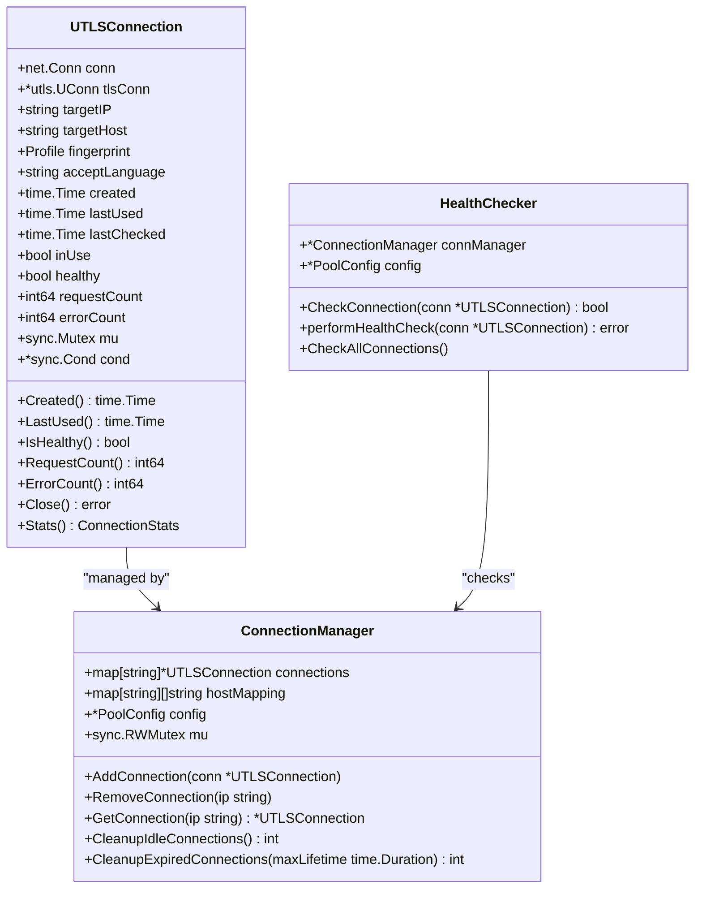
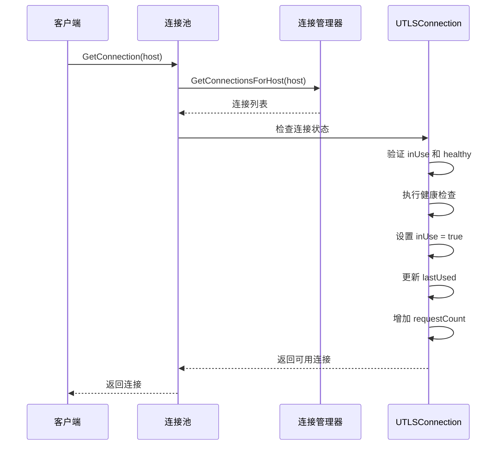
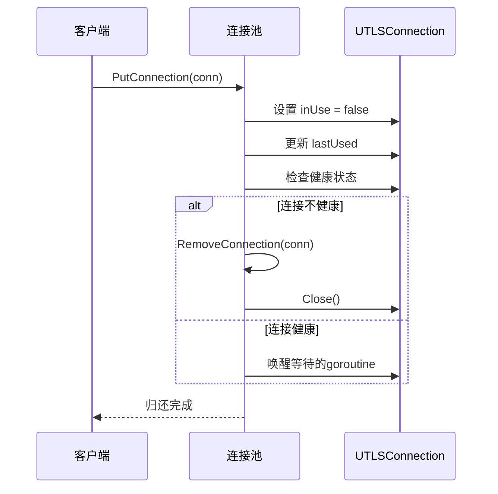
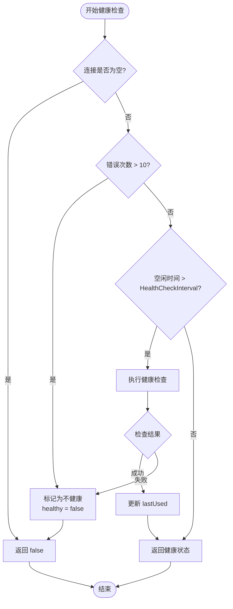
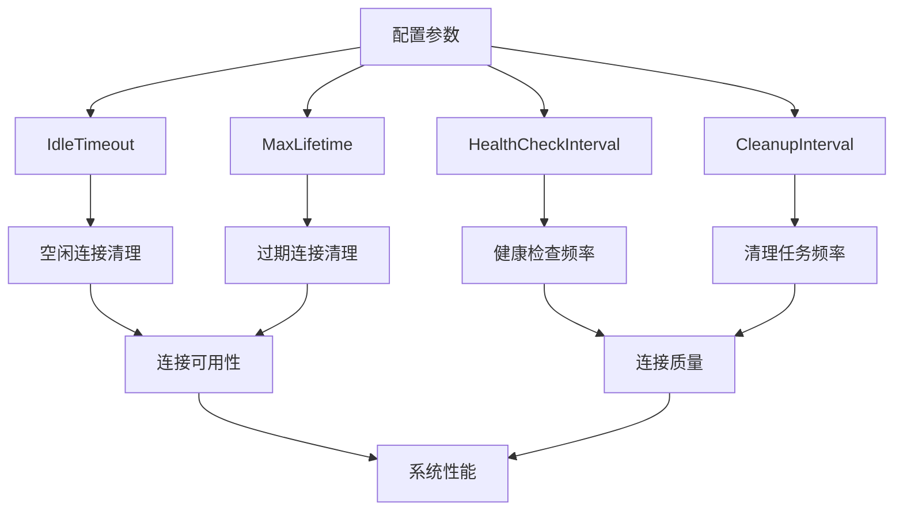
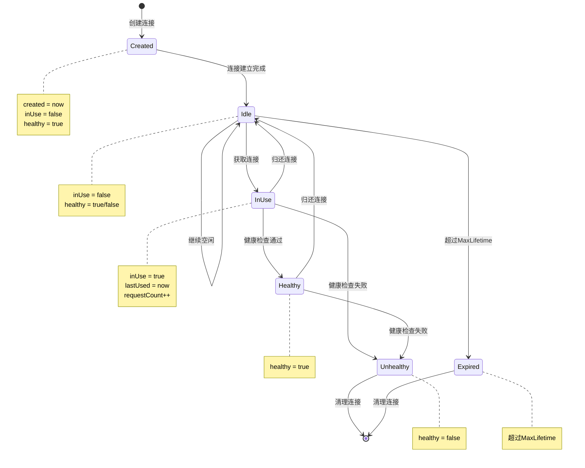
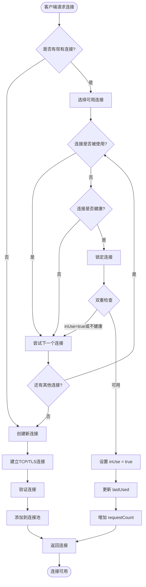
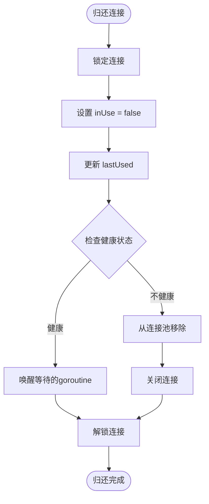

# 连接生命周期状态管理

<cite>
**本文档引用的文件**
- [utlsclient/utlshotconnpool.go](file://utlsclient/utlshotconnpool.go)
- [utlsclient/connection_manager.go](file://utlsclient/connection_manager.go)
- [utlsclient/health_checker.go](file://utlsclient/health_checker.go)
- [utlsclient/test_helpers.go](file://utlsclient/test_helpers.go)
- [config/config.toml](file://config/config.toml)
- [test/utlsclient/connection_manager_test.go](file://test/utlsclient/connection_manager_test.go)
- [test/utlsclient/utlsclient_test.go](file://test/utlsclient/utlsclient_test.go)
</cite>

## 目录
1. [概述](#概述)
2. [UTLSConnection结构体详解](#utlsconnection结构体详解)
3. [连接生命周期状态](#连接生命周期状态)
4. [状态转换机制](#状态转换机制)
5. [自动清理机制](#自动清理机制)
6. [连接池配置影响](#连接池配置影响)
7. [状态转换流程图](#状态转换流程图)
8. [最佳实践建议](#最佳实践建议)

## 概述

UTLS连接生命周期状态管理系统是爬虫平台中连接池的核心组件，负责管理每个连接从创建到销毁的完整生命周期。系统通过四个关键字段：`created`（创建时间）、`lastUsed`（最后使用时间）、`inUse`（使用状态）和`healthy`（健康状态）共同定义连接的状态，并通过自动化机制确保连接池的高效运行。

## UTLSConnection结构体详解

UTLSConnection结构体是连接生命周期管理的基础数据结构，包含了连接的所有关键状态信息：

**图表来源**
- [utlsclient/utlshotconnpool.go](file://utlsclient/utlshotconnpool.go#L204-L233)
- [utlsclient/connection_manager.go](file://utlsclient/connection_manager.go#L8-L14)
- [utlsclient/health_checker.go](file://utlsclient/health_checker.go#L9-L13)

### 核心状态字段说明

| 字段 | 类型 | 描述 | 默认值 |
|------|------|------|--------|
| `created` | `time.Time` | 连接创建的时间戳 | 连接建立时的时间 |
| `lastUsed` | `time.Time` | 连接最后一次被使用的时刻 | 连接建立时的时间 |
| `lastChecked` | `time.Time` | 连接最后一次健康检查的时间 | 连接建立时的时间 |
| `inUse` | `bool` | 连接当前是否正在被使用 | `false`（空闲状态） |
| `healthy` | `bool` | 连接的健康状态 | `true`（健康状态） |

**章节来源**
- [utlsclient/utlshotconnpool.go](file://utlsclient/utlshotconnpool.go#L204-L233)

## 连接生命周期状态

### 空闲状态（Idle State）

空闲状态是连接最常见的状态，表示连接已建立但未被使用。在空闲状态下，连接仍然保持活跃，但不会占用业务线程资源。

**空闲状态特征：**
- `inUse = false`
- `healthy = true`（健康连接）
- `lastUsed` 记录连接最后一次被使用的时间
- 可能会被定期清理机制移除

### 使用中状态（In Use State）

当连接被业务逻辑获取并使用时，进入使用中状态。此状态下连接不能被其他业务逻辑同时使用。

**使用中状态特征：**
- `inUse = true`
- `lastUsed` 更新为当前时间
- `requestCount` 增加
- 在使用过程中可能会变为不健康状态

### 健康状态（Healthy State）

健康状态表示连接能够正常响应HTTP请求，状态良好。健康状态会根据连接的错误率和响应时间动态变化。

**健康状态判断标准：**
- 错误次数不超过10次
- 最后一次健康检查时间不超过健康检查间隔
- 连接能够成功响应健康检查请求

### 不健康状态（Unhealthy State）

不健康状态表示连接存在问题，无法正常提供服务。系统会尽快清理这些连接。

**不健康状态触发条件：**
- 错误次数超过10次
- 健康检查失败
- 连接超时或断开
- 响应时间过长

**章节来源**
- [utlsclient/health_checker.go](file://utlsclient/health_checker.go#L23-L61)
- [utlsclient/utlshotconnpool.go](file://utlsclient/utlshotconnpool.go#L779-L850)

## 状态转换机制

### 获取连接时的状态转换

**图表来源**
- [utlsclient/utlshotconnpool.go](file://utlsclient/utlshotconnpool.go#L441-L481)

### 归还连接时的状态转换

**图表来源**
- [utlsclient/utlshotconnpool.go](file://utlsclient/utlshotconnpool.go#L755-L785)

### 健康检查时的状态转换

**图表来源**
- [utlsclient/health_checker.go](file://utlsclient/health_checker.go#L23-L61)

**章节来源**
- [utlsclient/utlshotconnpool.go](file://utlsclient/utlshotconnpool.go#L441-L481)
- [utlsclient/utlshotconnpool.go](file://utlsclient/utlshotconnpool.go#L755-L785)
- [utlsclient/health_checker.go](file://utlsclient/health_checker.go#L23-L61)

## 自动清理机制

### 空闲连接清理（CleanupIdleConnections）

空闲连接清理机制定期移除长时间未使用的连接，释放系统资源。

**清理条件：**
- `!conn.inUse`（连接未被使用）
- `time.Since(conn.lastUsed) > IdleTimeout`（空闲时间超过阈值）

**清理过程：**
1. 遍历所有连接
2. 检查连接空闲状态
3. 移除符合条件的连接
4. 关闭连接并清理映射

### 过期连接清理（CleanupExpiredConnections）

过期连接清理机制移除超过最大生命周期的连接，防止资源泄漏。

**清理条件：**
- `!conn.inUse`（连接未被使用）
- `time.Since(conn.created) > MaxLifetime`（连接创建时间超过阈值）

**清理过程：**
1. 遍历所有连接
2. 检查连接创建时间
3. 移除符合条件的连接
4. 关闭连接并清理映射

### 健康检查清理（CleanupUnhealthyConnections）

健康检查清理机制移除所有不健康的连接，确保连接池的质量。

**清理过程：**
1. 获取所有不健康的连接
2. 逐个移除连接
3. 关闭连接并清理映射

**章节来源**
- [utlsclient/connection_manager.go](file://utlsclient/connection_manager.go#L141-L217)
- [utlsclient/health_checker.go](file://utlsclient/health_checker.go#L154-L165)

## 连接池配置影响

### 关键配置参数

| 配置项 | 默认值 | 单位 | 影响 |
|--------|--------|------|------|
| `IdleTimeout` | 60秒 | 秒 | 控制空闲连接的保留时间 |
| `MaxLifetime` | 300秒 | 秒 | 控制连接的最大生命周期 |
| `HealthCheckInterval` | 30秒 | 秒 | 控制健康检查的频率 |
| `CleanupInterval` | 60秒 | 秒 | 控制清理任务的执行频率 |
| `MaxConnections` | 100 | 个 | 控制连接池的最大容量 |
| `MaxConnsPerHost` | 10 | 个 | 控制每个主机的最大连接数 |

### 配置对状态转换的影响

**图表来源**
- [config/config.toml](file://config/config.toml#L1-L38)
- [utlsclient/utlshotconnpool.go](file://utlsclient/utlshotconnpool.go#L186-L200)

### 配置优化建议

**高并发场景：**
- 增大 `MaxConnections` 和 `MaxConnsPerHost`
- 减小 `IdleTimeout` 和 `CleanupInterval`
- 适当增大 `HealthCheckInterval`

**低延迟要求：**
- 减小 `IdleTimeout` 和 `MaxLifetime`
- 增大 `HealthCheckInterval`
- 保持 `CleanupInterval` 适中

**稳定性优先：**
- 增大 `MaxLifetime` 和 `IdleTimeout`
- 减小 `HealthCheckInterval`
- 增大 `CleanupInterval`

**章节来源**
- [config/config.toml](file://config/config.toml#L1-L38)
- [utlsclient/utlshotconnpool.go](file://utlsclient/utlshotconnpool.go#L186-L200)

## 状态转换流程图

### 完整生命周期状态转换图

### 连接获取状态转换图

**图表来源**
- [utlsclient/utlshotconnpool.go](file://utlsclient/utlshotconnpool.go#L351-L396)
- [utlsclient/utlshotconnpool.go](file://utlsclient/utlshotconnpool.go#L441-L481)

### 连接归还状态转换图

**图表来源**
- [utlsclient/utlshotconnpool.go](file://utlsclient/utlshotconnpool.go#L755-L785)

## 最佳实践建议

### 连接池配置优化

1. **合理设置超时参数**
   - `IdleTimeout` 应根据业务特点设置，通常为30-120秒
   - `MaxLifetime` 应足够长以避免频繁重建连接
   - `HealthCheckInterval` 应平衡检查频率和系统负载

2. **监控连接状态**
   - 定期检查连接池统计信息
   - 监控健康连接比例
   - 关注错误连接的数量和分布

3. **异常处理策略**
   - 实现连接重试机制
   - 设置合理的最大重试次数
   - 记录连接失败的原因和频率

### 性能优化建议

1. **连接复用**
   - 尽可能复用现有连接
   - 避免频繁创建和销毁连接
   - 合理设置连接池大小

2. **健康检查优化**
   - 使用轻量级的健康检查方法
   - 避免过于频繁的健康检查
   - 实现智能的健康检查策略

3. **资源管理**
   - 及时清理无用连接
   - 监控内存使用情况
   - 避免连接泄漏

### 故障排查指南

1. **连接获取失败**
   - 检查连接池是否已满
   - 验证目标主机是否可达
   - 检查连接健康状态

2. **连接质量问题**
   - 分析健康检查失败原因
   - 检查网络连接稳定性
   - 监控错误率变化趋势

3. **性能瓶颈识别**
   - 分析连接等待时间
   - 检查健康检查耗时
   - 监控系统资源使用

通过以上详细的生命周期状态管理机制，UTLS连接池能够有效地管理大量并发连接，确保系统的稳定性和性能。合理的配置和监控对于维持连接池的高效运行至关重要。