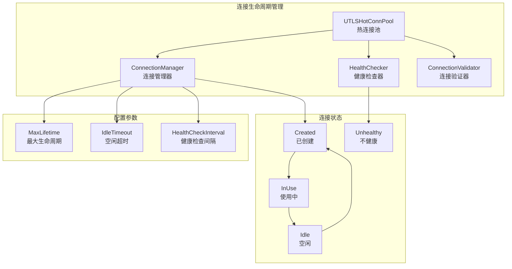
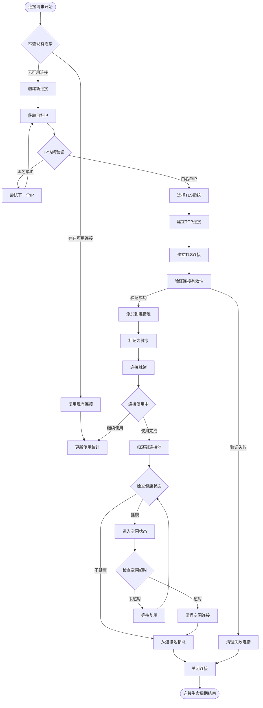
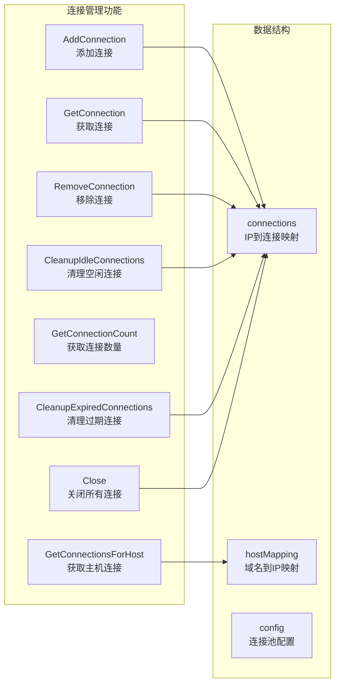
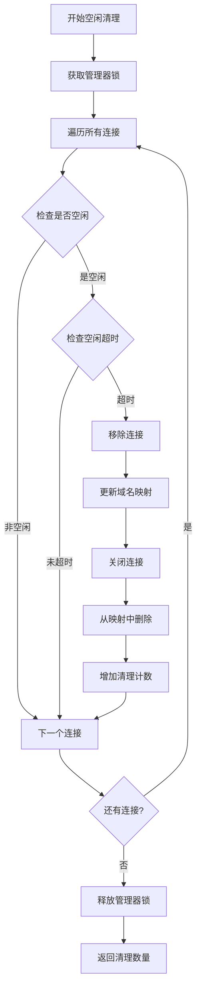
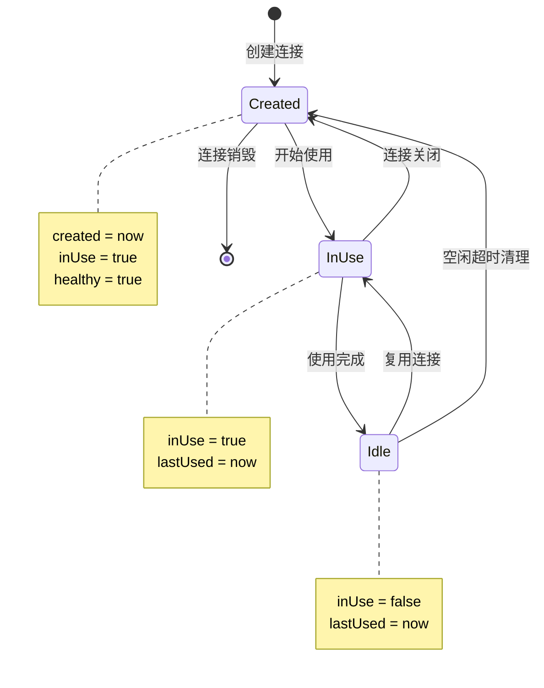
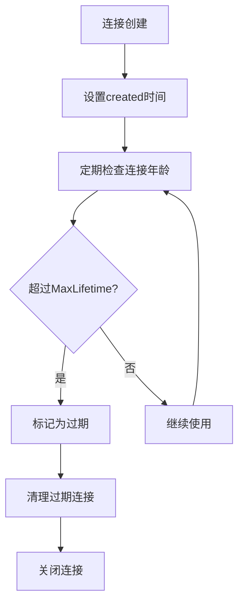
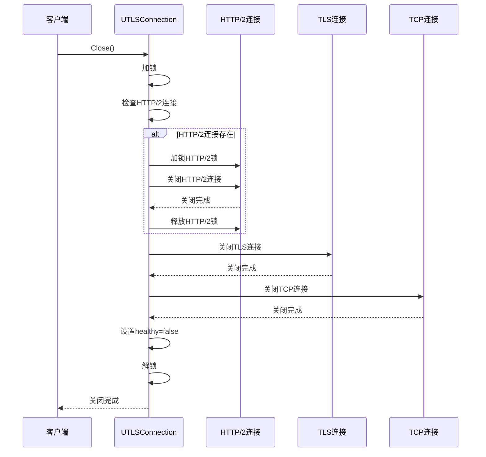
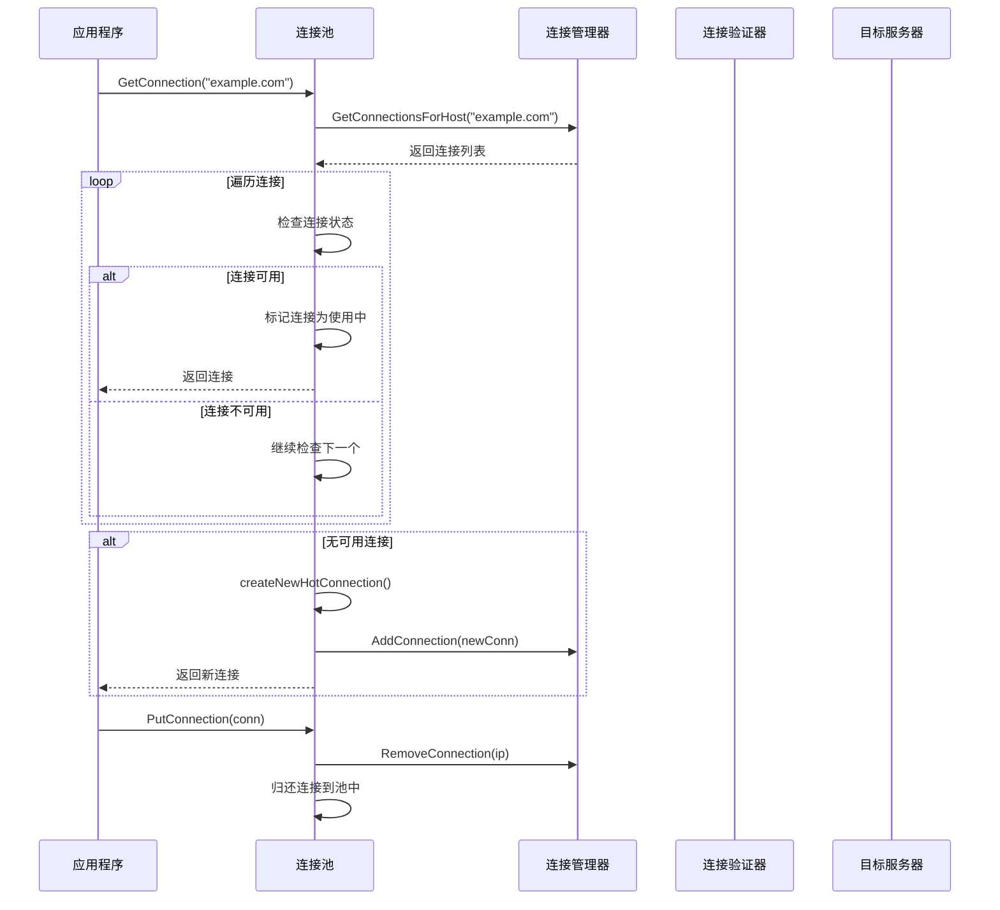
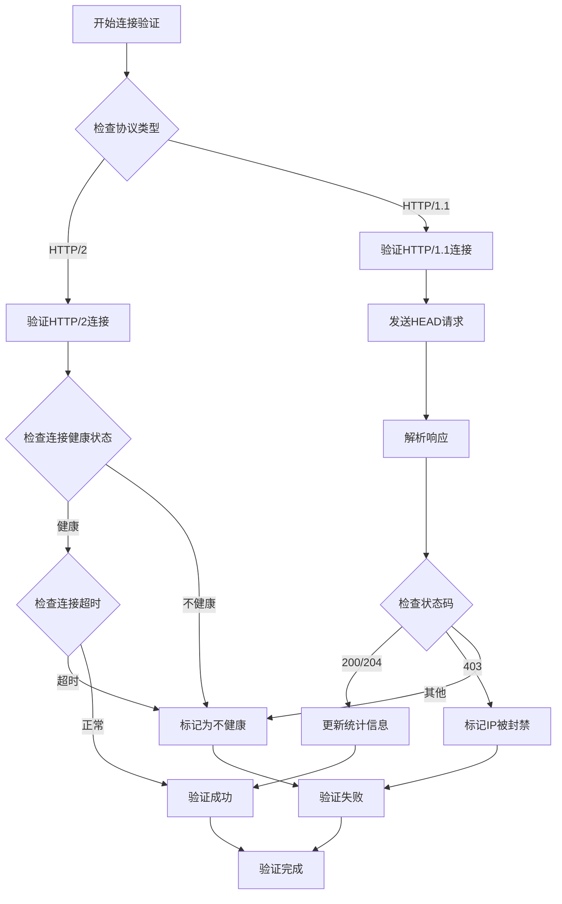
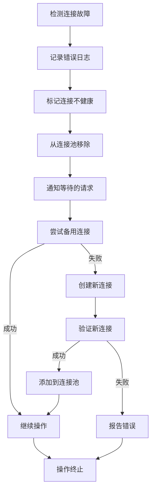

# 连接生命周期管理

<cite>
**本文档引用的文件**
- [connection_manager.go](file://utlsclient/connection_manager.go)
- [utlshotconnpool.go](file://utlsclient/utlshotconnpool.go)
- [health_checker.go](file://utlsclient/health_checker.go)
- [connection_validator.go](file://utlsclient/connection_validator.go)
- [constants.go](file://utlsclient/constants.go)
- [interfaces.go](file://utlsclient/interfaces.go)
- [connection_manager_test.go](file://test/utlsclient/connection_manager_test.go)
</cite>

## 目录
1. [概述](#概述)
2. [核心数据结构](#核心数据结构)
3. [连接生命周期阶段](#连接生命周期阶段)
4. [连接管理器详解](#连接管理器详解)
5. [连接状态转换机制](#连接状态转换机制)
6. [连接池配置与生命周期关联](#连接池配置与生命周期关联)
7. [连接关闭与资源清理](#连接关闭与资源清理)
8. [实际应用示例](#实际应用示例)
9. [最佳实践与优化建议](#最佳实践与优化建议)

## 概述

连接生命周期管理是热连接池系统的核心功能，负责从连接创建到销毁的完整流程控制。该系统通过精细的状态管理和定时清理机制，确保连接的高效利用和系统的稳定性。

### 核心组件架构



**图表来源**
- [connection_manager.go](file://utlsclient/connection_manager.go#L9-L14)
- [health_checker.go](file://utlsclient/health_checker.go#L10-L13)
- [utlshotconnpool.go](file://utlsclient/utlshotconnpool.go#L237-L258)

## 核心数据结构

### UTLSConnection 结构体

UTLSConnection 是连接生命周期管理的核心数据结构，包含了连接的所有关键信息：

```mermaid
classDiagram
class UTLSConnection {
+net.Conn conn
+*utls.UConn tlsConn
+string targetIP
+string targetHost
+Profile fingerprint
+string acceptLanguage
+interface{} h2ClientConn
+sync.Mutex h2Mu
+time.Time created
+time.Time lastUsed
+time.Time lastChecked
+bool inUse
+bool healthy
+int64 requestCount
+int64 errorCount
+sync.Mutex mu
+*sync.Cond cond
+Close() error
+Stats() ConnectionStats
+IsHealthy() bool
+RequestCount() int64
+LastUsed() time.Time
}
class ConnectionManager {
+sync.RWMutex mu
+map[string]*UTLSConnection connections
+map[string][]string hostMapping
+*PoolConfig config
+AddConnection(conn *UTLSConnection)
+GetConnection(ip string) *UTLSConnection
+RemoveConnection(ip string)
+CleanupIdleConnections() int
+CleanupExpiredConnections(time.Duration) int
}
UTLSConnection --> ConnectionManager : managed by
```

**图表来源**
- [utlshotconnpool.go](file://utlsclient/utlshotconnpool.go#L204-L233)
- [connection_manager.go](file://utlsclient/connection_manager.go#L9-L14)

### 关键字段详解

#### 生命周期管理字段

| 字段 | 类型 | 描述 | 用途 |
|------|------|------|------|
| `created` | `time.Time` | 连接创建时间 | 用于计算连接最大生命周期 |
| `lastUsed` | `time.Time` | 最后使用时间 | 用于空闲超时检测 |
| `lastChecked` | `time.Time` | 最后检查时间 | 用于健康检查间隔控制 |

#### 状态控制字段

| 字段 | 类型 | 描述 | 用途 |
|------|------|------|------|
| `inUse` | `bool` | 连接当前使用状态 | 控制连接复用和并发访问 |
| `healthy` | `bool` | 连接健康状态 | 标记连接是否可用 |

#### 统计监控字段

| 字段 | 类型 | 描述 | 用途 |
|------|------|------|------|
| `requestCount` | `int64` | 请求次数统计 | 监控连接使用频率 |
| `errorCount` | `int64` | 错误次数统计 | 监控连接稳定性 |

**节来源**
- [utlshotconnpool.go](file://utlsclient/utlshotconnpool.go#L204-L233)

## 连接生命周期阶段

### 完整生命周期流程



**图表来源**
- [utlshotconnpool.go](file://utlsclient/utlshotconnpool.go#L351-L395)
- [connection_manager.go](file://utlsclient/connection_manager.go#L25-L74)

### 关键操作详解

#### AddConnection - 添加连接

添加连接到连接管理器的过程包括：

1. **连接注册**：将连接添加到 `connections` 映射表
2. **域名映射更新**：维护 `hostMapping` 中的域名到IP映射
3. **状态初始化**：设置连接的初始状态为使用中 (`inUse=true`)
4. **时间戳设置**：初始化创建时间和最后使用时间

#### GetConnection - 获取连接

获取连接时的检查流程：

1. **并发安全检查**：使用读锁保护连接映射
2. **连接存在性验证**：确认目标IP对应的连接存在
3. **状态验证**：检查连接是否可用（非使用中且健康）

#### PutConnection - 归还连接

归还连接的关键步骤：

1. **状态更新**：标记连接为空闲 (`inUse=false`)
2. **时间戳更新**：更新最后使用时间为当前时间
3. **健康状态检查**：验证连接健康状态
4. **唤醒等待**：通知等待的goroutine连接可用

#### RemoveConnection - 移除连接

移除连接的完整流程：

1. **域名映射清理**：从 `hostMapping` 中移除对应IP
2. **连接关闭**：调用连接的 `Close()` 方法
3. **映射清理**：从 `connections` 映射中删除连接
4. **资源释放**：确保所有底层资源被正确释放

**节来源**
- [connection_manager.go](file://utlsclient/connection_manager.go#L25-L74)

## 连接管理器详解

### ConnectionManager 核心功能

ConnectionManager 是连接生命周期管理的主要协调者，提供以下核心功能：



**图表来源**
- [connection_manager.go](file://utlsclient/connection_manager.go#L9-L14)

### 并发控制机制

ConnectionManager 使用读写锁 (`sync.RWMutex`) 实现高效的并发控制：

- **读操作**：多个goroutine可以同时读取连接信息
- **写操作**：写操作需要独占锁，确保数据一致性
- **细粒度锁定**：连接级别的锁进一步减少锁竞争

### 清理机制

#### 空闲连接清理



**图表来源**
- [connection_manager.go](file://utlsclient/connection_manager.go#L141-L178)

#### 过期连接清理

过期连接清理基于连接的最大生命周期配置：

1. **时间计算**：比较当前时间与连接创建时间
2. **状态检查**：确保连接不在使用中
3. **清理执行**：移除过期连接并释放资源

**节来源**
- [connection_manager.go](file://utlsclient/connection_manager.go#L141-L218)

## 连接状态转换机制

### 状态定义与转换规则



### 健康状态管理

健康状态的转换遵循以下规则：

#### 健康状态检查流程

```mermaid
flowchart TD
StartHealthCheck[开始健康检查] --> CheckErrorCount{检查错误次数}
CheckErrorCount --> |超过阈值| MarkUnhealthy[标记为不健康]
CheckErrorCount --> |正常| CheckTimeout{检查健康检查间隔}
CheckTimeout --> |未超时| Healthy[保持健康状态]
CheckTimeout --> |超时| PerformCheck[执行健康检查]
PerformCheck --> SendRequest[发送测试请求]
SendRequest --> CheckResponse{检查响应}
CheckResponse --> |成功| UpdateTimestamp[更新最后使用时间]
CheckResponse --> |失败| MarkUnhealthy
UpdateTimestamp --> Healthy
MarkUnhealthy --> Unhealthy[不健康状态]
Healthy --> [*]
Unhealthy --> [*]
```

**图表来源**
- [health_checker.go](file://utlsclient/health_checker.go#L23-L61)

### 使用状态管理

使用状态的转换由连接池的获取和归还操作控制：

#### 连接获取流程

1. **状态检查**：验证连接不在使用中且健康
2. **双重检查**：再次确认连接状态（防止竞态条件）
3. **状态更新**：标记连接为使用中
4. **时间更新**：更新最后使用时间

#### 连接归还流程

1. **状态重置**：标记连接为空闲
2. **时间更新**：更新最后使用时间
3. **健康检查**：验证连接健康状态
4. **并发通知**：唤醒等待的goroutine

**节来源**
- [utlshotconnpool.go](file://utlsclient/utlshotconnpool.go#L441-L478)
- [utlshotconnpool.go](file://utlsclient/utlshotconnpool.go#L760-L785)

## 连接池配置与生命周期关联

### 配置参数详解

连接池配置直接影响连接的生命周期行为：

| 配置参数 | 类型 | 默认值 | 描述 | 生命周期影响 |
|----------|------|--------|------|--------------|
| `MaxLifetime` | `time.Duration` | 300s | 连接最大生命周期 | 控制连接的最长存活时间 |
| `IdleTimeout` | `time.Duration` | 60s | 空闲超时时间 | 控制空闲连接的保留时间 |
| `HealthCheckInterval` | `time.Duration` | 30s | 健康检查间隔 | 控制健康检查的频率 |
| `MaxConnections` | `int` | 100 | 最大连接数 | 限制总连接数量 |
| `MaxConnsPerHost` | `int` | 10 | 每主机最大连接数 | 限制单主机连接数量 |

### 配置对生命周期的影响

#### MaxLifetime 配置



**图表来源**
- [connection_manager.go](file://utlsclient/connection_manager.go#L180-L218)

#### IdleTimeout 配置

空闲超时控制连接在空闲状态下的保留时间：

1. **空闲检测**：检查连接是否处于空闲状态
2. **时间计算**：计算从最后使用到现在的时间差
3. **超时判断**：比较时间差与配置的空闲超时
4. **清理决策**：决定是否清理空闲连接

#### HealthCheckInterval 配置

健康检查间隔控制连接健康状态的更新频率：

1. **检查触发**：当连接空闲时间超过配置间隔时触发
2. **检查执行**：发送测试请求验证连接可用性
3. **状态更新**：根据检查结果更新连接健康状态
4. **统计更新**：更新连接的使用统计信息

**节来源**
- [utlshotconnpool.go](file://utlsclient/utlshotconnpool.go#L170-L202)

## 连接关闭与资源清理

### 关闭顺序规范

连接关闭必须按照特定顺序执行，以确保所有资源都被正确释放：



**图表来源**
- [utlshotconnpool.go](file://utlsclient/utlshotconnpool.go#L1248-L1271)

### 资源清理流程

#### HTTP/2 连接关闭

HTTP/2 连接的关闭需要特殊处理：

1. **并发安全**：使用独立的 `h2Mu` 锁保护HTTP/2连接
2. **类型断言**：检查连接是否实现了 `Close() error` 接口
3. **优雅关闭**：调用连接的关闭方法
4. **资源清零**：将 `h2ClientConn` 设置为 `nil`

#### TLS 连接关闭

TLS 连接的关闭相对简单：

1. **直接关闭**：调用 `tlsConn.Close()`
2. **错误处理**：忽略关闭过程中可能出现的错误
3. **资源释放**：TLS连接对象会被垃圾回收

#### TCP 连接关闭

TCP 连接的关闭是最基础的操作：

1. **直接关闭**：调用 `conn.Close()`
2. **错误处理**：同样忽略关闭过程中的错误
3. **网络资源释放**：确保网络连接被正确释放

### 清理后的状态

连接关闭后应达到以下状态：

| 字段 | 关闭后状态 | 说明 |
|------|------------|------|
| `healthy` | `false` | 标记连接为不可用 |
| `h2ClientConn` | `nil` | HTTP/2连接已被清理 |
| `tlsConn` | 已关闭 | TLS连接已被关闭 |
| `conn` | 已关闭 | TCP连接已被关闭 |

**节来源**
- [utlshotconnpool.go](file://utlsclient/utlshotconnpool.go#L1248-L1271)

## 实际应用示例

### 连接获取与使用流程

以下是一个典型的连接获取和使用流程示例：



**图表来源**
- [utlshotconnpool.go](file://utlsclient/utlshotconnpool.go#L351-L395)
- [connection_manager.go](file://utlsclient/connection_manager.go#L25-L74)

### 连接验证示例

连接验证是确保连接可用性的关键步骤：



**图表来源**
- [connection_validator.go](file://utlsclient/connection_validator.go#L22-L96)

### 清理任务调度

连接池会定期执行各种清理任务：

```mermaid
gantt
title 连接池清理任务调度
dateFormat X
axisFormat %s
section 主要任务
健康检查 :active, healthCheck, 0, 30
空闲连接清理 :active, idleCleanup, 60, 120
过期连接清理 :active, expiredCleanup, 180, 240
黑名单检查 :active, blacklistCheck, 300, 360
section 辅助任务
DNS更新 :aux, dnsUpdate, 1800, 3600
统计更新 :aux, statsUpdate, 60, 120
```

**节来源**
- [utlshotconnpool.go](file://utlsclient/utlshotconnpool.go#L291-L318)

## 最佳实践与优化建议

### 性能优化策略

#### 连接复用优化

1. **智能复用**：优先选择最近使用的连接
2. **健康优先**：优先使用健康的连接
3. **负载均衡**：在多个可用连接间均匀分配请求

#### 并发控制优化

1. **读写分离**：使用读写锁分离读写操作
2. **细粒度锁定**：在连接级别使用独立锁
3. **无锁设计**：对只读操作使用原子操作

### 监控与调试

#### 关键指标监控

| 指标名称 | 计算方式 | 监控意义 |
|----------|----------|----------|
| 连接利用率 | `ActiveConnections / TotalConnections` | 表示连接池的使用效率 |
| 连接复用率 | `ReusedConnections / TotalRequests` | 表示连接复用效果 |
| 连接健康率 | `HealthyConnections / TotalConnections` | 表示连接池的健康状况 |
| 平均响应时间 | `TotalResponseTime / TotalRequests` | 表示连接性能 |

#### 调试技巧

1. **日志分级**：使用不同级别的日志记录连接状态变化
2. **状态快照**：定期记录连接池状态用于问题排查
3. **性能追踪**：跟踪连接创建、使用、销毁的耗时

### 故障处理策略

#### 连接故障恢复



#### 配置调优建议

1. **合理设置超时**：根据网络环境调整连接超时时间
2. **动态调整池大小**：根据负载情况动态调整连接池大小
3. **监控健康状态**：及时发现和处理不健康的连接

### 安全考虑

#### 连接安全

1. **证书验证**：确保TLS连接的证书有效性
2. **指纹管理**：定期更新和轮换TLS指纹
3. **访问控制**：实施IP黑白名单机制

#### 资源保护

1. **内存管理**：及时清理不再使用的连接
2. **网络资源**：避免连接泄漏导致的资源耗尽
3. **并发控制**：防止过多并发连接导致系统过载

通过以上详细的连接生命周期管理分析，我们可以看到该系统在设计上充分考虑了性能、稳定性和可维护性，为高并发场景下的连接管理提供了可靠的解决方案。