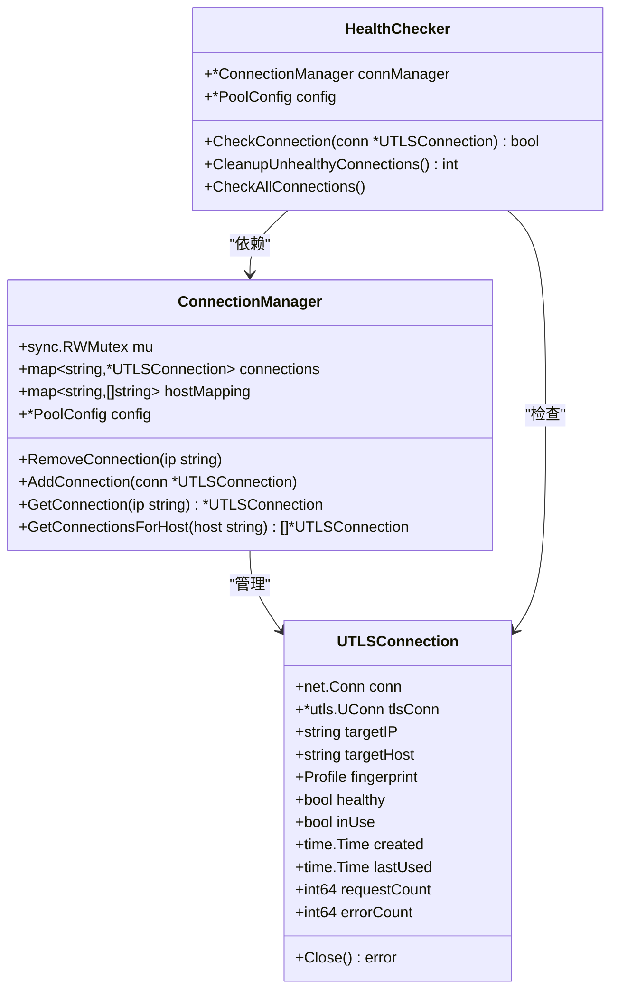
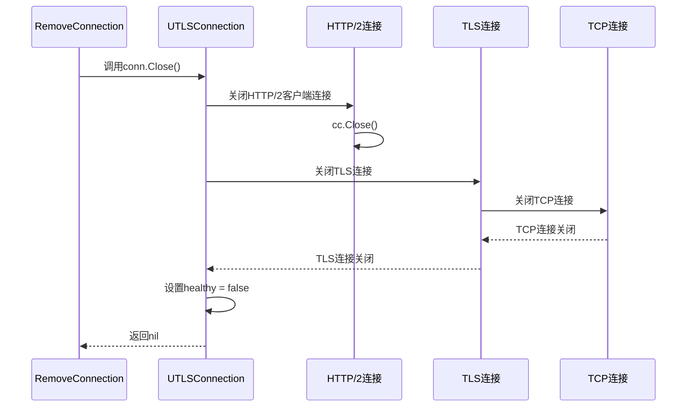
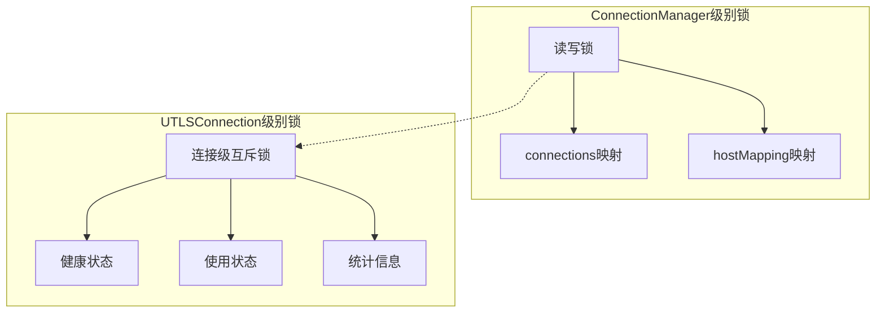
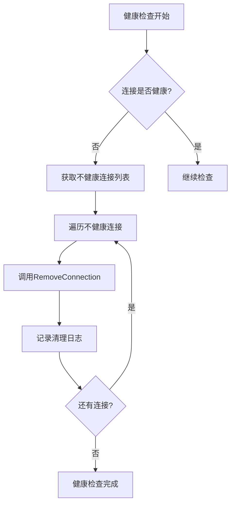
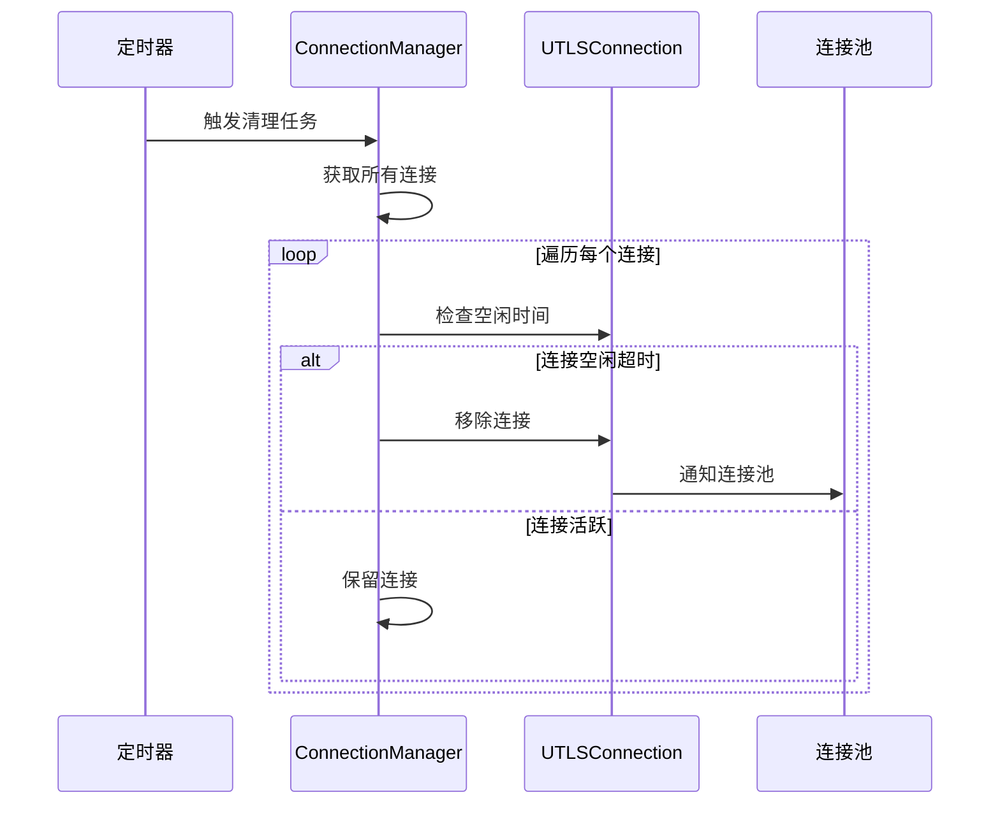
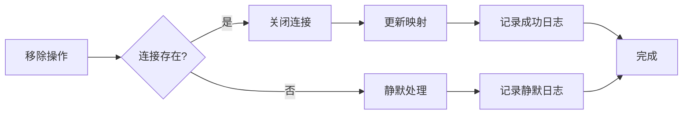

# 连接移除功能详细文档

<cite>
**本文档引用的文件**
- [connection_manager.go](file://utlsclient/connection_manager.go)
- [health_checker.go](file://utlsclient/health_checker.go)
- [utlshotconnpool.go](file://utlsclient/utlshotconnpool.go)
- [connection_validator.go](file://utlsclient/connection_validator.go)
- [interfaces.go](file://utlsclient/interfaces.go)
- [connection_manager_test.go](file://test/utlsclient/connection_manager_test.go)
- [test_helpers.go](file://utlsclient/test_helpers.go)
</cite>

## 目录
1. [概述](#概述)
2. [核心组件架构](#核心组件架构)
3. [RemoveConnection方法详解](#removeconnection方法详解)
4. [连接资源清理流程](#连接资源清理流程)
5. [锁竞争策略](#锁竞争策略)
6. [连接移除触发场景](#连接移除触发场景)
7. [静默处理机制](#静默处理机制)
8. [日志记录系统](#日志记录系统)
9. [性能考虑](#性能考虑)
10. [最佳实践建议](#最佳实践建议)

## 概述

连接移除功能是连接管理系统的核心组件之一，负责从连接管理器中安全地移除指定IP的连接。该功能通过`RemoveConnection`方法实现，确保连接的完整生命周期管理，包括从主连接映射和域名映射中的同步删除，以及连接资源的安全清理。

## 核心组件架构

### 连接管理器结构



**图表来源**
- [connection_manager.go](file://utlsclient/connection_manager.go#L8-L13)
- [utlshotconnpool.go](file://utlsclient/utlshotconnpool.go#L204-L233)
- [health_checker.go](file://utlsclient/health_checker.go#L9-L12)

**节来源**
- [connection_manager.go](file://utlsclient/connection_manager.go#L8-L13)
- [utlshotconnpool.go](file://utlsclient/utlshotconnpool.go#L204-L233)

## RemoveConnection方法详解

### 方法签名与参数

`RemoveConnection`方法接受目标IP地址作为参数，从连接管理器中移除对应的连接。该方法确保在多线程环境下安全地执行连接移除操作。

### 核心执行流程

```mermaid
flowchart TD
Start([开始移除连接]) --> Lock["获取互斥锁<br/>cm.mu.Lock()"]
Lock --> CheckExists{"连接是否存在?"}
CheckExists --> |否| Unlock["释放锁<br/>defer cm.mu.Unlock()"]
CheckExists --> |是| RemoveFromHost["从域名映射中移除<br/>hostList中删除对应IP"]
RemoveFromHost --> CloseConn["关闭连接<br/>conn.Close()"]
CloseConn --> RemoveFromMap["从连接映射中删除<br/>delete(cm.connections, ip)"]
RemoveFromMap --> Log["记录日志<br/>Debug(\"连接已从管理器移除: %s\", ip)"]
Log --> Unlock
Unlock --> End([结束])
```

**图表来源**
- [connection_manager.go](file://utlsclient/connection_manager.go#L49-L73)

### 详细步骤分析

1. **锁获取与保护**：方法首先获取读写锁，确保在并发环境下操作的安全性
2. **存在性检查**：验证指定IP的连接是否存在，避免对不存在连接的操作
3. **域名映射同步删除**：从hostMapping中移除对应的IP地址，维护域名到IP的映射一致性
4. **连接资源关闭**：调用连接的Close方法，确保底层TCP和TLS连接得到正确关闭
5. **主映射删除**：从connections主映射中删除连接条目
6. **日志记录**：记录连接移除的详细信息，便于监控和调试

**节来源**
- [connection_manager.go](file://utlsclient/connection_manager.go#L49-L73)

## 连接资源清理流程

### Close方法实现

连接的关闭过程涉及多个层次的资源清理：



**图表来源**
- [utlshotconnpool.go](file://utlsclient/utlshotconnpool.go#L1248-L1271)

### 清理顺序的重要性

1. **HTTP/2连接优先关闭**：确保HTTP/2层面的资源得到及时释放
2. **TLS连接关闭**：断开加密传输层连接
3. **TCP连接关闭**：最终释放底层网络连接
4. **状态标志更新**：设置连接为不健康状态，防止后续使用

**节来源**
- [utlshotconnpool.go](file://utlsclient/utlshotconnpool.go#L1248-L1271)

## 锁竞争策略

### 读写锁机制

连接管理器采用读写锁(`sync.RWMutex`)来优化并发性能：

| 操作类型 | 锁类型 | 性能影响 | 使用场景 |
|---------|--------|----------|----------|
| 连接添加/移除 | 写锁 | 较高 | 修改连接映射 |
| 连接查询 | 读锁 | 较低 | 查询连接信息 |
| 健康检查 | 读锁 | 较低 | 批量检查连接 |

### 锁粒度控制



**图表来源**
- [connection_manager.go](file://utlsclient/connection_manager.go#L10)
- [utlshotconnpool.go](file://utlsclient/utlshotconnpool.go#L231)

**节来源**
- [connection_manager.go](file://utlsclient/connection_manager.go#L10)
- [utlshotconnpool.go](file://utlsclient/utlshotconnpool.go#L231)

## 连接移除触发场景

### 健康检查失败

健康检查器会在检测到连接不健康时自动移除连接：



**图表来源**
- [health_checker.go](file://utlsclient/health_checker.go#L154-L163)

### 连接验证失败

连接验证失败时会触发移除操作：

| 验证类型 | 失败原因 | 移除动作 | 后续处理 |
|---------|----------|----------|----------|
| HTTP状态码 | 403 Forbidden | 移除连接 | 加入黑名单 |
| 连接超时 | 请求超时 | 移除连接 | 增加错误计数 |
| 协议错误 | 握手失败 | 移除连接 | 记录错误日志 |
| 响应异常 | 状态码异常 | 移除连接 | 更新统计信息 |

### 空闲连接清理

空闲超时的连接会被定期清理：



**图表来源**
- [connection_manager.go](file://utlsclient/connection_manager.go#L141-L177)

**节来源**
- [health_checker.go](file://utlsclient/health_checker.go#L154-L163)
- [connection_manager.go](file://utlsclient/connection_manager.go#L141-L177)

## 静默处理机制

### 不存在连接的处理

当尝试移除不存在的连接时，`RemoveConnection`方法采用静默处理策略：

```go
// 移除不存在的连接时的行为
func (cm *ConnectionManager) RemoveConnection(ip string) {
    cm.mu.Lock()
    defer cm.mu.Unlock()

    if conn, exists := cm.connections[ip]; exists {
        // 存在的连接处理逻辑
    } else {
        // 不存在的连接 - 静默忽略
        // 不抛出错误，也不记录异常日志
    }
}
```

### 静默处理的优势

1. **性能优化**：避免不必要的错误处理开销
2. **幂等性保证**：多次移除同一连接是安全的
3. **简化调用方逻辑**：调用方无需检查连接是否存在
4. **容错能力**：系统能够容忍不一致的状态

**节来源**
- [connection_manager.go](file://utlsclient/connection_manager.go#L49-L73)

## 日志记录系统

### 日志级别与内容

连接移除操作会记录详细的调试信息：

| 日志级别 | 记录内容 | 示例消息 | 使用场景 |
|---------|----------|----------|----------|
| Debug | 连接移除成功 | "连接已从管理器移除: 1.2.3.4" | 开发调试 |
| Debug | 健康检查清理 | "清理不健康连接: 1.2.3.4" | 运维监控 |
| Debug | 空闲连接清理 | "清理空闲连接: 1.2.3.4" | 性能优化 |

### 日志记录时机



**图表来源**
- [connection_manager.go](file://utlsclient/connection_manager.go#L72)

**节来源**
- [connection_manager.go](file://utlsclient/connection_manager.go#L72)

## 性能考虑

### 并发安全性

连接移除操作在高并发环境下表现出良好的性能特征：

1. **读写锁分离**：读操作不阻塞其他读操作，提高并发性能
2. **细粒度锁定**：只在必要时获取写锁，减少锁竞争
3. **原子操作**：连接移除是一个原子操作，避免中间状态

### 内存管理

1. **及时垃圾回收**：移除连接后，Go的垃圾回收器会自动清理不再引用的对象
2. **映射清理**：删除操作会清理对应的映射条目，防止内存泄漏
3. **资源释放**：确保所有底层资源得到正确释放

### 性能监控指标

| 指标名称 | 监控目的 | 正常范围 | 异常阈值 |
|---------|----------|----------|----------|
| 移除频率 | 连接健康状况 | 1-10次/小时 | >100次/小时 |
| 移除延迟 | 系统响应性能 | <10ms | >100ms |
| 内存使用 | 资源消耗 | <100MB | >500MB |
| 错误率 | 系统稳定性 | <1% | >5% |

## 最佳实践建议

### 连接管理策略

1. **定期健康检查**：建议每5分钟执行一次健康检查
2. **合理的超时设置**：根据业务需求设置合适的空闲和生命周期超时
3. **监控关键指标**：关注连接移除频率和成功率
4. **日志分级管理**：合理使用不同级别的日志记录

### 错误处理建议

1. **优雅降级**：连接移除失败时不应影响其他操作
2. **重试机制**：对于临时性故障，可考虑重试策略
3. **告警设置**：当移除频率过高时触发告警
4. **容量规划**：根据移除频率调整连接池大小

### 调试与监控

1. **启用详细日志**：在开发和测试环境中启用Debug级别日志
2. **性能基准测试**：定期测试连接移除的性能表现
3. **异常情况分析**：分析频繁移除的原因和模式
4. **容量趋势分析**：监控连接池使用情况的变化趋势

**节来源**
- [health_checker.go](file://utlsclient/health_checker.go#L23-L60)
- [connection_manager.go](file://utlsclient/connection_manager.go#L141-L177)