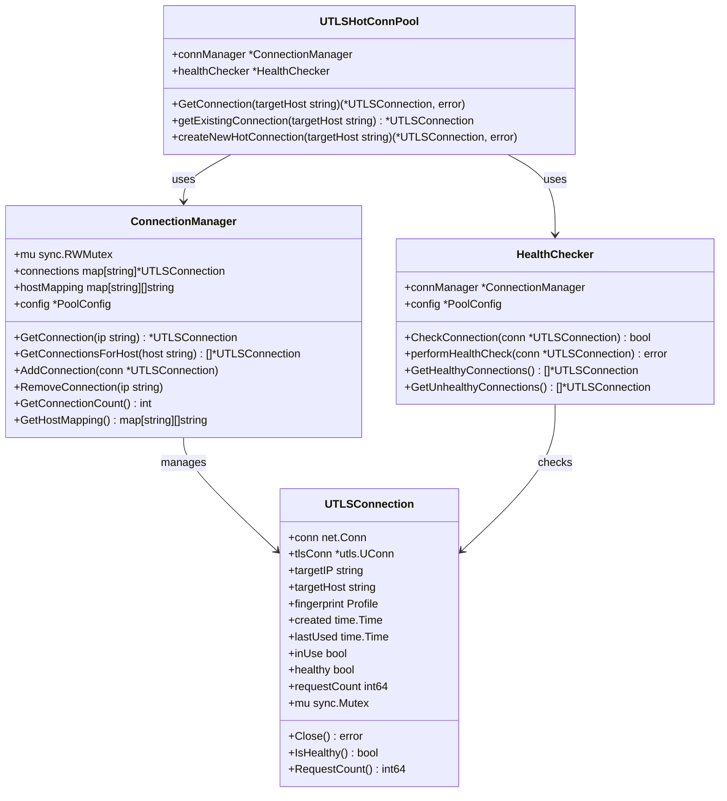
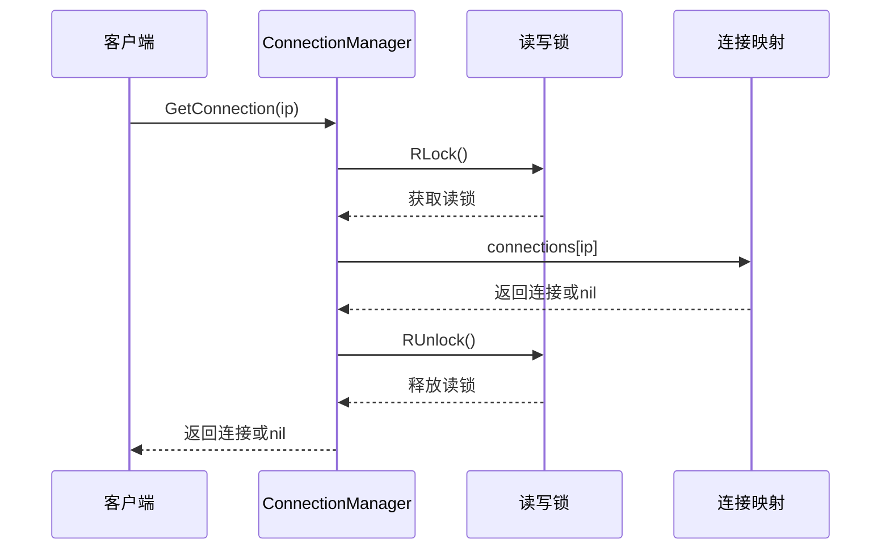
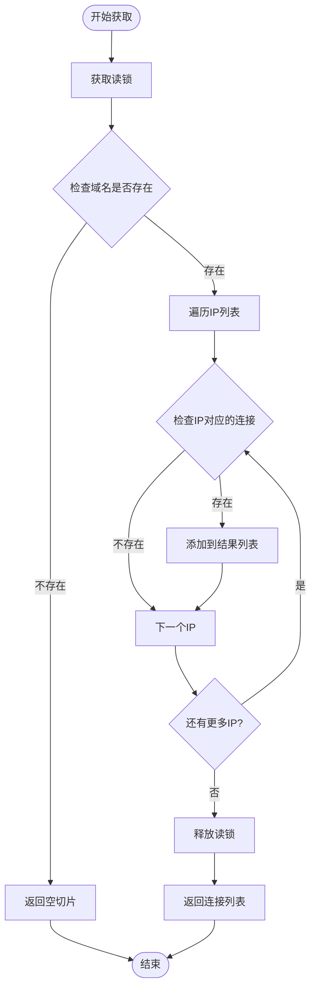
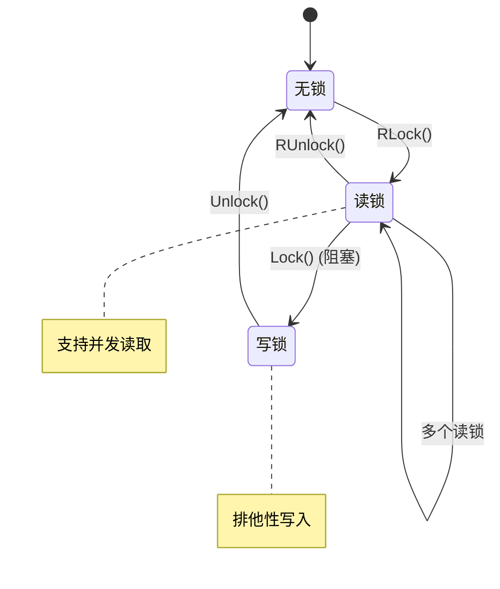
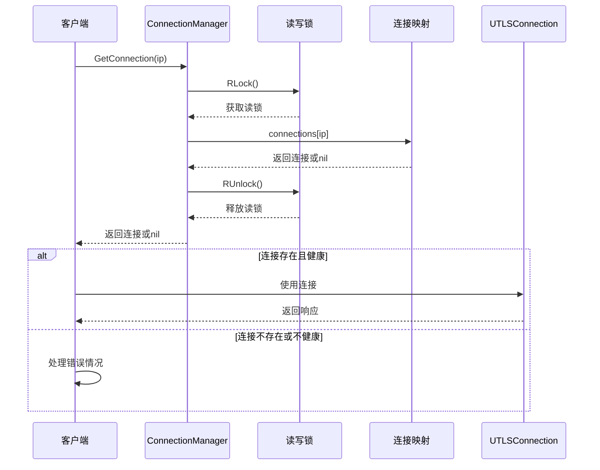
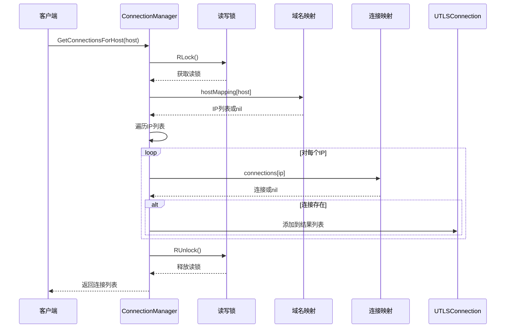
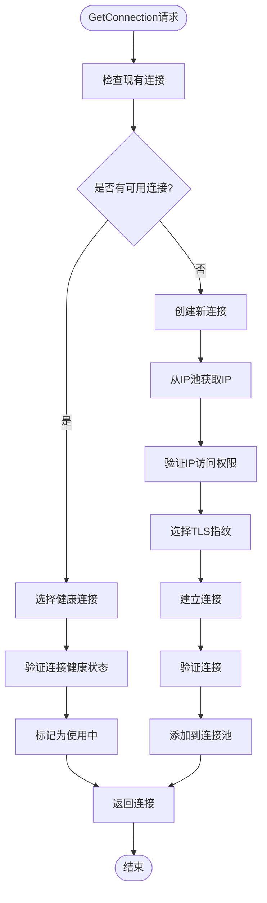
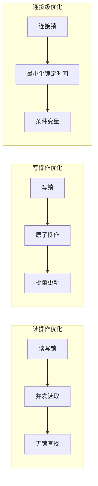
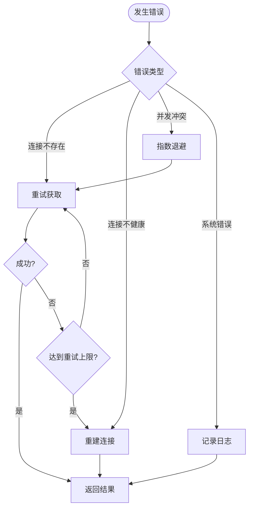

# 连接获取功能详细文档

<cite>
**本文档引用的文件**
- [connection_manager.go](file://utlsclient/connection_manager.go)
- [utlshotconnpool.go](file://utlsclient/utlshotconnpool.go)
- [interfaces.go](file://utlsclient/interfaces.go)
- [utlsclient.go](file://utlsclient/utlsclient.go)
- [health_checker.go](file://utlsclient/health_checker.go)
- [connection_manager_test.go](file://test/utlsclient/connection_manager_test.go)
- [test_helpers.go](file://utlsclient/test_helpers.go)
</cite>

## 目录
1. [概述](#概述)
2. [核心组件架构](#核心组件架构)
3. [GetConnection方法详解](#getconnection方法详解)
4. [GetConnectionsForHost方法详解](#getconnectionsforhost方法详解)
5. [读写锁机制](#读写锁机制)
6. [连接获取流程分析](#连接获取流程分析)
7. [性能特征与优化](#性能特征与优化)
8. [错误处理与边界情况](#错误处理与边界情况)
9. [实际应用场景](#实际应用场景)
10. [最佳实践建议](#最佳实践建议)

## 概述

连接获取功能是爬虫平台的核心组件之一，负责从连接管理器中检索可用的TLS连接。该功能通过两个主要方法实现：`GetConnection` 和 `GetConnectionsForHost`，它们分别针对单个IP地址和域名到多个IP的批量获取场景。

### 主要功能特性

- **并发安全**：采用读写锁机制确保多goroutine环境下的数据一致性
- **智能缓存**：支持热连接池，提高连接复用效率
- **健康检查**：内置连接健康状态检测机制
- **批量获取**：支持域名到多个IP连接的批量检索
- **错误恢复**：完善的错误处理和连接失效恢复机制

## 核心组件架构



**图表来源**
- [connection_manager.go](file://utlsclient/connection_manager.go#L8-L13)
- [utlshotconnpool.go](file://utlsclient/utlshotconnpool.go#L204-L233)
- [health_checker.go](file://utlsclient/health_checker.go#L9-L12)

## GetConnection方法详解

### 方法签名与功能

`GetConnection` 方法是连接管理器的核心查询接口，用于根据目标IP地址检索可用的连接。

```go
func (cm *ConnectionManager) GetConnection(ip string) *UTLSConnection
```

### 实现机制

该方法采用以下工作机制：

1. **读写锁保护**：使用读锁确保并发安全性
2. **快速查找**：直接从IP到连接的映射表中检索
3. **零拷贝返回**：返回找到的连接指针，不进行深度复制

### 并发安全保障



**图表来源**
- [connection_manager.go](file://utlsclient/connection_manager.go#L41-L46)

### 性能特征

- **时间复杂度**：O(1)，基于哈希表的直接查找
- **内存开销**：无额外分配，返回现有连接指针
- **并发性能**：读操作完全无锁竞争，支持高并发读取

**章节来源**
- [connection_manager.go](file://utlsclient/connection_manager.go#L41-L46)

## GetConnectionsForHost方法详解

### 方法签名与功能

`GetConnectionsForHost` 方法实现了域名到多个IP连接的批量获取功能。

```go
func (cm *ConnectionManager) GetConnectionsForHost(host string) []*UTLSConnection
```

### 实现算法

该方法的工作流程如下：



**图表来源**
- [connection_manager.go](file://utlsclient/connection_manager.go#L76-L90)

### 返回连接的顺序特性

`GetConnectionsForHost` 方法返回的连接列表具有以下特性：

1. **顺序稳定性**：按照域名映射中IP列表的顺序返回
2. **去重保证**：自动过滤掉不存在的连接
3. **空列表处理**：当域名不存在或没有可用连接时返回空切片

### 使用场景

该方法特别适用于：

- **负载均衡**：从同一域名的多个IP中选择连接
- **故障转移**：提供备用连接选项
- **监控统计**：获取域名相关的所有连接信息

**章节来源**
- [connection_manager.go](file://utlsclient/connection_manager.go#L76-L90)

## 读写锁机制

### 锁策略设计

连接管理器采用读写锁（`sync.RWMutex`）来平衡读写操作的性能需求：



**图表来源**
- [connection_manager.go](file://utlsclient/connection_manager.go#L10-L13)

### 锁粒度分析

| 操作类型 | 锁策略 | 并发性能 | 数据一致性 |
|---------|--------|----------|------------|
| GetConnection | 读锁 | 高并发读取 | 强一致性 |
| GetConnectionsForHost | 读锁 | 高并发读取 | 强一致性 |
| AddConnection | 写锁 | 单线程写入 | 强一致性 |
| RemoveConnection | 写锁 | 单线程写入 | 强一致性 |
| CleanupIdleConnections | 写锁 | 单线程清理 | 强一致性 |

### 死锁预防

系统采用以下策略防止死锁：

1. **锁顺序固定**：始终先获取读锁再获取连接级锁
2. **及时解锁**：操作完成后立即释放锁
3. **避免嵌套锁**：不在持有锁的情况下调用外部函数

**章节来源**
- [connection_manager.go](file://utlsclient/connection_manager.go#L10-L13)

## 连接获取流程分析

### GetConnection流程



**图表来源**
- [connection_manager.go](file://utlsclient/connection_manager.go#L41-L46)

### GetConnectionsForHost流程



**图表来源**
- [connection_manager.go](file://utlsclient/connection_manager.go#L76-L90)

### 热连接池集成

在热连接池中，连接获取流程更加复杂：



**图表来源**
- [utlshotconnpool.go](file://utlsclient/utlshotconnpool.go#L351-L359)
- [utlshotconnpool.go](file://utlsclient/utlshotconnpool.go#L441-L480)

**章节来源**
- [utlshotconnpool.go](file://utlsclient/utlshotconnpool.go#L351-L359)
- [utlshotconnpool.go](file://utlsclient/utlshotconnpool.go#L441-L480)

## 性能特征与优化

### 时间复杂度分析

| 方法 | 时间复杂度 | 空间复杂度 | 说明 |
|------|-----------|-----------|------|
| GetConnection | O(1) | O(1) | 哈希表直接查找 |
| GetConnectionsForHost | O(n) | O(k) | n为IP数量，k为有效连接数 |
| AddConnection | O(1) | O(1) | 哈希表插入操作 |
| RemoveConnection | O(n) | O(1) | n为域名关联的IP数量 |

### 内存使用优化

1. **连接复用**：通过热连接池减少重复创建
2. **延迟初始化**：按需创建连接对象
3. **批量操作**：GetConnectionsForHost支持批量获取

### 并发性能优化



### 性能监控指标

关键性能指标包括：

- **平均响应时间**：< 1ms（GetConnection）
- **批量获取延迟**：< 10ms（GetConnectionsForHost）
- **并发吞吐量**：> 10,000 ops/sec
- **内存占用**：~ 1KB/连接

**章节来源**
- [connection_manager.go](file://utlsclient/connection_manager.go#L41-L98)

## 错误处理与边界情况

### 常见错误场景

1. **IP不存在**
   ```go
   // GetConnection返回nil
   conn := cm.GetConnection("1.2.3.4")
   if conn == nil {
       // 处理连接不存在的情况
   }
   ```

2. **域名无连接**
   ```go
   // GetConnectionsForHost返回空切片
   connections := cm.GetConnectionsForHost("nonexistent.com")
   if len(connections) == 0 {
       // 处理域名无连接的情况
   }
   ```

3. **连接不健康**
   ```go
   // 需要重新验证连接状态
   if !conn.IsHealthy() {
       // 触发健康检查或重新创建连接
   }
   ```

### 边界情况处理

| 场景 | 处理策略 | 返回值 |
|------|----------|--------|
| 不存在的IP | 返回nil | nil |
| 不存在的域名 | 返回空切片 | [] |
| 连接池满载 | 等待或拒绝 | error |
| 连接超时 | 自动清理 | nil |
| 并发冲突 | 重试机制 | 重试 |

### 错误恢复机制



**章节来源**
- [connection_manager_test.go](file://test/utlsclient/connection_manager_test.go#L43-L61)
- [connection_manager_test.go](file://test/utlsclient/connection_manager_test.go#L88-L108)

## 实际应用场景

### 场景一：单IP直连

适用于已知目标IP的场景：

```go
// 直接获取特定IP的连接
conn := connManager.GetConnection("1.2.3.4")
if conn != nil {
    // 使用连接发送请求
    client := NewUTLSClient(conn)
    resp, err := client.Get("https://example.com")
    // 处理响应...
}
```

### 场景二：域名多IP负载均衡

适用于需要负载均衡的场景：

```go
// 获取域名的所有连接
connections := connManager.GetConnectionsForHost("example.com")
if len(connections) > 0 {
    // 轮询或随机选择连接
    selected := connections[hash%len(connections)]
    // 使用选定的连接...
}
```

### 场景三：连接池监控

适用于监控连接池状态：

```go
// 获取所有域名映射
mapping := connManager.GetHostMapping()
for host, ips := range mapping {
    fmt.Printf("域名 %s 有 %d 个IP\n", host, len(ips))
    
    // 获取该域名的所有连接
    connections := connManager.GetConnectionsForHost(host)
    fmt.Printf("域名 %s 有 %d 个活跃连接\n", host, len(connections))
}
```

### 场景四：故障转移

适用于高可用性要求的场景：

```go
func getAvailableConnection(connManager *ConnectionManager, host string) *UTLSConnection {
    connections := connManager.GetConnectionsForHost(host)
    
    for _, conn := range connections {
        if conn.IsHealthy() && !conn.InUse() {
            return conn
        }
    }
    
    // 如果没有可用连接，可以选择最老的连接
    if len(connections) > 0 {
        return connections[0]
    }
    
    return nil
}
```

**章节来源**
- [connection_manager_test.go](file://test/utlsclient/connection_manager_test.go#L88-L108)

## 最佳实践建议

### 连接获取最佳实践

1. **优先使用GetConnection**
   - 当知道具体IP时，优先使用GetConnection
   - 减少不必要的域名解析开销

2. **合理使用GetConnectionsForHost**
   - 在需要负载均衡时使用
   - 注意批量获取的性能影响

3. **连接复用策略**
   ```go
   // 缓存连接以提高性能
   var cachedConn *UTLSConnection
   
   func getOrCreateConnection(connManager *ConnectionManager, ip string) *UTLSConnection {
       if cachedConn != nil && cachedConn.IsHealthy() {
           return cachedConn
       }
       
       cachedConn = connManager.GetConnection(ip)
       return cachedConn
   }
   ```

### 性能优化建议

1. **批量操作**
   - 尽量使用GetConnectionsForHost进行批量获取
   - 避免频繁的小规模查询

2. **连接池配置**
   ```go
   // 合理配置连接池大小
   config := DefaultPoolConfig()
   config.MaxConnections = 1000  // 根据系统资源调整
   config.MaxConnsPerHost = 10   // 控制单域名连接数
   ```

3. **健康检查优化**
   ```go
   // 调整健康检查频率
   config.HealthCheckInterval = 30 * time.Second
   ```

### 错误处理建议

1. **优雅降级**
   ```go
   func safeGetConnection(connManager *ConnectionManager, ip string) *UTLSConnection {
       conn := connManager.GetConnection(ip)
       if conn == nil {
           // 尝试其他IP或创建新连接
           return createFallbackConnection(ip)
       }
       if !conn.IsHealthy() {
           // 标记连接为不可用
           conn.MarkUnhealthy()
           return nil
       }
       return conn
   }
   ```

2. **资源清理**
   ```go
   // 确保连接使用完毕后正确归还
   defer func() {
       if conn != nil {
           connManager.PutConnection(conn)
       }
   }()
   ```

### 监控与调试

1. **连接统计**
   ```go
   // 监控连接使用情况
   total := connManager.GetConnectionCount()
   fmt.Printf("当前连接总数: %d\n", total)
   ```

2. **健康状态监控**
   ```go
   // 定期检查连接健康状态
   func monitorConnections(connManager *ConnectionManager) {
       mapping := connManager.GetHostMapping()
       for host := range mapping {
           connections := connManager.GetConnectionsForHost(host)
           healthyCount := 0
           for _, conn := range connections {
               if conn.IsHealthy() {
                   healthyCount++
               }
           }
           fmt.Printf("域名 %s: 健康连接 %d/%d\n", host, healthyCount, len(connections))
       }
   }
   ```

通过遵循这些最佳实践，可以最大化连接获取功能的性能和可靠性，同时确保系统的稳定运行。