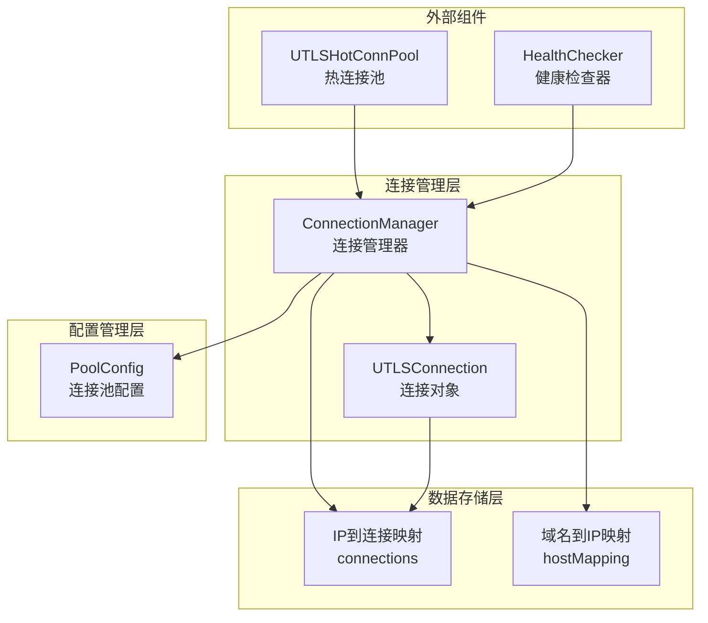
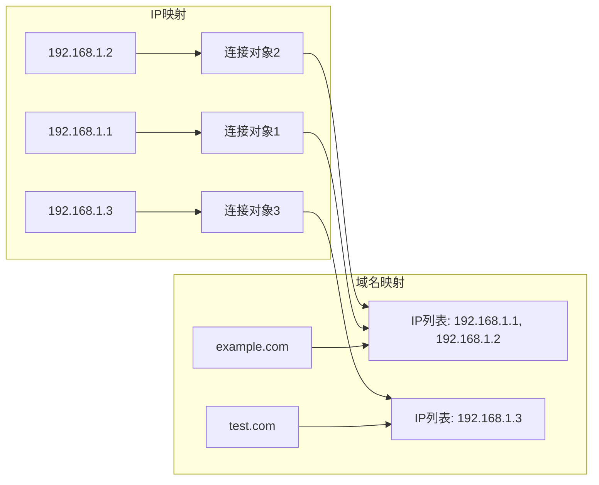
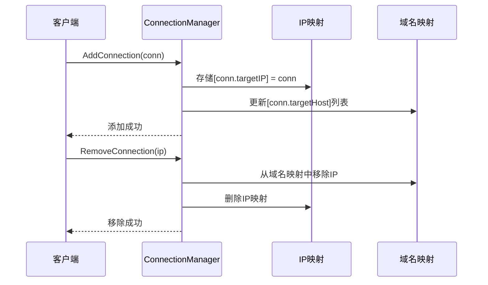
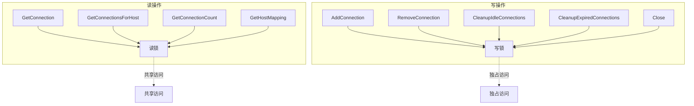
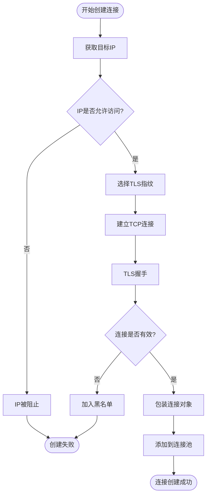
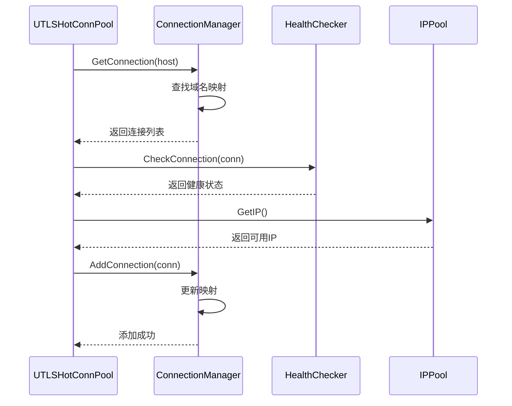

# 连接管理子系统详细文档

<cite>
**本文档引用的文件**
- [connection_manager.go](file://utlsclient/connection_manager.go)
- [utlshotconnpool.go](file://utlsclient/utlshotconnpool.go)
- [interfaces.go](file://utlsclient/interfaces.go)
- [constants.go](file://utlsclient/constants.go)
- [connection_helpers.go](file://utlsclient/connection_helpers.go)
- [utlsclient.go](file://utlsclient/utlsclient.go)
- [connection_manager_test.go](file://test/utlsclient/connection_manager_test.go)
- [test_helpers.go](file://utlsclient/test_helpers.go)
</cite>

## 目录
1. [简介](#简介)
2. [系统架构概览](#系统架构概览)
3. [核心组件分析](#核心组件分析)
4. [ConnectionManager详细分析](#connectionmanager详细分析)
5. [UTLSConnection结构体设计](#utlsconnection结构体设计)
6. [连接池映射机制](#连接池映射机制)
7. [并发安全设计](#并发安全设计)
8. [连接生命周期管理](#连接生命周期管理)
9. [连接限制策略](#连接限制策略)
10. [与其他组件的交互](#与其他组件的交互)
11. [最佳实践与使用示例](#最佳实践与使用示例)
12. [故障排除指南](#故障排除指南)

## 简介

连接管理子系统是UTLS热连接池的核心组件，负责管理所有活跃的TLS连接的生命周期。该系统提供了高效的连接池管理功能，包括连接的创建、获取、移除、健康检查和自动清理等核心功能。通过精心设计的数据结构和并发控制机制，确保了高并发场景下的稳定性和性能。

## 系统架构概览

连接管理子系统采用分层架构设计，主要包含以下核心层次：



**图表来源**
- [connection_manager.go](file://utlsclient/connection_manager.go#L9-L14)
- [utlshotconnpool.go](file://utlsclient/utlshotconnpool.go#L170-L183)

## 核心组件分析

### ConnectionManager - 连接管理器

ConnectionManager是连接管理子系统的核心组件，负责协调所有连接相关的操作。它维护着两个关键的数据结构：

1. **IP到连接的映射** (`connections`)：以目标IP地址为键，存储对应的连接对象
2. **域名到IP列表的映射** (`hostMapping`)：以目标域名为键，存储该域名对应的所有IP地址列表

### UTLSConnection - 连接对象

UTLSConnection是对单个TLS连接的封装，包含了连接的所有相关信息和状态：

- **基础连接信息**：TCP连接、uTLS连接、目标IP和域名
- **指纹信息**：使用的TLS指纹配置和随机生成的Accept-Language头
- **生命周期管理**：创建时间、最后使用时间、健康状态等
- **使用统计**：请求次数、错误次数等统计信息
- **并发控制**：连接级锁和条件变量

**章节来源**
- [connection_manager.go](file://utlsclient/connection_manager.go#L9-L14)
- [utlshotconnpool.go](file://utlsclient/utlshotconnpool.go#L204-L233)

## ConnectionManager详细分析

### 数据结构设计

ConnectionManager采用了双映射的设计模式，这种设计具有以下优势：



**图表来源**
- [connection_manager.go](file://utlsclient/connection_manager.go#L10-L12)

### 核心方法详解

#### AddConnection - 添加连接

添加连接时，ConnectionManager会同时更新两个映射表：

1. **IP映射**：直接将连接对象存储到IP映射中
2. **域名映射**：检查域名是否存在，如果不存在则创建新的IP列表，然后将新IP添加到列表中

#### GetConnection - 获取连接

获取连接时，ConnectionManager只需要查询IP映射即可快速定位目标连接。

#### RemoveConnection - 移除连接

移除连接是一个复杂的过程，需要同步更新两个映射表：

1. 从域名映射中移除对应的IP地址
2. 关闭连接对象
3. 从IP映射中删除连接

#### GetConnectionsForHost - 获取域名所有连接

该方法展示了双映射设计的优势，可以直接通过域名映射获取该域名下的所有IP，然后逐一查找对应的连接对象。

**章节来源**
- [connection_manager.go](file://utlsclient/connection_manager.go#L25-L91)

## UTLSConnection结构体设计

### 字段详解

UTLSConnection结构体包含了连接的完整信息，每个字段都有明确的用途：

#### 基础连接信息
- **conn**: 底层TCP连接，用于网络通信
- **tlsConn**: uTLS连接对象，提供TLS加密功能
- **targetIP**: 目标服务器的IP地址
- **targetHost**: 目标服务器的域名，用于HTTP Host头

#### 指纹信息
- **fingerprint**: 使用的TLS指纹配置，影响TLS握手行为
- **acceptLanguage**: 随机生成的Accept-Language头，增加伪装效果

#### HTTP/2支持
- **h2ClientConn**: HTTP/2客户端连接对象
- **h2Mu**: HTTP/2连接专用的互斥锁

#### 生命周期管理
- **created**: 连接创建时间，用于计算连接寿命
- **lastUsed**: 最后使用时间，用于空闲连接检测
- **lastChecked**: 最后检查时间，用于健康检查调度
- **inUse**: 连接使用状态标志
- **healthy**: 连接健康状态标志

#### 使用统计
- **requestCount**: 总请求数，用于负载均衡
- **errorCount**: 总错误数，用于健康评估

#### 并发控制
- **mu**: 连接级互斥锁，保护连接状态
- **cond**: 条件变量，用于连接复用等待

### 设计原则

UTLSConnection的设计遵循了以下原则：

1. **单一职责**：每个字段都有明确的职责，避免功能耦合
2. **线程安全**：通过适当的锁机制保证并发安全
3. **性能优化**：关键字段采用原子操作或局部缓存
4. **可扩展性**：预留了未来功能扩展的空间

**章节来源**
- [utlshotconnpool.go](file://utlsclient/utlshotconnpool.go#L204-L233)

## 连接池映射机制

### IP到连接映射

IP到连接映射是最直接的映射关系，通过目标IP地址可以快速定位到对应的连接对象。这种映射的特点：

- **唯一性**：每个IP地址对应唯一的连接对象
- **快速查找**：O(1)时间复杂度的查找性能
- **直接访问**：无需额外的中间步骤

### 域名到IP列表映射

域名到IP列表映射提供了更灵活的连接管理能力：

- **多IP支持**：一个域名可以对应多个IP地址
- **负载均衡**：可以通过轮询或算法选择不同的IP
- **故障转移**：当某个IP不可用时，可以切换到其他IP

### 映射维护策略

映射的维护遵循严格的同步原则：



**图表来源**
- [connection_manager.go](file://utlsclient/connection_manager.go#L26-L73)

**章节来源**
- [connection_manager.go](file://utlsclient/connection_manager.go#L10-L12)

## 并发安全设计

### 读写锁机制

ConnectionManager使用sync.RWMutex实现了读写分离的并发控制：



**图表来源**
- [connection_manager.go](file://utlsclient/connection_manager.go#L10)

### 连接级锁

每个UTLSConnection都有自己的互斥锁，用于保护连接状态的一致性：

- **状态保护**：防止连接状态在并发访问时出现竞争条件
- **条件变量**：支持连接复用的等待和唤醒机制
- **原子操作**：对于统计信息使用原子操作避免锁开销

### 锁粒度优化

系统在锁粒度上进行了精心优化：

1. **粗粒度锁**：ConnectionManager使用整体锁保护所有连接
2. **细粒度锁**：每个连接使用独立的锁保护状态
3. **读写分离**：读操作使用读锁，写操作使用写锁

**章节来源**
- [connection_manager.go](file://utlsclient/connection_manager.go#L10)
- [utlshotconnpool.go](file://utlsclient/utlshotconnpool.go#L230-L233)

### 并发锁用法简表

- `AddConnection`：写锁；更新`connections`与`hostMapping`
- `GetConnection`：读锁；只读`connections`
- `RemoveConnection`：写锁；删除`connections`并维护`hostMapping`
- `GetConnectionsForHost`：读锁；读取`hostMapping`并拼接`connections`

参考：
- [connection_manager.go](file://utlsclient/connection_manager.go#L25-L91)

## 连接生命周期管理

### 连接创建流程

连接的创建过程涉及多个步骤，确保连接的质量和可用性：



**图表来源**
- [connection_helpers.go](file://utlsclient/connection_helpers.go#L64-L181)

### 连接使用流程

连接在使用过程中会经历状态变化：

1. **空闲状态**：连接创建后处于空闲状态，等待被使用
2. **使用中**：连接被分配给请求使用
3. **健康检查**：定期检查连接的健康状态
4. **回收状态**：连接使用完毕后回到空闲状态

### 连接清理机制

系统提供了多种连接清理机制：

#### 空闲连接清理
- **检测时机**：定期检查连接的空闲时间
- **清理条件**：超过IdleTimeout且未被使用
- **清理动作**：关闭连接并从映射中移除

#### 过期连接清理
- **检测时机**：定期检查连接的创建时间
- **清理条件**：超过MaxLifetime
- **清理动作**：强制关闭连接

#### 健康检查清理
- **检测时机**：定期运行健康检查
- **清理条件**：连接不健康或无法使用
- **清理动作**：标记为不健康并移除

**章节来源**
- [connection_manager.go](file://utlsclient/connection_manager.go#L141-L217)

## 连接限制策略

### MaxConnectionsPerHost配置

MaxConnectionsPerHost是连接池的重要配置项，用于限制每个域名的最大连接数：

| 配置项 | 默认值 | 作用 | 影响 |
|--------|--------|------|------|
| MaxConnections | 100 | 总连接数限制 | 控制整体资源消耗 |
| MaxConnsPerHost | 10 | 每域名最大连接数 | 防止单域名占用过多资源 |
| MaxIdleConns | 20 | 最大空闲连接数 | 优化内存使用 |
| ConnTimeout | 30s | 连接超时时间 | 影响连接建立速度 |
| IdleTimeout | 60s | 空闲超时时间 | 控制空闲连接保留时间 |
| MaxLifetime | 300s | 连接最大生命周期 | 防止连接老化 |

### 限制策略实现

连接限制通过以下机制实现：

1. **连接数检查**：在添加新连接前检查总连接数
2. **域名连接数检查**：在添加新连接前检查域名连接数
3. **动态调整**：根据系统负载动态调整限制策略
4. **优雅降级**：当达到限制时，采用合理的降级策略

### 资源管理策略

系统采用多种策略管理连接资源：

- **优先级队列**：优先保留高质量的连接
- **LRU淘汰**：最近最少使用的连接优先被淘汰
- **健康优先**：优先保留健康的连接
- **负载均衡**：在多个可用连接间均匀分配负载

**章节来源**
- [utlshotconnpool.go](file://utlsclient/utlshotconnpool.go#L170-L183)

## 与其他组件的交互

### 与UTLSHotConnPool的交互

ConnectionManager与UTLSHotConnPool紧密协作，主要体现在以下几个方面：



**图表来源**
- [connection_manager.go](file://utlsclient/connection_manager.go#L25-L91)
- [utlshotconnpool.go](file://utlsclient/utlshotconnpool.go#L410-L508)

### 与HealthChecker的交互

HealthChecker负责监控连接的健康状态，ConnectionManager需要响应健康检查的结果：

- **健康检查通知**：HealthChecker发现连接不健康时通知ConnectionManager
- **连接移除**：ConnectionManager根据健康状态移除不健康的连接
- **状态更新**：ConnectionManager更新连接的健康状态

### 与IPPool的交互

IPPool提供IP地址池功能，ConnectionManager需要：

- **IP获取**：获取新的IP地址用于创建连接
- **IP验证**：验证IP地址的有效性和可用性
- **IP黑名单**：处理被标记为不可用的IP

**章节来源**
- [connection_manager.go](file://utlsclient/connection_manager.go#L1-L218)
- [connection_helpers.go](file://utlsclient/connection_helpers.go#L14-L181)

## 最佳实践与使用示例

### 连接管理器初始化

```go
// 创建连接池配置
config := utlsclient.DefaultPoolConfig()
config.MaxConnections = 200
config.MaxConnsPerHost = 20

// 创建连接管理器
connManager := utlsclient.NewConnectionManager(config)
```

### 添加连接示例

```go
// 创建连接对象
conn := &utlsclient.UTLSConnection{
    targetIP:   "192.168.1.1",
    targetHost: "example.com",
    // ... 其他字段初始化
}

// 添加到连接管理器
connManager.AddConnection(conn)
```

### 获取连接示例

```go
// 根据IP获取连接
conn := connManager.GetConnection("192.168.1.1")
if conn != nil {
    // 使用连接
}

// 根据域名获取所有连接
connections := connManager.GetConnectionsForHost("example.com")
for _, conn := range connections {
    // 处理每个连接
}
```

### 连接清理示例

```go
// 清理空闲连接
cleaned := connManager.CleanupIdleConnections()
fmt.Printf("清理了%d个空闲连接\n", cleaned)

// 清理过期连接
cleaned = connManager.CleanupExpiredConnections(5 * time.Minute)
fmt.Printf("清理了%d个过期连接\n", cleaned)
```

### 并发安全使用

```go
// 并发添加连接
var wg sync.WaitGroup
for i := 0; i < 100; i++ {
    wg.Add(1)
    go func(id int) {
        defer wg.Done()
        ip := fmt.Sprintf("192.168.1.%d", id)
        conn := utlsclient.NewTestConnection(ip, "example.com")
        connManager.AddConnection(conn)
    }(i)
}
wg.Wait()
```

**章节来源**
- [connection_manager_test.go](file://test/utlsclient/connection_manager_test.go#L21-L229)
- [test_helpers.go](file://utlsclient/test_helpers.go#L11-L60)

## 故障排除指南

### 常见问题及解决方案

#### 连接泄漏问题

**症状**：连接数量持续增长，最终耗尽资源

**原因**：
- 连接使用后未正确归还
- 连接清理机制失效
- 死锁导致连接无法释放

**解决方案**：
1. 检查连接使用模式，确保每次使用后正确归还
2. 验证清理定时器是否正常工作
3. 使用调试工具检查锁状态

#### 性能问题

**症状**：连接获取速度慢，响应时间长

**原因**：
- 锁竞争严重
- 连接池大小配置不当
- 健康检查过于频繁

**解决方案**：
1. 优化锁粒度，减少锁竞争
2. 调整连接池大小配置
3. 适当延长健康检查间隔

#### 内存泄漏问题

**症状**：内存使用持续增长

**原因**：
- 连接对象未正确释放
- 映射表未及时清理
- 循环引用导致垃圾回收失败

**解决方案**：
1. 确保连接关闭时清理所有资源
2. 定期清理无用的映射条目
3. 检查是否存在循环引用

### 调试技巧

#### 启用调试日志

```go
// 设置调试级别
utlsclient.SetLogLevel(utlsclient.LogLevelDebug)

// 查看连接状态
stats := connManager.GetStats()
fmt.Printf("连接统计: %+v\n", stats)
```

#### 监控连接状态

```go
// 获取连接总数
count := connManager.GetConnectionCount()
fmt.Printf("当前连接数: %d\n", count)

// 获取域名映射
mapping := connManager.GetHostMapping()
for host, ips := range mapping {
    fmt.Printf("%s -> %v\n", host, ips)
}
```

#### 性能分析

```go
// 分析连接清理性能
startTime := time.Now()
cleaned := connManager.CleanupIdleConnections()
elapsed := time.Since(startTime)
fmt.Printf("清理%d个连接耗时: %v\n", cleaned, elapsed)
```

**章节来源**
- [connection_manager.go](file://utlsclient/connection_manager.go#L141-L217)
- [constants.go](file://utlsclient/constants.go#L47-L86)

## 总结

连接管理子系统通过精心设计的架构和算法，实现了高效、可靠的连接池管理功能。其主要特点包括：

1. **双映射设计**：通过IP到连接和域名到IP的双重映射，提供了灵活的连接管理能力
2. **并发安全**：采用读写锁和连接级锁的组合，确保了高并发场景下的安全性
3. **生命周期管理**：完整的连接生命周期管理，包括创建、使用、清理等各个环节
4. **资源控制**：通过多种限制策略，有效控制资源消耗
5. **故障恢复**：完善的错误处理和恢复机制，提高了系统的稳定性

该系统为整个UTLS热连接池提供了坚实的基础，是实现高性能网络通信的关键组件。通过合理配置和使用，可以显著提升应用程序的网络性能和可靠性。