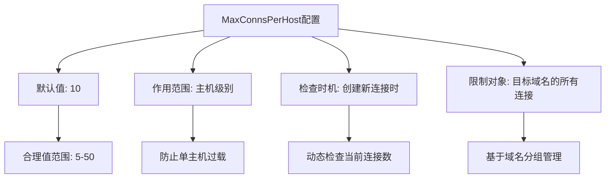
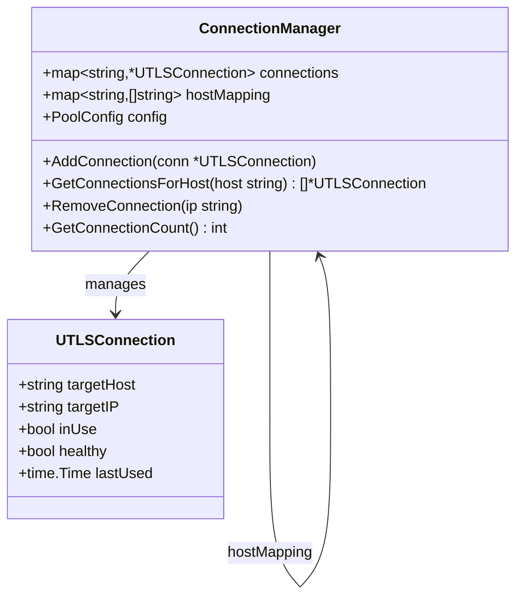
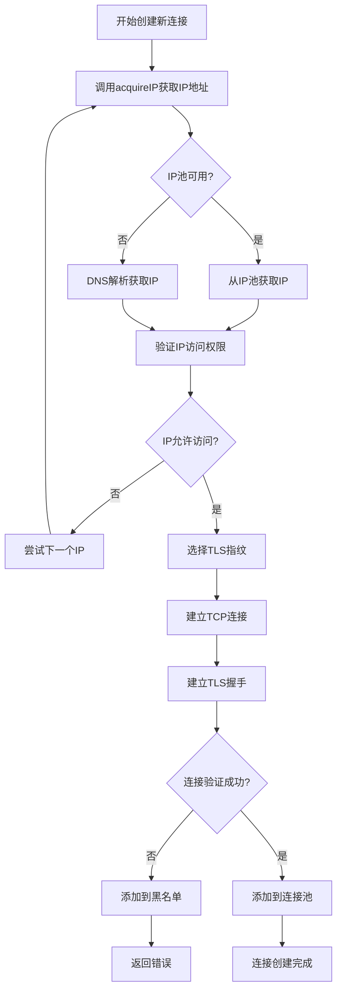
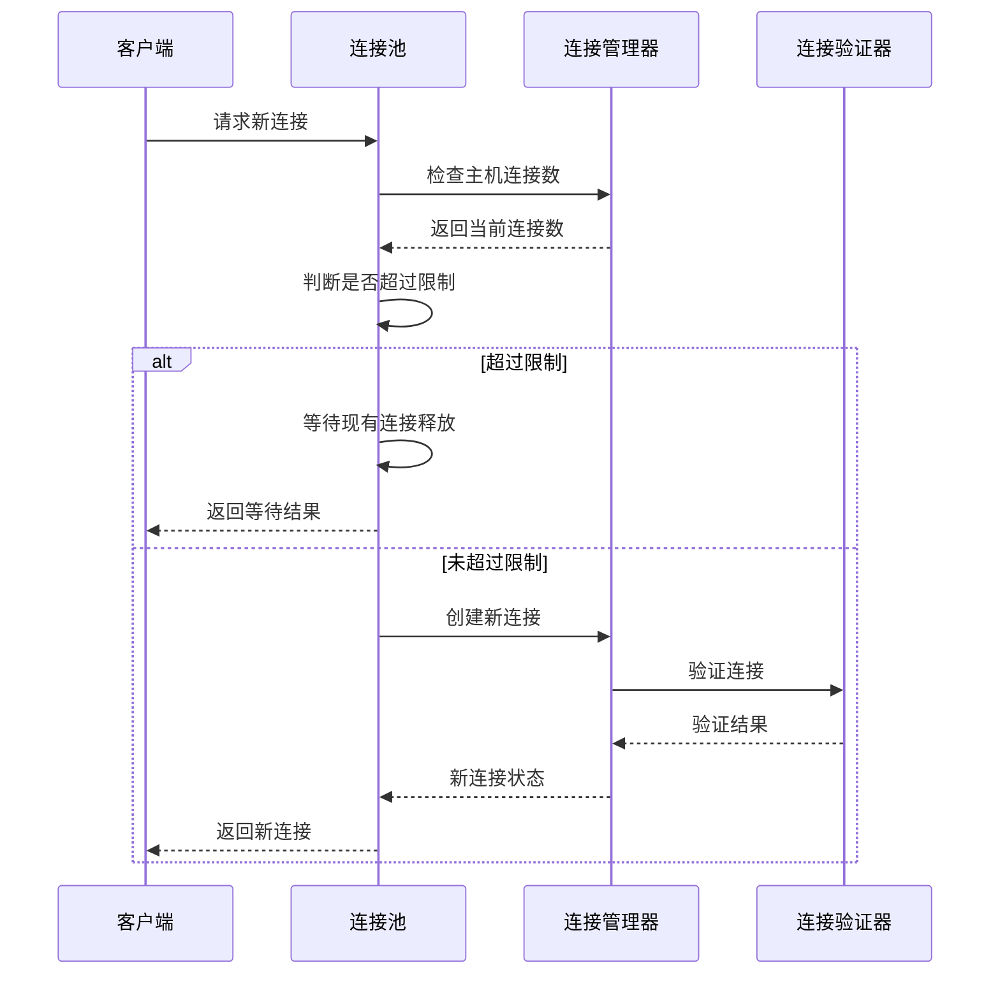
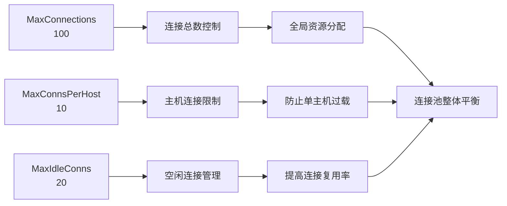
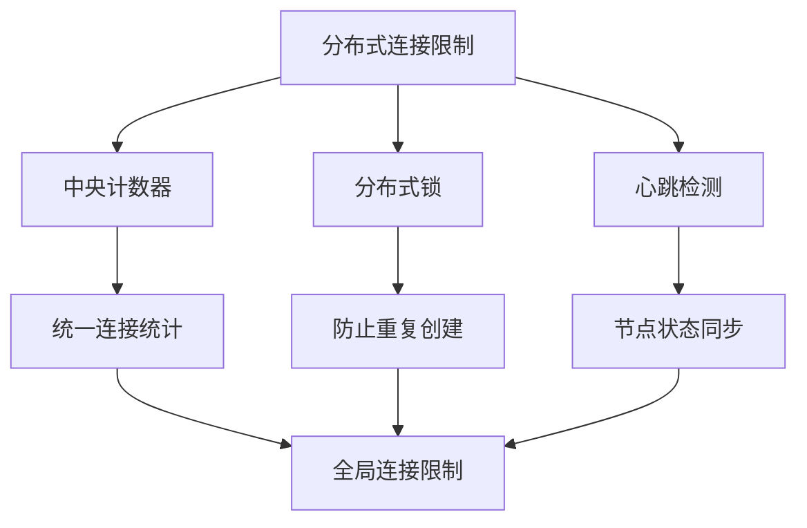

# 连接限制策略

<cite>
**本文档引用的文件**
- [connection_manager.go](file://utlsclient/connection_manager.go)
- [utlshotconnpool.go](file://utlsclient/utlshotconnpool.go)
- [connection_helpers.go](file://utlsclient/connection_helpers.go)
- [constants.go](file://utlsclient/constants.go)
- [interfaces.go](file://utlsclient/interfaces.go)
- [connection_manager_test.go](file://test/utlsclient/connection_manager_test.go)
</cite>

## 目录
1. [概述](#概述)
2. [MaxConnectionsPerHost配置项](#maxconnectionsperhost配置项)
3. [连接限制策略实现机制](#连接限制策略实现机制)
4. [连接限制检查流程](#连接限制检查流程)
5. [系统处理逻辑](#系统处理逻辑)
6. [配置项协同工作关系](#配置项协同工作关系)
7. [分布式环境下的扩展性](#分布式环境下的扩展性)
8. [最佳实践建议](#最佳实践建议)

## 概述

连接限制策略是爬虫平台中用于防止目标服务器过载和遵守网站爬虫协议的重要机制。该策略通过限制每个主机的最大连接数，确保爬虫行为符合道德规范，同时保护目标服务器的稳定性。

系统采用多层次的连接限制策略，包括：
- **主机级别限制**：限制每个目标主机的最大连接数（MaxConnsPerHost）
- **全局连接限制**：限制整个连接池的最大连接数（MaxConnections）
- **空闲连接管理**：通过空闲超时和生命周期管理优化资源使用

## MaxConnectionsPerHost配置项

### 配置参数详解

MaxConnsPerHost是连接限制策略的核心配置项，定义了每个目标主机允许的最大连接数。



**图表来源**
- [utlshotconnpool.go](file://utlsclient/utlshotconnpool.go#L189-L189)

### 配置验证机制

系统在启动时会对MaxConnsPerHost配置进行严格验证：

**节来源**
- [utlshotconnpool.go](file://utlsclient/utlshotconnpool.go#L120-L123)
- [utlshotconnpool.go](file://utlsclient/utlshotconnpool.go#L160-L163)

## 连接限制策略实现机制

### ConnectionManager中的主机连接管理

ConnectionManager负责维护每个主机的连接映射关系，是连接限制策略的基础组件。



**图表来源**
- [connection_manager.go](file://utlsclient/connection_manager.go#L9-L13)
- [utlshotconnpool.go](file://utlsclient/utlshotconnpool.go#L204-L234)

### 主机连接数统计机制

系统通过GetConnectionsForHost方法获取指定主机的所有连接，并通过健康状态过滤有效连接：

**节来源**
- [connection_manager.go](file://utlsclient/connection_manager.go#L76-L91)
- [utlshotconnpool.go](file://utlsclient/utlshotconnpool.go#L1361-L1375)

## 连接限制检查流程

### 创建新连接时的限制检查

当系统需要为新主机创建连接时，会执行以下检查流程：



**图表来源**
- [connection_helpers.go](file://utlsclient/connection_helpers.go#L16-L42)
- [connection_helpers.go](file://utlsclient/connection_helpers.go#L67-L181)

### 主机连接数检查实现

虽然代码中没有显式的MaxConnsPerHost检查逻辑，但系统通过以下机制间接实现限制：

1. **连接复用优先**：系统优先复用现有连接，减少新连接创建
2. **健康检查过滤**：只考虑健康的活跃连接
3. **并发控制**：通过互斥锁确保线程安全

**节来源**
- [utlshotconnpool.go](file://utlsclient/utlshotconnpool.go#L441-L479)
- [utlshotconnpool.go](file://utlsclient/utlshotconnpool.go#L483-L527)

## 系统处理逻辑

### 连接创建失败的处理

当无法创建新连接时，系统采用以下策略：



**图表来源**
- [utlshotconnpool.go](file://utlsclient/utlshotconnpool.go#L351-L360)
- [connection_helpers.go](file://utlsclient/connection_helpers.go#L67-L181)

### 连接释放和回收机制

系统通过PutConnection方法实现连接的正确释放：

**节来源**
- [utlshotconnpool.go](file://utlsclient/utlshotconnpool.go#L760-L785)

## 配置项协同工作关系

### 三个关键配置项的关系

MaxConnections、MaxConnsPerHost和MaxIdleConns三个配置项协同工作，形成完整的连接管理策略：

| 配置项 | 默认值 | 作用范围 | 影响因素 |
|--------|--------|----------|----------|
| MaxConnections | 100 | 全局 | 整个连接池的总连接数 |
| MaxConnsPerHost | 10 | 主机级别 | 每个目标主机的连接数 |
| MaxIdleConns | 20 | 全局 | 空闲连接的最大数量 |



**图表来源**
- [utlshotconnpool.go](file://utlsclient/utlshotconnpool.go#L186-L201)

### 配置优化建议

根据不同的使用场景，推荐以下配置组合：

1. **高并发爬虫场景**：
   - MaxConnections: 200-500
   - MaxConnsPerHost: 5-10
   - MaxIdleConns: 30-50

2. **低频爬虫场景**：
   - MaxConnections: 50-100
   - MaxConnsPerHost: 3-5
   - MaxIdleConns: 10-20

**节来源**
- [utlshotconnpool.go](file://utlsclient/utlshotconnpool.go#L186-L201)

## 分布式环境下的扩展性

### 单机环境限制

当前的连接限制策略主要在单机环境中运行，存在以下局限性：

1. **跨主机协调困难**：MaxConnsPerHost仅在单机范围内有效
2. **全局状态管理**：难以在多个实例间共享连接统计信息
3. **负载均衡挑战**：不同实例可能对同一主机创建过多连接

### 扩展性改进方案

为了在分布式环境中实现更有效的连接限制，可以考虑以下改进：



### 实现建议

1. **引入分布式计数器**：使用Redis等工具维护全局连接计数
2. **实现分布式锁**：确保同一主机在同一时刻只能有一个实例创建连接
3. **增加监控机制**：实时监控各节点的连接使用情况

## 最佳实践建议

### 连接限制策略的最佳实践

1. **合理设置MaxConnsPerHost**：
   - 根据目标网站的robots.txt规则设置
   - 考虑网站的服务器性能和带宽限制
   - 通常设置为5-20之间的值

2. **监控连接使用情况**：
   ```go
   // 获取连接统计信息
   stats := pool.GetStats()
   log.Printf("主机连接数: %d, 健康连接: %d", 
              pool.GetConnectionCount(targetHost), 
              stats.HealthyConnections)
   ```

3. **实现优雅降级**：
   - 当连接池接近上限时，采用指数退避策略
   - 优先复用现有连接而非创建新连接
   - 在必要时暂停某些主机的连接创建

4. **定期清理无效连接**：
   - 启用健康检查机制
   - 定期清理超时和不健康的连接
   - 监控连接池的整体健康状态

### 性能优化建议

1. **连接预热**：预先建立常用主机的连接
2. **智能调度**：根据历史数据预测连接需求
3. **资源隔离**：为不同类型的主机设置不同的连接限制

**节来源**
- [utlshotconnpool.go](file://utlsclient/utlshotconnpool.go#L1396-L1422)
- [utlshotconnpool.go](file://utlsclient/utlshotconnpool.go#L1377-L1383)

通过合理的配置和监控，连接限制策略能够在保护目标服务器的同时，最大化爬虫的效率和可靠性。