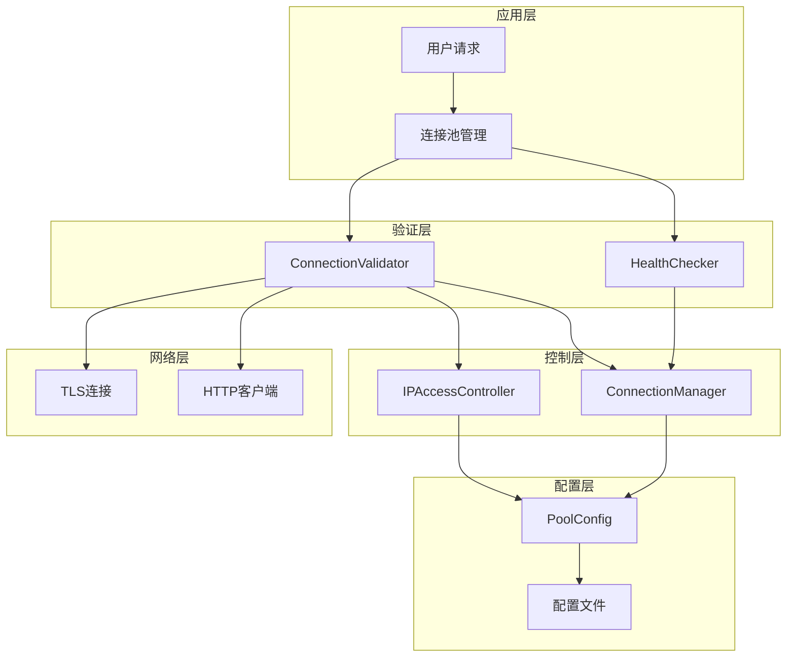
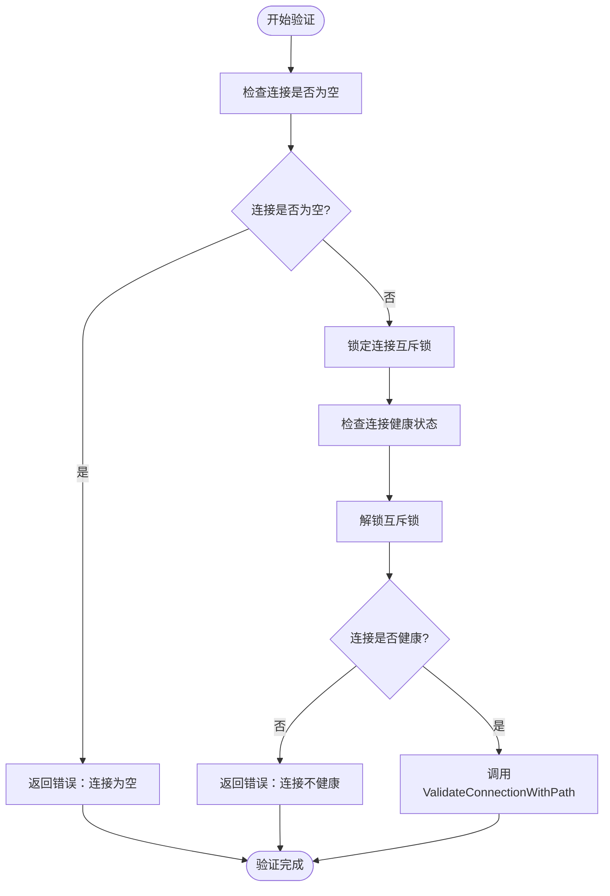
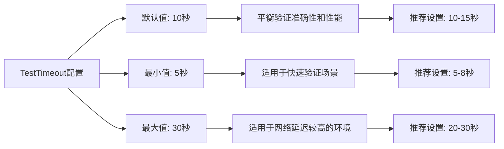
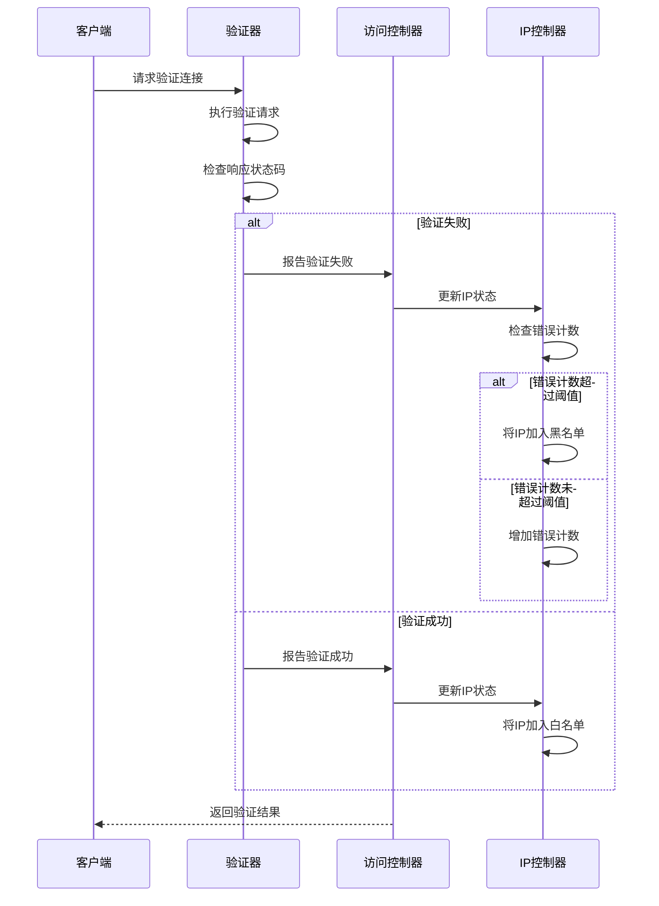
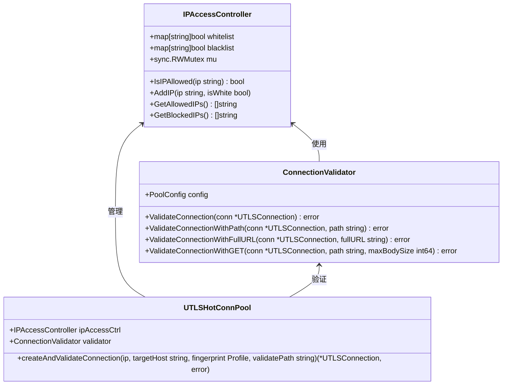
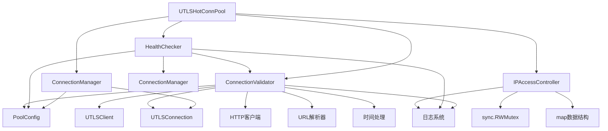

# 连接验证

<cite>
**本文档中引用的文件**
- [connection_validator.go](file://utlsclient/connection_validator.go)
- [ip_access_controller.go](file://utlsclient/ip_access_controller.go)
- [constants.go](file://utlsclient/constants.go)
- [interfaces.go](file://utlsclient/interfaces.go)
- [health_checker.go](file://utlsclient/health_checker.go)
- [utlshotconnpool.go](file://utlsclient/utlshotconnpool.go)
- [connection_manager.go](file://utlsclient/connection_manager.go)
- [config.go](file://config/config.go)
- [config.toml](file://config/config.toml)
</cite>

## 目录
1. [简介](#简介)
2. [项目结构](#项目结构)
3. [核心组件](#核心组件)
4. [架构概览](#架构概览)
5. [详细组件分析](#详细组件分析)
6. [依赖关系分析](#依赖关系分析)
7. [性能考虑](#性能考虑)
8. [故障排除指南](#故障排除指南)
9. [结论](#结论)

## 简介

连接验证功能是UTLS热连接池平台的核心组件之一，负责确保新建立的TLS连接的有效性和可靠性。该功能通过发送测试请求并检查HTTP响应状态码来确认连接质量，同时实现了智能的黑白名单管理系统，能够根据验证结果动态调整IP访问权限。

连接验证系统采用多层次的验证策略，包括快速健康检查、路径验证、完整URL验证和严格GET验证等多种验证方式，每种方式都针对不同的使用场景和安全要求。系统还集成了完善的错误处理机制和重试策略，确保在各种网络环境下都能保持高可用性。

## 项目结构

连接验证功能主要分布在以下关键文件中：

```mermaid
graph TD
A[连接验证系统] --> B[ConnectionValidator<br/>连接验证器]
A --> C[IPAccessController<br/>IP访问控制器]
A --> D[HealthChecker<br/>健康检查器]
A --> E[ConnectionManager<br/>连接管理器]
B --> F[ValidateConnection<br/>基础连接验证]
B --> G[ValidateConnectionWithPath<br/>路径验证]
B --> H[ValidateConnectionWithFullURL<br/>URL验证]
B --> I[ValidateConnectionWithGET<br/>GET验证]
B --> J[BatchValidateConnections<br/>批量验证]
B --> K[QuickHealthCheck<br/>快速健康检查]
C --> L[IsIPAllowed<br/>IP访问检查]
C --> M[AddIP<br/>添加IP到列表]
C --> N[GetAllowedIPs<br/>获取白名单]
C --> O[GetBlockedIPs<br/>获取黑名单]
D --> P[CheckConnection<br/>连接健康检查]
D --> Q[performHealthCheck<br/>执行健康检查]
D --> R[CheckAllConnections<br/>检查所有连接]
E --> S[AddConnection<br/>添加连接]
E --> T[RemoveConnection<br/>移除连接]
E --> U[GetConnection<br/>获取连接]
E --> V[CleanupIdleConnections<br/>清理空闲连接]
```

**图表来源**
- [connection_validator.go](file://utlsclient/connection_validator.go#L11-L263)
- [ip_access_controller.go](file://utlsclient/ip_access_controller.go#L8-L184)
- [health_checker.go](file://utlsclient/health_checker.go#L8-L164)
- [connection_manager.go](file://utlsclient/connection_manager.go#L9-L218)

**章节来源**
- [connection_validator.go](file://utlsclient/connection_validator.go#L1-L263)
- [ip_access_controller.go](file://utlsclient/ip_access_controller.go#L1-L184)
- [health_checker.go](file://utlsclient/health_checker.go#L1-L164)
- [connection_manager.go](file://utlsclient/connection_manager.go#L1-L218)

## 核心组件

### ConnectionValidator - 连接验证器

ConnectionValidator是连接验证系统的核心组件，负责执行各种类型的连接验证操作。它提供了多种验证方法，从简单的健康检查到复杂的完整URL验证。

主要验证方法包括：
- **ValidateConnection**: 基础连接验证，检查连接的基本健康状态
- **ValidateConnectionWithPath**: 指定路径的连接验证，使用HEAD请求
- **ValidateConnectionWithFullURL**: 完整URL验证，支持自定义请求
- **ValidateConnectionWithGET**: 严格的GET请求验证，包含响应体大小限制
- **BatchValidateConnections**: 批量连接验证，提高验证效率
- **QuickHealthCheck**: 快速健康检查，仅检查连接状态

### IPAccessController - IP访问控制器

IPAccessController负责管理IP白名单和黑名单，实现细粒度的访问控制。它提供了原子性的IP管理操作，确保在高并发环境下的数据一致性。

核心功能包括：
- **IsIPAllowed**: 检查IP是否被允许访问
- **AddIP**: 添加IP到白名单或黑名单
- **GetAllowedIPs**: 获取白名单IP列表
- **GetBlockedIPs**: 获取黑名单IP列表
- **RemoveFromBlacklist**: 从黑名单移除IP
- **AddToWhitelist**: 添加IP到白名单

### HealthChecker - 健康检查器

HealthChecker负责定期检查连接的健康状态，维护连接池的整体质量。它实现了智能的健康检查策略，包括错误计数监控和超时检测。

**章节来源**
- [connection_validator.go](file://utlsclient/connection_validator.go#L11-L263)
- [ip_access_controller.go](file://utlsclient/ip_access_controller.go#L8-L184)
- [health_checker.go](file://utlsclient/health_checker.go#L8-L164)

## 架构概览

连接验证系统采用分层架构设计，各组件职责明确，协作紧密：

**图表来源**
- [utlshotconnpool.go](file://utlsclient/utlshotconnpool.go#L170-L225)
- [connection_validator.go](file://utlsclient/connection_validator.go#L11-L263)
- [health_checker.go](file://utlsclient/health_checker.go#L8-L164)

系统的工作流程遵循以下模式：
1. 用户发起连接请求
2. 连接池管理器评估现有连接
3. 新连接创建并交由验证器处理
4. 验证器执行相应的验证策略
5. 验证结果反馈给访问控制器
6. 访问控制器更新IP状态
7. 连接被添加到可用连接池

## 详细组件分析

### ConnectionValidator详细分析

#### validateConnection方法工作流程

validateConnection方法是连接验证的核心入口，其工作流程如下：

**图表来源**
- [connection_validator.go](file://utlsclient/connection_validator.go#L23-L39)

#### 验证过程中的状态码处理策略

连接验证系统对不同HTTP状态码采用不同的处理策略：

| 状态码范围 | 处理策略 | 结果 |
|-----------|---------|------|
| 200-299 | 验证成功 | 连接标记为健康，更新统计信息 |
| 300-399 | 重定向处理 | 根据具体重定向类型决定是否继续验证 |
| 400-499 | 客户端错误 | 连接标记为不健康，可能加入黑名单 |
| 500-599 | 服务器错误 | 连接标记为不稳定，可能降低优先级 |
| 其他错误 | 连接失败 | 连接标记为不健康，立即移除 |

#### 连接验证超时配置

TestTimeout配置项是连接验证的关键参数，影响验证的可靠性和性能：

**图表来源**
- [utlshotconnpool.go](file://utlsclient/utlshotconnpool.go#L186-L225)
- [config.toml](file://config/config.toml#L18-L22)

#### 验证失败后的重试机制

当连接验证失败时，系统采用指数退避算法实现智能重试：

**图表来源**
- [connection_validator.go](file://utlsclient/connection_validator.go#L65-L109)
- [ip_access_controller.go](file://utlsclient/ip_access_controller.go#L45-L60)

### IP访问控制器协同工作机制

IP访问控制器与连接验证系统的协同工作方式：

**图表来源**
- [ip_access_controller.go](file://utlsclient/ip_access_controller.go#L8-L184)
- [connection_validator.go](file://utlsclient/connection_validator.go#L11-L263)
- [utlshotconnpool.go](file://utlsclient/utlshotconnpool.go#L331-L372)

### 连接验证在提升爬虫成功率方面的效果

连接验证系统通过以下机制显著提升爬虫成功率：

1. **智能连接筛选**: 通过多层验证确保只有高质量连接参与请求
2. **动态黑名单管理**: 自动识别和隔离有问题的IP地址
3. **健康状态监控**: 实时监控连接健康状态，及时移除不稳定的连接
4. **负载均衡优化**: 基于连接质量分配请求，提高整体成功率

**章节来源**
- [connection_validator.go](file://utlsclient/connection_validator.go#L11-L263)
- [ip_access_controller.go](file://utlsclient/ip_access_controller.go#L8-L184)
- [health_checker.go](file://utlsclient/health_checker.go#L8-L164)

## 依赖关系分析

连接验证系统的依赖关系复杂而有序：

**图表来源**
- [connection_validator.go](file://utlsclient/connection_validator.go#L1-L10)
- [ip_access_controller.go](file://utlsclient/ip_access_controller.go#L1-L7)
- [health_checker.go](file://utlsclient/health_checker.go#L1-L7)
- [utlshotconnpool.go](file://utlsclient/utlshotconnpool.go#L1-L10)

**章节来源**
- [connection_validator.go](file://utlsclient/connection_validator.go#L1-L10)
- [ip_access_controller.go](file://utlsclient/ip_access_controller.go#L1-L7)
- [health_checker.go](file://utlsclient/health_checker.go#L1-L7)
- [connection_manager.go](file://utlsclient/connection_manager.go#L1-L7)

## 性能考虑

连接验证系统在设计时充分考虑了性能优化：

### 并发安全性
- 使用读写锁确保高并发访问的安全性
- 连接状态检查采用原子操作
- 避免长时间持有锁，减少竞争

### 缓存策略
- 连接健康状态缓存，减少重复验证
- IP访问权限缓存，提高访问速度
- 配置信息缓存，避免频繁读取

### 资源管理
- 连接池化，减少连接创建开销
- 及时清理无效连接，防止资源泄漏
- 智能超时管理，避免长时间等待

## 故障排除指南

### 常见验证失败原因

1. **网络连接问题**
   - 检查网络连通性
   - 验证防火墙设置
   - 确认DNS解析正常

2. **证书验证失败**
   - 检查SSL证书有效性
   - 验证证书链完整性
   - 确认时间同步

3. **配置参数不当**
   - 调整TestTimeout值
   - 检查连接池配置
   - 验证黑白名单设置

### 调试技巧

- 启用详细日志记录
- 使用QuickHealthCheck进行初步诊断
- 监控连接统计信息
- 分析错误模式和频率

**章节来源**
- [connection_validator.go](file://utlsclient/connection_validator.go#L65-L109)
- [health_checker.go](file://utlsclient/health_checker.go#L60-L112)

## 结论

连接验证功能是UTLS热连接池平台的重要组成部分，通过多层次的验证策略和智能的访问控制机制，确保了连接池的整体质量和稳定性。系统采用模块化设计，各组件职责明确，协作高效，为爬虫应用提供了可靠的连接保障。

验证系统的主要优势包括：
- **全面的验证策略**: 支持多种验证方式，适应不同场景需求
- **智能的访问控制**: 动态管理IP黑白名单，自动识别问题IP
- **高性能设计**: 优化的并发处理和资源管理
- **完善的错误处理**: 完善的重试机制和故障恢复

通过持续的监控和优化，连接验证系统能够显著提升爬虫应用的成功率和稳定性，为大规模网络爬取任务提供坚实的技术支撑。