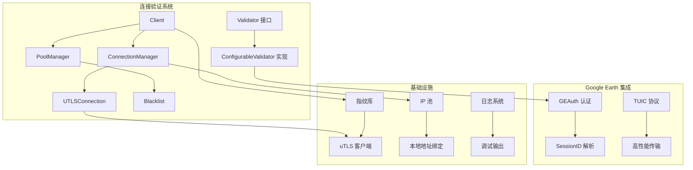
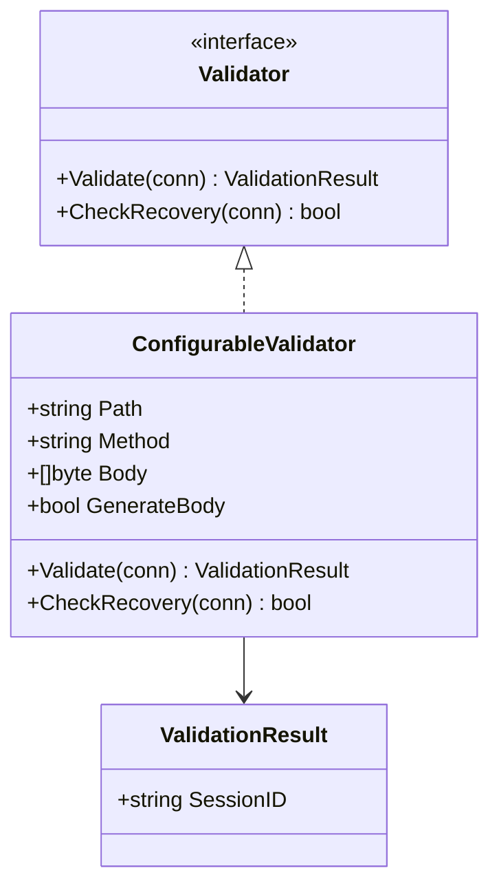
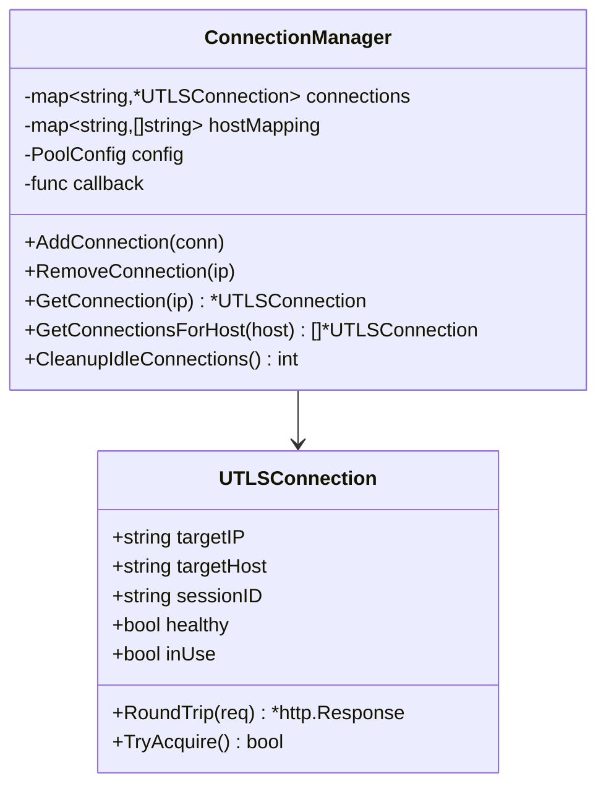
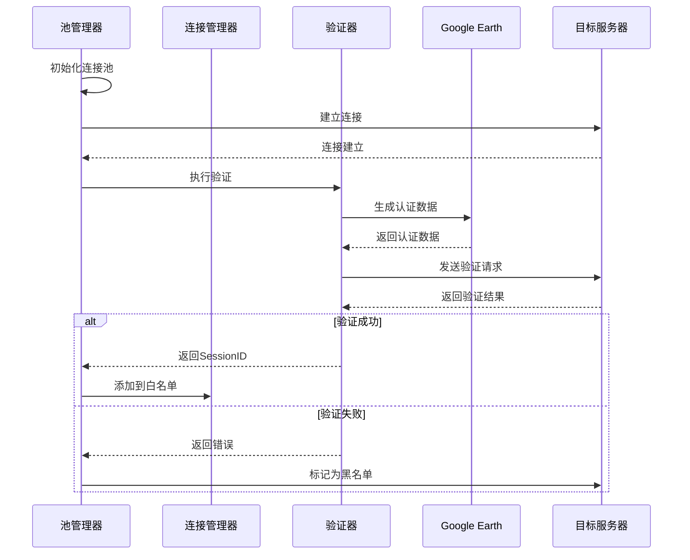
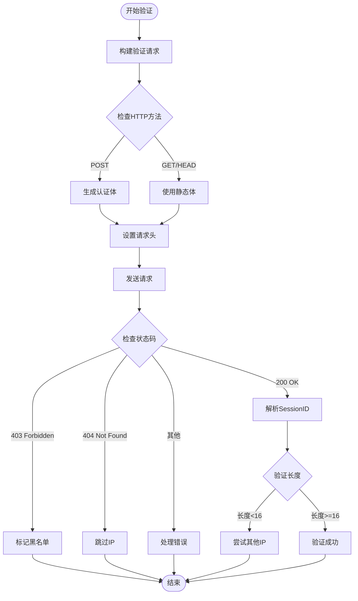
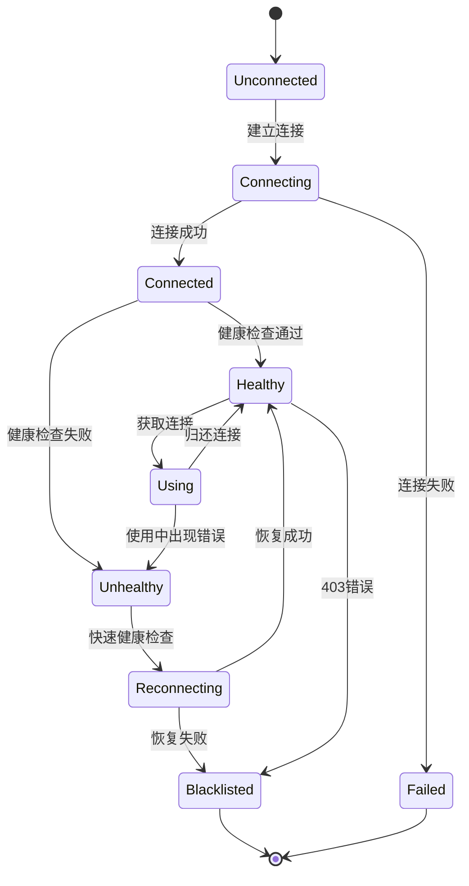
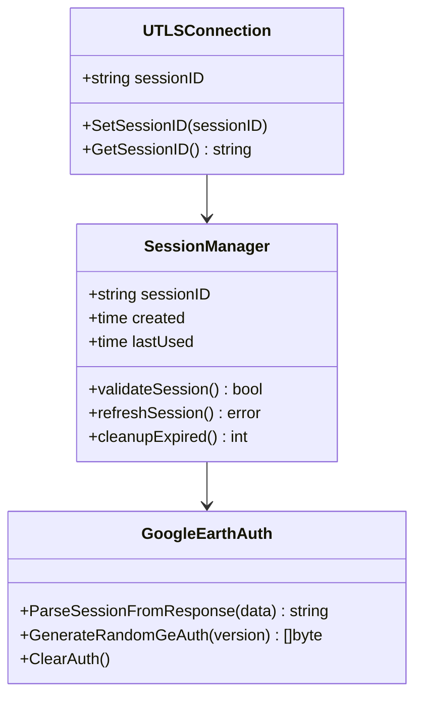
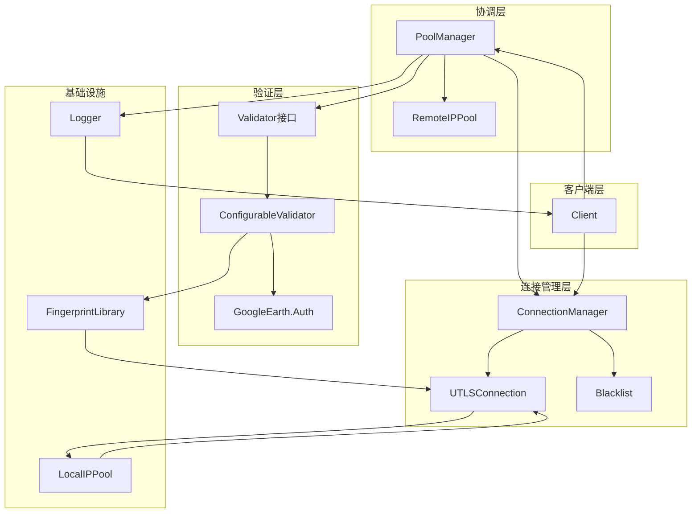

# 连接验证

<cite>
**本文档引用的文件**
- [validator.go](file://utlsclient/validator.go)
- [pool_manager.go](file://utlsclient/pool_manager.go)
- [connection_manager.go](file://utlsclient/connection_manager.go)
- [utlsclient.go](file://utlsclient/utlsclient.go)
- [utlshotconnpool.go](file://utlsclient/utlshotconnpool.go)
- [errors.go](file://utlsclient/errors.go)
- [geauth.go](file://GoogleEarth/geauth.go)
- [README.md](file://README.md)
</cite>

## 目录
1. [简介](#简介)
2. [项目结构](#项目结构)
3. [核心组件](#核心组件)
4. [架构概览](#架构概览)
5. [详细组件分析](#详细组件分析)
6. [依赖关系分析](#依赖关系分析)
7. [性能考虑](#性能考虑)
8. [故障排除指南](#故障排除指南)
9. [结论](#结论)

## 简介

连接验证是本爬虫平台的核心功能之一，负责确保与目标服务器建立的连接是有效且可使用的。该系统通过多层验证机制，包括连接建立验证、会话ID获取验证和健康检查验证，确保连接池中的每个连接都是高质量的。

系统采用白名单和黑名单机制，只允许经过验证的连接进入白名单，而将被服务器拒绝的IP地址加入黑名单。这种设计确保了连接池的稳定性和可靠性。

## 项目结构

项目采用模块化的架构设计，主要包含以下几个核心模块：

```mermaid
graph TB
subgraph "连接验证系统"
A[Validator 接口] --> B[ConfigurableValidator 实现]
C[ConnectionManager] --> D[UTLSConnection]
E[PoolManager] --> F[Blacklist]
G[Client] --> C
G --> E
end
subgraph "Google Earth 集成"
H[GEAuth 认证] --> I[SessionID 解析]
J[TUIC 协议] --> K[高性能传输]
end
subgraph "基础设施"
L[指纹库] --> M[uTLS 客户端]
N[IP 池] --> O[本地地址绑定]
P[日志系统] --> Q[调试输出]
end
B --> H
D --> M
C --> N
G --> L
```

**图表来源**
- [validator.go:19-25](file://utlsclient/validator.go#L19-L25)
- [connection_manager.go:8-16](file://utlsclient/connection_manager.go#L8-L16)
- [pool_manager.go:21-34](file://utlsclient/pool_manager.go#L21-L34)

**章节来源**
- [README.md:5-23](file://README.md#L5-L23)

## 核心组件

### 连接验证器 (Validator)

连接验证器是整个系统的核心组件，负责执行各种类型的连接验证：

```mermaid
classDiagram
class Validator {
<<interface>>
+Validate(conn) ValidationResult
+CheckRecovery(conn) bool
}
class ConfigurableValidator {
+string Path
+string Method
+[]byte Body
+bool GenerateBody
+Validate(conn) ValidationResult
+CheckRecovery(conn) bool
}
class ValidationResult {
+string SessionID
}
Validator <|.. ConfigurableValidator
ConfigurableValidator --> ValidationResult
```

**图表来源**
- [validator.go:19-25](file://utlsclient/validator.go#L19-L25)
- [validator.go:14-17](file://utlsclient/validator.go#L14-L17)

### 连接管理器 (ConnectionManager)

连接管理器负责管理所有活跃的连接，维护白名单机制：

```mermaid
classDiagram
class ConnectionManager {
-map~string,*UTLSConnection~ connections
-map~string,[]string~ hostMapping
-PoolConfig config
-func callback
+AddConnection(conn)
+RemoveConnection(ip)
+GetConnection(ip) *UTLSConnection
+GetConnectionsForHost(host) []*UTLSConnection
+CleanupIdleConnections() int
}
class UTLSConnection {
+string targetIP
+string targetHost
+string sessionID
+bool healthy
+bool inUse
+RoundTrip(req) *http.Response
+TryAcquire() bool
}
ConnectionManager --> UTLSConnection
```

**图表来源**
- [connection_manager.go:8-16](file://utlsclient/connection_manager.go#L8-L16)
- [utlshotconnpool.go:26-56](file://utlsclient/utlshotconnpool.go#L26-L56)

### 池管理器 (PoolManager)

池管理器协调整个连接池的生命周期管理：

```mermaid
classDiagram
class PoolManager {
-ConnectionManager connManager
-Blacklist blacklist
-Validator validator
-PoolConfig config
-RemoteIPPool remotePool
-chan struct{} stopChan
+Start()
+Stop()
+maintainPoolFromRemoteIPs(isInitial)
+preWarmConnectionsBatch(domain, ips)
+checkBlacklistRecovery()
}
class Client {
-PoolConfig config
-ConnectionManager connManager
-Blacklist blacklist
-PoolManager poolManager
+Start()
+Stop()
+GetConnectionForHost(host) *UTLSConnection
}
PoolManager --> Client
Client --> PoolManager
```

**图表来源**
- [pool_manager.go:21-34](file://utlsclient/pool_manager.go#L21-L34)
- [utlsclient.go:14-25](file://utlsclient/utlsclient.go#L14-L25)

**章节来源**
- [validator.go:27-49](file://utlsclient/validator.go#L27-L49)
- [connection_manager.go:8-25](file://utlsclient/connection_manager.go#L8-L25)
- [pool_manager.go:21-52](file://utlsclient/pool_manager.go#L21-L52)

## 架构概览

连接验证系统的整体架构采用了分层设计，确保了系统的可扩展性和稳定性：

```mermaid
sequenceDiagram
participant PM as 池管理器
participant CM as 连接管理器
participant V as 验证器
participant GE as Google Earth
participant TC as 目标服务器
PM->>PM : 初始化连接池
PM->>TC : 建立连接
TC-->>PM : 连接建立
PM->>V : 执行验证
V->>GE : 生成认证数据
GE-->>V : 返回认证数据
V->>TC : 发送验证请求
TC-->>V : 返回验证结果
alt 验证成功
V-->>PM : 返回SessionID
PM->>CM : 添加到白名单
else 验证失败
V-->>PM : 返回错误
PM->>TC : 标记为黑名单
end
```

**图表来源**
- [pool_manager.go:114-184](file://utlsclient/pool_manager.go#L114-L184)
- [validator.go:52-142](file://utlsclient/validator.go#L52-L142)

系统的核心流程包括：

1. **连接建立阶段**：从远程IP池获取目标IP，建立到目标服务器的连接
2. **验证执行阶段**：使用验证器对连接进行有效性检查
3. **会话管理阶段**：如果验证成功，提取并存储会话ID
4. **状态更新阶段**：将连接添加到白名单或标记为黑名单

## 详细组件分析

### 验证器实现

验证器实现了灵活的配置化验证机制，支持多种验证策略：

```mermaid
flowchart TD
Start([开始验证]) --> BuildRequest[构建验证请求]
BuildRequest --> CheckMethod{检查HTTP方法}
CheckMethod --> |POST| GenerateBody[生成认证体]
CheckMethod --> |GET/HEAD| UseStaticBody[使用静态体]
GenerateBody --> SetHeaders[设置请求头]
UseStaticBody --> SetHeaders
SetHeaders --> SendRequest[发送请求]
SendRequest --> CheckStatus{检查状态码}
CheckStatus --> |200 OK| ParseSession[解析SessionID]
CheckStatus --> |403 Forbidden| MarkBlacklist[标记黑名单]
CheckStatus --> |404 Not Found| SkipIP[跳过IP]
CheckStatus --> |其他| HandleError[处理错误]
ParseSession --> ValidateLength{验证长度}
ValidateLength --> |长度>=16| Success[验证成功]
ValidateLength --> |长度<16| RetryOther[尝试其他IP]
MarkBlacklist --> End([结束])
SkipIP --> End
HandleError --> End
RetryOther --> End
Success --> End
```

**图表来源**
- [validator.go:52-142](file://utlsclient/validator.go#L52-L142)

验证器的关键特性：

1. **智能方法选择**：根据配置自动选择HTTP方法（GET、POST、HEAD）
2. **动态认证体生成**：对于POST请求，基于目标IP生成不同的认证体
3. **严格SessionID验证**：确保SessionID长度至少16字节
4. **错误分类处理**：区分永久性错误（403）和临时性错误

### 连接生命周期管理

连接的生命周期管理是系统的核心机制：

```mermaid
stateDiagram-v2
[*] --> Unconnected
Unconnected --> Connecting : 建立连接
Connecting --> Connected : 连接成功
Connecting --> Failed : 连接失败
Connected --> Healthy : 健康检查通过
Connected --> Unhealthy : 健康检查失败
Healthy --> Using : 获取连接
Using --> Healthy : 归还连接
Using --> Unhealthy : 使用中出现错误
Unhealthy --> Reconnecting : 快速健康检查
Reconnecting --> Healthy : 恢复成功
Reconnecting --> Blacklisted : 恢复失败
Blacklisted --> [*]
Failed --> [*]
Healthy --> Blacklisted : 403错误
```

**图表来源**
- [utlshotconnpool.go:369-394](file://utlsclient/utlshotconnpool.go#L369-L394)
- [utlsclient.go:354-433](file://utlsclient/utlsclient.go#L354-L433)

### 会话ID管理

会话ID管理确保了连接的有效性和持久性：

```mermaid
classDiagram
class SessionManager {
+string sessionID
+time created
+time lastUsed
+validateSession() bool
+refreshSession() error
+cleanupExpired() int
}
class GoogleEarthAuth {
+ParseSessionFromResponse(data) string
+GenerateRandomGeAuth(version) []byte
+ClearAuth()
}
class UTLSConnection {
+string sessionID
+SetSessionID(sessionID)
+GetSessionID() string
}
SessionManager --> GoogleEarthAuth
UTLSConnection --> SessionManager
```

**图表来源**
- [geauth.go:23-45](file://GoogleEarth/geauth.go#L23-L45)
- [utlshotconnpool.go:102-107](file://utlsclient/utlshotconnpool.go#L102-L107)

**章节来源**
- [validator.go:52-142](file://utlsclient/validator.go#L52-L142)
- [utlshotconnpool.go:369-394](file://utlsclient/utlshotconnpool.go#L369-L394)
- [geauth.go:23-45](file://GoogleEarth/geauth.go#L23-L45)

## 依赖关系分析

系统采用松耦合的设计，各组件之间的依赖关系清晰明确：

```mermaid
graph TB
subgraph "验证层"
V[Validator接口] --> CV[ConfigurableValidator]
CV --> GE[GoogleEarth.Auth]
end
subgraph "连接管理层"
CM[ConnectionManager] --> UC[UTLSConnection]
CM --> BL[Blacklist]
end
subgraph "协调层"
PM[PoolManager] --> CM
PM --> V
PM --> RIP[RemoteIPPool]
end
subgraph "客户端层"
C[Client] --> PM
C --> CM
end
subgraph "基础设施"
FL[FingerprintLibrary] --> UC
LIP[LocalIPPool] --> UC
LS[Logger] --> C
end
CV --> FL
UC --> LIP
PM --> LS
```

**图表来源**
- [validator.go:10-12](file://utlsclient/validator.go#L10-L12)
- [connection_manager.go:10-16](file://utlsclient/connection_manager.go#L10-L16)
- [pool_manager.go:25-27](file://utlsclient/pool_manager.go#L25-L27)

**章节来源**
- [validator.go:10-12](file://utlsclient/validator.go#L10-L12)
- [connection_manager.go:10-16](file://utlsclient/connection_manager.go#L10-L16)
- [pool_manager.go:25-27](file://utlsclient/pool_manager.go#L25-L27)

## 性能考虑

连接验证系统在设计时充分考虑了性能优化：

### 并发控制
- 使用信号量限制并发验证数量
- 采用批量预热机制减少连接建立开销
- 支持动态调整并发参数

### 缓存策略
- 连接池缓存已验证的连接
- 会话ID缓存减少重复验证
- 黑名单缓存避免重复检查

### 资源管理
- 连接超时控制防止资源泄露
- 空闲连接清理机制
- 文件描述符限制防护

## 故障排除指南

### 常见问题及解决方案

**连接验证失败**
- 检查目标服务器可达性
- 验证认证体配置正确性
- 确认网络环境稳定

**会话ID解析错误**
- 检查响应格式是否符合预期
- 验证SessionID长度要求
- 确认服务器返回正确的认证数据

**连接池性能问题**
- 调整并发参数配置
- 检查系统资源限制
- 监控连接池状态

**章节来源**
- [errors.go:8-23](file://utlsclient/errors.go#L8-L23)
- [validator.go:105-122](file://utlsclient/validator.go#L105-L122)

## 结论

连接验证系统通过多层次的验证机制和智能的连接管理策略，确保了爬虫平台的稳定性和可靠性。系统的设计充分考虑了性能、可扩展性和安全性，在保证功能完整性的同时，提供了良好的用户体验。

该系统的核心优势包括：

1. **多层验证机制**：从连接建立到会话管理的全方位验证
2. **智能连接管理**：白名单和黑名单机制确保连接质量
3. **高性能设计**：并发控制和缓存策略提升系统性能
4. **灵活配置**：支持多种验证策略和参数调整

通过持续的优化和改进，连接验证系统将继续为爬虫平台提供稳定可靠的服务支撑。