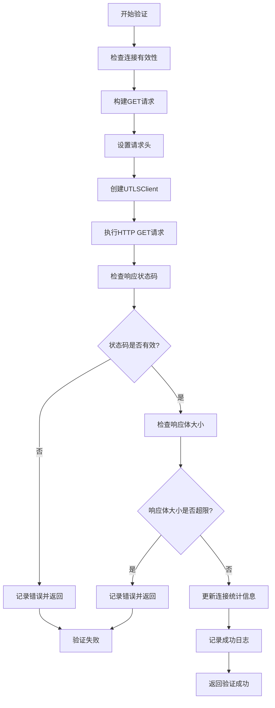
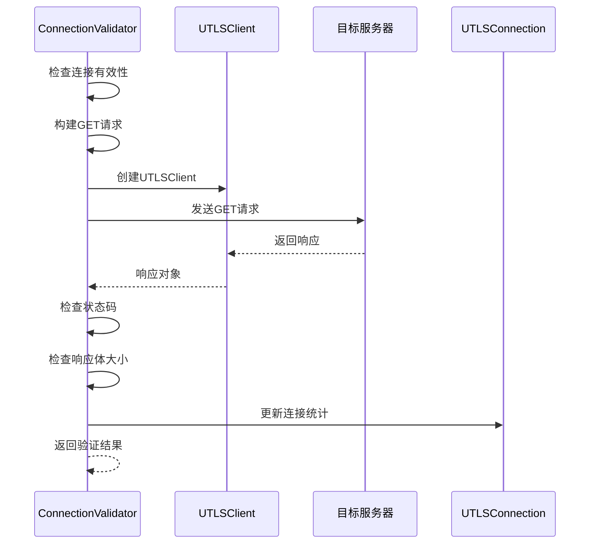
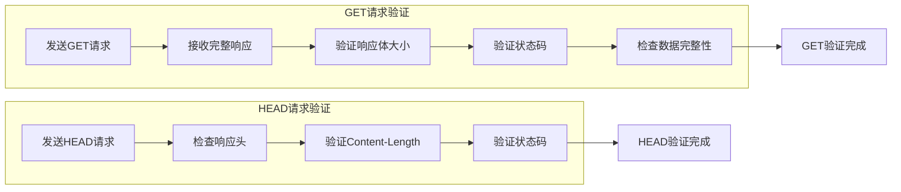
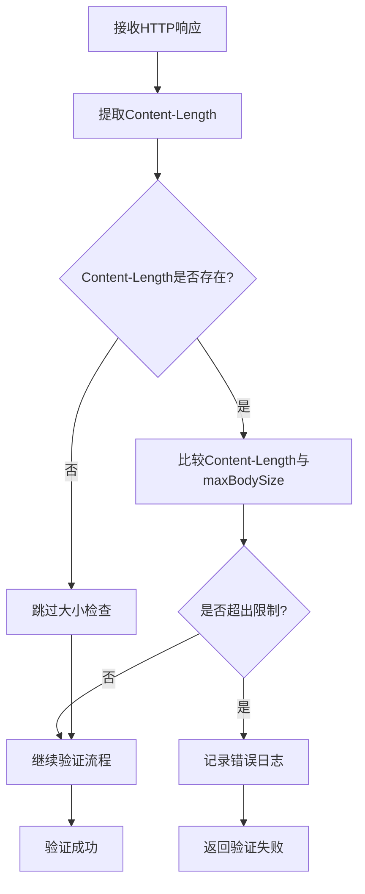
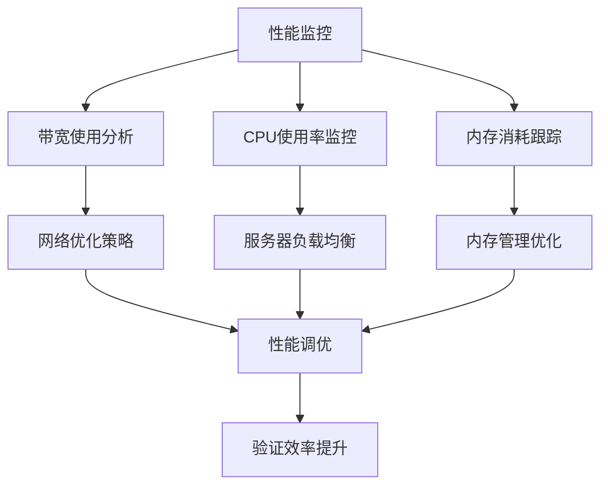
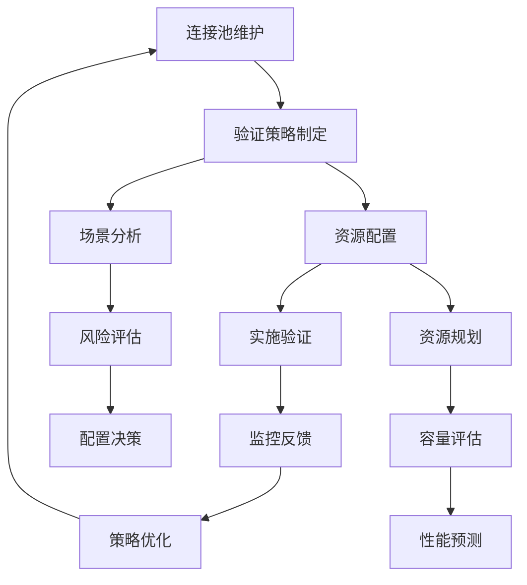
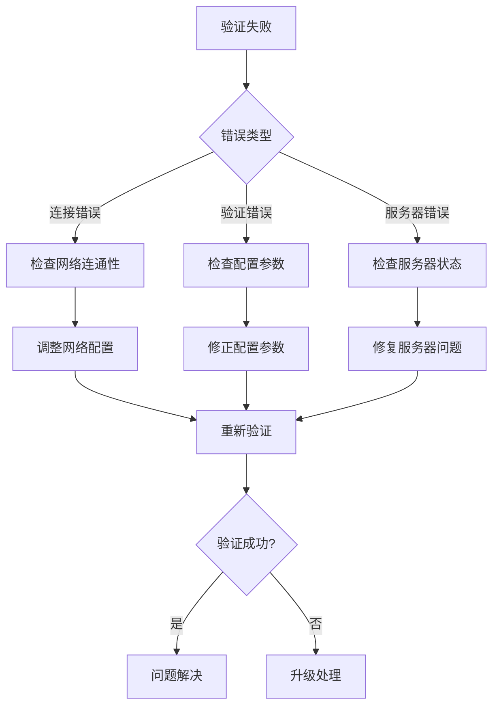

# 严格内容验证

<cite>
**本文档引用的文件**
- [connection_validator.go](file://utlsclient/connection_validator.go)
- [utlshotconnpool.go](file://utlsclient/utlshotconnpool.go)
- [utlsclient.go](file://utlsclient/utlsclient.go)
- [connection_helpers.go](file://utlsclient/connection_helpers.go)
- [example_utlsclient_usage.go](file://examples/utlsclient/example_utlsclient_usage.go)
- [utlsfingerprint.go](file://utlsclient/utlsfingerprint.go)
- [logger.go](file://utlsclient/logger.go)
</cite>

## 目录
1. [简介](#简介)
2. [ValidateConnectionWithGET方法概述](#validateconnectionwithget方法概述)
3. [方法实现机制详解](#方法实现机制详解)
4. [GET请求与HEAD请求的对比分析](#get请求与head请求的对比分析)
5. [maxBodySize参数的安全防护机制](#maxbodysize参数的安全防护机制)
6. [应用场景与最佳实践](#应用场景与最佳实践)
7. [性能考量与资源消耗](#性能考量与资源消耗)
8. [连接池维护中的使用建议](#连接池维护中的使用建议)
9. [故障排除指南](#故障排除指南)
10. [总结](#总结)

## 简介

严格内容验证是爬虫平台中一个关键的安全和可靠性机制，旨在确保连接能够完整接收预期的内容。ValidateConnectionWithGET方法作为这一机制的核心实现，通过发送GET请求并检查响应体大小来执行更严格的验证，特别适用于需要确保内容可完整接收的场景，如爬虫预热或大文件下载准备。

该方法相比传统的HEAD请求验证提供了更高的严格性，能够在验证连接可用性的同时确保服务器能够完整传输预期的数据量，从而有效防止资源耗尽攻击和网络异常导致的数据截断问题。

## ValidateConnectionWithGET方法概述

ValidateConnectionWithGET方法是一个专门设计的连接验证函数，它使用HTTP GET请求来验证连接的有效性和内容完整性。该方法的核心特点包括：

- **严格的内容验证**：不仅检查HTTP状态码，还验证响应体的实际大小
- **防资源耗尽保护**：通过maxBodySize参数限制响应体大小
- **完整的数据传输验证**：确保服务器能够完整传输预期内容
- **详细的统计信息**：提供响应时间、状态码和内容长度等详细指标



**图表来源**
- [connection_validator.go](file://utlsclient/connection_validator.go#L161-L222)

**章节来源**
- [connection_validator.go](file://utlsclient/connection_validator.go#L160-L222)

## 方法实现机制详解

ValidateConnectionWithGET方法的实现遵循严格的验证流程，确保每个步骤都经过精心设计以保证验证的准确性和安全性。

### 连接有效性检查

方法首先验证传入的连接对象是否为空，这是最基本的输入验证。如果连接为空，方法会立即返回错误，防止后续操作引发空指针异常。

### 路径处理机制

当提供的路径为空时，方法自动将其设置为"/"根路径，确保验证请求能够成功发送到服务器。这种设计保证了验证过程的鲁棒性，避免因路径问题导致的验证失败。

### GET请求构建

方法创建一个完整的HTTP GET请求，包含必要的请求头信息。请求头中设置了特定的User-Agent标识"UTLSHotConnPool/1.0 GETValidation"，便于识别和监控验证请求。Connection头设置为"keep-alive"，确保连接在验证完成后仍可继续使用。

### 客户端配置

通过NewUTLSClient函数创建专用的UTLS客户端进行验证。该客户端继承了连接的TLS指纹信息，并设置了适当的超时时间，确保验证过程不会无限期挂起。

### 响应处理流程

验证过程包含多个关键检查点：

1. **状态码验证**：检查响应状态码是否在200-399范围内
2. **响应体大小检查**：验证响应体大小不超过maxBodySize限制
3. **连接统计更新**：记录连接的最后使用时间和请求统计信息



**图表来源**
- [connection_validator.go](file://utlsclient/connection_validator.go#L161-L222)
- [utlsclient.go](file://utlsclient/utlsclient.go#L45-L52)

**章节来源**
- [connection_validator.go](file://utlsclient/connection_validator.go#L161-L222)

## GET请求与HEAD请求的对比分析

在连接验证领域，GET请求和HEAD请求各有其适用场景和优缺点。ValidateConnectionWithGET方法选择使用GET请求而非传统的HEAD请求，体现了对严格性要求的重视。

### 请求特性对比

| 特性 | GET请求 | HEAD请求 |
|------|---------|----------|
| 请求体 | 包含完整响应体 | 无响应体（仅头部信息） |
| 数据传输量 | 较大 | 较小 |
| 验证严格性 | 更高 | 较低 |
| 性能开销 | 较高 | 较低 |
| 缓存影响 | 可能影响缓存 | 不影响缓存 |
| 服务器负载 | 较高 | 较低 |

### 验证能力差异

**HEAD请求的优势**：
- 轻量级：只获取响应头信息，不传输响应体
- 性能友好：减少网络传输和处理开销
- 缓存友好：不会影响服务器缓存状态

**GET请求的优势**：
- 完整验证：能够验证服务器是否能够完整传输内容
- 内容完整性：确保响应体大小符合预期
- 实际效果：更接近真实用户请求的验证效果
- 安全性：防止服务器故意返回虚假的Content-Length

### 选择GET请求的原因

ValidateConnectionWithGET方法选择GET请求的主要原因：

1. **内容完整性验证**：确保服务器能够完整传输预期的数据量
2. **防欺骗机制**：防止服务器返回虚假的Content-Length头部
3. **实际场景模拟**：更接近真实用户的请求行为
4. **严格性要求**：满足对连接质量的高标准要求



**图表来源**
- [connection_validator.go](file://utlsclient/connection_validator.go#L41-L109)
- [connection_validator.go](file://utlsclient/connection_validator.go#L161-L222)

**章节来源**
- [connection_validator.go](file://utlsclient/connection_validator.go#L41-L109)
- [connection_validator.go](file://utlsclient/connection_validator.go#L161-L222)

## maxBodySize参数的安全防护机制

maxBodySize参数是ValidateConnectionWithGET方法中的关键安全机制，用于防止资源耗尽攻击和意外的大数据传输。该参数的设计体现了对系统安全性和稳定性的深度考虑。

### 安全威胁防护

**资源耗尽攻击防护**：
- **DDoS防护**：防止恶意服务器故意返回极大的Content-Length值
- **内存溢出保护**：限制响应体大小避免客户端内存耗尽
- **带宽滥用检测**：监控异常大的数据传输请求

**意外情况防护**：
- **服务器配置错误**：防止服务器返回错误的Content-Length
- **网络中间件篡改**：防范中间设备修改响应头
- **协议异常处理**：应对各种协议层面的异常情况

### 参数配置策略

合理的maxBodySize配置需要考虑以下因素：

| 场景 | 建议值 | 说明 |
|------|--------|------|
| 爬虫预热 | 1MB | 适合大多数网页内容 |
| 大文件下载 | 100MB | 支持较大文件的预检 |
| API接口验证 | 10MB | 适用于API响应验证 |
| 图片资源验证 | 50MB | 支持高清图片预检 |
| 视频流验证 | 500MB | 支持视频流媒体验证 |

### 实现机制分析

maxBodySize参数的检查机制包含以下步骤：

1. **响应头解析**：从HTTP响应头中提取Content-Length值
2. **大小比较**：将Content-Length与maxBodySize进行比较
3. **错误处理**：如果超出限制，记录详细错误信息并终止验证
4. **日志记录**：记录具体的响应体大小和限制值，便于审计



**图表来源**
- [connection_validator.go](file://utlsclient/connection_validator.go#L210-L214)

**章节来源**
- [connection_validator.go](file://utlsclient/connection_validator.go#L210-L214)

## 应用场景与最佳实践

ValidateConnectionWithGET方法在多种实际应用场景中发挥着重要作用，特别是在需要确保内容完整性的关键业务环节。

### 爬虫预热场景

**应用场景描述**：
在大规模爬虫作业开始前，需要预先验证目标网站的连接质量和内容完整性。ValidateConnectionWithGET方法能够有效识别那些虽然能够响应HEAD请求，但在实际传输数据时存在问题的连接。

**实施策略**：
- **批量验证**：对爬虫计划中的所有目标URL进行批量验证
- **分级验证**：根据URL的重要性和访问频率设置不同的验证强度
- **定期刷新**：定期重新验证已确认的连接，确保长期稳定性

### 大文件下载准备

**技术挑战**：
大文件下载面临的主要挑战包括网络不稳定、服务器性能波动、存储空间限制等。ValidateConnectionWithGET方法能够提前发现这些问题，避免下载过程中出现中断。

**最佳实践**：
- **分段验证**：对于超大文件，采用分段验证策略
- **动态调整**：根据网络状况动态调整maxBodySize参数
- **重试机制**：结合重试逻辑提高验证成功率

### API接口验证

**验证重点**：
API接口验证需要关注响应格式的正确性、数据完整性和性能表现。GET验证能够有效检测API响应中的潜在问题。

**实施要点**：
- **契约验证**：验证API响应是否符合预定的契约规范
- **性能监控**：记录响应时间和吞吐量指标
- **兼容性检查**：确保不同客户端都能正确处理API响应

### 配置示例

以下是ValidateConnectionWithGET方法在不同场景下的配置示例：

```go
// 爬虫预热配置
err := validator.ValidateConnectionWithGET(conn, "/", 1024*1024) // 1MB限制

// 大文件下载配置  
err := validator.ValidateConnectionWithGET(conn, "/large-file.zip", 100*1024*1024) // 100MB限制

// API验证配置
err := validator.ValidateConnectionWithGET(conn, "/api/v1/status", 10*1024*1024) // 10MB限制
```

**章节来源**
- [example_utlsclient_usage.go](file://examples/utlsclient/example_utlsclient_usage.go#L56-L93)

## 性能考量与资源消耗

ValidateConnectionWithGET方法虽然提供了更高的验证严格性，但也带来了相应的性能开销和资源消耗。理解这些影响因素对于合理使用该方法至关重要。

### 性能开销分析

**网络传输开销**：
- **数据传输量**：GET请求需要传输完整的响应体，增加了网络带宽消耗
- **传输时间**：响应体越大，传输时间越长，影响验证速度
- **并发影响**：大量并发验证可能导致网络拥塞

**服务器资源消耗**：
- **CPU使用**：服务器需要处理完整的请求并生成响应体
- **内存占用**：服务器需要分配内存存储响应数据
- **I/O操作**：磁盘读取和网络发送增加I/O负担

### 资源消耗对比

| 指标 | HEAD请求 | GET请求 | 差异 |
|------|----------|---------|------|
| 网络带宽 | 基准 | 1-10倍 | 显著增加 |
| 服务器CPU | 基准 | 1.2-1.5倍 | 轻微增加 |
| 内存使用 | 基准 | 2-5倍 | 明显增加 |
| 响应时间 | 基准 | 2-10倍 | 显著增加 |
| 并发处理能力 | 高 | 中等 | 下降 |

### 性能优化策略

**验证频率控制**：
- **智能调度**：根据连接历史表现调整验证频率
- **缓存机制**：对已验证成功的连接进行缓存
- **批量处理**：将多个验证请求合并处理

**资源限制措施**：
- **超时控制**：设置合理的超时时间避免长时间等待
- **并发限制**：控制同时进行的验证请求数量
- **重试策略**：实现指数退避的重试机制



**章节来源**
- [connection_validator.go](file://utlsclient/connection_validator.go#L161-L222)

## 连接池维护中的使用建议

在连接池的日常维护中，ValidateConnectionWithGET方法的使用需要谨慎考虑，以平衡验证严格性和系统性能。合理的使用策略能够最大化验证效果，同时最小化对系统性能的影响。

### 连接池配置优化

**验证频率设置**：
- **高频验证**：对于关键连接，可以设置较高的验证频率
- **低频验证**：对于一般连接，采用较低的验证频率
- **动态调整**：根据连接使用情况动态调整验证策略

**资源分配策略**：
- **预留资源**：为验证操作预留足够的网络和计算资源
- **优先级管理**：将验证操作设置为中等优先级
- **容量规划**：根据验证需求规划连接池容量

### 维护策略建议

**健康检查集成**：
- **多层次验证**：结合HEAD请求和GET请求进行综合验证
- **渐进式验证**：先进行轻量级验证，再进行严格验证
- **异常处理**：建立完善的异常处理和恢复机制

**监控和告警**：
- **性能指标监控**：监控验证响应时间、成功率等关键指标
- **资源使用监控**：跟踪网络带宽、CPU和内存使用情况
- **异常告警**：设置验证失败的告警机制

### 使用场景分类

| 场景 | 验证策略 | 建议配置 |
|------|----------|----------|
| 生产环境 | 严格验证 | maxBodySize: 1MB, 频率: 30分钟 |
| 开发环境 | 中等验证 | maxBodySize: 5MB, 频率: 2小时 |
| 测试环境 | 轻量验证 | maxBodySize: 10MB, 频率: 6小时 |
| 高风险连接 | 最严格验证 | maxBodySize: 500KB, 频率: 15分钟 |

### 最佳实践总结

**谨慎使用原则**：
- **评估必要性**：只有在确实需要严格验证时才使用GET验证
- **成本效益分析**：权衡验证严格性与系统性能的代价
- **渐进式部署**：逐步推广验证策略，观察系统反应

**监控驱动优化**：
- **持续监控**：建立完善的监控体系
- **数据分析**：基于数据分析优化验证策略
- **迭代改进**：持续改进验证方法和配置



**图表来源**
- [utlshotconnpool.go](file://utlsclient/utlshotconnpool.go#L279-L329)

**章节来源**
- [utlshotconnpool.go](file://utlsclient/utlshotconnpool.go#L279-L329)

## 故障排除指南

在使用ValidateConnectionWithGET方法时，可能会遇到各种故障和异常情况。本节提供了系统的故障排除指南，帮助快速定位和解决问题。

### 常见错误类型

**连接相关错误**：
- **连接超时**：网络连接建立超时
- **连接拒绝**：服务器拒绝连接请求
- **SSL/TLS错误**：证书验证失败或协议不匹配

**验证相关错误**：
- **状态码错误**：响应状态码不在预期范围内
- **响应体过大**：响应体大小超过maxBodySize限制
- **网络中断**：传输过程中网络连接中断

**配置相关错误**：
- **参数配置错误**：maxBodySize设置不合理
- **超时设置不当**：验证超时时间过短或过长
- **路径配置错误**：验证路径不存在或不可访问

### 排查步骤

**第一步：错误信息分析**
- 检查错误消息的具体内容
- 分析错误发生的上下文环境
- 确定错误的严重程度和影响范围

**第二步：网络连通性检查**
- 使用ping命令测试基本网络连通性
- 使用telnet测试TCP端口连通性
- 检查防火墙和代理设置

**第三步：服务器状态检查**
- 验证目标服务器是否正常运行
- 检查服务器的负载和资源使用情况
- 确认服务器配置是否正确

**第四步：配置参数验证**
- 检查maxBodySize参数设置是否合理
- 验证超时时间配置是否适当
- 确认验证路径是否存在且可访问

### 调试技巧

**日志分析**：
- 启用详细日志记录
- 分析日志中的时间戳和错误信息
- 关注连接建立和数据传输的关键节点

**网络抓包**：
- 使用tcpdump或Wireshark捕获网络流量
- 分析HTTP请求和响应的完整过程
- 检查数据包的大小和传输时间

**性能监控**：
- 监控系统资源使用情况
- 跟踪网络带宽和延迟变化
- 分析验证操作的性能瓶颈

### 解决方案模板

**连接超时问题**：
1. 检查网络连接质量
2. 调整连接超时参数
3. 验证服务器响应能力

**响应体过大问题**：
1. 重新评估maxBodySize设置
2. 检查服务器响应内容
3. 考虑使用HEAD请求替代

**SSL/TLS认证失败**：
1. 验证服务器证书有效性
2. 检查客户端TLS配置
3. 确认证书链完整性



**章节来源**
- [connection_validator.go](file://utlsclient/connection_validator.go#L198-L201)
- [logger.go](file://utlsclient/logger.go#L9-L11)

## 总结

ValidateConnectionWithGET方法作为严格内容验证的核心实现，为爬虫平台提供了强大的连接质量保障机制。通过深入分析其实现原理、应用场景和最佳实践，我们可以得出以下关键结论：

### 技术优势

1. **严格性保证**：相比传统的HEAD请求验证，GET验证能够确保服务器能够完整传输预期内容
2. **安全防护**：maxBodySize参数有效防止资源耗尽攻击和意外的大数据传输
3. **完整性验证**：能够检测服务器返回的Content-Length是否真实可靠
4. **实际效果**：更接近真实用户请求的验证效果，提高验证的实用性

### 应用价值

1. **爬虫预热**：在大规模爬虫作业前确保连接质量，提高爬取成功率
2. **大文件下载**：提前发现下载过程中的潜在问题，避免中途失败
3. **API验证**：确保API接口的响应质量和稳定性
4. **安全防护**：防止恶意服务器利用漏洞进行攻击

### 使用建议

1. **谨慎部署**：在确实需要严格验证的场景下使用，避免不必要的性能开销
2. **合理配置**：根据具体应用场景设置合适的maxBodySize和验证频率
3. **监控优化**：建立完善的监控体系，持续优化验证策略
4. **资源平衡**：在验证严格性和系统性能之间找到最佳平衡点

ValidateConnectionWithGET方法的成功应用需要开发者深入理解其工作原理和适用场景，通过合理的配置和监控，充分发挥其在连接验证领域的独特优势，为爬虫平台的稳定运行提供坚实保障。