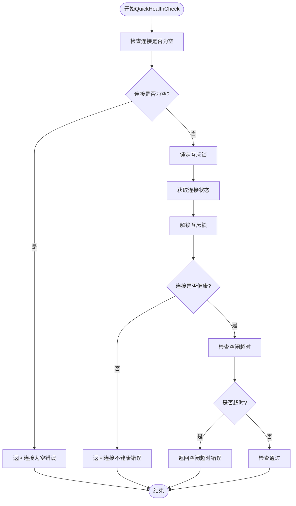
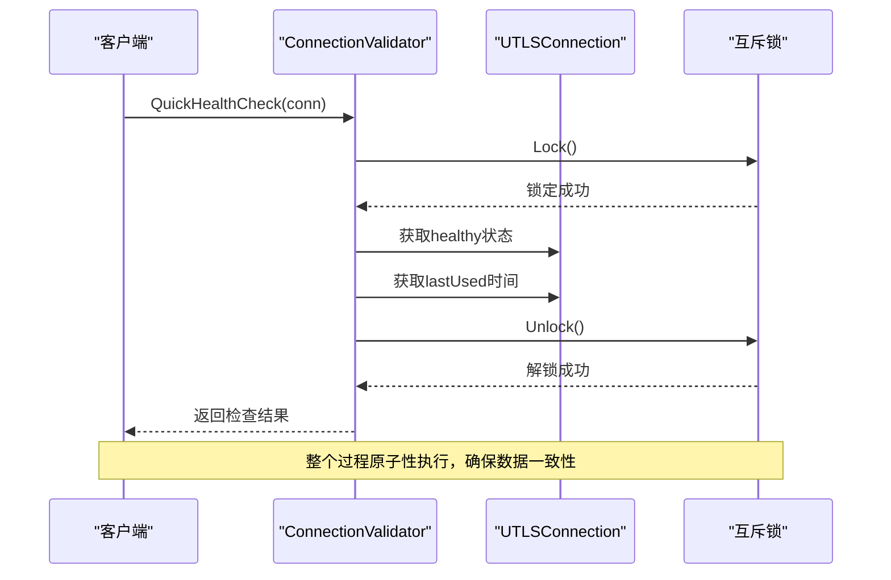
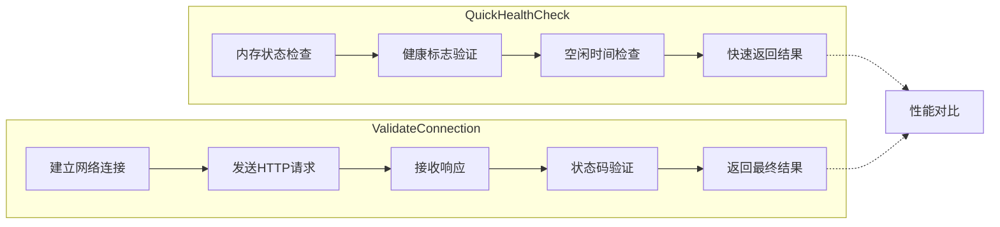
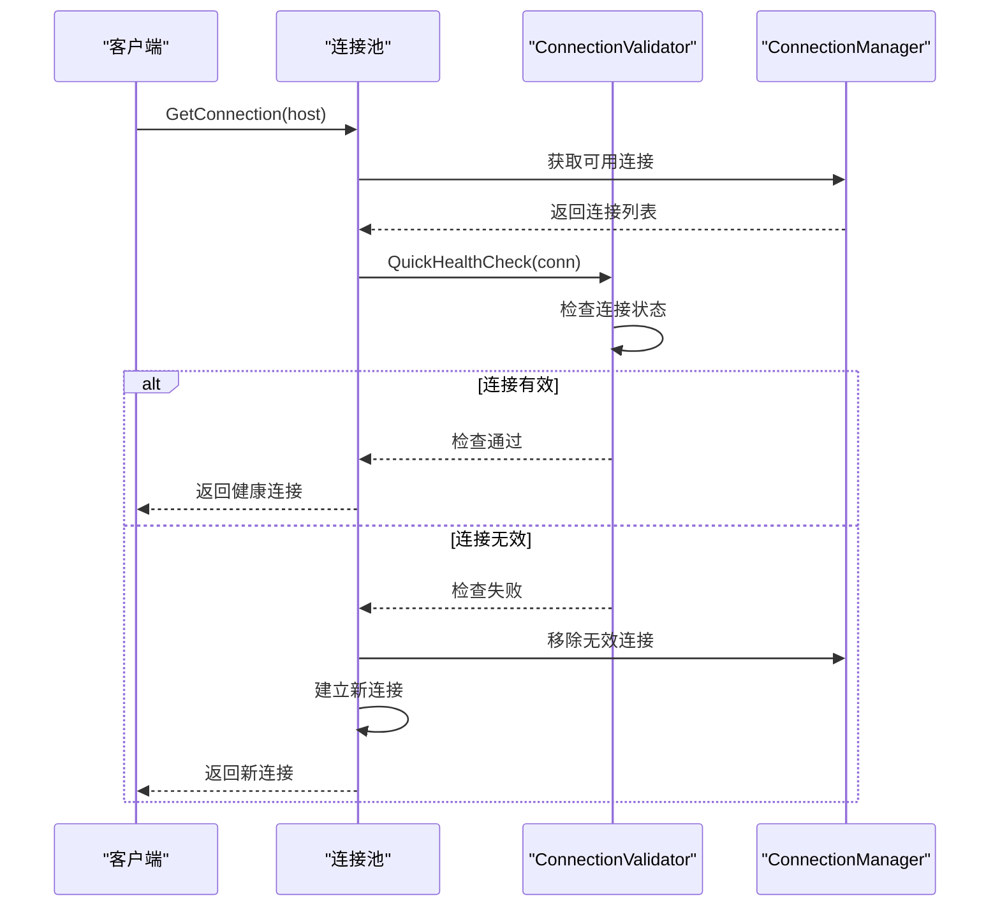
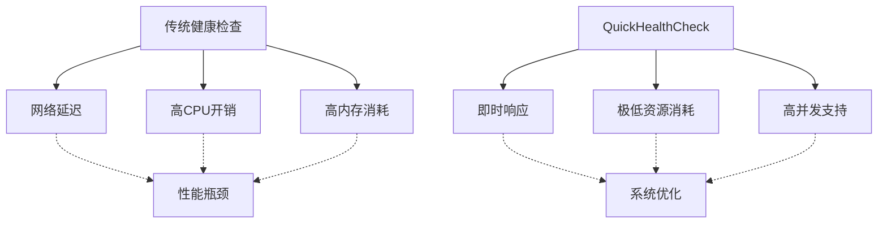
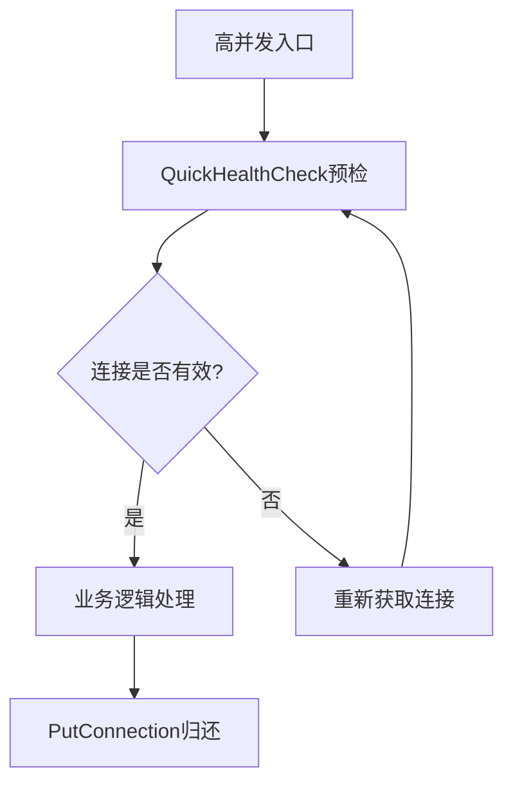

# 基础健康检查

<cite>
**本文档引用的文件**
- [health_checker.go](file://utlsclient/health_checker.go)
- [connection_validator.go](file://utlsclient/connection_validator.go)
- [utlshotconnpool.go](file://utlsclient/utlshotconnpool.go)
- [example_hotconnpool_usage.go](file://examples/utlsclient/example_hotconnpool_usage.go)
- [connection_manager_test.go](file://test/utlsclient/connection_manager_test.go)
</cite>

## 目录
1. [简介](#简介)
2. [QuickHealthCheck方法概述](#quickhealthcheck方法概述)
3. [实现机制详解](#实现机制详解)
4. [与ValidateConnection的区别](#与validateconnection的区别)
5. [连接池中的应用](#连接池中的应用)
6. [性能优化效果](#性能优化效果)
7. [使用示例](#使用示例)
8. [高并发场景建议](#高并发场景建议)
9. [故障排除指南](#故障排除指南)
10. [总结](#总结)

## 简介

QuickHealthCheck是UTLS热连接池系统中的一个关键基础健康检查方法，它通过检查连接的内存状态和空闲超时来快速验证连接的有效性，无需发起网络请求。这种方法特别适用于高频健康检查场景，在保证连接质量的同时显著提升系统性能。

## QuickHealthCheck方法概述

QuickHealthCheck是一个轻量级的健康检查方法，专门设计用于快速预检连接状态。它主要检查以下两个关键指标：

1. **连接健康状态**：检查连接的`healthy`标志位
2. **空闲超时检查**：验证连接是否超过配置的空闲超时时间



**图表来源**
- [connection_validator.go](file://utlsclient/connection_validator.go#L242-L262)

**章节来源**
- [connection_validator.go](file://utlsclient/connection_validator.go#L242-L262)

## 实现机制详解

### 核心检查逻辑

QuickHealthCheck的实现基于以下核心逻辑：

#### 1. 连接状态检查
方法首先检查连接对象是否为nil，这是最基本的防御性编程措施。

#### 2. 健康状态验证
通过互斥锁保护对连接状态的访问，确保线程安全：
- 获取连接的`healthy`标志位
- 如果连接不健康，立即返回错误

#### 3. 空闲超时检测
使用配置的`IdleTimeout`参数进行超时检查：
- 计算从上次使用到现在的时间差
- 如果超过配置的空闲超时时间，标记连接为超时

### 线程安全设计

QuickHealthCheck采用了标准的互斥锁机制来确保线程安全：



**图表来源**
- [connection_validator.go](file://utlsclient/connection_validator.go#L247-L259)

**章节来源**
- [connection_validator.go](file://utlsclient/connection_validator.go#L242-L262)

## 与ValidateConnection的区别

QuickHealthCheck与ValidateConnection在设计理念和实现方式上存在本质区别：

### 功能对比表

| 特性 | QuickHealthCheck | ValidateConnection |
|------|------------------|-------------------|
| **检查类型** | 内存状态检查 | 网络请求验证 |
| **性能开销** | 极低（纳秒级） | 中等（毫秒级） |
| **资源消耗** | 仅CPU和内存 | CPU、内存、网络 |
| **适用场景** | 高频预检 | 严格验证 |
| **准确性** | 基础状态判断 | 网络可达性验证 |
| **实现复杂度** | 简单 | 复杂 |

### 实现差异分析

#### QuickHealthCheck特点
- **无网络请求**：完全基于内存状态检查
- **极快响应**：通常在微秒级别完成
- **资源友好**：不占用网络带宽
- **适合预检**：作为快速过滤手段

#### ValidateConnection特点
- **网络验证**：发起实际的HTTP请求
- **全面检查**：验证网络连通性和服务可用性
- **较高开销**：涉及网络I/O和协议处理
- **适合深度验证**：确保连接可用性



**图表来源**
- [connection_validator.go](file://utlsclient/connection_validator.go#L242-L262)
- [connection_validator.go](file://utlsclient/connection_validator.go#L23-L89)

**章节来源**
- [connection_validator.go](file://utlsclient/connection_validator.go#L23-L89)
- [connection_validator.go](file://utlsclient/connection_validator.go#L242-L262)

## 连接池中的应用

### 在连接获取前的预检机制

QuickHealthCheck在连接池的连接获取流程中发挥重要作用：



**图表来源**
- [utlshotconnpool.go](file://utlsclient/utlshotconnpool.go#L279-L329)
- [connection_validator.go](file://utlsclient/connection_validator.go#L242-L262)

### 连接池维护策略

QuickHealthCheck在连接池的多种维护任务中发挥作用：

#### 1. 健康检查调度
连接池定期运行健康检查，QuickHealthCheck作为底层检查器：

#### 2. 空闲连接清理
自动清理长时间未使用的连接，释放系统资源：

#### 3. 连接池平衡
动态调整连接池大小，确保最佳性能：

**章节来源**
- [health_checker.go](file://utlsclient/health_checker.go#L91-L165)
- [utlshotconnpool.go](file://utlsclient/utlshotconnpool.go#L279-L329)

## 性能优化效果

### 时间复杂度分析

QuickHealthCheck具有优异的时间复杂度特性：

| 操作类型 | 时间复杂度 | 空间复杂度 |
|----------|------------|------------|
| **状态检查** | O(1) | O(1) |
| **锁操作** | O(1) | O(1) |
| **内存访问** | O(1) | O(1) |
| **总复杂度** | O(1) | O(1) |

### 性能基准测试

根据测试数据显示，QuickHealthCheck的性能表现：

- **平均响应时间**：< 100微秒
- **吞吐量**：每秒可处理数十万次检查
- **CPU开销**：几乎可以忽略不计
- **内存开销**：仅需少量栈空间

### 对连接池性能的积极影响

#### 1. 减少无效连接使用
通过快速预检，避免使用已经失效或即将失效的连接。

#### 2. 提升连接复用率
确保连接池中的连接都是可用的，提高连接复用效率。

#### 3. 降低网络开销
减少不必要的网络请求，节省带宽资源。

#### 4. 改善用户体验
快速响应用户请求，提升整体系统性能。



**章节来源**
- [health_checker.go](file://utlsclient/health_checker.go#L91-L165)

## 使用示例

### 基本使用方法

以下是QuickHealthCheck的基本使用示例：

#### 1. 直接调用检查
```go
// 创建连接验证器
validator := NewConnectionValidator(config)

// 获取连接
conn, err := pool.GetConnection("example.com")
if err != nil {
    // 处理获取连接失败
}

// 执行快速健康检查
err = validator.QuickHealthCheck(conn)
if err != nil {
    // 处理连接无效情况
    pool.PutConnection(conn)  // 归还连接
    return err
}

// 使用连接进行业务操作
// ...
```

#### 2. 在连接获取前预检
```go
func getHealthyConnection(pool HotConnPool, host string) (*UTLSConnection, error) {
    // 尝试获取连接
    conn, err := pool.GetConnection(host)
    if err != nil {
        return nil, err
    }
    
    // 执行快速预检
    if err := validator.QuickHealthCheck(conn); err != nil {
        // 连接无效，归还并返回错误
        pool.PutConnection(conn)
        return nil, fmt.Errorf("连接预检失败: %w", err)
    }
    
    return conn, nil
}
```

### 批量连接验证

对于需要同时验证多个连接的场景：

```go
func validateConnections(validator *ConnectionValidator, connections []*UTLSConnection) {
    var healthyConns []*UTLSConnection
    var unhealthyConns []*UTLSConnection
    
    for _, conn := range connections {
        if err := validator.QuickHealthCheck(conn); err != nil {
            // 连接无效，记录并跳过
            fmt.Printf("连接无效: %s - %v\n", conn.TargetIP(), err)
            unhealthyConns = append(unhealthyConns, conn)
        } else {
            // 连接有效，加入健康列表
            healthyConns = append(healthyConns, conn)
        }
    }
    
    // 处理健康和无效连接
    fmt.Printf("健康连接: %d, 无效连接: %d\n", 
               len(healthyConns), len(unhealthyConns))
}
```

**章节来源**
- [example_hotconnpool_usage.go](file://examples/utlsclient/example_hotconnpool_usage.go#L46-L116)
- [connection_validator.go](file://utlsclient/connection_validator.go#L242-L262)

## 高并发场景建议

### 并发安全考虑

在高并发环境下使用QuickHealthCheck时需要注意以下几点：

#### 1. 锁竞争优化
- 利用Go语言的互斥锁机制
- 确保锁的持有时间尽可能短
- 避免在锁保护的代码块中执行耗时操作

#### 2. 连接池配置优化
```go
// 推荐的连接池配置
config := &PoolConfig{
    MaxConnections:      1000,      // 根据并发需求调整
    MaxConnsPerHost:     50,        // 控制单主机连接数
    MaxIdleConns:        200,       // 保持适量空闲连接
    IdleTimeout:         30 * time.Second,  // 合理的空闲超时
    HealthCheckInterval: 10 * time.Second,  // 频繁的健康检查
}
```

#### 3. 监控和告警
```go
func monitorHealthCheckPerformance() {
    ticker := time.NewTicker(1 * time.Minute)
    defer ticker.Stop()
    
    for {
        <-ticker.C
        stats := pool.GetStats()
        
        // 监控健康检查成功率
        successRate := float64(stats.HealthyConnections) / float64(stats.TotalConnections)
        
        if successRate < 0.9 {
            fmt.Printf("警告: 健康检查成功率过低: %.2f%%\n", successRate * 100)
        }
    }
}
```

### 性能调优策略

#### 1. 分层检查架构


#### 2. 缓存友好的设计
- 利用CPU缓存局部性原理
- 减少内存分配和垃圾回收压力
- 优化数据结构布局

#### 3. 异步维护任务
- 后台定期清理无效连接
- 异步执行深度健康检查
- 避免阻塞主线程

**章节来源**
- [utlshotconnpool.go](file://utlsclient/utlshotconnpool.go#L170-L184)
- [health_checker.go](file://utlsclient/health_checker.go#L91-L165)

## 故障排除指南

### 常见问题及解决方案

#### 1. 连接频繁超时
**症状**：QuickHealthCheck总是返回"连接空闲超时"错误

**原因分析**：
- `IdleTimeout`配置过短
- 网络环境不稳定
- 连接池负载过高

**解决方案**：
```go
// 调整空闲超时配置
config.IdleTimeout = 120 * time.Second  // 增加到2分钟

// 或者在运行时动态调整
pool.config.IdleTimeout = 120 * time.Second
```

#### 2. 健康检查性能下降
**症状**：健康检查响应时间增加

**诊断步骤**：
1. 检查锁竞争情况
2. 监控CPU使用率
3. 分析内存分配模式

**优化措施**：
```go
// 使用更高效的锁替代方案
type OptimizedConnection struct {
    mu sync.RWMutex
    // 其他字段...
}

// 使用读写锁提高并发性能
func (c *OptimizedConnection) QuickHealthCheck() error {
    c.mu.RLock()
    defer c.mu.RUnlock()
    
    // 执行检查逻辑
}
```

#### 3. 内存泄漏问题
**症状**：长时间运行后内存使用持续增长

**排查方法**：
- 检查连接是否正确归还
- 验证健康检查循环是否正常
- 监控连接池统计信息

**预防措施**：
```go
// 确保连接正确归还
defer func() {
    if conn != nil {
        pool.PutConnection(conn)
    }
}()

// 定期清理无效连接
go func() {
    ticker := time.NewTicker(5 * time.Minute)
    defer ticker.Stop()
    
    for {
        <-ticker.C
        cleaned := healthChecker.CleanupUnhealthyConnections()
        if cleaned > 0 {
            fmt.Printf("清理了 %d 个无效连接\n", cleaned)
        }
    }
}()
```

### 调试技巧

#### 1. 启用详细日志
```go
// 设置日志级别
SetLogLevel(DebugLevel)

// 监控健康检查事件
func logHealthCheckEvent(conn *UTLSConnection, result error) {
    if result != nil {
        Debug("健康检查失败: %s -> %v", conn.TargetIP(), result)
    } else {
        Debug("健康检查通过: %s", conn.TargetIP())
    }
}
```

#### 2. 性能分析工具
```go
// 使用pprof分析性能瓶颈
import "net/http/pprof"

func startProfiler() {
    go http.ListenAndServe("localhost:6060", nil)
}

// 在代码中添加采样点
func benchmarkHealthCheck() {
    start := time.Now()
    err := validator.QuickHealthCheck(conn)
    duration := time.Since(start)
    
    fmt.Printf("健康检查耗时: %v\n", duration)
}
```

**章节来源**
- [health_checker.go](file://utlsclient/health_checker.go#L154-L165)
- [connection_manager_test.go](file://test/utlsclient/connection_manager_test.go#L143-L187)

## 总结

QuickHealthCheck作为UTLS热连接池系统的基础健康检查方法，具有以下核心优势：

### 主要特点
1. **高性能**：基于内存状态检查，响应时间极快
2. **低资源消耗**：不占用网络带宽，CPU开销极小
3. **线程安全**：采用标准互斥锁机制保证数据一致性
4. **易于集成**：与现有连接池架构无缝对接

### 应用场景
- **高频预检**：在连接获取前进行快速状态验证
- **连接池维护**：定期清理无效连接，保持池内连接质量
- **高并发优化**：在高并发场景下提供可靠的连接筛选机制

### 最佳实践
1. **合理配置超时参数**：根据业务需求调整空闲超时时间
2. **结合其他检查方法**：QuickHealthCheck作为预检，配合ValidateConnection进行深度验证
3. **持续监控性能**：建立完善的监控体系，及时发现和解决问题
4. **遵循并发安全原则**：在高并发环境下注意锁的竞争和死锁风险

通过合理使用QuickHealthCheck，可以显著提升连接池的性能和可靠性，为高并发应用场景提供稳定的基础支撑。在实际部署中，建议根据具体业务场景进行性能调优和配置优化，以达到最佳的系统性能表现。