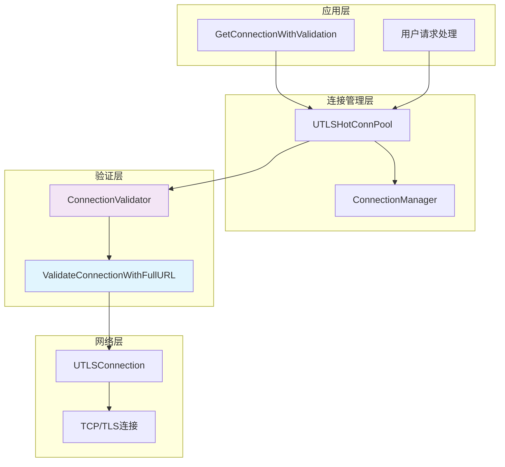
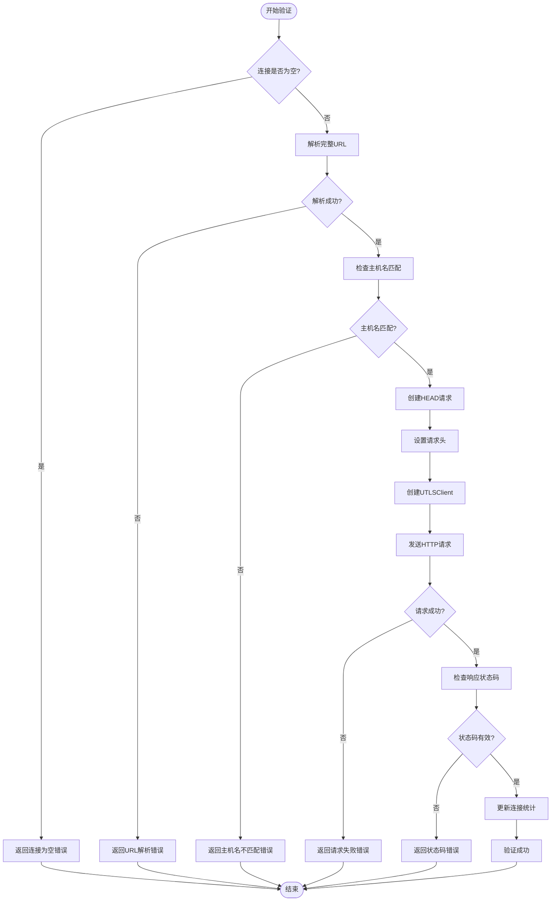
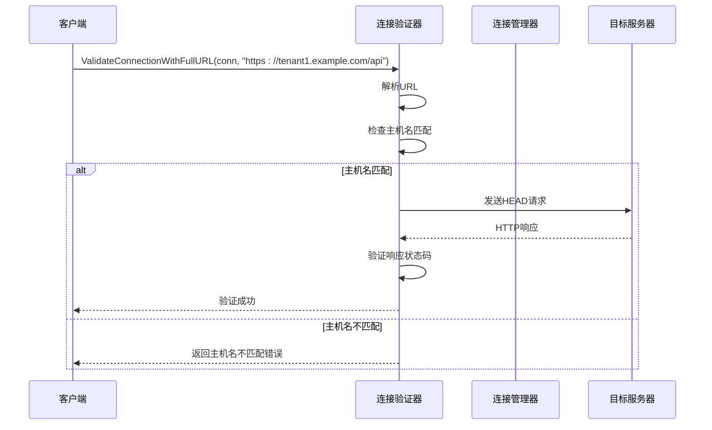

# 完整URL验证方法详细文档

<cite>
**本文档引用的文件**
- [connection_validator.go](file://utlsclient/connection_validator.go)
- [utlshotconnpool.go](file://utlsclient/utlshotconnpool.go)
- [connection_manager.go](file://utlsclient/connection_manager.go)
- [interfaces.go](file://utlsclient/interfaces.go)
- [example_utlsclient_usage.go](file://examples/utlsclient/example_utlsclient_usage.go)
- [utlshotconnpool_test.go](file://test/utlsclient/utlshotconnpool_test.go)
</cite>

## 目录
1. [简介](#简介)
2. [核心架构概述](#核心架构概述)
3. [ValidateConnectionWithFullURL方法详解](#validateconnectionwithfullurl方法详解)
4. [URL解析与主机名验证流程](#url解析与主机名验证流程)
5. [连接验证机制](#连接验证机制)
6. [多租户环境应用](#多租户环境应用)
7. [性能考量与优化](#性能考量与优化)
8. [使用示例](#使用示例)
9. [故障排除指南](#故障排除指南)
10. [总结](#总结)

## 简介

ValidateConnectionWithFullURL方法是UTLS热连接池系统中的核心验证功能，专门设计用于确保连接的安全性和准确性。该方法通过解析完整URL并验证主机名匹配来防止连接被错误地用于不匹配的主机，特别适用于多租户环境和虚拟主机场景。

该方法不仅验证连接的基本健康状态，还通过完整的URL验证确保连接能够正确访问预期的目标资源，从而提供更高层次的安全保障和连接复用准确性。

## 核心架构概述

UTLS热连接池系统采用分层架构设计，ValidateConnectionWithFullURL方法位于验证层的核心位置：



**图表来源**
- [utlshotconnpool.go](file://utlsclient/utlshotconnpool.go#L361-L395)
- [connection_validator.go](file://utlsclient/connection_validator.go#L10-L12)

**章节来源**
- [utlshotconnpool.go](file://utlsclient/utlshotconnpool.go#L1-L200)
- [connection_validator.go](file://utlsclient/connection_validator.go#L1-L263)

## ValidateConnectionWithFullURL方法详解

ValidateConnectionWithFullURL方法是连接验证系统中最严格的方法，它通过以下步骤确保连接的准确性和安全性：

### 方法签名与参数

```go
func (cv *ConnectionValidator) ValidateConnectionWithFullURL(conn *UTLSConnection, fullURL string) error
```

该方法接受两个参数：
- `conn`: 要验证的UTLS连接对象
- `fullURL`: 完整的URL字符串，包含协议、主机名和路径

### 核心验证逻辑

方法执行以下关键步骤：

1. **连接有效性检查**：验证连接对象是否为空
2. **URL解析**：使用标准URL解析器解析完整URL
3. **主机名匹配验证**：比较解析后的主机名与连接的目标主机名
4. **HTTP HEAD请求验证**：发送HEAD请求验证连接的可访问性
5. **响应状态码检查**：确保响应状态码在200-399范围内
6. **连接统计更新**：更新连接的使用时间和统计信息



**图表来源**
- [connection_validator.go](file://utlsclient/connection_validator.go#L99-L158)

**章节来源**
- [connection_validator.go](file://utlsclient/connection_validator.go#L99-L158)

## URL解析与主机名验证流程

### URL解析机制

ValidateConnectionWithFullURL方法使用Go标准库的`net/url`包进行URL解析：

```go
parsedURL, err := url.Parse(fullURL)
```

该解析过程会：
- 验证URL格式的正确性
- 提取协议、主机名、端口和路径信息
- 处理各种URL格式变体（相对路径、绝对路径等）

### 主机名匹配验证

```go
if parsedURL.Hostname() != conn.targetHost {
    Error("URL主机名不匹配: %s != %s", parsedURL.Hostname(), conn.targetHost)
    return fmt.Errorf("URL主机名不匹配")
}
```

主机名匹配验证的关键特性：
- **严格匹配**：要求完全相同的主机名
- **区分大小写**：主机名比较区分大小写
- **端口处理**：如果URL包含端口号，也会参与比较
- **子域名保护**：防止子域名攻击（如example.com vs www.example.com）

### 多租户环境保护

在多租户环境中，主机名验证尤为重要：



**图表来源**
- [connection_validator.go](file://utlsclient/connection_validator.go#L105-L115)

**章节来源**
- [connection_validator.go](file://utlsclient/connection_validator.go#L105-L115)

## 连接验证机制

### HTTP HEAD请求验证

ValidateConnectionWithFullURL方法使用HTTP HEAD请求进行验证，这种选择具有以下优势：

1. **轻量级**：HEAD请求只返回响应头，不传输响应体
2. **安全性**：不会修改服务器状态
3. **效率高**：减少网络传输和处理开销
4. **兼容性好**：大多数Web服务器都支持HEAD请求

### 请求构建过程

```go
req := &http.Request{
    Method: "HEAD",
    URL:    parsedURL,
    Header: make(http.Header),
    Host:   conn.targetHost,
}
```

### 请求头设置

```go
req.Header.Set("User-Agent", "UTLSHotConnPool/1.0 URLValidation")
req.Header.Set("Connection", "keep-alive")
```

特殊请求头的作用：
- **User-Agent**：标识请求来源，便于服务器识别和日志记录
- **Connection**：保持连接活跃，提高后续请求效率

### 响应验证

```go
if resp.StatusCode < 200 || resp.StatusCode >= 400 {
    Error("URL验证失败，状态码异常: %s -> %d", conn.targetIP, resp.StatusCode)
    return fmt.Errorf("URL验证失败，状态码异常: %d", resp.StatusCode)
}
```

响应验证的关键点：
- **状态码范围**：200-399范围内的状态码被视为有效
- **错误处理**：详细的错误信息便于问题诊断
- **超时控制**：通过连接超时配置控制验证时间

### 连接统计更新

```go
conn.mu.Lock()
conn.lastUsed = time.Now()
conn.mu.Unlock()
```

连接统计信息的更新：
- **lastUsed**：记录连接最后使用时间
- **线程安全**：使用互斥锁确保并发安全
- **统计准确性**：准确反映连接使用情况

**章节来源**
- [connection_validator.go](file://utlsclient/connection_validator.go#L119-L158)

## 多租户环境应用

### 虚拟主机场景

在虚拟主机或多租户环境中，ValidateConnectionWithFullURL方法提供关键的安全保障：

#### 场景1：租户隔离

```go
// 租户A的请求
tenantAURL := "https://tenant-a.example.com/api/data"
connA, err := pool.GetConnectionWithValidation(tenantAURL)

// 租户B的请求
tenantBURL := "https://tenant-b.example.com/api/data"
connB, err := pool.GetConnectionWithValidation(tenantBURL)
```

#### 场景2：子域名保护

```go
// 正确的子域名访问
correctURL := "https://api.example.com/v1/users"
conn, err := pool.GetConnectionWithValidation(correctURL)

// 错误的子域名访问（被阻止）
wrongURL := "https://malicious.example.com/v1/users"
conn, err := pool.GetConnectionWithValidation(wrongURL) // 返回主机名不匹配错误
```

### 安全性优势

1. **防止劫持攻击**：确保连接只能访问预期的主机
2. **数据隔离**：不同租户的数据无法相互访问
3. **审计追踪**：详细的验证日志便于安全审计
4. **动态验证**：每次请求都进行实时验证，而非静态配置

### 性能影响分析

虽然ValidateConnectionWithFullURL方法增加了验证开销，但在多租户环境中仍具有显著优势：

| 方面 | 优势 | 影响 |
|------|------|------|
| 安全性 | 防止跨租户访问 | 显著提升 |
| 准确性 | 确保连接匹配 | 极大改善 |
| 可维护性 | 简化配置管理 | 明显提升 |
| 性能 | 单次验证开销可控 | 轻微增加 |

**章节来源**
- [connection_validator.go](file://utlsclient/connection_validator.go#L111-L115)
- [example_utlsclient_usage.go](file://examples/utlsclient/example_utlsclient_usage.go#L67-L93)

## 性能考量与优化

### 验证开销分析

ValidateConnectionWithFullURL方法的性能特征：

#### 时间复杂度
- **URL解析**：O(n)，其中n为URL长度
- **主机名比较**：O(m)，其中m为主机名长度
- **HTTP请求**：受网络延迟影响，通常在几十到几百毫秒

#### 资源消耗
- **CPU**：主要用于URL解析和字符串比较
- **内存**：少量额外内存用于请求构建和响应处理
- **网络**：需要建立TCP连接和TLS握手

### 优化策略

#### 1. 缓存机制

```go
// 在连接池层面实现缓存
type ConnectionCache struct {
    cache map[string]*UTLSConnection
    mu    sync.RWMutex
}

func (cc *ConnectionCache) Get(key string) (*UTLSConnection, bool) {
    cc.mu.RLock()
    defer cc.mu.RUnlock()
    conn, exists := cc.cache[key]
    return conn, exists
}
```

#### 2. 异步验证

```go
// 后台异步验证连接
func (p *UTLSHotConnPool) asyncValidateConnection(conn *UTLSConnection, fullURL string) {
    go func() {
        validator := NewConnectionValidator(&p.config)
        err := validator.ValidateConnectionWithFullURL(conn, fullURL)
        if err != nil {
            // 标记连接为不健康
            conn.markUnhealthy()
        }
    }()
}
```

#### 3. 条件验证

```go
// 基于频率的条件验证
type ValidationFrequency struct {
    count     int
    threshold int
}

func (vf *ValidationFrequency) ShouldValidate() bool {
    vf.count++
    return vf.count % vf.threshold == 0
}
```

### 性能监控指标

建议监控以下关键指标：

| 指标 | 描述 | 目标值 |
|------|------|--------|
| 验证成功率 | 成功验证的比例 | >99% |
| 平均响应时间 | 验证操作的平均耗时 | <500ms |
| 错误率 | 验证失败的比例 | <1% |
| 连接复用率 | 复用现有连接的比例 | >80% |

**章节来源**
- [connection_validator.go](file://utlsclient/connection_validator.go#L135-L158)

## 使用示例

### 基本使用示例

以下是ValidateConnectionWithFullURL方法的实际使用示例：

#### 示例1：基础URL验证

```go
// 创建连接池
config, _ := utlsclient.LoadPoolConfigFromFile("config.toml")
pool := utlsclient.NewUTLSHotConnPool(config)

// 获取并验证连接
targetURL := "https://api.example.com/v1/users"
conn, err := pool.GetConnectionWithValidation(targetURL)
if err != nil {
    log.Printf("连接验证失败: %v", err)
    return
}

// 使用连接
client := utlsclient.NewUTLSClient(conn)
resp, err := client.Get(targetURL)
// 处理响应...
```

#### 示例2：多租户环境

```go
func processTenantRequest(tenantID string, tenantURL string) error {
    // 构建租户特定的URL
    fullURL := fmt.Sprintf("%s/%s/data", tenantURL, tenantID)
    
    // 获取并验证租户专用连接
    conn, err := pool.GetConnectionWithValidation(fullURL)
    if err != nil {
        return fmt.Errorf("租户 %s 连接验证失败: %w", tenantID, err)
    }
    
    // 处理租户请求
    defer pool.PutConnection(conn)
    
    // 执行业务逻辑...
    return nil
}
```

#### 示例3：错误处理与重试

```go
func robustConnectionValidation(pool *utlsclient.UTLSHotConnPool, url string) (*utlsclient.UTLSConnection, error) {
    var lastErr error
    
    for i := 0; i < 3; i++ {
        conn, err := pool.GetConnectionWithValidation(url)
        if err == nil {
            return conn, nil
        }
        
        lastErr = err
        time.Sleep(time.Duration(i+1) * time.Second) // 指数退避
    }
    
    return nil, fmt.Errorf("多次验证失败: %w", lastErr)
}
```

### 高级应用场景

#### 应用场景1：API网关

```go
type APIGateway struct {
    pools map[string]*utlsclient.UTLSHotConnPool
}

func (g *APIGateway) RouteRequest(serviceName string, url string) (*utlsclient.UTLSConnection, error) {
    pool, exists := g.pools[serviceName]
    if !exists {
        return nil, fmt.Errorf("服务不存在: %s", serviceName)
    }
    
    // 使用完整URL验证确保路由正确性
    return pool.GetConnectionWithValidation(url)
}
```

#### 应用场景2：微服务通信

```go
type MicroserviceClient struct {
    servicePools map[string]*utlsclient.UTLSHotConnPool
}

func (c *MicroserviceClient) CallService(serviceName, endpoint string) (*http.Response, error) {
    baseURL, exists := c.servicePools[serviceName]
    if !exists {
        return nil, fmt.Errorf("未知服务: %s", serviceName)
    }
    
    fullURL := fmt.Sprintf("%s%s", baseURL, endpoint)
    conn, err := c.pool.GetConnectionWithValidation(fullURL)
    if err != nil {
        return nil, err
    }
    
    client := utlsclient.NewUTLSClient(conn)
    return client.Get(fullURL)
}
```

**章节来源**
- [example_utlsclient_usage.go](file://examples/utlsclient/example_utlsclient_usage.go#L67-L93)
- [utlshotconnpool.go](file://utlsclient/utlshotconnpool.go#L361-L395)

## 故障排除指南

### 常见错误及解决方案

#### 1. URL解析失败

**错误信息**：`URL解析失败: parse "invalid-url": invalid URI for request`

**原因**：
- URL格式不正确
- 包含非法字符
- 缺少必要的组成部分

**解决方案**：
```go
// 验证URL格式
func isValidURL(urlStr string) bool {
    _, err := url.ParseRequestURI(urlStr)
    return err == nil
}

// 使用前验证
if !isValidURL(targetURL) {
    return fmt.Errorf("无效的URL格式: %s", targetURL)
}
```

#### 2. 主机名不匹配

**错误信息**：`URL主机名不匹配`

**原因**：
- 连接的目标主机与URL主机不一致
- DNS解析问题
- 连接池配置错误

**解决方案**：
```go
// 检查连接配置
func diagnoseHostnameMismatch(conn *utlsclient.UTLSConnection, url string) error {
    parsed, err := url.Parse(url)
    if err != nil {
        return err
    }
    
    fmt.Printf("连接目标主机: %s\n", conn.targetHost)
    fmt.Printf("URL主机名: %s\n", parsed.Hostname())
    fmt.Printf("连接IP: %s\n", conn.targetIP)
    
    return fmt.Errorf("主机名不匹配，请检查连接配置")
}
```

#### 3. 连接验证失败

**错误信息**：`URL验证失败: connection refused`

**原因**：
- 目标服务器不可达
- 网络连接问题
- 服务器拒绝连接

**解决方案**：
```go
// 实施连接诊断
func diagnoseConnectionFailure(conn *utlsclient.UTLSConnection, url string) error {
    // 检查连接状态
    if !conn.IsHealthy() {
        return fmt.Errorf("连接不健康: %s", conn.targetIP)
    }
    
    // 检查网络连通性
    dialer := net.Dialer{Timeout: 5 * time.Second}
    conn, err := dialer.Dial("tcp", fmt.Sprintf("%s:%d", conn.targetIP, 443))
    if err != nil {
        return fmt.Errorf("网络连接失败: %w", err)
    }
    conn.Close()
    
    return fmt.Errorf("连接验证失败，但网络可达，请检查服务器配置")
}
```

### 调试技巧

#### 1. 启用详细日志

```go
// 设置调试级别
client := utlsclient.NewUTLSClient(conn)
client.SetDebug(true) // 启用详细日志输出
```

#### 2. 性能分析

```go
// 记录验证时间
startTime := time.Now()
err := validator.ValidateConnectionWithFullURL(conn, url)
duration := time.Since(startTime)

fmt.Printf("验证耗时: %v\n", duration)
if duration > 1 * time.Second {
    fmt.Println("警告: 验证时间过长")
}
```

#### 3. 连接状态检查

```go
// 检查连接详细信息
stats := conn.Stats()
fmt.Printf("连接统计:\n")
fmt.Printf("- 创建时间: %v\n", stats.Created)
fmt.Printf("- 最后使用: %v\n", stats.LastUsed)
fmt.Printf("- 请求次数: %d\n", stats.RequestCount)
fmt.Printf("- 错误次数: %d\n", stats.ErrorCount)
fmt.Printf("- 健康状态: %v\n", stats.IsHealthy)
```

### 监控与告警

建议实施以下监控措施：

```go
type ValidationMonitor struct {
    successCount int64
    failureCount int64
    errorTypes   map[string]int
}

func (m *ValidationMonitor) RecordSuccess() {
    atomic.AddInt64(&m.successCount, 1)
}

func (m *ValidationMonitor) RecordFailure(err error) {
    atomic.AddInt64(&m.failureCount, 1)
    m.errorTypes[err.Error()]++
}

func (m *ValidationMonitor) GetMetrics() map[string]interface{} {
    return map[string]interface{}{
        "success_rate": float64(m.successCount) / float64(m.successCount + m.failureCount),
        "failure_count": m.failureCount,
        "error_types":   m.errorTypes,
    }
}
```

**章节来源**
- [connection_validator.go](file://utlsclient/connection_validator.go#L107-L115)
- [connection_validator.go](file://utlsclient/connection_validator.go#L140-L150)

## 总结

ValidateConnectionWithFullURL方法是UTLS热连接池系统中不可或缺的安全验证组件。它通过以下关键特性为系统提供全面的保护：

### 核心优势

1. **精确性**：通过完整URL验证确保连接与目标资源的精确匹配
2. **安全性**：防止跨租户访问和主机名劫持攻击
3. **可靠性**：基于HTTP HEAD请求的可靠验证机制
4. **灵活性**：支持各种URL格式和主机名配置

### 技术特点

- **严格主机名验证**：防止子域名攻击和主机名欺骗
- **轻量级验证**：使用HEAD请求减少网络开销
- **并发安全**：完善的锁机制确保多线程环境下的安全性
- **详细日志**：完整的验证过程记录便于问题诊断

### 应用价值

在现代分布式系统和微服务架构中，ValidateConnectionWithFullURL方法提供了：
- **多租户隔离**：确保不同租户之间的数据安全
- **虚拟主机支持**：完美支持复杂的域名解析场景
- **安全合规**：满足各种安全标准和合规要求
- **运维便利**：详细的日志和监控支持高效的运维管理

### 最佳实践建议

1. **合理配置超时时间**：根据网络环境调整验证超时设置
2. **实施监控告警**：建立完善的验证成功率和响应时间监控
3. **定期健康检查**：结合快速健康检查机制提高系统稳定性
4. **错误处理优化**：实现智能的重试和降级策略

ValidateConnectionWithFullURL方法的设计体现了对安全性和准确性的极致追求，在保证系统安全的同时，也为高性能的连接复用奠定了坚实基础。随着云原生和微服务架构的普及，这种精确的连接验证机制将成为现代分布式系统的重要基础设施。