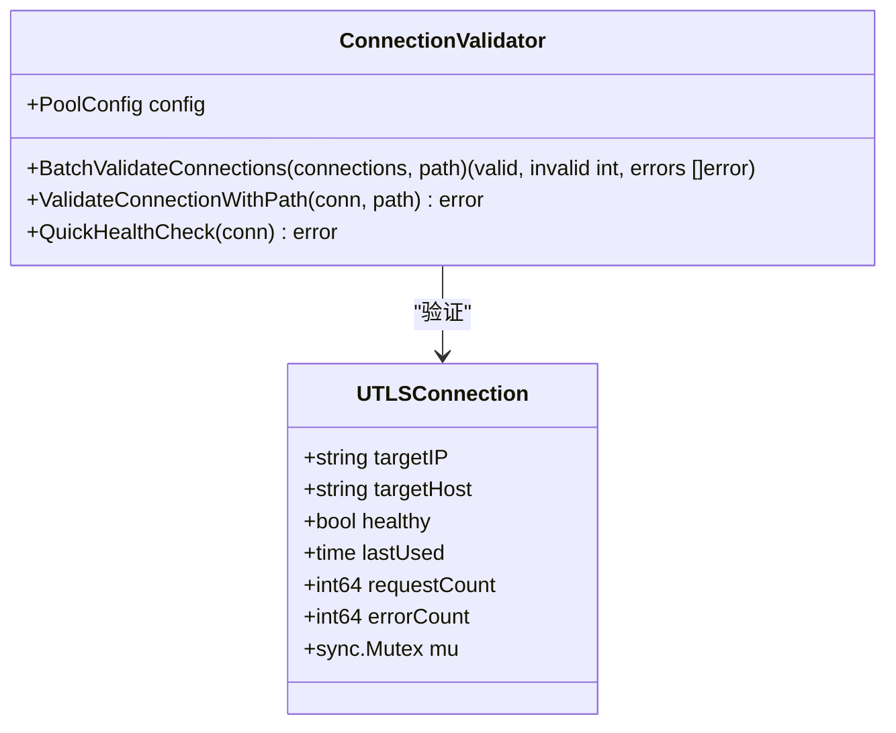
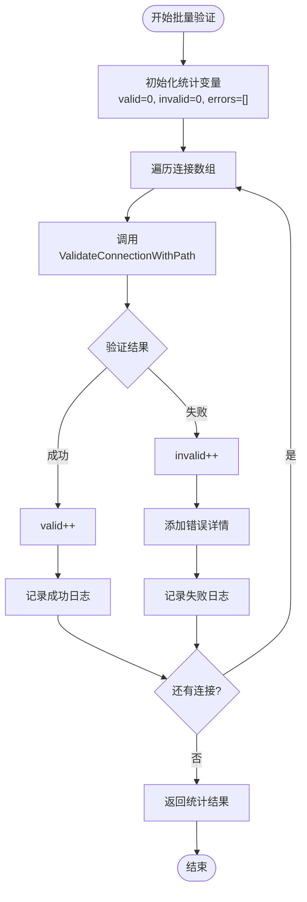
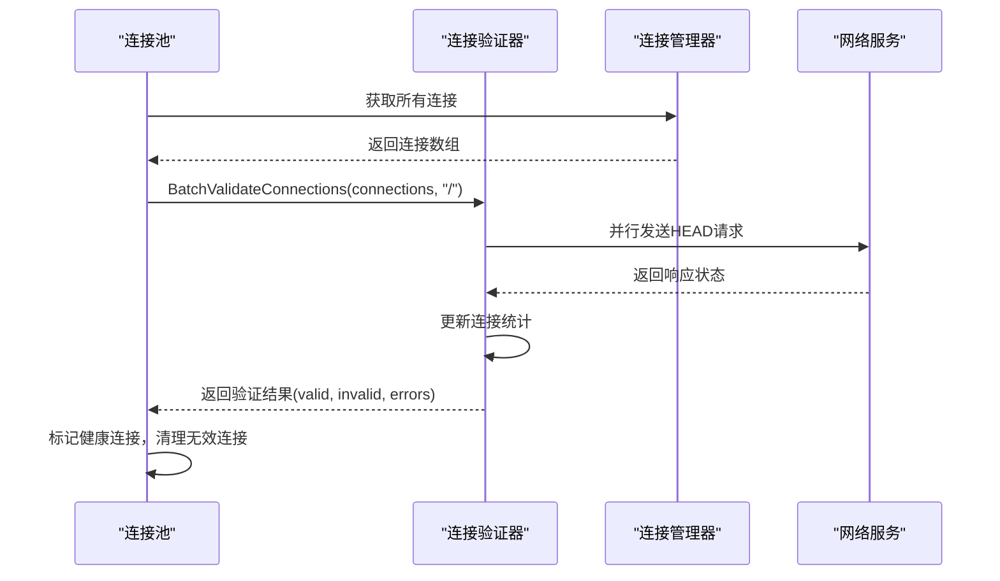
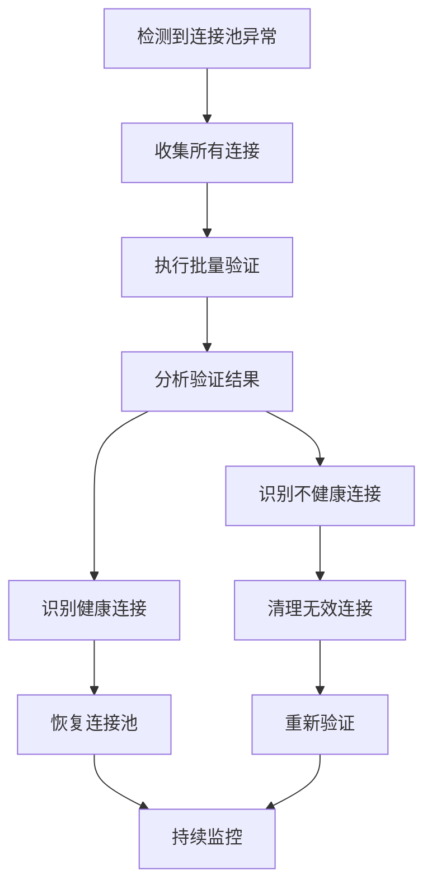
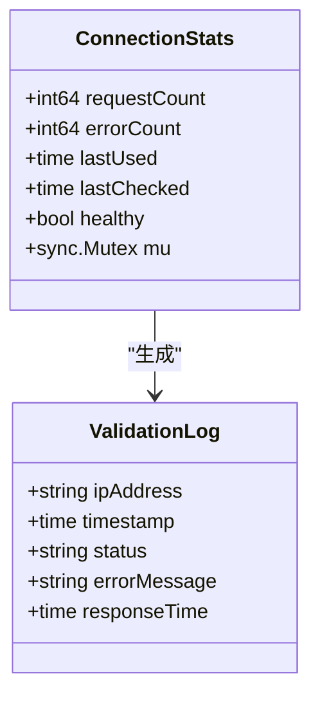
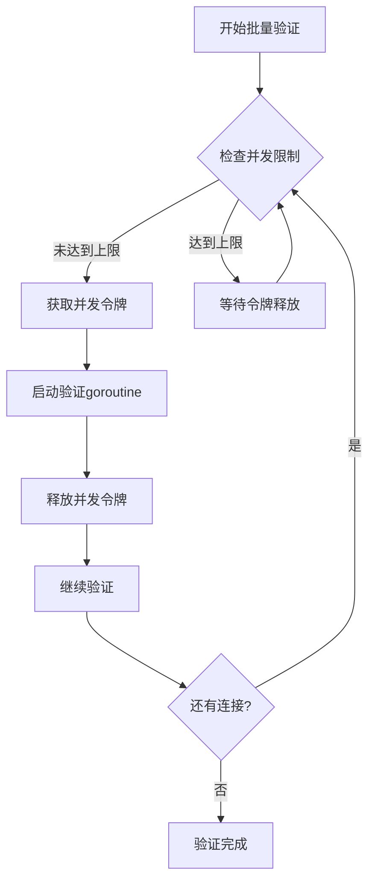
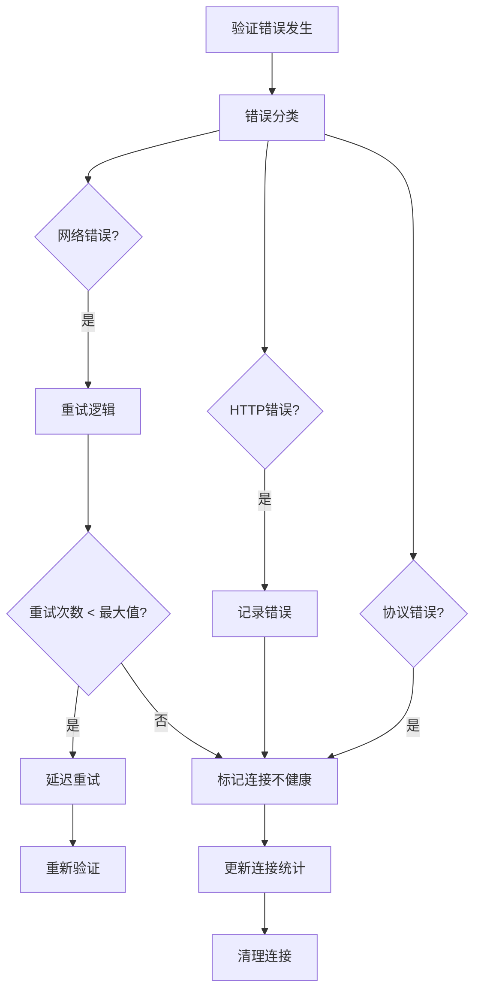

# 批量验证

<cite>
**本文档中引用的文件**
- [connection_validator.go](file://utlsclient/connection_validator.go)
- [health_checker.go](file://utlsclient/health_checker.go)
- [utlshotconnpool.go](file://utlsclient/utlshotconnpool.go)
- [localippool.go](file://localippool/localippool.go)
- [remotedomainippool.go](file://remotedomainippool/remotedomainippool.go)
- [example_hotconnpool_usage.go](file://examples/utlsclient/example_hotconnpool_usage.go)
</cite>

## 目录
1. [简介](#简介)
2. [BatchValidateConnections方法概述](#batchvalidateconnections方法概述)
3. [核心实现机制](#核心实现机制)
4. [应用场景分析](#应用场景分析)
5. [统计信息收集机制](#统计信息收集机制)
6. [性能影响与优化策略](#性能影响与优化策略)
7. [代码示例与最佳实践](#代码示例与最佳实践)
8. [故障处理与监控](#故障处理与监控)
9. [总结](#总结)

## 简介

批量验证是连接池管理系统中的核心功能之一，专门设计用于对大量连接进行高效健康检查。通过BatchValidateConnections方法，系统能够同时验证多个连接的有效性，显著提高连接池维护效率，特别是在连接池初始化、周期性维护和故障恢复场景中发挥重要作用。

## BatchValidateConnections方法概述

BatchValidateConnections方法是连接验证器的核心组件，专门设计用于批量处理连接健康检查任务。该方法接受连接数组和验证路径作为输入，返回验证结果的统计信息和错误详情。

### 方法签名与返回值



**图表来源**
- [connection_validator.go](file://utlsclient/connection_validator.go#L225-L238)
- [utlshotconnpool.go](file://utlsclient/utlshotconnpool.go#L204-L233)

### 核心特性

- **批量处理能力**：一次性验证多个连接，避免重复的网络开销
- **同步执行特性**：采用串行验证模式，确保结果准确性
- **统计信息收集**：提供详细的验证结果统计
- **错误详情记录**：完整记录每个失败连接的错误信息

**章节来源**
- [connection_validator.go](file://utlsclient/connection_validator.go#L225-L238)

## 核心实现机制

### 验证流程设计

BatchValidateConnections方法采用简洁而高效的验证流程：



**图表来源**
- [connection_validator.go](file://utlsclient/connection_validator.go#L225-L238)

### 连接验证深度分析

每个连接的验证过程包含以下关键步骤：

1. **连接状态检查**：验证连接是否为空且处于健康状态
2. **HTTP请求构建**：创建HEAD请求进行轻量级验证
3. **网络通信执行**：使用UTLSClient发送验证请求
4. **响应状态验证**：检查HTTP状态码范围
5. **统计信息更新**：更新连接的使用时间和统计计数

**章节来源**
- [connection_validator.go](file://utlsclient/connection_validator.go#L41-L96)

## 应用场景分析

### 连接池初始化场景

在连接池启动和初始化过程中，BatchValidateConnections发挥关键作用：



**图表来源**
- [utlshotconnpool.go](file://utlsclient/utlshotconnpool.go#L1365-L1430)
- [health_checker.go](file://utlsclient/health_checker.go#L91-L112)

### 周期性维护场景

系统定期执行的连接健康检查：

| 维护类型 | 执行频率 | 验证路径 | 性能影响 |
|---------|---------|---------|---------|
| 快速检查 | 30秒 | "/" | 低 |
| 深度验证 | 5分钟 | 自定义路径 | 中等 |
| 批量验证 | 1小时 | 批量连接 | 高 |

### 故障恢复场景

当检测到连接池异常时，批量验证用于快速诊断和恢复：



**图表来源**
- [health_checker.go](file://utlsclient/health_checker.go#L132-L165)

**章节来源**
- [health_checker.go](file://utlsclient/health_checker.go#L91-L165)

## 统计信息收集机制

### 验证结果统计

BatchValidateConnections方法提供完整的统计信息收集：

| 统计指标 | 类型 | 描述 | 用途 |
|---------|------|------|------|
| valid | int | 通过验证的连接数量 | 衡量连接池健康程度 |
| invalid | int | 验证失败的连接数量 | 识别问题连接 |
| errors | []error | 详细的错误信息列表 | 故障诊断和日志记录 |

### 连接状态跟踪

系统维护详细的连接状态信息：



**图表来源**
- [utlshotconnpool.go](file://utlsclient/utlshotconnpool.go#L204-L233)

### 错误分类与处理

系统对验证失败进行分类处理：

1. **网络连接错误**：超时、拒绝连接
2. **HTTP响应错误**：状态码异常
3. **协议错误**：TLS握手失败
4. **应用层错误**：业务逻辑验证失败

**章节来源**
- [connection_validator.go](file://utlsclient/connection_validator.go#L225-L238)

## 性能影响与优化策略

### 同步执行特性分析

BatchValidateConnections采用同步执行模式，虽然牺牲了一定的并发性能，但确保了验证结果的一致性和准确性。

#### 性能特征

- **CPU使用**：中等，主要消耗在网络I/O和TLS处理
- **内存占用**：低，仅需维护连接数组和统计变量
- **网络开销**：高，每个连接都需要独立的网络请求
- **响应时间**：取决于连接数量和网络状况

### 性能优化建议

#### 1. 后台执行策略

```go
// 推荐的异步执行模式
func batchValidateInBackground(pool *UTLSHotConnPool, path string) {
    go func() {
        connections := pool.GetAllConnections()
        valid, invalid, errors := pool.validator.BatchValidateConnections(connections, path)
        
        log.Printf("批量验证完成: 成功=%d, 失败=%d", valid, invalid)
        if len(errors) > 0 {
            logErrors(errors)
        }
    }()
}
```

#### 2. 分批处理策略

对于大型连接池，建议采用分批处理：

```go
func batchValidateWithBatches(pool *UTLSHotConnPool, batchSize int, path string) {
    connections := pool.GetAllConnections()
    total := len(connections)
    
    for i := 0; i < total; i += batchSize {
        end := i + batchSize
        if end > total {
            end = total
        }
        
        batch := connections[i:end]
        pool.validator.BatchValidateConnections(batch, path)
        
        // 可选：添加适当的延迟
        time.Sleep(100 * time.Millisecond)
    }
}
```

#### 3. 并发控制机制



**章节来源**
- [connection_validator.go](file://utlsclient/connection_validator.go#L225-L238)

## 代码示例与最佳实践

### IP池批量验证示例

以下是针对IP池中所有连接进行批量验证的实际代码示例：

```go
// IP池批量验证实现
func validateIPPoolConnections(ipPool IPPool, validator *ConnectionValidator, validationPath string) {
    // 获取所有IP地址
    allIPs := ipPool.GetAllIPs()
    
    // 从连接池获取对应的所有连接
    var connections []*UTLSConnection
    for _, ip := range allIPs {
        conn := getConnectionForIP(ip)
        if conn != nil {
            connections = append(connections, conn)
        }
    }
    
    // 执行批量验证
    valid, invalid, errors := validator.BatchValidateConnections(connections, validationPath)
    
    // 处理验证结果
    logValidationResults(valid, invalid, errors)
    
    // 根据结果采取相应措施
    if invalid > 0 {
        handleFailedConnections(errors)
    }
}
```

### 连接池预热验证

```go
// 连接池预热验证流程
func preWarmConnectionPool(pool *UTLSHotConnPool, targetHost string, warmupCount int) error {
    // 预创建连接
    if err := pool.PreWarmConnections(targetHost, warmupCount); err != nil {
        return fmt.Errorf("预热连接失败: %v", err)
    }
    
    // 批量验证新创建的连接
    connections := pool.GetConnectionsByHost(targetHost)
    valid, invalid, errors := pool.validator.BatchValidateConnections(connections, "/health")
    
    if invalid > 0 {
        // 清理无效连接
        pool.CleanupUnhealthyConnections()
        return fmt.Errorf("预热验证失败: %d个连接无效", invalid)
    }
    
    return nil
}
```

### 健康检查集成

```go
// 健康检查器集成批量验证
func integrateWithHealthChecker(hc *HealthChecker) {
    // 定期执行批量验证
    ticker := time.NewTicker(hc.config.HealthCheckInterval)
    go func() {
        for {
            select {
            case <-ticker.C:
                // 获取所有连接
                connections := hc.connManager.GetAllConnections()
                
                // 批量验证
                valid, invalid, errors := hc.validator.BatchValidateConnections(connections, "/")
                
                // 更新健康状态
                hc.updateHealthStatus(valid, invalid, len(connections))
                
                // 记录统计信息
                hc.logHealthMetrics(valid, invalid, len(connections))
                
                // 处理错误
                if len(errors) > 0 {
                    hc.handleValidationErrors(errors)
                }
            }
        }
    }()
}
```

**章节来源**
- [example_hotconnpool_usage.go](file://examples/utlsclient/example_hotconnpool_usage.go#L1-L277)
- [utlshotconnpool.go](file://utlsclient/utlshotconnpool.go#L1365-L1430)

## 故障处理与监控

### 错误处理策略

批量验证过程中的错误处理遵循分级处理原则：



### 监控指标设计

关键监控指标包括：

| 指标类别 | 具体指标 | 计算方式 | 告警阈值 |
|---------|---------|---------|---------|
| 验证性能 | 平均响应时间 | 总时间/验证次数 | >5秒 |
| 连接健康 | 健康连接比例 | 健康连接数/总连接数 | <80% |
| 错误统计 | 错误率 | 错误次数/验证次数 | >10% |
| 系统资源 | CPU使用率 | 验证期间CPU占用 | >80% |

### 故障恢复机制

```go
// 故障恢复流程
func recoverFromValidationFailure(hc *HealthChecker, failedConnections []*UTLSConnection) {
    // 1. 标记所有失败连接为不健康
    for _, conn := range failedConnections {
        conn.markUnhealthy()
    }
    
    // 2. 清理无效连接
    cleaned := hc.CleanupUnhealthyConnections()
    
    // 3. 重新创建健康连接
    if cleaned > 0 {
        hc.RecreateHealthyConnections(cleaned)
    }
    
    // 4. 触发重新验证
    go hc.TriggerRevalidation()
    
    // 5. 记录恢复事件
    hc.LogRecoveryEvent(cleaned)
}
```

**章节来源**
- [health_checker.go](file://utlsclient/health_checker.go#L132-L165)

## 总结

BatchValidateConnections方法作为连接池管理系统的核心组件，提供了高效、可靠的批量连接验证能力。通过深入理解其实现机制、应用场景和优化策略，开发者可以：

1. **提升系统可靠性**：通过定期批量验证确保连接池的健康状态
2. **优化性能表现**：采用异步执行和分批处理策略减少对主线程的影响
3. **增强故障处理能力**：建立完善的错误分类和恢复机制
4. **改善监控效果**：收集详细的统计信息支持运维决策

在实际应用中，建议结合具体的业务需求和系统负载特点，选择合适的批量验证策略，并配合完善的监控和告警机制，确保连接池系统的稳定运行。