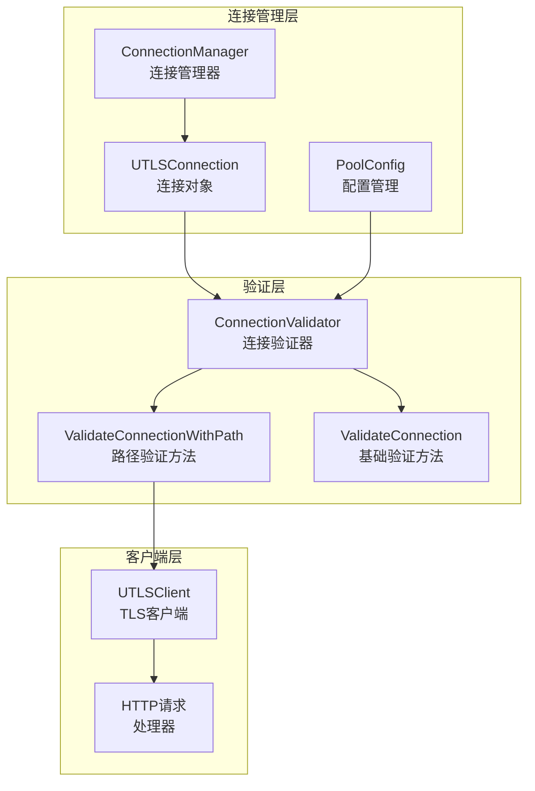
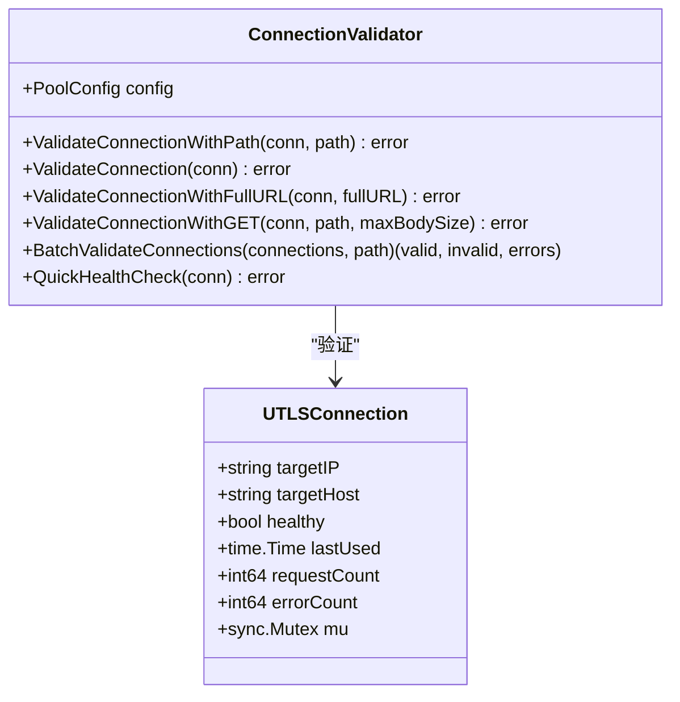
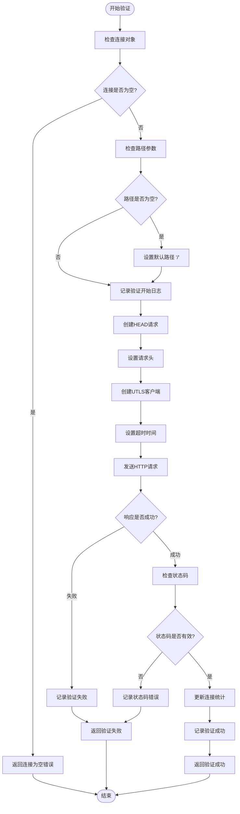
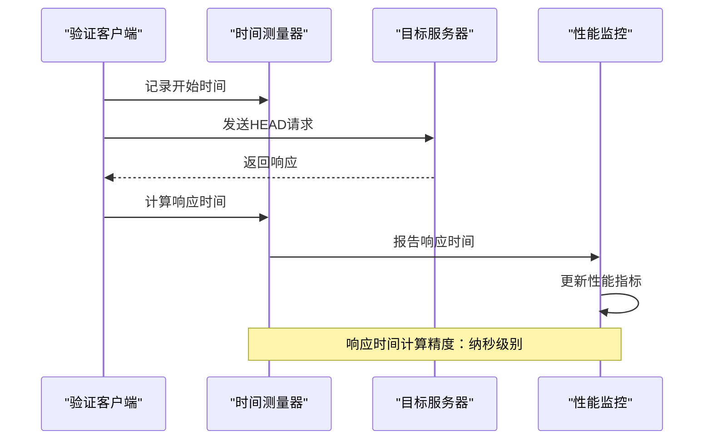
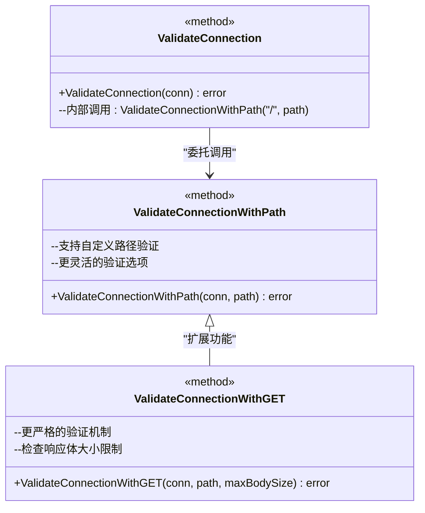
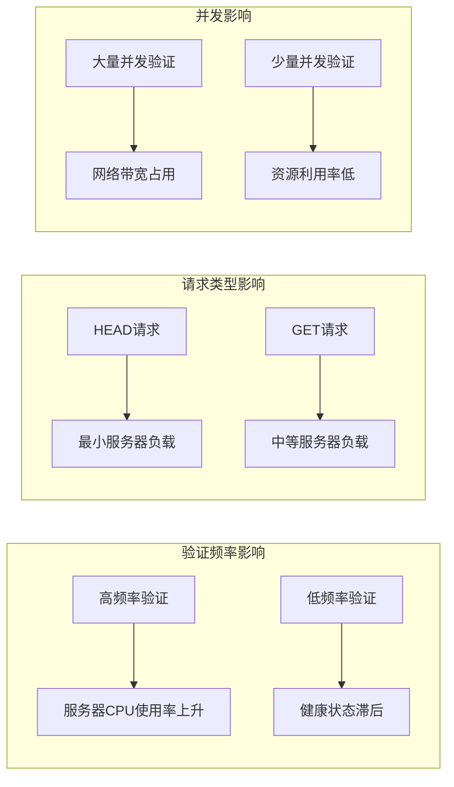
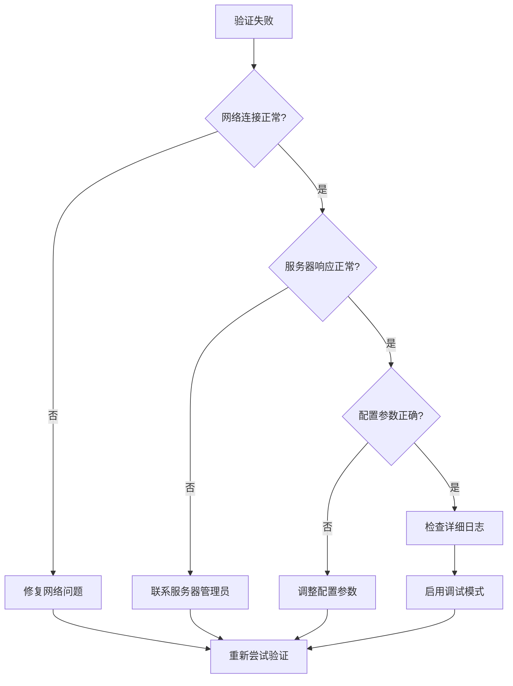

# 路径验证方法详细文档

<cite>
**本文档引用的文件**
- [connection_validator.go](file://utlsclient/connection_validator.go)
- [utlshotconnpool.go](file://utlsclient/utlshotconnpool.go)
- [connection_manager.go](file://utlsclient/connection_manager.go)
- [interfaces.go](file://utlsclient/interfaces.go)
- [constants.go](file://utlsclient/constants.go)
- [utlsclient.go](file://utlsclient/utlsclient.go)
- [test_helpers.go](file://utlsclient/test_helpers.go)
- [example_utlsclient_usage.go](file://examples/utlsclient/example_utlsclient_usage.go)
</cite>

## 目录
1. [简介](#简介)
2. [核心架构概述](#核心架构概述)
3. [ValidateConnectionWithPath方法详解](#validateconnectionwithpath方法详解)
4. [验证流程与实现细节](#验证流程与实现细节)
5. [与其他验证方法的关系](#与其他验证方法的关系)
6. [配置参数与性能影响](#配置参数与性能影响)
7. [使用示例与最佳实践](#使用示例与最佳实践)
8. [优化建议与故障排除](#优化建议与故障排除)
9. [总结](#总结)

## 简介

路径验证方法是爬虫平台中连接池管理系统的核心功能之一，专门用于验证特定路径的可用性和响应能力。该系统通过向指定路径发送HEAD请求来检测目标服务器的健康状态，为后续的业务请求提供可靠的连接基础。

ValidateConnectionWithPath方法作为路径验证的核心实现，提供了灵活的路径验证能力，支持自定义验证路径，特别适用于需要确保特定API端点可用性的场景。该方法不仅能够验证基本的网络连通性，还能评估特定资源的访问能力。

## 核心架构概述

路径验证系统采用分层架构设计，包含连接管理器、验证器和客户端三个主要组件：



**图表来源**
- [connection_manager.go](file://utlsclient/connection_manager.go#L8-L23)
- [connection_validator.go](file://utlsclient/connection_validator.go#L10-L19)
- [utlsclient.go](file://utlsclient/utlsclient.go#L37-L52)

**章节来源**
- [connection_manager.go](file://utlsclient/connection_manager.go#L1-L218)
- [connection_validator.go](file://utlsclient/connection_validator.go#L1-L263)

## ValidateConnectionWithPath方法详解

ValidateConnectionWithPath方法是路径验证的核心实现，负责验证指定路径的连接可用性。该方法通过发送HEAD请求来检测目标路径的响应状态，确保连接能够正常访问指定资源。

### 方法签名与参数



**图表来源**
- [connection_validator.go](file://utlsclient/connection_validator.go#L41-L96)
- [utlshotconnpool.go](file://utlsclient/utlshotconnpool.go#L204-L233)

### 核心验证逻辑

ValidateConnectionWithPath方法的执行流程遵循严格的验证步骤：



**图表来源**
- [connection_validator.go](file://utlsclient/connection_validator.go#L41-L96)

**章节来源**
- [connection_validator.go](file://utlsclient/connection_validator.go#L41-L96)

## 验证流程与实现细节

### 请求头设置策略

ValidateConnectionWithPath方法采用了精心设计的请求头设置策略，确保验证请求既不会给服务器带来过多负担，又能有效检测连接状态：

| 请求头名称 | 设置值 | 用途说明 |
|------------|--------|----------|
| User-Agent | UTLSHotConnPool/1.0 HealthCheck | 标识验证请求来源，便于服务器识别 |
| Connection | keep-alive | 保持连接活跃状态，提高验证效率 |
| Host | conn.targetHost | 正确设置目标主机头，确保请求路由正确 |

### 响应状态码检查机制

系统实现了严格的状态码检查机制，只有特定的状态码才被视为验证成功的标志：

| 状态码范围 | 验证结果 | 处理策略 |
|------------|----------|----------|
| 200-299 | 验证成功 | 连接标记为健康状态 |
| 403 | IP被封禁 | 标记为不可用，加入黑名单 |
| 其他4xx | 验证失败 | 记录错误，连接标记为不健康 |
| 5xx | 服务器错误 | 记录错误，连接标记为不健康 |
| 超时/网络错误 | 连接失败 | 连接标记为不健康，增加错误计数 |

### 响应时间统计与监控

ValidateConnectionWithPath方法集成了精确的响应时间测量机制：



**图表来源**
- [connection_validator.go](file://utlsclient/connection_validator.go#L74-L76)

**章节来源**
- [connection_validator.go](file://utlsclient/connection_validator.go#L66-L96)

## 与其他验证方法的关系

路径验证系统提供了多种验证方法，每种方法针对不同的使用场景进行了优化：

### ValidateConnection与ValidateConnectionWithPath的关系

ValidateConnection方法是ValidateConnectionWithPath方法的特例，专门用于验证根路径的连接状态：



**图表来源**
- [connection_validator.go](file://utlsclient/connection_validator.go#L22-L38)
- [connection_validator.go](file://utlsclient/connection_validator.go#L41-L96)

### 验证方法对比表

| 验证方法 | 验证类型 | 请求方法 | 响应体处理 | 性能特点 |
|----------|----------|----------|------------|----------|
| ValidateConnection | 根路径验证 | HEAD | 无 | 最快，最小开销 |
| ValidateConnectionWithPath | 自定义路径 | HEAD | 无 | 中等性能，灵活 |
| ValidateConnectionWithGET | 完整验证 | GET | 有限制 | 较慢，最严格 |
| ValidateConnectionWithFullURL | URL验证 | HEAD | 无 | 中等性能，URL专用 |

**章节来源**
- [connection_validator.go](file://utlsclient/connection_validator.go#L22-L222)

## 配置参数与性能影响

### 关键配置参数

路径验证系统的性能和可靠性很大程度上取决于配置参数的合理设置：

| 配置参数 | 默认值 | 推荐范围 | 性能影响 |
|----------|--------|----------|----------|
| ConnTimeout | 30秒 | 5-30秒 | 影响验证超时处理 |
| TestTimeout | 10秒 | 3-15秒 | 影响验证响应时间 |
| MaxRetries | 3次 | 1-5次 | 影响验证稳定性 |
| HealthCheckInterval | 30秒 | 10-60秒 | 影响健康检查频率 |

### 服务器负载影响分析

路径验证方法对服务器的负载影响相对较小，但仍需考虑以下因素：



**图表来源**
- [utlshotconnpool.go](file://utlsclient/utlshotconnpool.go#L170-L184)

**章节来源**
- [utlshotconnpool.go](file://utlsclient/utlshotconnpool.go#L170-L200)

## 使用示例与最佳实践

### 基本路径验证示例

以下是ValidateConnectionWithPath方法的基本使用示例：

```go
// 创建连接验证器
validator := NewConnectionValidator(poolConfig)

// 获取连接
conn, err := pool.GetConnection("api.example.com")
if err != nil {
    log.Fatalf("获取连接失败: %v", err)
}
defer pool.PutConnection(conn)

// 验证特定API路径
err = validator.ValidateConnectionWithPath(conn, "/api/v1/status")
if err != nil {
    log.Printf("路径验证失败: %v", err)
} else {
    log.Println("路径验证成功")
}
```

### 批量验证示例

对于需要同时验证多个连接的场景，可以使用批量验证功能：

```go
// 获取多个连接
connections := []*UTLSConnection{
    conn1, conn2, conn3, conn4, conn5,
}

// 批量验证特定路径
validCount, invalidCount, errors := validator.BatchValidateConnections(
    connections, "/api/v1/check",
)

log.Printf("验证完成: 成功 %d, 失败 %d", validCount, invalidCount)
for _, err := range errors {
    log.Printf("验证错误: %v", err)
}
```

### 特定资源验证示例

针对不同类型的资源，可以选择合适的验证方法：

| 资源类型 | 推荐验证方法 | 验证路径 | 说明 |
|----------|--------------|----------|------|
| 健康检查端点 | ValidateConnectionWithPath | /health | 轻量级验证 |
| API接口 | ValidateConnectionWithPath | /api/version | 功能验证 |
| 文件下载 | ValidateConnectionWithGET | /download/file.zip | 大文件验证 |
| 用户认证 | ValidateConnectionWithPath | /auth/login | 权限验证 |

**章节来源**
- [example_utlsclient_usage.go](file://examples/utlsclient/example_utlsclient_usage.go#L66-L93)

## 优化建议与故障排除

### 性能优化策略

为了最大化路径验证的性能，建议采用以下优化策略：

1. **合理的验证频率**：根据业务需求调整健康检查间隔
2. **智能缓存机制**：对验证成功的连接进行短期缓存
3. **并发控制**：限制同时进行的验证请求数量
4. **超时优化**：根据网络状况调整超时参数

### 常见问题诊断

| 问题症状 | 可能原因 | 解决方案 |
|----------|----------|----------|
| 验证频繁失败 | 网络不稳定 | 增加重试次数，延长超时时间 |
| 响应时间过长 | 服务器负载高 | 使用HEAD请求，减少验证频率 |
| 连接池耗尽 | 验证过于频繁 | 优化验证策略，增加连接池大小 |
| 状态码异常 | 服务器配置问题 | 检查服务器配置，调整验证路径 |

### 故障排除流程



**图表来源**
- [connection_validator.go](file://utlsclient/connection_validator.go#L78-L88)

**章节来源**
- [connection_validator.go](file://utlsclient/connection_validator.go#L242-L262)

## 总结

ValidateConnectionWithPath方法作为路径验证系统的核心组件，提供了灵活、高效的连接验证能力。通过HEAD请求的轻量级验证机制，该方法能够在保证验证效果的同时，将对服务器的负载影响降到最低。

系统的设计充分考虑了实际应用场景的需求，提供了多种验证方法以适应不同的验证强度要求。通过合理的配置参数设置和优化策略应用，可以实现高性能的连接验证服务，为爬虫平台的稳定运行提供可靠保障。

路径验证方法的成功实施不仅提高了系统的可用性和稳定性，也为后续的业务请求奠定了坚实的基础。随着系统的不断发展和完善，路径验证功能将继续发挥重要作用，为用户提供更加优质的服务体验。