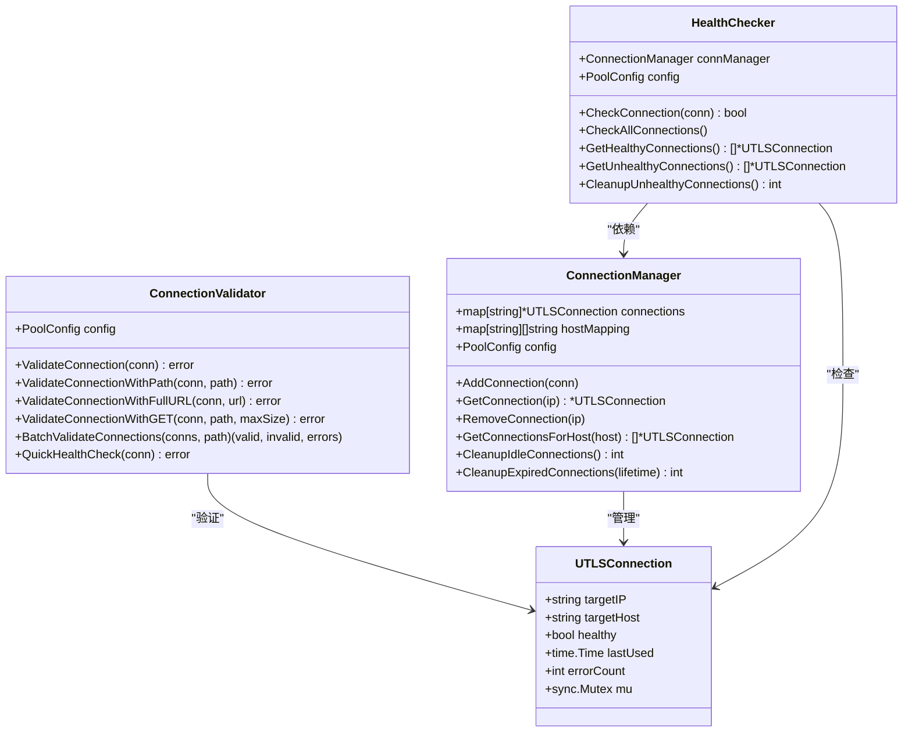
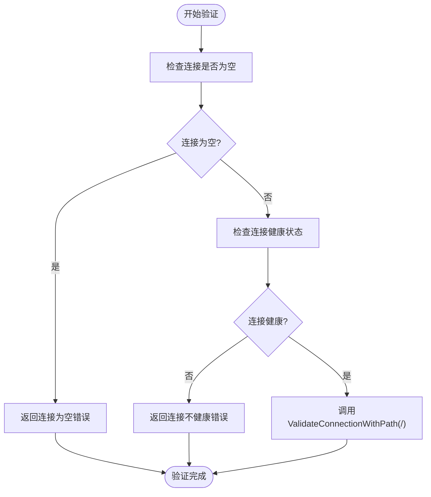
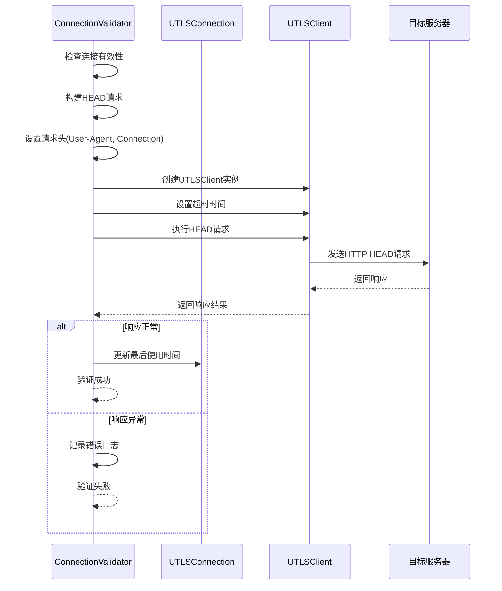
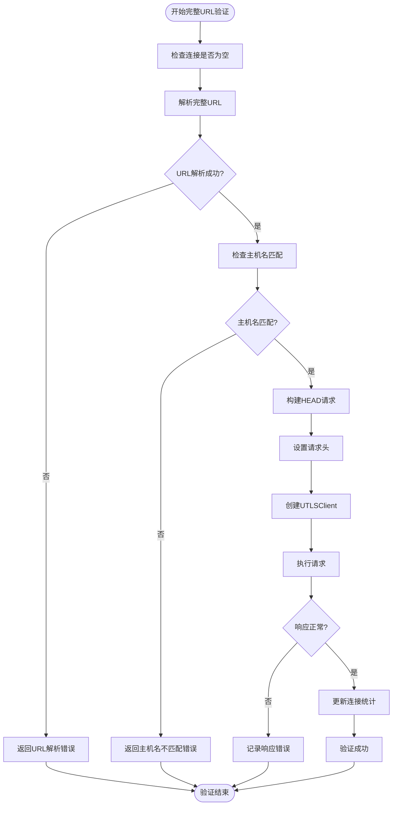
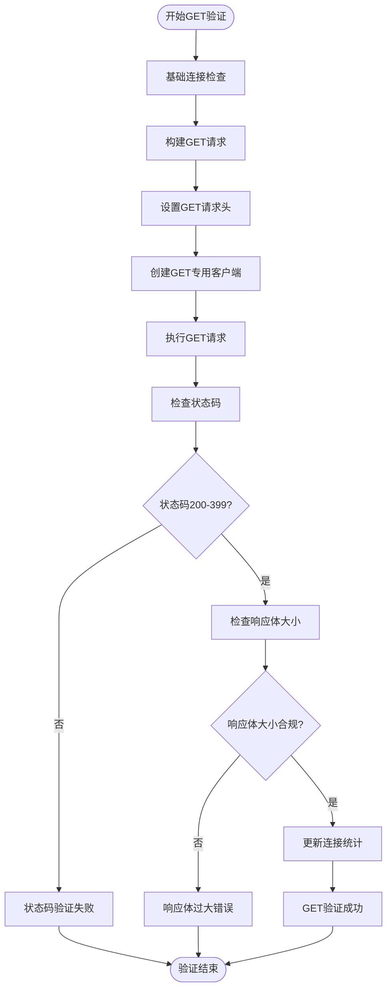
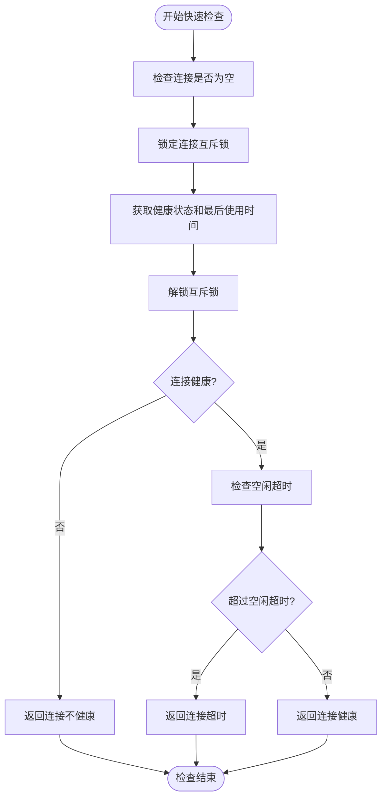
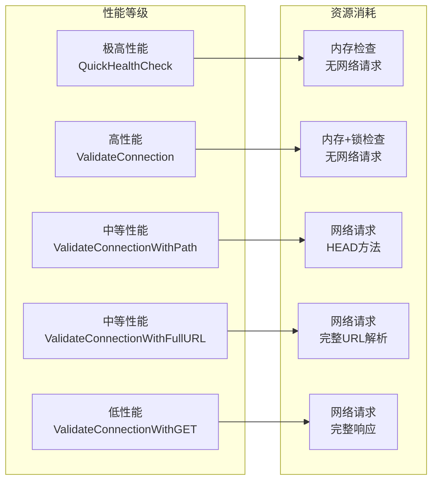
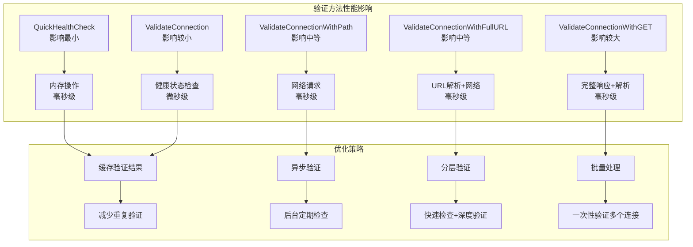
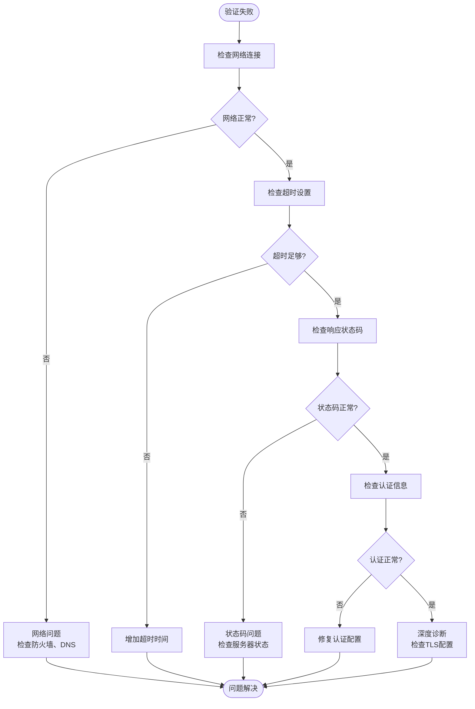

# 连接验证方法

<cite>
**本文档引用的文件**
- [connection_validator.go](file://utlsclient/connection_validator.go)
- [connection_manager.go](file://utlsclient/connection_manager.go)
- [health_checker.go](file://utlsclient/health_checker.go)
- [interfaces.go](file://utlsclient/interfaces.go)
- [constants.go](file://utlsclient/constants.go)
- [example_hotconnpool_usage.go](file://examples/utlsclient/example_hotconnpool_usage.go)
- [example_utlsclient_usage.go](file://examples/utlsclient/example_utlsclient_usage.go)
- [config.toml](file://config/config.toml)
</cite>

## 目录
1. [概述](#概述)
2. [连接验证架构](#连接验证架构)
3. [核心验证方法详解](#核心验证方法详解)
4. [验证方法对比分析](#验证方法对比分析)
5. [使用场景与最佳实践](#使用场景与最佳实践)
6. [性能优化策略](#性能优化策略)
7. [故障排除指南](#故障排除指南)
8. [总结](#总结)

## 概述

连接验证方法是UTLSHotConnPool连接池系统中的核心组件，负责确保连接的可用性和可靠性。该系统提供了多种验证级别，从基础的健康检查到严格的完整内容验证，满足不同场景下的需求。

### 验证方法分类

系统包含以下主要验证方法：
- **基础验证**：`ValidateConnection` - 快速健康检查
- **路径验证**：`ValidateConnectionWithPath` - 特定资源可用性检测
- **完整URL验证**：`ValidateConnectionWithFullURL` - 精确主机匹配验证
- **GET请求验证**：`ValidateConnectionWithGET` - 严格的内容验证
- **快速健康检查**：`QuickHealthCheck` - 仅检查连接状态

## 连接验证架构



**图表来源**
- [connection_validator.go](file://utlsclient/connection_validator.go#L10-L20)
- [connection_manager.go](file://utlsclient/connection_manager.go#L8-L15)
- [health_checker.go](file://utlsclient/health_checker.go#L9-L14)

**章节来源**
- [connection_validator.go](file://utlsclient/connection_validator.go#L1-L263)
- [connection_manager.go](file://utlsclient/connection_manager.go#L1-L218)
- [health_checker.go](file://utlsclient/health_checker.go#L1-L165)

## 核心验证方法详解

### ValidateConnection - 基础健康验证

这是最简单的验证方法，主要用于快速检查连接的基本健康状态。

#### 实现机制


**图表来源**
- [connection_validator.go](file://utlsclient/connection_validator.go#L22-L39)

#### 关键特性
- **轻量级**：仅检查连接的健康标志位
- **快速执行**：无需网络请求，直接返回结果
- **适用场景**：连接池初始化、简单健康检查

**章节来源**
- [connection_validator.go](file://utlsclient/connection_validator.go#L22-L39)

### ValidateConnectionWithPath - 路径验证

此方法验证连接对特定路径的访问能力，是最常用的验证方式。

#### 实现机制


**图表来源**
- [connection_validator.go](file://utlsclient/connection_validator.go#L41-L96)

#### 请求特性
- **请求方法**：HEAD（仅获取响应头）
- **请求头设置**：
  - `User-Agent`: "UTLSHotConnPool/1.0 HealthCheck"
  - `Connection`: "keep-alive"
- **超时控制**：使用配置的连接超时时间
- **响应验证**：状态码范围200-399

**章节来源**
- [connection_validator.go](file://utlsclient/connection_validator.go#L41-L96)

### ValidateConnectionWithFullURL - 完整URL验证

该方法验证连接对完整URL的访问能力，确保主机名匹配且路径可访问。

#### 实现流程


**图表来源**
- [connection_validator.go](file://utlsclient/connection_validator.go#L99-L158)

#### 特殊要求
- **主机名验证**：必须与连接的目标主机完全匹配
- **URL解析**：支持完整的HTTP/HTTPS URL格式
- **请求头**：使用专用的User-Agent标识

**章节来源**
- [connection_validator.go](file://utlsclient/connection_validator.go#L99-L158)

### ValidateConnectionWithGET - GET请求验证

这是最严格的验证方法，不仅检查路径可用性，还验证响应内容的完整性。

#### 验证步骤


**图表来源**
- [connection_validator.go](file://utlsclient/connection_validator.go#L161-L222)

#### 严格验证特性
- **请求方法**：GET（获取完整响应）
- **响应体限制**：可配置的最大响应体大小
- **内容验证**：确保响应内容符合预期大小
- **请求头**：专用的User-Agent标识

**章节来源**
- [connection_validator.go](file://utlsclient/connection_validator.go#L161-L222)

### QuickHealthCheck - 快速健康检查

这是一个特殊的验证方法，不发送网络请求，仅检查连接的基本状态。

#### 检查逻辑


**图表来源**
- [connection_validator.go](file://utlsclient/connection_validator.go#L241-L262)

#### 性能优势
- **零网络开销**：不发送任何网络请求
- **内存检查**：仅检查内存中的状态信息
- **快速执行**：适用于高频调用场景

**章节来源**
- [connection_validator.go](file://utlsclient/connection_validator.go#L241-L262)

## 验证方法对比分析

### 功能对比表

| 验证方法 | 请求类型 | 主机名验证 | 响应体检查 | 性能等级 | 适用场景 |
|---------|---------|-----------|-----------|---------|---------|
| ValidateConnection | 无 | 否 | 否 | 极高 | 连接池初始化 |
| ValidateConnectionWithPath | HEAD | 否 | 否 | 高 | 通用路径验证 |
| ValidateConnectionWithFullURL | HEAD | 是 | 否 | 中 | 完整URL验证 |
| ValidateConnectionWithGET | GET | 否 | 是 | 中 | 严格内容验证 |
| QuickHealthCheck | 无 | 否 | 否 | 极高 | 频繁状态检查 |

### 性能特征对比



### 适用场景矩阵

| 场景需求 | 推荐方法 | 备选方法 | 不推荐方法 |
|---------|---------|---------|-----------|
| 连接池启动 | ValidateConnection | QuickHealthCheck | ValidateConnectionWithGET |
| API健康检查 | ValidateConnectionWithPath | ValidateConnection | QuickHealthCheck |
| 路径可用性验证 | ValidateConnectionWithPath | ValidateConnectionWithFullURL | ValidateConnectionWithGET |
| 内容完整性验证 | ValidateConnectionWithGET | ValidateConnectionWithPath | ValidateConnection |
| 频繁状态查询 | QuickHealthCheck | ValidateConnection | ValidateConnectionWithPath |
| 完整URL验证 | ValidateConnectionWithFullURL | ValidateConnectionWithPath | ValidateConnectionWithGET |

## 使用场景与最佳实践

### 基础验证场景

#### 连接池初始化验证
```go
// 在连接池启动时使用基础验证
validator := NewConnectionValidator(poolConfig)
for _, conn := range initialConnections {
    if err := validator.ValidateConnection(conn); err != nil {
        // 处理无效连接
        continue
    }
    // 添加有效连接到池
    connectionManager.AddConnection(conn)
}
```

#### 健康检查周期
```go
// 定期执行健康检查
func periodicHealthCheck() {
    for _, conn := range connectionManager.GetAllConnections() {
        if err := validator.QuickHealthCheck(conn); err != nil {
            // 标记为不健康
            conn.MarkUnhealthy()
        }
    }
}
```

### 路径验证场景

#### API端点验证
```go
// 验证特定API端点的可用性
func validateAPIEndpoint(endpoint string) bool {
    conn, err := pool.GetConnection(targetHost)
    if err != nil {
        return false
    }
    defer pool.PutConnection(conn)
    
    err = validator.ValidateConnectionWithPath(conn, endpoint)
    return err == nil
}
```

#### 批量验证
```go
// 批量验证多个连接
func validateMultipleEndpoints(endpoints []string) {
    connections := connectionManager.GetConnectionsForHost(targetHost)
    valid, invalid, errors := validator.BatchValidateConnections(
        connections, 
        "/health"
    )
    
    log.Printf("验证结果: 有效连接=%d, 无效连接=%d", valid, invalid)
}
```

### 完整URL验证场景

#### 复杂URL验证
```go
// 验证包含查询参数的完整URL
func validateComplexURL(fullURL string) bool {
    conn, err := pool.GetConnectionForURL(fullURL)
    if err != nil {
        return false
    }
    defer pool.PutConnection(conn)
    
    return validator.ValidateConnectionWithFullURL(conn, fullURL) == nil
}
```

### GET请求验证场景

#### 内容完整性验证
```go
// 验证响应内容的完整性
func validateContentIntegrity(url string, maxBytes int64) bool {
    conn, err := pool.GetConnection(getHostFromURL(url))
    if err != nil {
        return false
    }
    defer pool.PutConnection(conn)
    
    return validator.ValidateConnectionWithGET(conn, getPathFromURL(url), maxBytes) == nil
}
```

**章节来源**
- [example_hotconnpool_usage.go](file://examples/utlsclient/example_hotconnpool_usage.go#L84-L116)
- [example_utlsclient_usage.go](file://examples/utlsclient/example_utlsclient_usage.go#L56-L93)

## 性能优化策略

### 连接池性能影响分析



### 具体优化措施

#### 1. 缓存验证结果
```go
type ValidationCache struct {
    cache map[string]bool
    mu    sync.RWMutex
}

func (vc *ValidationCache) IsValid(path string) bool {
    vc.mu.RLock()
    defer vc.mu.RUnlock()
    return vc.cache[path]
}

func (vc *ValidationCache) SetValid(path string, valid bool) {
    vc.mu.Lock()
    defer vc.mu.Unlock()
    vc.cache[path] = valid
}
```

#### 2. 异步健康检查
```go
func startAsyncHealthCheck(validator *ConnectionValidator, interval time.Duration) {
    ticker := time.NewTicker(interval)
    go func() {
        for range ticker.C {
            connections := connectionManager.GetAllConnections()
            for _, conn := range connections {
                go func(c *UTLSConnection) {
                    if err := validator.QuickHealthCheck(c); err != nil {
                        c.MarkUnhealthy()
                    }
                }(conn)
            }
        }
    }()
}
```

#### 3. 分层验证策略
```go
func layeredValidation(validator *ConnectionValidator, conn *UTLSConnection, path string) error {
    // 第一层：快速检查
    if err := validator.QuickHealthCheck(conn); err != nil {
        return err
    }
    
    // 第二层：路径验证
    if err := validator.ValidateConnectionWithPath(conn, path); err != nil {
        return err
    }
    
    // 第三层：严格验证（可选）
    if shouldPerformStrictValidation(path) {
        return validator.ValidateConnectionWithGET(conn, path, 1024*1024) // 1MB限制
    }
    
    return nil
}
```

#### 4. 批量验证优化
```go
func optimizedBatchValidation(validator *ConnectionValidator, connections []*UTLSConnection, path string) {
    // 并发验证
    var wg sync.WaitGroup
    results := make(chan error, len(connections))
    
    for _, conn := range connections {
        wg.Add(1)
        go func(c *UTLSConnection) {
            defer wg.Done()
            err := validator.ValidateConnectionWithPath(c, path)
            results <- err
        }(conn)
    }
    
    wg.Wait()
    close(results)
    
    // 处理结果
    for err := range results {
        if err != nil {
            // 处理验证失败的连接
        }
    }
}
```

### 配置优化建议

#### 连接超时配置
```toml
[pool]
# 基础验证超时
conn_timeout = 30  # 秒

# 健康检查专用超时（更短）
health_check_timeout = 10  # 秒

# 批量验证超时
batch_validation_timeout = 60  # 秒
```

#### 验证频率优化
```go
// 根据连接类型调整验证频率
var validationIntervals = map[string]time.Duration{
    "critical":  10 * time.Second,   // 关键服务：频繁验证
    "important": 30 * time.Second,   // 重要服务：中等频率
    "normal":    60 * time.Second,   // 普通服务：较低频率
    "backup":    120 * time.Second,  // 备用服务：最少频率
}
```

## 故障排除指南

### 常见问题诊断

#### 1. 连接验证失败

**症状**：验证方法返回连接验证失败错误

**诊断步骤**：


#### 2. 性能问题排查

**症状**：验证方法执行缓慢

**排查清单**：
- [ ] 检查网络延迟
- [ ] 验证超时设置是否合理
- [ ] 检查并发连接数
- [ ] 监控CPU和内存使用
- [ ] 分析网络包大小

#### 3. 内存泄漏检测

**监控指标**：
```go
func monitorMemoryUsage() {
    for {
        memStats := &runtime.MemStats{}
        runtime.ReadMemStats(memStats)
        
        log.Printf("内存使用: Alloc=%d MB, Sys=%d MB, GC=%d",
            memStats.Alloc/1024/1024,
            memStats.Sys/1024/1024,
            memStats.NumGC)
        
        time.Sleep(30 * time.Second)
    }
}
```

### 错误处理最佳实践

#### 1. 优雅降级
```go
func robustValidation(validator *ConnectionValidator, conn *UTLSConnection, path string) error {
    // 尝试严格验证
    err := validator.ValidateConnectionWithGET(conn, path, 1024*1024)
    if err == nil {
        return nil
    }
    
    // 回退到路径验证
    log.Printf("GET验证失败，回退到路径验证: %v", err)
    err = validator.ValidateConnectionWithPath(conn, path)
    if err == nil {
        return nil
    }
    
    // 最后尝试基础验证
    log.Printf("路径验证失败，尝试基础验证: %v", err)
    return validator.ValidateConnection(conn)
}
```

#### 2. 重试机制
```go
func retryValidation(validator *ConnectionValidator, conn *UTLSConnection, path string, maxRetries int) error {
    var lastErr error
    
    for i := 0; i < maxRetries; i++ {
        err := validator.ValidateConnectionWithPath(conn, path)
        if err == nil {
            return nil
        }
        
        lastErr = err
        time.Sleep(time.Duration(i+1) * time.Second) // 指数退避
    }
    
    return fmt.Errorf("验证失败，重试%d次后仍然失败: %v", maxRetries, lastErr)
}
```

**章节来源**
- [constants.go](file://utlsclient/constants.go#L47-L85)
- [health_checker.go](file://utlsclient/health_checker.go#L23-L61)

## 总结

UTLSHotConnPool的连接验证方法体系提供了从基础健康检查到严格内容验证的完整解决方案。通过合理选择和组合不同的验证方法，可以在保证连接质量的同时最大化系统性能。

### 关键要点

1. **方法选择**：根据具体需求选择合适的验证方法，平衡验证强度和性能开销
2. **性能优化**：采用缓存、异步、分层等策略优化验证性能
3. **故障处理**：建立完善的错误处理和降级机制
4. **监控告警**：实施全面的监控和告警机制

### 最佳实践总结

- **连接池启动**：使用`ValidateConnection`进行基础验证
- **日常维护**：定期执行`ValidateConnectionWithPath`进行路径验证
- **关键服务**：对重要服务使用`ValidateConnectionWithGET`进行严格验证
- **高频检查**：使用`QuickHealthCheck`进行快速状态检查
- **批量操作**：利用`BatchValidateConnections`提高效率

通过遵循这些指导原则和最佳实践，可以构建一个高效、可靠的连接验证体系，确保系统的稳定运行和服务质量。