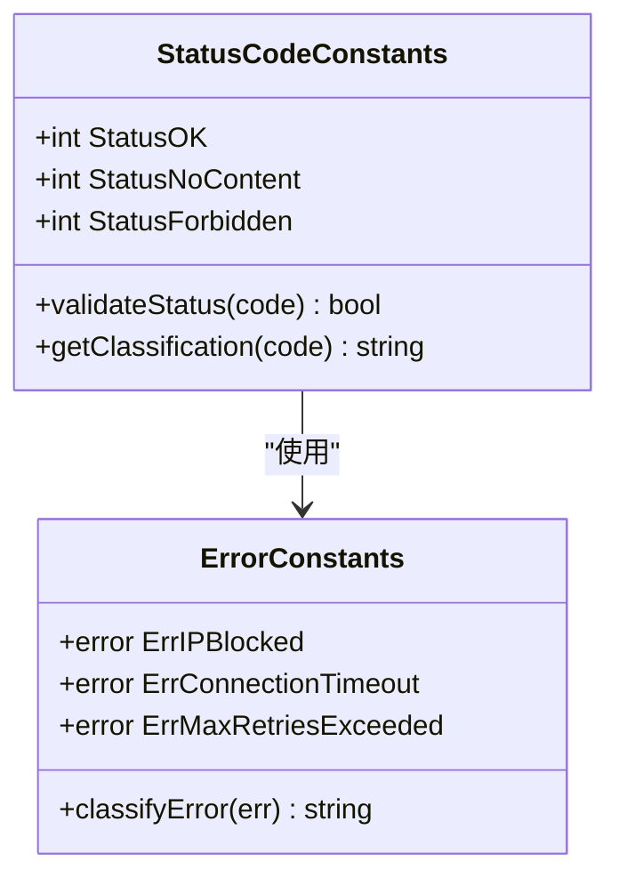
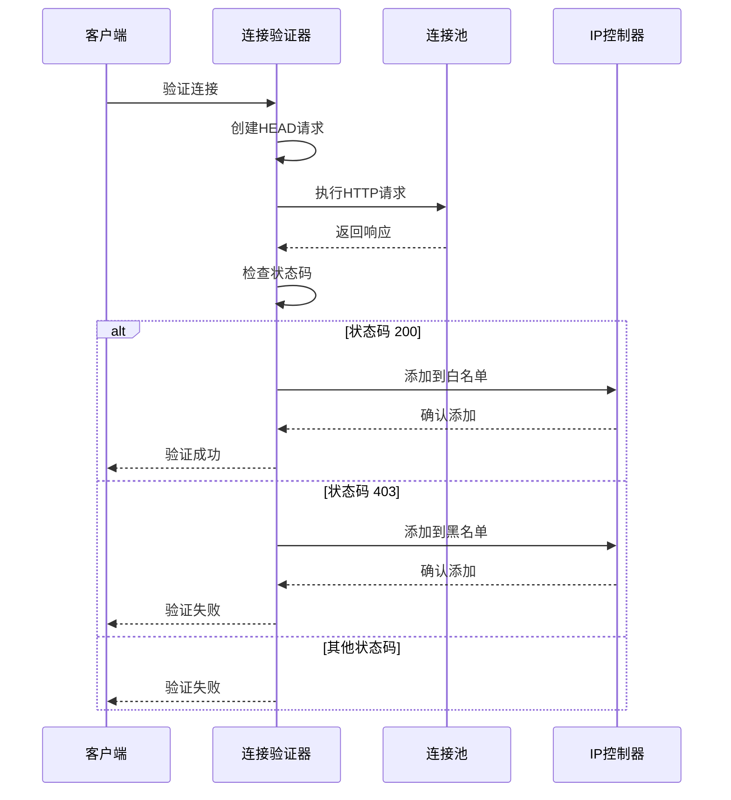
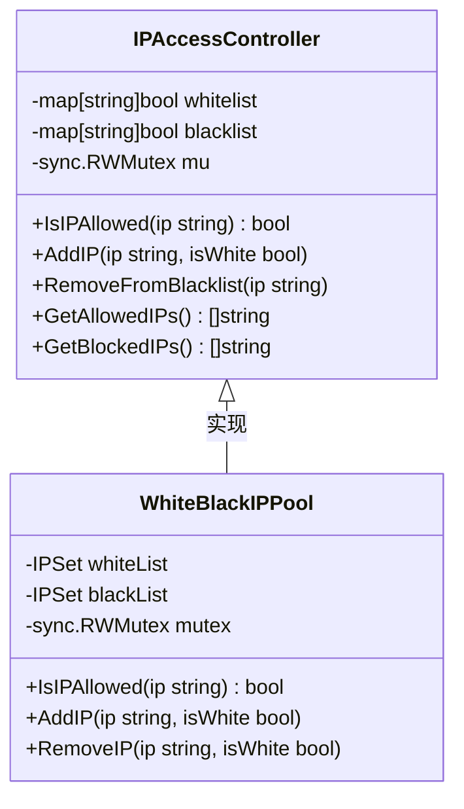
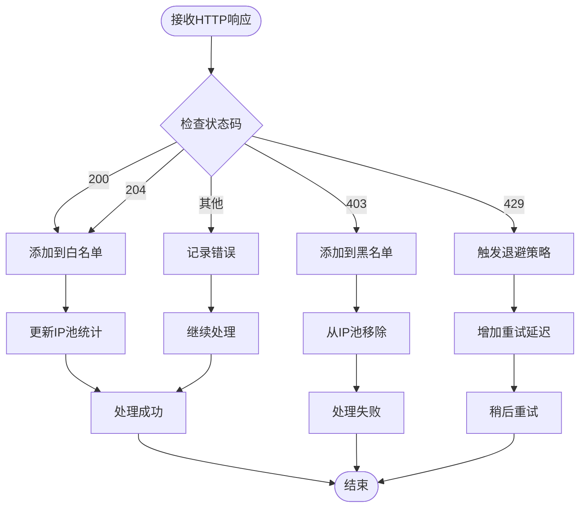
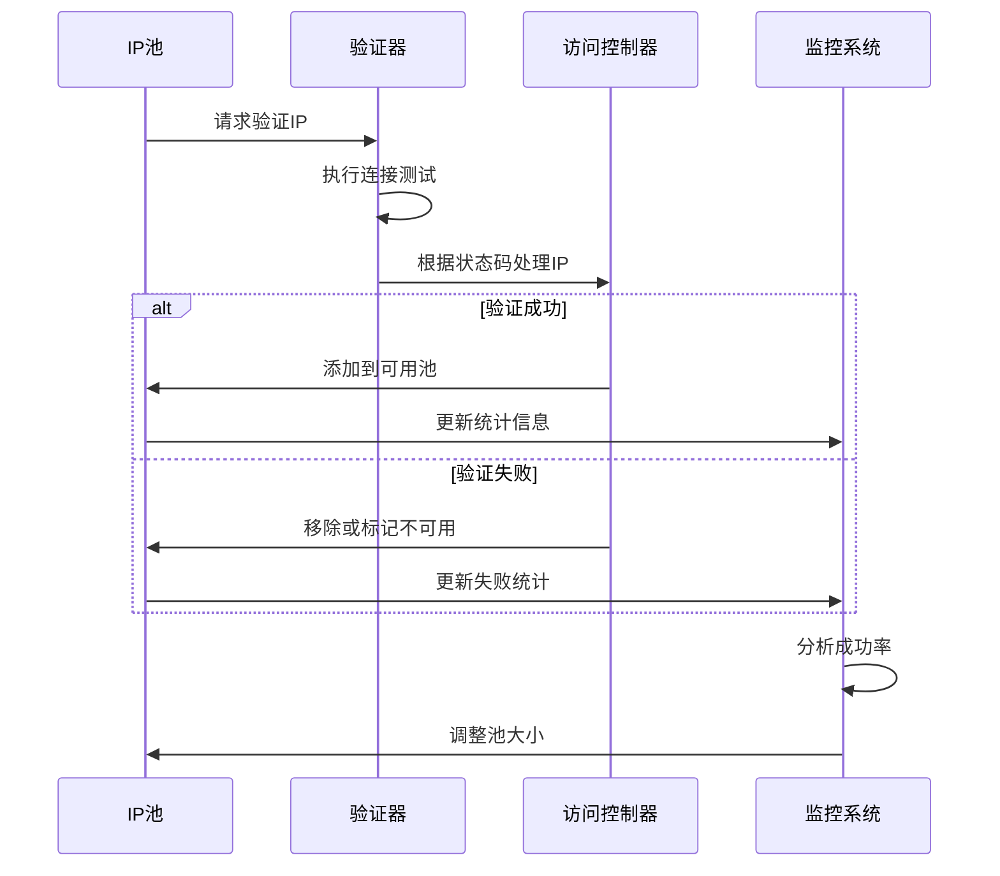

# 状态码处理策略

<cite>
**本文档引用的文件**
- [connection_validator.go](file://utlsclient/connection_validator.go)
- [ip_access_controller.go](file://utlsclient/ip_access_controller.go)
- [whiteblackippool.go](file://remotedomainippool/whiteblackippool.go)
- [constants.go](file://utlsclient/constants.go)
- [connection_helpers.go](file://utlsclient/connection_helpers.go)
- [utlshotconnpool.go](file://utlsclient/utlshotconnpool.go)
- [logger.go](file://utlsclient/logger.go)
- [ip_access_controller_test.go](file://test/utlsclient/ip_access_controller_test.go)
</cite>

## 目录
1. [概述](#概述)
2. [状态码常量定义](#状态码常量定义)
3. [连接验证机制](#连接验证机制)
4. [IP访问控制器架构](#ip访问控制器架构)
5. [状态码处理策略](#状态码处理策略)
6. [错误分类与日志记录](#错误分类与日志记录)
7. [IP池优化机制](#ip池优化机制)
8. [性能考虑](#性能考虑)
9. [故障排除指南](#故障排除指南)
10. [最佳实践建议](#最佳实践建议)

## 概述

本系统实现了一套完整的HTTP状态码处理机制，专门用于爬虫平台的连接验证和IP访问控制。该机制能够智能识别不同HTTP状态码，根据业务逻辑采取相应的处理策略，包括将IP加入白名单、黑名单，以及触发退避策略等。

核心功能包括：
- **状态码识别**：准确识别200（成功）、403（禁止访问）、429（请求过多）等关键状态码
- **动态访问控制**：基于状态码结果动态调整IP访问权限
- **智能退避策略**：针对不同状态码实施差异化重试机制
- **实时监控**：提供详细的连接状态和错误日志记录

## 状态码常量定义

系统定义了关键的HTTP状态码常量，确保代码的一致性和可维护性。



**图表来源**
- [constants.go](file://utlsclient/constants.go#L18-L25)

### 核心状态码定义

| 状态码 | 常量名 | 含义 | 处理策略 |
|--------|--------|------|----------|
| 200 | StatusOK | 请求成功 | IP加入白名单，标记为可信 |
| 204 | StatusNoContent | 无内容返回 | 类似200处理，但内容为空 |
| 403 | StatusForbidden | 禁止访问 | IP加入黑名单，标记为不可信 |

**节来源**
- [constants.go](file://utlsclient/constants.go#L18-L25)

## 连接验证机制

连接验证是状态码处理的核心环节，系统提供了多种验证级别和策略。



**图表来源**
- [connection_validator.go](file://utlsclient/connection_validator.go#L41-L96)
- [utlshotconnpool.go](file://utlsclient/utlshotconnpool.go#L618-L743)

### 验证流程详解

系统支持三种验证级别：

1. **基础验证** (`ValidateConnection`)：使用根路径`/`进行简单验证
2. **路径验证** (`ValidateConnectionWithPath`)：针对特定路径进行验证
3. **严格验证** (`ValidateConnectionWithGET`)：使用GET请求进行完整验证

每种验证都包含状态码检查和相应的业务逻辑处理。

**节来源**
- [connection_validator.go](file://utlsclient/connection_validator.go#L22-L263)

## IP访问控制器架构

IP访问控制器采用双列表设计，支持高效的并发访问控制。



**图表来源**
- [ip_access_controller.go](file://utlsclient/ip_access_controller.go#L7-L184)
- [whiteblackippool.go](file://remotedomainippool/whiteblackippool.go#L30-L127)

### 访问控制策略

系统采用"黑名单优先，白名单其次，默认拒绝"的三层访问控制策略：

1. **黑名单优先**：任何在黑名单中的IP都被立即拒绝
2. **白名单优先**：在白名单中的IP被允许访问
3. **默认拒绝**：不在任何列表中的IP被拒绝访问

这种设计确保了系统的安全性，同时提供了灵活的访问控制能力。

**节来源**
- [ip_access_controller.go](file://utlsclient/ip_access_controller.go#L22-L42)
- [whiteblackippool.go](file://remotedomainippool/whiteblackippool.go#L76-L99)

## 状态码处理策略

系统针对不同的HTTP状态码实现了差异化的处理策略，确保最优的资源利用和用户体验。



**图表来源**
- [utlshotconnpool.go](file://utlsclient/utlshotconnpool.go#L725-L743)
- [connection_helpers.go](file://utlsclient/connection_helpers.go#L76-L81)

### 关键状态码处理逻辑

#### 200（成功）状态码处理
当收到200状态码时，系统执行以下操作：
- 将IP地址添加到白名单
- 标记连接为健康状态
- 更新连接最后使用时间
- 记录成功日志和统计数据

#### 403（禁止访问）状态码处理  
当收到403状态码时，系统执行以下操作：
- 将IP地址添加到黑名单
- 标记连接为不健康状态
- 记录错误日志并返回特定错误
- 从连接池中移除该连接

#### 429（请求过多）状态码处理
虽然代码中未显式处理429状态码，但系统通过以下机制应对：
- 实现指数退避算法
- 动态调整重试间隔
- 监控连接成功率
- 在必要时暂停IP使用

**节来源**
- [utlshotconnpool.go](file://utlsclient/utlshotconnpool.go#L725-L743)
- [connection_helpers.go](file://utlsclient/connection_helpers.go#L76-L81)

## 错误分类与日志记录

系统实现了完善的错误分类和日志记录机制，便于问题诊断和系统监控。

```mermaid
classDiagram
class LoggerSystem {
+Debug(format string, args ...interface{})
+Info(format string, args ...interface{})
+Warn(format string, args ...interface{})
+Error(format string, args ...interface{})
+SetGlobalLogger(logger Logger)
}
class ErrorClassification {
+ErrIPBlocked error
+ErrConnectionTimeout error
+ErrMaxRetriesExceeded error
+ErrConnectionUnhealthy error
+classifyError(error) string
}
class StatusBasedLogging {
+logStatusResponse(code int, ip string)
+logConnectionFailure(err error, ip string)
+logAccessControlAction(action string, ip string)
}
LoggerSystem --> ErrorClassification : "使用"
LoggerSystem --> StatusBasedLogging : "使用"
```

**图表来源**
- [logger.go](file://utlsclient/logger.go#L1-13)
- [constants.go](file://utlsclient/constants.go#L60-L84)

### 日志级别和用途

| 日志级别 | 用途 | 示例场景 |
|----------|------|----------|
| Debug | 详细调试信息 | IP访问决策过程 |
| Info | 一般信息记录 | 新连接添加到白名单 |
| Warn | 警告信息 | 连接超时但未失败 |
| Error | 错误信息 | IP被加入黑名单 |

### 错误类型分类

系统定义了多种特定的错误类型，便于错误处理和恢复：

- **ErrIPBlocked**：IP被封禁，需要加入黑名单
- **ErrConnectionTimeout**：连接超时，需要重试或放弃
- **ErrMaxRetriesExceeded**：超过最大重试次数
- **ErrConnectionUnhealthy**：连接不健康，需要重新验证

**节来源**
- [constants.go](file://utlsclient/constants.go#L60-L84)
- [logger.go](file://utlsclient/logger.go#L9-13)

## IP池优化机制

状态码处理与IP池管理系统深度集成，通过状态码反馈优化IP池的可用性和效率。



**图表来源**
- [utlshotconnpool.go](file://utlsclient/utlshotconnpool.go#L746-L758)
- [connection_helpers.go](file://utlsclient/connection_helpers.go#L178-L181)

### IP池动态调整

系统根据状态码反馈动态调整IP池：

1. **成功率监控**：持续监控IP的成功访问率
2. **自动清理**：定期清理失败率过高的IP
3. **容量调节**：根据可用IP数量动态调整池大小
4. **优先级排序**：按成功率对IP进行优先级排序

### 性能指标监控

系统跟踪以下关键性能指标：
- IP连接成功率
- 平均响应时间
- 连接超时率
- 黑名单命中率

**节来源**
- [utlshotconnpool.go](file://utlsclient/utlshotconnpool.go#L746-L758)

## 性能考虑

状态码处理机制在设计时充分考虑了性能因素，采用了多种优化策略。

### 并发安全设计
- 使用读写锁（RWMutex）提高并发性能
- 无锁数据结构减少竞争
- 原子操作保证数据一致性

### 内存优化
- IP地址使用字符串作为键，节省内存
- 及时清理失效连接
- 缓存热点IP的访问结果

### 网络优化
- 连接复用减少握手开销
- 批量验证提高吞吐量
- 异步处理避免阻塞

## 故障排除指南

### 常见问题及解决方案

#### 问题1：IP频繁被加入黑名单
**症状**：某个IP地址频繁被标记为不可信
**原因**：可能是该IP被目标服务器识别为爬虫
**解决方案**：
- 检查User-Agent设置
- 调整请求频率
- 使用代理IP池

#### 问题2：白名单IP无法访问
**症状**：白名单中的IP仍然被拒绝访问
**原因**：可能存在黑名单优先级问题
**解决方案**：
- 检查IP访问控制器的优先级设置
- 清空并重建访问控制列表

#### 问题3：连接验证失败
**症状**：连接验证总是失败
**原因**：网络连接或目标服务器问题
**解决方案**：
- 检查网络连通性
- 验证目标服务器状态
- 调整验证参数

### 监控和诊断工具

系统提供了丰富的监控和诊断功能：
- 实时访问控制统计
- 连接状态监控面板
- 错误日志分析工具
- 性能基准测试

## 最佳实践建议

### 配置建议
1. **合理的验证频率**：避免过于频繁的连接验证
2. **适当的超时设置**：根据网络环境调整超时时间
3. **平衡的池大小**：根据实际需求设置IP池大小

### 安全建议
1. **定期清理**：定期清理过期的IP记录
2. **监控异常**：密切监控异常状态码出现频率
3. **备份策略**：备份重要的访问控制配置

### 性能优化
1. **缓存策略**：合理使用缓存减少重复验证
2. **负载均衡**：在多个实例间共享访问控制状态
3. **异步处理**：使用异步方式处理非关键的验证任务

通过遵循这些最佳实践，可以最大化状态码处理机制的效果，确保爬虫平台的稳定运行和高效性能。