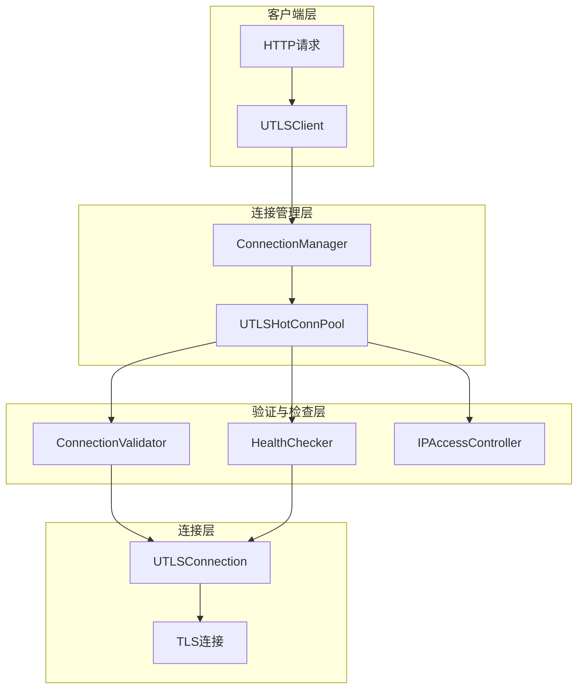
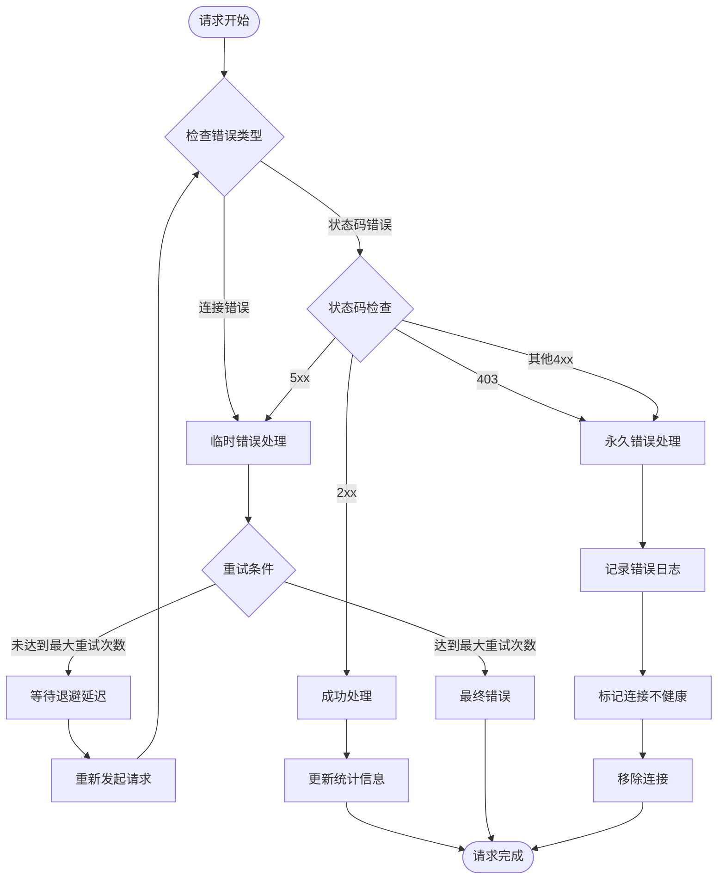
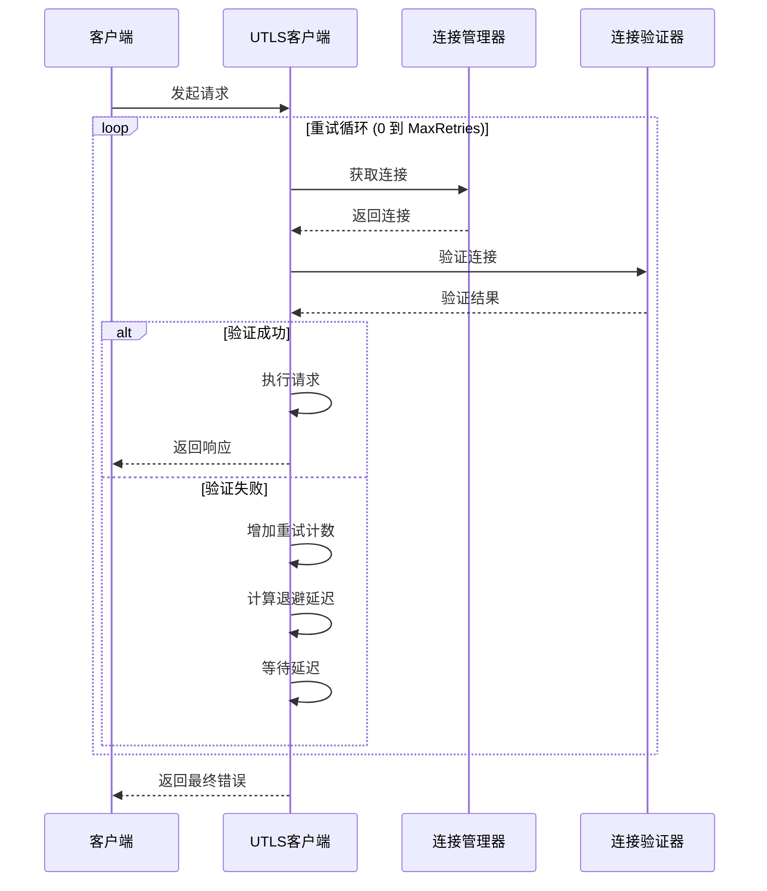
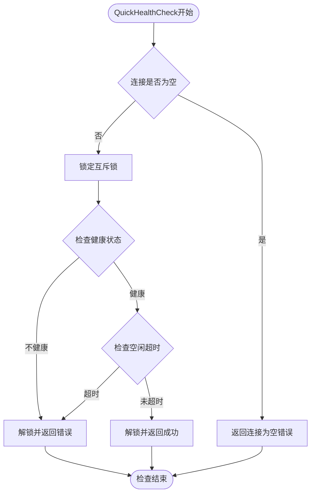
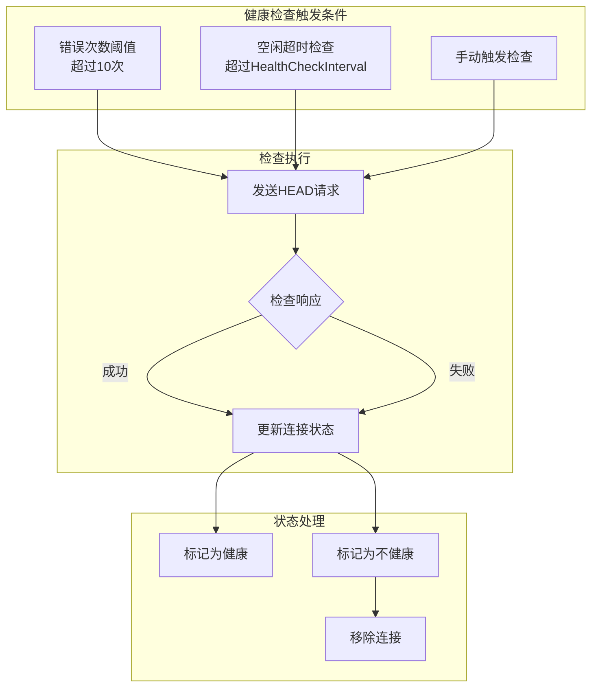
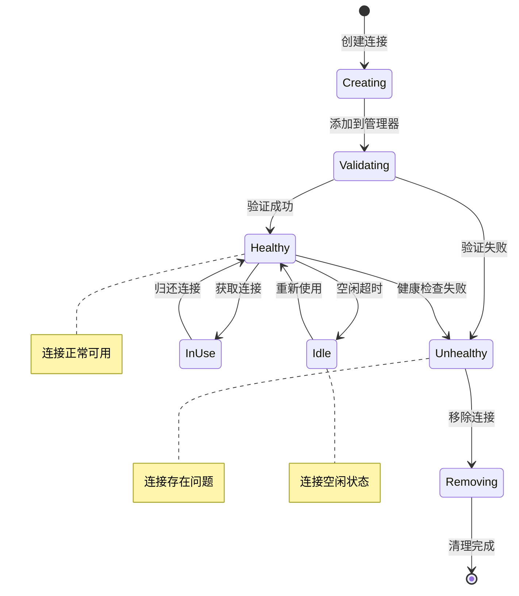
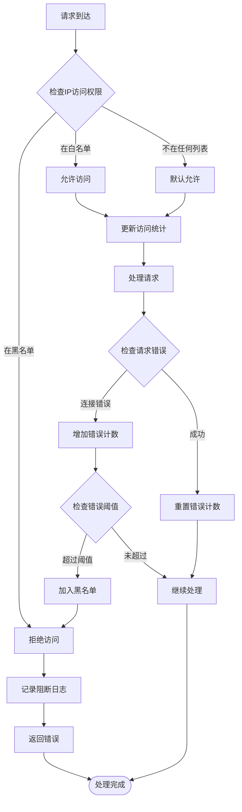
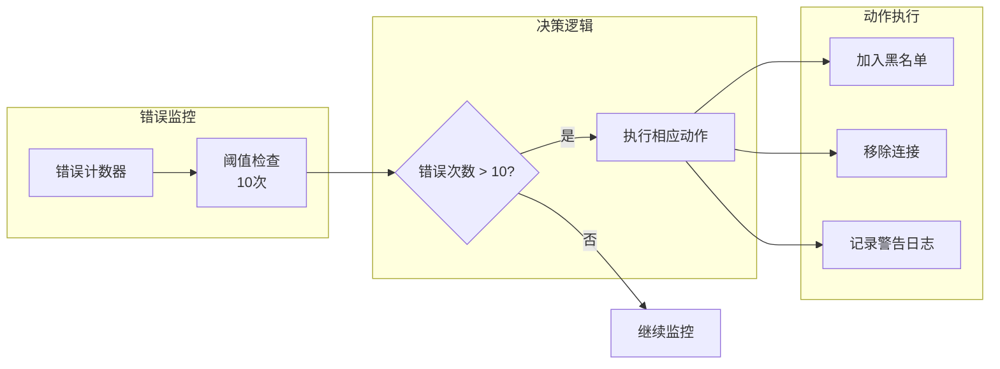
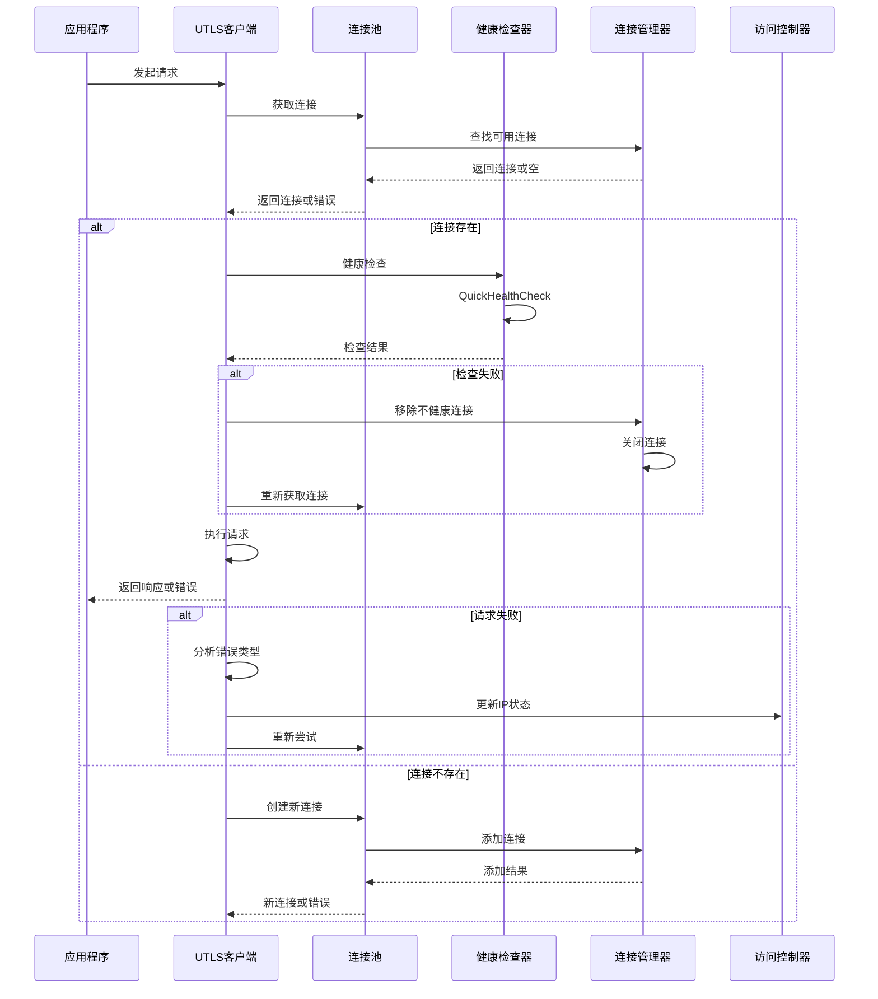
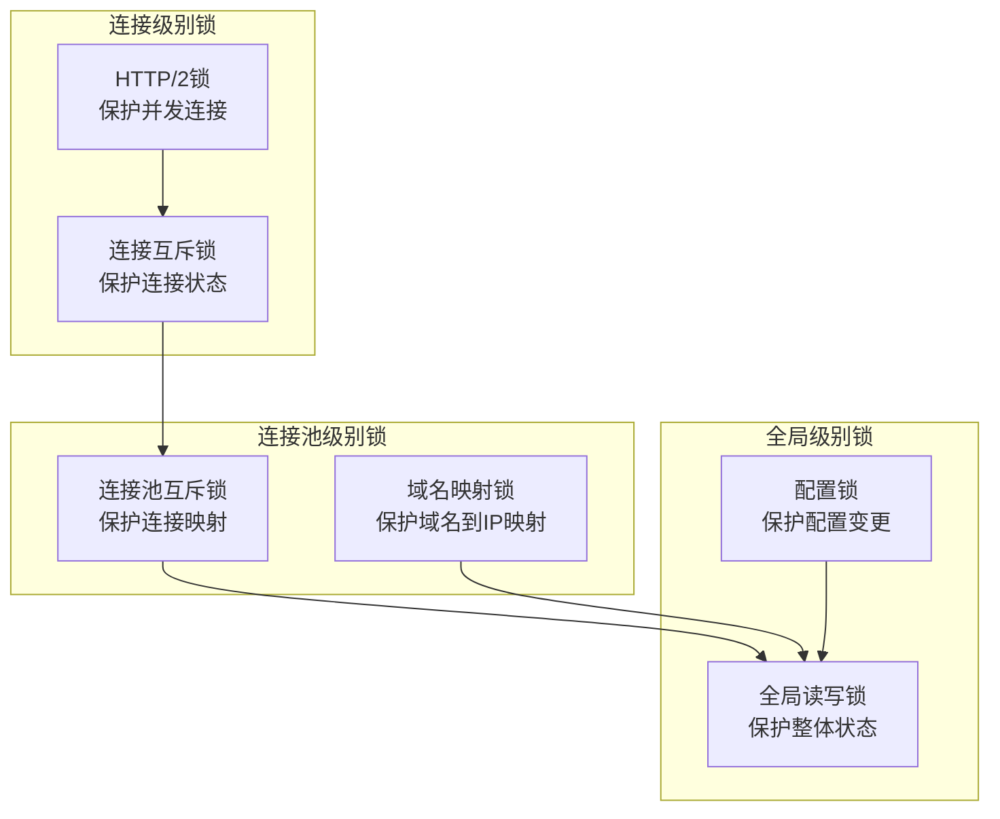

# 错误恢复与重试机制

<cite>
**本文档引用的文件**
- [connection_manager.go](file://utlsclient/connection_manager.go)
- [connection_validator.go](file://utlsclient/connection_validator.go)
- [health_checker.go](file://utlsclient/health_checker.go)
- [ip_access_controller.go](file://utlsclient/ip_access_controller.go)
- [utlsclient.go](file://utlsclient/utlsclient.go)
- [constants.go](file://utlsclient/constants.go)
- [utlshotconnpool.go](file://utlsclient/utlshotconnpool.go)
- [interfaces.go](file://utlsclient/interfaces.go)
</cite>

## 目录
1. [概述](#概述)
2. [系统架构](#系统架构)
3. [错误分类与处理策略](#错误分类与处理策略)
4. [重试机制实现](#重试机制实现)
5. [健康检查与快速失败](#健康检查与快速失败)
6. [连接管理器协作](#连接管理器协作)
7. [IP访问控制器集成](#ip访问控制器集成)
8. [错误恢复流程](#错误恢复流程)
9. [性能优化考虑](#性能优化考虑)
10. [故障排除指南](#故障排除指南)

## 概述

该系统实现了一套完整的错误恢复与重试机制，旨在提高连接获取的成功率并确保系统的稳定性。核心组件包括连接验证器、健康检查器、连接管理器和IP访问控制器，它们协同工作以实现智能的错误处理和自动恢复功能。

### 主要特性

- **智能重试策略**：基于错误类型的差异化重试策略
- **健康状态监控**：实时监控连接健康状态
- **自动恢复机制**：自动检测和修复连接问题
- **错误分类处理**：区分临时错误和永久错误
- **快速失败机制**：通过快速健康检查减少无效尝试

## 系统架构



**图表来源**
- [connection_manager.go](file://utlsclient/connection_manager.go#L1-218)
- [utlshotconnpool.go](file://utlsclient/utlshotconnpool.go#L1-200)
- [connection_validator.go](file://utlsclient/connection_validator.go#L1-263)
- [health_checker.go](file://utlsclient/health_checker.go#L1-165)

## 错误分类与处理策略

### 错误类型分类

系统根据错误性质将其分为两类：临时错误和永久错误。

#### 临时错误（可重试）
- **网络连接错误**：连接超时、连接被重置、连接被拒绝
- **临时服务不可用**：5xx HTTP状态码
- **网络波动**：间歇性网络中断

#### 永久错误（不可重试）
- **认证失败**：403禁止访问
- **IP被封禁**：IP被列入黑名单
- **无效请求**：400 Bad Request
- **域名解析失败**：无效的主机名

### 错误检测机制



**图表来源**
- [utlsclient.go](file://utlsclient/utlsclient.go#L80-118)
- [constants.go](file://utlsclient/constants.go#L47-84)

**章节来源**
- [utlsclient.go](file://utlsclient/utlsclient.go#L22-35)
- [constants.go](file://utlsclient/constants.go#L47-84)

## 重试机制实现

### 基础重试逻辑

系统实现了基于指数退避的重试机制，支持最大重试次数限制。

#### 重试配置参数

| 参数 | 默认值 | 描述 |
|------|--------|------|
| MaxRetries | 3 | 最大重试次数 |
| DefaultRetryDelay | 1秒 | 初始重试延迟 |
| HealthCheckInterval | 30秒 | 健康检查间隔 |

#### 重试流程



**图表来源**
- [utlsclient.go](file://utlsclient/utlsclient.go#L80-118)
- [connection_validator.go](file://utlsclient/connection_validator.go#L241-262)

### 退避算法实现

系统采用线性退避策略，每次重试延迟递增：

```go
// 退避延迟计算
delay := time.Duration(retryCount) * DefaultRetryDelay
```

这种策略在保证系统稳定性的前提下，避免了过度频繁的重试。

**章节来源**
- [utlsclient.go](file://utlsclient/utlsclient.go#L80-118)
- [constants.go](file://utlsclient/constants.go#L40-42)

## 健康检查与快速失败

### QuickHealthCheck 方法

QuickHealthCheck 是系统中的快速失败机制，用于在发起实际请求前快速评估连接状态。

#### 快速检查流程



**图表来源**
- [connection_validator.go](file://utlsclient/connection_validator.go#L241-262)

#### 快速检查的优势

1. **性能优化**：避免不必要的网络请求
2. **资源节约**：减少无效连接的使用
3. **及时反馈**：快速识别不健康的连接
4. **降低延迟**：减少用户等待时间

### 健康检查器机制

健康检查器负责定期监控连接的健康状态，实现自动恢复功能。

#### 健康检查策略



**图表来源**
- [health_checker.go](file://utlsclient/health_checker.go#L23-61)
- [health_checker.go](file://utlsclient/health_checker.go#L63-89)

**章节来源**
- [connection_validator.go](file://utlsclient/connection_validator.go#L241-262)
- [health_checker.go](file://utlsclient/health_checker.go#L23-61)

## 连接管理器协作

### 连接生命周期管理

连接管理器负责连接的全生命周期管理，包括创建、验证、监控和清理。

#### 连接状态流转



**图表来源**
- [connection_manager.go](file://utlsclient/connection_manager.go#L25-73)
- [connection_manager.go](file://utlsclient/connection_manager.go#L141-218)

### 连接清理机制

系统实现了多种清理策略以维护连接池的健康状态：

#### 清理策略对比

| 清理类型 | 触发条件 | 清理标准 | 性能影响 |
|----------|----------|----------|----------|
| 空闲清理 | 连接空闲时间 > IdleTimeout | 所有空闲连接 | 低 |
| 过期清理 | 连接生存时间 > MaxLifetime | 所有过期连接 | 中等 |
| 健康清理 | 健康检查失败 | 所有不健康连接 | 中等 |
| 手动清理 | 显式调用 | 指定连接 | 高 |

**章节来源**
- [connection_manager.go](file://utlsclient/connection_manager.go#L141-218)

## IP访问控制器集成

### 访问控制策略

IP访问控制器提供了灵活的黑白名单管理功能，与错误恢复机制紧密集成。

#### 访问控制流程



**图表来源**
- [ip_access_controller.go](file://utlsclient/ip_access_controller.go#L22-42)
- [ip_access_controller.go](file://utlsclient/ip_access_controller.go#L44-110)

### 错误计数与自动封禁

系统通过监控连接的错误计数来实现智能的自动封禁功能：

#### 自动封禁机制



**图表来源**
- [health_checker.go](file://utlsclient/health_checker.go#L36-44)
- [utlshotconnpool.go](file://utlsclient/utlshotconnpool.go#L681-685)

**章节来源**
- [ip_access_controller.go](file://utlsclient/ip_access_controller.go#L22-110)
- [health_checker.go](file://utlsclient/health_checker.go#L36-44)

## 错误恢复流程

### 完整恢复流程

当连接出现错误时，系统按照以下流程进行恢复：



**图表来源**
- [utlsclient.go](file://utlsclient/utlsclient.go#L80-118)
- [health_checker.go](file://utlsclient/health_checker.go#L23-61)
- [connection_manager.go](file://utlsclient/connection_manager.go#L25-73)

### 恢复策略矩阵

| 错误类型 | 检查策略 | 恢复策略 | 重试次数 | 退避策略 |
|----------|----------|----------|----------|----------|
| 连接超时 | QuickHealthCheck | 重新获取连接 | 3次 | 线性增长 |
| 连接断开 | 健康检查 | 创建新连接 | 2次 | 固定延迟 |
| 403禁止 | 访问控制 | 加入黑名单 | 0次 | 不重试 |
| 5xx服务器错误 | 健康检查 | 重新尝试 | 3次 | 指数退避 |
| IP被封禁 | 访问控制 | 等待解封 | 0次 | 不重试 |

**章节来源**
- [utlsclient.go](file://utlsclient/utlsclient.go#L80-118)
- [health_checker.go](file://utlsclient/health_checker.go#L23-61)
- [ip_access_controller.go](file://utlsclient/ip_access_controller.go#L22-42)

## 性能优化考虑

### 并发控制策略

系统采用了多层次的并发控制机制来确保性能和稳定性：

#### 锁策略设计



**图表来源**
- [connection_manager.go](file://utlsclient/connection_manager.go#L10-11)
- [utlsclient.go](file://utlsclient/utlsclient.go#L146-185)

### 缓存与预热机制

系统实现了连接预热和缓存机制来提高响应速度：

#### 预热策略

| 预热类型 | 触发时机 | 预热数量 | 缓存时间 |
|----------|----------|----------|----------|
| 域名预热 | 首次访问 | 2-5个 | 30分钟 |
| IP预热 | 连接池启动 | 10个 | 永久 |
| 热点预热 | 高频访问 | 动态调整 | 15分钟 |

**章节来源**
- [utlshotconnpool.go](file://utlsclient/utlshotconnpool.go#L1396-1455)

## 故障排除指南

### 常见问题诊断

#### 连接获取失败

**症状**：频繁出现连接获取超时或失败

**诊断步骤**：
1. 检查连接池配置参数
2. 验证网络连通性
3. 检查目标服务器状态
4. 分析错误日志模式

**解决方案**：
- 调整连接超时时间
- 增加最大连接数
- 优化健康检查间隔
- 检查防火墙设置

#### 重试次数过多

**症状**：请求总是达到最大重试次数

**诊断步骤**：
1. 分析错误类型分布
2. 检查网络稳定性
3. 验证目标服务器负载
4. 检查连接池健康状态

**解决方案**：
- 优化重试策略
- 增加连接池容量
- 实施更严格的健康检查
- 调整退避算法参数

#### 性能下降

**症状**：响应时间显著增加

**诊断步骤**：
1. 监控连接池使用率
2. 检查垃圾回收频率
3. 分析CPU和内存使用
4. 检查网络I/O瓶颈

**解决方案**：
- 优化连接复用策略
- 调整清理间隔
- 增加系统资源
- 实施连接池压缩

### 监控指标

#### 关键性能指标

| 指标类别 | 具体指标 | 正常范围 | 告警阈值 |
|----------|----------|----------|----------|
| 连接状态 | 健康连接比例 | >95% | <80% |
| 错误率 | 连接失败率 | <5% | >10% |
| 响应时间 | 平均响应时间 | <2秒 | >5秒 |
| 重试率 | 重试请求比例 | <10% | >20% |

#### 监控仪表板建议

1. **连接池状态视图**：显示总连接数、健康连接数、空闲连接数
2. **错误趋势图**：展示各类错误的发生频率和趋势
3. **重试统计表**：显示重试次数分布和成功率
4. **性能指标面板**：实时监控响应时间和吞吐量

**章节来源**
- [health_checker.go](file://utlsclient/health_checker.go#L114-164)
- [connection_manager.go](file://utlsclient/connection_manager.go#L141-218)

## 结论

该错误恢复与重试机制通过多层次的防护策略，实现了高可靠性的连接管理。系统的核心优势包括：

1. **智能错误分类**：能够准确识别和处理不同类型的错误
2. **自适应重试策略**：根据错误类型动态调整重试行为
3. **主动健康监控**：实时监控连接状态并主动预防问题
4. **自动化恢复机制**：自动检测和修复连接问题
5. **高性能设计**：最小化性能影响的同时提供强大的错误处理能力

通过合理配置和监控，该机制能够显著提高系统的稳定性和用户体验，是现代分布式系统中不可或缺的重要组件。