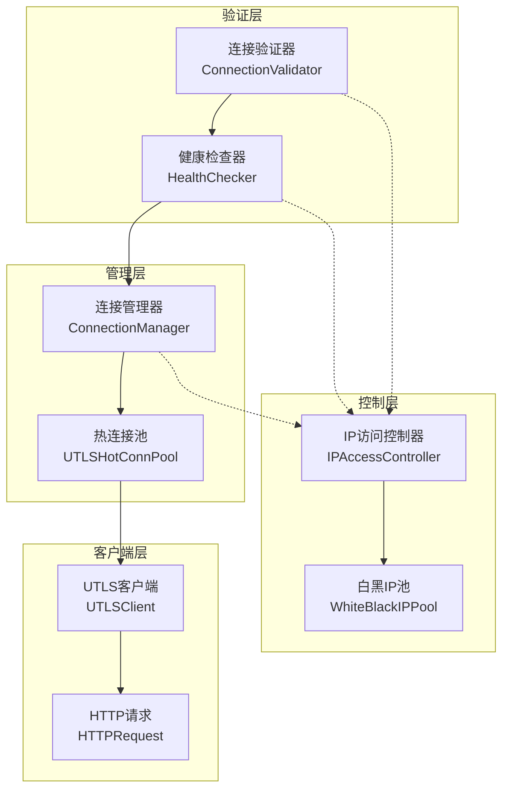
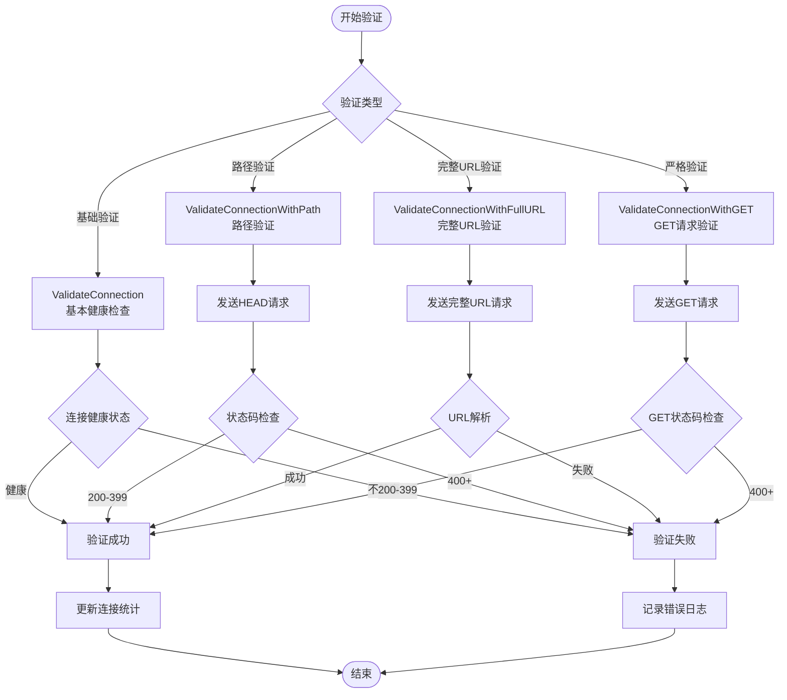
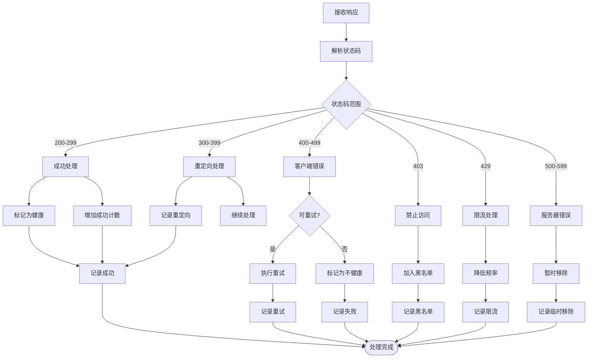
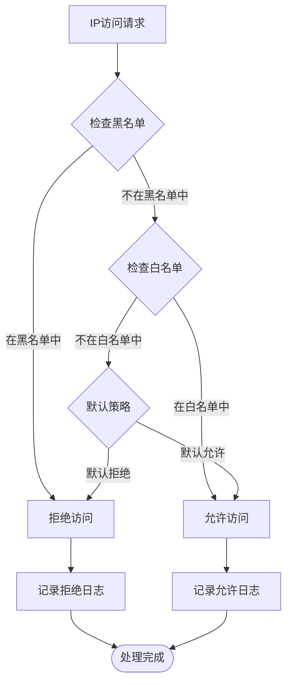
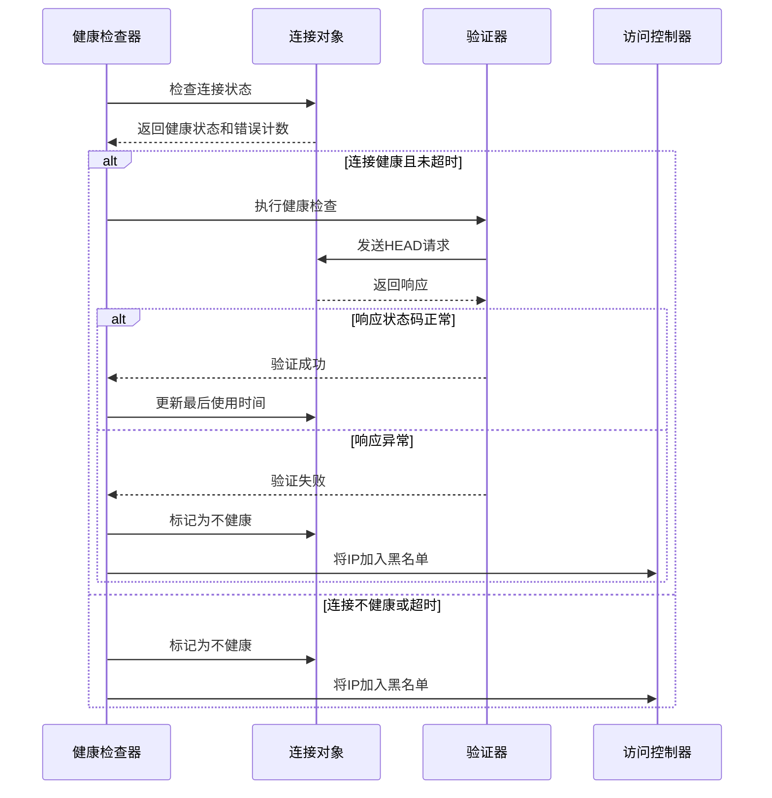
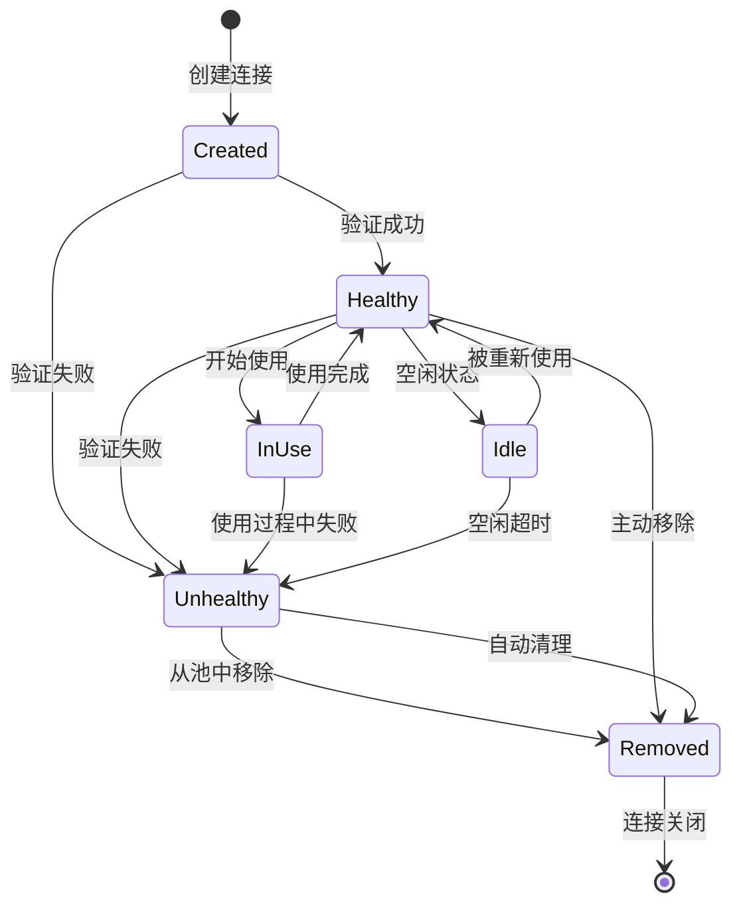
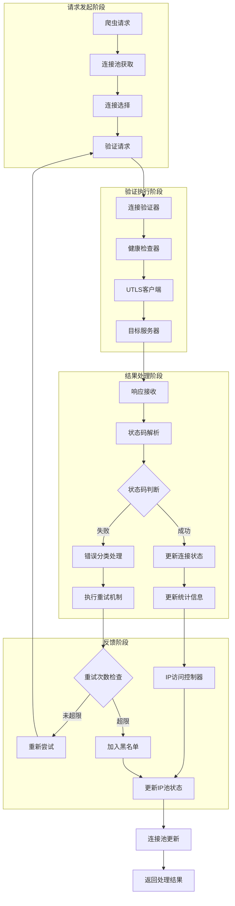
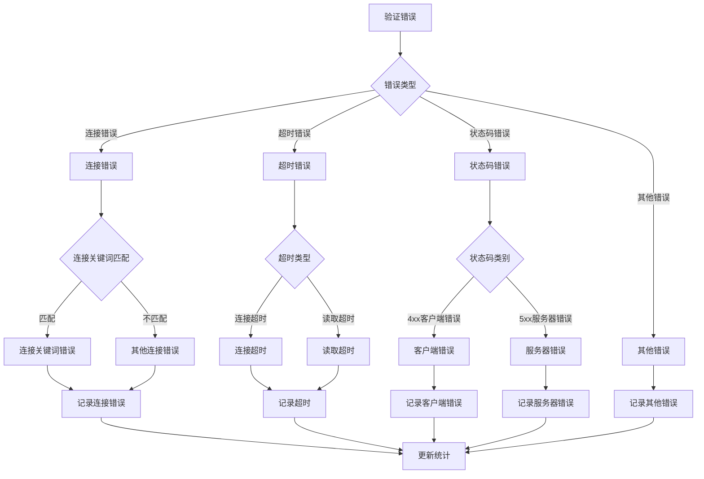
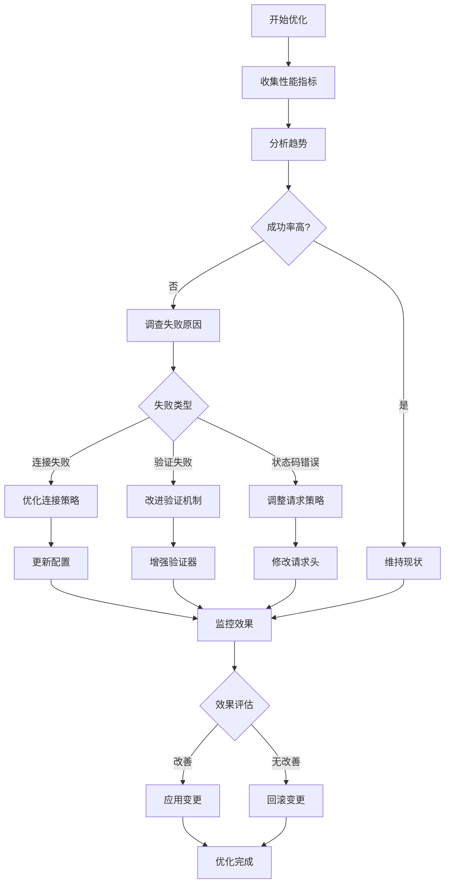

# 验证结果处理与集成

<cite>
**本文档引用的文件**
- [connection_validator.go](file://utlsclient/connection_validator.go)
- [ip_access_controller.go](file://utlsclient/ip_access_controller.go)
- [health_checker.go](file://utlsclient/health_checker.go)
- [connection_manager.go](file://utlsclient/connection_manager.go)
- [utlshotconnpool.go](file://utlsclient/utlshotconnpool.go)
- [constants.go](file://utlsclient/constants.go)
- [utlsclient.go](file://utlsclient/utlsclient.go)
- [whiteblackippool.go](file://remotedomainippool/whiteblackippool.go)
</cite>

## 目录
1. [引言](#引言)
2. [系统架构概览](#系统架构概览)
3. [连接验证器核心机制](#连接验证器核心机制)
4. [状态码处理策略](#状态码处理策略)
5. [IP访问控制器集成](#ip访问控制器集成)
6. [健康检查器协同工作](#健康检查器协同工作)
7. [连接管理器协调](#连接管理器协调)
8. [验证结果处理流程](#验证结果处理流程)
9. [错误分类与重试机制](#错误分类与重试机制)
10. [性能优化与IP池管理](#性能优化与ip池管理)
11. [故障排除指南](#故障排除指南)
12. [总结](#总结)

## 引言

本文档详细阐述了爬虫平台中验证结果处理机制的设计与实现。该系统通过连接验证器、IP访问控制器、健康检查器和连接管理器的协同工作，实现了高效的IP池管理和爬虫请求成功率优化。系统采用多层次的验证策略，包括状态码检查、错误分类、重试机制和动态黑白名单管理，确保网络请求的稳定性和可靠性。

## 系统架构概览

系统采用模块化设计，各组件职责明确，通过接口解耦实现高内聚低耦合的架构。

**图表来源**
- [connection_validator.go](file://utlsclient/connection_validator.go#L10-L15)
- [health_checker.go](file://utlsclient/health_checker.go#L9-L14)
- [ip_access_controller.go](file://utlsclient/ip_access_controller.go#L7-L12)
- [connection_manager.go](file://utlsclient/connection_manager.go#L8-L14)

## 连接验证器核心机制

连接验证器是系统的核心组件，负责执行各种类型的连接验证任务，确保连接的有效性和可用性。

### 验证类型与策略

系统提供多种验证策略，每种策略适用于不同的场景和要求：

**图表来源**
- [connection_validator.go](file://utlsclient/connection_validator.go#L22-L96)
- [connection_validator.go](file://utlsclient/connection_validator.go#L99-L158)
- [connection_validator.go](file://utlsclient/connection_validator.go#L161-L222)

### 验证流程详解

验证过程包含多个关键步骤，确保连接的可靠性和性能：

1. **连接状态检查**：验证连接是否处于健康状态
2. **请求构建**：根据验证类型构建相应的HTTP请求
3. **请求执行**：使用UTLS客户端发送验证请求
4. **响应处理**：解析响应并检查状态码
5. **统计更新**：更新连接的使用统计信息

**章节来源**
- [connection_validator.go](file://utlsclient/connection_validator.go#L22-L96)
- [connection_validator.go](file://utlsclient/connection_validator.go#L99-L222)

## 状态码处理策略

系统对HTTP状态码进行精细化处理，不同状态码对应不同的处理策略和IP池操作。

### 关键状态码定义

| 状态码范围 | 含义 | 处理策略 | IP池操作 |
|-----------|------|----------|----------|
| 200-299 | 成功响应 | 连接正常，可继续使用 | 保持在白名单 |
| 300-399 | 重定向响应 | 临时状态，可能需要特殊处理 | 视情况处理 |
| 400-499 | 客户端错误 | 请求问题，可能需要修正 | 可能加入黑名单 |
| 403 | 禁止访问 | IP被封禁或权限不足 | 加入黑名单 |
| 429 | 请求过于频繁 | 限流响应 | 降低使用频率 |
| 500-599 | 服务器错误 | 服务器问题，可能暂时不可用 | 暂时移除 |

### 状态码处理流程

**图表来源**
- [constants.go](file://utlsclient/constants.go#L17-L27)
- [connection_validator.go](file://utlsclient/connection_validator.go#L84-L95)
- [utlsclient.go](file://utlsclient/utlsclient.go#L22-L35)

**章节来源**
- [constants.go](file://utlsclient/constants.go#L17-L27)
- [connection_validator.go](file://utlsclient/connection_validator.go#L84-L95)

## IP访问控制器集成

IP访问控制器负责管理IP白名单和黑名单，通过严格的访问控制策略确保系统的安全性。

### 访问控制策略

系统采用"黑名单优先，白名单次之，默认拒绝"的访问控制策略：

**图表来源**
- [ip_access_controller.go](file://utlsclient/ip_access_controller.go#L22-L41)
- [whiteblackippool.go](file://remotedomainippool/whiteblackippool.go#L76-L100)

### IP池操作机制

当验证结果影响IP池状态时，系统自动执行相应的IP池操作：

1. **验证成功**：将IP添加到白名单
2. **验证失败**：将IP添加到黑名单
3. **临时失败**：增加错误计数，但不立即加入黑名单
4. **状态恢复**：定期检查并移除不再需要的IP

**章节来源**
- [ip_access_controller.go](file://utlsclient/ip_access_controller.go#L44-L102)
- [whiteblackippool.go](file://remotedomainippool/whiteblackippool.go#L46-L74)

## 健康检查器协同工作

健康检查器与连接验证器紧密协作，形成双重保障机制，确保连接的长期稳定性。

### 健康检查流程

**图表来源**
- [health_checker.go](file://utlsclient/health_checker.go#L23-L60)
- [connection_validator.go](file://utlsclient/connection_validator.go#L241-L262)

### 健康状态评估

健康检查器通过以下指标评估连接健康状态：

1. **错误计数**：连续错误次数超过阈值（默认10次）标记为不健康
2. **空闲时间**：连接空闲时间超过健康检查间隔
3. **连接状态**：直接检查连接的健康标志位

**章节来源**
- [health_checker.go](file://utlsclient/health_checker.go#L23-L60)

## 连接管理器协调

连接管理器负责连接的生命周期管理，与验证系统协同确保连接池的高效运行。

### 连接状态管理

**图表来源**
- [connection_manager.go](file://utlsclient/connection_manager.go#L25-L73)
- [health_checker.go](file://utlsclient/health_checker.go#L91-L164)

### 连接池优化

连接管理器通过以下机制优化连接池性能：

1. **智能清理**：定期清理空闲和过期连接
2. **容量控制**：限制最大连接数和每主机连接数
3. **负载均衡**：在多个可用IP之间分配请求

**章节来源**
- [connection_manager.go](file://utlsclient/connection_manager.go#L141-L217)

## 验证结果处理流程

完整的验证结果处理流程涉及多个组件的协调工作，形成闭环的反馈机制。

### 数据流处理

**图表来源**
- [utlshotconnpool.go](file://utlsclient/utlshotconnpool.go#L629-L723)
- [connection_validator.go](file://utlsclient/connection_validator.go#L225-L239)

### 结果应用机制

验证结果通过以下方式应用到系统中：

1. **实时反馈**：立即更新连接状态和统计数据
2. **批量处理**：定期批量更新IP池状态
3. **阈值触发**：达到特定阈值时触发批量操作
4. **异步处理**：后台异步处理大量验证结果

**章节来源**
- [utlshotconnpool.go](file://utlsclient/utlshotconnpool.go#L629-L723)

## 错误分类与重试机制

系统实现了精细化的错误分类和智能重试机制，提高请求成功率。

### 错误分类体系

**图表来源**
- [utlsclient.go](file://utlsclient/utlsclient.go#L22-L35)
- [constants.go](file://utlsclient/constants.go#L47-L56)

### 重试策略

系统采用指数退避重试策略：

1. **最大重试次数**：默认3次
2. **重试间隔**：1秒开始，每次翻倍
3. **重试条件**：仅对可重试错误进行重试
4. **重试终止**：达到最大重试次数或发生不可重试错误

**章节来源**
- [utlsclient.go](file://utlsclient/utlsclient.go#L80-L118)
- [constants.go](file://utlsclient/constants.go#L40-L45)

## 性能优化与IP池管理

系统通过多种机制优化IP池的可用性和爬虫的请求成功率。

### IP池优化策略

| 优化策略 | 实现方式 | 效果 |
|---------|----------|------|
| 动态权重 | 基于成功率调整IP权重 | 提高高质量IP的使用率 |
| 分层管理 | 按地理位置和ISP分组 | 减少网络延迟 |
| 预热机制 | 新IP预先验证 | 减少首次使用失败 |
| 学习算法 | 基于历史表现调整策略 | 智能预测IP质量 |
| 容量规划 | 动态调整连接池大小 | 平衡性能和资源消耗 |

### 请求成功率优化

**图表来源**
- [health_checker.go](file://utlsclient/health_checker.go#L91-L164)
- [connection_manager.go](file://utlsclient/connection_manager.go#L141-L217)

**章节来源**
- [health_checker.go](file://utlsclient/health_checker.go#L91-L164)
- [connection_manager.go](file://utlsclient/connection_manager.go#L141-L217)

## 故障排除指南

### 常见问题诊断

| 问题症状 | 可能原因 | 排查方法 | 解决方案 |
|---------|----------|----------|----------|
| 连接频繁失败 | IP被列入黑名单 | 检查IP访问控制器状态 | 从黑名单移除或联系管理员 |
| 验证超时 | 网络连接不稳定 | 检查网络连通性 | 调整超时配置或更换IP |
| 状态码403 | IP被封禁 | 查看服务器响应详情 | 使用新的IP或等待解封 |
| 状态码429 | 请求过于频繁 | 检查请求频率 | 降低请求速率或使用代理池 |
| 连接池耗尽 | 连接泄漏 | 监控连接数量 | 检查连接关闭逻辑 |

### 日志分析

系统提供详细的日志记录，帮助快速定位问题：

1. **验证日志**：记录每次验证的详细信息
2. **错误日志**：记录各类错误的堆栈信息
3. **性能日志**：记录响应时间和成功率
4. **状态日志**：记录IP池状态变化

**章节来源**
- [connection_validator.go](file://utlsclient/connection_validator.go#L84-L95)
- [health_checker.go](file://utlsclient/health_checker.go#L36-L44)

## 总结

爬虫平台的验证结果处理机制通过多层次、多维度的验证策略，实现了高效可靠的IP池管理。系统的核心优势包括：

1. **多重验证保障**：连接验证器、健康检查器和IP访问控制器形成三重保障
2. **智能错误处理**：精细化的错误分类和自适应重试机制
3. **动态IP管理**：基于验证结果的实时IP池状态更新
4. **性能优化**：通过统计分析和机器学习算法持续优化请求成功率
5. **故障恢复**：完善的故障检测和自动恢复机制

该系统为爬虫平台提供了稳定可靠的网络基础设施，显著提高了爬虫的运行效率和成功率，同时确保了系统的安全性和稳定性。